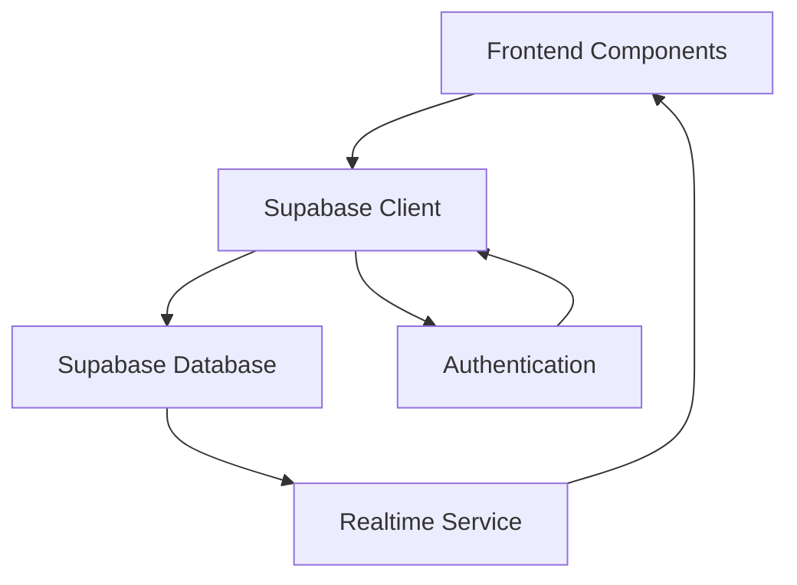
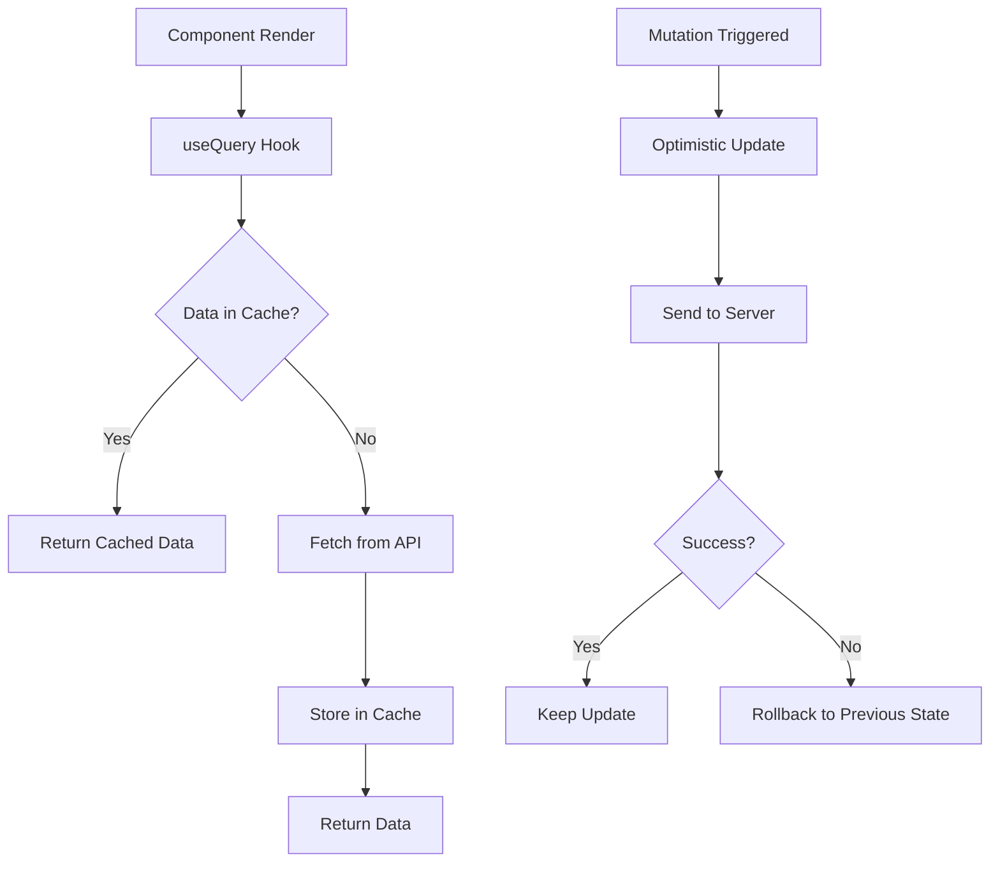
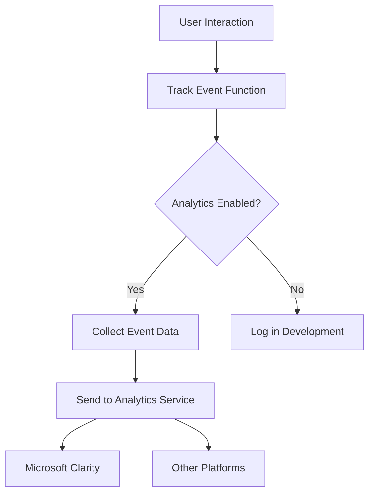
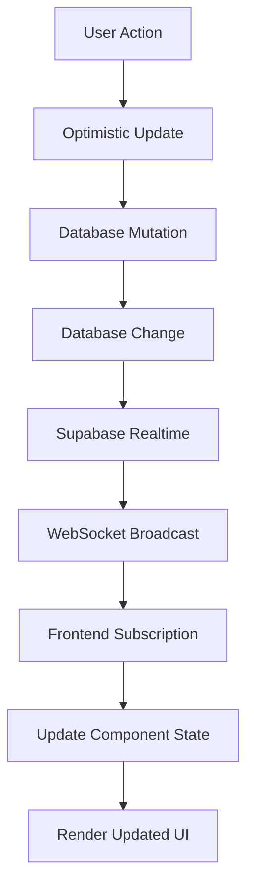
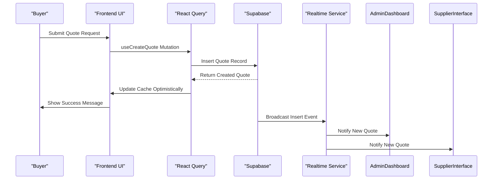
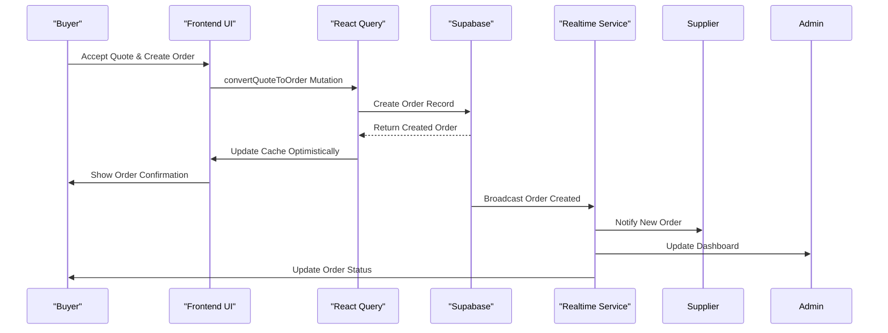
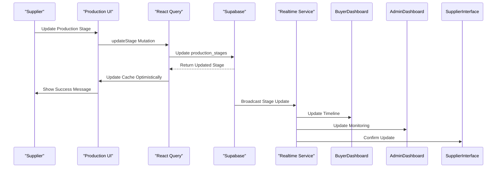
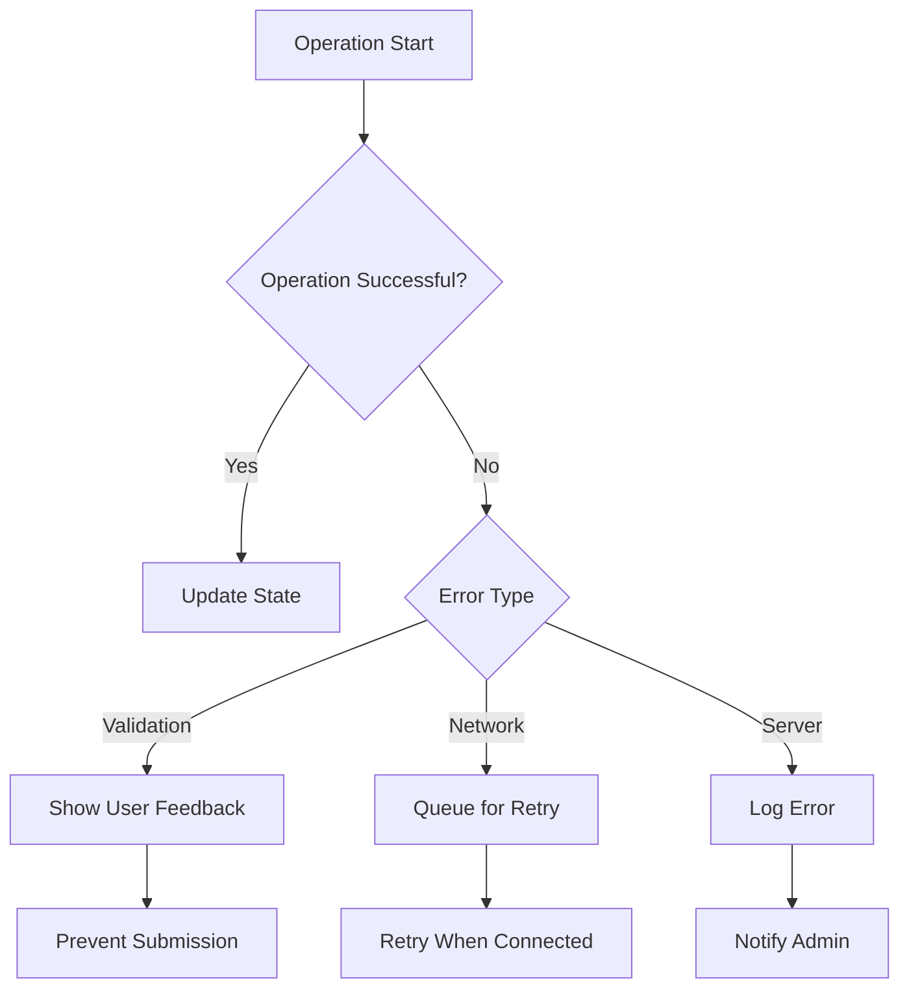

# Data Flow Between Layers

<cite>
**Referenced Files in This Document**   
- [client.ts](file://src/integrations/supabase/client.ts)
- [useQuotes.ts](file://src/hooks/useQuotes.ts)
- [useOrders.ts](file://src/hooks/queries/useOrders.ts)
- [useSupplierOrders.ts](file://src/hooks/useSupplierOrders.ts)
- [useOptimisticUpdate.ts](file://src/hooks/useOptimisticUpdate.ts)
- [supabaseHelpers.ts](file://src/lib/supabaseHelpers.ts)
- [tracker.ts](file://src/lib/analytics/tracker.ts)
- [ProductionUpdatesFeed.tsx](file://src/components/ProductionUpdatesFeed.tsx)
- [useRealtimeMessages.ts](file://src/hooks/useRealtimeMessages.ts)
- [CommunicationCenter.tsx](file://src/components/shared/CommunicationCenter.tsx)
- [ConnectionStatusIndicator.tsx](file://src/components/production/ConnectionStatusIndicator.tsx)
- [database.ts](file://src/types/database.ts)
</cite>

## Table of Contents
1. [Data Flow Architecture Overview](#data-flow-architecture-overview)
2. [Supabase Client Configuration](#supabase-client-configuration)
3. [React Query Implementation](#react-query-implementation)
4. [Unidirectional Data Flow Pattern](#unidirectional-data-flow-pattern)
5. [Analytics Event Flow](#analytics-event-flow)
6. [Data Synchronization and Caching](#data-synchronization-and-caching)
7. [Real-time Updates System](#real-time-updates-system)
8. [Sequence Diagrams](#sequence-diagrams)
9. [Error Handling and Data Integrity](#error-handling-and-data-integrity)

## Data Flow Architecture Overview

The application implements a robust data flow architecture that connects the Supabase database with frontend components through a well-defined pathway. The system follows a unidirectional data flow pattern where user interactions trigger mutations that update the database and propagate changes through real-time subscriptions. This architecture ensures data consistency, provides immediate user feedback, and maintains synchronization across distributed components.

The core data flow begins with user interactions in the frontend components, which trigger React Query mutations. These mutations update the Supabase database and automatically invalidate relevant queries, prompting React Query to refresh data from the server. Simultaneously, real-time subscriptions established through Supabase's Realtime service push updates to all connected clients, ensuring immediate propagation of changes without requiring manual refreshes.

**Section sources**
- [client.ts](file://src/integrations/supabase/client.ts#L1-L20)
- [useQuotes.ts](file://src/hooks/useQuotes.ts#L1-L261)
- [useOrders.ts](file://src/hooks/queries/useOrders.ts#L1-L152)

## Supabase Client Configuration

The Supabase client is configured as a singleton instance that provides authenticated access to the database. The client is initialized with environment variables for the Supabase URL and publishable key, ensuring secure connection to the database. Authentication is handled through Supabase's built-in auth system with localStorage persistence, automatic session refresh, and token management.

The client configuration includes proper error handling and type safety through TypeScript interfaces that define the database schema. This ensures that all database operations are type-checked at compile time, reducing runtime errors and improving developer experience. The client is exported for use across the application, providing a consistent interface for database operations.

**Diagram sources **
- [client.ts](file://src/integrations/supabase/client.ts#L1-L20)
- [database.ts](file://src/types/database.ts#L1-L579)

**Section sources**
- [client.ts](file://src/integrations/supabase/client.ts#L1-L20)
- [database.ts](file://src/types/database.ts#L1-L579)

## React Query Implementation

React Query is implemented as the primary data fetching and state management solution, providing efficient caching, background updates, and automatic refetching. The application uses a structured approach to query keys, organizing them into logical groups for orders, suppliers, quotes, and other entities. This organization enables precise cache invalidation and targeted data refetching.

Query hooks are organized in a modular fashion, with each domain having its own file that exports multiple related hooks. For example, the `useOrders.ts` file exports hooks for fetching individual orders, orders by buyer, orders by factory, and administrative statistics. This modular approach promotes code reuse and maintainability.

Mutation hooks implement optimistic updates with automatic rollback on failure, providing a responsive user experience. When a mutation is triggered, the UI is immediately updated with the expected result, and if the server operation fails, the previous state is restored automatically. This pattern is implemented consistently across the application for quote creation, order updates, and production stage modifications.

**Diagram sources **
- [useOrders.ts](file://src/hooks/queries/useOrders.ts#L1-L152)
- [useQuotes.ts](file://src/hooks/useQuotes.ts#L1-L261)
- [useOptimisticUpdate.ts](file://src/hooks/useOptimisticUpdate.ts#L1-L176)

**Section sources**
- [useOrders.ts](file://src/hooks/queries/useOrders.ts#L1-L152)
- [useQuotes.ts](file://src/hooks/useQuotes.ts#L1-L261)
- [useOptimisticUpdate.ts](file://src/hooks/useOptimisticUpdate.ts#L1-L176)

## Unidirectional Data Flow Pattern

The application follows a strict unidirectional data flow pattern where user interactions trigger a predictable sequence of events. This pattern begins with user actions in the UI components, which dispatch mutations through React Query. These mutations update the Supabase database and automatically trigger real-time events that propagate changes to all subscribed clients.

For quote generation, when a user submits a quote request, the `useCreateQuote` mutation is triggered. This mutation sends the quote data to the Supabase database and automatically invalidates the quotes query, prompting a refresh of the quote list. Simultaneously, real-time subscriptions notify any admin dashboards or supplier interfaces that a new quote is available for review.

For order placement, the process follows a similar pattern. When a buyer accepts a quote and converts it to an order, the mutation updates the database and triggers a series of real-time events. These events update the order status, notify the assigned supplier, and refresh relevant dashboards across the system. The unidirectional flow ensures that all state changes are traceable and predictable.

**Section sources**
- [useQuotes.ts](file://src/hooks/useQuotes.ts#L1-L261)
- [useOrders.ts](file://src/hooks/queries/useOrders.ts#L1-L152)
- [useSupplierOrders.ts](file://src/hooks/useSupplierOrders.ts#L1-L208)

## Analytics Event Flow

The analytics system captures user behavior and business events, sending them to multiple tracking platforms for analysis. User interactions are tracked through the `tracker.ts` module, which provides functions for tracking page views, product interactions, quote attempts, and signup conversions. These events are temporarily disabled in the current implementation but follow a pattern that would send data to analytics platforms when enabled.

The analytics flow begins with user actions in the components, which call tracking functions with relevant event data. These functions collect contextual information such as session ID, page URL, and event parameters, then send the data to the configured analytics services. The system is designed to handle tracking for multiple platforms, including Microsoft Clarity, with fallback mechanisms for environments where tracking resources may be blocked.

Analytics events are structured to provide meaningful insights into user behavior, conversion funnels, and feature usage. For example, quote generation attempts are tracked with success status and error reasons, enabling analysis of friction points in the quoting process. Similarly, page views are tracked with page names, allowing analysis of user navigation patterns and content engagement.

**Diagram sources **
- [tracker.ts](file://src/lib/analytics/tracker.ts#L1-L103)
- [clarityCheck.ts](file://src/lib/analytics/clarityCheck.ts#L1-L124)

**Section sources**
- [tracker.ts](file://src/lib/analytics/tracker.ts#L1-L103)
- [clarityCheck.ts](file://src/lib/analytics/clarityCheck.ts#L1-L124)

## Data Synchronization and Caching

Data synchronization is managed through a combination of React Query's caching mechanism and Supabase's real-time capabilities. React Query provides client-side caching with configurable stale times, automatic background refetching, and intelligent cache invalidation. This reduces unnecessary network requests and provides a responsive user experience.

The caching strategy uses query keys that incorporate entity types, filters, and identifiers, enabling precise cache management. When data is updated through a mutation, specific query keys are invalidated, triggering targeted refetching of only the affected data. This approach minimizes network overhead while ensuring data freshness.

Real-time subscriptions complement the caching strategy by pushing updates to all connected clients immediately. When a record is modified in the database, Supabase's Realtime service broadcasts the change to all subscribed clients, which update their local state accordingly. This ensures that all users see the most current data without requiring manual refreshes or polling.

The system also implements optimistic updates for mutations, where the UI is updated immediately with the expected result before the server operation completes. If the server operation fails, the previous state is automatically restored. This pattern provides immediate feedback to users while maintaining data integrity.

**Section sources**
- [useOrders.ts](file://src/hooks/queries/useOrders.ts#L1-L152)
- [useQuotes.ts](file://src/hooks/useQuotes.ts#L1-L261)
- [supabaseHelpers.ts](file://src/lib/supabaseHelpers.ts#L1-L376)

## Real-time Updates System

The real-time updates system is built on Supabase's Realtime service, which provides WebSocket-based subscriptions to database changes. Components establish subscriptions to specific database tables with filters to receive only relevant events. For example, the `ProductionUpdatesFeed` component subscribes to `order_updates` table changes for a specific order, receiving notifications when new updates are added or existing ones are modified.

The `useRealtimeMessages` hook provides a reusable interface for establishing real-time subscriptions to messages, enabling instant communication between users. When a new message is inserted into the database, all recipients receive the update immediately, creating a chat-like experience. The hook handles subscription lifecycle management, automatically cleaning up subscriptions when components are unmounted.

Connection status is monitored through the `ConnectionStatusIndicator` component, which displays the current connection state to users. This component uses Supabase's Realtime service to detect connection changes and provides visual feedback when the connection is lost or being reestablished. This transparency helps users understand when their actions might be delayed due to connectivity issues.

The real-time system also supports presence functionality, allowing components to detect when other users are viewing the same data. This enables features like collaborative editing and awareness of concurrent modifications, enhancing the collaborative aspects of the platform.

**Diagram sources **
- [ProductionUpdatesFeed.tsx](file://src/components/ProductionUpdatesFeed.tsx#L85-L134)
- [useRealtimeMessages.ts](file://src/hooks/useRealtimeMessages.ts#L1-L61)
- [ConnectionStatusIndicator.tsx](file://src/components/production/ConnectionStatusIndicator.tsx#L38-L75)

**Section sources**
- [ProductionUpdatesFeed.tsx](file://src/components/ProductionUpdatesFeed.tsx#L85-L134)
- [useRealtimeMessages.ts](file://src/hooks/useRealtimeMessages.ts#L1-L61)
- [ConnectionStatusIndicator.tsx](file://src/components/production/ConnectionStatusIndicator.tsx#L38-L75)

## Sequence Diagrams

### Quote Generation Flow

**Diagram sources **
- [useQuotes.ts](file://src/hooks/useQuotes.ts#L112-L160)
- [supabaseHelpers.ts](file://src/lib/supabaseHelpers.ts#L154-L191)

### Order Placement Flow

**Diagram sources **
- [useOrders.ts](file://src/hooks/queries/useOrders.ts#L110-L151)
- [supabaseHelpers.ts](file://src/lib/supabaseHelpers.ts#L33-L106)

### Production Stage Update Flow

**Diagram sources **
- [useOptimisticUpdate.ts](file://src/hooks/useOptimisticUpdate.ts#L79-L125)
- [supabaseHelpers.ts](file://src/lib/supabaseHelpers.ts#L33-L106)

## Error Handling and Data Integrity

The application implements comprehensive error handling to maintain data integrity and provide meaningful feedback to users. All database operations are wrapped in try-catch blocks, with errors handled appropriately based on the context. For mutations, failed operations trigger automatic rollback of optimistic updates, restoring the previous state.

Validation is performed both on the client and server sides to ensure data quality. Client-side validation provides immediate feedback, while server-side validation through Supabase RLS (Row Level Security) and database constraints ensures data integrity at the source. This dual-layer approach prevents invalid data from being stored while providing a responsive user experience.

Network errors and connectivity issues are handled gracefully, with components displaying appropriate status indicators and retry mechanisms. The `ConnectionStatusIndicator` component provides visual feedback about the connection state, helping users understand when their actions might be delayed. When connectivity is lost, mutations are queued and retried when the connection is restored, ensuring no data is lost.

**Diagram sources **
- [useOptimisticUpdate.ts](file://src/hooks/useOptimisticUpdate.ts#L49-L63)
- [useOrderManagement.ts](file://src/hooks/useOrderManagement.ts#L11-L43)
- [useSupplierOrders.ts](file://src/hooks/useSupplierOrders.ts#L29-L37)

**Section sources**
- [useOptimisticUpdate.ts](file://src/hooks/useOptimisticUpdate.ts#L1-L176)
- [useOrderManagement.ts](file://src/hooks/useOrderManagement.ts#L1-L130)
- [useSupplierOrders.ts](file://src/hooks/useSupplierOrders.ts#L1-L208)