# Mutation and State Update Flow

<cite>
**Referenced Files in This Document**
- [useOrderManagement.ts](file://src/hooks/useOrderManagement.ts)
- [useOptimisticUpdate.ts](file://src/hooks/useOptimisticUpdate.ts)
- [useOrders.ts](file://src/hooks/queries/useOrders.ts)
- [ProductionStageCard.tsx](file://src/components/production/ProductionStageCard.tsx)
- [ProductionStageUpdate.tsx](file://src/components/supplier/ProductionStageUpdate.tsx)
- [ProductionUpdateForm.tsx](file://src/components/ProductionUpdateForm.tsx)
- [analytics.ts](file://src/lib/analytics.ts)
- [analyticsTracking.ts](file://src/lib/analyticsTracking.ts)
- [client.ts](file://src/integrations/supabase/client.ts)
</cite>

## Table of Contents
1. [Introduction](#introduction)
2. [Architecture Overview](#architecture-overview)
3. [Optimistic Updates Implementation](#optimistic-updates-implementation)
4. [React Query Mutation Patterns](#react-query-mutation-patterns)
5. [State Management Strategies](#state-management-strategies)
6. [Error Handling and Rollback](#error-handling-and-rollback)
7. [Analytics Integration](#analytics-integration)
8. [Form Submission Best Practices](#form-submission-best-practices)
9. [Step-by-Step Mutation Lifecycle](#step-by-step-mutation-lifecycle)
10. [Performance Considerations](#performance-considerations)
11. [Troubleshooting Guide](#troubleshooting-guide)
12. [Best Practices Summary](#best-practices-summary)

## Introduction

The Sleek Apparels application implements a sophisticated mutation and state update workflow that combines React Query's powerful caching capabilities with optimistic updates to deliver seamless user experiences. This system handles critical business operations such as order management, production stage updates, and form submissions while maintaining data consistency and providing immediate feedback to users.

The architecture leverages Supabase for backend operations, React Query for state management, and custom hooks for specialized mutation patterns. The system implements comprehensive error handling, analytics tracking, and cache invalidation strategies to ensure reliable and performant user interactions.

## Architecture Overview

The mutation and state update system follows a layered architecture that separates concerns between presentation, business logic, and data persistence:

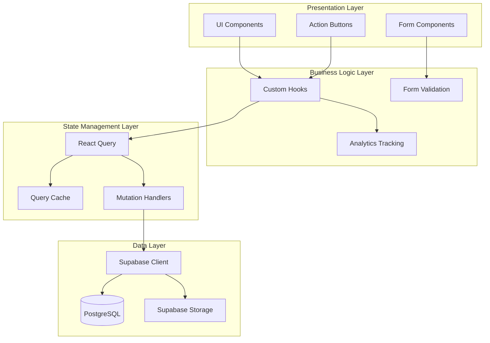

**Diagram sources**
- [ProductionStageCard.tsx](file://src/components/production/ProductionStageCard.tsx#L1-L50)
- [useOptimisticUpdate.ts](file://src/hooks/useOptimisticUpdate.ts#L1-L30)
- [useOrders.ts](file://src/hooks/queries/useOrders.ts#L1-L50)

## Optimistic Updates Implementation

The application implements multiple approaches to optimistic updates, each tailored to specific use cases and data types.

### Custom Optimistic Update Hook

The `useOptimisticUpdate` hook provides a reusable pattern for optimistic updates with automatic rollback capabilities:

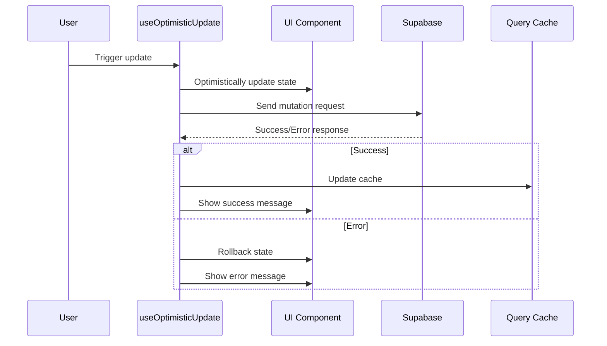

**Diagram sources**
- [useOptimisticUpdate.ts](file://src/hooks/useOptimisticUpdate.ts#L26-L66)

### Production Stage Updates

Specialized hooks for production stage updates demonstrate the flexibility of the optimistic update pattern:

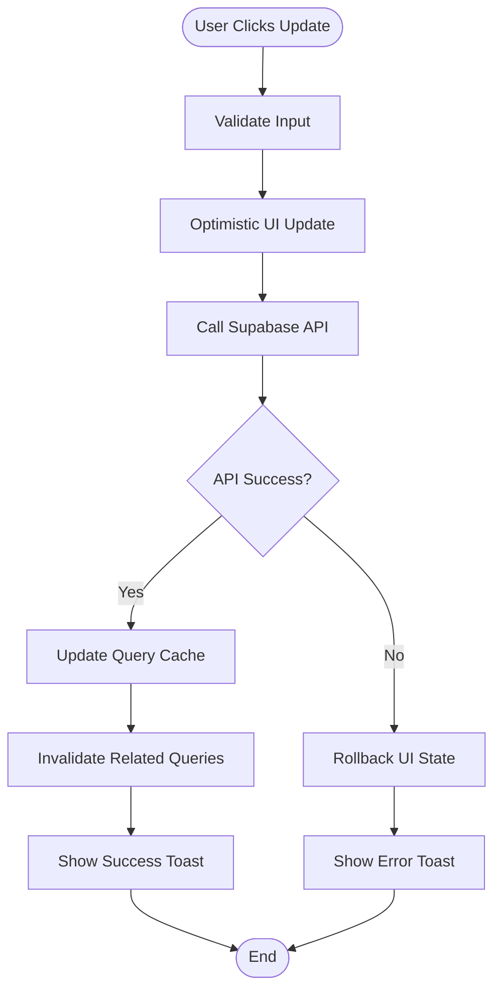

**Diagram sources**
- [ProductionStageCard.tsx](file://src/components/production/ProductionStageCard.tsx#L144-L175)
- [useOptimisticUpdate.ts](file://src/hooks/useOptimisticUpdate.ts#L77-L126)

**Section sources**
- [useOptimisticUpdate.ts](file://src/hooks/useOptimisticUpdate.ts#L1-L176)
- [ProductionStageCard.tsx](file://src/components/production/ProductionStageCard.tsx#L59-L175)

## React Query Mutation Patterns

The application leverages React Query's mutation capabilities with sophisticated callback patterns for comprehensive state management.

### Standard Mutation Pattern

The standard mutation pattern implements the classic onMutate/onError/onSuccess lifecycle:

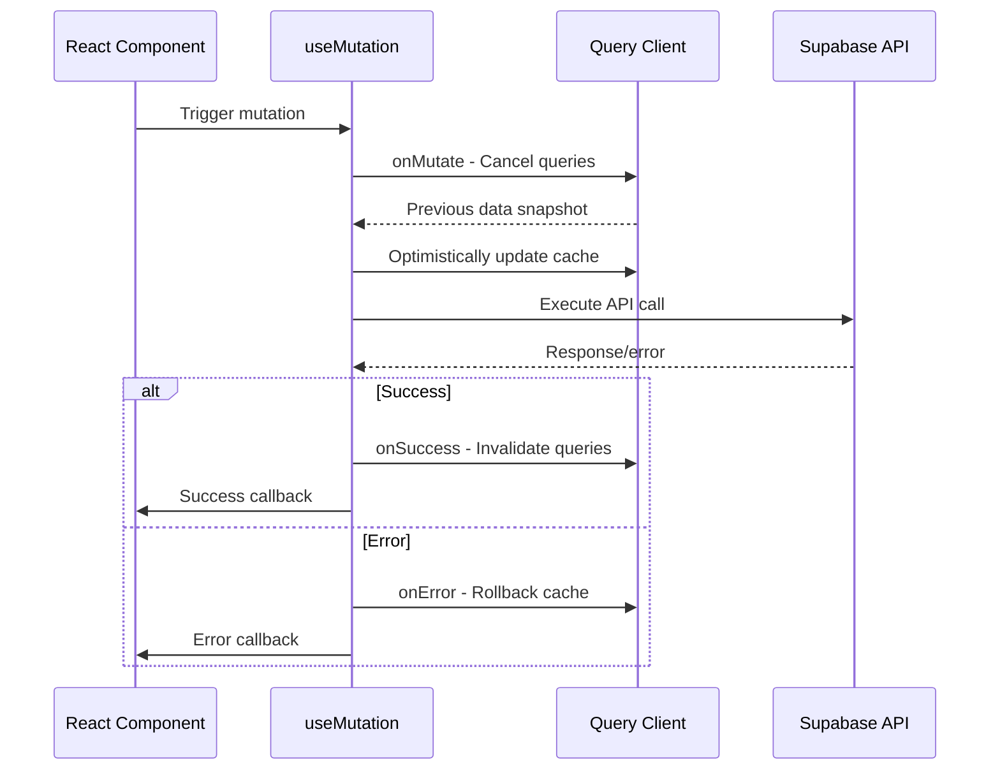

**Diagram sources**
- [useOrders.ts](file://src/hooks/queries/useOrders.ts#L110-L151)

### Advanced Mutation Strategies

The system implements several advanced mutation strategies for different scenarios:

| Strategy | Use Case | Implementation |
|----------|----------|----------------|
| Optimistic Updates | Real-time feedback | Immediate UI update with rollback |
| Query Invalidation | Data consistency | Cache invalidation after successful mutations |
| Error Recovery | Resilient applications | Automatic retry and fallback mechanisms |
| Batch Operations | Multiple related updates | Coordinated mutation execution |

**Section sources**
- [useOrders.ts](file://src/hooks/queries/useOrders.ts#L110-L151)

## State Management Strategies

The application employs multiple state management strategies depending on the complexity and scope of the mutations.

### Local State vs Global State

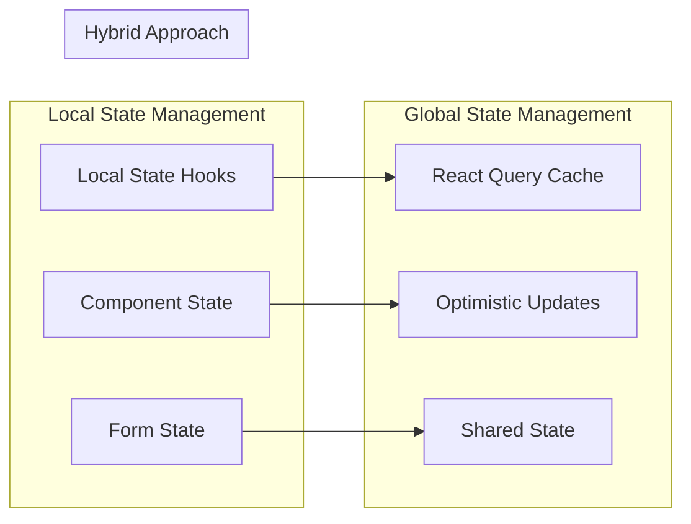

**Diagram sources**
- [useOptimisticUpdate.ts](file://src/hooks/useOptimisticUpdate.ts#L16-L74)
- [ProductionStageCard.tsx](file://src/components/production/ProductionStageCard.tsx#L52-L71)

### Cache Invalidation Patterns

The system implements intelligent cache invalidation to maintain data consistency:

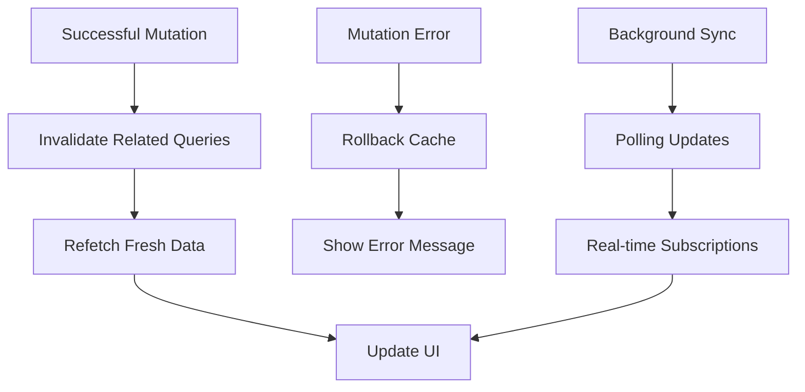

**Diagram sources**
- [useOrders.ts](file://src/hooks/queries/useOrders.ts#L144-L151)

**Section sources**
- [useOptimisticUpdate.ts](file://src/hooks/useOptimisticUpdate.ts#L1-L176)
- [useOrders.ts](file://src/hooks/queries/useOrders.ts#L1-L152)

## Error Handling and Rollback

The application implements comprehensive error handling with automatic rollback capabilities to ensure data integrity.

### Error Handling Strategies

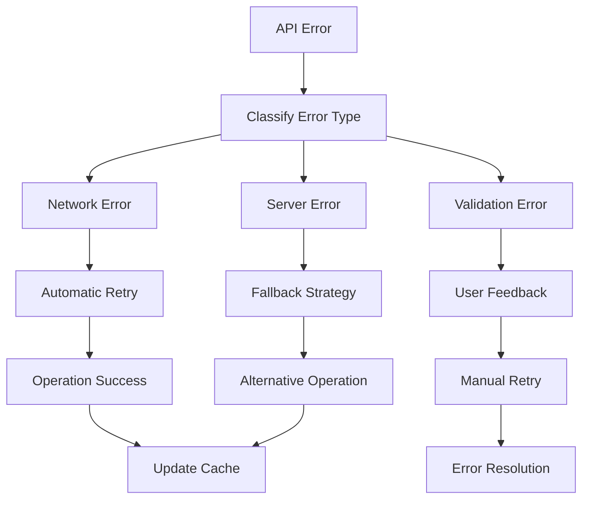

**Diagram sources**
- [useOptimisticUpdate.ts](file://src/hooks/useOptimisticUpdate.ts#L49-L66)

### Rollback Mechanisms

The rollback system ensures that failed mutations don't leave the application in an inconsistent state:

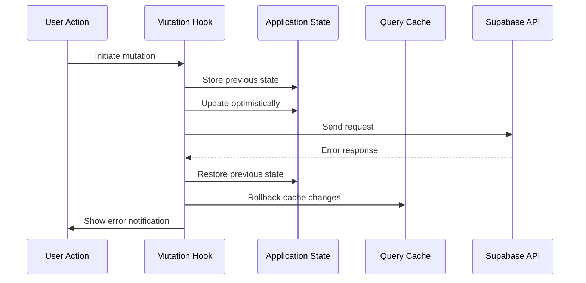

**Diagram sources**
- [useOptimisticUpdate.ts](file://src/hooks/useOptimisticUpdate.ts#L50-L62)

**Section sources**
- [useOptimisticUpdate.ts](file://src/hooks/useOptimisticUpdate.ts#L49-L66)

## Analytics Integration

The mutation system integrates with comprehensive analytics tracking to monitor user behavior and system performance.

### Analytics Event Tracking

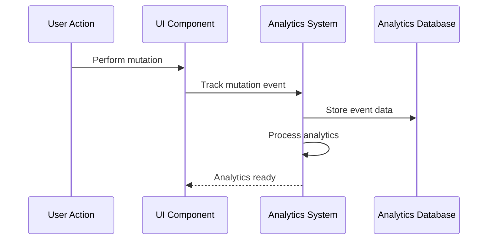

**Diagram sources**
- [analyticsTracking.ts](file://src/lib/analyticsTracking.ts#L17-L81)

### Event Categories and Properties

The analytics system tracks various categories of events:

| Event Category | Examples | Properties |
|----------------|----------|------------|
| Engagement | Button clicks, form interactions | User ID, timestamp, action type |
| Conversion | Successful mutations, form submissions | Success status, conversion funnel |
| Navigation | Page transitions during mutations | Source page, destination page |
| Error | Failed mutations, validation errors | Error type, error message |

**Section sources**
- [analytics.ts](file://src/lib/analytics.ts#L1-L183)
- [analyticsTracking.ts](file://src/lib/analyticsTracking.ts#L1-L130)

## Form Submission Best Practices

The application implements robust form submission patterns with validation, error handling, and user feedback.

### Form Validation Pipeline

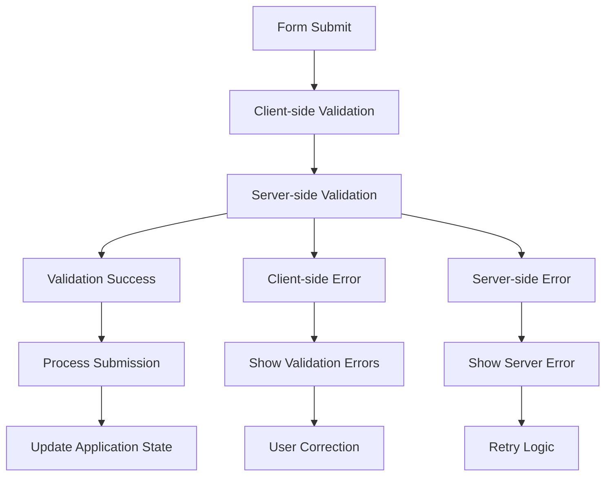

**Diagram sources**
- [ProductionUpdateForm.tsx](file://src/components/ProductionUpdateForm.tsx#L48-L105)

### Duplicate Prevention Strategies

The system implements multiple strategies to prevent duplicate form submissions:

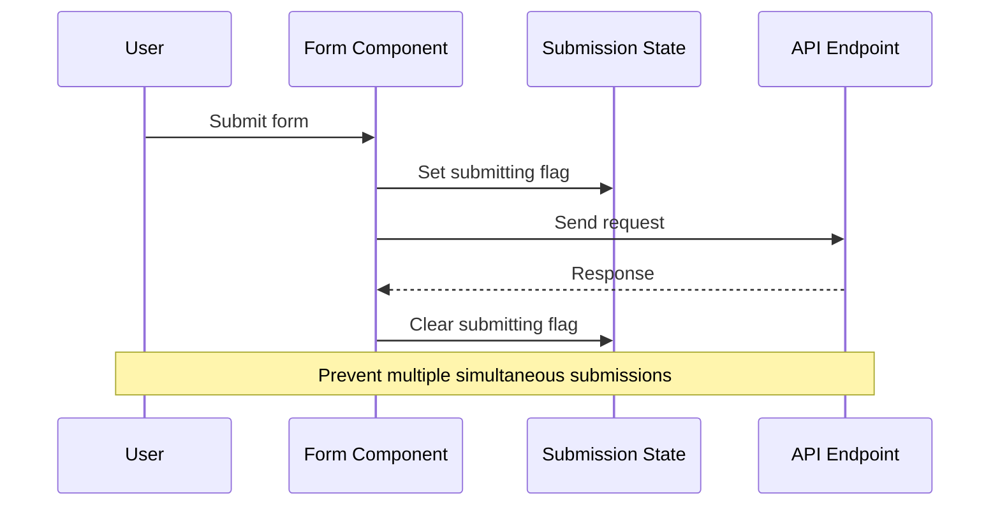

**Diagram sources**
- [ProductionUpdateForm.tsx](file://src/components/ProductionUpdateForm.tsx#L48-L105)

**Section sources**
- [ProductionUpdateForm.tsx](file://src/components/ProductionUpdateForm.tsx#L1-L209)

## Step-by-Step Mutation Lifecycle

Understanding the complete mutation lifecycle is crucial for implementing reliable user experiences.

### Typical Mutation Workflow

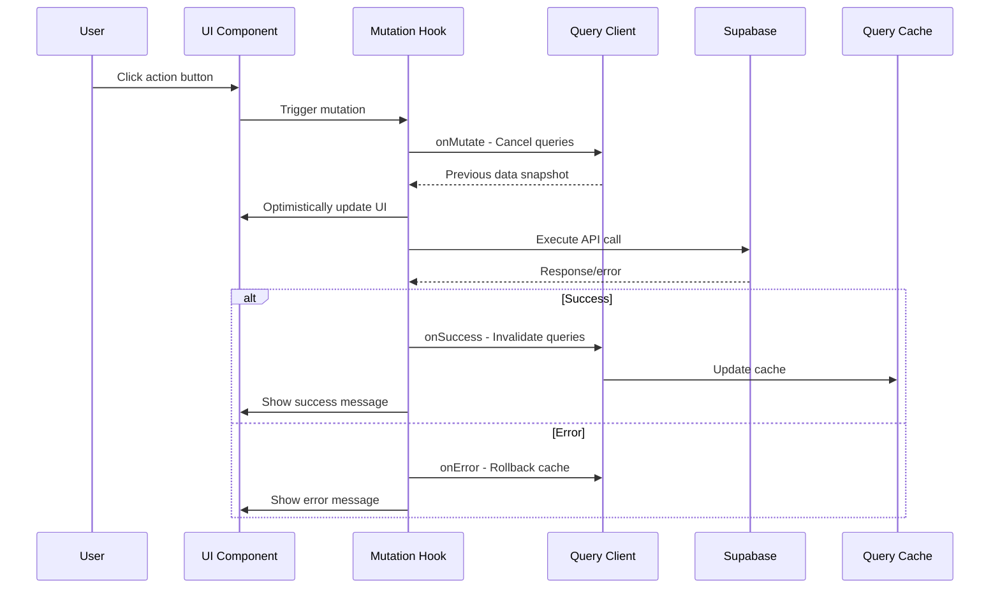

**Diagram sources**
- [useOrders.ts](file://src/hooks/queries/useOrders.ts#L113-L151)
- [ProductionStageCard.tsx](file://src/components/production/ProductionStageCard.tsx#L144-L175)

### Button Click to Database Update

The journey from button click to database update involves multiple stages:

1. **User Interaction**: User clicks the update button
2. **State Preparation**: Component prepares mutation state
3. **Optimistic Update**: UI reflects changes immediately
4. **API Communication**: Supabase receives the mutation request
5. **Database Processing**: PostgreSQL executes the update
6. **Response Handling**: Application processes the response
7. **Cache Synchronization**: Query cache is updated
8. **User Feedback**: Success/error messages are displayed

**Section sources**
- [ProductionStageCard.tsx](file://src/components/production/ProductionStageCard.tsx#L107-L209)
- [useOrders.ts](file://src/hooks/queries/useOrders.ts#L110-L151)

## Performance Considerations

The mutation system is designed with performance optimization in mind, implementing several strategies to ensure responsive user experiences.

### Optimization Strategies

| Strategy | Implementation | Benefits |
|----------|----------------|----------|
| Query Cancellation | Cancel ongoing requests | Prevents stale data |
| Selective Invalidation | Targeted cache updates | Reduces unnecessary refetches |
| Debounced Updates | Throttle rapid mutations | Improves responsiveness |
| Background Sync | Real-time subscriptions | Keeps data fresh |

### Memory Management

The system implements efficient memory management for large datasets:

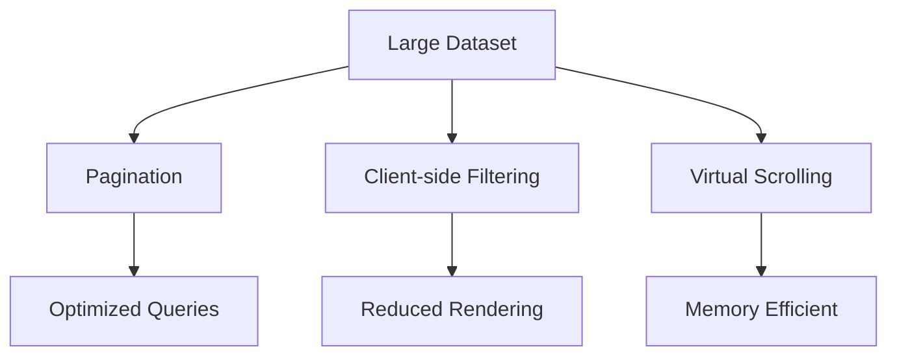

## Troubleshooting Guide

Common issues and their solutions when working with the mutation system.

### Common Issues

| Issue | Symptoms | Solution |
|-------|----------|----------|
| Stale Data | Outdated information displayed | Manually invalidate queries |
| Duplicate Submissions | Multiple API calls | Implement submission locking |
| Cache Inconsistency | Conflicting data states | Review cache invalidation logic |
| Error Handling | Silent failures | Add comprehensive error logging |

### Debugging Tools

The system provides several debugging capabilities:

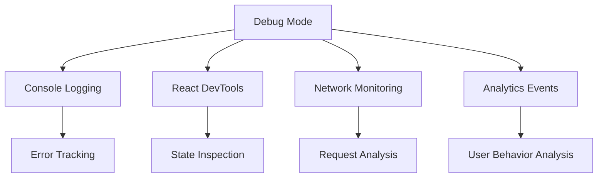

**Section sources**
- [useOptimisticUpdate.ts](file://src/hooks/useOptimisticUpdate.ts#L50-L62)

## Best Practices Summary

### Implementation Guidelines

1. **Always use optimistic updates** for user-initiated actions that can succeed quickly
2. **Implement comprehensive error handling** with automatic rollback capabilities
3. **Track analytics events** for all significant user actions
4. **Prevent duplicate submissions** through state management
5. **Use appropriate cache invalidation** strategies
6. **Provide clear user feedback** for all mutation outcomes
7. **Validate data** both client-side and server-side
8. **Monitor performance** and optimize frequently used mutations

### Code Organization

Structure your mutation code following these patterns:

```typescript
// Use specialized hooks for different data types
const { data, isUpdating, update } = useOptimisticUpdate(initialData, updateFn);

// Implement proper error boundaries
try {
  await mutation();
} catch (error) {
  handleError(error);
}

// Track analytics events
trackEvent('mutation_success', 'order_update', { orderId });
```

### Testing Strategies

Implement comprehensive testing for mutation workflows:

- Unit tests for individual mutation functions
- Integration tests for complete user journeys
- E2E tests for real-world scenarios
- Performance tests for high-frequency mutations

The mutation and state update system in Sleek Apparels demonstrates enterprise-grade patterns for handling complex user interactions while maintaining data consistency and providing excellent user experiences. By following these patterns and best practices, developers can build reliable and performant applications that scale with user demand.