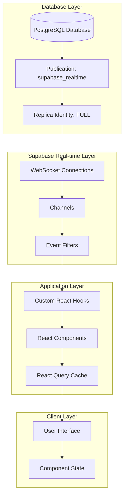
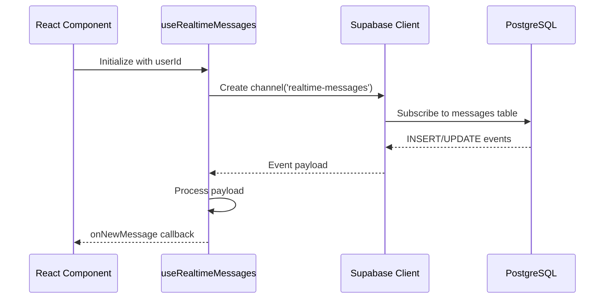
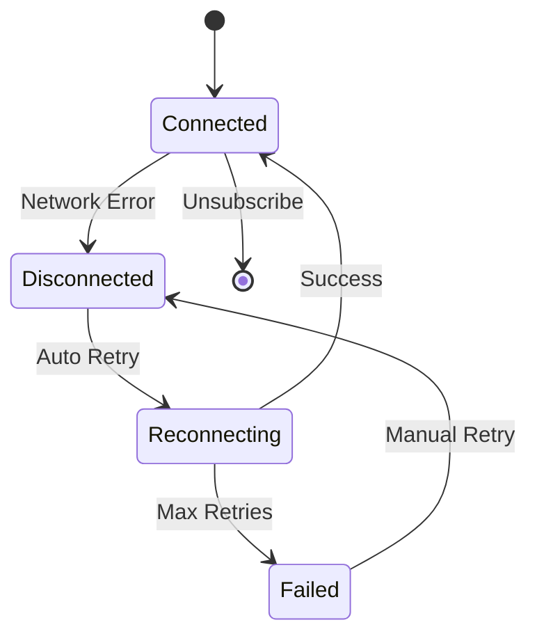
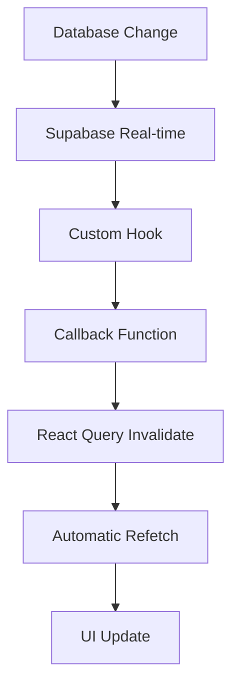

# Real-time Data Synchronization System Architecture

<cite>
**Referenced Files in This Document**
- [useRealtimeMessages.ts](file://src/hooks/useRealtimeMessages.ts)
- [useOrderManagement.ts](file://src/hooks/useOrderManagement.ts)
- [ProductionUpdatesFeed.tsx](file://src/components/ProductionUpdatesFeed.tsx)
- [CommunicationCenter.tsx](file://src/components/shared/CommunicationCenter.tsx)
- [ConnectionStatusIndicator.tsx](file://src/components/production/ConnectionStatusIndicator.tsx)
- [client.ts](file://src/integrations/supabase/client.ts)
- [supabaseHelpers.ts](file://src/lib/supabaseHelpers.ts)
- [types.ts](file://src/integrations/supabase/types.ts)
- [261eea9c-4366-46d4-bb30-fed5b5f232a6.sql](file://supabase/migrations/20251121033912_261eea9c-4366-46d4-bb30-fed5b5f232a6.sql)
</cite>

## Table of Contents
1. [Introduction](#introduction)
2. [System Architecture Overview](#system-architecture-overview)
3. [Supabase Real-time Infrastructure](#supabase-real-time-infrastructure)
4. [Core Real-time Hooks](#core-real-time-hooks)
5. [Event Filtering and Subscription Management](#event-filtering-and-subscription-management)
6. [Connection Management and Reliability](#connection-management-and-reliability)
7. [React Query Integration](#react-query-integration)
8. [Error Handling and Recovery](#error-handling-and-recovery)
9. [Performance Considerations](#performance-considerations)
10. [Implementation Patterns](#implementation-patterns)
11. [Troubleshooting Guide](#troubleshooting-guide)
12. [Conclusion](#conclusion)

## Introduction

The Sleek Apparels real-time data synchronization system leverages Supabase's native PostgreSQL-based real-time capabilities to provide instant updates to connected clients without traditional polling mechanisms. This architecture enables seamless communication between database changes and user interfaces, ensuring data consistency and optimal user experience across order management, messaging, and production tracking systems.

The system operates on a publish-subscribe pattern where database changes trigger real-time events that are efficiently propagated to subscribed clients through WebSocket connections. This approach eliminates the need for constant polling while maintaining strong consistency guarantees through PostgreSQL's replication system.

## System Architecture Overview

The real-time synchronization system follows a layered architecture that separates concerns between data persistence, real-time messaging, and presentation layers:



**Diagram sources**
- [client.ts](file://src/integrations/supabase/client.ts#L14-L20)
- [useRealtimeMessages.ts](file://src/hooks/useRealtimeMessages.ts#L23-L51)
- [ProductionUpdatesFeed.tsx](file://src/components/ProductionUpdatesFeed.tsx#L55-L125)

**Section sources**
- [client.ts](file://src/integrations/supabase/client.ts#L1-L20)
- [types.ts](file://src/integrations/supabase/types.ts#L1-L800)

## Supabase Real-time Infrastructure

### WebSocket Connection Management

The system establishes persistent WebSocket connections through Supabase's client library, which handles connection pooling, automatic reconnection, and message queuing. The connection lifecycle is managed transparently by the Supabase client, ensuring reliable delivery of real-time events.

### Publication and Replication Setup

Database tables requiring real-time updates must be configured with specific replication settings:

```sql
-- Enable full replica identity for change tracking
ALTER TABLE public.production_stages REPLICA IDENTITY FULL;
ALTER PUBLICATION supabase_realtime ADD TABLE public.production_stages;

-- Enable real-time for order updates
ALTER TABLE public.order_updates REPLICA IDENTITY FULL;
ALTER PUBLICATION supabase_realtime ADD TABLE public.order_updates;
```

These configurations ensure that all row changes (INSERT, UPDATE, DELETE) are captured and replicated to subscribed clients.

### Channel-Based Event Routing

Supabase organizes real-time events into channels, allowing fine-grained control over event distribution. Each channel can have multiple listeners, and events are routed based on table, schema, and custom filters.

**Section sources**
- [261eea9c-4366-46d4-bb30-fed5b5f232a6.sql](file://supabase/migrations/20251121033912_261eea9c-4366-46d4-bb30-fed5b5f232a6.sql#L1-L7)

## Core Real-time Hooks

### useRealtimeMessages Hook

The `useRealtimeMessages` hook demonstrates the fundamental pattern for subscribing to message-related database changes:



**Diagram sources**
- [useRealtimeMessages.ts](file://src/hooks/useRealtimeMessages.ts#L23-L51)

The hook establishes subscriptions for both INSERT and UPDATE events on the messages table, with recipient-specific filtering. It provides automatic cleanup through React's useEffect cleanup mechanism.

### useOrderManagement Hook

While primarily focused on CRUD operations, the `useOrderManagement` hook integrates with the real-time system through database triggers and stored procedures that emit change events.

**Section sources**
- [useRealtimeMessages.ts](file://src/hooks/useRealtimeMessages.ts#L1-L61)
- [useOrderManagement.ts](file://src/hooks/useOrderManagement.ts#L1-L130)

## Event Filtering and Subscription Management

### Table-Level Subscriptions

The system creates targeted subscriptions for specific database tables, minimizing bandwidth usage and improving performance:

| Table | Events | Filter | Purpose |
|-------|--------|---------|---------|
| messages | INSERT, UPDATE | `recipient_id=eq.{userId}` | Personalized message delivery |
| order_updates | INSERT, UPDATE | `order_id=eq.{orderId}` | Production stage tracking |
| notifications | INSERT, UPDATE | `user_id=eq.{userId}` | User-specific alerts |

### Dynamic Filter Construction

Filters are constructed dynamically based on user context and application requirements:

```typescript
// Message filtering by recipient
filter: `recipient_id=eq.${userId}`

// Order update filtering by order
filter: `order_id=eq.${orderId}`
```

### Multi-Channel Architecture

Different functional areas maintain separate channels to prevent event collision and enable targeted cleanup:

- `realtime-messages` - General messaging
- `order-updates-changes` - Production updates
- `messages-sent` - Outgoing messages
- `messages-received` - Incoming messages

**Section sources**
- [useRealtimeMessages.ts](file://src/hooks/useRealtimeMessages.ts#L30-L32)
- [ProductionUpdatesFeed.tsx](file://src/components/ProductionUpdatesFeed.tsx#L56-L64)
- [CommunicationCenter.tsx](file://src/components/shared/CommunicationCenter.tsx#L52-L75)

## Connection Management and Reliability

### Automatic Reconnection Logic

The Supabase client implements robust reconnection mechanisms that handle network interruptions, server restarts, and temporary connectivity issues:



### Connection Status Monitoring

The `ConnectionStatusIndicator` component provides visual feedback on connection health:

```typescript
// Connection monitoring implementation
const channel = supabase.channel('connection-monitor')
  .on('system', { event: 'CHANNEL_ERROR' }, () => {
    setIsConnected(false);
    setIsReconnecting(true);
  })
  .subscribe((status) => {
    if (status === 'SUBSCRIBED') {
      setIsConnected(true);
      setIsReconnecting(false);
    } else if (status === 'CHANNEL_ERROR' || status === 'TIMED_OUT') {
      setIsConnected(false);
    }
  });
```

### Periodic Health Checks

The system performs periodic connection validation to detect and recover from silent failures:

```typescript
// 30-second health checks
const interval = setInterval(checkConnection, 30000);
```

**Section sources**
- [ConnectionStatusIndicator.tsx](file://src/components/production/ConnectionStatusIndicator.tsx#L15-L48)
- [ConnectionStatusIndicator.tsx](file://src/components/production/ConnectionStatusIndicator.tsx#L38-L75)

## React Query Integration

### Cache Invalidation Strategy

Real-time updates trigger React Query cache invalidation to ensure UI consistency:



**Diagram sources**
- [CommunicationCenter.tsx](file://src/components/shared/CommunicationCenter.tsx#L59-L74)

### Optimistic Updates

The system implements optimistic updates for immediate user feedback, with rollback capabilities for failed operations:

```typescript
// Optimistic update pattern
const previousData = queryClient.getQueryData(queryKey);
queryClient.setQueryData(queryKey, updatedData);

// Rollback on error
if (error) {
  queryClient.setQueryData(queryKey, previousData);
}
```

### Query Key Management

Consistent query keys enable efficient cache management and targeted invalidation across the application.

**Section sources**
- [CommunicationCenter.tsx](file://src/components/shared/CommunicationCenter.tsx#L37-L78)

## Error Handling and Recovery

### Graceful Degradation

When real-time connections fail, the system falls back to polling-based approaches to maintain functionality:

```typescript
// Fallback polling mechanism
const fetchMessages = async () => {
  try {
    const { data, error } = await supabase.from('messages')
      .select('*')
      .or(`sender_id.eq.${userId},recipient_id.eq.${userId}`)
      .order('created_at', { ascending: false });
    
    if (error) throw error;
    setMessages(data || []);
  } catch (error) {
    // Fallback to manual polling
    setTimeout(fetchMessages, 30000);
  }
};
```

### Error Boundary Implementation

The system includes comprehensive error boundaries to prevent cascade failures:

```typescript
// Error boundary pattern
try {
  // Real-time operation
} catch (error) {
  // Log error and show user-friendly message
  console.error('Real-time error:', error);
  toast.error('Failed to connect to real-time service');
}
```

### Retry Mechanisms

Exponential backoff and circuit breaker patterns prevent system overload during sustained failures.

**Section sources**
- [CommunicationCenter.tsx](file://src/components/shared/CommunicationCenter.tsx#L90-L119)
- [ConnectionStatusIndicator.tsx](file://src/components/production/ConnectionStatusIndicator.tsx#L15-L22)

## Performance Considerations

### Bandwidth Optimization

The system minimizes bandwidth usage through:

- Selective event filtering
- Efficient payload serialization
- Connection pooling
- Compression of large payloads

### Memory Management

Proper cleanup prevents memory leaks in long-running applications:

```typescript
// Cleanup pattern
return () => {
  channel.unsubscribe();
  supabase.removeChannel(channel);
  clearInterval(interval);
};
```

### Scalability Patterns

The architecture scales horizontally through:

- Stateless channel management
- Load-balanced WebSocket connections
- Database partitioning for large datasets
- Intelligent event routing

### Monitoring and Metrics

Key performance indicators include:

- Connection establishment time
- Event delivery latency
- Memory usage patterns
- Error rates and retry counts

**Section sources**
- [useRealtimeMessages.ts](file://src/hooks/useRealtimeMessages.ts#L55-L57)
- [ProductionUpdatesFeed.tsx](file://src/components/ProductionUpdatesFeed.tsx#L128-L130)
- [CommunicationCenter.tsx](file://src/components/shared/CommunicationCenter.tsx#L85-L87)

## Implementation Patterns

### Hook Composition Pattern

Custom hooks encapsulate real-time logic while providing flexible APIs:

```typescript
// Pattern: Encapsulated real-time logic
export const useRealtimeMessages = (userId: string | undefined, onNewMessage?: Callback) => {
  // Real-time setup
  // Cleanup management
  return { channel };
};
```

### Component Integration Pattern

Components integrate real-time functionality through declarative hooks:

```typescript
// Pattern: Declarative integration
const MessagesComponent = ({ userId }) => {
  const { channel } = useRealtimeMessages(userId, handleMessage);
  
  useEffect(() => {
    // Component lifecycle
  }, [channel]);
};
```

### Event Processing Pipeline

Real-time events follow a standardized processing pipeline:

1. **Event Reception** - Raw database change event
2. **Payload Validation** - Schema verification
3. **Data Transformation** - Type conversion and enrichment
4. **State Update** - React state or query cache updates
5. **UI Notification** - User feedback and visual updates

**Section sources**
- [useRealtimeMessages.ts](file://src/hooks/useRealtimeMessages.ts#L17-L61)
- [ProductionUpdatesFeed.tsx](file://src/components/ProductionUpdatesFeed.tsx#L46-L131)
- [CommunicationCenter.tsx](file://src/components/shared/CommunicationCenter.tsx#L44-L87)

## Troubleshooting Guide

### Common Issues and Solutions

| Issue | Symptoms | Solution |
|-------|----------|----------|
| Connection Drops | UI not updating | Check network connectivity, verify authentication |
| Missing Events | Intermittent updates | Review filter conditions, check publication settings |
| Memory Leaks | Increasing memory usage | Verify cleanup in useEffect hooks |
| Performance Issues | Slow UI updates | Optimize filters, reduce subscription count |

### Debugging Tools

- Browser developer tools for WebSocket inspection
- Supabase dashboard for connection monitoring
- Console logging for event flow tracking
- React DevTools for state debugging

### Monitoring Best Practices

- Implement comprehensive logging for production environments
- Set up alerting for connection failures
- Monitor event delivery latency
- Track subscription growth and cleanup effectiveness

**Section sources**
- [ConnectionStatusIndicator.tsx](file://src/components/production/ConnectionStatusIndicator.tsx#L15-L48)
- [CommunicationCenter.tsx](file://src/components/shared/CommunicationCenter.tsx#L111-L119)

## Conclusion

The real-time data synchronization system represents a sophisticated implementation of modern web architecture principles, combining the reliability of PostgreSQL's replication system with the efficiency of WebSocket technology. Through careful abstraction layers, robust error handling, and performance optimization, the system delivers a seamless user experience while maintaining data consistency and system reliability.

The modular architecture enables easy extension and maintenance, while the comprehensive error handling ensures graceful degradation under adverse conditions. As the application scales, the system's design patterns provide clear pathways for optimization and enhancement, ensuring continued performance and reliability.

Future enhancements may include advanced filtering capabilities, improved caching strategies, and enhanced monitoring and observability features to support growing user bases and complex business requirements.