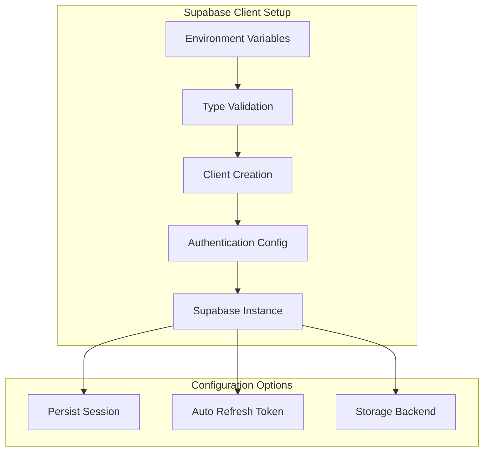
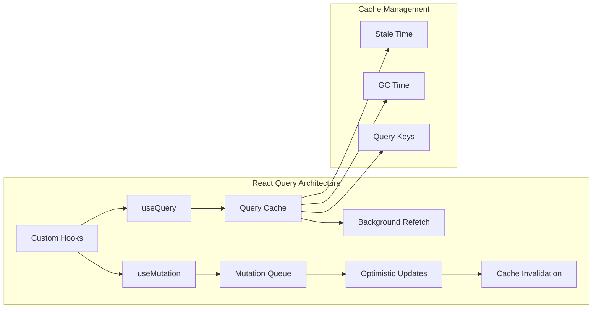
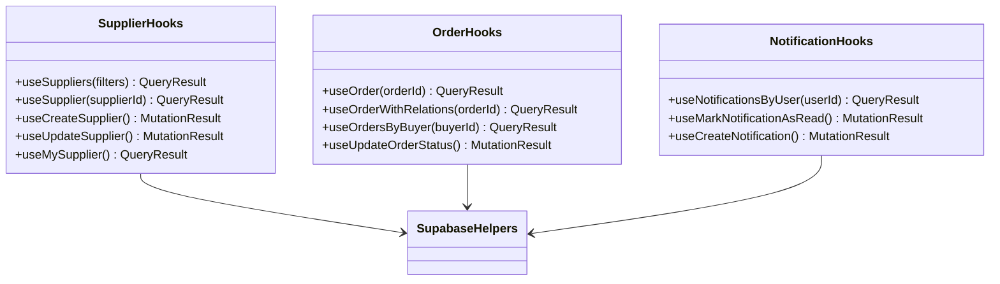
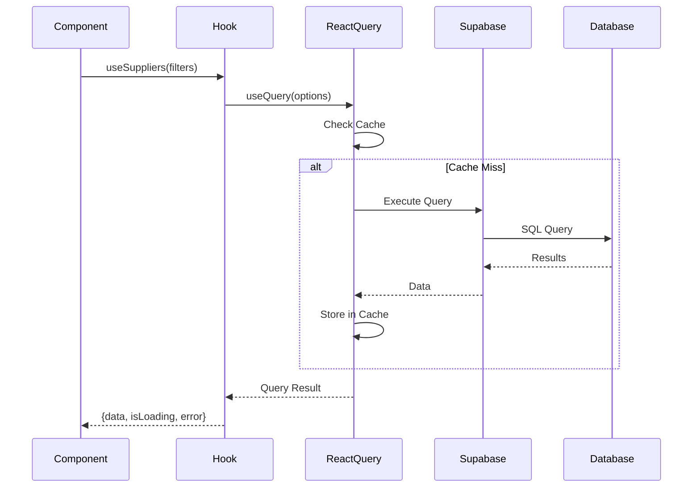
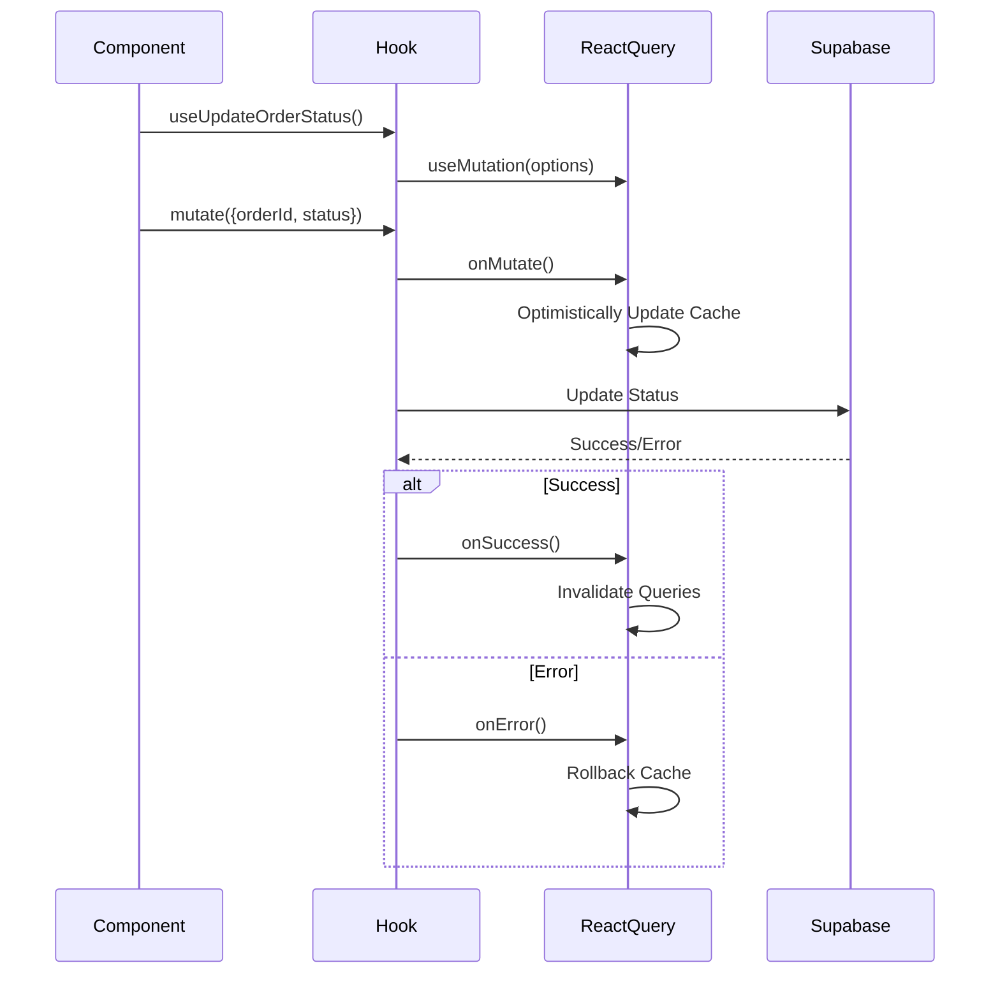
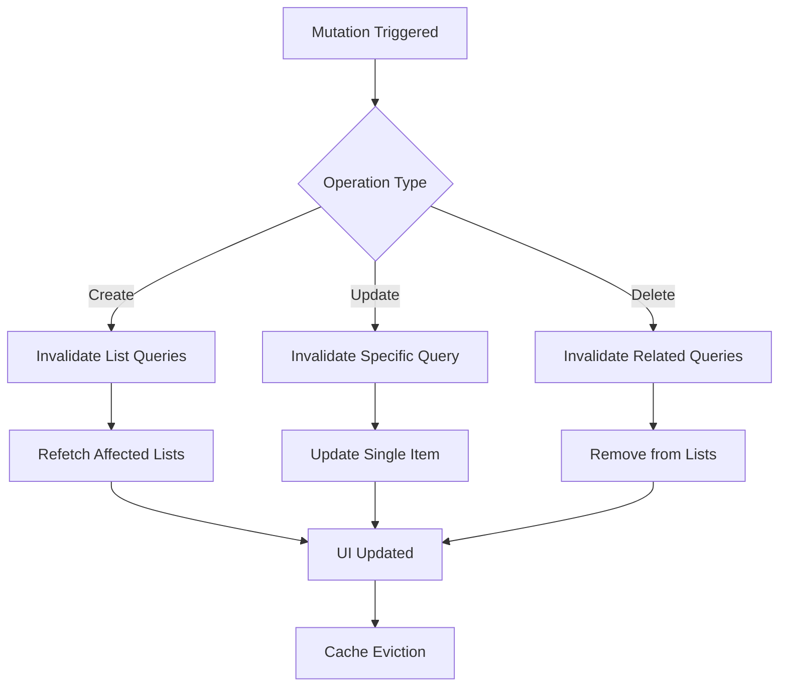
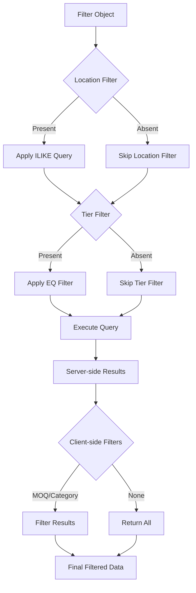
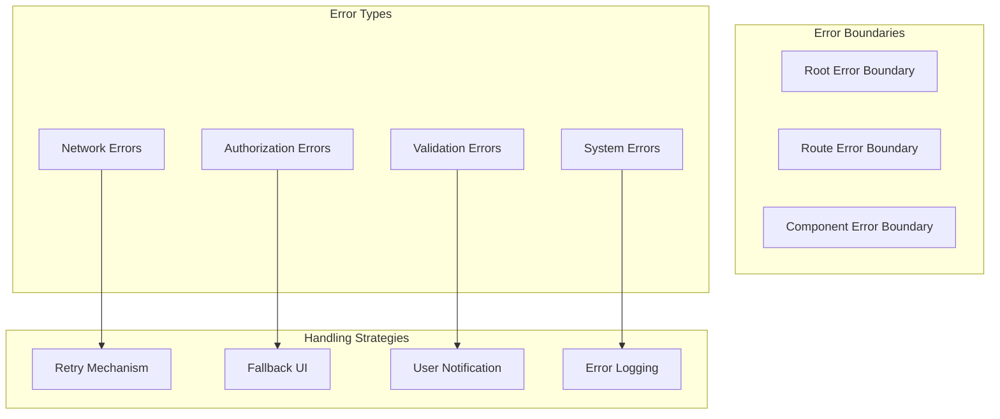
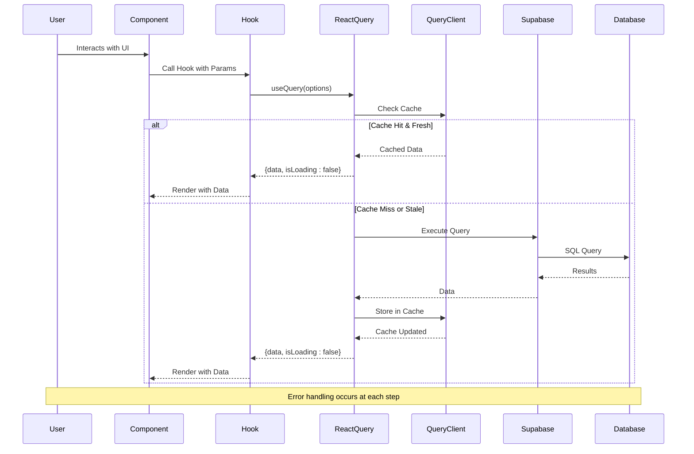
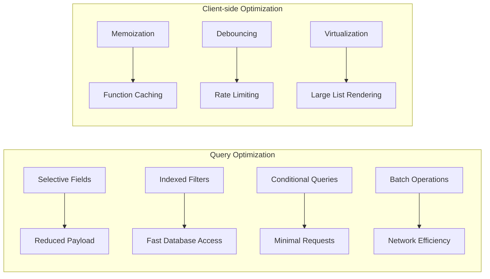

# Supabase to React Query Data Flow

<cite>
**Referenced Files in This Document**
- [src/integrations/supabase/client.ts](file://src/integrations/supabase/client.ts)
- [src/hooks/queries/useSuppliers.ts](file://src/hooks/queries/useSuppliers.ts)
- [src/hooks/queries/useOrders.ts](file://src/hooks/queries/useOrders.ts)
- [src/hooks/queries/useNotifications.ts](file://src/hooks/queries/useNotifications.ts)
- [src/hooks/queries/index.ts](file://src/hooks/queries/index.ts)
- [src/lib/supabaseHelpers.ts](file://src/lib/supabaseHelpers.ts)
- [src/hooks/useSuppliers.ts](file://src/hooks/useSuppliers.ts)
- [src/pages/SupplierDirectory.tsx](file://src/pages/SupplierDirectory.tsx)
- [src/hooks/useProducts.ts](file://src/hooks/useProducts.ts)
- [src/hooks/useOptimisticUpdate.ts](file://src/hooks/useOptimisticUpdate.ts)
</cite>

## Table of Contents
1. [Introduction](#introduction)
2. [Supabase Client Initialization](#supabase-client-initialization)
3. [React Query Integration](#react-query-integration)
4. [Custom Hooks Architecture](#custom-hooks-architecture)
5. [Data Fetching Patterns](#data-fetching-patterns)
6. [Mutation Operations](#mutation-operations)
7. [Caching Strategies](#caching-strategies)
8. [Filtering and Transformations](#filtering-and-transformations)
9. [Error Handling and Loading States](#error-handling-and-loading-states)
10. [Data Flow Sequence](#data-flow-sequence)
11. [Performance Optimization](#performance-optimization)
12. [Best Practices](#best-practices)

## Introduction

The Sleek Apparels application implements a sophisticated data flow architecture that seamlessly connects Supabase database operations with React components through React Query. This system provides efficient data synchronization, intelligent caching, and real-time updates while maintaining type safety and optimal performance.

The architecture follows a unidirectional data flow pattern where database queries flow through custom React Query hooks to components, with mutations flowing back through the same pipeline to ensure consistency and cache coherence.

## Supabase Client Initialization

The Supabase client serves as the foundation for all database operations, providing a type-safe interface with authentication persistence and session management.

**Diagram sources**
- [src/integrations/supabase/client.ts](file://src/integrations/supabase/client.ts#L14-L20)

The client initialization ensures secure authentication with local storage persistence, automatic token refresh, and comprehensive type safety through database schema integration.

**Section sources**
- [src/integrations/supabase/client.ts](file://src/integrations/supabase/client.ts#L1-L20)

## React Query Integration

React Query provides the backbone for data management, offering automatic caching, background updates, and optimistic UI patterns.

**Diagram sources**
- [src/hooks/queries/useSuppliers.ts](file://src/hooks/queries/useSuppliers.ts#L15-L49)
- [src/hooks/queries/useOrders.ts](file://src/hooks/queries/useOrders.ts#L19-L152)

## Custom Hooks Architecture

The application implements a modular hook architecture that encapsulates Supabase operations and React Query logic.

**Diagram sources**
- [src/hooks/queries/useSuppliers.ts](file://src/hooks/queries/useSuppliers.ts#L15-L49)
- [src/hooks/queries/useOrders.ts](file://src/hooks/queries/useOrders.ts#L19-L152)
- [src/hooks/queries/useNotifications.ts](file://src/hooks/queries/useNotifications.ts#L12-L71)

**Section sources**
- [src/hooks/queries/useSuppliers.ts](file://src/hooks/queries/useSuppliers.ts#L1-L49)
- [src/hooks/queries/useOrders.ts](file://src/hooks/queries/useOrders.ts#L1-L152)
- [src/hooks/queries/useNotifications.ts](file://src/hooks/queries/useNotifications.ts#L1-L71)

## Data Fetching Patterns

The application implements several data fetching patterns optimized for different use cases.

### Basic Query Pattern

**Diagram sources**
- [src/hooks/queries/useSuppliers.ts](file://src/hooks/queries/useSuppliers.ts#L48-L97)
- [src/hooks/useSuppliers.ts](file://src/hooks/useSuppliers.ts#L48-L97)

### Optimistic Update Pattern

**Diagram sources**
- [src/hooks/queries/useOrders.ts](file://src/hooks/queries/useOrders.ts#L110-L151)
- [src/hooks/useOptimisticUpdate.ts](file://src/hooks/useOptimisticUpdate.ts#L16-L47)

**Section sources**
- [src/hooks/queries/useOrders.ts](file://src/hooks/queries/useOrders.ts#L110-L151)
- [src/hooks/useOptimisticUpdate.ts](file://src/hooks/useOptimisticUpdate.ts#L1-L47)

## Mutation Operations

Mutation operations follow a consistent pattern for creating, updating, and deleting data with proper error handling and cache management.

### Mutation Implementation Details

| Operation Type | Hook Function | Cache Strategy | Error Handling |
|----------------|---------------|----------------|----------------|
| Create | `useCreateSupplier()` | Invalidate related queries | Toast notification |
| Update | `useUpdateSupplier()` | Optimistic update + rollback | Localized error state |
| Delete | `useDeleteProduct()` | Immediate invalidation | Global error boundary |
| Mark Read | `useMarkNotificationAsRead()` | Optimistic + refetch | Automatic rollback |

**Section sources**
- [src/hooks/queries/useOrders.ts](file://src/hooks/queries/useOrders.ts#L110-L151)
- [src/hooks/queries/useNotifications.ts](file://src/hooks/queries/useNotifications.ts#L37-L71)

## Caching Strategies

The application implements intelligent caching policies tailored to different data types and usage patterns.

### Cache Policy Configuration

| Data Type | Stale Time | GC Time | Reasoning |
|-----------|------------|---------|-----------|
| Products | 10 minutes | 15 minutes | Products change infrequently |
| Suppliers | 10 minutes | 15 minutes | Verification status updates |
| Orders | 5 minutes | 10 minutes | Real-time order tracking |
| Notifications | 1 minute | 5 minutes | Immediate visibility |
| User Profiles | 30 minutes | 1 hour | User data stability |

### Cache Invalidation Strategy

**Diagram sources**
- [src/hooks/queries/useOrders.ts](file://src/hooks/queries/useOrders.ts#L145-L148)
- [src/hooks/queries/useNotifications.ts](file://src/hooks/queries/useNotifications.ts#L69-L70)

**Section sources**
- [src/hooks/useProducts.ts](file://src/hooks/useProducts.ts#L144-L148)
- [src/hooks/queries/useOrders.ts](file://src/hooks/queries/useOrders.ts#L145-L148)

## Filtering and Transformations

The application implements sophisticated filtering and data transformation logic to provide relevant data to components.

### Supplier Filtering Implementation

**Diagram sources**
- [src/hooks/useSuppliers.ts](file://src/hooks/useSuppliers.ts#L48-L97)

### Filter Criteria Processing

| Filter Type | Supabase Query | Client-side Filter | Complexity |
|-------------|----------------|-------------------|------------|
| Location | `ilike("factory_location", "%term%")` | None | O(1) database |
| Tier | `eq("tier", value)` | None | O(1) database |
| MOQ Range | None | `.filter(s => s.moq_minimum >= min && s.moq_minimum <= max)` | O(n) client |
| Product Category | None | `.some(cap => cap.product_category === category)` | O(n*m) client |

**Section sources**
- [src/hooks/useSuppliers.ts](file://src/hooks/useSuppliers.ts#L48-L97)

## Error Handling and Loading States

The application implements comprehensive error handling and loading state management across all data operations.

### Error Handling Patterns

### Loading State Management

| Hook Pattern | Loading Indicator | Error State | Success State |
|--------------|-------------------|-------------|---------------|
| Basic Query | `isLoading` | `error` | `data` |
| Conditional Query | `enabled && isLoading` | `error` | `data` |
| Optimistic Update | `isPending` | `error` | `data` |
| Background Sync | `isFetching` | `fetchError` | `data` |

**Section sources**
- [src/hooks/queries/useOrders.ts](file://src/hooks/queries/useOrders.ts#L137-L142)
- [src/hooks/queries/useNotifications.ts](file://src/hooks/queries/useNotifications.ts#L58-L65)

## Data Flow Sequence

A typical data fetch operation follows this comprehensive sequence from database query to UI update.

**Diagram sources**
- [src/hooks/queries/useSuppliers.ts](file://src/hooks/queries/useSuppliers.ts#L48-L97)
- [src/pages/SupplierDirectory.tsx](file://src/pages/SupplierDirectory.tsx#L15-L17)

## Performance Optimization

The application implements several performance optimization strategies to ensure efficient data operations.

### Optimization Techniques

| Technique | Implementation | Benefit | Trade-off |
|-----------|----------------|---------|-----------|
| Memoization | `useMemo` for query functions | Prevents unnecessary re-execution | Memory overhead |
| Selective Loading | `enabled` conditionals | Reduces unnecessary queries | Conditional logic |
| Batch Operations | Group related mutations | Reduces network requests | Complexity |
| Intelligent Caching | Custom stale/gc times | Balances freshness vs performance | Memory usage |

### Query Optimization Strategies

**Section sources**
- [src/hooks/useSuppliers.ts](file://src/hooks/useSuppliers.ts#L48-L97)
- [src/hooks/useProducts.ts](file://src/hooks/useProducts.ts#L144-L148)

## Best Practices

### Hook Design Principles

1. **Single Responsibility**: Each hook focuses on a specific data domain
2. **Type Safety**: Comprehensive TypeScript interfaces for all data structures
3. **Error Boundaries**: Proper error handling at multiple levels
4. **Performance**: Intelligent caching and memoization
5. **Developer Experience**: Clear API surface and helpful error messages

### Data Flow Guidelines

1. **Unidirectional Flow**: Data flows consistently from database to UI
2. **Immutable Updates**: All mutations create new data structures
3. **Cache Coherence**: Consistent invalidation strategies
4. **Optimistic UI**: Immediate feedback for user actions
5. **Graceful Degradation**: Fallbacks for network failures

### Testing Strategies

- **Unit Tests**: Individual hook functionality
- **Integration Tests**: Complete data flow scenarios
- **E2E Tests**: Real user interaction flows
- **Performance Tests**: Cache effectiveness and load times

The Supabase to React Query data flow in the Sleek Apparels application demonstrates a mature, scalable architecture that balances performance, type safety, and developer experience while providing a robust foundation for complex data operations.