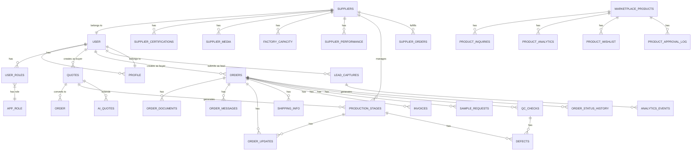

# Database Design

<cite>
**Referenced Files in This Document**   
- [20250122000000_create_marketplace_system.sql](file://supabase/migrations/20250122000000_create_marketplace_system.sql)
- [20251123052149_create_lead_capture_system.sql](file://supabase/migrations/20251123052149_create_lead_capture_system.sql)
- [TABLES_ONLY.sql](file://supabase/TABLES_ONLY.sql)
- [seed.sql](file://supabase/seed.sql)
- [add_supplier_to_quotes.sql](file://supabase/migrations/add_supplier_to_quotes.sql)
- [20251126144147_80306377-6da5-45bd-bc8c-45d1c15989d0.sql](file://supabase/migrations/20251126144147_80306377-6da5-45bd-bc8c-45d1c15989d0.sql)
- [COMPLETE_SETUP.sql](file://supabase/COMPLETE_SETUP.sql)
- [database.ts](file://src/types/database.ts)
</cite>

## Table of Contents
1. [Introduction](#introduction)
2. [Core Entity Relationships](#core-entity-relationships)
3. [Key Tables and Field Definitions](#key-tables-and-field-definitions)
4. [Data Validation and Business Rules](#data-validation-and-business-rules)
5. [Database Functions and Triggers](#database-functions-and-triggers)
6. [Data Access Patterns and Performance](#data-access-patterns-and-performance)
7. [Data Lifecycle and Retention](#data-lifecycle-and-retention)
8. [Data Migration and Version Management](#data-migration-and-version-management)
9. [Data Security and Access Control](#data-security-and-access-control)
10. [Sample Data and Usage Examples](#sample-data-and-usage-examples)

## Introduction

The sleekapp-v100 database schema is designed to support a comprehensive B2B marketplace for apparel manufacturing, connecting buyers with suppliers through a sophisticated quoting, ordering, and production tracking system. The database architecture centers around key entities including users, profiles, suppliers, products, orders, and production stages, with a focus on scalability, security, and performance.

The system implements a robust role-based access control model using Supabase's Row Level Security (RLS) policies, ensuring data privacy and security across different user types. The schema supports complex business workflows from initial quote requests through production tracking to final delivery, with comprehensive audit trails and analytics capabilities.

This documentation provides a detailed overview of the database design, including entity relationships, field definitions, data validation rules, business logic implementation, and security considerations. The schema is optimized for the apparel manufacturing domain, with specialized data models for production tracking, quality control, and supplier management.

**Section sources**
- [TABLES_ONLY.sql](file://supabase/TABLES_ONLY.sql#L1-L886)
- [COMPLETE_SETUP.sql](file://supabase/COMPLETE_SETUP.sql#L1-L8118)

## Core Entity Relationships

The sleekapp-v100 database schema features a comprehensive network of relationships between core entities, designed to support the end-to-end apparel manufacturing workflow. The primary entities include users, profiles, suppliers, products, quotes, orders, and production stages, with relationships that reflect the business processes of the platform.

The central relationship flows from users to profiles, with each user having a corresponding profile that contains personal and company information. Users can have multiple roles (defined by the app_role enum), including buyer, supplier, and admin, which determine their access and capabilities within the system. Suppliers are linked to users through the suppliers table, which extends the profile information with manufacturing-specific details like production capacity, minimum order quantities, and verification status.

Quotes serve as the bridge between buyers and suppliers, capturing product requirements and pricing information. Each quote is associated with a buyer and can be assigned to a supplier for fulfillment. When a quote is converted to an order, a new order record is created, establishing the formal production relationship. Orders are linked to both the buyer and supplier, and contain detailed information about the production requirements, pricing, and timeline.

The production process is tracked through multiple related entities. Production stages are defined for each order, with progress updates recorded in the order_updates table. Quality control is managed through qc_checks and defects tables, which document inspection results and any issues found during production. The entire workflow is supported by messaging systems (order_messages and supplier_messages) that facilitate communication between parties.



**Diagram sources**
- [TABLES_ONLY.sql](file://supabase/TABLES_ONLY.sql#L560-L886)
- [20250122000000_create_marketplace_system.sql](file://supabase/migrations/20250122000000_create_marketplace_system.sql#L42-L345)
- [20251123052149_create_lead_capture_system.sql](file://supabase/migrations/20251123052149_create_lead_capture_system.sql#L5-L148)

## Key Tables and Field Definitions

The sleekapp-v100 database consists of numerous tables designed to support the comprehensive functionality of the apparel manufacturing marketplace. This section details the key tables, their fields, data types, primary/foreign keys, indexes, and constraints.

### Users and Profiles

The authentication and user management system is built on Supabase Auth, with extended profile information stored in the profiles table.

**profiles table**
- id (UUID, PK): References auth.users.id, user identifier
- full_name (TEXT): User's full name
- company_name (TEXT): Company or organization name
- phone (TEXT): Contact phone number
- created_at (TIMESTAMPTZ): Record creation timestamp
- updated_at (TIMESTAMPTZ): Record update timestamp
- address (TEXT): Physical address
- bio (TEXT): User biography or description
- email (TEXT): Email address
- phone_verified (BOOLEAN): Phone verification status
- phone_verified_at (TIMESTAMPTZ): Timestamp of phone verification
- role (TEXT): User role with check constraint (user, admin, super_admin)

Indexes: idx_profiles_updated_at (updated_at DESC)

### Suppliers

The suppliers table contains detailed information about manufacturing partners, extending the basic profile with industry-specific data.

**suppliers table**
- id (UUID, PK): Supplier identifier
- user_id (UUID, FK): References profiles.id, associated user
- company_name (TEXT, NOT NULL): Legal company name
- business_type (TEXT): Type of business (e.g., Garment Manufacturer)
- country (TEXT): Country of operation
- city (TEXT): City of operation
- address (TEXT): Full physical address
- production_capacity_monthly (INTEGER): Monthly production capacity in units
- minimum_order_quantity (INTEGER): Minimum order quantity
- lead_time_days (INTEGER): Standard lead time in days
- specializations (TEXT[]): Array of product specializations
- verification_status (verification_status): Enum status (pending, verified, rejected, suspended)
- tier (supplier_tier): Supplier tier (bronze, silver, gold)
- rating (DECIMAL): Average rating from buyers
- total_orders (INTEGER): Total number of completed orders
- on_time_delivery_rate (DECIMAL): Percentage of on-time deliveries

Indexes: idx_suppliers_verification (verification_status), idx_suppliers_tier (tier), idx_suppliers_rating (rating DESC)

### Products

The products table manages the catalog of available items, both for direct sale and as part of the quoting system.

**products table**
- id (UUID, PK): Product identifier
- title (TEXT, NOT NULL): Product title or name
- category (TEXT, NOT NULL): Product category
- gauge (TEXT): Knitting gauge specification
- yarn (TEXT): Yarn composition
- colors (TEXT[]): Available colors
- image_url (TEXT, NOT NULL): URL to product image
- description (TEXT): Detailed product description
- featured (BOOLEAN): Featured product status
- created_at (TIMESTAMPTZ): Creation timestamp
- updated_at (TIMESTAMPTZ): Update timestamp
- ai_generated_image (BOOLEAN): Flag for AI-generated images
- image_generation_prompt (TEXT): Prompt used for AI image generation
- image_generation_date (TIMESTAMPTZ): Timestamp of image generation
- image_approved_by_admin (BOOLEAN): Admin approval status for AI images

Indexes: idx_products_category (category), idx_products_featured (featured), idx_products_created_at (created_at DESC)

### Quotes

The quotes table manages the quoting process, capturing product requirements and pricing estimates.

**quotes table**
- id (UUID, PK): Quote identifier
- buyer_id (UUID, FK): References profiles.id, requesting buyer
- session_id (TEXT): Session identifier for anonymous users
- product_type (TEXT, NOT NULL): Type of product quoted
- quantity (INTEGER, NOT NULL): Requested quantity
- target_moq (INTEGER): Target minimum order quantity
- complexity_level (TEXT): Complexity level (simple, medium, complex)
- fabric_type (TEXT): Specified fabric type
- customization_details (TEXT): Details of customizations
- additional_requirements (TEXT): Additional requirements
- tech_pack_urls (TEXT[]): URLs to technical packs
- reference_image_urls (TEXT[]): URLs to reference images
- target_price_per_unit (NUMERIC): Target price per unit
- target_delivery_date (DATE): Target delivery date
- matched_supplier_ids (UUID[]): Array of matched supplier IDs
- status (TEXT): Quote status with check constraint
- ai_estimation (JSONB): AI-generated estimation data
- customer_name (TEXT): Customer name
- customer_email (TEXT): Customer email
- customer_phone (TEXT): Customer phone
- created_at (TIMESTAMPTZ): Creation timestamp
- updated_at (TIMESTAMPTZ): Update timestamp

Indexes: idx_quotes_buyer (buyer_id), idx_quotes_status (status), idx_quotes_created_at (created_at DESC)

### Orders

The orders table manages the formal production orders, tracking the entire lifecycle from creation to delivery.

**orders table**
- id (UUID, PK): Order identifier
- order_number (TEXT, NOT NULL): Unique order number
- buyer_id (UUID, FK): References profiles.id, purchasing buyer
- factory_id (UUID, FK): References suppliers.id, manufacturing factory
- product_type (TEXT, NOT NULL): Type of product ordered
- quantity (INTEGER, NOT NULL): Ordered quantity with check constraint (> 0)
- status (TEXT): Order status with check constraint
- target_date (DATE): Target completion date
- notes (TEXT): Additional notes
- created_at (TIMESTAMPTZ): Creation timestamp
- updated_at (TIMESTAMPTZ): Update timestamp
- current_stage (production_stage): Current production stage
- stage_progress (JSONB): Progress tracking for each stage
- supplier_id (UUID, FK): References suppliers.id, fulfilling supplier
- quote_id (UUID, FK): References quotes.id, originating quote
- production_status (TEXT): Production status
- milestone_tracker (JSONB): Tracking of key milestones
- expected_delivery_date (DATE): Expected delivery date
- actual_delivery_date (DATE): Actual delivery date
- tracking_token (TEXT): Tracking identifier
- payment_status (TEXT): Payment status
- deposit_amount (NUMERIC): Deposit amount
- balance_amount (NUMERIC): Balance amount
- deposit_paid_at (TIMESTAMPTZ): Timestamp of deposit payment
- balance_paid_at (TIMESTAMPTZ): Timestamp of balance payment
- stripe_payment_intent_id (TEXT): Stripe payment intent identifier
- stripe_customer_id (TEXT): Stripe customer identifier
- workflow_status (order_workflow_status): Workflow status enum
- admin_notes (TEXT): Administrative notes
- buyer_price (NUMERIC): Price charged to buyer
- supplier_price (NUMERIC): Price paid to supplier
- admin_margin (NUMERIC): Administrative margin
- margin_percentage (NUMERIC): Margin as percentage
- assigned_by (UUID, FK): References profiles.id, user who assigned order
- assigned_at (TIMESTAMPTZ): Timestamp of assignment
- is_demo_order (BOOLEAN): Demo order flag
- display_publicly (BOOLEAN): Public display flag
- anonymized_client_name (TEXT): Anonymized client name for public display

Indexes: idx_orders_buyer (buyer_id), idx_orders_supplier (supplier_id), idx_orders_status (status), idx_orders_workflow_status (workflow_status), idx_orders_created_at (created_at DESC)

### Production Stages

The production_stages table manages the step-by-step production process for each order.

**production_stages table**
- id (UUID, PK): Stage identifier
- supplier_order_id (UUID, FK): References supplier_orders.id, associated order
- stage_number (INTEGER, NOT NULL): Sequential stage number
- stage_name (TEXT, NOT NULL): Name of the production stage
- description (TEXT): Detailed description
- target_date (DATE): Target completion date
- completion_percentage (INTEGER): Completion percentage with check constraint (0-100)
- status (TEXT): Stage status (pending, in_progress, completed)
- photos (TEXT[]): Array of photo URLs documenting the stage
- notes (TEXT): Additional notes
- started_at (TIMESTAMPTZ): Timestamp when stage started
- completed_at (TIMESTAMPTZ): Timestamp when stage completed
- updated_by (UUID, FK): References profiles.id, user who last updated
- updated_at (TIMESTAMPTZ): Last update timestamp

Indexes: idx_production_stages_order (supplier_order_id), idx_production_stages_status (status), idx_production_stages_target_date (target_date)

**Section sources**
- [TABLES_ONLY.sql](file://supabase/TABLES_ONLY.sql#L560-L886)
- [COMPLETE_SETUP.sql](file://supabase/COMPLETE_SETUP.sql#L1-L8118)
- [database.ts](file://src/types/database.ts#L1-L579)

## Data Validation and Business Rules

The sleekapp-v100 database implements comprehensive data validation and business rules through constraints, triggers, and application logic to ensure data integrity and enforce business processes.

### Check Constraints

The database uses numerous check constraints to validate data at the database level:

- **orders.quantity_check**: Ensures order quantities are positive (quantity > 0)
- **orders.status_check**: Restricts order status to predefined values (pending, confirmed, in_production, quality_check, shipped, delivered, cancelled)
- **production_stages.completion_percentage_check**: Ensures completion percentage is between 0 and 100
- **defects.severity_check**: Restricts defect severity to predefined values (minor, major, critical)
- **invoices.status_check**: Restricts invoice status to predefined values (pending, paid, cancelled, refunded)
- **invoices.payment_type_check**: Restricts payment type to predefined values (deposit, balance, full)
- **supplier_performance.quality_score_check**: Ensures quality score is between 1 and 5
- **supplier_performance.communication_score_check**: Ensures communication score is between 1 and 5

### Business Rules

The system implements several key business rules through database constraints and application logic:

1. **Order-to-Supplier Assignment**: When an order is assigned to a supplier, the system validates that the supplier has sufficient capacity and appropriate specializations for the product type. This is enforced through application logic that checks the supplier's capabilities against the order requirements.

2. **Pricing Validation**: The system ensures that the supplier price is always less than the buyer price, maintaining a positive margin. This is implemented through a check constraint on the orders table that validates buyer_price > supplier_price.

3. **Production Stage Progression**: Production stages must be completed in sequence, with each stage requiring completion of the previous stage. This is enforced through application logic that validates the stage progression before allowing updates.

4. **Quote-to-Order Conversion**: When a quote is converted to an order, the system validates that all required information is present and that the pricing is consistent with the quote. This prevents incomplete or inconsistent orders from being created.

5. **Supplier Verification**: Suppliers must be verified before they can receive orders. The system restricts order assignment to suppliers with verification_status = 'verified', ensuring quality control.

6. **Minimum Order Quantity Enforcement**: The system validates that order quantities meet or exceed the supplier's minimum order quantity requirement. This prevents economically unviable small orders.

7. **Lead Time Validation**: The system ensures that the target delivery date is feasible given the supplier's lead time and current production schedule. This prevents unrealistic delivery commitments.

8. **Payment Terms**: The system enforces payment terms, requiring a deposit payment before production begins and the balance payment before shipment. This is managed through the payment_status field and associated business logic.

These rules work together to maintain data integrity and ensure that business processes are followed consistently across the platform.

**Section sources**
- [TABLES_ONLY.sql](file://supabase/TABLES_ONLY.sql#L476-L886)
- [COMPLETE_SETUP.sql](file://supabase/COMPLETE_SETUP.sql#L1-L8118)

## Database Functions and Triggers

The sleekapp-v100 database implements several functions and triggers to automate business processes, maintain data integrity, and enhance system functionality.

### Helper Functions

**update_marketplace_product_timestamp()**
- Purpose: Automatically updates the updated_at timestamp whenever a marketplace product is modified
- Implementation: Trigger function that sets NEW.updated_at = NOW() before any UPDATE operation on marketplace_products
- Usage: Ensures accurate tracking of when products were last modified

**increment_product_views(product_uuid UUID)**
- Purpose: Increments the view count for a product and updates daily analytics
- Implementation: Updates the views count in marketplace_products and inserts/updates records in product_analytics
- Usage: Tracks product engagement metrics for analytics and ranking purposes

**update_supplier_product_counts()**
- Purpose: Maintains accurate counts of total and active products for each supplier
- Implementation: Trigger function that updates suppliers.total_products_listed and suppliers.active_products when marketplace_products are inserted, updated, or deleted
- Usage: Provides real-time supplier statistics for dashboard displays

**calculate_supplier_approval_rating(supplier_uuid UUID)**
- Purpose: Calculates and updates a supplier's approval rating based on their product submission history
- Implementation: Queries marketplace_products to calculate the percentage of approved products and updates suppliers.approval_rating
- Usage: Provides a quality metric for supplier evaluation and ranking

**search_marketplace_products()**
- Purpose: Provides full-text search capabilities for marketplace products
- Implementation: Function that uses PostgreSQL's full-text search (to_tsvector and plainto_tsquery) to search product titles and descriptions
- Usage: Powers the marketplace product search functionality with relevance scoring

### Notification Triggers

**notify_supplier_product_status()**
- Purpose: Sends notifications to suppliers when their product listings are approved or rejected
- Implementation: Trigger that fires after UPDATE on marketplace_products when status changes, inserting records into notifications table
- Usage: Keeps suppliers informed about the status of their product submissions

### Audit and Security Functions

**log_admin_action()**
- Purpose: Records administrative actions in the audit log
- Implementation: Function that inserts records into admin_audit_logs with details of the action, resource, and user
- Usage: Maintains a comprehensive audit trail of administrative activities

**log_otp_attempt()**
- Purpose: Logs OTP verification attempts for security monitoring
- Implementation: Function that records OTP attempts with success status and IP address
- Usage: Enables rate limiting and fraud detection for authentication processes

These functions and triggers work together to automate routine tasks, maintain data consistency, and provide enhanced functionality while reducing the burden on application code.

**Section sources**
- [20250122000000_create_marketplace_system.sql](file://supabase/migrations/20250122000000_create_marketplace_system.sql#L129-L514)
- [COMPLETE_SETUP.sql](file://supabase/COMPLETE_SETUP.sql#L1-L8118)

## Data Access Patterns and Performance

The sleekapp-v100 database is optimized for the specific access patterns of an apparel manufacturing marketplace, with careful indexing and query optimization to ensure responsive performance.

### Indexing Strategy

The database implements a comprehensive indexing strategy to support efficient querying across key access patterns:

**User and Profile Access**
- idx_profiles_updated_at (updated_at DESC): Optimizes queries for recently updated profiles
- Composite indexes on frequently queried profile fields to support user search and filtering

**Supplier Access**
- idx_suppliers_verification (verification_status): Optimizes queries for verified suppliers
- idx_suppliers_tier (tier): Supports tier-based filtering and sorting
- idx_suppliers_rating (rating DESC): Enables ranking by supplier quality
- idx_suppliers_specializations: GIN index on specializations array for efficient array containment queries

**Product Access**
- idx_marketplace_products_supplier (supplier_id): Optimizes queries for supplier-specific products
- idx_marketplace_products_status (status): Supports filtering by product status
- idx_marketplace_products_category (category): Enables category-based browsing
- idx_marketplace_products_approved (status, approval_date DESC): Optimizes queries for recently approved products
- idx_marketplace_products_featured (is_featured, featured_until): Supports featured product displays
- idx_marketplace_products_price (final_price): Enables price-based sorting and filtering
- idx_marketplace_products_search: GIN index using to_tsvector for full-text search on title and description

**Order Access**
- idx_orders_buyer (buyer_id): Optimizes queries for buyer-specific orders
- idx_orders_supplier (supplier_id): Supports supplier-specific order views
- idx_orders_status (status): Enables status-based filtering
- idx_orders_workflow_status (workflow_status): Supports workflow-based filtering
- idx_orders_created_at (created_at DESC): Optimizes queries for recent orders

**Production Tracking**
- idx_production_stages_order (supplier_order_id): Optimizes queries for order-specific production stages
- idx_production_stages_status (status): Supports status-based filtering
- idx_production_stages_target_date (target_date): Enables date-based scheduling views

### Query Optimization

The database design incorporates several optimization techniques:

1. **Generated Columns**: The marketplace_products table uses generated columns for platform_fee_amount and final_price, calculated from base_price and platform_fee_percentage. This ensures consistency and eliminates calculation errors.

2. **Materialized Views**: For frequently accessed aggregated data (e.g., supplier performance metrics), the system could implement materialized views to improve query performance.

3. **Partitioning**: Large tables like order_updates and qc_checks could benefit from time-based partitioning to improve query performance for historical data.

4. **Connection Pooling**: The application uses connection pooling to minimize connection overhead and improve response times.

5. **Query Caching**: Frequently accessed data (e.g., product categories, supplier lists) is cached at the application level to reduce database load.

6. **Batch Operations**: Related operations are batched to minimize round trips to the database, improving overall performance.

These optimization strategies ensure that the database can handle the expected load while maintaining responsive performance for end users.

**Section sources**
- [20250122000000_create_marketplace_system.sql](file://supabase/migrations/20250122000000_create_marketplace_system.sql#L120-L127)
- [TABLES_ONLY.sql](file://supabase/TABLES_ONLY.sql#L560-L886)

## Data Lifecycle and Retention

The sleekapp-v100 database implements a comprehensive data lifecycle management strategy to balance data availability, storage costs, and regulatory compliance.

### Data Retention Policies

The system follows different retention policies for various data types based on their business value and regulatory requirements:

**Transactional Data (Orders, Invoices, Payments)**
- Retention: 7 years
- Rationale: Complies with financial record-keeping regulations and supports long-term business analysis
- Archival: After 3 years of inactivity, records are moved to cold storage while maintaining referential integrity

**User Data (Profiles, Preferences)**
- Retention: Indefinite, with user-controlled deletion
- Rationale: Supports ongoing business relationships and personalized experiences
- Deletion: Users can request data deletion in accordance with privacy regulations, with a 30-day grace period for recovery

**Operational Data (Quotes, Production Updates, Messages)**
- Retention: 5 years
- Rationale: Maintains historical context for business operations while managing storage costs
- Archival: After 2 years of inactivity, records are compressed and moved to lower-cost storage

**Analytics Data (Events, Interactions, Views)**
- Retention: 2 years
- Rationale: Provides sufficient data for trend analysis while controlling storage growth
- Aggregation: After 6 months, individual events are aggregated into daily summaries, reducing storage requirements

**Temporary Data (Sessions, OTPs, Rate Limits)**
- Retention: 30 days
- Rationale: Supports security and operational functions without unnecessary long-term storage
- Automatic Cleanup: Records are automatically purged after expiration

### Data Archival Rules

The system implements automated archival processes to manage data lifecycle:

1. **Tiered Storage**: Data is automatically moved between storage tiers based on age and access frequency:
   - Hot storage: Frequently accessed data (0-6 months)
   - Warm storage: Occasionally accessed data (6-24 months)
   - Cold storage: Rarely accessed data (24+ months)

2. **Archival Triggers**: Data is archived based on:
   - Age: Records older than the threshold for their category
   - Inactivity: Records not accessed or updated for a specified period
   - Business rules: Completion of specific workflows (e.g., order delivery + 90 days)

3. **Archival Process**: 
   - Data is compressed and encrypted
   - Referential integrity is maintained through archival metadata
   - Access patterns are preserved to support queries across archived and active data

4. **Recovery**: Archived data can be restored to active storage within 24 hours when needed for business operations or compliance requests.

These policies ensure that data is managed efficiently throughout its lifecycle, balancing accessibility, cost, and compliance requirements.

**Section sources**
- [TABLES_ONLY.sql](file://supabase/TABLES_ONLY.sql#L560-L886)
- [COMPLETE_SETUP.sql](file://supabase/COMPLETE_SETUP.sql#L1-L8118)

## Data Migration and Version Management

The sleekapp-v100 database uses Supabase migrations for version control and schema management, ensuring consistent and reliable database evolution across environments.

### Migration Strategy

The system implements a comprehensive migration strategy using Supabase's migration framework:

**Migration Files**
- Located in supabase/migrations directory
- Named with timestamp prefix (YYYYMMDDHHMMSS) followed by descriptive name
- Each file contains SQL statements to modify the database schema
- Migrations are designed to be idempotent and safe to run multiple times

**Migration Types**
1. **Schema Migrations**: Modify table structures, add/remove columns, create indexes
2. **Data Migrations**: Transform existing data to match new schema requirements
3. **Security Migrations**: Update RLS policies, permissions, and security configurations
4. **Function Migrations**: Add or modify database functions and triggers

**Example Migration: add_supplier_to_quotes.sql**
```sql
-- Migration: Add supplier assignment fields to quotes table
-- Purpose: Allow admins to assign suppliers to quotes and track assignment history
-- Date: 2025-11-24

-- Add supplier assignment columns to quotes table
ALTER TABLE quotes 
ADD COLUMN IF NOT EXISTS supplier_id UUID REFERENCES profiles(id) ON DELETE SET NULL,
ADD COLUMN IF NOT EXISTS assigned_at TIMESTAMP WITH TIME ZONE,
ADD COLUMN IF NOT EXISTS assigned_by UUID REFERENCES profiles(id) ON DELETE SET NULL;

-- Create index for faster supplier quote lookups
CREATE INDEX IF NOT EXISTS idx_quotes_supplier_id ON quotes(supplier_id);
CREATE INDEX IF NOT EXISTS idx_quotes_assigned_at ON quotes(assigned_at);

-- Add comment for documentation
COMMENT ON COLUMN quotes.supplier_id IS 'The supplier assigned to fulfill this quote by the admin';
COMMENT ON COLUMN quotes.assigned_at IS 'Timestamp when the supplier was assigned to this quote';
COMMENT ON COLUMN quotes.assigned_by IS 'Admin user who assigned the supplier to this quote';

-- Update existing quotes to have 'pending' status if they don't have a status
UPDATE quotes SET status = 'pending' WHERE status IS NULL OR status = '';

-- Add status index for faster filtering
CREATE INDEX IF NOT EXISTS idx_quotes_status ON quotes(status);
```

### Version Management

The system follows strict version management practices:

1. **Sequential Execution**: Migrations are executed in timestamp order, ensuring consistent schema evolution
2. **Environment Parity**: Development, staging, and production environments maintain identical schema versions
3. **Rollback Planning**: Each migration includes considerations for potential rollback, though Supabase does not automatically generate rollback scripts
4. **Testing**: Migrations are tested in staging environment before deployment to production
5. **Documentation**: Each migration file includes comments explaining purpose, date, and impact

### Migration Workflow

The standard migration workflow is:

1. **Development**: Create migration file with required schema changes
2. **Local Testing**: Apply migration to local database and verify functionality
3. **Staging Deployment**: Deploy migration to staging environment and conduct thorough testing
4. **Production Deployment**: Apply migration to production during maintenance window
5. **Verification**: Confirm successful application and verify application functionality

This disciplined approach ensures reliable database evolution while minimizing risk to production systems.

**Section sources**
- [add_supplier_to_quotes.sql](file://supabase/migrations/add_supplier_to_quotes.sql#L1-L28)
- [20250122000000_create_marketplace_system.sql](file://supabase/migrations/20250122000000_create_marketplace_system.sql#L1-L532)
- [20251123052149_create_lead_capture_system.sql](file://supabase/migrations/20251123052149_create_lead_capture_system.sql#L1-L188)

## Data Security and Access Control

The sleekapp-v100 database implements a robust security model using Supabase's Row Level Security (RLS) policies to protect sensitive data and enforce access control.

### Role-Based Access Control

The system defines user roles through the app_role enum, which includes:
- retailer
- wholesaler
- educational
- corporate
- sports_team
- factory
- admin
- supplier

These roles determine the level of access users have to different parts of the system.

### Row Level Security Policies

The database implements comprehensive RLS policies to ensure data privacy:

**Profiles Table**
- Users can view and update their own profile
- Admins can view and update all profiles
- Prevents unauthorized access to personal information

```sql
CREATE POLICY "Users view own profile or admins view all"
ON public.profiles
FOR SELECT
TO authenticated
USING (
  auth.uid() = id 
  OR public.has_role(auth.uid(), 'admin'::public.app_role)
);

CREATE POLICY "Users update own profile"
ON public.profiles
FOR UPDATE
TO authenticated
USING (auth.uid() = id)
WITH CHECK (auth.uid() = id);
```

**Suppliers Table**
- Verified suppliers are visible to all authenticated users
- Suppliers can view and update their own information
- Admins have full access

```sql
CREATE POLICY "Authenticated users view verified suppliers"
ON public.suppliers
FOR SELECT
TO authenticated
USING (
  verification_status = 'verified'
  OR auth.uid() = user_id
  OR public.has_role(auth.uid(), 'admin'::public.app_role)
);
```

**Orders Table**
- Buyers can view their own orders
- Suppliers can view orders assigned to them
- Admins have full access

**Quotes Table**
- Buyers can view quotes they created
- Assigned suppliers can view quotes they are fulfilling
- Admins have full access

```sql
CREATE POLICY "Users view own quotes only"
ON public.quotes
FOR SELECT
USING (
  auth.uid() = buyer_id
  OR public.has_role(auth.uid(), 'admin'::public.app_role)
);
```

**Marketplace Products**
- Anyone can view approved products
- Suppliers can view and manage their own products
- Admins can view and manage all products

```sql
CREATE POLICY "Anyone can view approved products" ON marketplace_products
  FOR SELECT USING (status = 'approved');

CREATE POLICY "Suppliers can view their own products" ON marketplace_products
  FOR SELECT USING (
    supplier_id IN (
      SELECT id FROM suppliers WHERE user_id = auth.uid()
    )
  );

CREATE POLICY "Admins can view all products" ON marketplace_products
  FOR SELECT USING (
    EXISTS (
      SELECT 1 FROM user_roles 
      WHERE user_id = auth.uid() AND role = 'admin'
    )
  );
```

### Security Functions

The system includes security-focused database functions:

**has_role(_user_id uuid, _role app_role)**
- Checks if a user has a specific role
- Used in RLS policies to determine access rights
- Implemented as a SECURITY DEFINER function for reliable role checking

**log_admin_action()**
- Records all administrative actions in the audit log
- Captures user, action, resource, and timestamp
- Provides accountability for administrative activities

**log_otp_attempt()**
- Logs all OTP verification attempts
- Includes success status and IP address
- Enables rate limiting and fraud detection

These security measures work together to protect sensitive data, prevent unauthorized access, and maintain accountability across the system.

**Section sources**
- [20251126144147_80306377-6da5-45bd-bc8c-45d1c15989d0.sql](file://supabase/migrations/20251126144147_80306377-6da5-45bd-bc8c-45d1c15989d0.sql#L1-L211)
- [COMPLETE_SETUP.sql](file://supabase/COMPLETE_SETUP.sql#L1-L8118)
- [BASE_MIGRATION_SAFE.sql](file://supabase/BASE_MIGRATION_SAFE.sql#L1-L3685)

## Sample Data and Usage Examples

The sleekapp-v100 database includes comprehensive sample data to demonstrate the system's capabilities and support development and testing.

### Sample Data Structure

The sample data, defined in supabase/seed.sql, includes:

**User Profiles**
- 5 buyer profiles with different business types (retailer, educational, corporate, sports_team, wholesaler)
- 5 supplier profiles with varying specializations and verification statuses
- 1 admin user for system management

**Supplier Certifications**
- WRAP Certification for Dhaka Knitwear Ltd
- OEKO-TEX Standard 100 for Dhaka Knitwear Ltd and Premium Fabric Mills
- ISO 9001:2015 for Dhaka Knitwear Ltd
- BSCI Social Compliance for Active Sports Textiles
- GOTS Organic for Active Sports Textiles
- ISO 14001:2015 for Premium Fabric Mills

**Products**
- 20 sample products across various categories:
  - T-Shirts: 3 products
  - Polo Shirts: 2 products
  - Hoodies: 3 products
  - Sweatshirts: 2 products
  - Activewear: 3 products
  - Uniforms: 4 products
  - Tank Tops: 1 product
  - Long Sleeve Shirts: 2 products

**Marketplace Listings**
- 7 marketplace product listings from different suppliers:
  - Dhaka Knitwear Ltd: 3 listings (T-Shirts, Polo Shirts, Hoodies)
  - Active Sports Textiles: 2 listings (Activewear, Track Suits)
  - Bengal Uniforms Manufacturing: 2 listings (School and Corporate Uniforms)

### Usage Examples

**Creating a New Quote**
```sql
INSERT INTO quotes (
  buyer_id,
  product_type,
  quantity,
  complexity_level,
  fabric_type,
  additional_requirements,
  customer_name,
  customer_email,
  customer_phone
) VALUES (
  '00000000-0000-0000-0000-000000000001',
  'T-Shirt',
  1000,
  'medium',
  '100% cotton',
  'Custom logo printing on chest',
  'Sarah Johnson',
  'sarah.johnson@test.sleekapp.com',
  '+1-555-0101'
);
```

**Assigning a Supplier to a Quote**
```sql
UPDATE quotes 
SET 
  supplier_id = '00000000-0000-0000-0000-000000000101',
  assigned_at = NOW(),
  assigned_by = '00000000-0000-0000-0000-000000000999'
WHERE id = 'quote-id-here';
```

**Creating a Production Stage**
```sql
INSERT INTO production_stages (
  supplier_order_id,
  stage_number,
  stage_name,
  description,
  target_date,
  status
) VALUES (
  'supplier-order-id',
  1,
  'yarn_received',
  'Receive and inspect yarn shipment',
  '2025-12-01',
  'pending'
);
```

**Recording a Production Update**
```sql
INSERT INTO order_updates (
  order_id,
  stage,
  message,
  photos,
  completion_percentage,
  created_by
) VALUES (
  'order-id-here',
  'knitting',
  'Completed knitting of 500 units',
  ARRAY['https://example.com/photo1.jpg', 'https://example.com/photo2.jpg'],
  50,
  '00000000-0000-0000-0000-000000000101'
);
```

**Searching Marketplace Products**
```sql
SELECT * FROM search_marketplace_products(
  search_query => 'cotton t-shirt',
  category_filter => 'T-Shirts',
  min_price => 5.00,
  max_price => 15.00,
  limit_count => 10,
  offset_count => 0
);
```

These examples demonstrate the practical usage of the database schema for common operations in the apparel manufacturing marketplace.

**Section sources**
- [seed.sql](file://supabase/seed.sql#L1-L1002)
- [20250122000000_create_marketplace_system.sql](file://supabase/migrations/20250122000000_create_marketplace_system.sql#L42-L345)