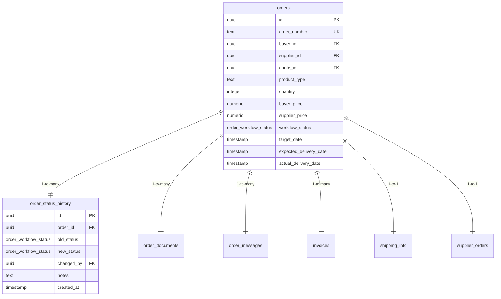
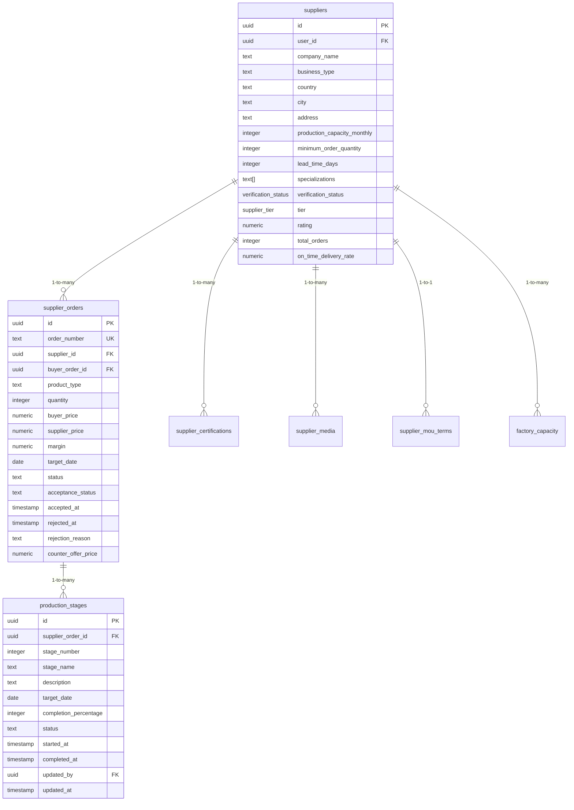
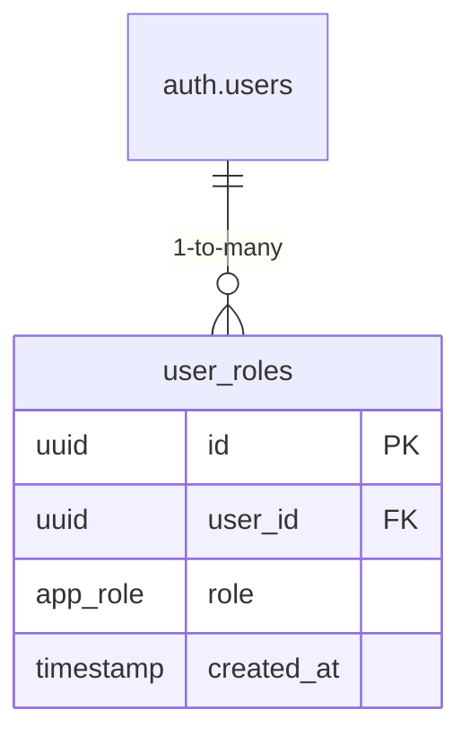

# Entity Relationships

<cite>
**Referenced Files in This Document**   
- [TABLES_ONLY.sql](file://supabase/TABLES_ONLY.sql)
- [BASE_MIGRATION_SAFE.sql](file://supabase/BASE_MIGRATION_SAFE.sql)
- [database.ts](file://src/types/database.ts)
</cite>

## Table of Contents
1. [Introduction](#introduction)
2. [Core Entity Relationships](#core-entity-relationships)
3. [User and Profile System](#user-and-profile-system)
4. [Order Management System](#order-management-system)
5. [Supplier and Production System](#supplier-and-production-system)
6. [Role-Based Access Control](#role-based-access-control)
7. [Referential Integrity Constraints](#referential-integrity-constraints)
8. [Entity-Relationship Diagram](#entity-relationship-diagram)

## Introduction
This document provides comprehensive documentation of the entity relationships within the sleekapp-v100 database. The system is designed to manage a complex apparel manufacturing and supply chain platform, connecting buyers, suppliers, and administrators. The core entities include users, profiles, suppliers, products, orders, supplier_orders, production_stages, and notifications, with well-defined relationships that ensure data consistency and business process integrity. This documentation details the cardinality, participation constraints, foreign key relationships, and referential integrity rules that govern how these entities interact.

## Core Entity Relationships
The sleekapp-v100 database implements a relational model with well-defined relationships between core entities. The primary relationships are designed to support the end-to-end process from initial quote requests through production and delivery. The system uses UUIDs as primary keys across all tables, ensuring global uniqueness and facilitating secure API access. Relationships are enforced through foreign key constraints with specific ON DELETE behaviors that reflect business requirements. The data model supports both direct buyer-supplier interactions and platform-mediated transactions, with the orders table serving as the central hub that connects buyers, suppliers, and production activities.

**Section sources**
- [TABLES_ONLY.sql](file://supabase/TABLES_ONLY.sql#L437-L477)
- [BASE_MIGRATION_SAFE.sql](file://supabase/BASE_MIGRATION_SAFE.sql#L3277-L3294)

## User and Profile System
The user and profile system implements a one-to-one relationship between authentication users and application profiles. The profiles table has a foreign key relationship with the auth.users table through the id field, with ON DELETE CASCADE ensuring that when a user account is deleted, their profile is automatically removed. This relationship is mandatory, as every user must have a corresponding profile to participate in the platform. The profile contains essential information such as full_name, company_name, phone, and role, which are used throughout the application for personalization and access control. The role field in the profile table is complemented by the user_roles table, which implements a one-to-many relationship allowing users to have multiple roles.

```mermaid
erDiagram
auth.users ||--|| profiles : "1-to-1"
auth.users {
uuid id PK
text email UK
jsonb raw_user_meta_data
}
profiles {
uuid id PK FK
text full_name
text company_name
text phone
text role
timestamp created_at
timestamp updated_at
}
```

**Diagram sources **
- [TABLES_ONLY.sql](file://supabase/TABLES_ONLY.sql#L560-L574)
- [BASE_MIGRATION_SAFE.sql](file://supabase/BASE_MIGRATION_SAFE.sql#L3345-L3346)

## Order Management System
The order management system centers around the orders table, which has multiple relationships with other entities. Each order has a mandatory relationship with a buyer (buyer_id) and an optional relationship with a supplier (supplier_id). The supplier_id foreign key has ON DELETE SET NULL, meaning that if a supplier account is deleted, the order retains its historical data with the supplier_id set to null rather than being deleted. Orders are connected to quotes through the quote_id field, also with ON DELETE SET NULL, preserving order history even if the original quote is removed. The system also tracks order status changes through the order_status_history table, which has a one-to-many relationship with orders, allowing for complete audit trails of order workflow progression.



**Diagram sources **
- [TABLES_ONLY.sql](file://supabase/TABLES_ONLY.sql#L437-L477)
- [BASE_MIGRATION_SAFE.sql](file://supabase/BASE_MIGRATION_SAFE.sql#L3277-L3294)

## Supplier and Production System
The supplier and production system implements a hierarchical relationship structure that tracks the production process from order assignment through completion. The supplier_orders table represents the contract between the platform/buyer and the supplier, with a foreign key relationship to both the orders table (buyer_order_id) and the suppliers table (supplier_id). The production_stages table has a one-to-many relationship with supplier_orders, with ON DELETE CASCADE ensuring that when a supplier order is deleted, all associated production stages are also removed. This cascade behavior reflects the business rule that production stages are entirely dependent on the existence of a supplier order. Each production stage tracks progress through completion_percentage, status, and timestamps for started_at and completed_at, providing granular visibility into the manufacturing process.



**Diagram sources **
- [TABLES_ONLY.sql](file://supabase/TABLES_ONLY.sql#L758-L782)
- [BASE_MIGRATION_SAFE.sql](file://supabase/BASE_MIGRATION_SAFE.sql#L3443-L3444)

## Role-Based Access Control
The role-based access control system is implemented through the user_roles table, which establishes a many-to-many relationship between users and roles. This design allows users to have multiple roles simultaneously, such as a supplier who also has admin privileges for their organization. The app_role enum defines the available roles in the system: retailer, wholesaler, educational, corporate, sports_team, factory, admin, and supplier. The relationship between users and roles is mandatory for system functionality, as role-based permissions govern access to different parts of the application. The system includes security functions like has_role and has_any_role that are used in Row Level Security (RLS) policies to enforce access control at the database level. The handle_new_user_role function automatically creates user role entries based on signup metadata, while administrative functions like assign_user_role and remove_user_role allow admins to modify user roles securely.



**Diagram sources **
- [TABLES_ONLY.sql](file://supabase/TABLES_ONLY.sql#L15-L23)
- [BASE_MIGRATION_SAFE.sql](file://supabase/BASE_MIGRATION_SAFE.sql#L336-L349)

## Referential Integrity Constraints
The database enforces referential integrity through comprehensive foreign key constraints with carefully chosen ON DELETE behaviors that reflect business requirements. The system uses ON DELETE CASCADE for relationships where child records are completely dependent on parent records, such as production_stages depending on supplier_orders. This ensures data consistency by automatically removing dependent records when a parent record is deleted. For relationships where historical data preservation is important, the system uses ON DELETE SET NULL, as seen with the supplier_id in the orders table. This approach maintains the integrity of business records while gracefully handling the removal of related entities. The database also includes check constraints to enforce data validity, such as ensuring quantity values are positive in the orders table and validating status values against defined enums. These constraints work together to maintain data quality and prevent inconsistent states in the application.

**Section sources**
- [TABLES_ONLY.sql](file://supabase/TABLES_ONLY.sql#L476-L477)
- [BASE_MIGRATION_SAFE.sql](file://supabase/BASE_MIGRATION_SAFE.sql#L3443-L3444)

## Entity-Relationship Diagram
The following entity-relationship diagram illustrates the core entities and their connections in the sleekapp-v100 database. The diagram shows the primary tables and their relationships, highlighting the foreign key connections and cardinality. The central entities are users, profiles, suppliers, orders, supplier_orders, and production_stages, with supporting entities for notifications, documents, messages, and audit trails. The relationships reflect the business processes of the apparel manufacturing platform, from initial user registration through order fulfillment and production tracking.

```mermaid
erDiagram
auth.users ||--|| profiles : "1-to-1"
auth.users ||--o{ user_roles : "1-to-many"
auth.users ||--o{ notifications : "1-to-many"
auth.users ||--o{ order_messages : "1-to-many"
auth.users ||--o{ conversation_context : "1-to-many"
profiles ||--o{ notification_preferences : "1-to-1"
suppliers ||--o{ supplier_orders : "1-to-many"
suppliers ||--o{ supplier_certifications : "1-to-many"
suppliers ||--o{ supplier_media : "1-to-many"
suppliers ||--o{ supplier_mou_terms : "1-to-1"
suppliers ||--o{ factory_capacity : "1-to-many"
suppliers ||--o{ supplier_performance : "1-to-many"
orders ||--o{ order_status_history : "1-to-many"
orders ||--o{ order_documents : "1-to-many"
orders ||--o{ order_messages : "1-to-many"
orders ||--o{ invoices : "1-to-many"
orders ||--|| shipping_info : "1-to-1"
orders ||--o{ sample_requests : "1-to-many"
orders ||--o{ qc_checks : "1-to-many"
supplier_orders ||--o{ production_stages : "1-to-many"
supplier_orders ||--o{ supplier_messages : "1-to-many"
supplier_orders ||--o{ order_updates : "1-to-many"
quotes ||--o{ supplier_quotes : "1-to-many"
blog_posts ||--o{ blog_comments : "1-to-many"
production_batches ||--o{ batch_contributions : "1-to-many"
user_roles }o--|| app_role : "enum"
order_workflow_status }o--|| orders : "enum"
production_stage }o--|| production_stages : "enum"
supplier_tier }o--|| suppliers : "enum"
verification_status }o--|| suppliers : "enum"
```



**Diagram sources **
- [TABLES_ONLY.sql](file://supabase/TABLES_ONLY.sql)
- [BASE_MIGRATION_SAFE.sql](file://supabase/BASE_MIGRATION_SAFE.sql)