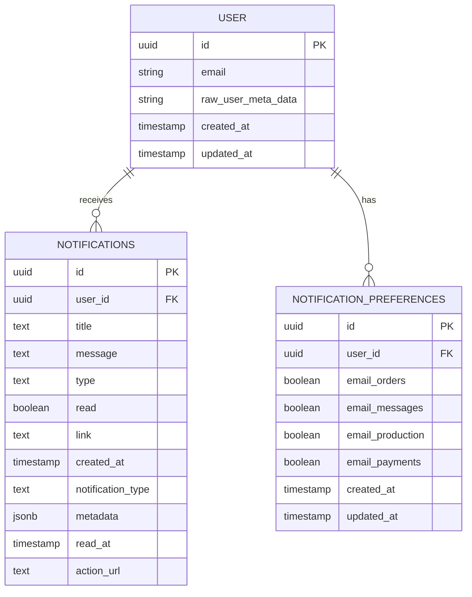
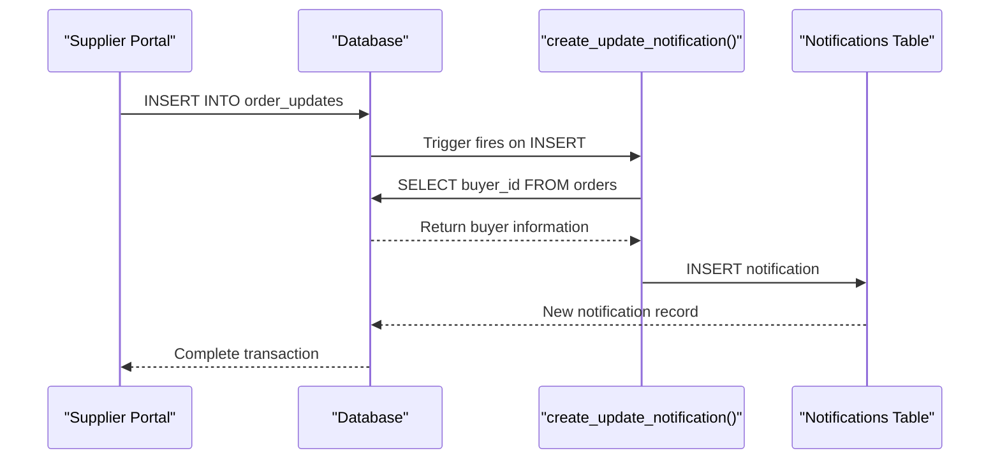
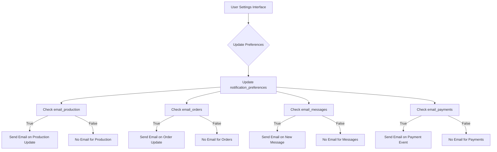
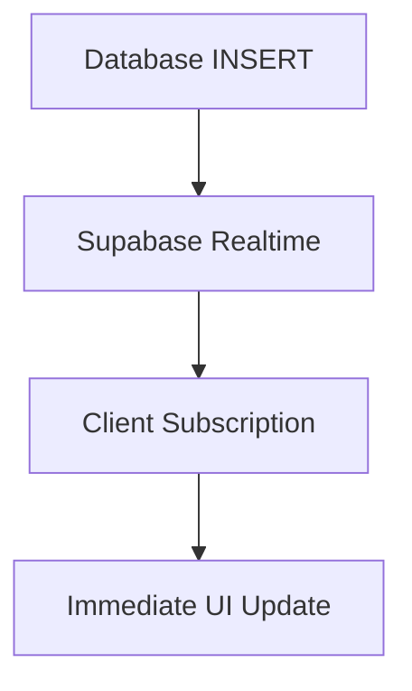

# Notification Relationships

<cite>
**Referenced Files in This Document**   
- [useNotifications.ts](file://src/hooks/useNotifications.ts)
- [useNotifications.ts](file://src/hooks/queries/useNotifications.ts)
- [supabaseHelpers.ts](file://src/lib/supabaseHelpers.ts)
- [NotificationCenter.tsx](file://src/components/NotificationCenter.tsx)
- [NotificationBell.tsx](file://src/components/NotificationBell.tsx)
- [UserSettings.tsx](file://src/pages/UserSettings.tsx)
- [TABLES_ONLY.sql](file://supabase/TABLES_ONLY.sql)
- [BASE_MIGRATION_SAFE.sql](file://supabase/BASE_MIGRATION_SAFE.sql)
- [COMPLETE_SETUP.sql](file://supabase/COMPLETE_SETUP.sql)
- [20251116120215_71189c74-c2d3-4f3e-a1af-87d7e6b5f8fa.sql](file://supabase/migrations/20251116120215_71189c74-c2d3-4f3e-a1af-87d7e6b5f8fa.sql)
- [database.ts](file://src/types/database.ts)
</cite>

## Table of Contents
1. [Introduction](#introduction)
2. [Core Data Model](#core-data-model)
3. [User-Notification Relationship](#user-notification-relationship)
4. [Notification Types](#notification-types)
5. [Source Entity Relationships](#source-entity-relationships)
6. [Notification Triggers](#notification-triggers)
7. [Notification Preferences System](#notification-preferences-system)
8. [Querying Notifications](#querying-notifications)
9. [Performance Considerations](#performance-considerations)
10. [Conclusion](#conclusion)

## Introduction

The notification system in the sleekapp-v100 database provides a comprehensive mechanism for keeping users informed about important events and updates within the application. This documentation details the data model and relationships that power the notification system, focusing on how notifications are connected to users, how different types of notifications are categorized, and how the system automatically generates notifications based on business events. The system supports real-time updates through Supabase's real-time capabilities and allows users to customize their notification preferences.

**Section sources**
- [useNotifications.ts](file://src/hooks/useNotifications.ts#L1-L85)
- [TABLES_ONLY.sql](file://supabase/TABLES_ONLY.sql#L370-L394)

## Core Data Model

The notification system is built around two primary tables: `notifications` and `notification_preferences`. These tables work together to store notification content, track user preferences, and maintain the state of notifications.



**Diagram sources**
- [TABLES_ONLY.sql](file://supabase/TABLES_ONLY.sql#L370-L394)
- [BASE_MIGRATION_SAFE.sql](file://supabase/BASE_MIGRATION_SAFE.sql#L1173-L1203)

## User-Notification Relationship

The relationship between users and notifications is a one-to-many relationship, where a single user can receive multiple notifications over time. This relationship is established through the `user_id` field in the `notifications` table, which references the `id` field in the `auth.users` table.

The `notifications` table contains a `user_id` column that serves as a foreign key to the `auth.users` table, creating a direct relationship between notifications and the users who receive them. Each notification record is associated with exactly one user, while each user can have zero or many notifications. This design allows the system to efficiently query all notifications for a specific user and track which notifications have been read by which users.

The relationship is implemented with the following key fields:
- `notifications.user_id`: References `auth.users.id` to establish ownership
- `notifications.read`: Boolean flag indicating whether the notification has been read
- `notifications.read_at`: Timestamp when the notification was marked as read

This one-to-many relationship enables personalized notification delivery and tracking, ensuring that users only see notifications relevant to them.

**Section sources**
- [TABLES_ONLY.sql](file://supabase/TABLES_ONLY.sql#L380-L394)
- [database.ts](file://src/types/database.ts#L339-L352)

## Notification Types

The notification system supports different types of notifications through the `type` column in the `notifications` table. The system enforces a constraint that limits notification types to specific predefined values, ensuring consistency across the application.

The supported notification types include:
- `order_update`: Notifications related to order status changes and production updates
- `qc_alert`: Quality control alerts and inspection results
- `system`: General system notifications and announcements
- `shipment`: Notifications related to shipping and delivery events

The `type` field is defined as a text column with a CHECK constraint that validates against an array of allowed values. This ensures data integrity and prevents invalid notification types from being stored in the database. Additionally, the `notification_type` field provides an optional secondary classification for notifications, allowing for more granular categorization when needed.

The system also includes a `metadata` field of type JSONB, which can store additional type-specific information such as order details, product information, or other contextual data related to the notification.

**Section sources**
- [TABLES_ONLY.sql](file://supabase/TABLES_ONLY.sql#L393-L394)
- [BASE_MIGRATION_SAFE.sql](file://supabase/BASE_MIGRATION_SAFE.sql#L1202-L1203)

## Source Entity Relationships

Notifications are connected to their source entities through several fields that provide context and navigation capabilities. The primary mechanism for establishing these relationships is through the `resource_type` and `resource_id` fields, although the current implementation primarily uses the `link` and `metadata` fields for this purpose.

The `link` field contains a URL path that directs users to the relevant page within the application when they click on the notification. For example, production update notifications include a link like `/orders/{order_id}` that navigates directly to the specific order details page. This provides a seamless user experience by allowing users to quickly access the context of the notification.

The `metadata` field, stored as JSONB, can contain structured data about the source entity, such as order numbers, product details, or other relevant information. This allows the frontend application to display rich notification content without requiring additional database queries.

Additionally, the `action_url` field provides an alternative or additional URL for taking action related to the notification, offering flexibility in how users interact with different types of notifications.

**Section sources**
- [supabaseHelpers.ts](file://src/lib/supabaseHelpers.ts#L111-L148)
- [useNotifications.ts](file://src/hooks/useNotifications.ts#L37-L48)

## Notification Triggers

The notification system includes automated triggers that generate notifications in response to specific database events. The most prominent of these is the `create_update_notification()` trigger, which automatically creates notifications when production updates occur.

The `create_update_notification()` function is a PostgreSQL trigger function that fires when a new record is inserted into the `order_updates` table. When a supplier or administrator adds a production update for an order, this trigger automatically creates a notification for the buyer associated with that order.



**Diagram sources**
- [20251116120215_71189c74-c2d3-4f3e-a1af-87d7e6b5f8fa.sql](file://supabase/migrations/20251116120215_71189c74-c2d3-4f3e-a1af-87d7e6b5f8fa.sql#L28-L49)
- [COMPLETE_SETUP.sql](file://supabase/COMPLETE_SETUP.sql#L5910-L5931)

The trigger function works as follows:
1. It captures the new record being inserted into the `order_updates` table via the `NEW` variable
2. It queries the `orders` table to retrieve the `buyer_id` associated with the order
3. It inserts a new record into the `notifications` table with relevant details:
   - `user_id`: The buyer's ID
   - `title`: "Production Update: Order #" followed by the order number
   - `message`: "New update at stage: " followed by the production stage
   - `type`: "order_update"
   - `link`: "/orders/" followed by the order ID

This automated process ensures that buyers are immediately notified of production progress without requiring manual intervention from suppliers or administrators.

**Section sources**
- [20251116120215_71189c74-c2d3-4f3e-a1af-87d7e6b5f8fa.sql](file://supabase/migrations/20251116120215_71189c74-c2d3-4f3e-a1af-87d7e6b5f8fa.sql#L28-L49)
- [COMPLETE_SETUP.sql](file://supabase/COMPLETE_SETUP.sql#L5910-L5931)

## Notification Preferences System

Users can control their email notification preferences through the `notification_preferences` table, which allows them to opt in or out of different categories of email notifications. This table establishes a one-to-one relationship between users and their notification settings.

The `notification_preferences` table contains the following email preference fields:
- `email_orders`: Controls whether users receive email notifications for order updates
- `email_messages`: Controls whether users receive email notifications for new messages
- `email_production`: Controls whether users receive email notifications for production updates
- `email_payments`: Controls whether users receive email notifications for payment events

Each preference field is a boolean with a default value of `true`, meaning users are opted into email notifications by default. Users can modify these preferences through the application's settings interface, which updates the corresponding record in the database.



**Diagram sources**
- [UserSettings.tsx](file://src/pages/UserSettings.tsx#L252-L282)
- [TABLES_ONLY.sql](file://supabase/TABLES_ONLY.sql#L370-L379)

The preferences system is integrated with the frontend application through the `UserSettings` component, which provides a user interface for toggling these preferences. When a user changes their preferences, the application updates the corresponding record in the `notification_preferences` table.

**Section sources**
- [UserSettings.tsx](file://src/pages/UserSettings.tsx#L252-L282)
- [TABLES_ONLY.sql](file://supabase/TABLES_ONLY.sql#L370-L379)

## Querying Notifications

The application provides several methods for querying notifications, with a focus on retrieving unread notifications and managing notification state. The primary query pattern involves fetching all notifications for a specific user, ordered by creation date in descending order.

To retrieve unread notifications, the application uses a filter on the `read` field or the `read_at` timestamp. The most common query retrieves all notifications for a user and then filters for those where `read_at` is null:

```sql
SELECT * FROM notifications 
WHERE user_id = 'user-id-here' 
ORDER BY created_at DESC;
```

Then in the application code, unread notifications are filtered as:
```typescript
const unreadCount = notifications.filter(n => !n.read_at).length;
```

The system also supports marking notifications as read through both individual and bulk operations:

1. **Mark single notification as read:**
```sql
UPDATE notifications 
SET read = true, read_at = NOW() 
WHERE id = 'notification-id' AND user_id = 'user-id';
```

2. **Mark all notifications as read:**
```sql
UPDATE notifications 
SET read = true, read_at = NOW() 
WHERE user_id = 'user-id' AND read = false;
```

The frontend implementation uses React Query for efficient data fetching and caching, with mutation functions that provide optimistic updates to improve user experience. When a user marks a notification as read, the UI updates immediately while the background request completes.

**Section sources**
- [useNotifications.ts](file://src/hooks/useNotifications.ts#L18-L35)
- [supabaseHelpers.ts](file://src/lib/supabaseHelpers.ts#L111-L139)
- [useNotifications.ts](file://src/hooks/queries/useNotifications.ts#L12-L21)

## Performance Considerations

The notification system has been designed with several performance considerations to ensure scalability and responsiveness:

1. **Indexing Strategy**: The `notifications` table should have appropriate indexes on frequently queried columns:
   - An index on `user_id` for efficient retrieval of user-specific notifications
   - An index on `created_at` for chronological ordering
   - A composite index on `user_id` and `created_at` for the most common query pattern

2. **Real-time Updates**: The system uses Supabase's real-time capabilities to push new notifications to clients without requiring polling. This reduces database load and provides immediate notification delivery:



3. **Query Optimization**: The application limits notification retrieval to a reasonable number (typically the 10 most recent) for display in the notification bell, while providing a full view in the notification center.

4. **Caching Strategy**: React Query provides client-side caching with automatic invalidation when notifications are marked as read or new notifications arrive.

5. **Bulk Operations**: The system supports bulk updates for marking all notifications as read, reducing the number of database round trips.

6. **Data Retention**: While not explicitly defined in the current schema, a production system should implement a data retention policy to archive or purge old notifications to maintain database performance.

The combination of efficient database queries, real-time updates, and client-side caching ensures that the notification system remains performant even as the number of users and notifications grows.

**Section sources**
- [NotificationCenter.tsx](file://src/components/NotificationCenter.tsx#L1-L87)
- [NotificationBell.tsx](file://src/components/NotificationBell.tsx#L39-L122)
- [useNotifications.ts](file://src/hooks/queries/useNotifications.ts#L1-L134)

## Conclusion

The notification system in the sleekapp-v100 database provides a robust and scalable solution for user communication. By establishing a clear one-to-many relationship between users and notifications, supporting multiple notification types, and connecting notifications to their source entities, the system delivers relevant information to users in a timely manner.

Key features of the system include:
- Automated notification generation through database triggers
- User-controlled email preferences for personalized communication
- Real-time delivery using Supabase's real-time capabilities
- Efficient querying patterns for optimal performance
- Comprehensive data model that supports various notification use cases

The system effectively balances automation with user control, ensuring that users stay informed about important events while maintaining control over their notification experience. The integration between the database layer and frontend application provides a seamless user experience from notification generation to interaction.