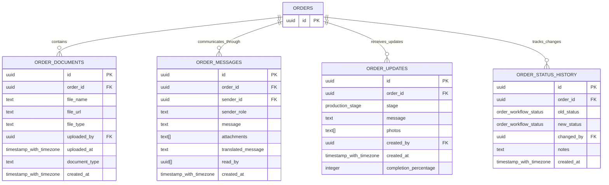

# Order Relationships

<cite>
**Referenced Files in This Document**
- [TABLES_ONLY.sql](file://supabase/TABLES_ONLY.sql)
- [database.ts](file://src/types/database.ts)
- [order.ts](file://src/types/order.ts)
- [useOrderManagement.ts](file://src/hooks/useOrderManagement.ts)
- [useSupplierOrders.ts](file://src/hooks/useSupplierOrders.ts)
- [supabaseHelpers.ts](file://src/lib/supabaseHelpers.ts)
- [Orders.tsx](file://src/pages/Orders.tsx)
- [OrderStatusBoard.tsx](file://src/components/admin/OrderStatusBoard.tsx)
- [BuyerOrderTracking.tsx](file://src/components/buyer/BuyerOrderTracking.tsx)
- [SupplierOrderDetailModal.tsx](file://src/components/supplier/SupplierOrderDetailModal.tsx)
</cite>

## Table of Contents
1. [Introduction](#introduction)
2. [Core Order Entities](#core-order-entities)
3. [Foreign Key Relationships](#foreign-key-relationships)
4. [Order Lifecycle Management](#order-lifecycle-management)
5. [Related Entity Relationships](#related-entity-relationships)
6. [Order Workflow Status Tracking](#order-workflow-status-tracking)
7. [Query Examples](#query-examples)
8. [Referential Integrity Constraints](#referential-integrity-constraints)
9. [Implementation Patterns](#implementation-patterns)
10. [Best Practices](#best-practices)

## Introduction

The sleekapp-v100 database implements a sophisticated order management system that handles the complete lifecycle of textile manufacturing orders. The system maintains complex relationships between orders, supplier orders, and various supporting entities while ensuring data consistency through robust referential integrity constraints.

This documentation provides comprehensive coverage of the order relationships, including the primary order entity, supplier-specific order management, and all related supporting tables that track communications, documents, updates, and status changes throughout the order lifecycle.

## Core Order Entities

The order management system consists of several interconnected entities that work together to manage the complete order lifecycle from initial quote requests through final delivery.

### Main Orders Table

The central `orders` table serves as the primary entity for managing customer orders:


**Diagram sources**
- [TABLES_ONLY.sql](file://supabase/TABLES_ONLY.sql#L437-L477)
- [TABLES_ONLY.sql](file://supabase/TABLES_ONLY.sql#L758-L783)

### Supporting Order Tables

The system includes several supporting tables that provide comprehensive order management capabilities:



**Diagram sources**
- [TABLES_ONLY.sql](file://supabase/TABLES_ONLY.sql#L395-L425)
- [TABLES_ONLY.sql](file://supabase/TABLES_ONLY.sql#L437-L477)

**Section sources**
- [TABLES_ONLY.sql](file://supabase/TABLES_ONLY.sql#L395-L425)
- [TABLES_ONLY.sql](file://supabase/TABLES_ONLY.sql#L437-L477)

## Foreign Key Relationships

The order system implements a comprehensive set of foreign key relationships that ensure data integrity and enable complex queries across related entities.

### Primary Foreign Key Relationships

The main order entity establishes several critical foreign key relationships:

| Relationship | Source Column | Target Table | Purpose |
|--------------|---------------|--------------|---------|
| `buyer_id` | orders.buyer_id | profiles.id | Links orders to purchasing customers |
| `supplier_id` | orders.supplier_id | suppliers.id | Associates orders with manufacturing suppliers |
| `factory_id` | orders.factory_id | suppliers.id | Identifies production facilities |
| `quote_id` | orders.quote_id | ai_quotes.id | Connects orders to AI-generated quotes |
| `assigned_by` | orders.assigned_by | auth.users.id | Tracks who assigned the order |

### Supplier Order Relationships

The supplier orders table maintains specific relationships for supplier-specific order management:

| Relationship | Source Column | Target Table | Purpose |
|--------------|---------------|--------------|---------|
| `supplier_id` | supplier_orders.supplier_id | suppliers.id | Links supplier orders to specific suppliers |
| `buyer_order_id` | supplier_orders.buyer_order_id | orders.id | Creates bidirectional relationship between main and supplier orders |
| `created_by` | supplier_orders.created_by | auth.users.id | Tracks who created the supplier order |

### Referential Integrity Implementation

The database enforces referential integrity through carefully designed foreign key constraints:


**Diagram sources**
- [TABLES_ONLY.sql](file://supabase/TABLES_ONLY.sql#L437-L477)
- [TABLES_ONLY.sql](file://supabase/TABLES_ONLY.sql#L758-L783)
- [TABLES_ONLY.sql](file://supabase/TABLES_ONLY.sql#L395-L425)

**Section sources**
- [TABLES_ONLY.sql](file://supabase/TABLES_ONLY.sql#L437-L477)
- [TABLES_ONLY.sql](file://supabase/TABLES_ONLY.sql#L758-L783)
- [TABLES_ONLY.sql](file://supabase/TABLES_ONLY.sql#L395-L425)

## Order Lifecycle Management

The order system implements a comprehensive lifecycle management approach that tracks orders through multiple stages and states.

### Order Creation and Initial Processing

New orders begin with the `quote_requested` workflow status and progress through various stages:


**Diagram sources**
- [TABLES_ONLY.sql](file://supabase/TABLES_ONLY.sql#L25-L42)

### Status Tracking Mechanism

The system maintains detailed status tracking through the order_status_history table:


**Diagram sources**
- [useOrderManagement.ts](file://src/hooks/useOrderManagement.ts#L11-L43)
- [TABLES_ONLY.sql](file://supabase/TABLES_ONLY.sql#L418-L425)

**Section sources**
- [TABLES_ONLY.sql](file://supabase/TABLES_ONLY.sql#L25-L42)
- [useOrderManagement.ts](file://src/hooks/useOrderManagement.ts#L11-L43)

## Related Entity Relationships

The order system maintains rich relationships with various supporting entities that provide comprehensive order management capabilities.

### One-to-Many Relationships

Each order can have multiple related entities:


**Diagram sources**
- [TABLES_ONLY.sql](file://supabase/TABLES_ONLY.sql#L395-L425)
- [TABLES_ONLY.sql](file://supabase/TABLES_ONLY.sql#L437-L477)

### Supplier Order Integration

The system maintains bidirectional relationships between main orders and supplier-specific orders:


**Diagram sources**
- [useOrderManagement.ts](file://src/hooks/useOrderManagement.ts#L52-L104)
- [TABLES_ONLY.sql](file://supabase/TABLES_ONLY.sql#L758-L783)

**Section sources**
- [TABLES_ONLY.sql](file://supabase/TABLES_ONLY.sql#L395-L425)
- [TABLES_ONLY.sql](file://supabase/TABLES_ONLY.sql#L758-L783)
- [useOrderManagement.ts](file://src/hooks/useOrderManagement.ts#L52-L104)

## Order Workflow Status Tracking

The system implements a comprehensive workflow status tracking mechanism that monitors orders through 14 distinct states across the complete order lifecycle.

### Workflow Status Enum Definition

The `order_workflow_status` enum defines the complete order lifecycle states:

| Status | Description | Typical Duration | Key Actions |
|--------|-------------|------------------|-------------|
| `quote_requested` | Initial quote request from buyer | 1-3 days | Quote generation, customer response |
| `quote_sent` | Quote sent to customer | Immediate | Customer review period |
| `admin_review` | Administrative approval required | 1-2 days | Manager review and approval |
| `awaiting_payment` | Payment pending | 1-5 days | Payment processing |
| `payment_received` | Payment confirmed | Immediate | Order activation |
| `assigned_to_supplier` | Supplier assignment | 1-3 days | Supplier notification |
| `sample_requested` | Sample production required | 7-14 days | Sample preparation |
| `sample_submitted` | Sample delivered to buyer | 3-5 days | Buyer evaluation |
| `sample_approved` | Sample approved | Immediate | Bulk production start |
| `bulk_production` | Large-scale manufacturing | 30-90 days | Production monitoring |
| `qc_inspection` | Quality control inspection | 3-5 days | Quality assessment |
| `ready_to_ship` | Ready for shipment | 1-2 days | Logistics preparation |
| `shipped` | Shipment dispatched | Variable | Carrier handover |
| `delivered` | Delivery confirmed | 3-7 days | Customer receipt |
| `completed` | Order completion confirmed | Immediate | Final closure |
| `cancelled` | Order cancelled | Immediate | Refund processing |
| `on_hold` | Order temporarily suspended | Variable | Issue resolution |

### Status Transition Logic

The system implements sophisticated status transition logic that ensures proper workflow progression:


**Diagram sources**
- [TABLES_ONLY.sql](file://supabase/TABLES_ONLY.sql#L25-L42)

**Section sources**
- [TABLES_ONLY.sql](file://supabase/TABLES_ONLY.sql#L25-L42)
- [OrderStatusBoard.tsx](file://src/components/admin/OrderStatusBoard.tsx#L10-L43)

## Query Examples

The system provides various query patterns for retrieving order data with all related entities.

### Basic Order Retrieval

Retrieve basic order information with buyer details:

```typescript
// Example query pattern from supabaseHelpers
const { data, error } = await supabase
  .from('orders')
  .select(`
    *,
    supplier:suppliers(*),
    buyer:profiles(*)
  `)
  .eq('id', orderId)
  .maybeSingle();
```

### Comprehensive Order with All Relations

Retrieve order with all related entities:

```typescript
// Full order retrieval with relations
const { data, error } = await supabase
  .from('orders')
  .select(`
    *,
    supplier:suppliers(*),
    order_documents(*),
    order_messages(*),
    order_updates(*),
    order_status_history(*)
  `)
  .eq('id', orderId)
  .maybeSingle();
```

### Supplier Order Queries

Query supplier orders with buyer order details:

```typescript
// Supplier-specific order queries
const { data, error } = await supabase
  .from('supplier_orders')
  .select(`
    *,
    supplier:suppliers(company_name),
    buyer_order:orders(
      order_number,
      buyer_id,
      buyer:profiles(full_name, company_name)
    )
  `)
  .eq('supplier_id', supplierId)
  .order('created_at', { ascending: false });
```

### Order Status History Queries

Track order status changes:

```typescript
// Status history for order tracking
const { data, error } = await supabase
  .from('order_status_history')
  .select('*')
  .eq('order_id', orderId)
  .order('created_at', { ascending: true });
```

**Section sources**
- [supabaseHelpers.ts](file://src/lib/supabaseHelpers.ts#L52-L64)
- [useSupplierOrders.ts](file://src/hooks/useSupplierOrders.ts#L10-L26)
- [supabaseHelpers.ts](file://src/lib/supabaseHelpers.ts#L11-L18)

## Referential Integrity Constraints

The system implements comprehensive referential integrity constraints to maintain data consistency across all order-related entities.

### Cascade Delete Relationships

Several foreign key relationships implement cascade delete behavior:

| Constraint | Source Table | Target Table | Action |
|------------|--------------|--------------|--------|
| `supplier_orders_buyer_order_id_fkey` | supplier_orders | orders | CASCADE DELETE |
| `supplier_performance_supplier_order_id_fkey` | supplier_performance | supplier_orders | CASCADE DELETE |
| `supplier_ratings_order_id_fkey` | supplier_ratings | orders | SET NULL |
| `supplier_quotes_quote_id_fkey` | supplier_quotes | quotes | CASCADE DELETE |
| `supplier_quotes_supplier_id_fkey` | supplier_quotes | suppliers | CASCADE DELETE |

### Validation Constraints

The system implements various validation constraints to ensure data integrity:

```mermaid
graph TD
A[orders] --> B[quantity > 0]
A --> C[status in ('pending', 'confirmed', 'in_production', 'quality_check', 'shipped', 'delivered', 'cancelled')]
A --> D[workflow_status enum]
E[supplier_orders] --> F[acceptance_status enum]
E --> G[target_date validation]
H[order_updates] --> I[completion_percentage 0-100]
H --> J[stage enum]
K[order_messages] --> L[sender_role validation]
K --> M[message length limits]
```

**Diagram sources**
- [TABLES_ONLY.sql](file://supabase/TABLES_ONLY.sql#L476-L477)
- [TABLES_ONLY.sql](file://supabase/TABLES_ONLY.sql#L782-L782)
- [TABLES_ONLY.sql](file://supabase/TABLES_ONLY.sql#L463-L463)

### Data Consistency Measures

The system implements several measures to maintain data consistency:

1. **Atomic Operations**: Order updates are performed atomically to prevent partial state changes
2. **Transaction Support**: Critical order operations use database transactions
3. **Validation Triggers**: Custom triggers enforce business rules
4. **Audit Logging**: All order changes are logged for compliance and debugging

**Section sources**
- [TABLES_ONLY.sql](file://supabase/TABLES_ONLY.sql#L476-L477)
- [TABLES_ONLY.sql](file://supabase/TABLES_ONLY.sql#L782-L782)
- [TABLES_ONLY.sql](file://supabase/TABLES_ONLY.sql#L463-L463)

## Implementation Patterns

The system implements several key patterns for managing order relationships effectively.

### Bidirectional Order Linking

The buyer_order_id field in supplier_orders creates a bidirectional relationship:


**Diagram sources**
- [TABLES_ONLY.sql](file://supabase/TABLES_ONLY.sql#L762-L762)

### Role-Based Access Control

The system implements role-based access control for order operations:


**Diagram sources**
- [Orders.tsx](file://src/pages/Orders.tsx#L67-L82)

### Asynchronous Processing

The system handles asynchronous operations for order management:


**Section sources**
- [TABLES_ONLY.sql](file://supabase/TABLES_ONLY.sql#L762-L762)
- [Orders.tsx](file://src/pages/Orders.tsx#L67-L82)
- [useOrderManagement.ts](file://src/hooks/useOrderManagement.ts#L11-L43)

## Best Practices

### Data Modeling Guidelines

1. **Normalization**: Maintain third normal form for all order-related tables
2. **Indexing**: Properly index foreign keys for efficient joins
3. **Partitioning**: Consider partitioning large order tables by date or status
4. **Archiving**: Implement automated archiving for completed orders

### Performance Optimization

1. **Selective Queries**: Use selective field lists in queries to reduce data transfer
2. **Pagination**: Implement pagination for large order lists
3. **Caching**: Cache frequently accessed order data
4. **Connection Pooling**: Use connection pooling for database operations

### Security Considerations

1. **Access Control**: Implement strict role-based access controls
2. **Audit Trails**: Maintain comprehensive audit trails for all order changes
3. **Data Encryption**: Encrypt sensitive order data at rest and in transit
4. **Validation**: Implement comprehensive input validation and sanitization

### Monitoring and Maintenance

1. **Health Checks**: Implement database health checks for order tables
2. **Performance Metrics**: Monitor query performance and optimize regularly
3. **Backup Strategies**: Implement robust backup strategies for order data
4. **Disaster Recovery**: Plan for disaster recovery scenarios

**Section sources**
- [supabaseHelpers.ts](file://src/lib/supabaseHelpers.ts#L52-L64)
- [useOrderManagement.ts](file://src/hooks/useOrderManagement.ts#L11-L43)
- [Orders.tsx](file://src/pages/Orders.tsx#L67-L82)