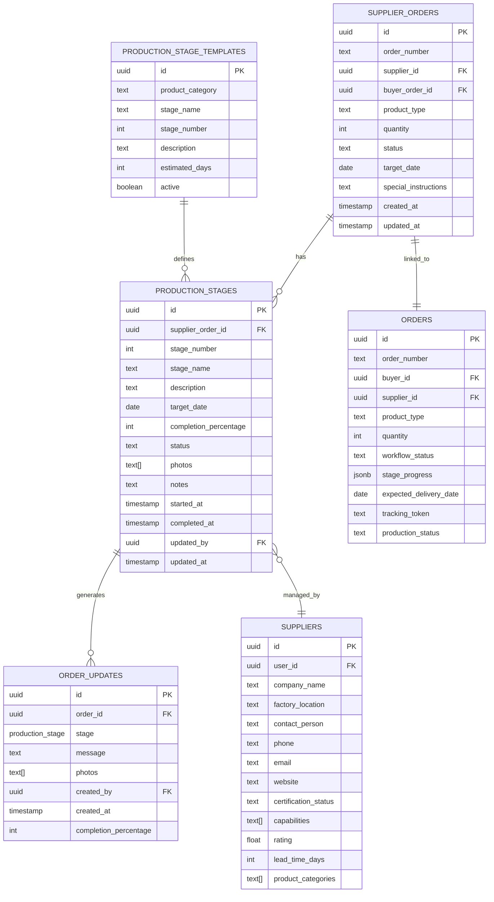
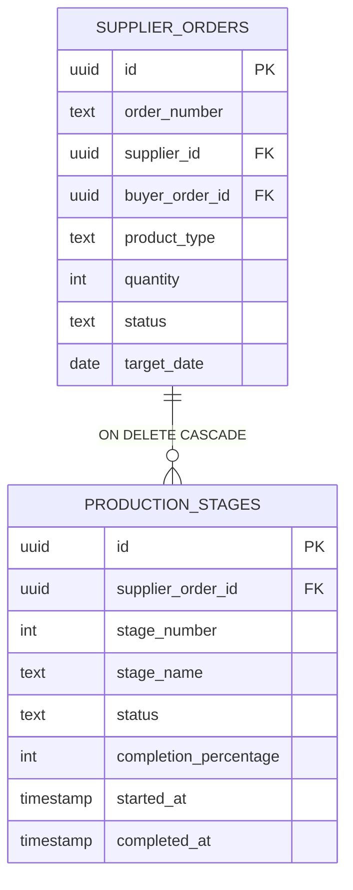
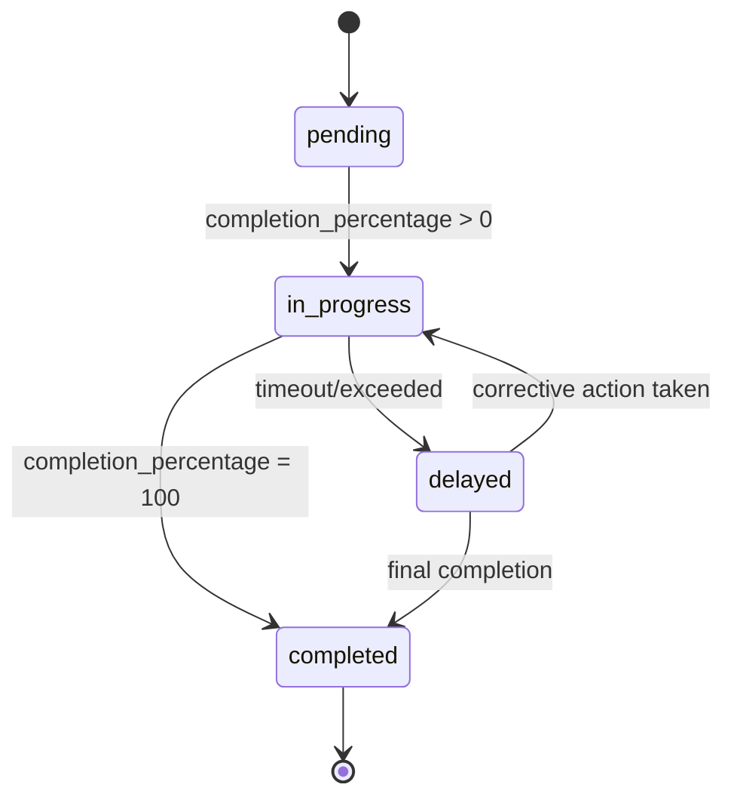
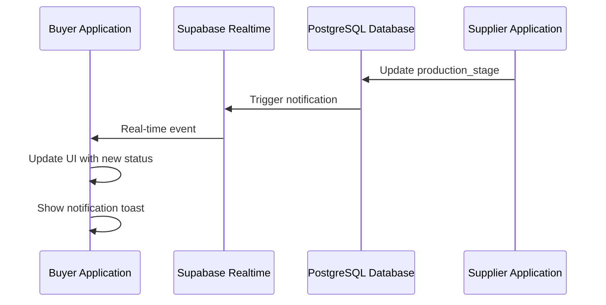
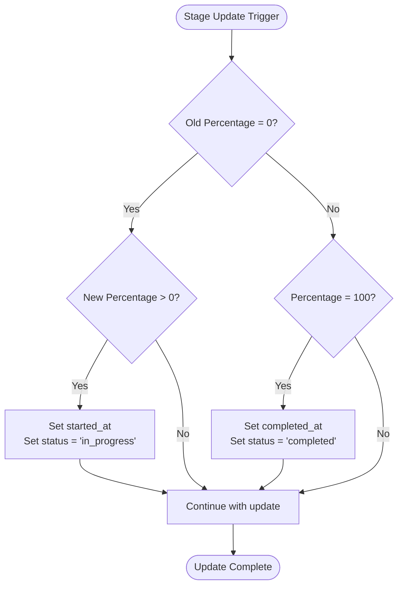

# Production Tracking Relationships

<cite>
**Referenced Files in This Document**
- [20251115150759_remix_migration_from_pg_dump.sql](file://supabase/migrations/20251115150759_remix_migration_from_pg_dump.sql)
- [BASE_MIGRATION_SAFE.sql](file://supabase/BASE_MIGRATION_SAFE.sql)
- [COMPLETE_SETUP.sql](file://supabase/COMPLETE_SETUP.sql)
- [TABLES_ONLY.sql](file://supabase/TABLES_ONLY.sql)
- [FIXED_SETUP_PART1.sql](file://supabase/FIXED_SETUP_PART1.sql)
- [seed_comprehensive_test_data.sql](file://supabase/seed_comprehensive_test_data.sql)
- [LoopTraceOrderTracking.tsx](file://src/components/buyer/LoopTraceOrderTracking.tsx)
- [ProductionStageUpdate.tsx](file://src/components/supplier/ProductionStageUpdate.tsx)
- [ProductionManagementPanel.tsx](file://src/components/supplier/ProductionManagementPanel.tsx)
- [useSupplierOrders.ts](file://src/hooks/useSupplierOrders.ts)
- [ProductionTimeline.tsx](file://src/components/ProductionTimeline.tsx)
- [LoopTraceTimeline.tsx](file://src/components/modern/LoopTraceTimeline.tsx)
- [types.ts](file://src/integrations/supabase/types.ts)
- [update_production_stage_status.sql](file://supabase/migrations/20251116234043_f67b0d03-5c6e-474c-9fbc-c8e28e28a664.sql)
- [initialize-production-stages/index.ts](file://supabase/functions/initialize-production-stages/index.ts)
- [ProductionTracking.tsx](file://src/pages/ProductionTracking.tsx)
</cite>

## Table of Contents
1. [Introduction](#introduction)
2. [Database Schema Overview](#database-schema-overview)
3. [Core Relationship Architecture](#core-relationship-architecture)
4. [Production Stage Lifecycle](#production-stage-lifecycle)
5. [Real-Time Tracking System](#real-time-tracking-system)
6. [Query Patterns and Data Access](#query-patterns-and-data-access)
7. [Trigger Functions and Automation](#trigger-functions-and-automation)
8. [Performance Considerations](#performance-considerations)
9. [Troubleshooting Guide](#troubleshooting-guide)
10. [Conclusion](#conclusion)

## Introduction

The sleekapp-v100 production tracking system implements a sophisticated relational database architecture centered around the `production_stages` and `supplier_orders` tables. This system enables real-time monitoring of manufacturing processes through a comprehensive eight-stage production pipeline, automated status transitions, and seamless integration between buyers, suppliers, and factories.

The LoopTrace™ technology provides real-time visibility into production progress, enabling stakeholders to track orders from initial yarn receipt through final shipment. The system automatically manages stage transitions, calculates completion percentages, and maintains historical records for performance analysis.

## Database Schema Overview

The production tracking system consists of several interconnected tables that manage the complete lifecycle of manufacturing orders:



**Diagram sources**
- [TABLES_ONLY.sql](file://supabase/TABLES_ONLY.sql#L426-L541)
- [BASE_MIGRATION_SAFE.sql](file://supabase/BASE_MIGRATION_SAFE.sql#L1257-L1292)

**Section sources**
- [TABLES_ONLY.sql](file://supabase/TABLES_ONLY.sql#L426-L541)
- [BASE_MIGRATION_SAFE.sql](file://supabase/BASE_MIGRATION_SAFE.sql#L1257-L1292)

## Core Relationship Architecture

### Primary Relationship: Supplier Orders to Production Stages

The fundamental relationship in the production tracking system is the one-to-many association between `supplier_orders` and `production_stages`. This relationship is established through the foreign key constraint `production_stages.supplier_order_id` referencing `supplier_orders.id`.



**Diagram sources**
- [BASE_MIGRATION_SAFE.sql](file://supabase/BASE_MIGRATION_SAFE.sql#L3306-L3310)

The `ON DELETE CASCADE` constraint ensures that when a supplier order is deleted, all associated production stages are automatically removed, maintaining referential integrity and preventing orphaned records.

### Enum Definition: ProductionStage

The system defines an enumeration type `production_stage` that governs the standardized eight-stage production process:

| Stage Number | Stage Name | Description | Typical Duration |
|--------------|------------|-------------|------------------|
| 1 | yarn_received | Yarn materials received and inspected | 2-3 days |
| 2 | knitting | Knitting fabric on machines | 5-7 days |
| 3 | linking | Linking knitted pieces together | 3-5 days |
| 4 | washing_finishing | Washing and finishing treatment | 2-3 days |
| 5 | final_qc | Quality control inspection | 1-2 days |
| 6 | packing | Packaging for shipment | 1 day |
| 7 | ready_to_ship | Ready for pickup/delivery | 1 day |

**Section sources**
- [types.ts](file://src/integrations/supabase/types.ts#L4186-L4193)
- [ProductionTimeline.tsx](file://src/components/ProductionTimeline.tsx#L5-L12)

## Production Stage Lifecycle

### Status Tracking System

Each production stage maintains comprehensive status tracking through four distinct states:



**Diagram sources**
- [update_production_stage_status.sql](file://supabase/migrations/20251116234043_f67b0d03-5c6e-474c-9fbc-c8e28e28a664.sql#L37-L52)

### Progress Metrics and Completion Logic

The production tracking system implements intelligent progress calculation through completion percentage metrics:

- **Completion Percentage**: Ranges from 0-100%, stored as integer with validation constraints
- **Status Transitions**: Automatic state changes based on percentage thresholds
- **Timestamp Management**: Automatic recording of `started_at` and `completed_at` timestamps
- **Progress Validation**: Ensures logical progression through stages

**Section sources**
- [update_production_stage_status.sql](file://supabase/migrations/20251116234043_f67b0d03-5c6e-474c-9fbc-c8e28e28a664.sql#L37-L52)
- [ProductionStageUpdate.tsx](file://src/components/supplier/ProductionStageUpdate.tsx#L23-L26)

## Real-Time Tracking System

### Supabase Real-Time Subscriptions

The LoopTrace™ system leverages Supabase's real-time capabilities to provide instant updates to production stage changes:



**Diagram sources**
- [LoopTraceOrderTracking.tsx](file://src/components/buyer/LoopTraceOrderTracking.tsx#L77-L108)

### Implementation Details

The real-time tracking system operates through several key components:

1. **Event Filtering**: Subscriptions filter events by `supplier_order_id` for targeted updates
2. **Automatic Refresh**: UI components automatically refresh when changes occur
3. **Notification System**: Toast notifications inform users of significant status changes
4. **Connection Management**: Proper cleanup ensures efficient resource utilization

**Section sources**
- [LoopTraceOrderTracking.tsx](file://src/components/buyer/LoopTraceOrderTracking.tsx#L58-L119)
- [ProductionTracking.tsx](file://src/pages/ProductionTracking.tsx#L63-L87)

## Query Patterns and Data Access

### Common Query Patterns

The production tracking system supports various query patterns for different use cases:

#### Order Summary Queries
```sql
-- Get all orders with production status
SELECT 
    o.id, 
    o.order_number, 
    so.id as supplier_order_id,
    so.status as order_status,
    ps.stage_name,
    ps.status as stage_status,
    ps.completion_percentage
FROM orders o
JOIN supplier_orders so ON o.id = so.buyer_order_id
JOIN production_stages ps ON so.id = ps.supplier_order_id
WHERE o.buyer_id = $1
ORDER BY ps.stage_number;
```

#### Stage Progress Aggregation
```sql
-- Calculate overall production progress
SELECT 
    supplier_order_id,
    COUNT(*) as total_stages,
    SUM(CASE WHEN status = 'completed' THEN 1 ELSE 0 END) as completed_stages,
    AVG(completion_percentage) as avg_progress
FROM production_stages
GROUP BY supplier_order_id;
```

#### Real-Time Data Access
The system provides real-time access through Supabase's reactive queries, enabling immediate reflection of production changes in the user interface.

**Section sources**
- [LoopTraceOrderTracking.tsx](file://src/components/buyer/LoopTraceOrderTracking.tsx#L191-L207)
- [useSupplierOrders.ts](file://src/hooks/useSupplierOrders.ts#L10-L38)

## Trigger Functions and Automation

### update_production_stage_status Trigger

The heart of the automation system is the `update_production_stage_status` trigger function, which automatically manages stage state transitions:



**Diagram sources**
- [update_production_stage_status.sql](file://supabase/migrations/20251116234043_f67b0d03-5c6e-474c-9fbc-c8e28e28a664.sql#L37-L52)

### Automated Initialization

The `initialize-production-stages` function automatically creates production stages based on product categories:

**Section sources**
- [update_production_stage_status.sql](file://supabase/migrations/20251116234043_f67b0d03-5c6e-474c-9fbc-c8e28e28a664.sql#L30-L133)
- [initialize-production-stages/index.ts](file://supabase/functions/initialize-production-stages/index.ts#L40-L102)

## Performance Considerations

### Database Optimization

The production tracking system implements several performance optimization strategies:

1. **Indexing Strategy**: Strategic indexing on frequently queried columns
2. **Partitioning**: Logical partitioning of large datasets
3. **Query Optimization**: Efficient query patterns for real-time access
4. **Connection Pooling**: Optimized database connection management

### Scalability Features

- **Horizontal Scaling**: Support for distributed database deployments
- **Caching Layers**: Intelligent caching for frequently accessed data
- **Batch Operations**: Efficient bulk processing capabilities
- **Resource Monitoring**: Built-in performance monitoring and alerting

## Troubleshooting Guide

### Common Issues and Solutions

#### Real-Time Subscription Problems
- **Issue**: Stages not updating in real-time
- **Solution**: Verify Supabase connection and subscription filters
- **Debug**: Check browser console for WebSocket errors

#### Stage Status Transition Failures
- **Issue**: Stages stuck in pending or incorrect status
- **Solution**: Manually update completion percentage or reset stage
- **Debug**: Review trigger function logs and constraints

#### Performance Degradation
- **Issue**: Slow query response times
- **Solution**: Optimize indexes and query patterns
- **Debug**: Monitor database query execution plans

**Section sources**
- [LoopTraceOrderTracking.tsx](file://src/components/buyer/LoopTraceOrderTracking.tsx#L208-L210)
- [ProductionStageUpdate.tsx](file://src/components/supplier/ProductionStageUpdate.tsx#L74-L83)

## Conclusion

The sleekapp-v100 production tracking system demonstrates a sophisticated approach to manufacturing visibility and control. Through carefully designed database relationships, automated trigger functions, and real-time synchronization capabilities, the system provides comprehensive oversight of the entire production lifecycle.

The eight-stage production process, combined with intelligent status management and real-time tracking, enables stakeholders to maintain optimal visibility into order progress while automating routine administrative tasks. The system's architecture supports both current operational needs and future scalability requirements, making it a robust foundation for manufacturing operations management.

The integration of Supabase's real-time capabilities with PostgreSQL's transactional reliability creates a powerful platform for production tracking that balances performance, reliability, and user experience. This system serves as an exemplary implementation of modern database-driven manufacturing visibility solutions.