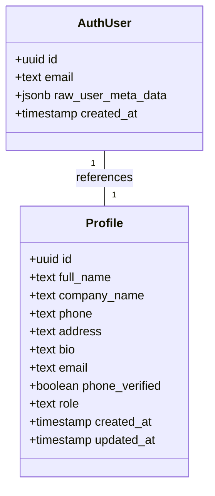
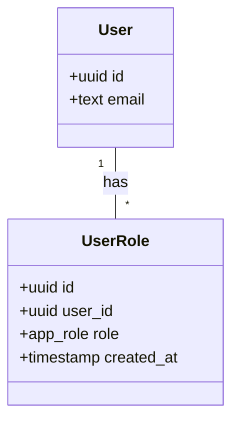
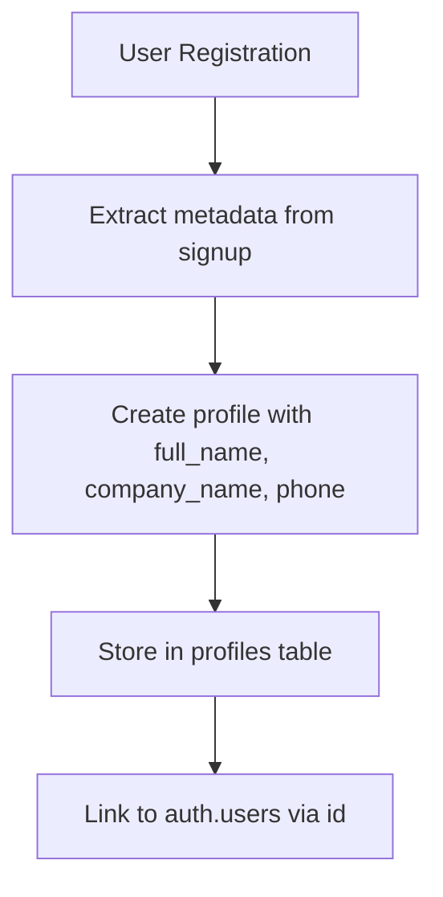
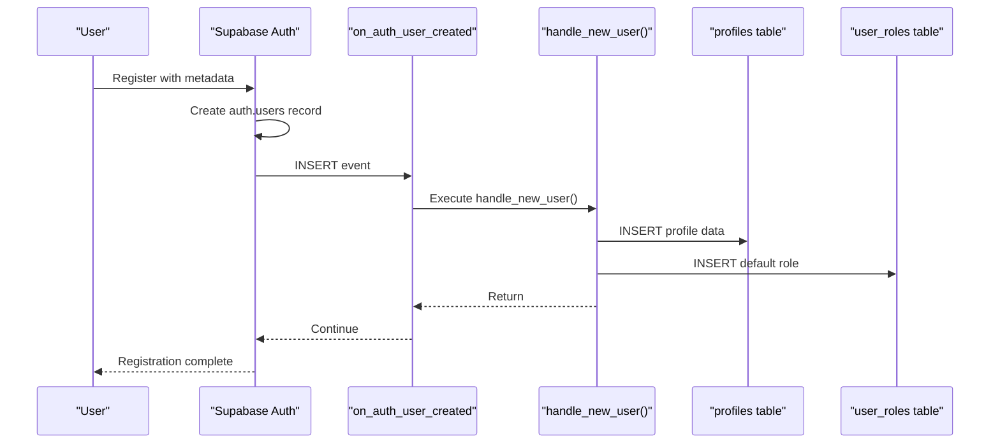

# User Relationships

<cite>
**Referenced Files in This Document**   
- [supabase/COMPLETE_SETUP.sql](file://supabase/COMPLETE_SETUP.sql)
- [supabase/TABLES_ONLY.sql](file://supabase/TABLES_ONLY.sql)
- [supabase/migrations/20251116171705_54ddacc9-3b19-4039-bee0-08ef16d43884.sql](file://supabase/migrations/20251116171705_54ddacc9-3b19-4039-bee0-08ef16d43884.sql)
- [src/lib/supabaseHelpers.ts](file://src/lib/supabaseHelpers.ts)
- [src/integrations/supabase/types.ts](file://src/integrations/supabase/types.ts)
</cite>

## Table of Contents
1. [Introduction](#introduction)
2. [Core Data Model](#core-data-model)
3. [One-to-One Relationship: auth.users and profiles](#one-to-one-relationship-authusers-and-profiles)
4. [One-to-Many Relationship: users and user_roles](#one-to-many-relationship-users-and-user_roles)
5. [Role-Based Access Control](#role-based-access-control)
6. [User Profile Structure](#user-profile-structure)
7. [Security Implementation](#security-implementation)
8. [Automated User Setup](#automated-user-setup)
9. [Querying User Data](#querying-user-data)
10. [Performance Considerations](#performance-considerations)

## Introduction
This document provides comprehensive documentation for user relationships in the sleekapp-v100 database. It details the core relationships between users, profiles, and roles, explaining how the system implements role-based access control and manages user data. The documentation covers the one-to-one relationship between authentication users and profiles, the one-to-many relationship between users and roles, and the security implications of these relationships. It also explains how user data is automatically created and managed through database triggers and functions.

## Core Data Model
The user relationship system in sleekapp-v100 is built around three core components: authentication users, user profiles, and user roles. These components work together to provide a secure and flexible user management system that supports multiple user types and access levels.

```mermaid
erDiagram
auth.users ||--|| profiles : "1-to-1"
auth.users ||--o{ user_roles : "1-to-many"
auth.users {
uuid id PK
text email
jsonb raw_user_meta_data
timestamp created_at
}
profiles {
uuid id PK FK
text full_name
text company_name
text phone
text address
text bio
text email
boolean phone_verified
text role
timestamp created_at
timestamp updated_at
}
user_roles {
uuid id PK
uuid user_id FK
app_role role
timestamp created_at
}
app_role {
retailer
wholesaler
educational
corporate
sports_team
factory
admin
supplier
}
```

**Diagram sources**
- [supabase/TABLES_ONLY.sql](file://supabase/TABLES_ONLY.sql#L560-L573)
- [supabase/TABLES_ONLY.sql](file://supabase/TABLES_ONLY.sql#L875-L881)
- [supabase/TABLES_ONLY.sql](file://supabase/TABLES_ONLY.sql#L19-L27)

## One-to-One Relationship: auth.users and profiles
The sleekapp-v100 database implements a one-to-one relationship between the `auth.users` table (managed by Supabase Auth) and the `profiles` table. This relationship ensures that each authenticated user has exactly one corresponding profile that stores extended information.

The relationship is established through a foreign key constraint where the `profiles.id` column references the `auth.users.id` column. This design choice creates a direct mapping between authentication credentials and user profile data, while maintaining separation between security-critical authentication data and user-specific profile information.

A critical aspect of this relationship is the `ON DELETE CASCADE` behavior. When a user is deleted from the `auth.users` table, their corresponding profile in the `profiles` table is automatically deleted as well. This ensures data consistency and prevents orphaned profile records in the database.



**Diagram sources**
- [supabase/TABLES_ONLY.sql](file://supabase/TABLES_ONLY.sql#L560-L573)
- [supabase/COMPLETE_SETUP.sql](file://supabase/COMPLETE_SETUP.sql#L334-L340)

## One-to-Many Relationship: users and user_roles
The user role system in sleekapp-v100 implements a one-to-many relationship between users and roles, allowing a single user to have multiple roles within the application. This flexible design supports complex business requirements where users may need different permissions in different contexts.

The relationship is implemented through the `user_roles` table, which contains a `user_id` foreign key that references the `auth.users.id` column. Each record in the `user_roles` table represents a single role assignment for a user. This design allows users to have multiple roles simultaneously, such as being both a 'buyer' and a 'supplier' in different contexts.

The `user_roles` table includes a composite primary key consisting of the `id` column and a unique constraint on the combination of `user_id` and `role`. This prevents duplicate role assignments for the same user, ensuring data integrity while allowing multiple distinct roles per user.



**Diagram sources**
- [supabase/TABLES_ONLY.sql](file://supabase/TABLES_ONLY.sql#L875-L881)
- [supabase/COMPLETE_SETUP.sql](file://supabase/COMPLETE_SETUP.sql#L344-L345)

## Role-Based Access Control
The sleekapp-v100 application implements a robust role-based access control (RBAC) system using the `app_role` enum type and associated database functions. The system defines eight distinct roles that determine user permissions and access levels throughout the application:

- **retailer**: Default role for retail customers
- **wholesaler**: Role for wholesale buyers
- **educational**: Role for educational institution buyers
- **corporate**: Role for corporate buyers
- **sports_team**: Role for sports team buyers
- **factory**: Role for manufacturing facilities
- **admin**: Administrative role with elevated privileges
- **supplier**: Role for suppliers and manufacturers

Access control is enforced through SQL functions that check user roles at the database level. The `has_role(_user_id uuid, _role app_role)` function returns a boolean indicating whether a specific user has a particular role. This function is used in Row Level Security (RLS) policies to restrict data access based on user roles.

For example, the policy "Admins can manage products" uses the `has_role` function to ensure that only users with the 'admin' role can manage products:

```sql
CREATE POLICY "Admins can manage products" ON public.products 
USING (public.has_role(auth.uid(), 'admin'::public.app_role));
```

The system also includes a `has_any_role(_user_id uuid, _roles app_role[])` function that checks if a user has any of the specified roles, providing additional flexibility for access control policies.

**Section sources**
- [supabase/TABLES_ONLY.sql](file://supabase/TABLES_ONLY.sql#L19-L27)
- [supabase/COMPLETE_SETUP.sql](file://supabase/COMPLETE_SETUP.sql#L376-L386)
- [supabase/COMPLETE_SETUP.sql](file://supabase/COMPLETE_SETUP.sql#L393-L403)

## User Profile Structure
User profiles in sleekapp-v100 store extended information beyond the basic authentication data provided by Supabase Auth. The `profiles` table contains the following key fields:

- **id**: UUID that references the `auth.users.id` column (primary key and foreign key)
- **full_name**: User's full name for display purposes
- **company_name**: Name of the user's company or organization
- **phone**: User's phone number for contact
- **address**: Physical address information
- **bio**: Biographical information or description
- **email**: Email address (duplicated from auth.users for convenience)
- **phone_verified**: Boolean flag indicating if the phone number has been verified
- **role**: Text field that may store a default role (though the primary role system uses the user_roles table)
- **created_at**: Timestamp of profile creation
- **updated_at**: Timestamp of the last profile update

The profile structure is designed to support the B2B nature of the application, capturing business-related information such as company name and role type. This information is used throughout the application to personalize the user experience and enforce business rules.



**Diagram sources**
- [supabase/TABLES_ONLY.sql](file://supabase/TABLES_ONLY.sql#L560-L573)
- [supabase/COMPLETE_SETUP.sql](file://supabase/COMPLETE_SETUP.sql#L334-L340)

## Security Implementation
The user relationship system in sleekapp-v100 incorporates several security measures to protect user data and prevent privilege escalation. The most critical security feature is the separation between user-provided data and system-enforced roles.

When a new user registers, the system extracts profile information (full_name, company_name, phone) from the `raw_user_meta_data` field in the `auth.users` table. However, the system explicitly ignores any role information provided by the client during signup. As noted in the code comments:

```sql
-- SECURITY FIX: Always default to 'retailer', ignore client-supplied role
-- Admin roles must be assigned through secure admin-only function
```

This prevents users from assigning themselves elevated privileges during registration. Instead, all role assignments are controlled through server-side functions with appropriate authorization checks.

The system also implements Row Level Security (RLS) policies that restrict data access based on user roles. For example, only users with the 'admin' role can update all profiles, while regular users can only update their own profile. These policies are enforced at the database level, providing an additional layer of security.

Additionally, the system includes specialized functions for role management that include authorization checks. The `assign_user_role` function, for example, verifies that the calling user has the 'admin' role before allowing role assignment to another user.

**Section sources**
- [supabase/COMPLETE_SETUP.sql](file://supabase/COMPLETE_SETUP.sql#L342-L345)
- [supabase/COMPLETE_SETUP.sql](file://supabase/COMPLETE_SETUP.sql#L137-L162)
- [supabase/COMPLETE_SETUP.sql](file://supabase/COMPLETE_SETUP.sql#L3698-L3703)

## Automated User Setup
The sleekapp-v100 system automates user setup through database triggers that execute when new users are created. The `on_auth_user_created` trigger fires after each insertion into the `auth.users` table and calls the `handle_new_user()` function to create the corresponding profile and assign default roles.

The `handle_new_user()` function performs two critical operations:
1. Creates a profile record with the user's extended information (full_name, company_name, phone) extracted from the signup metadata
2. Assigns the default 'retailer' role to the new user

This automation ensures that all new users have a complete profile and appropriate default permissions immediately upon registration, without requiring additional setup steps.

The trigger is defined as:
```sql
CREATE TRIGGER on_auth_user_created
  AFTER INSERT ON auth.users
  FOR EACH ROW EXECUTE FUNCTION public.handle_new_user();
```

This event-driven approach simplifies the registration process and ensures consistency in user setup across the application.



**Diagram sources**
- [supabase/migrations/20251116171705_54ddacc9-3b19-4039-bee0-08ef16d43884.sql](file://supabase/migrations/20251116171705_54ddacc9-3b19-4039-bee0-08ef16d43884.sql#L2-L4)
- [supabase/COMPLETE_SETUP.sql](file://supabase/COMPLETE_SETUP.sql#L328-L348)

## Querying User Data
Applications can retrieve user data with role information using various query patterns. The most common approach is to join the `profiles`, `user_roles`, and `auth.users` tables to get a complete picture of a user's identity and permissions.

To retrieve a user's profile with all assigned roles:
```sql
SELECT 
  p.*,
  ARRAY_AGG(ur.role) as roles
FROM profiles p
LEFT JOIN user_roles ur ON p.id = ur.user_id
WHERE p.id = 'user-id-here'
GROUP BY p.id;
```

The application also provides helper functions in the `supabaseHelpers.ts` file that simplify common operations:
- `userRoleHelpers.get()` - Retrieve a user's role assignment
- `userRoleHelpers.hasRole()` - Check if a user has a specific role
- `userRoleHelpers.assignRole()` - Assign a role to a user (with proper authorization)
- `profileHelpers.getByUserId()` - Retrieve a user's profile by ID

These helpers abstract the underlying database queries and provide a clean API for the frontend application to interact with user data.

**Section sources**
- [src/lib/supabaseHelpers.ts](file://src/lib/supabaseHelpers.ts#L238-L255)
- [src/lib/supabaseHelpers.ts](file://src/lib/supabaseHelpers.ts#L262-L279)
- [src/integrations/supabase/types.ts](file://src/integrations/supabase/types.ts#L2322-L2364)

## Performance Considerations
Several performance considerations are important when working with user-related queries in the sleekapp-v100 database:

1. **Indexing**: The database includes appropriate indexes on foreign key columns (`profiles.id`, `user_roles.user_id`) and frequently queried fields. These indexes ensure that joins and lookups perform efficiently even as the user base grows.

2. **Query Optimization**: When retrieving user data with roles, use `ARRAY_AGG()` to consolidate multiple role records into a single array rather than returning multiple rows. This reduces data transfer and simplifies client-side processing.

3. **Caching**: User profile and role information that doesn't change frequently should be cached at the application level to reduce database load. The `supabaseHelpers` functions could be enhanced with caching mechanisms.

4. **Batch Operations**: When retrieving data for multiple users, use batch queries rather than individual lookups to minimize round trips to the database.

5. **Connection Pooling**: Ensure proper connection pooling is configured to handle concurrent user queries efficiently, especially during peak registration periods.

6. **Monitoring**: Implement monitoring for user-related queries to identify performance bottlenecks and optimize as needed.

The current schema design with separate tables for profiles and roles follows database normalization principles, which helps maintain data integrity and reduces redundancy. However, for high-frequency read operations, consider implementing a denormalized view or materialized view that combines user, profile, and role data for faster access.

**Section sources**
- [supabase/TABLES_ONLY.sql](file://supabase/TABLES_ONLY.sql#L560-L573)
- [supabase/TABLES_ONLY.sql](file://supabase/TABLES_ONLY.sql#L875-L881)