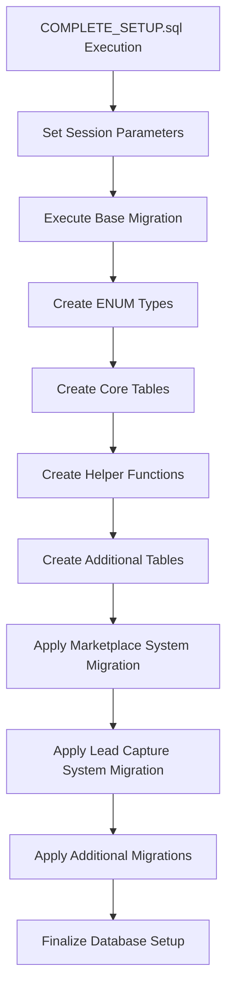
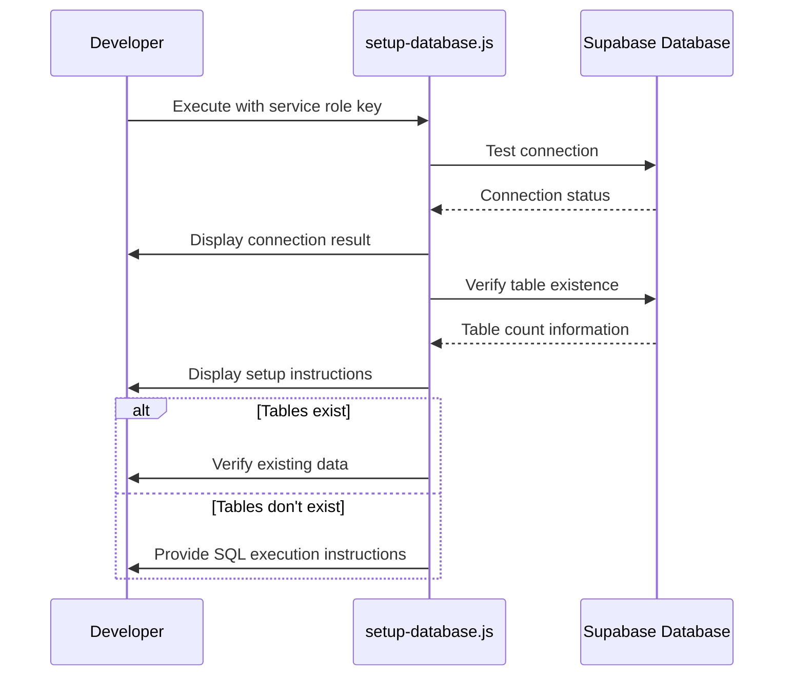

# Migrations Management

<cite>
**Referenced Files in This Document**   
- [20250122000000_create_marketplace_system.sql](file://supabase/migrations/20250122000000_create_marketplace_system.sql)
- [20251115150759_remix_migration_from_pg_dump.sql](file://supabase/migrations/20251115150759_remix_migration_from_pg_dump.sql)
- [20251123052149_create_lead_capture_system.sql](file://supabase/migrations/20251123052149_create_lead_capture_system.sql)
- [COMPLETE_SETUP.sql](file://supabase/COMPLETE_SETUP.sql)
- [seed.sql](file://supabase/seed.sql)
- [seed_marketplace_products.sql](file://supabase/seed_marketplace_products.sql)
- [setup-database.js](file://scripts/setup-database.js)
- [BASE_MIGRATION_SAFE.sql](file://supabase/BASE_MIGRATION_SAFE.sql)
- [TABLES_ONLY.sql](file://supabase/TABLES_ONLY.sql)
</cite>

## Table of Contents
1. [Introduction](#introduction)
2. [Migration Strategy Overview](#migration-strategy-overview)
3. [Key Migration Files](#key-migration-files)
4. [COMPLETE_SETUP.sql Script](#complete_setupsql-script)
5. [Seed Files and Data Population](#seed-files-and-data-population)
6. [Database Initialization Script](#database-initialization-script)
7. [Migration Workflow](#migration-workflow)
8. [Migration File Naming Convention](#migration-file-naming-convention)
9. [Conclusion](#conclusion)

## Introduction
The database migration system in sleekapp-v100 utilizes Supabase's migration framework to manage database schema evolution. The system employs chronological SQL files stored in the supabase/migrations/ directory to ensure consistent database state across development, staging, and production environments. This documentation details the migration strategy, key migration files, seed data scripts, and the overall workflow for database setup and maintenance.

## Migration Strategy Overview
The migration strategy in sleekapp-v100 follows a structured approach using timestamp-based migration files. Each migration file contains SQL statements to modify the database schema, with files executed in chronological order based on their timestamp prefixes. This approach ensures that all team members and deployment environments maintain identical database schemas. The system uses Supabase's built-in migration tools, allowing developers to apply migrations locally and in production environments consistently.

**Section sources**
- [20251115150759_remix_migration_from_pg_dump.sql](file://supabase/migrations/20251115150759_remix_migration_from_pg_dump.sql)
- [BASE_MIGRATION_SAFE.sql](file://supabase/BASE_MIGRATION_SAFE.sql)

## Key Migration Files
The repository contains several key migration files that define the database schema evolution:

### 20250122000000_create_marketplace_system.sql
This migration file establishes the core marketplace system with comprehensive product management capabilities. It creates the marketplace_products table with detailed product information including pricing, inventory, specifications, and status tracking. The file also implements Row Level Security (RLS) policies to control data access based on user roles, ensuring that suppliers can only manage their own products while buyers can view approved listings. Additional components include product categories, analytics, and inquiry systems that support the B2B marketplace functionality.

**Section sources**
- [20250122000000_create_marketplace_system.sql](file://supabase/migrations/20250122000000_create_marketplace_system.sql)

### 20251115150759_remix_migration_from_pg_dump.sql
This migration file represents the base schema dump containing the fundamental database structure. It defines essential data types such as app_role, order_workflow_status, and production_stage as ENUM types. The file establishes core tables including admin_audit_logs, ai_quotes, and various business entities. It also creates numerous helper functions for business logic operations, such as calculating factory match scores and managing order status updates. This migration serves as the foundation upon which subsequent migrations build.

**Section sources**
- [20251115150759_remix_migration_from_pg_dump.sql](file://supabase/migrations/20251115150759_remix_migration_from_pg_dump.sql)

### 20251123052149_create_lead_capture_system.sql
This migration implements a lead capture system designed to collect potential customer information before full registration. It creates the lead_captures table to store contact details, user type, interest level, and qualification status. The system also includes an analytics_events table to track user interactions across the platform. RLS policies ensure that only administrators can view and update lead information, while public submissions are allowed through the website interface. This system supports the collection of AI training data and lead qualification for sales follow-up.

**Section sources**
- [20251123052149_create_lead_capture_system.sql](file://supabase/migrations/20251123052149_create_lead_capture_system.sql)

## COMPLETE_SETUP.sql Script
The COMPLETE_SETUP.sql script serves as a comprehensive database initialization file that combines all individual migrations into a single executable script. This script is designed to set up the entire database schema from scratch by sequentially applying all migration steps in chronological order. It begins with session parameter configuration and then executes each migration file, ensuring proper dependency ordering. The script is particularly useful for initial database setup in new environments or for creating fresh development databases. It includes all schema definitions, functions, triggers, and security policies needed for the application to function properly.

**Diagram sources**
- [COMPLETE_SETUP.sql](file://supabase/COMPLETE_SETUP.sql)
- [BASE_MIGRATION_SAFE.sql](file://supabase/BASE_MIGRATION_SAFE.sql)

**Section sources**
- [COMPLETE_SETUP.sql](file://supabase/COMPLETE_SETUP.sql)

## Seed Files and Data Population
The system utilizes seed files to populate the database with reference and test data for development and testing purposes.

### seed.sql
The seed.sql file contains sample data for testing and development environments. It populates the database with test user profiles, supplier information, product listings, and blog posts. The data includes five buyer profiles representing different customer types (retailer, educational, corporate, sports team, and wholesaler) and five supplier profiles with detailed business information. The file also seeds product data across various categories including t-shirts, polos, hoodies, and activewear, along with supplier certifications and marketplace listings. This comprehensive dataset enables realistic testing of application features.

**Section sources**
- [seed.sql](file://supabase/seed.sql)

### seed_marketplace_products.sql
This specialized seed file focuses on populating the marketplace with ready-stock products available for immediate purchase. It updates a specific supplier record to designate it as a wholesale reseller and then inserts seven ready-stock product listings. These products include premium cotton t-shirts, polo shirts, hoodies, tank tops, athletic shorts, sweatshirts, and long sleeve tees, all with immediate shipping availability (0 lead time). The data includes realistic pricing, inventory quantities, and product specifications to simulate a functioning wholesale marketplace.

**Section sources**
- [seed_marketplace_products.sql](file://supabase/seed_marketplace_products.sql)

## Database Initialization Script
The setup-database.js script provides a programmatic approach to database initialization and verification. This Node.js script connects to Supabase using a service role key and can execute SQL files to set up the database. The script includes comprehensive logging with color-coded output for different message types (success, error, warning, info). It performs connection testing, verifies table existence, and guides users through the database setup process. Notably, the script acknowledges limitations of the Supabase JavaScript client in executing DDL statements and provides clear instructions for manual SQL execution in the Supabase dashboard when necessary.

**Diagram sources**
- [setup-database.js](file://scripts/setup-database.js)

**Section sources**
- [setup-database.js](file://scripts/setup-database.js)

## Migration Workflow
The migration workflow from development to production follows a structured process:

1. **Development**: Developers create new migration files with timestamp prefixes in the supabase/migrations/ directory when schema changes are needed.
2. **Version Control**: Migration files are committed to the repository, ensuring all team members have access to the same schema changes.
3. **Local Testing**: Developers apply migrations locally to test the changes and ensure compatibility with the application code.
4. **Staging**: Migration files are automatically applied in the staging environment during deployment.
5. **Production**: Migration files are applied in the production environment during scheduled maintenance windows.

Rollback considerations include maintaining backward compatibility in schema changes and avoiding destructive operations (like dropping columns) without proper data migration. The system uses timestamp-based naming to ensure proper execution order and prevent conflicts when multiple developers create migrations simultaneously.

**Section sources**
- [20251115150759_remix_migration_from_pg_dump.sql](file://supabase/migrations/20251115150759_remix_migration_from_pg_dump.sql)
- [COMPLETE_SETUP.sql](file://supabase/COMPLETE_SETUP.sql)

## Migration File Naming Convention
Migration files follow a strict naming convention using timestamps in the format YYYYMMDDHHMMSS_description.sql. This naming scheme ensures chronological ordering and execution of migration files. The timestamp prefix (e.g., 20250122000000) provides a unique identifier and determines the execution order. The descriptive suffix (e.g., create_marketplace_system) indicates the purpose of the migration. This approach prevents naming conflicts and ensures that migrations are applied in the correct sequence across all environments. The use of timestamps rather than sequential numbers allows multiple developers to create migrations simultaneously without coordination, as the file system will naturally sort them in the correct order.

**Section sources**
- [20250122000000_create_marketplace_system.sql](file://supabase/migrations/20250122000000_create_marketplace_system.sql)
- [20251115150759_remix_migration_from_pg_dump.sql](file://supabase/migrations/20251115150759_remix_migration_from_pg_dump.sql)
- [20251123052149_create_lead_capture_system.sql](file://supabase/migrations/20251123052149_create_lead_capture_system.sql)

## Conclusion
The database migration system in sleekapp-v100 provides a robust framework for managing schema evolution using Supabase's migration tools. By employing timestamp-based migration files, comprehensive seed data, and automated setup scripts, the system ensures consistent database states across all environments. The architecture supports collaborative development, safe production deployments, and efficient database initialization for new developers. This approach enables the team to evolve the database schema systematically while maintaining data integrity and application stability throughout the development lifecycle.