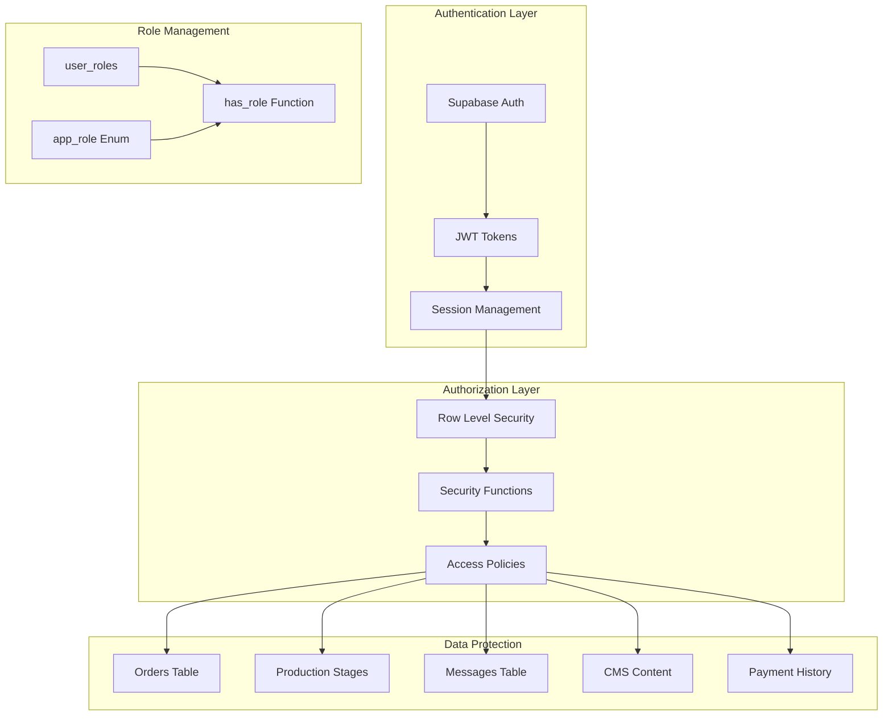
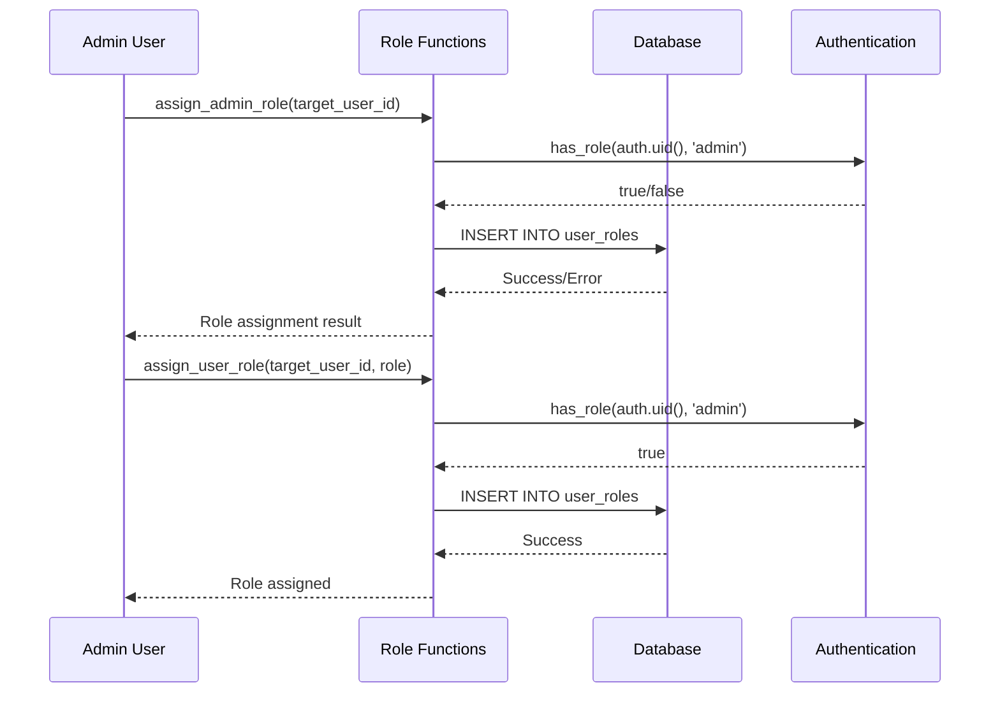
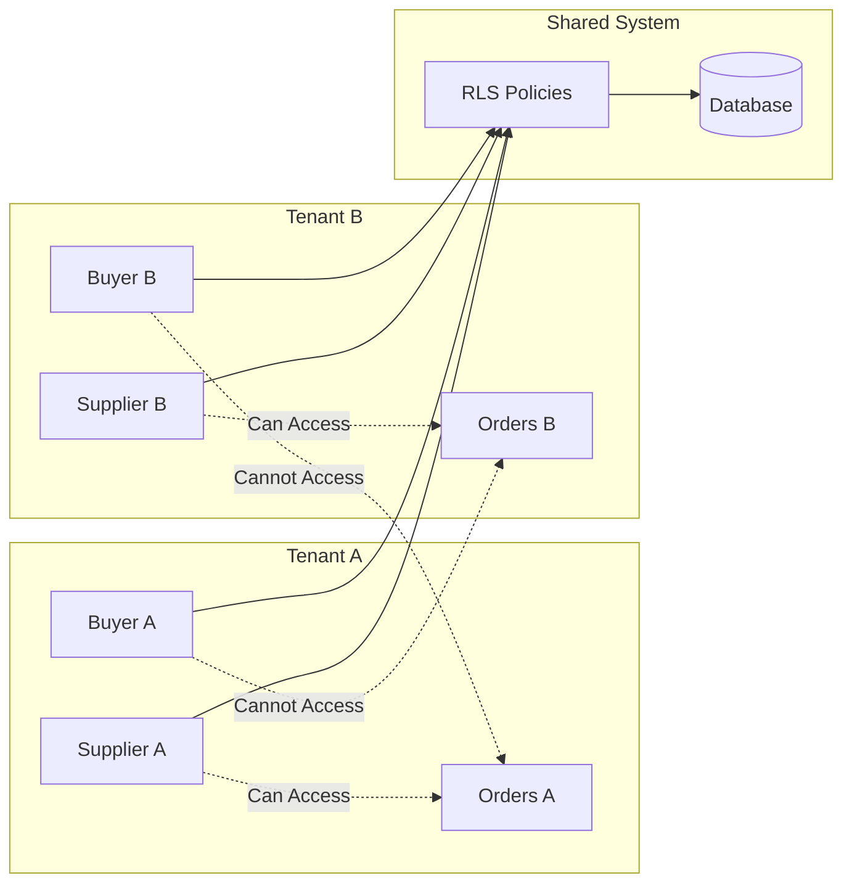
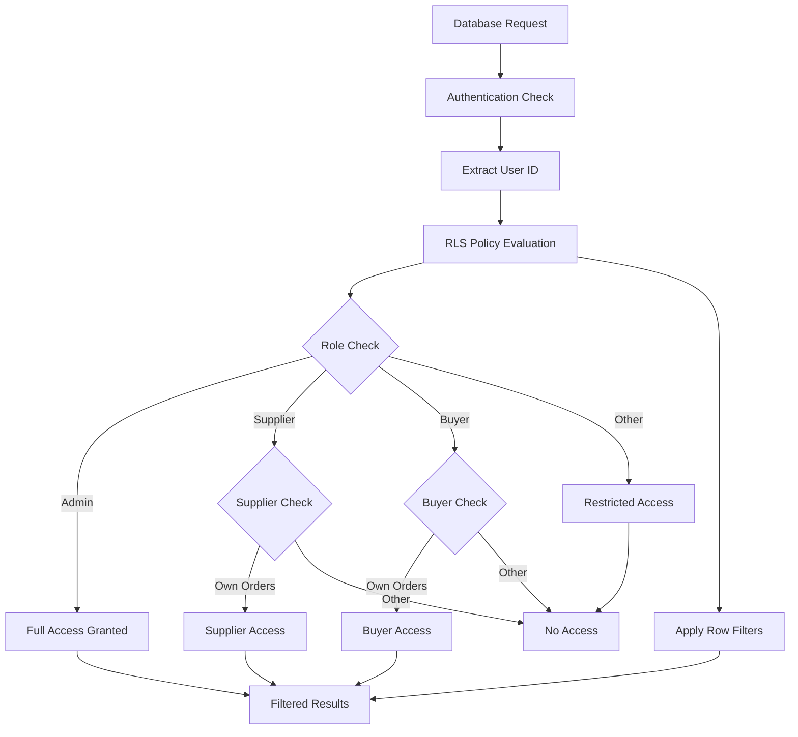

# Row Level Security (RLS) Policies Documentation

<cite>
**Referenced Files in This Document**
- [20251115150759_remix_migration_from_pg_dump.sql](file://supabase/migrations/20251115150759_remix_migration_from_pg_dump.sql)
- [COMPLETE_SETUP.sql](file://supabase/COMPLETE_SETUP.sql)
- [BASE_MIGRATION_SAFE.sql](file://supabase/BASE_MIGRATION_SAFE.sql)
- [20251120233928_2016afb8-d720-4858-9e12-7fb4ebbd5de0.sql](file://supabase/migrations/20251120233928_2016afb8-d720-4858-9e12-7fb4ebbd5de0.sql)
- [20251121014007_e1ea3a7e-b3b2-4082-a10a-c5eff6b1135b.sql](file://supabase/migrations/20251121014007_e1ea3a7e-b3b2-4082-a10a-c5eff6b1135b.sql)
- [TABLES_ONLY.sql](file://supabase/TABLES_ONLY.sql)
- [FIXED_SETUP_PART1.sql](file://supabase/FIXED_SETUP_PART1.sql)
- [admin-check/index.ts](file://supabase/functions/admin-check/index.ts)
</cite>

## Table of Contents
1. [Introduction](#introduction)
2. [Security Architecture Overview](#security-architecture-overview)
3. [Role-Based Access Control System](#role-based-access-control-system)
4. [Core RLS Policies Implementation](#core-rls-policies-implementation)
5. [Key Table Security Policies](#key-table-security-policies)
6. [Production Stages Security](#production-stages-security)
7. [Multi-Tenant Security Model](#multi-tenant-security-model)
8. [Security Policy Enforcement](#security-policy-enforcement)
9. [Performance and Monitoring](#performance-and-monitoring)
10. [Best Practices and Recommendations](#best-practices-and-recommendations)

## Introduction

The sleekapp-v100 database implements a comprehensive Row Level Security (RLS) framework designed to protect sensitive business data while enabling secure multi-tenant operations. This security model ensures that users can only access data relevant to their roles and permissions, preventing unauthorized data exposure across different organizational boundaries.

The RLS implementation follows a principle of least privilege, where access to data is strictly controlled based on user roles, relationships, and contextual business logic. The system protects critical business entities including orders, supplier communications, production stages, and financial data.

## Security Architecture Overview

The RLS security architecture is built around several core components that work together to provide comprehensive data protection:



**Diagram sources**
- [20251115150759_remix_migration_from_pg_dump.sql](file://supabase/migrations/20251115150759_remix_migration_from_pg_dump.sql#L28-L40)
- [BASE_MIGRATION_SAFE.sql](file://supabase/BASE_MIGRATION_SAFE.sql#L354-L382)

## Role-Based Access Control System

### Application Roles

The system defines a comprehensive set of application roles that determine user permissions:

| Role | Description | Permissions |
|------|-------------|-------------|
| `admin` | System administrators with full access | Complete CRUD access to all tables |
| `retailer` | Retail buyers and fashion brands | Limited access to orders, quotes, and communications |
| `wholesaler` | Wholesale buyers and distributors | Access to bulk purchasing workflows |
| `educational` | Educational institutions | Access to educational resources and programs |
| `corporate` | Corporate buyers | Enterprise-level purchasing capabilities |
| `sports_team` | Sports team buyers | Team-specific purchasing workflows |
| `factory` | Manufacturing facilities | Production stage management |
| `supplier` | Manufacturing partners | Supplier-specific workflows and data |

### Role Management Functions

The system provides robust role management through dedicated functions:



**Diagram sources**
- [20251115150759_remix_migration_from_pg_dump.sql](file://supabase/migrations/20251115150759_remix_migration_from_pg_dump.sql#L107-L161)
- [BASE_MIGRATION_SAFE.sql](file://supabase/BASE_MIGRATION_SAFE.sql#L325-L378)

**Section sources**
- [20251115150759_remix_migration_from_pg_dump.sql](file://supabase/migrations/20251115150759_remix_migration_from_pg_dump.sql#L28-L40)
- [BASE_MIGRATION_SAFE.sql](file://supabase/BASE_MIGRATION_SAFE.sql#L325-L378)

## Core RLS Policies Implementation

### has_role Function

The cornerstone of the RLS system is the `has_role` function, which provides efficient role-based access control:

```sql
CREATE FUNCTION public.has_role(_user_id uuid, _role public.app_role) 
RETURNS boolean
LANGUAGE sql STABLE SECURITY DEFINER
AS $$
  SELECT EXISTS (
    SELECT 1
    FROM public.user_roles
    WHERE user_id = _user_id
      AND role = _role
  )
$$
```

This function enables policies like:
- `"Admins can view all orders"` (FOR SELECT USING (public.has_role(auth.uid(), 'admin'::public.app_role)))
- `"Admins can manage CMS content"` (FOR ALL USING (public.has_role(auth.uid(), 'admin'::public.app_role)))

### has_any_role Function

For scenarios requiring multiple role support:

```sql
CREATE FUNCTION public.has_any_role(_user_id uuid, _roles public.app_role[]) 
RETURNS boolean
LANGUAGE sql STABLE SECURITY DEFINER
AS $$
  SELECT EXISTS (
    SELECT 1 
    FROM public.user_roles
    WHERE user_id = _user_id 
      AND role = ANY(_roles)
  )
$$
```

**Section sources**
- [20251115150759_remix_migration_from_pg_dump.sql](file://supabase/migrations/20251115150759_remix_migration_from_pg_dump.sql#L369-L382)
- [BASE_MIGRATION_SAFE.sql](file://supabase/BASE_MIGRATION_SAFE.sql#L354-L382)

## Key Table Security Policies

### Orders Table Policies

The orders table implements comprehensive security policies protecting buyer-supplier relationships:

#### Admin Access Policies
- **Admins can view all orders**: FOR SELECT USING (public.has_role(auth.uid(), 'admin'::public.app_role))
- **Admins can update all orders**: FOR UPDATE USING (public.has_role(auth.uid(), 'admin'::public.app_role))

#### Buyer-Supplier Relationship Policies
- **Order participants view orders**: FOR SELECT USING (buyer_id = auth.uid() OR supplier_id = auth.uid())
- **Buyers can manage their orders**: FOR ALL USING (buyer_id = auth.uid())

### Supplier Orders Table Policies

```sql
-- Suppliers can view their orders
FOR SELECT USING (
  supplier_id IN (SELECT id FROM public.suppliers WHERE user_id = auth.uid())
)

-- Suppliers can update their work orders
FOR UPDATE USING (
  supplier_id IN (SELECT id FROM public.suppliers WHERE user_id = auth.uid())
)
```

### Messages Table Policies

The messaging system implements strict privacy controls:

```sql
-- Users can view their messages
FOR SELECT USING (sender_id = auth.uid() OR recipient_id = auth.uid())

-- Users can send messages
FOR INSERT WITH CHECK (sender_id = auth.uid())

-- Users can update their received messages
FOR UPDATE USING (recipient_id = auth.uid())
```

### CMS Content Policies

Content management system access control:

```sql
-- Admins can manage CMS content
FOR ALL USING (public.has_role(auth.uid(), 'admin'::public.app_role))

-- Anyone can view active CMS content
FOR SELECT USING (active = true)
```

### Payment History Policies

Financial data protection:

```sql
-- Admins can view all payments
FOR SELECT USING (public.has_role(auth.uid(), 'admin'::public.app_role))

-- Users can view their own payments
FOR SELECT USING (paid_by = auth.uid() OR paid_to = auth.uid())

-- System can create payments
FOR INSERT WITH CHECK (true)
```

**Section sources**
- [20251120233928_2016afb8-d720-4858-9e12-7fb4ebbd5de0.sql](file://supabase/migrations/20251120233928_2016afb8-d720-4858-9e12-7fb4ebbd5de0.sql#L141-L200)
- [COMPLETE_SETUP.sql](file://supabase/COMPLETE_SETUP.sql#L6890-L6930)

## Production Stages Security

The production stages table implements sophisticated security policies that protect manufacturing workflows:

### Multi-Level Access Control

```sql
-- Order participants view production stages
FOR SELECT USING (
  EXISTS (SELECT 1 FROM supplier_orders so JOIN orders o ON so.buyer_order_id = o.id 
  WHERE so.id = production_stages.supplier_order_id AND (o.supplier_id = auth.uid() OR o.buyer_id = auth.uid()))
)

-- Suppliers manage production stages
FOR ALL USING (
  EXISTS (SELECT 1 FROM supplier_orders so JOIN orders o ON so.buyer_order_id = o.id 
  WHERE so.id = production_stages.supplier_order_id AND o.supplier_id = auth.uid())
)
```

### Buyer Access Policies

```sql
-- Buyers can view stages for their orders
FOR SELECT USING (
  supplier_order_id IN (
    SELECT so.id FROM supplier_orders so
    WHERE so.buyer_order_id IN (
      SELECT id FROM orders WHERE buyer_id = auth.uid()
    )
  )
)
```

### Supplier Access Policies

```sql
-- Suppliers can view their assigned order stages
FOR SELECT USING (
  supplier_order_id IN (
    SELECT id FROM supplier_orders
    WHERE supplier_id IN (
      SELECT id FROM suppliers WHERE user_id = auth.uid()
    )
  )
)
```

**Section sources**
- [20251121014007_e1ea3a7e-b3b2-4082-a10a-c5eff6b1135b.sql](file://supabase/migrations/20251121014007_e1ea3a7e-b3b2-4082-a10a-c5eff6b1135b.sql#L11-L34)
- [COMPLETE_SETUP.sql](file://supabase/COMPLETE_SETUP.sql#L6022-L6028)

## Multi-Tenant Security Model

### Tenant Isolation Principles

The RLS system implements strict tenant isolation to prevent cross-tenant data access:



### Cross-Tenant Protection Mechanisms

1. **Relationship-Based Access**: Users can only access data related to their specific relationships
2. **Role-Conditional Access**: Different roles have different levels of access based on their responsibilities
3. **Context-Aware Filtering**: Policies consider the current user context and relationships

### Supplier-Client Separation

The system maintains strict separation between suppliers and clients:

- **Suppliers** can only see orders assigned to them
- **Buyers** can only see orders they placed
- **Admins** have visibility across all tenants

**Section sources**
- [20251121014007_e1ea3a7e-b3b2-4082-a10a-c5eff6b1135b.sql](file://supabase/migrations/20251121014007_e1ea3a7e-b3b2-4082-a10a-c5eff6b1135b.sql#L12-L34)

## Security Policy Enforcement

### Policy Evaluation Process



### Security Function Integration

The RLS policies integrate deeply with Supabase's authentication system:

1. **auth.uid()**: Provides current user identification
2. **auth.role()**: Provides current role information
3. **Security Definer**: Ensures policies execute with appropriate privileges

### Policy Performance Optimization

The system implements several optimization strategies:

- **Index-Driven Lookups**: Efficient role membership checks
- **Early Termination**: Quick evaluation of simple conditions
- **Cached Results**: Reuse of computed role memberships

**Section sources**
- [admin-check/index.ts](file://supabase/functions/admin-check/index.ts#L44-L73)
- [BASE_MIGRATION_SAFE.sql](file://supabase/BASE_MIGRATION_SAFE.sql#L354-L382)

## Performance and Monitoring

### Security Audit Logging

The system includes comprehensive logging for security monitoring:

```sql
-- Admin audit logs capture all administrative actions
CREATE TABLE public.admin_audit_logs (
    id uuid DEFAULT gen_random_uuid() NOT NULL,
    admin_id uuid,
    action text NOT NULL,
    resource_type text NOT NULL,
    resource_id uuid,
    details jsonb DEFAULT '{}'::jsonb,
    ip_address text,
    user_agent text,
    created_at timestamp with time zone DEFAULT now() NOT NULL
)
```

### Rate Limiting and Security

The system implements rate limiting for security-critical operations:

- **OTP Verification Limits**: 3 attempts per hour per identifier
- **API Rate Limits**: Configurable limits based on user roles
- **Failed Attempt Monitoring**: Tracks suspicious activity patterns

### Performance Monitoring

Key performance indicators for RLS effectiveness:

- **Policy Evaluation Time**: Monitor RLS policy execution duration
- **Query Performance Impact**: Measure overhead introduced by RLS
- **Role Membership Lookup Efficiency**: Track user role resolution performance

**Section sources**
- [20251115150759_remix_migration_from_pg_dump.sql](file://supabase/migrations/20251115150759_remix_migration_from_pg_dump.sql#L731-L745)

## Best Practices and Recommendations

### Security Hardening Guidelines

1. **Principle of Least Privilege**: Always grant minimal necessary permissions
2. **Regular Policy Reviews**: Periodically audit and update RLS policies
3. **Role-Based Segregation**: Maintain clear separation between roles
4. **Audit Trail Maintenance**: Ensure comprehensive logging of all access events

### Development Best Practices

1. **Secure Function Design**: Use SECURITY DEFINER for all security functions
2. **Parameter Validation**: Always validate input parameters in security functions
3. **Error Handling**: Implement proper error handling without exposing security information
4. **Testing Coverage**: Comprehensive testing of all RLS policies

### Operational Recommendations

1. **Monitoring Setup**: Implement monitoring for security policy violations
2. **Incident Response**: Establish procedures for security breach response
3. **Backup Strategies**: Ensure RLS configurations are included in backups
4. **Documentation**: Maintain up-to-date documentation of all security policies

### Future Enhancements

The RLS system is designed for extensibility:

- **Dynamic Policies**: Support for runtime policy modification
- **Advanced Analytics**: Enhanced security analytics and reporting
- **Integration Points**: APIs for external security systems
- **Compliance Features**: Built-in compliance monitoring capabilities

This comprehensive Row Level Security implementation provides robust protection for the sleekapp-v100 platform while maintaining flexibility and performance. The system successfully balances security requirements with usability, ensuring that users have appropriate access to the data they need while preventing unauthorized access to sensitive information.