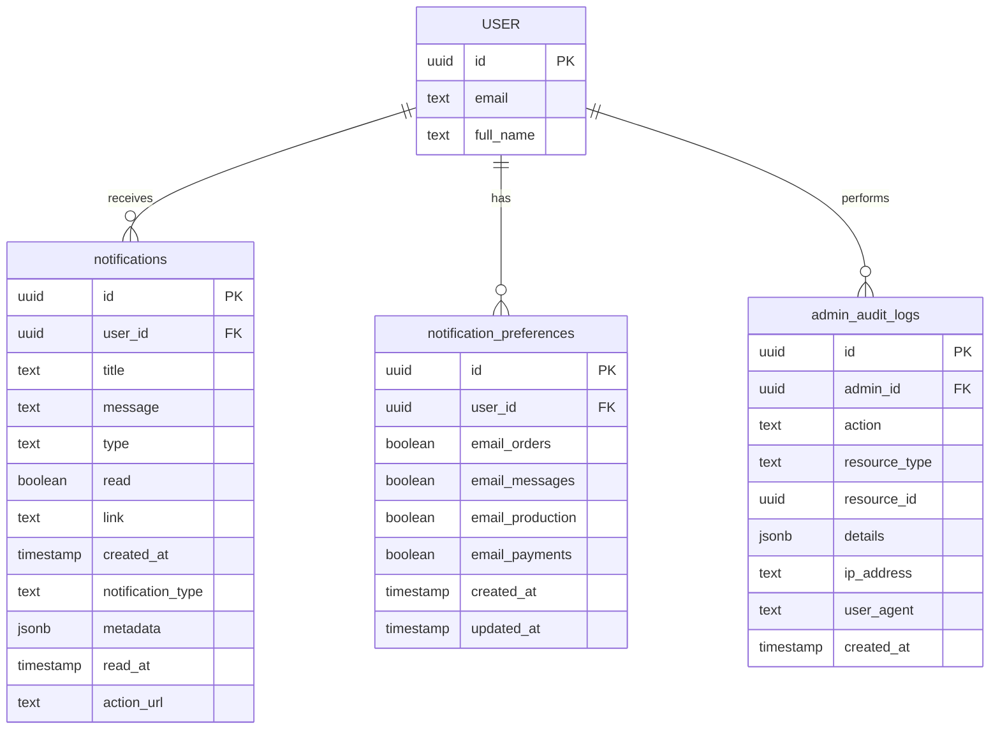
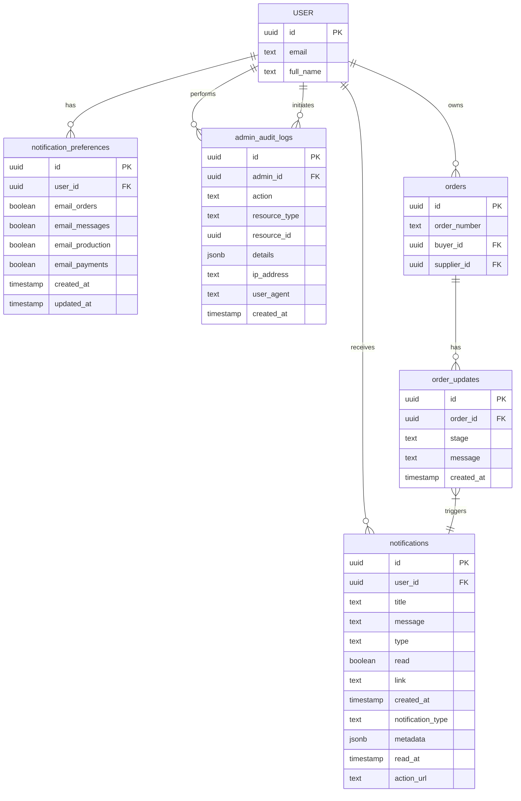

# Notification System Tables

<cite>
**Referenced Files in This Document**   
- [database.ts](file://src/types/database.ts)
- [COMPLETE_SETUP.sql](file://supabase/COMPLETE_SETUP.sql)
- [BASE_MIGRATION_SAFE.sql](file://supabase/BASE_MIGRATION_SAFE.sql)
- [TABLES_ONLY.sql](file://supabase/TABLES_ONLY.sql)
- [NotificationBell.tsx](file://src/components/NotificationBell.tsx)
- [useNotifications.ts](file://src/hooks/useNotifications.ts)
- [useNotifications.ts](file://src/hooks/queries/useNotifications.ts)
- [AdminAuditLogs.tsx](file://src/pages/AdminAuditLogs.tsx)
- [enhancedAuditLog.ts](file://src/lib/enhancedAuditLog.ts)
</cite>

## Table of Contents
1. [Introduction](#introduction)
2. [Core Notification Tables](#core-notification-tables)
3. [notifications Table](#notifications-table)
4. [notification_preferences Table](#notification_preferences-table)
5. [admin_audit_logs Table](#admin_audit_logs-table)
6. [Data Model Relationships](#data-model-relationships)
7. [Business Rules and Constraints](#business-rules-and-constraints)
8. [Indexing Strategy](#indexing-strategy)
9. [Real-time Notification System](#real-time-notification-system)
10. [Audit Logging Mechanism](#audit-logging-mechanism)
11. [TypeScript Interface Mapping](#typescript-interface-mapping)
12. [Sample Data](#sample-data)
13. [Conclusion](#conclusion)

## Introduction

The notification system in the sleekapp-v100 database is designed to provide users with timely updates about order progress, production milestones, quality control alerts, and system events. This documentation details the data model for the key notification tables: notifications, notification_preferences, and admin_audit_logs. The schema supports a real-time notification system that keeps users informed throughout the order lifecycle, from initial quote to final delivery. The audit logging mechanism tracks administrative actions for security and compliance purposes, providing a comprehensive record of system changes and user activities.

**Section sources**
- [COMPLETE_SETUP.sql](file://supabase/COMPLETE_SETUP.sql#L1190-L1203)
- [BASE_MIGRATION_SAFE.sql](file://supabase/BASE_MIGRATION_SAFE.sql#L1173-L1203)

## Core Notification Tables

The notification system consists of three primary tables that work together to deliver personalized notifications and maintain audit trails. The notifications table stores individual notification messages for users, the notification_preferences table allows users to customize their notification settings, and the admin_audit_logs table records administrative actions for security and compliance. These tables are integrated with the application's real-time capabilities through Supabase's real-time subscriptions, ensuring users receive immediate updates when new notifications are created.



**Diagram sources**
- [COMPLETE_SETUP.sql](file://supabase/COMPLETE_SETUP.sql#L1190-L1203)
- [BASE_MIGRATION_SAFE.sql](file://supabase/BASE_MIGRATION_SAFE.sql#L737-L747)

## notifications Table

The notifications table stores individual notification messages for users, capturing key information about order updates, production milestones, quality control alerts, and system events. Each notification is associated with a specific user and contains metadata that determines how it should be displayed and processed.

### Field Definitions

| Field | Data Type | Nullability | Default Value | Constraints | Description |
|-------|-----------|-------------|---------------|-------------|-------------|
| id | uuid | NOT NULL | gen_random_uuid() | PRIMARY KEY | Unique identifier for the notification |
| user_id | uuid | NOT NULL | | FOREIGN KEY | Reference to the user who receives the notification |
| title | text | NOT NULL | | | Brief title of the notification |
| message | text | NOT NULL | | | Detailed message content |
| type | text | NOT NULL | | CHECK constraint | Category of notification (order_update, qc_alert, system, shipment) |
| read | boolean | | false | | Indicates whether the notification has been read |
| link | text | | | | URL link for the notification action |
| created_at | timestamp with time zone | | now() | | Timestamp when the notification was created |
| notification_type | text | | | | Additional type classification |
| metadata | jsonb | | | | JSON object containing additional notification data |
| read_at | timestamp with time zone | | | | Timestamp when the notification was read |
| action_url | text | | | | URL for taking action on the notification |

### Business Rules

The notifications table implements several business rules through constraints:

- The type field is constrained to specific values using a CHECK constraint: 'order_update', 'qc_alert', 'system', or 'shipment'. This ensures notifications are properly categorized.
- The read field defaults to false, indicating new notifications are unread by default.
- The created_at field automatically populates with the current timestamp, providing an audit trail of when notifications are generated.

**Section sources**
- [COMPLETE_SETUP.sql](file://supabase/COMPLETE_SETUP.sql#L1209-L1215)
- [BASE_MIGRATION_SAFE.sql](file://supabase/BASE_MIGRATION_SAFE.sql#L1189-L1203)

## notification_preferences Table

The notification_preferences table allows users to customize their notification settings, controlling which types of notifications they receive via email. This table supports the application's personalized communication features, enabling users to tailor their notification experience based on their preferences and role in the system.

### Field Definitions

| Field | Data Type | Nullability | Default Value | Constraints | Description |
|-------|-----------|-------------|---------------|-------------|-------------|
| id | uuid | NOT NULL | gen_random_uuid() | PRIMARY KEY | Unique identifier for the preference record |
| user_id | uuid | NOT NULL | | FOREIGN KEY, UNIQUE | Reference to the user who owns the preferences |
| email_orders | boolean | NOT NULL | true | | Receive email notifications for order updates |
| email_messages | boolean | NOT NULL | true | | Receive email notifications for messages |
| email_production | boolean | NOT NULL | true | | Receive email notifications for production updates |
| email_payments | boolean | NOT NULL | true | | Receive email notifications for payment events |
| created_at | timestamp with time zone | NOT NULL | now() | | Timestamp when preferences were created |
| updated_at | timestamp with time zone | NOT NULL | now() | | Timestamp when preferences were last updated |

### Business Rules

The notification_preferences table implements several important business rules:

- Each user can have only one preference record, enforced by the UNIQUE constraint on user_id.
- All email preference fields default to true, ensuring users receive notifications by default unless they opt out.
- The created_at and updated_at fields automatically maintain timestamps, providing an audit trail of preference changes.

**Section sources**
- [COMPLETE_SETUP.sql](file://supabase/COMPLETE_SETUP.sql#L1193-L1202)
- [BASE_MIGRATION_SAFE.sql](file://supabase/BASE_MIGRATION_SAFE.sql#L1173-L1182)

## admin_audit_logs Table

The admin_audit_logs table records administrative actions within the system, providing a comprehensive audit trail for security, compliance, and troubleshooting purposes. This table captures critical information about who performed an action, what action was taken, when it occurred, and from where, enabling thorough monitoring of system activities.

### Field Definitions

| Field | Data Type | Nullability | Default Value | Constraints | Description |
|-------|-----------|-------------|---------------|-------------|-------------|
| id | uuid | NOT NULL | gen_random_uuid() | PRIMARY KEY | Unique identifier for the audit log entry |
| admin_id | uuid | | | FOREIGN KEY | Reference to the admin user who performed the action |
| action | text | NOT NULL | | | Description of the action performed |
| resource_type | text | NOT NULL | | | Type of resource affected by the action |
| resource_id | uuid | | | | Identifier of the specific resource affected |
| details | jsonb | | '{}'::jsonb | | JSON object containing additional details about the action |
| ip_address | text | | | | IP address from which the action was performed |
| user_agent | text | | | | User agent string identifying the client application |
| created_at | timestamp with time zone | NOT NULL | now() | | Timestamp when the action was recorded |

### Business Rules

The admin_audit_logs table implements several critical business rules:

- The details field defaults to an empty JSON object, ensuring consistent data structure even when no additional details are provided.
- The created_at field automatically populates with the current timestamp, providing an accurate record of when actions occur.
- Foreign key constraints ensure referential integrity with the users table for admin_id.

**Section sources**
- [COMPLETE_SETUP.sql](file://supabase/COMPLETE_SETUP.sql#L756-L767)
- [BASE_MIGRATION_SAFE.sql](file://supabase/BASE_MIGRATION_SAFE.sql#L737-L747)

## Data Model Relationships

The notification system tables are interconnected with the broader application data model, forming a cohesive system for user communication and activity tracking. The relationships between these tables and other entities in the system enable targeted notifications and comprehensive audit logging.



**Diagram sources**
- [COMPLETE_SETUP.sql](file://supabase/COMPLETE_SETUP.sql#L1190-L1203)
- [BASE_MIGRATION_SAFE.sql](file://supabase/BASE_MIGRATION_SAFE.sql#L737-L747)
- [migrations/20251116120215_71189c74-c2d3-4f3e-a1af-87d7e6b5f8fa.sql](file://supabase/migrations/20251116120215_71189c74-c2d3-4f3e-a1af-87d7e6b5f8fa.sql#L28-L48)

## Business Rules and Constraints

The notification system implements several business rules through database constraints to ensure data integrity and enforce application logic. These constraints validate data at the database level, preventing invalid entries and maintaining consistency across the system.

### CHECK Constraints

The notifications table includes a CHECK constraint on the type field to ensure notifications are properly categorized:

```sql
CONSTRAINT notifications_type_check CHECK ((type = ANY (ARRAY['order_update'::text, 'qc_alert'::text, 'system'::text, 'shipment'::text])))
```

This constraint restricts the type field to four valid values: 'order_update', 'qc_alert', 'system', and 'shipment'. This ensures notifications are properly categorized and allows the application to handle different notification types appropriately.

### UNIQUE Constraints

The notification_preferences table includes a UNIQUE constraint on the user_id field:

```sql
ALTER TABLE ONLY public.notification_preferences
    ADD CONSTRAINT notification_preferences_user_id_key UNIQUE (user_id);
```

This constraint ensures each user can have only one set of notification preferences, preventing duplicate records and maintaining data consistency.

### NOT NULL Constraints

All three tables implement NOT NULL constraints on critical fields to ensure essential data is always present:

- notifications: id, user_id, title, message, and type fields cannot be null
- notification_preferences: id, user_id, and all boolean preference fields cannot be null
- admin_audit_logs: id, action, resource_type, and created_at fields cannot be null

These constraints ensure the integrity of the notification system by requiring essential information for each record.

**Section sources**
- [COMPLETE_SETUP.sql](file://supabase/COMPLETE_SETUP.sql#L1202-L1203)
- [BASE_MIGRATION_SAFE.sql](file://supabase/BASE_MIGRATION_SAFE.sql#L2123-L2127)

## Indexing Strategy

The notification system employs a strategic indexing approach to optimize query performance, particularly for frequently accessed fields. These indexes support the application's real-time capabilities and ensure efficient retrieval of notification data.

### Primary Key Indexes

Each table has a primary key index on its id field, automatically created by the PRIMARY KEY constraint:

```sql
ALTER TABLE ONLY public.notifications
    ADD CONSTRAINT notifications_pkey PRIMARY KEY (id);
    
ALTER TABLE ONLY public.notification_preferences
    ADD CONSTRAINT notification_preferences_pkey PRIMARY KEY (id);
    
ALTER TABLE ONLY public.admin_audit_logs
    ADD CONSTRAINT admin_audit_logs_pkey PRIMARY KEY (id);
```

These indexes provide fast lookups by ID, which is essential for retrieving specific records.

### Foreign Key Indexes

The user_id fields in notifications and notification_preferences are indexed to optimize join operations:

```sql
CREATE INDEX idx_notifications_user_id ON public.notifications(user_id);
CREATE INDEX idx_notification_preferences_user_id ON public.notification_preferences(user_id);
```

These indexes accelerate queries that retrieve notifications or preferences for a specific user, which are common operations in the application.

### Audit Log Indexes

The admin_audit_logs table includes specialized indexes for efficient querying:

```sql
CREATE INDEX idx_admin_audit_logs_admin_id ON public.admin_audit_logs USING btree (admin_id);
CREATE INDEX idx_admin_audit_logs_created_at ON public.admin_audit_logs USING btree (created_at DESC);
```

These indexes optimize queries by admin user and by date, supporting common audit log use cases such as reviewing a specific admin's activities or finding recent actions.

**Section sources**
- [COMPLETE_SETUP.sql](file://supabase/COMPLETE_SETUP.sql#L2155-L2156)
- [BASE_MIGRATION_SAFE.sql](file://supabase/BASE_MIGRATION_SAFE.sql#L2475-L2485)

## Real-time Notification System

The notification system is integrated with Supabase's real-time capabilities to deliver immediate updates to users when new notifications are created. This real-time functionality enhances the user experience by providing instant feedback on order progress and system events.

### Real-time Subscription

The frontend components subscribe to real-time updates on the notifications table using Supabase's real-time channels:

```typescript
const channel = supabase
  .channel('notifications')
  .on(
    'postgres_changes',
    {
      event: 'INSERT',
      schema: 'public',
      table: 'notifications',
    },
    () => {
      queryClient.invalidateQueries({ queryKey: ['notifications'] });
    }
  )
  .subscribe();
```

When a new notification is inserted into the database, all subscribed clients receive an immediate event, triggering a refresh of the notification list. This ensures users see new notifications without needing to manually refresh the page.

### Automatic Notification Creation

The system automatically creates notifications through database triggers when specific events occur. For example, when a production update is added to an order, a trigger fires to create a corresponding notification:

```sql
CREATE TRIGGER on_order_update_created AFTER INSERT ON public.order_updates FOR EACH ROW EXECUTE FUNCTION public.create_update_notification();
```

The create_update_notification function then inserts a new record into the notifications table, alerting the buyer to the production progress.

**Section sources**
- [NotificationBell.tsx](file://src/components/NotificationBell.tsx#L49-L64)
- [useNotifications.ts](file://src/hooks/useNotifications.ts#L37-L58)
- [migrations/20251115150759_remix_migration_from_pg_dump.sql](file://supabase/migrations/20251115150759_remix_migration_from_pg_dump.sql#L2987)

## Audit Logging Mechanism

The audit logging mechanism provides comprehensive tracking of administrative actions for security, compliance, and troubleshooting purposes. This system captures detailed information about who performed an action, what was changed, when it occurred, and from where, creating an immutable record of system activities.

### Audit Log Structure

The admin_audit_logs table captures the following information for each administrative action:

- **Who**: The admin_id field references the user who performed the action
- **What**: The action field describes the specific action taken
- **Resource**: The resource_type and resource_id fields identify what was affected
- **When**: The created_at timestamp records when the action occurred
- **Where**: The ip_address and user_agent fields capture the client context
- **Details**: The details JSON field stores additional context about the action

### Audit Log Usage

The application uses the audit logging system in several ways:

1. **Security Monitoring**: Administrators can review logs to detect suspicious activities
2. **Compliance**: The system maintains a record of changes for regulatory requirements
3. **Troubleshooting**: Support teams can investigate issues by reviewing recent actions
4. **Accountability**: Users are accountable for their actions within the system

The audit logs are accessible through the AdminAuditLogs component, which provides a user interface for filtering and reviewing log entries.

**Section sources**
- [admin_audit_logs](file://supabase/BASE_MIGRATION_SAFE.sql#L737-L747)
- [AdminAuditLogs.tsx](file://src/pages/AdminAuditLogs.tsx)
- [enhancedAuditLog.ts](file://src/lib/enhancedAuditLog.ts)

## TypeScript Interface Mapping

The database schema is closely aligned with TypeScript interfaces defined in the application code, providing type safety and ensuring consistency between the frontend and backend. These interfaces define the structure of data as it moves between the database and the user interface.

### notifications Interface

The UserNotification interface in database.ts maps directly to the notifications table:

```typescript
export interface UserNotification {
  id: string;
  user_id: string;
  type: string;
  notification_type: string | null;
  title: string;
  message: string;
  action_url: string | null;
  link: string | null;
  metadata: Record<string, any> | null;
  read: boolean;
  read_at: string | null;
  created_at: string;
}
```

This interface ensures type safety when working with notification data in the frontend code, preventing runtime errors and improving developer experience.

### notification_preferences Interface

The NotificationPreferences interface corresponds to the notification_preferences table:

```typescript
export interface NotificationPreferences {
  id: string;
  user_id: string;
  email_orders: boolean;
  email_messages: boolean;
  email_production: boolean;
  email_payments: boolean;
  created_at: string;
  updated_at: string;
}
```

### admin_audit_logs Interface

The AdminAuditLog interface maps to the admin_audit_logs table:

```typescript
export interface AdminAuditLog {
  id: string;
  admin_id: string | null;
  action: string;
  resource_type: string;
  resource_id: string | null;
  details: Record<string, any>;
  user_agent: string | null;
  ip_address: string | null;
  created_at: string;
}
```

These interfaces provide a type-safe contract between the database and the application code, ensuring data consistency and reducing bugs.

**Section sources**
- [database.ts](file://src/types/database.ts#L328-L352)

## Sample Data

The following sample data illustrates typical records in each of the notification system tables, demonstrating common data patterns and values.

### notifications Sample Data

```json
[
  {
    "id": "a1b2c3d4-e5f6-7890-g1h2-i3j4k5l6m7n8",
    "user_id": "u1v2w3x4-y5z6-7890-a1b2-c3d4e5f6g7h8",
    "title": "Production Update: Order #SA-1001",
    "message": "New update at stage: knitting",
    "type": "order_update",
    "read": false,
    "link": "/orders/a1b2c3d4-e5f6-7890-g1h2-i3j4k5l6m7n8",
    "created_at": "2025-11-27T10:30:00Z",
    "notification_type": "production",
    "metadata": {
      "order_number": "SA-1001",
      "stage": "knitting",
      "completion_percentage": 25
    },
    "read_at": null,
    "action_url": "/orders/a1b2c3d4-e5f6-7890-g1h2-i3j4k5l6m7n8/updates"
  },
  {
    "id": "b2c3d4e5-f6g7-8901-h2i3-j4k5l6m7n8o9",
    "user_id": "u1v2w3x4-y5z6-7890-a1b2-c3d4e5f6g7h8",
    "title": "Quality Control Alert",
    "message": "Potential quality issue detected in final QC stage",
    "type": "qc_alert",
    "read": true,
    "link": "/orders/b2c3d4e5-f6g7-8901-h2i3-j4k5l6m7n8o9",
    "created_at": "2025-11-27T09:15:00Z",
    "notification_type": "quality",
    "metadata": {
      "severity": "medium",
      "defect_count": 3,
      "photos": [
        "https://storage.sleekapp.com/qc/defect1.jpg",
        "https://storage.sleekapp.com/qc/defect2.jpg"
      ]
    },
    "read_at": "2025-11-27T09:20:00Z",
    "action_url": "/orders/b2c3d4e5-f6g7-8901-h2i3-j4k5l6m7n8o9/qc"
  }
]
```

### notification_preferences Sample Data

```json
{
  "id": "c3d4e5f6-g7h8-9012-i3j4-k5l6m7n8o9p0",
  "user_id": "u1v2w3x4-y5z6-7890-a1b2-c3d4e5f6g7h8",
  "email_orders": true,
  "email_messages": true,
  "email_production": false,
  "email_payments": true,
  "created_at": "2025-11-20T08:00:00Z",
  "updated_at": "2025-11-25T14:30:00Z"
}
```

### admin_audit_logs Sample Data

```json
[
  {
    "id": "d4e5f6g7-h8i9-0123-j4k5-l6m7n8o9p0q1",
    "admin_id": "a1b2c3d4-e5f6-7890-g1h2-i3j4k5l6m7n8",
    "action": "user_suspended",
    "resource_type": "user",
    "resource_id": "u1v2w3x4-y5z6-7890-a1b2-c3d4e5f6g7h8",
    "details": {
      "reason": "Violation of terms of service",
      "previous_status": "active",
      "new_status": "suspended",
      "severity": "high"
    },
    "ip_address": "192.168.1.100",
    "user_agent": "Mozilla/5.0 (Windows NT 10.0; Win64; x64) AppleWebKit/537.36",
    "created_at": "2025-11-27T11:45:00Z"
  },
  {
    "id": "e5f6g7h8-i9j0-1234-k5l6-m7n8o9p0q1r2",
    "admin_id": "a1b2c3d4-e5f6-7890-g1h2-i3j4k5l6m7n8",
    "action": "price_updated",
    "resource_type": "product",
    "resource_id": "p1q2r3s4-t5u6-7890-v1w2-x3y4z5a6b7c8",
    "details": {
      "field": "base_price",
      "old_value": 18.50,
      "new_value": 19.25,
      "change_percentage": 4.05
    },
    "ip_address": "192.168.1.100",
    "user_agent": "Mozilla/5.0 (Windows NT 10.0; Win64; x64) AppleWebKit/537.36",
    "created_at": "2025-11-27T10:15:00Z"
  }
]
```

**Section sources**
- [seed_comprehensive_test_data.sql](file://supabase/seed_comprehensive_test_data.sql)
- [COMPLETE_SETUP.sql](file://supabase/COMPLETE_SETUP.sql)

## Conclusion

The notification system tables in the sleekapp-v100 database provide a robust foundation for user communication and activity tracking. The notifications table delivers timely updates about order progress and system events, while the notification_preferences table enables personalized notification settings. The admin_audit_logs table maintains a comprehensive record of administrative actions for security and compliance. Together, these tables support a real-time notification system that keeps users informed throughout the order lifecycle, from initial quote to final delivery. The schema is well-designed with appropriate constraints, indexes, and relationships to ensure data integrity and optimal performance. The close alignment between the database schema and TypeScript interfaces provides type safety and consistency across the application stack.