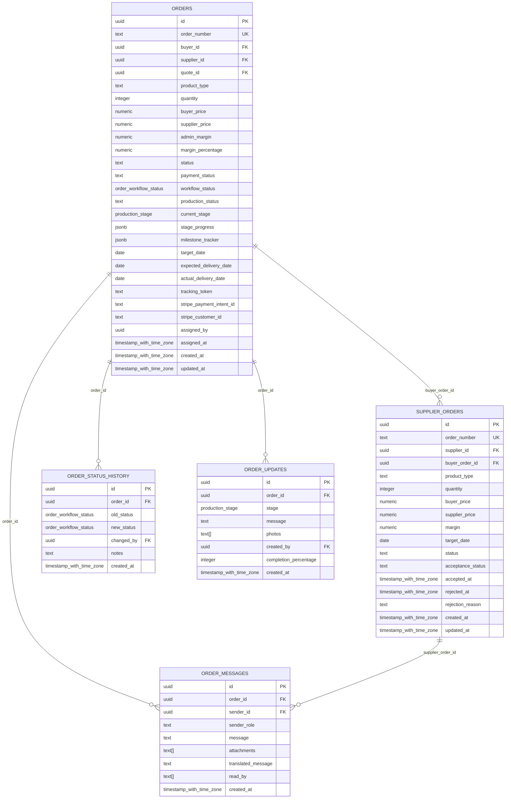

# Order Management Tables

<cite>
**Referenced Files in This Document**
- [TABLES_ONLY.sql](file://supabase/TABLES_ONLY.sql)
- [database.ts](file://src/types/database.ts)
- [order.ts](file://src/types/order.ts)
- [seed_READY_TO_RUN.sql](file://supabase/seed_READY_TO_RUN.sql)
- [OrderStatusTimeline.tsx](file://src/components/OrderStatusTimeline.tsx)
- [OrderStatusBoard.tsx](file://src/components/admin/OrderStatusBoard.tsx)
- [OrderManagement.tsx](file://src/pages/admin/OrderManagement.tsx)
- [BuyerOrderTracking.tsx](file://src/pages/BuyerOrderTracking.tsx)
- [LoopTraceOrderTracking.tsx](file://src/components/buyer/LoopTraceOrderTracking.tsx)
</cite>

## Table of Contents
1. [Introduction](#introduction)
2. [Database Schema Overview](#database-schema-overview)
3. [Core Order Management Tables](#core-order-management-tables)
4. [Financial Tracking Fields](#financial-tracking-fields)
5. [Order Lifecycle and Workflow Status](#order-lifecycle-and-workflow-status)
6. [Indexes and Performance Optimization](#indexes-and-performance-optimization)
7. [TypeScript Interface Mappings](#typescript-interface-mappings)
8. [Sample Data Patterns](#sample-data-patterns)
9. [Business Rules and Constraints](#business-rules-and-constraints)
10. [Integration Points](#integration-points)

## Introduction

The sleekapp-v100 order management system provides a comprehensive framework for tracking orders from initial quote generation through final delivery. The system manages complex workflows involving buyers, suppliers, and production stages while maintaining detailed financial records and status tracking. This documentation covers the core database tables that form the foundation of the order management ecosystem.

The order management system supports multiple business scenarios including fashion brands, educational institutions, corporate buyers, and wholesale distributors, each with distinct requirements and workflows. The database schema is designed to handle these diverse use cases while maintaining data integrity and performance.

## Database Schema Overview

The order management system consists of several interconnected tables that capture different aspects of the order lifecycle. The primary tables include `orders`, `supplier_orders`, and `order_status_history`, along with supporting tables for messaging, updates, and financial tracking.



**Diagram sources**
- [TABLES_ONLY.sql](file://supabase/TABLES_ONLY.sql#L437-L476)
- [TABLES_ONLY.sql](file://supabase/TABLES_ONLY.sql#L787-L810)
- [TABLES_ONLY.sql](file://supabase/TABLES_ONLY.sql#L417-L424)
- [database.ts](file://src/types/database.ts#L399-L438)

## Core Order Management Tables

### Orders Table

The `orders` table serves as the central hub for order information, capturing the complete lifecycle of an order from initiation to completion. It contains comprehensive fields for tracking order status, financial data, and operational details.

| Column | Data Type | Nullable | Default | Constraints | Description |
|--------|-----------|----------|---------|-------------|-------------|
| id | uuid | NOT NULL | gen_random_uuid() | PRIMARY KEY | Unique identifier for the order |
| order_number | text | NOT NULL | - | UNIQUE | Human-readable order identifier |
| buyer_id | uuid | NOT NULL | - | FOREIGN KEY | Reference to the buyer user |
| supplier_id | uuid | NULL | - | FOREIGN KEY | Reference to assigned supplier |
| quote_id | uuid | NULL | - | FOREIGN KEY | Reference to original quote |
| product_type | text | NOT NULL | - | - | Category of product ordered |
| quantity | integer | NOT NULL | - | CHECK > 0 | Total quantity ordered |
| buyer_price | numeric | NULL | - | - | Price charged to buyer |
| supplier_price | numeric | NULL | - | - | Price paid to supplier |
| admin_margin | numeric | NULL | - | - | Administrative profit margin |
| margin_percentage | numeric | NULL | - | - | Profit margin percentage |
| status | text | DEFAULT 'pending' | 'pending' | CHECK enum | Operational status |
| payment_status | text | DEFAULT 'pending' | 'pending' | CHECK enum | Payment completion status |
| workflow_status | order_workflow_status | DEFAULT 'quote_requested' | 'quote_requested' | ENUM | Current workflow position |
| production_status | text | DEFAULT 'pending' | 'pending' | - | Production phase indicator |
| current_stage | production_stage | DEFAULT 'yarn_received' | 'yarn_received' | ENUM | Current production stage |
| stage_progress | jsonb | DEFAULT '{}' | '{}' | - | Progress tracking per stage |
| milestone_tracker | jsonb | DEFAULT '{}' | '{}' | - | Milestone completion tracking |
| target_date | date | NULL | - | - | Target completion date |
| expected_delivery_date | date | NULL | - | - | Estimated delivery date |
| actual_delivery_date | date | NULL | - | - | Actual delivery completion |
| tracking_token | text | NULL | - | - | Shipping/tracking identifier |
| stripe_payment_intent_id | text | NULL | - | - | Stripe payment reference |
| stripe_customer_id | text | NULL | - | - | Stripe customer identifier |
| assigned_by | uuid | NULL | - | FOREIGN KEY | User who assigned supplier |
| assigned_at | timestamp_with_time_zone | NULL | - | - | Assignment timestamp |
| created_at | timestamp_with_time_zone | DEFAULT now() | now() | - | Order creation timestamp |
| updated_at | timestamp_with_time_zone | DEFAULT now() | now() | - | Last modification timestamp |

**Section sources**
- [TABLES_ONLY.sql](file://supabase/TABLES_ONLY.sql#L437-L476)
- [database.ts](file://src/types/database.ts#L400-L438)

### Supplier Orders Table

The `supplier_orders` table manages the supplier-side perspective of orders, tracking acceptance status, pricing, and supplier-specific order details.

| Column | Data Type | Nullable | Default | Constraints | Description |
|--------|-----------|----------|---------|-------------|-------------|
| id | uuid | NOT NULL | gen_random_uuid() | PRIMARY KEY | Unique supplier order identifier |
| order_number | text | NOT NULL | - | UNIQUE | Supplier-facing order number |
| supplier_id | uuid | NOT NULL | - | FOREIGN KEY | Reference to supplier |
| buyer_order_id | uuid | NOT NULL | - | FOREIGN KEY | Reference to buyer order |
| product_type | text | NOT NULL | - | - | Product specification |
| quantity | integer | NOT NULL | - | - | Order quantity |
| buyer_price | numeric | NULL | - | - | Price charged to buyer |
| supplier_price | numeric | NULL | - | - | Price paid to supplier |
| margin | numeric | GENERATED ALWAYS | - | STORED | Calculated price difference |
| target_date | date | NULL | - | - | Supplier's target completion |
| status | text | DEFAULT 'pending' | 'pending' | CHECK enum | Supplier order status |
| acceptance_status | text | DEFAULT 'pending' | 'pending' | CHECK enum | Supplier acceptance state |
| accepted_at | timestamp_with_time_zone | NULL | - | - | Acceptance timestamp |
| rejected_at | timestamp_with_time_zone | NULL | - | - | Rejection timestamp |
| rejection_reason | text | NULL | - | - | Reason for rejection |
| counter_offer_price | numeric | NULL | - | - | Counter-offered price |
| counter_offer_notes | text | NULL | - | - | Counter-offer justification |
| created_at | timestamp_with_time_zone | DEFAULT now() | now() | - | Creation timestamp |
| updated_at | timestamp_with_time_zone | DEFAULT now() | now() | - | Last update timestamp |

**Section sources**
- [TABLES_ONLY.sql](file://supabase/TABLES_ONLY.sql#L787-L810)
- [database.ts](file://src/types/database.ts#L534-L548)

### Order Status History Table

The `order_status_history` table maintains a complete audit trail of order status changes, enabling comprehensive tracking and reporting capabilities.

| Column | Data Type | Nullable | Default | Constraints | Description |
|--------|-----------|----------|---------|-------------|-------------|
| id | uuid | NOT NULL | gen_random_uuid() | PRIMARY KEY | Unique history record identifier |
| order_id | uuid | NULL | - | FOREIGN KEY | Reference to order |
| old_status | order_workflow_status | NULL | - | - | Previous workflow status |
| new_status | order_workflow_status | NOT NULL | - | - | New workflow status |
| changed_by | uuid | NULL | - | FOREIGN KEY | User who made change |
| notes | text | NULL | - | - | Additional context for change |
| created_at | timestamp_with_time_zone | DEFAULT now() | now() | - | Change timestamp |

**Section sources**
- [TABLES_ONLY.sql](file://supabase/TABLES_ONLY.sql#L417-L424)
- [database.ts](file://src/types/database.ts#L378-L386)

## Financial Tracking Fields

The order management system implements comprehensive financial tracking to support both buyer and supplier perspectives, enabling margin calculations and payment tracking.

### Pricing Structure

The financial model supports multiple pricing perspectives:

- **Buyer Price**: The amount charged to the customer
- **Supplier Price**: The cost paid to the manufacturer
- **Admin Margin**: The administrative profit component
- **Margin Percentage**: Calculated profitability metric

### Payment Tracking

Payment status is tracked through multiple dimensions:

- **Payment Status**: Pending, Partial, Paid, Overdue
- **Deposit Amount**: Initial payment requirement
- **Balance Amount**: Remaining payment obligation
- **Deposit Paid At**: Timestamp of initial payment
- **Balance Paid At**: Timestamp of final payment

### Margin Calculations

The system automatically calculates margins through computed columns:

```sql
margin numeric GENERATED ALWAYS AS ((buyer_price - supplier_price)) STORED
```

This ensures consistent margin calculations across all order operations and enables real-time profitability analysis.

**Section sources**
- [TABLES_ONLY.sql](file://supabase/TABLES_ONLY.sql#L467-L470)
- [TABLES_ONLY.sql](file://supabase/TABLES_ONLY.sql#L795-L795)

## Order Lifecycle and Workflow Status

The order management system implements a sophisticated workflow tracking mechanism through the `order_workflow_status` ENUM, which defines 14 distinct states representing the complete order journey.

### Workflow States

The workflow progresses through the following states:

1. **quote_requested** - Initial quote inquiry
2. **quote_sent** - Quote provided to buyer
3. **admin_review** - Administrative approval required
4. **awaiting_payment** - Payment pending
5. **payment_received** - Payment confirmed
6. **assigned_to_supplier** - Supplier assignment
7. **sample_requested** - Sample production required
8. **sample_submitted** - Sample provided
9. **sample_approved** - Sample approved
10. **bulk_production** - Large-scale production
11. **qc_inspection** - Quality control inspection
12. **ready_to_ship** - Preparing for shipment
13. **shipped** - Order dispatched
14. **delivered** - Order received
15. **completed** - Order finalized
16. **cancelled** - Order terminated
17. **on_hold** - Order paused

### Production Stages

Within production phases, orders progress through specific manufacturing stages:

- **yarn_received** - Raw materials received
- **knitting** - Fabric knitting process
- **linking** - Garment assembly
- **washing_finishing** - Post-production treatments
- **final_qc** - Final quality inspection
- **packing** - Packaging preparation
- **ready_to_ship** - Shipment readiness

### Status Transitions

The system enforces logical status transitions through triggers and application logic, ensuring data integrity throughout the order lifecycle.

**Section sources**
- [TABLES_ONLY.sql](file://supabase/TABLES_ONLY.sql#L25-L42)
- [OrderStatusTimeline.tsx](file://src/components/OrderStatusTimeline.tsx#L15-L31)
- [OrderStatusBoard.tsx](file://src/components/admin/OrderStatusBoard.tsx#L10-L43)

## Indexes and Performance Optimization

The order management system utilizes strategic indexing to optimize query performance across frequently accessed fields.

### Primary Indexes

Key indexes support efficient data retrieval:

- **orders_order_number_key**: Unique constraint on order numbers for fast lookups
- **orders_buyer_id_idx**: Accelerates buyer-centric order queries
- **orders_workflow_status_idx**: Supports workflow filtering operations
- **orders_created_at_idx**: Enables chronological order queries
- **orders_payment_status_idx**: Optimizes payment-related searches

### Foreign Key Indexes

Foreign key relationships benefit from automatic indexing:

- **order_status_history_order_id_fkey**: Cascade delete support
- **orders_buyer_id_fkey**: Buyer order association
- **orders_supplier_id_fkey**: Supplier assignment tracking
- **order_updates_order_id_fkey**: Production update correlation

### Composite Indexes

Strategic composite indexes optimize complex queries:

- **orders_buyer_id_workflow_status**: Buyer workflow filtering
- **orders_supplier_id_status**: Supplier status queries
- **order_status_history_order_id_created_at**: Audit trail navigation

**Section sources**
- [BASE_MIGRATION_SAFE.sql](file://supabase/BASE_MIGRATION_SAFE.sql#L2172-L2191)
- [BASE_MIGRATION_SAFE.sql](file://supabase/BASE_MIGRATION_SAFE.sql#L3236-L3239)

## TypeScript Interface Mappings

The database schema is mapped to TypeScript interfaces through the type definitions system, ensuring type safety across the application stack.

### Database Type Definitions

Core interfaces mirror database table structures:

```typescript
export interface Order {
  id: string;
  order_number: string;
  buyer_id: string;
  supplier_id: string | null;
  quote_id: string | null;
  product_type: string;
  quantity: number;
  buyer_price: number | null;
  supplier_price: number | null;
  admin_margin: number | null;
  margin_percentage: number | null;
  status: string;
  payment_status: PaymentStatus;
  workflow_status: OrderWorkflowStatus;
  production_status: string;
  current_stage: ProductionStage;
  stage_progress: Record<string, number>;
  milestone_tracker: Record<string, any>;
  target_date: string | null;
  expected_delivery_date: string | null;
  actual_delivery_date: string | null;
  deposit_amount: number | null;
  balance_amount: number | null;
  deposit_paid_at: string | null;
  balance_paid_at: string | null;
  assigned_by: string | null;
  assigned_at: string | null;
  tracking_token: string | null;
  display_publicly: boolean;
  is_demo_order: boolean;
  anonymized_client_name: string | null;
  stripe_customer_id: string | null;
  stripe_payment_intent_id: string | null;
  notes: string | null;
  admin_notes: string | null;
  created_at: string;
  updated_at: string;
}
```

### Relationship Interfaces

Extended interfaces support complex data relationships:

```typescript
export interface OrderWithRelations extends Order {
  supplier?: Supplier;
  order_documents?: OrderDocument[];
  order_messages?: OrderMessage[];
  order_updates?: OrderUpdate[];
}

export interface ProductionBatchWithContributions extends ProductionBatch {
  batch_contributions?: BatchContribution[];
}
```

**Section sources**
- [database.ts](file://src/types/database.ts#L399-L438)
- [database.ts](file://src/types/database.ts#L565-L578)

## Sample Data Patterns

The system includes comprehensive sample data demonstrating realistic order scenarios across different business types and product categories.

### Typical Order Scenarios

Sample orders illustrate various business contexts:

#### Fashion Brand Order
- **Buyer**: Sarah Johnson (Retailer)
- **Product**: Premium Cotton T-Shirt
- **Quantity**: 1,000 units
- **Status**: Bulk Production
- **Financial Impact**: $8,000 order value

#### Educational Institution Order
- **Buyer**: Michael Chen (Educational)
- **Product**: School Uniform Polo
- **Quantity**: 500 units
- **Status**: Sample Approved
- **Special Requirements**: Logo embroidery

#### Sports Team Order
- **Buyer**: James Williams (Sports Team)
- **Product**: Sports Performance Jersey
- **Quantity**: 150 units
- **Status**: Shipped
- **Delivery**: Completed 5 days ago

#### Corporate Order
- **Buyer**: Emily Rodriguez (Corporate)
- **Product**: Corporate Polo Uniform
- **Quantity**: 300 units
- **Status**: Delivered
- **Quality**: Excellent, repeat business anticipated

#### Wholesale Distribution Order
- **Buyer**: Lisa Anderson (Wholesaler)
- **Product**: Pullover Fleece Hoodie
- **Quantity**: 800 units
- **Status**: QC Inspection
- **Distribution**: Retail chain preparation

### Data Patterns

The sample data demonstrates realistic patterns:

- **Quantity Ranges**: MOQ compliance across different order sizes
- **Financial Structures**: Appropriate pricing for each business type
- **Timeline Consistency**: Realistic lead times and delivery schedules
- **Quality Expectations**: Different quality requirements per buyer type

**Section sources**
- [seed_READY_TO_RUN.sql](file://supabase/seed_READY_TO_RUN.sql#L863-L937)

## Business Rules and Constraints

The order management system enforces comprehensive business rules through database constraints and application logic.

### Data Integrity Constraints

Critical constraints ensure data validity:

- **orders_quantity_check**: Quantity must be positive (> 0)
- **orders_status_check**: Valid operational status enumeration
- **supplier_orders_acceptance_status_check**: Valid acceptance states
- **order_updates_completion_percentage_check**: Percentage bounds (0-100)

### Business Logic Constraints

Sophisticated business rules govern order behavior:

- **Margin Calculations**: Automatic margin computation with stored values
- **Payment Sequencing**: Logical payment flow enforcement
- **Status Transitions**: Workflow state validation
- **Supplier Assignment**: Bidirectional order linking

### Financial Constraints

Revenue and cost tracking constraints:

- **Price Validation**: Non-negative pricing fields
- **Margin Calculations**: Stored computed values
- **Payment Tracking**: Sequential payment processing
- **Currency Consistency**: Numeric precision for financial calculations

**Section sources**
- [TABLES_ONLY.sql](file://supabase/TABLES_ONLY.sql#L476-L477)
- [TABLES_ONLY.sql](file://supabase/TABLES_ONLY.sql#L810-L810)
- [TABLES_ONLY.sql](file://supabase/TABLES_ONLY.sql#L435-L435)

## Integration Points

The order management system integrates seamlessly with other system components through well-defined interfaces and data flows.

### Authentication and Authorization

Role-based access controls ensure appropriate data visibility:

- **Buyer Orders**: Buyers can view their own orders
- **Supplier Orders**: Suppliers can access orders assigned to them
- **Admin Views**: Administrators have comprehensive order visibility
- **Cross-Party Communication**: Secure messaging between parties

### External System Integration

Integration capabilities support external systems:

- **Stripe Payments**: Seamless payment processing integration
- **Shipping Providers**: Tracking and logistics coordination
- **Quality Control Systems**: Inspection and certification workflows
- **Reporting Systems**: Comprehensive analytics and dashboard integration

### Event-Driven Architecture

The system supports event-driven operations:

- **Status Change Triggers**: Automated notifications on status updates
- **Payment Processing Events**: Real-time payment status synchronization
- **Production Updates**: Live production progress tracking
- **Quality Control Events**: Inspection result processing

**Section sources**
- [BASE_MIGRATION_SAFE.sql](file://supabase/BASE_MIGRATION_SAFE.sql#L4614-L4639)
- [BuyerOrderTracking.tsx](file://src/pages/BuyerOrderTracking.tsx#L124-L162)
- [LoopTraceOrderTracking.tsx](file://src/components/buyer/LoopTraceOrderTracking.tsx#L124-L162)