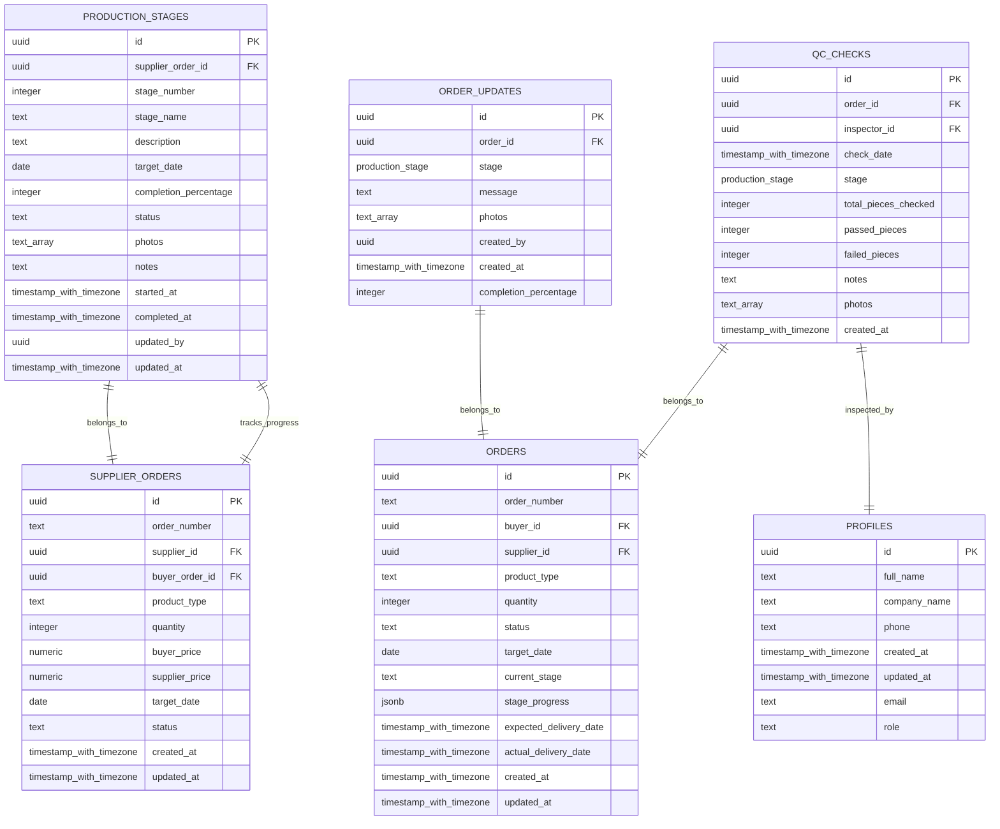
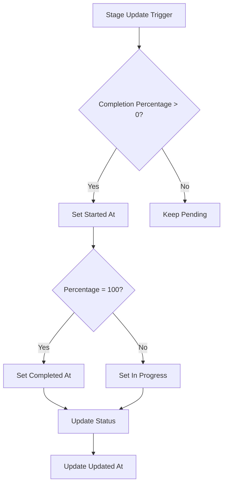
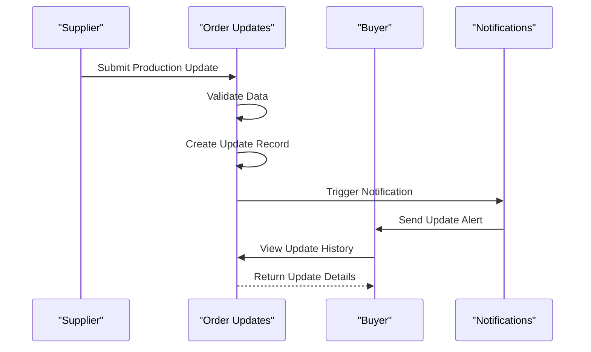
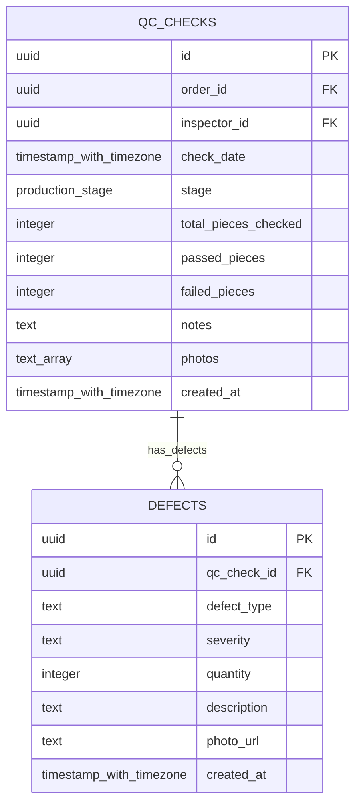
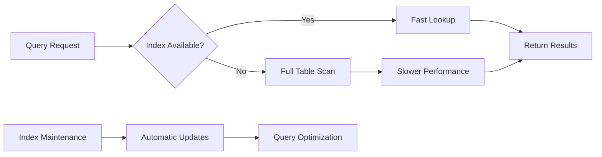

# Production Tracking Tables

<cite>
**Referenced Files in This Document**
- [TABLES_ONLY.sql](file://supabase/TABLES_ONLY.sql)
- [database.ts](file://src/types/database.ts)
- [seed_comprehensive_test_data.sql](file://supabase/seed_comprehensive_test_data.sql)
- [QCCheckForm.tsx](file://src/components/QCCheckForm.tsx)
- [QCChecksList.tsx](file://src/components/QCChecksList.tsx)
- [types.ts](file://src/integrations/supabase/types.ts)
- [BASE_MIGRATION_SAFE.sql](file://supabase/BASE_MIGRATION_SAFE.sql)
- [FIXED_SETUP_PART1.sql](file://supabase/FIXED_SETUP_PART1.sql)
</cite>

## Table of Contents
1. [Introduction](#introduction)
2. [Schema Overview](#schema-overview)
3. [Production Stages Table](#production-stages-table)
4. [Order Updates Table](#order-updates-table)
5. [QC Checks Table](#qc-checks-table)
6. [Data Types and Constraints](#data-types-and-constraints)
7. [Indexes and Performance](#indexes-and-performance)
8. [Business Rules and Validation](#business-rules-and-validation)
9. [Sample Data Patterns](#sample-data-patterns)
10. [TypeScript Interface Mappings](#typescript-interface-mappings)
11. [Common Query Patterns](#common-query-patterns)
12. [Conclusion](#conclusion)

## Introduction

The sleekapp-v100 production tracking system utilizes three core tables to provide real-time visibility into manufacturing processes across eight distinct production stages. These tables form the backbone of the application's supply chain management capabilities, enabling stakeholders to monitor progress, ensure quality control, and maintain operational transparency throughout the garment manufacturing lifecycle.

The production tracking system supports a sophisticated workflow that spans from initial material receipt through final shipment, incorporating quality control checkpoints, real-time updates, and predictive delay alerts. Each table serves a specific purpose in this ecosystem while maintaining referential integrity and enforcing business rules through database constraints.

## Schema Overview

The production tracking schema consists of three interconnected tables that collectively provide comprehensive visibility into manufacturing operations:



**Diagram sources**
- [TABLES_ONLY.sql](file://supabase/TABLES_ONLY.sql#L526-L542)
- [TABLES_ONLY.sql](file://supabase/TABLES_ONLY.sql#L426-L436)
- [TABLES_ONLY.sql](file://supabase/TABLES_ONLY.sql#L576-L587)

## Production Stages Table

The `production_stages` table serves as the central repository for tracking progress through the seven manufacturing stages, plus an eighth stage for readiness to ship. This table maintains chronological progression and provides granular visibility into each phase of production.

### Field Definitions

| Column | Data Type | Nullability | Default Value | Constraints | Description |
|--------|-----------|-------------|---------------|-------------|-------------|
| `id` | UUID | NOT NULL | `gen_random_uuid()` | PRIMARY KEY | Unique identifier for each production stage record |
| `supplier_order_id` | UUID | NOT NULL | - | FOREIGN KEY | Links to the supplier order being tracked |
| `stage_number` | INTEGER | NOT NULL | - | - | Sequential stage identifier (1-8) |
| `stage_name` | TEXT | NOT NULL | - | - | Human-readable stage name |
| `description` | TEXT | NULLABLE | - | - | Detailed description of stage activities |
| `target_date` | DATE | NULLABLE | - | - | Scheduled completion date |
| `completion_percentage` | INTEGER | DEFAULT 0 | 0 | CHECK (0-100) | Progress indicator for stage completion |
| `status` | TEXT | DEFAULT 'pending' | 'pending' | - | Current stage status |
| `photos` | TEXT ARRAY | NULLABLE | - | - | Array of photo URLs for visual documentation |
| `notes` | TEXT | NULLABLE | - | - | Additional notes and observations |
| `started_at` | TIMESTAMP WITH TIME ZONE | NULLABLE | - | - | Timestamp when stage began |
| `completed_at` | TIMESTAMP WITH TIME ZONE | NULLABLE | - | - | Timestamp when stage finished |
| `updated_by` | UUID | NULLABLE | - | - | User who last modified the record |
| `updated_at` | TIMESTAMP WITH TIME ZONE | DEFAULT now() | now() | - | Automatic timestamp of last modification |

### Business Rules

The production stages table enforces several critical business rules:

- **Sequential Progression**: Each stage must be completed before moving to the next
- **Completion Percentage**: Must be between 0 and 100 inclusive
- **Status Transitions**: Status automatically updates based on completion percentage
- **Unique Constraint**: `(supplier_order_id, stage_number)` ensures single record per stage per order

### Triggers and Functions

The system includes automatic triggers that enhance data integrity:



**Section sources**
- [BASE_MIGRATION_SAFE.sql](file://supabase/BASE_MIGRATION_SAFE.sql#L1394-L1409)
- [FIXED_SETUP_PART1.sql](file://supabase/FIXED_SETUP_PART1.sql#L48-L56)

## Order Updates Table

The `order_updates` table captures real-time progress reports from suppliers, providing immediate visibility into production activities. This table enables buyers to track progress without waiting for formal quality control checkpoints.

### Field Definitions

| Column | Data Type | Nullability | Default Value | Constraints | Description |
|--------|-----------|-------------|---------------|-------------|-------------|
| `id` | UUID | NOT NULL | `gen_random_uuid()` | PRIMARY KEY | Unique identifier for each update |
| `order_id` | UUID | NOT NULL | - | FOREIGN KEY | Links to the order being updated |
| `stage` | PRODUCTION_STAGE | NOT NULL | - | ENUM | Current production stage |
| `message` | TEXT | NULLABLE | - | - | Descriptive update message |
| `photos` | TEXT ARRAY | NULLABLE | - | - | Supporting photographic evidence |
| `created_by` | UUID | NOT NULL | - | FOREIGN KEY | User who created the update |
| `created_at` | TIMESTAMP WITH TIME ZONE | DEFAULT now() | now() | - | Automatic timestamp |
| `completion_percentage` | INTEGER | DEFAULT 0 | 0 | CHECK (0-100) | Progress indicator |

### Real-Time Tracking Features

The order updates system provides several key capabilities:

- **Immediate Visibility**: Suppliers can report progress instantly
- **Visual Documentation**: Photo attachments provide tangible evidence
- **Progress Monitoring**: Completion percentages enable trend analysis
- **Activity Logging**: Timestamped records maintain audit trail

### Integration with Production Workflow



**Diagram sources**
- [BASE_MIGRATION_SAFE.sql](file://supabase/BASE_MIGRATION_SAFE.sql#L1258-L1267)

**Section sources**
- [BASE_MIGRATION_SAFE.sql](file://supabase/BASE_MIGRATION_SAFE.sql#L1255-L1267)
- [seed_comprehensive_test_data.sql](file://supabase/seed_comprehensive_test_data.sql#L640-L701)

## QC Checks Table

The `qc_checks` table manages quality control inspections throughout the production process, ensuring products meet established standards before moving to the next stage or shipment.

### Field Definitions

| Column | Data Type | Nullability | Default Value | Constraints | Description |
|--------|-----------|-------------|---------------|-------------|-------------|
| `id` | UUID | NOT NULL | `gen_random_uuid()` | PRIMARY KEY | Unique identifier for each QC check |
| `order_id` | UUID | NOT NULL | - | FOREIGN KEY | Links to the order under inspection |
| `inspector_id` | UUID | NOT NULL | - | FOREIGN KEY | User performing the inspection |
| `check_date` | TIMESTAMP WITH TIME ZONE | DEFAULT now() | now() | - | Date and time of inspection |
| `stage` | PRODUCTION_STAGE | NOT NULL | - | ENUM | Production stage being inspected |
| `total_pieces_checked` | INTEGER | NOT NULL | - | - | Total quantity inspected |
| `passed_pieces` | INTEGER | NOT NULL | - | - | Quantity passing quality standards |
| `failed_pieces` | INTEGER | NOT NULL | - | - | Quantity failing quality standards |
| `notes` | TEXT | NULLABLE | - | - | Inspection observations |
| `photos` | TEXT ARRAY | NULLABLE | - | - | Supporting photographic evidence |
| `created_at` | TIMESTAMP WITH TIME ZONE | DEFAULT now() | now() | - | Automatic timestamp |

### Quality Control Metrics

The QC system calculates several key performance indicators:

- **Pass Rate**: `(passed_pieces / total_pieces_checked) * 100`
- **Failure Rate**: `(failed_pieces / total_pieces_checked) * 100`
- **Overall Quality Score**: Based on cumulative pass rates across stages

### Defect Management Integration

Quality control checks can be associated with detailed defect records, providing comprehensive quality analysis:



**Diagram sources**
- [QCCheckForm.tsx](file://src/components/QCCheckForm.tsx#L13-L18)
- [QCChecksList.tsx](file://src/components/QCChecksList.tsx#L68-L80)

**Section sources**
- [BASE_MIGRATION_SAFE.sql](file://supabase/BASE_MIGRATION_SAFE.sql#L1462-L1473)
- [QCCheckForm.tsx](file://src/components/QCCheckForm.tsx#L1-L156)

## Data Types and Constraints

The production tracking system employs PostgreSQL-specific data types and constraints to ensure data integrity and enforce business rules.

### Enum Types

The schema defines several enumeration types that control valid values:

| Type | Values | Purpose |
|------|--------|---------|
| `production_stage` | `'yarn_received'`, `'knitting'`, `'linking'`, `'washing_finishing'`, `'final_qc'`, `'packing'`, `'ready_to_ship'` | Defines manufacturing stages |
| `order_workflow_status` | `'quote_requested'`, `'quote_sent'`, `'admin_review'`, `'awaiting_payment'`, `'payment_received'`, `'assigned_to_supplier'`, `'sample_requested'`, `'sample_submitted'`, `'sample_approved'`, `'bulk_production'`, `'qc_inspection'`, `'ready_to_ship'`, `'shipped'`, `'delivered'`, `'completed'`, `'cancelled'`, `'on_hold'` | Tracks order lifecycle |
| `verification_status` | `'pending'`, `'verified'`, `'rejected'`, `'suspended'` | Supplier verification states |

### Constraint Types

The system implements multiple constraint types for data validation:

#### CHECK Constraints
- **Completion Percentage**: `CHECK (completion_percentage BETWEEN 0 AND 100)`
- **Quantity Validation**: `CHECK (quantity > 0)`
- **Email Format**: `CHECK (email ~* '^[A-Za-z0-9._%+-]+@[A-Za-z0-9.-]+\.[A-Za-z]{2,}$')`

#### UNIQUE Constraints
- **Stage Uniqueness**: `(supplier_order_id, stage_number)` ensures single record per stage
- **Order Number**: Ensures unique order identification

#### FOREIGN KEY Constraints
- **Supplier Orders**: Links production stages to specific supplier orders
- **Order Updates**: Connects updates to parent orders
- **QC Inspections**: Associates checks with specific orders and inspectors

**Section sources**
- [FIXED_SETUP_PART1.sql](file://supabase/FIXED_SETUP_PART1.sql#L48-L56)
- [BASE_MIGRATION_SAFE.sql](file://supabase/BASE_MIGRATION_SAFE.sql#L1409-L1410)

## Indexes and Performance

The production tracking system includes strategically placed indexes to optimize query performance for common access patterns.

### Primary Indexes

| Index Name | Columns | Type | Purpose |
|------------|---------|------|---------|
| `idx_production_stages_order_id` | `supplier_order_id` | B-tree | Fast supplier order lookups |
| `idx_production_stages_status` | `status` | B-tree | Efficient status filtering |
| `idx_qc_checks_order_id` | `order_id` | B-tree | Quick order-based QC queries |
| `idx_qc_checks_inspector_id` | `inspector_id` | B-tree | Inspector performance analysis |

### Composite Indexes

The system includes composite indexes for multi-column queries:

- **`(supplier_order_id, stage_number)`**: Optimizes stage progression queries
- **`(order_id, check_date)`**: Enhances QC history reporting
- **`(workflow_status, created_at)`**: Supports order status filtering

### Performance Optimization Strategies



**Section sources**
- [BASE_MIGRATION_SAFE.sql](file://supabase/BASE_MIGRATION_SAFE.sql#L2764-L2773)

## Business Rules and Validation

The production tracking system enforces comprehensive business rules through database constraints and application logic.

### Production Stage Rules

1. **Sequential Progression**: Stages must be completed in order (1 → 2 → 3 → ...)
2. **Completion Requirements**: Higher stages cannot begin until prerequisites are complete
3. **Percentage Validation**: Completion percentages must be logical and consistent
4. **Timeline Adherence**: Target dates help prevent production delays

### Quality Control Rules

1. **Inspection Requirements**: Mandatory QC checks at critical stages
2. **Pass Rate Thresholds**: Minimum pass rates for each stage
3. **Defect Classification**: Standardized defect categorization system
4. **Documentation Standards**: Required photographic evidence for significant findings

### Access Control Rules

The system implements Role-Based Access Control (RBAC):

- **Supplier Access**: Can view and update their own production stages
- **Buyer Access**: Can view production progress for their orders
- **Admin Access**: Full access to all production data
- **Inspector Access**: Can create and view QC checks

**Section sources**
- [BASE_MIGRATION_SAFE.sql](file://supabase/BASE_MIGRATION_SAFE.sql#L1394-L1409)

## Sample Data Patterns

The system includes comprehensive sample data that demonstrates typical production tracking scenarios.

### Production Stage Example

```sql
-- Sample production stage record
INSERT INTO production_stages (
    id, supplier_order_id, stage_number, stage_name, 
    description, target_date, completion_percentage, 
    status, photos, notes, started_at, completed_at,
    updated_by, updated_at
) VALUES (
    '50000000-0000-0000-0000-000000000001',
    '7d52fff8-1992-4994-9817-296e7da7e27b'::uuid,
    1,
    'yarn_received',
    'High-quality cotton yarn received from supplier',
    CURRENT_DATE + INTERVAL '5 days',
    100,
    'completed',
    ARRAY['https://storage.googleapis.com/product-images/yarn-001.jpg'],
    'Yarn quality confirmed, ready for knitting',
    NOW() - INTERVAL '2 days',
    NOW() - INTERVAL '1 day',
    '7d52fff8-1992-4994-9817-296e7da7e27b'::uuid,
    NOW()
);
```

### Order Update Example

```sql
-- Sample order update record
INSERT INTO order_updates (
    id, order_id, stage, message, 
    photos, created_by, created_at, completion_percentage
) VALUES (
    '60000000-0000-0000-0000-000000000001',
    '50000000-0000-0000-0000-000000000001'::uuid,
    'knitting'::production_stage,
    'Knitting in progress - 50% completion reached',
    ARRAY[
        'https://storage.googleapis.com/product-images/knitting-001.jpg',
        'https://storage.googleapis.com/product-images/knitting-002.jpg'
    ],
    '7d52fff8-1992-4994-9817-296e7da7e27b'::uuid,
    NOW() - INTERVAL '4 hours',
    50
);
```

### QC Check Example

```sql
-- Sample QC check record
INSERT INTO qc_checks (
    id, order_id, inspector_id, check_date, 
    stage, total_pieces_checked, passed_pieces, 
    failed_pieces, notes, photos, created_at
) VALUES (
    '70000000-0000-0000-0000-000000000001',
    '50000000-0000-0000-0000-000000000001'::uuid,
    '441f2e49-44fb-48c6-9dc4-cbf1929677e1'::uuid,
    NOW(),
    'knitting'::production_stage,
    100,
    95,
    5,
    'Minor defects found in 5 pieces, all minor',
    ARRAY['https://storage.googleapis.com/product-images/qc-001.jpg'],
    NOW()
);
```

**Section sources**
- [seed_comprehensive_test_data.sql](file://supabase/seed_comprehensive_test_data.sql#L583-L701)

## TypeScript Interface Mappings

The production tracking tables are mapped to TypeScript interfaces for type-safe database operations.

### ProductionStage Interface

```typescript
export interface ProductionStage {
  id: string;
  supplier_order_id: string;
  stage_number: number;
  stage_name: string;
  description: string | null;
  target_date: string | null;
  completion_percentage: number;
  status: string;
  photos: string[] | null;
  notes: string | null;
  started_at: string | null;
  completed_at: string | null;
  updated_by: string | null;
  updated_at: string;
}
```

### OrderUpdate Interface

```typescript
export interface OrderUpdate {
  id: string;
  order_id: string;
  stage: ProductionStage;
  message: string | null;
  photos: string[] | null;
  created_by: string;
  created_at: string;
  completion_percentage: number;
}
```

### QCCheck Interface

```typescript
export interface QCCheck {
  id: string;
  order_id: string;
  stage: ProductionStage;
  inspector_id: string;
  check_date: string;
  total_pieces_checked: number;
  passed_pieces: number;
  failed_pieces: number;
  notes: string | null;
  photos: string[] | null;
  created_at: string;
}
```

### Relationship Interfaces

The system supports complex relationships through interface composition:

```typescript
export interface OrderWithProductionData extends Order {
  production_stages?: ProductionStage[];
  order_updates?: OrderUpdate[];
  qc_checks?: QCCheck[];
}

export interface SupplierOrderWithTracking extends SupplierOrder {
  production_stages: ProductionStage[];
  order_updates: OrderUpdate[];
}
```

**Section sources**
- [database.ts](file://src/types/database.ts#L458-L478)
- [types.ts](file://src/integrations/supabase/types.ts#L2361-L2404)

## Common Query Patterns

The production tracking system supports various query patterns for different use cases.

### Production Progress Queries

```sql
-- Get all stages for a specific supplier order
SELECT ps.*, o.order_number
FROM production_stages ps
JOIN supplier_orders o ON ps.supplier_order_id = o.id
WHERE o.id = '7d52fff8-1992-4994-9817-296e7da7e27b'
ORDER BY ps.stage_number;

-- Calculate overall production progress
SELECT 
    supplier_order_id,
    COUNT(*) as total_stages,
    SUM(CASE WHEN completion_percentage = 100 THEN 1 ELSE 0 END) as completed_stages,
    AVG(completion_percentage) as average_progress
FROM production_stages
GROUP BY supplier_order_id;
```

### Real-Time Tracking Queries

```sql
-- Get recent updates for dashboard
SELECT ou.*, p.full_name as updater_name
FROM order_updates ou
JOIN profiles p ON ou.created_by = p.id
WHERE ou.order_id = '50000000-0000-0000-0000-000000000001'
ORDER BY ou.created_at DESC
LIMIT 20;

-- Filter by recent activity
SELECT *
FROM production_stages
WHERE updated_at > NOW() - INTERVAL '24 hours'
AND supplier_order_id = '7d52fff8-1992-4994-9817-296e7da7e27b';
```

### Quality Control Queries

```sql
-- Get QC history for an order
SELECT qc.*, p.full_name as inspector_name
FROM qc_checks qc
JOIN profiles p ON qc.inspector_id = p.id
WHERE qc.order_id = '50000000-0000-0000-0000-000000000001'
ORDER BY qc.check_date DESC;

-- Calculate pass rates by stage
SELECT 
    stage,
    AVG(passed_pieces::float / total_pieces_checked) * 100 as pass_rate
FROM qc_checks
GROUP BY stage
ORDER BY stage;
```

### Delay Detection Queries

```sql
-- Identify potential delays
SELECT 
    ps.*,
    CASE 
        WHEN ps.status = 'pending' AND ps.target_date < CURRENT_DATE THEN 'DELAYED'
        WHEN ps.status = 'in_progress' AND ps.target_date < CURRENT_DATE THEN 'AT_RISK'
        ELSE 'ON_TRACK'
    END as status_indicator
FROM production_stages ps
WHERE ps.supplier_order_id = '7d52fff8-1992-4994-9817-296e7da7e27b';
```

## Conclusion

The production tracking tables in the sleekapp-v100 system provide a robust foundation for managing complex manufacturing workflows. Through careful schema design, comprehensive constraints, and strategic indexing, the system delivers real-time visibility into production processes while maintaining data integrity and performance.

Key strengths of the system include:

- **Comprehensive Coverage**: Three interconnected tables provide complete production visibility
- **Real-Time Updates**: Immediate progress reporting enables proactive management
- **Quality Assurance**: Integrated QC checks ensure product standards are maintained
- **Scalable Architecture**: Well-designed indexes and constraints support growing data volumes
- **Type Safety**: Strong TypeScript interfaces ensure reliable database operations

The system successfully supports the application's core workflows, including real-time production tracking across eight manufacturing stages, predictive delay alerts, and quality control inspections. The combination of database constraints, triggers, and application logic creates a self-validating system that minimizes errors while maximizing operational efficiency.

Future enhancements could include automated delay detection algorithms, advanced analytics dashboards, and integration with IoT devices for automated data collection. The current schema provides a solid foundation for these extensions while maintaining backward compatibility and system stability.