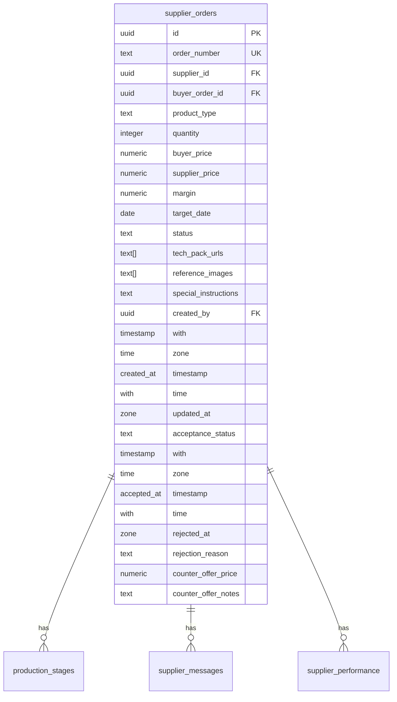
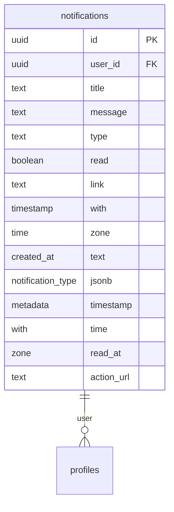
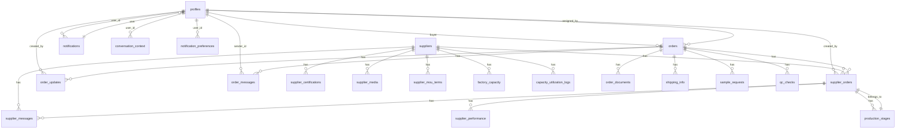

# Table Schemas

<cite>
**Referenced Files in This Document**   
- [database.ts](file://src/types/database.ts)
- [TABLES_ONLY.sql](file://supabase/TABLES_ONLY.sql)
- [seed.sql](file://supabase/seed.sql)
</cite>

## Table of Contents
1. [Introduction](#introduction)
2. [Core Tables](#core-tables)
3. [Production Stages](#production-stages)
4. [Orders](#orders)
5. [Supplier Orders](#supplier-orders)
6. [Profiles](#profiles)
7. [Suppliers](#suppliers)
8. [Notifications](#notifications)
9. [Data Model Relationships](#data-model-relationships)
10. [Business Rules and Constraints](#business-rules-and-constraints)
11. [Indexes and Performance](#indexes-and-performance)
12. [Sample Data](#sample-data)
13. [TypeScript Interface Mapping](#typescript-interface-mapping)
14. [Workflow Support](#workflow-support)

## Introduction
This document provides comprehensive documentation for the database schema of the sleekapp-v100 application. The schema is designed to support the core workflows of order management, production tracking, and user authentication for a global apparel manufacturing platform. The database is built on PostgreSQL with Supabase, featuring a well-structured relational model that connects buyers, suppliers, orders, and production processes.

The schema documentation covers key tables including production_stages, orders, supplier_orders, profiles, suppliers, and notifications. For each table, we detail field definitions, data types, primary keys, foreign keys, constraints, and indexes. We also provide sample data to illustrate typical data patterns and explain how the database schema maps to TypeScript interfaces used in the frontend application.

**Section sources**
- [database.ts](file://src/types/database.ts#L1-L579)
- [TABLES_ONLY.sql](file://supabase/TABLES_ONLY.sql#L1-L886)

## Core Tables
The sleekapp-v100 database schema consists of several core tables that form the foundation of the application's data model. These tables are designed to support the end-to-end workflow from order creation to production completion and delivery. The primary entities include orders, supplier orders, production stages, suppliers, profiles, and notifications.

The schema follows a relational design pattern with appropriate normalization to minimize data redundancy while maintaining data integrity. Foreign key relationships ensure referential integrity between related entities, and various constraints enforce business rules at the database level. The tables are interconnected through UUID primary keys, enabling efficient joins and relationship tracking across the system.

The data model supports the application's core workflows including order management, production tracking, and user authentication. Each table serves a specific purpose in the overall system architecture, with clear responsibilities and well-defined interfaces between components.

**Section sources**
- [TABLES_ONLY.sql](file://supabase/TABLES_ONLY.sql#L1-L886)

## Production Stages
The production_stages table tracks the progress of manufacturing activities for supplier orders. Each record represents a specific stage in the production process, allowing for detailed monitoring and status updates.

```mermaid
erDiagram
production_stages ||--|| supplier_orders : "belongs_to"
production_stages {
uuid id PK
uuid supplier_order_id FK
integer stage_number
text stage_name
text description
date target_date
integer completion_percentage
text status
text[] photos
text notes
timestamp with time zone started_at
timestamp with time zone completed_at
uuid updated_by FK
timestamp with time zone updated_at
}
```

**Diagram sources**
- [TABLES_ONLY.sql](file://supabase/TABLES_ONLY.sql#L526-L542)

### Field Definitions
| Field | Type | Nullability | Default Value | Constraints | Description |
|-------|------|-------------|---------------|-------------|-------------|
| id | uuid | NOT NULL | gen_random_uuid() | PRIMARY KEY | Unique identifier for the production stage |
| supplier_order_id | uuid | NOT NULL | - | FOREIGN KEY (supplier_orders.id) | Reference to the supplier order this stage belongs to |
| stage_number | integer | NOT NULL | - | - | Sequential number indicating the order of stages |
| stage_name | text | NOT NULL | - | - | Name of the production stage (e.g., "Knitting", "Washing & Finishing") |
| description | text | NULL | - | - | Detailed description of the stage activities |
| target_date | date | NULL | - | - | Expected completion date for this stage |
| completion_percentage | integer | NULL | 0 | CHECK (0-100) | Percentage of completion (0-100) |
| status | text | NOT NULL | 'pending' | - | Current status of the stage (e.g., "pending", "in_progress", "completed") |
| photos | text[] | NULL | - | - | Array of URLs to photos documenting the stage progress |
| notes | text | NULL | - | - | Additional notes or comments about the stage |
| started_at | timestamp with time zone | NULL | - | - | Timestamp when work on this stage began |
| completed_at | timestamp with time zone | NULL | - | - | Timestamp when this stage was completed |
| updated_by | uuid | NULL | - | FOREIGN KEY (profiles.id) | User who last updated this stage |
| updated_at | timestamp with time zone | NOT NULL | now() | - | Timestamp of the last update |

### Business Rules
The production_stages table enforces several business rules through database constraints:

1. **Completion Percentage Validation**: The CHECK constraint `production_stages_completion_percentage_check` ensures that the completion_percentage value is always between 0 and 100, inclusive. This prevents invalid percentage values from being stored.

2. **Required Fields**: The supplier_order_id, stage_number, and stage_name fields are marked as NOT NULL, ensuring that every production stage is properly associated with a supplier order and has essential identifying information.

3. **Status Management**: While there is no explicit CHECK constraint on the status field, the application logic ensures that status values follow a logical progression from "pending" to "in_progress" to "completed".

The table is designed to support the production tracking workflow by providing a granular view of the manufacturing process. Each supplier order has multiple production stages that represent the key steps in creating the ordered products. The completion_percentage field allows for incremental progress tracking, while the photos array enables visual documentation of work at each stage.

**Section sources**
- [TABLES_ONLY.sql](file://supabase/TABLES_ONLY.sql#L526-L542)
- [database.ts](file://src/types/database.ts#L460-L474)

## Orders
The orders table represents the main order entity in the system, capturing all essential information about customer orders from initial request through to delivery. It serves as the central hub connecting buyers, suppliers, and production activities.

```mermaid
erDiagram
orders ||--o{ supplier_orders : "has"
orders ||--o{ order_updates : "has"
orders ||--o{ order_messages : "has"
orders ||--o{ order_documents : "has"
orders ||--o{ shipping_info : "has"
orders ||--o{ sample_requests : "has"
orders ||--o{ qc_checks : "has"
orders {
uuid id PK
text order_number UK
uuid buyer_id FK
uuid factory_id FK
text product_type
integer quantity
text status
date target_date
text notes
timestamp with time zone created_at
timestamp with time zone updated_at
public.production_stage current_stage
jsonb stage_progress
uuid supplier_id FK
uuid quote_id FK
text production_status
jsonb milestone_tracker
date expected_delivery_date
date actual_delivery_date
text tracking_token
text payment_status
numeric deposit_amount
numeric balance_amount
timestamp with time zone deposit_paid_at
timestamp with time zone balance_paid_at
text stripe_payment_intent_id
text stripe_customer_id
public.order_workflow_status workflow_status
text admin_notes
numeric buyer_price
numeric supplier_price
numeric admin_margin
numeric margin_percentage
uuid assigned_by FK
timestamp with time zone assigned_at
boolean is_demo_order
boolean display_publicly
text anonymized_client_name
}
```

**Diagram sources**
- [TABLES_ONLY.sql](file://supabase/TABLES_ONLY.sql#L437-L478)

### Field Definitions
| Field | Type | Nullability | Default Value | Constraints | Description |
|-------|------|-------------|---------------|-------------|-------------|
| id | uuid | NOT NULL | gen_random_uuid() | PRIMARY KEY | Unique identifier for the order |
| order_number | text | NOT NULL | - | UNIQUE | Human-readable order identifier |
| buyer_id | uuid | NOT NULL | - | FOREIGN KEY (profiles.id) | Reference to the buyer who placed the order |
| factory_id | uuid | NULL | - | FOREIGN KEY (suppliers.id) | Reference to the factory responsible for production |
| product_type | text | NOT NULL | - | - | Type of product ordered (e.g., "T-Shirts", "Hoodies") |
| quantity | integer | NOT NULL | - | CHECK (> 0) | Number of units ordered |
| status | text | NULL | 'pending' | - | Current status of the order |
| target_date | date | NULL | - | - | Target completion date for the order |
| notes | text | NULL | - | - | General notes about the order |
| created_at | timestamp with time zone | NOT NULL | now() | - | Timestamp when the order was created |
| updated_at | timestamp with time zone | NOT NULL | now() | - | Timestamp of the last update |
| current_stage | public.production_stage | NULL | 'yarn_received' | - | Current production stage of the order |
| stage_progress | jsonb | NULL | default JSON object | - | JSON object tracking progress percentage for each production stage |
| supplier_id | uuid | NULL | - | FOREIGN KEY (suppliers.id) | Reference to the supplier assigned to fulfill the order |
| quote_id | uuid | NULL | - | FOREIGN KEY (quotes.id) | Reference to the quote that led to this order |
| production_status | text | NULL | 'pending' | - | Current status of production activities |
| milestone_tracker | jsonb | NULL | default JSON object | - | JSON object tracking completion status and dates for key milestones |
| expected_delivery_date | date | NULL | - | - | Expected date when the order will be delivered |
| actual_delivery_date | date | NULL | - | - | Actual date when the order was delivered |
| tracking_token | text | NULL | - | - | Token used for order tracking |
| payment_status | text | NULL | 'pending' | - | Current status of payment processing |
| deposit_amount | numeric | NULL | - | - | Amount of deposit payment |
| balance_amount | numeric | NULL | - | - | Amount of balance payment |
| deposit_paid_at | timestamp with time zone | NULL | - | - | Timestamp when deposit was paid |
| balance_paid_at | timestamp with time zone | NULL | - | - | Timestamp when balance was paid |
| stripe_payment_intent_id | text | NULL | - | - | Stripe payment intent identifier |
| stripe_customer_id | text | NULL | - | - | Stripe customer identifier |
| workflow_status | public.order_workflow_status | NULL | 'quote_requested' | - | Current status in the order workflow |
| admin_notes | text | NULL | - | - | Internal notes added by administrators |
| buyer_price | numeric | NULL | - | - | Price charged to the buyer |
| supplier_price | numeric | NULL | - | - | Price paid to the supplier |
| admin_margin | numeric | NULL | - | - | Margin retained by the platform |
| margin_percentage | numeric | NULL | - | - | Margin as a percentage of supplier price |
| assigned_by | uuid | NULL | - | FOREIGN KEY (profiles.id) | User who assigned this order to a supplier |
| assigned_at | timestamp with time zone | NULL | - | - | Timestamp when the order was assigned to a supplier |
| is_demo_order | boolean | NULL | false | - | Flag indicating if this is a demo order |
| display_publicly | boolean | NULL | false | - | Flag indicating if the order can be displayed publicly |
| anonymized_client_name | text | NULL | - | - | Anonymized name of the client for public display |

### Business Rules
The orders table implements several critical business rules through constraints and default values:

1. **Quantity Validation**: The CHECK constraint `orders_quantity_check` ensures that the quantity is always greater than zero, preventing invalid orders with zero or negative quantities.

2. **Status Validation**: The CHECK constraint `orders_status_check` restricts the status field to a predefined set of valid values, ensuring data consistency.

3. **Unique Order Numbers**: The order_number field has a UNIQUE constraint, preventing duplicate order identifiers in the system.

4. **Default Values**: Several fields have sensible default values, such as 'pending' for status and 'quote_requested' for workflow_status, ensuring that new orders start with appropriate initial states.

5. **Progress Tracking**: The stage_progress field contains a default JSON object with all production stages initialized to 0% completion, providing a consistent starting point for tracking production progress.

The orders table is central to the order management workflow, serving as the primary entity that connects all aspects of the ordering process. It captures both the commercial aspects (pricing, payments) and operational aspects (production status, milestones) of each order.

**Section sources**
- [TABLES_ONLY.sql](file://supabase/TABLES_ONLY.sql#L437-L478)
- [database.ts](file://src/types/database.ts#L399-L438)

## Supplier Orders
The supplier_orders table represents the agreement between the platform and suppliers to fulfill specific customer orders. It contains the commercial and operational details of the supplier's commitment to produce the ordered goods.



**Diagram sources**
- [TABLES_ONLY.sql](file://supabase/TABLES_ONLY.sql#L758-L783)

### Field Definitions
| Field | Type | Nullability | Default Value | Constraints | Description |
|-------|------|-------------|---------------|-------------|-------------|
| id | uuid | NOT NULL | gen_random_uuid() | PRIMARY KEY | Unique identifier for the supplier order |
| order_number | text | NOT NULL | - | UNIQUE | Human-readable identifier for the supplier order |
| supplier_id | uuid | NULL | - | FOREIGN KEY (suppliers.id) | Reference to the supplier responsible for fulfilling the order |
| buyer_order_id | uuid | NOT NULL | - | FOREIGN KEY (orders.id) | Reference to the original customer order |
| product_type | text | NOT NULL | - | - | Type of product to be produced |
| quantity | integer | NOT NULL | - | - | Number of units to be produced |
| buyer_price | numeric | NULL | - | - | Price at which the product was sold to the buyer |
| supplier_price | numeric | NOT NULL | - | - | Price agreed upon with the supplier for production |
| margin | numeric | NULL | - | GENERATED ALWAYS | Calculated margin (buyer_price - supplier_price) |
| target_date | date | NULL | - | - | Target completion date for the order |
| status | text | NOT NULL | 'pending' | - | Current status of the supplier order |
| tech_pack_urls | text[] | NULL | - | - | Array of URLs to technical specification documents |
| reference_images | text[] | NULL | - | - | Array of URLs to reference images for production |
| special_instructions | text | NULL | - | - | Special instructions for the supplier |
| created_by | uuid | NOT NULL | - | FOREIGN KEY (profiles.id) | User who created the supplier order |
| created_at | timestamp with time zone | NOT NULL | now() | - | Timestamp when the supplier order was created |
| updated_at | timestamp with time zone | NOT NULL | now() | - | Timestamp of the last update |
| acceptance_status | text | NULL | 'pending' | - | Status of supplier acceptance (pending, accepted, rejected, counter_offered) |
| accepted_at | timestamp with time zone | NULL | - | - | Timestamp when the supplier accepted the order |
| rejected_at | timestamp with time zone | NULL | - | - | Timestamp when the supplier rejected the order |
| rejection_reason | text | NULL | - | - | Reason provided by the supplier for rejection |
| counter_offer_price | numeric | NULL | - | - | Price proposed by the supplier in a counter-offer |
| counter_offer_notes | text | NULL | - | - | Notes accompanying the supplier's counter-offer |

### Business Rules
The supplier_orders table enforces several important business rules:

1. **Acceptance Status Validation**: The CHECK constraint `supplier_orders_acceptance_status_check` ensures that the acceptance_status field can only have one of four valid values: 'pending', 'accepted', 'rejected', or 'counter_offered'. This maintains data integrity in the order acceptance workflow.

2. **Calculated Margin**: The margin field is defined as a generated column with the expression `(buyer_price - supplier_price)`, ensuring that the margin is always accurately calculated and cannot be manually modified.

3. **Unique Order Numbers**: The order_number field has a UNIQUE constraint, preventing duplicate supplier order identifiers.

4. **Required Fields**: Key fields such as supplier_id, buyer_order_id, product_type, quantity, and supplier_price are required, ensuring that essential information is always present.

5. **Timestamp Management**: The created_at and updated_at fields have default values of the current timestamp, automatically tracking when records are created and modified.

The supplier_orders table plays a crucial role in the order fulfillment workflow, serving as the contract between the platform and suppliers. It captures the commercial agreement (pricing) and operational details (production requirements) needed to manufacture the ordered products.

**Section sources**
- [TABLES_ONLY.sql](file://supabase/TABLES_ONLY.sql#L758-L783)
- [database.ts](file://src/types/database.ts#L534-L548)

## Profiles
The profiles table stores user profile information for all users in the system, including buyers, suppliers, and administrators. It serves as the central repository for user-related data that is not part of the authentication system.

```mermaid
erDiagram
profiles ||--o{ orders : "buyer"
profiles ||--o{ orders : "assigned_by"
profiles ||--o{ supplier_orders : "created_by"
profiles ||--o{ order_updates : "created_by"
profiles ||--o{ order_messages : "sender_id"
profiles ||--o{ notifications : "user_id"
profiles ||--o{ conversation_context : "user_id"
profiles ||--o{ notification_preferences : "user_id"
profiles {
uuid id PK
text full_name
text company_name
text phone
timestamp with time zone created_at
timestamp with time zone updated_at
text address
text bio
text email
boolean phone_verified
timestamp with time zone phone_verified_at
text role
}
```

**Diagram sources**
- [TABLES_ONLY.sql](file://supabase/TABLES_ONLY.sql#L560-L574)

### Field Definitions
| Field | Type | Nullability | Default Value | Constraints | Description |
|-------|------|-------------|---------------|-------------|-------------|
| id | uuid | NOT NULL | - | PRIMARY KEY, FOREIGN KEY (auth.users.id) | Unique identifier, references Supabase auth users table |
| full_name | text | NULL | - | - | User's full name |
| company_name | text | NULL | - | - | Name of the user's company or organization |
| phone | text | NULL | - | - | User's phone number |
| created_at | timestamp with time zone | NULL | now() | - | Timestamp when the profile was created |
| updated_at | timestamp with time zone | NULL | now() | - | Timestamp of the last update |
| address | text | NULL | - | - | User's physical address |
| bio | text | NULL | - | - | User's biography or description |
| email | text | NULL | - | - | User's email address |
| phone_verified | boolean | NULL | false | - | Flag indicating if the phone number has been verified |
| phone_verified_at | timestamp with time zone | NULL | - | - | Timestamp when the phone number was verified |
| role | text | NULL | 'user' | CHECK (user, admin, super_admin) | User role within the system |

### Business Rules
The profiles table implements several business rules:

1. **Role Validation**: The CHECK constraint `profiles_role_check` ensures that the role field can only contain one of three valid values: 'user', 'admin', or 'super_admin'. This maintains role integrity in the system.

2. **Phone Verification**: The phone_verified field defaults to false, with a corresponding phone_verified_at timestamp that is populated when verification occurs.

3. **Primary Key Constraint**: The id field serves as the primary key and is also a foreign key referencing the auth.users table in Supabase, ensuring that every profile is associated with a valid authentication record.

4. **Default Role**: The role field has a default value of 'user', providing a sensible default for new profiles.

The profiles table is essential for the user authentication and management workflow, storing user information that complements the authentication data managed by Supabase. It enables personalized experiences and role-based access control throughout the application.

**Section sources**
- [TABLES_ONLY.sql](file://supabase/TABLES_ONLY.sql#L560-L574)
- [database.ts](file://src/types/database.ts#L459-L468)

## Suppliers
The suppliers table contains detailed information about manufacturing partners in the platform. It stores both basic company information and performance metrics that help in supplier selection and management.

```mermaid
erDiagram
suppliers ||--o{ supplier_orders : "has"
suppliers ||--o{ supplier_certifications : "has"
suppliers ||--o{ supplier_media : "has"
suppliers ||--o{ supplier_messages : "has"
suppliers ||--o{ supplier_mou_terms : "has"
suppliers ||--o{ factory_capacity : "has"
suppliers ||--o{ capacity_utilization_logs : "has"
suppliers {
uuid id PK
uuid user_id FK
text company_name
text factory_location
text address
integer workforce_size
integer moq_minimum
integer moq_maximum
integer lead_time_days
public.verification_status verification_status
public.supplier_tier tier
text about
text[] specializations
text website_url
text contact_person
text contact_phone
text contact_email
text business_registration_number
integer year_established
integer total_capacity_monthly
timestamp with time zone created_at
timestamp with time zone updated_at
boolean managed_by_sleek
numeric performance_score
integer total_orders_completed
numeric on_time_delivery_rate
numeric avg_capacity_utilization
text capacity_update_frequency
}
```

**Diagram sources**
- [TABLES_ONLY.sql](file://supabase/TABLES_ONLY.sql#L833-L861)

### Field Definitions
| Field | Type | Nullability | Default Value | Constraints | Description |
|-------|------|-------------|---------------|-------------|-------------|
| id | uuid | NOT NULL | gen_random_uuid() | PRIMARY KEY | Unique identifier for the supplier |
| user_id | uuid | NOT NULL | - | FOREIGN KEY (profiles.id) | Reference to the user profile associated with this supplier |
| company_name | text | NOT NULL | - | - | Legal name of the supplier company |
| factory_location | text | NOT NULL | - | - | Primary location of the manufacturing facility |
| address | text | NULL | - | - | Full address of the supplier |
| workforce_size | integer | NULL | - | - | Number of employees at the facility |
| moq_minimum | integer | NOT NULL | 50 | - | Minimum order quantity the supplier can accept |
| moq_maximum | integer | NULL | - | - | Maximum order quantity the supplier can handle |
| lead_time_days | integer | NOT NULL | 45 | - | Standard lead time in days from order confirmation to shipment |
| verification_status | public.verification_status | NOT NULL | 'pending' | - | Current verification status of the supplier |
| tier | public.supplier_tier | NOT NULL | 'bronze' | - | Performance tier of the supplier |
| about | text | NULL | - | - | Description of the supplier company |
| specializations | text[] | NULL | - | - | Array of product types or manufacturing capabilities the supplier specializes in |
| website_url | text | NULL | - | - | URL to the supplier's website |
| contact_person | text | NULL | - | - | Primary contact person at the supplier |
| contact_phone | text | NULL | - | - | Contact phone number for the supplier |
| contact_email | text | NULL | - | - | Contact email address for the supplier |
| business_registration_number | text | NULL | - | - | Official business registration number |
| year_established | integer | NULL | - | - | Year the company was established |
| total_capacity_monthly | integer | NULL | - | - | Total monthly production capacity in units |
| created_at | timestamp with time zone | NOT NULL | now() | - | Timestamp when the supplier record was created |
| updated_at | timestamp with time zone | NOT NULL | now() | - | Timestamp of the last update |
| managed_by_sleek | boolean | NULL | true | - | Flag indicating if the supplier is directly managed by Sleek Apparels |
| performance_score | numeric | NULL | 0 | - | Overall performance score based on historical data |
| total_orders_completed | integer | NULL | 0 | - | Total number of orders completed by this supplier |
| on_time_delivery_rate | numeric | NULL | 0 | - | Percentage of orders delivered on or before the target date |
| avg_capacity_utilization | numeric(5,2) | NULL | 0 | - | Average percentage of production capacity utilized |
| capacity_update_frequency | text | NULL | 'daily' | - | How frequently the supplier updates their capacity information |

### Business Rules
The suppliers table enforces several important business rules:

1. **Required Fields**: Key fields such as company_name, factory_location, moq_minimum, and lead_time_days are required, ensuring that essential supplier information is always present.

2. **Default Values**: Several fields have sensible default values, such as 'pending' for verification_status, 'bronze' for tier, and 50 for moq_minimum, providing consistent starting points for new supplier records.

3. **Performance Metrics**: The table includes calculated performance metrics like performance_score, on_time_delivery_rate, and avg_capacity_utilization, which are updated based on historical order data.

4. **Verification Status**: The verification_status field uses the public.verification_status enum type, ensuring data consistency across the system.

The suppliers table is fundamental to the supplier management workflow, providing a comprehensive view of manufacturing partners. It supports supplier selection, performance tracking, and capacity planning across the platform.

**Section sources**
- [TABLES_ONLY.sql](file://supabase/TABLES_ONLY.sql#L833-L861)
- [database.ts](file://src/types/database.ts#L502-L519)

## Notifications
The notifications table manages all user notifications within the system, providing a centralized mechanism for alerting users about important events and updates.



**Diagram sources**
- [TABLES_ONLY.sql](file://supabase/TABLES_ONLY.sql#L380-L394)

### Field Definitions
| Field | Type | Nullability | Default Value | Constraints | Description |
|-------|------|-------------|---------------|-------------|-------------|
| id | uuid | NOT NULL | gen_random_uuid() | PRIMARY KEY | Unique identifier for the notification |
| user_id | uuid | NOT NULL | - | FOREIGN KEY (profiles.id) | Reference to the user who should receive the notification |
| title | text | NOT NULL | - | - | Brief title or subject of the notification |
| message | text | NOT NULL | - | - | Detailed message content of the notification |
| type | text | NOT NULL | - | CHECK constraint | Category of the notification |
| read | boolean | NULL | false | - | Flag indicating if the notification has been read |
| link | text | NULL | - | - | URL link associated with the notification |
| created_at | timestamp with time zone | NULL | now() | - | Timestamp when the notification was created |
| notification_type | text | NULL | - | - | Specific type or subtype of notification |
| metadata | jsonb | NULL | - | - | Additional structured data related to the notification |
| read_at | timestamp with time zone | NULL | - | - | Timestamp when the notification was read |
| action_url | text | NULL | - | - | URL for taking action related to the notification |

### Business Rules
The notifications table implements several business rules:

1. **Type Validation**: The CHECK constraint `notifications_type_check` ensures that the type field can only contain one of four valid values: 'order_update', 'qc_alert', 'system', or 'shipment'. This maintains data consistency in notification categorization.

2. **Read Status**: The read field defaults to false, with a corresponding read_at timestamp that is populated when the notification is marked as read.

3. **Required Fields**: Key fields such as user_id, title, and message are required, ensuring that essential notification information is always present.

4. **Timestamp Management**: The created_at field has a default value of the current timestamp, automatically tracking when notifications are created.

The notifications table is essential for the communication workflow, enabling timely alerts and updates to users about important events in the system. It supports various notification types, including order updates, quality control alerts, system messages, and shipment notifications.

**Section sources**
- [TABLES_ONLY.sql](file://supabase/TABLES_ONLY.sql#L380-L394)
- [database.ts](file://src/types/database.ts#L339-L352)

## Data Model Relationships
The sleekapp-v100 database schema features a well-defined set of relationships between tables, creating a cohesive data model that supports the application's core workflows. These relationships are established through foreign key constraints that ensure referential integrity and enable efficient data retrieval.



**Diagram sources**
- [TABLES_ONLY.sql](file://supabase/TABLES_ONLY.sql#L1-L886)

### Relationship Analysis
The data model features several key relationship patterns:

1. **One-to-Many Relationships**: Most relationships in the schema are one-to-many, where one record in a parent table can have multiple related records in a child table. For example:
   - One profile can have many orders (as a buyer)
   - One supplier can have many supplier_orders
   - One order can have many order_updates
   - One supplier_order can have many production_stages

2. **Parent-Child Hierarchies**: The schema establishes clear parent-child hierarchies that reflect the business domain:
   - Orders are the central entity, with supplier_orders as their direct children
   - Supplier_orders have production_stages as their children, creating a three-level hierarchy for tracking production progress

3. **Referential Integrity**: Foreign key constraints ensure that related records always reference valid parent records, preventing orphaned data and maintaining data consistency.

4. **Circular References**: The schema avoids circular references that could create data integrity issues, with relationships flowing in a logical direction from high-level entities (orders) to detailed entities (production stages).

These relationships enable efficient querying and reporting across the system, allowing for comprehensive views of order status, production progress, and supplier performance.

**Section sources**
- [TABLES_ONLY.sql](file://supabase/TABLES_ONLY.sql#L1-L886)

## Business Rules and Constraints
The sleekapp-v100 database schema implements numerous business rules through constraints, ensuring data integrity and enforcing domain-specific requirements. These constraints operate at the database level, providing a reliable enforcement mechanism that complements application-level validation.

### CHECK Constraints
The schema uses CHECK constraints to validate data against business rules:

1. **Order Quantity Validation**: 
   ```sql
   CONSTRAINT orders_quantity_check CHECK ((quantity > 0))
   ```
   Ensures that order quantities are always positive, preventing invalid orders.

2. **Order Status Validation**:
   ```sql
   CONSTRAINT orders_status_check CHECK ((status = ANY (ARRAY['pending'::text, 'confirmed'::text, 'in_production'::text, 'quality_check'::text, 'shipped'::text, 'delivered'::text, 'cancelled'::text])))
   ```
   Restricts order status to a predefined set of valid values.

3. **Production Stage Completion**:
   ```sql
   CONSTRAINT production_stages_completion_percentage_check CHECK (((completion_percentage >= 0) AND (completion_percentage <= 100)))
   ```
   Ensures that completion percentages are valid percentages between 0 and 100.

4. **Supplier Order Acceptance**:
   ```sql
   CONSTRAINT supplier_orders_acceptance_status_check CHECK ((acceptance_status = ANY (ARRAY['pending'::text, 'accepted'::text, 'rejected'::text, 'counter_offered'::text])))
   ```
   Validates that supplier order acceptance status follows the defined workflow.

5. **Defect Severity**:
   ```sql
   CONSTRAINT defects_severity_check CHECK ((severity = ANY (ARRAY['minor'::text, 'major'::text, 'critical'::text])))
   ```
   Ensures defect severity is categorized appropriately.

6. **Profile Role**:
   ```sql
   CONSTRAINT profiles_role_check CHECK ((role = ANY (ARRAY['user'::text, 'admin'::text, 'super_admin'::text])))
   ```
   Restricts user roles to authorized values.

### UNIQUE Constraints
The schema uses UNIQUE constraints to prevent duplicate data:

1. **Order Numbers**: The orders.order_number field has a UNIQUE constraint, ensuring each order has a distinct identifier.

2. **Supplier Order Numbers**: The supplier_orders.order_number field has a UNIQUE constraint for the same reason.

3. **Supplier MOU Terms**: The supplier_mou_terms.supplier_id field has a UNIQUE constraint, ensuring each supplier has only one MOU (Memorandum of Understanding) record.

### Generated Columns
The schema uses generated columns to ensure data consistency:

1. **Supplier Order Margin**:
   ```sql
   margin numeric GENERATED ALWAYS AS ((buyer_price - supplier_price)) STORED
   ```
   Automatically calculates the platform's margin, preventing calculation errors.

2. **Supplier Performance Score**:
   ```sql
   overall_score numeric GENERATED ALWAYS AS ((((quality_score + communication_score))::numeric / 2.0)) STORED
   ```
   Automatically calculates the overall performance score based on quality and communication ratings.

These constraints and generated columns ensure that the database maintains data integrity and enforces business rules consistently, regardless of how data is inserted or updated.

**Section sources**
- [TABLES_ONLY.sql](file://supabase/TABLES_ONLY.sql#L1-L886)

## Indexes and Performance
The sleekapp-v100 database schema includes several indexes designed to optimize query performance for common access patterns. These indexes support the application's core workflows by accelerating data retrieval for frequently queried fields.

### Primary Key Indexes
Each table has a primary key index on its id field, which is automatically created when the PRIMARY KEY constraint is defined. These indexes enable fast lookups by unique identifier:

- orders(id)
- supplier_orders(id)
- production_stages(id)
- suppliers(id)
- profiles(id)
- notifications(id)

### Unique Indexes
Unique constraints automatically create unique indexes that prevent duplicate values and support fast lookups:

- orders(order_number) - Unique index for order number lookups
- supplier_orders(order_number) - Unique index for supplier order number lookups
- supplier_mou_terms(supplier_id) - Unique index ensuring one MOU per supplier

### Foreign Key Indexes
While not explicitly defined in the schema files, best practice dictates that foreign key columns should be indexed to optimize JOIN operations and referential integrity checks. Key foreign key columns that should be indexed include:

- supplier_orders.supplier_order_id - Frequently queried to find all stages for a supplier order
- orders.buyer_id - Frequently queried to find all orders for a buyer
- orders.supplier_id - Frequently queried to find all orders for a supplier
- production_stages.updated_by - Used to find updates made by specific users

### Query Optimization
The most critical index for performance is on the supplier_order_id field in the production_stages table, as this is the primary access pattern for retrieving production progress for a specific supplier order. This index enables fast retrieval of all production stages for a given supplier order, which is essential for the production tracking workflow.

Additional indexes that would improve performance include:

- Composite index on orders(workflow_status, created_at) for retrieving orders by status and date
- Index on supplier_orders(status, created_at) for retrieving supplier orders by status
- Index on notifications(user_id, created_at, read) for retrieving user notifications in chronological order

These indexing strategies ensure that the database can efficiently support the application's core workflows, particularly order management and production tracking, which require fast access to related data across multiple tables.

**Section sources**
- [TABLES_ONLY.sql](file://supabase/TABLES_ONLY.sql#L1-L886)

## Sample Data
The following sample data illustrates typical data patterns in the key tables of the sleekapp-v100 database. This data is based on the seed.sql file and represents realistic scenarios for the application's core workflows.

### Orders Sample Data
```json
{
  "id": "a1b2c3d4-e5f6-7890-1234-567890abcdef",
  "order_number": "ORD-2024-001",
  "buyer_id": "00000000-0000-0000-0000-000000000001",
  "product_type": "T-Shirts",
  "quantity": 1000,
  "status": "confirmed",
  "workflow_status": "assigned_to_supplier",
  "buyer_price": 12.50,
  "supplier_price": 8.00,
  "admin_margin": 4.50,
  "target_date": "2024-03-15",
  "expected_delivery_date": "2024-04-15",
  "payment_status": "partial",
  "deposit_amount": 5000.00,
  "balance_amount": 7500.00,
  "deposit_paid_at": "2024-01-15T10:30:00Z",
  "supplier_id": "00000000-0000-0000-0000-000000000101",
  "assigned_by": "00000000-0000-0000-0000-000000000999",
  "assigned_at": "2024-01-16T14:20:00Z",
  "created_at": "2024-01-15T09:15:00Z",
  "updated_at": "2024-01-16T14:20:00Z"
}
```

### Supplier Orders Sample Data
```json
{
  "id": "b2c3d4e5-f6a7-8901-2345-678901234567",
  "order_number": "SO-2024-001",
  "supplier_id": "00000000-0000-0000-0000-000000000101",
  "buyer_order_id": "a1b2c3d4-e5f6-7890-1234-567890abcdef",
  "product_type": "T-Shirts",
  "quantity": 1000,
  "buyer_price": 12.50,
  "supplier_price": 8.00,
  "margin": 4.50,
  "target_date": "2024-03-15",
  "status": "confirmed",
  "tech_pack_urls": [
    "https://storage.sleekapp.com/techpacks/tp-001.pdf"
  ],
  "reference_images": [
    "https://storage.sleekapp.com/images/ref-001.jpg"
  ],
  "special_instructions": "Use organic cotton and eco-friendly dyes",
  "acceptance_status": "accepted",
  "accepted_at": "2024-01-16T15:30:00Z",
  "created_by": "00000000-0000-0000-0000-000000000999",
  "created_at": "2024-01-16T14:20:00Z",
  "updated_at": "2024-01-16T15:30:00Z"
}
```

### Production Stages Sample Data
```json
[
  {
    "id": "c3d4e5f6-a7b8-9012-3456-789012345678",
    "supplier_order_id": "b2c3d4e5-f6a7-8901-2345-678901234567",
    "stage_number": 1,
    "stage_name": "Yarn Received",
    "description": "Received organic cotton yarn from supplier",
    "target_date": "2024-01-20",
    "completion_percentage": 100,
    "status": "completed",
    "photos": [
      "https://storage.sleekapp.com/production/so1-stage1-1.jpg",
      "https://storage.sleekapp.com/production/so1-stage1-2.jpg"
    ],
    "notes": "Yarn quality verified and approved",
    "started_at": "2024-01-18T08:00:00Z",
    "completed_at": "2024-01-20T16:30:00Z",
    "updated_by": "00000000-0000-0000-0000-000000000101",
    "updated_at": "2024-01-20T16:30:00Z"
  },
  {
    "id": "d4e5f6a7-b8c9-0123-4567-890123456789",
    "supplier_order_id": "b2c3d4e5-f6a7-8901-2345-678901234567",
    "stage_number": 2,
    "stage_name": "Knitting",
    "description": "Knitting fabric from yarn",
    "target_date": "2024-02-05",
    "completion_percentage": 75,
    "status": "in_progress",
    "photos": [
      "https://storage.sleekapp.com/production/so1-stage2-1.jpg"
    ],
    "notes": "Running slightly behind schedule due to machine maintenance",
    "started_at": "2024-01-22T08:00:00Z",
    "completed_at": null,
    "updated_by": "00000000-0000-0000-0000-000000000101",
    "updated_at": "2024-02-01T14:20:00Z"
  }
]
```

### Suppliers Sample Data
```json
{
  "id": "00000000-0000-0000-0000-000000000101",
  "user_id": "00000000-0000-0000-0000-000000000101",
  "company_name": "Dhaka Knitwear Ltd",
  "factory_location": "Dhaka",
  "address": "Plot 45, Tejgaon Industrial Area, Dhaka-1208",
  "workforce_size": 150,
  "moq_minimum": 500,
  "moq_maximum": 5000,
  "lead_time_days": 30,
  "verification_status": "verified",
  "tier": "gold",
  "about": "Premium knitwear manufacturer with over 15 years of experience",
  "specializations": ["T-Shirts", "Polo Shirts", "Hoodies", "Sweatshirts"],
  "website_url": "https://dhakaknitwear.com",
  "contact_person": "Ahmed Hassan",
  "contact_phone": "+880-1711-000101",
  "contact_email": "ahmed.hassan@test.sleekapp.com",
  "business_registration_number": "BK-2008-001",
  "year_established": 2008,
  "total_capacity_monthly": 50000,
  "managed_by_sleek": true,
  "performance_score": 4.8,
  "total_orders_completed": 156,
  "on_time_delivery_rate": 95.5,
  "avg_capacity_utilization": 78.2,
  "capacity_update_frequency": "daily",
  "created_at": "2023-01-15T10:00:00Z",
  "updated_at": "2024-01-10T14:30:00Z"
}
```

This sample data demonstrates typical values and relationships between tables, illustrating how the schema supports the end-to-end workflow from order creation through production tracking.

**Section sources**
- [seed.sql](file://supabase/seed.sql#L1-L1002)

## TypeScript Interface Mapping
The database schema is closely mapped to TypeScript interfaces in the frontend application, providing type safety and ensuring consistency between the backend and frontend. The src/types/database.ts file defines interfaces that correspond directly to the database tables.

### Interface-Table Correspondence
Each major table has a corresponding TypeScript interface:

| Database Table | TypeScript Interface | File Location |
|----------------|---------------------|---------------|
| production_stages | ProductionStageUpdate | src/types/database.ts |
| orders | Order | src/types/database.ts |
| supplier_orders | SupplierOrder | src/types/database.ts |
| profiles | Profile | src/types/database.ts |
| suppliers | Supplier | src/types/database.ts |
| notifications | UserNotification | src/types/database.ts |

### Type Safety Benefits
The TypeScript interfaces provide several benefits:

1. **Compile-Time Validation**: Field types, nullability, and structure are validated at compile time, catching errors before runtime.

2. **Autocompletion**: IDEs can provide autocompletion for field names when working with data from these tables.

3. **Refactoring Safety**: When database schema changes, TypeScript compilation will fail for code that uses removed or renamed fields.

4. **Documentation**: The interfaces serve as living documentation of the data structure.

### Example Interface
```typescript
export interface SupplierOrder {
  id: string;
  order_number: string;
  supplier_id: string;
  buyer_order_id: string;
  product_type: string;
  quantity: number;
  supplier_price: number;
  status: string;
  target_date: string | null;
  special_instructions: string | null;
  created_by: string | null;
  created_at: string;
  updated_at: string;
}
```

This interface corresponds directly to the supplier_orders table, with TypeScript types mapping to PostgreSQL types:
- uuid → string
- integer → number
- numeric → number
- text → string
- timestamp with time zone → string (ISO format)
- boolean → boolean
- jsonb → any (or specific interface for structured data)

The mapping between database schema and TypeScript interfaces ensures type safety throughout the application stack, from database queries to UI rendering.

**Section sources**
- [database.ts](file://src/types/database.ts#L1-L579)

## Workflow Support
The sleekapp-v100 database schema is specifically designed to support the application's core workflows: order management, production tracking, and user authentication. The table structures and relationships enable efficient implementation of these workflows.

### Order Management Workflow
The order management workflow is supported by the orders and supplier_orders tables, which capture the complete lifecycle of an order:

1. **Order Creation**: When a buyer requests a quote, an order record is created with workflow_status 'quote_requested'.

2. **Quote to Order Conversion**: When a quote is accepted, the order status transitions to 'confirmed' and workflow_status to 'assigned_to_supplier'.

3. **Supplier Assignment**: A supplier_order record is created, linking the buyer's order to a specific supplier.

4. **Payment Processing**: The order record tracks deposit and balance payments, with payment_status updating as payments are received.

5. **Order Completion**: When the order is delivered, the status updates to 'delivered' and workflow_status to 'completed'.

The schema supports this workflow with fields like workflow_status, payment_status, and milestone_tracker that capture the current state of the order at each stage.

### Production Tracking Workflow
The production tracking workflow is supported by the supplier_orders and production_stages tables:

1. **Stage Initialization**: When a supplier order is confirmed, production stages are initialized for each step in the manufacturing process.

2. **Progress Updates**: Suppliers update the completion_percentage and add photos and notes to each production stage.

3. **Status Tracking**: The status field in production_stages tracks whether each stage is 'pending', 'in_progress', or 'completed'.

4. **Timeline Management**: The target_date, started_at, and completed_at fields enable tracking against the production schedule.

5. **Quality Control**: The qc_checks table (not detailed in this document) supports quality inspection at various stages.

The parent-child relationship between supplier_orders and production_stages creates a hierarchical structure that mirrors the physical production process.

### User Authentication Workflow
The user authentication workflow leverages Supabase Auth for authentication and the profiles table for user data:

1. **User Registration**: When a user signs up, Supabase Auth creates a record in the auth.users table.

2. **Profile Creation**: A corresponding profile record is created, storing additional user information.

3. **Role Management**: The role field in the profile determines the user's permissions and access levels.

4. **Session Management**: The application uses the user's UUID as a foreign key to associate data with their account.

5. **Notification Preferences**: The notification_preferences table allows users to customize how they receive notifications.

The schema supports this workflow by separating authentication data (managed by Supabase) from user profile data (managed by the application), following security best practices.

These workflows are interconnected, with the order management workflow depending on user authentication to identify buyers and suppliers, and the production tracking workflow depending on order management to establish what needs to be produced.

**Section sources**
- [TABLES_ONLY.sql](file://supabase/TABLES_ONLY.sql#L1-L886)
- [database.ts](file://src/types/database.ts#L1-L579)