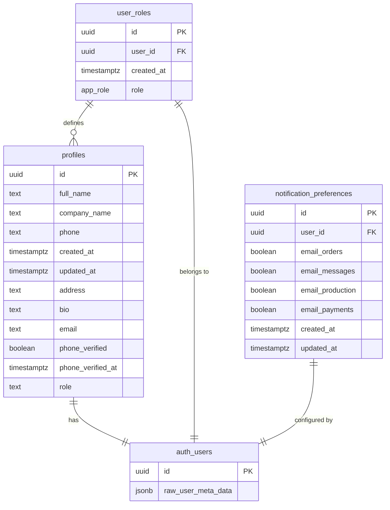
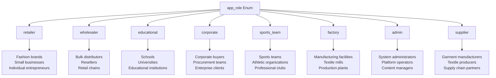
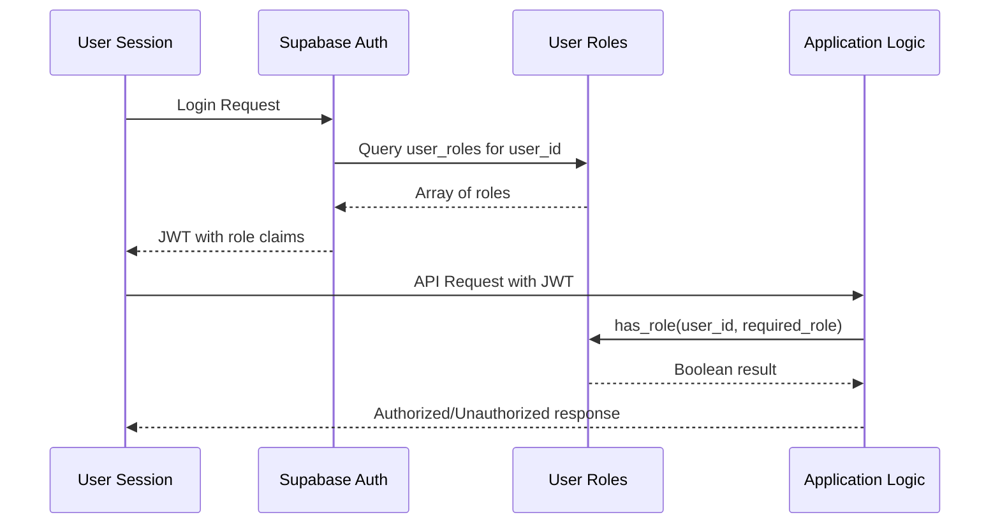
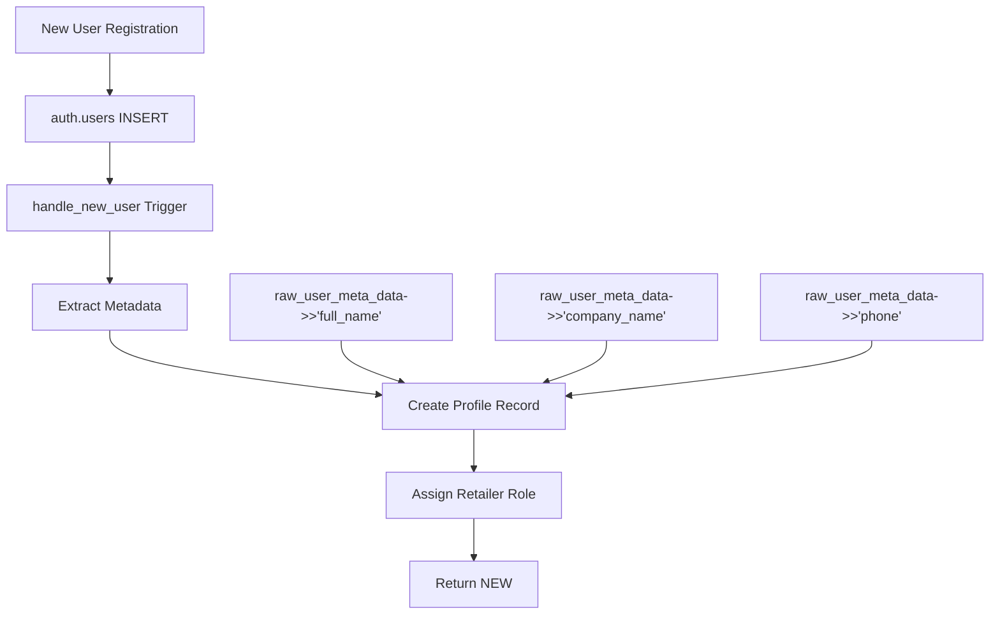
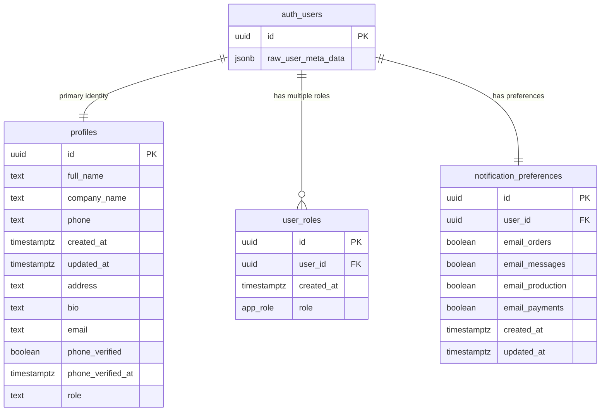

# User Management Tables

<cite>
**Referenced Files in This Document**
- [TABLES_ONLY.sql](file://supabase/TABLES_ONLY.sql)
- [BASE_MIGRATION_SAFE.sql](file://supabase/BASE_MIGRATION_SAFE.sql)
- [database.ts](file://src/types/database.ts)
- [COMPLETE_SETUP.sql](file://supabase/COMPLETE_SETUP.sql)
- [seed.sql](file://supabase/seed.sql)
- [check_profiles.sql](file://check_profiles.sql)
- [20251116171705_54ddacc9-3b19-4039-bee0-08ef16d43884.sql](file://supabase/migrations/20251116171705_54ddacc9-3b19-4039-bee0-08ef16d43884.sql)
</cite>

## Table of Contents
1. [Introduction](#introduction)
2. [Database Schema Overview](#database-schema-overview)
3. [Core User Management Tables](#core-user-management-tables)
4. [Type Definitions and Constraints](#type-definitions-and-constraints)
5. [Role-Based Access Control System](#role-based-access-control-system)
6. [Trigger Functions and Data Synchronization](#trigger-functions-and-data-synchronization)
7. [Sample Data Patterns](#sample-data-patterns)
8. [Relationships and Foreign Keys](#relationships-and-foreign-keys)
9. [Performance Considerations](#performance-considerations)
10. [Security Implementation](#security-implementation)

## Introduction

The sleekapp-v100 user management system implements a sophisticated role-based access control (RBAC) architecture built on Supabase's authentication framework. The system manages user profiles, roles, and preferences while maintaining strict security boundaries and supporting multiple user types including buyers, suppliers, and administrators.

The user management tables serve as the foundation for the entire application's permission system, enabling granular access control across different business domains such as retail, wholesale, manufacturing, and administrative functions.

## Database Schema Overview

The user management system consists of three primary tables that work together to provide comprehensive user account management:



**Diagram sources**
- [TABLES_ONLY.sql](file://supabase/TABLES_ONLY.sql#L560-L574)
- [BASE_MIGRATION_SAFE.sql](file://supabase/BASE_MIGRATION_SAFE.sql#L1883-L1888)
- [BASE_MIGRATION_SAFE.sql](file://supabase/BASE_MIGRATION_SAFE.sql#L1173-L1182)

## Core User Management Tables

### Profiles Table

The `profiles` table serves as the primary user information storage, extending Supabase's authentication system with application-specific user data.

| Column | Data Type | Nullable | Default | Constraints | Description |
|--------|-----------|----------|---------|-------------|-------------|
| id | uuid | NOT NULL | - | PRIMARY KEY | References auth.users.id |
| full_name | text | NULL | - | - | User's complete name |
| company_name | text | NULL | - | - | Associated company name |
| phone | text | NULL | - | - | Contact telephone number |
| created_at | timestamptz | NOT NULL | now() | - | Record creation timestamp |
| updated_at | timestamptz | NOT NULL | now() | - | Last modification timestamp |
| address | text | NULL | - | - | Physical mailing address |
| bio | text | NULL | - | - | Personal biography or description |
| email | text | NULL | - | - | Contact email address |
| phone_verified | boolean | NOT NULL | false | - | Phone verification status |
| phone_verified_at | timestamptz | NULL | - | - | Verification timestamp |
| role | text | NOT NULL | 'user' | CHECK constraint | Legacy role field (deprecated) |

**Section sources**
- [TABLES_ONLY.sql](file://supabase/TABLES_ONLY.sql#L560-L574)
- [BASE_MIGRATION_SAFE.sql](file://supabase/BASE_MIGRATION_SAFE.sql#L1441-L1455)

### User Roles Table

The `user_roles` table implements the modern RBAC system using the `app_role` enumeration type.

| Column | Data Type | Nullable | Default | Constraints | Description |
|--------|-----------|----------|---------|-------------|-------------|
| id | uuid | NOT NULL | gen_random_uuid() | PRIMARY KEY | Unique role assignment identifier |
| user_id | uuid | NOT NULL | - | FOREIGN KEY, UNIQUE(user_id, role) | References auth.users.id |
| created_at | timestamptz | NOT NULL | now() | - | Role assignment timestamp |
| role | app_role | NOT NULL | 'retailer' | CHECK constraint | Actual user role designation |

**Supported Roles:**
- `retailer` - Individual fashion brand owners and small businesses
- `wholesaler` - Bulk apparel distributors and resellers
- `educational` - School and institutional buyers
- `corporate` - Corporate purchasing departments
- `sports_team` - Sports team and athletic organization buyers
- `factory` - Manufacturing facility operators
- `admin` - Administrative system operators
- `supplier` - Garment manufacturing and textile suppliers

**Section sources**
- [TABLES_ONLY.sql](file://supabase/TABLES_ONLY.sql#L1883-L1888)
- [BASE_MIGRATION_SAFE.sql](file://supabase/BASE_MIGRATION_SAFE.sql#L1882-L1888)

### Notification Preferences Table

The `notification_preferences` table manages user communication settings and subscription preferences.

| Column | Data Type | Nullable | Default | Constraints | Description |
|--------|-----------|----------|---------|-------------|-------------|
| id | uuid | NOT NULL | gen_random_uuid() | PRIMARY KEY | Unique preference identifier |
| user_id | uuid | NOT NULL | - | FOREIGN KEY, UNIQUE | References auth.users.id |
| email_orders | boolean | NOT NULL | true | - | Order-related notifications |
| email_messages | boolean | NOT NULL | true | - | Messaging notifications |
| email_production | boolean | NOT NULL | true | - | Production status updates |
| email_payments | boolean | NOT NULL | true | - | Payment and billing alerts |
| created_at | timestamptz | NOT NULL | now() | - | Preference creation timestamp |
| updated_at | timestamptz | NOT NULL | now() | - | Last modification timestamp |

**Section sources**
- [TABLES_ONLY.sql](file://supabase/TABLES_ONLY.sql#L1173-L1182)
- [BASE_MIGRATION_SAFE.sql](file://supabase/BASE_MIGRATION_SAFE.sql#L1172-L1182)

## Type Definitions and Constraints

### Application Role Enumeration

The system defines a comprehensive `app_role` type that supports eight distinct user categories:



**Diagram sources**
- [BASE_MIGRATION_SAFE.sql](file://supabase/BASE_MIGRATION_SAFE.sql#L29-L40)

### Constraint Validation

The schema implements several constraint types to ensure data integrity:

#### CHECK Constraints
- **profiles_role_check**: Validates legacy role field values (`user`, `admin`, `super_admin`)
- **notifications_type_check**: Ensures notification types match predefined categories
- **order_updates_completion_percentage_check**: Validates percentage values (0-100)

#### NOT NULL Constraints
Critical fields enforced with NOT NULL constraints:
- `user_id` in user_roles table
- `role` in user_roles table
- `user_id` in notification_preferences table
- `email` in profiles table (when applicable)

#### UNIQUE Constraints
- `user_id` in notification_preferences table (one preference record per user)
- Composite key `(user_id, role)` in user_roles table (each user-role combination unique)

**Section sources**
- [TABLES_ONLY.sql](file://supabase/TABLES_ONLY.sql#L572-L574)
- [BASE_MIGRATION_SAFE.sql](file://supabase/BASE_MIGRATION_SAFE.sql#L1181-L1182)
- [BASE_MIGRATION_SAFE.sql](file://supabase/BASE_MIGRATION_SAFE.sql#L1887-L1888)

## Role-Based Access Control System

### Modern RBAC Architecture

The system implements a dual-layer access control mechanism:

1. **Legacy Role System**: Maintained for backward compatibility with existing applications
2. **Modern RBAC System**: Uses the user_roles table with app_role enumeration



**Diagram sources**
- [COMPLETE_SETUP.sql](file://supabase/COMPLETE_SETUP.sql#L376-L403)

### Role Assignment Security

The system implements strict security measures for role assignments:

#### Automatic Role Assignment
- New users receive `retailer` role by default
- Prevents client-side manipulation of role assignments
- Requires administrative intervention for elevated privileges

#### Role Validation Functions
- `has_role(user_id, role)`: Single role check
- `has_any_role(user_id, roles[])`: Multiple role validation
- Both functions use security definer with search_path enforcement

**Section sources**
- [COMPLETE_SETUP.sql](file://supabase/COMPLETE_SETUP.sql#L342-L346)
- [COMPLETE_SETUP.sql](file://supabase/COMPLETE_SETUP.sql#L376-L403)

## Trigger Functions and Data Synchronization

### handle_new_user Trigger Function

The `handle_new_user()` function automatically creates user profiles and role assignments when new Supabase users are registered.



**Diagram sources**
- [COMPLETE_SETUP.sql](file://supabase/COMPLETE_SETUP.sql#L328-L348)

### Trigger Implementation Details

The trigger function operates with the following security and data extraction mechanisms:

#### Security Features
- **SECURITY DEFINER**: Executes with database owner privileges
- **search_path TO 'public'**: Prevents SQL injection through schema manipulation
- **Metadata Extraction**: Safely extracts user information from JSONB fields

#### Data Processing
- **Profile Creation**: Inserts basic user information from auth metadata
- **Role Assignment**: Defaults to `retailer` role for all new users
- **Conflict Handling**: Uses ON CONFLICT clauses to prevent duplicate entries

**Section sources**
- [COMPLETE_SETUP.sql](file://supabase/COMPLETE_SETUP.sql#L328-L348)
- [20251116171705_54ddacc9-3b19-4039-bee0-08ef16d43884.sql](file://supabase/migrations/20251116171705_54ddacc9-3b19-4039-bee0-08ef16d43884.sql#L1-L4)

### handle_new_user_role Function

An additional trigger function handles role assignments from user metadata during signup:

#### Conditional Role Assignment
- Checks for presence of `role` key in raw_user_meta_data
- Converts string role to app_role enum type
- Handles conflicts gracefully with ON CONFLICT DO NOTHING

**Section sources**
- [COMPLETE_SETUP.sql](file://supabase/COMPLETE_SETUP.sql#L356-L368)

## Sample Data Patterns

### Typical User Registration Flow

The system demonstrates various user types through sample data:

#### Buyer User Patterns
```sql
-- Retailer Example
INSERT INTO public.profiles (id, full_name, email, company_name, phone)
VALUES ('00000000-0000-0000-0000-000000000001', 'Sarah Johnson', 'sarah.johnson@test.sleekapp.com', 'Urban Fashion Co', '+1-555-0101');

INSERT INTO public.user_roles (user_id, role)
VALUES ('00000000-0000-0000-0000-000000000001', 'retailer');
```

#### Supplier User Patterns
```sql
-- Supplier Example
INSERT INTO public.profiles (id, full_name, email, company_name, phone)
VALUES ('00000000-0000-0000-0000-000000000101', 'Ahmed Hassan', 'ahmed.hassan@test.sleekapp.com', 'Dhaka Knitwear Ltd', '+880-1711-000101');

INSERT INTO public.user_roles (user_id, role)
VALUES ('00000000-0000-0000-0000-000000000101', 'supplier');
```

### Notification Preference Patterns

#### Standard Preference Setup
```sql
-- Default notification preferences
INSERT INTO public.notification_preferences (user_id, email_orders, email_messages, email_production, email_payments)
VALUES ('00000000-0000-0000-0000-000000000001', true, true, true, true);
```

**Section sources**
- [seed.sql](file://supabase/seed.sql#L21-L60)
- [seed.sql](file://supabase/seed.sql#L93-L104)

## Relationships and Foreign Keys

### Primary Key Relationships

The user management tables establish clear hierarchical relationships:



**Diagram sources**
- [TABLES_ONLY.sql](file://supabase/TABLES_ONLY.sql#L560-L574)
- [BASE_MIGRATION_SAFE.sql](file://supabase/BASE_MIGRATION_SAFE.sql#L1883-L1888)
- [BASE_MIGRATION_SAFE.sql](file://supabase/BASE_MIGRATION_SAFE.sql#L1173-L1182)

### Foreign Key Constraints

#### Profiles Table
- **id**: References auth.users.id (primary key relationship)
- **No additional foreign keys**: Acts as the primary user information hub

#### User Roles Table
- **user_id**: References auth.users.id with CASCADE delete protection
- **Composite uniqueness**: Prevents duplicate role assignments per user

#### Notification Preferences Table
- **user_id**: References auth.users.id with CASCADE delete protection
- **Unique constraint**: Ensures one preference record per user

**Section sources**
- [TABLES_ONLY.sql](file://supabase/TABLES_ONLY.sql#L560-L574)
- [BASE_MIGRATION_SAFE.sql](file://supabase/BASE_MIGRATION_SAFE.sql#L1883-L1888)
- [BASE_MIGRATION_SAFE.sql](file://supabase/BASE_MIGRATION_SAFE.sql#L1173-L1182)

## Performance Considerations

### Index Strategy

While the current schema doesn't explicitly show indexes, the following indexing strategies are recommended for optimal performance:

#### Primary Key Indexes
- All tables use UUID primary keys with automatic B-tree indexing
- UUID indexes benefit from sequential insertion patterns

#### Foreign Key Indexes
- user_id columns in user_roles and notification_preferences tables should be indexed
- These columns are frequently queried for role validation and preference retrieval

#### Search Optimization
- Full-text search capabilities could be implemented for user_name and company_name fields
- Email address indexing for notification routing and user lookup

### Query Performance Guidelines

#### Role-Based Access Control Queries
```sql
-- Efficient role checking
SELECT has_role('user_id_here', 'retailer');

-- Multiple role validation
SELECT has_any_role('user_id_here', ARRAY['retailer', 'wholesaler']);
```

#### Profile Retrieval Patterns
```sql
-- Fast profile lookup by user_id
SELECT * FROM profiles WHERE id = 'user_id_here';

-- Role-aware user data retrieval
SELECT p.*, ur.role 
FROM profiles p
JOIN user_roles ur ON p.id = ur.user_id
WHERE ur.user_id = 'user_id_here';
```

## Security Implementation

### Authentication Integration

The user management system integrates seamlessly with Supabase's authentication layer:

#### JWT Claims
- User ID embedded as subject claim
- Role information available for access control decisions
- Expiration handling for session management

#### Data Isolation
- Row-level security (RLS) policies prevent unauthorized data access
- Role-based filtering ensures users only see relevant information
- Audit logging captures all access attempts and modifications

### Data Protection Measures

#### Input Sanitization
- JSONB metadata extraction prevents SQL injection
- Type casting ensures data integrity
- Constraint validation prevents malformed data

#### Access Control
- Role-based function security (SECURITY DEFINER)
- Search path enforcement prevents schema manipulation
- Cascade deletion maintains referential integrity

#### Audit Trail
- Timestamp tracking for all record modifications
- User identification in all operations
- Comprehensive logging for administrative actions

**Section sources**
- [COMPLETE_SETUP.sql](file://supabase/COMPLETE_SETUP.sql#L328-L348)
- [BASE_MIGRATION_SAFE.sql](file://supabase/BASE_MIGRATION_SAFE.sql#L376-L403)