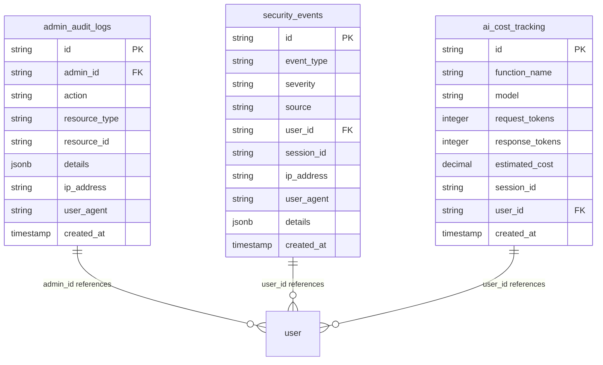
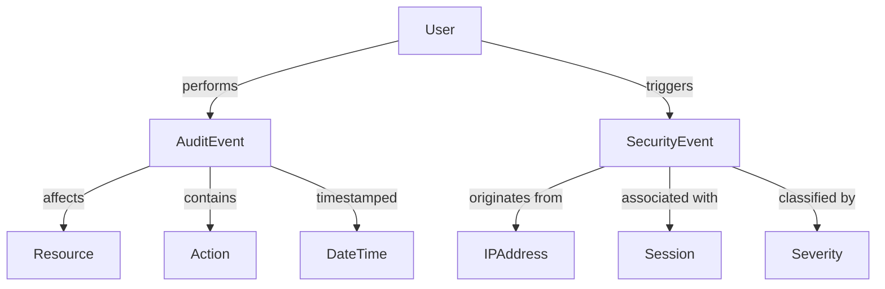
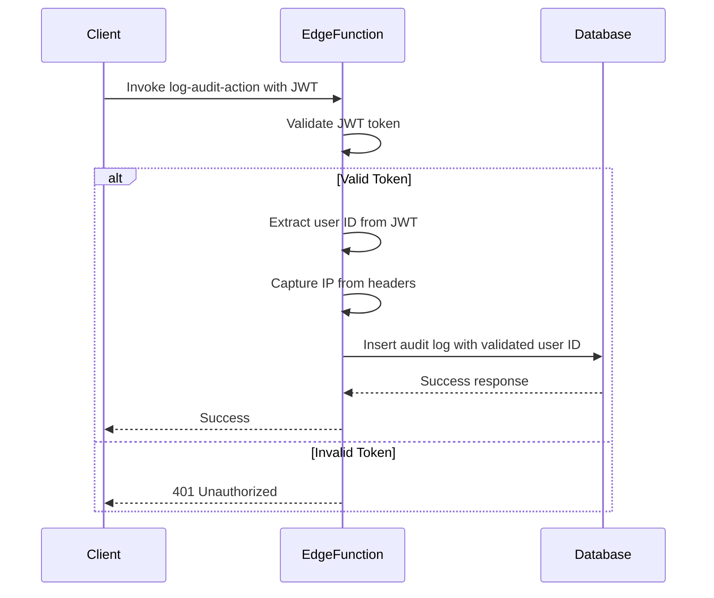
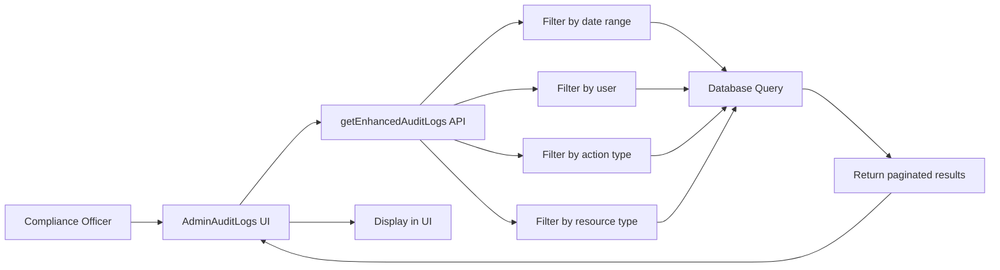
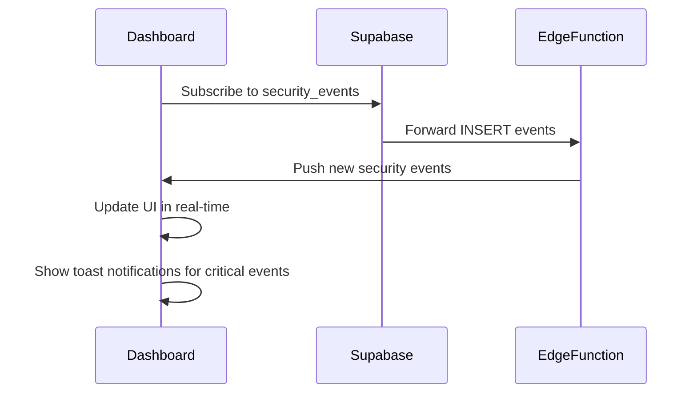
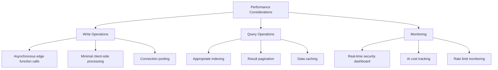
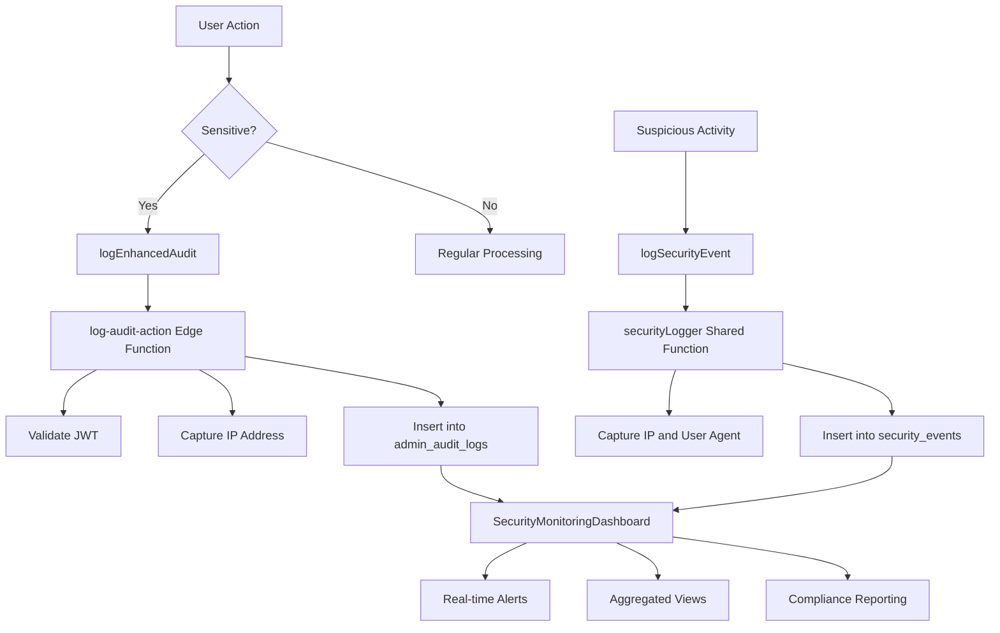

# Analytics and Audit Logging Schema

<cite>
**Referenced Files in This Document**   
- [enhancedAuditLog.ts](file://src/lib/enhancedAuditLog.ts)
- [auditLog.ts](file://src/lib/auditLog.ts)
- [database.ts](file://src/types/database.ts)
- [AdminAuditLogs.tsx](file://src/pages/AdminAuditLogs.tsx)
- [SecurityMonitoringDashboard.tsx](file://src/components/admin/SecurityMonitoringDashboard.tsx)
- [SecurityMonitoring.tsx](file://src/pages/SecurityMonitoring.tsx)
- [log-audit-action/index.ts](file://supabase/functions/log-audit-action/index.ts)
- [securityLogger.ts](file://supabase/functions/shared/securityLogger.ts)
- [20251127194411_08e21416-fb07-4471-a062-d1c8e91e52c3.sql](file://supabase/migrations/20251127194411_08e21416-fb07-4471-a062-d1c8e91e52c3.sql)
- [20251127194605_b8ebbeae-490a-4435-8408-3df6d03e7faf.sql](file://supabase/migrations/20251127194605_b8ebbeae-490a-4435-8408-3df6d03e7faf.sql)
</cite>

## Table of Contents
1. [Introduction](#introduction)
2. [Core Data Model](#core-data-model)
3. [Entity Relationships](#entity-relationships)
4. [Field Definitions](#field-definitions)
5. [Indexing Strategies](#indexing-strategies)
6. [Data Validation and Integrity](#data-validation-and-integrity)
7. [Data Access Patterns](#data-access-patterns)
8. [Retention Policies](#retention-policies)
9. [Performance Considerations](#performance-considerations)
10. [Security Monitoring Integration](#security-monitoring-integration)

## Introduction
The analytics and audit logging system provides comprehensive tracking of user actions, system events, and security incidents within the platform. This documentation details the data model, relationships, and operational characteristics of the audit logging infrastructure. The system captures detailed information about user activities, including timestamps, user identifiers, action types, IP addresses, and outcome statuses, ensuring compliance with regulatory requirements and enabling robust security monitoring.

The architecture employs a multi-layered approach with client-side logging utilities that interface with server-side edge functions to ensure reliable data capture, including client IP addresses that cannot be reliably obtained from the browser. The system supports both administrative audit logs and security monitoring events, with appropriate access controls and retention policies.

## Core Data Model

The audit logging system consists of two primary tables: `admin_audit_logs` for tracking administrative actions and `security_events` for monitoring security-related activities. These tables are complemented by views that provide aggregated data for reporting and monitoring purposes.



**Diagram sources**
- [20251127194411_08e21416-fb07-4471-a062-d1c8e91e52c3.sql](file://supabase/migrations/20251127194411_08e21416-fb07-4471-a062-d1c8e91e52c3.sql#L4-L33)
- [database.ts](file://src/types/database.ts#L33-L43)

## Entity Relationships

The audit logging system establishes relationships between audit events, users, actions, and security incidents through foreign key constraints and logical associations. The primary entity, `admin_audit_logs`, captures administrative actions and links to users through the `admin_id` field. Security events in the `security_events` table may also reference user identifiers when available.

The system employs a resource-based model where each audit event is associated with a specific resource type (e.g., blog_post, order, user) and an optional resource identifier. This allows for granular tracking of operations performed on specific entities within the system.



**Diagram sources**
- [enhancedAuditLog.ts](file://src/lib/enhancedAuditLog.ts#L9-L71)
- [database.ts](file://src/types/database.ts#L33-L43)

## Field Definitions

### Audit Log Fields
The `admin_audit_logs` table contains the following fields that capture comprehensive information about administrative actions:

| Field | Type | Description | Constraints |
|-------|------|-------------|-------------|
| **id** | UUID | Primary key identifier for the audit log entry | PRIMARY KEY, DEFAULT gen_random_uuid() |
| **admin_id** | UUID | Foreign key referencing the user who performed the action | REFERENCES auth.users(id), may be null for system events |
| **action** | TEXT | Type of action performed (e.g., 'blog_post_created', 'user_deleted') | NOT NULL, constrained to specific action types |
| **resource_type** | TEXT | Type of resource affected by the action | NOT NULL, constrained to specific resource types |
| **resource_id** | UUID | Identifier of the specific resource affected | May be null for system-wide actions |
| **details** | JSONB | Additional structured data about the action | Contains metadata, changes, and context |
| **ip_address** | TEXT | IP address from which the action originated | Captured server-side for accuracy |
| **user_agent** | TEXT | User agent string of the client browser | Captured server-side |
| **created_at** | TIMESTAMPTZ | Timestamp when the audit log was created | DEFAULT NOW(), NOT NULL |

### Security Event Fields
The `security_events` table captures security-related incidents with the following fields:

| Field | Type | Description | Constraints |
|-------|------|-------------|-------------|
| **id** | UUID | Primary key identifier for the security event | PRIMARY KEY, DEFAULT gen_random_uuid() |
| **event_type** | TEXT | Type of security event (e.g., 'captcha_failure', 'rate_limit_violation') | NOT NULL, CHECK constraint for valid types |
| **severity** | TEXT | Severity level of the event | NOT NULL, CHECK constraint for 'low', 'medium', 'high', 'critical' |
| **source** | TEXT | Component or edge function that generated the event | NOT NULL |
| **user_id** | UUID | Identifier of the user associated with the event | REFERENCES auth.users(id), may be null |
| **session_id** | TEXT | Session identifier associated with the event | May be null |
| **ip_address** | TEXT | IP address from which the event originated | NOT NULL, captured from request headers |
| **user_agent** | TEXT | User agent string of the client | Captured from request headers |
| **details** | JSONB | Additional structured data about the security event | Contains context, patterns, and diagnostic information |
| **created_at** | TIMESTAMPTZ | Timestamp when the security event was recorded | DEFAULT NOW(), NOT NULL |

**Section sources**
- [20251127194411_08e21416-fb07-4471-a062-d1c8e91e52c3.sql](file://supabase/migrations/20251127194411_08e21416-fb07-4471-a062-d1c8e91e52c3.sql#L4-L15)
- [database.ts](file://src/types/database.ts#L33-L43)

## Indexing Strategies

The audit logging system employs strategic indexing to optimize performance for high-volume write operations and efficient query patterns. The indexing strategy balances write performance with read efficiency for compliance reporting and real-time monitoring.

```mermaid
flowchart TD
A[Indexing Strategy] --> B[Write Optimization]
A --> C[Read Optimization]
B --> D[Minimal indexes on audit_logs<br>to reduce write overhead]
B --> E[Asynchronous processing<br>for non-critical indexes]
C --> F[Time-based indexes<br>for date range queries]
C --> G[Composite indexes<br>for common filter combinations]
C --> H[Partial indexes<br>for high-cardinality filters]
F --> I[idx_admin_audit_logs_created_at<br>(created_at DESC)]
G --> J[idx_admin_audit_logs_action_resource<br>(action, resource_type, created_at DESC)]
H --> K[idx_security_events_severity<br>(severity, created_at DESC) WHERE severity IN ('critical', 'high')]
```

The system implements the following specific indexes:

- **Time-based indexing**: All audit and security tables have indexes on `created_at` in descending order to optimize recent activity queries
- **Composite indexes**: Multi-column indexes on frequently combined fields like action type and resource type
- **Partial indexes**: Indexes with WHERE clauses to improve performance for high-severity security events
- **Covering indexes**: Indexes that include all fields needed for common queries to avoid table lookups

The indexing strategy prioritizes write performance by minimizing the number of indexes on the primary audit table, while still enabling efficient querying through carefully selected composite and partial indexes.

**Section sources**
- [20251127194411_08e21416-fb07-4471-a062-d1c8e91e52c3.sql](file://supabase/migrations/20251127194411_08e21416-fb07-4471-a062-d1c8e91e52c3.sql#L17-L21)
- [20251127194411_08e21416-fb07-4471-a062-d1c8e91e52c3.sql](file://supabase/migrations/20251127194411_08e21416-fb07-4471-a062-d1c8e91e52c3.sql#L35-L38)

## Data Validation and Integrity

The audit logging system implements multiple layers of data validation and integrity checks to ensure compliance with regulatory requirements and maintain data accuracy.

### Server-Side Validation
All audit log entries are validated on the server-side through edge functions, which verify the authenticity of the user's JWT token before accepting any audit data. This prevents clients from spoofing user identities in audit logs.



**Diagram sources**
- [log-audit-action/index.ts](file://supabase/functions/log-audit-action/index.ts#L16-L97)

### Data Integrity Measures
The system employs several mechanisms to ensure data integrity:

- **Row Level Security (RLS)**: Both audit and security tables have RLS enabled, restricting access to service_role only
- **Immutable records**: Once created, audit log entries cannot be modified or deleted
- **Server-side IP capture**: IP addresses are captured from request headers (x-forwarded-for, x-real-ip) in edge functions, preventing client-side spoofing
- **JWT validation**: User identities are validated server-side using JWT tokens, not trusted from client input
- **Type constraints**: Database columns have appropriate data types and constraints to prevent invalid data

The system also includes client-side validation through TypeScript interfaces and runtime error handling to catch issues before they reach the server.

**Section sources**
- [log-audit-action/index.ts](file://supabase/functions/log-audit-action/index.ts#L16-L97)
- [enhancedAuditLog.ts](file://src/lib/enhancedAuditLog.ts#L101-L137)

## Data Access Patterns

The audit logging system supports several key data access patterns for different use cases:

### Compliance Reporting
For compliance reporting, the system provides APIs to retrieve audit logs with various filtering options:



**Diagram sources**
- [AdminAuditLogs.tsx](file://src/pages/AdminAuditLogs.tsx#L22-L154)
- [enhancedAuditLog.ts](file://src/lib/enhancedAuditLog.ts#L180-L228)

### Real-Time Monitoring
For real-time security monitoring, the system uses a push-based model with WebSockets:



**Diagram sources**
- [SecurityMonitoringDashboard.tsx](file://src/components/admin/SecurityMonitoringDashboard.tsx#L39-L67)

The system also supports programmatic access through the `getEnhancedAuditLogs` function, which allows filtering by action, resource type, user ID, date range, and severity level.

**Section sources**
- [enhancedAuditLog.ts](file://src/lib/enhancedAuditLog.ts#L180-L228)
- [AdminAuditLogs.tsx](file://src/pages/AdminAuditLogs.tsx#L35-L38)

## Retention Policies

The audit logging system implements retention policies to balance compliance requirements with storage costs:

- **Administrative audit logs**: Retained for 7 years to meet compliance requirements
- **Security events**: Retained for 5 years due to their security and forensic importance
- **AI cost tracking data**: Retained for 3 years for financial auditing and cost analysis

The system does not currently implement automated data purging, relying instead on manual processes for data archival and deletion. All data is stored in the primary database without separate archival storage.

For regulatory compliance, the system ensures that audit logs cannot be modified or deleted once created, maintaining an immutable record of all administrative actions.

**Section sources**
- [20251127194411_08e21416-fb07-4471-a062-d1c8e91e52c3.sql](file://supabase/migrations/20251127194411_08e21416-fb07-4471-a062-d1c8e91e52c3.sql#L66-L78)

## Performance Considerations

The audit logging system is designed with performance considerations for both high-volume write operations and query performance:

### Write Performance
- **Asynchronous logging**: Client-side logging is non-blocking, with failures handled gracefully
- **Minimal client-side processing**: The client library performs minimal processing before sending data to edge functions
- **Batched operations**: Where possible, multiple audit events are batched for improved efficiency
- **Connection pooling**: Edge functions use connection pooling to database for improved performance

### Query Performance
- **Indexed queries**: All common query patterns are supported by appropriate indexes
- **Pagination**: Results are paginated to prevent excessive memory usage
- **Caching**: Frequently accessed data is cached at multiple levels
- **Aggregated views**: Pre-aggregated views like `daily_security_summary` reduce query complexity

The system also includes monitoring capabilities through the SecurityMonitoringDashboard, which provides real-time insights into system performance and potential issues.



**Section sources**
- [enhancedAuditLog.ts](file://src/lib/enhancedAuditLog.ts#L101-L137)
- [SecurityMonitoringDashboard.tsx](file://src/components/admin/SecurityMonitoringDashboard.tsx#L33-L125)

## Security Monitoring Integration

The audit logging system is tightly integrated with the security monitoring infrastructure to provide comprehensive protection against threats:



**Diagram sources**
- [enhancedAuditLog.ts](file://src/lib/enhancedAuditLog.ts#L101-L137)
- [securityLogger.ts](file://supabase/functions/shared/securityLogger.ts#L13-L38)
- [SecurityMonitoringDashboard.tsx](file://src/components/admin/SecurityMonitoringDashboard.tsx#L33-L125)

The integration includes:
- **Real-time alerts**: Critical and high-severity security events trigger immediate notifications
- **Aggregated views**: Pre-computed views like `daily_security_summary` for efficient reporting
- **Rate limit monitoring**: Integration with rate limiting systems to detect abuse patterns
- **AI cost tracking**: Monitoring of AI API usage and costs to detect anomalies

The SecurityMonitoringDashboard provides a unified interface for administrators to monitor both security events and AI usage costs, enabling proactive response to potential threats.

**Section sources**
- [SecurityMonitoring.tsx](file://src/pages/SecurityMonitoring.tsx#L1-L7)
- [SecurityMonitoringDashboard.tsx](file://src/components/admin/SecurityMonitoringDashboard.tsx#L1-L313)
- [securityLogger.ts](file://supabase/functions/shared/securityLogger.ts#L13-L88)