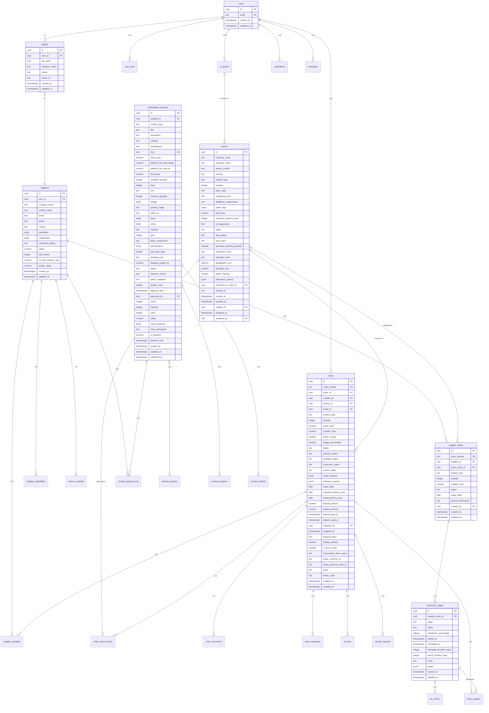

# Database Schema Design

<cite>
**Referenced Files in This Document**   
- [20250122000000_create_marketplace_system.sql](file://supabase/migrations/20250122000000_create_marketplace_system.sql)
- [20251115150759_remix_migration_from_pg_dump.sql](file://supabase/migrations/20251115150759_remix_migration_from_pg_dump.sql)
- [20251121004548_412ae5d9-7426-4e57-a6d0-4e35e860ef95.sql](file://supabase/migrations/20251121004548_412ae5d9-7426-4e57-a6d0-4e35e860ef95.sql)
- [20251121014007_e1ea3a7e-b3b2-4082-a10a-c5eff6b1135b.sql](file://supabase/migrations/20251121014007_e1ea3a7e-b3b2-4082-a10a-c5eff6b1135b.sql)
- [20251121034427_39244037-33e1-4348-ad98-cd88176e844f.sql](file://supabase/migrations/20251121034427_39244037-33e1-4348-ad98-cd88176e844f.sql)
- [add_supplier_to_quotes.sql](file://supabase/migrations/add_supplier_to_quotes.sql)
- [database.ts](file://src/types/database.ts)
</cite>

## Table of Contents
1. [Introduction](#introduction)
2. [Core Entity Relationships](#core-entity-relationships)
3. [Data Model Details](#data-model-details)
4. [Business Logic and Validation Rules](#business-logic-and-validation-rules)
5. [Database Schema Diagram](#database-schema-diagram)
6. [Data Access Patterns](#data-access-patterns)
7. [Performance Considerations](#performance-considerations)
8. [Data Lifecycle and Retention](#data-lifecycle-and-retention)

## Introduction

The Supabase PostgreSQL database schema is designed to support a comprehensive B2B marketplace platform for apparel manufacturing. The system manages complex relationships between users, orders, production stages, quotes, and suppliers. The schema is structured to support multiple user roles including buyers, suppliers, and administrators, with robust Row Level Security (RLS) policies ensuring data isolation and security.

The database design follows a relational model with normalized tables for core entities and appropriate denormalization for performance-critical operations. The schema supports the complete order lifecycle from initial quote request through production, quality control, shipping, and payment processing. Specialized tables handle AI-generated quotes, production tracking, supplier management, and marketplace functionality.

**Section sources**
- [20250122000000_create_marketplace_system.sql](file://supabase/migrations/20250122000000_create_marketplace_system.sql#L1-L532)
- [20251115150759_remix_migration_from_pg_dump.sql](file://supabase/migrations/20251115150759_remix_migration_from_pg_dump.sql#L1-L5149)

## Core Entity Relationships

The database schema centers around several core entities that form the foundation of the B2B marketplace platform. These entities are interconnected through well-defined relationships that support the business processes of quote management, order fulfillment, and production tracking.

The primary entities include:
- **Users**: Represented through the auth.users table with extended profiles in the profiles table
- **Orders**: Track the complete lifecycle of manufacturing orders from quote to delivery
- **Quotes**: Manage the quoting process, including AI-generated quotes and supplier assignments
- **Suppliers**: Store information about manufacturing partners and their capabilities
- **Production Stages**: Track the progress of orders through various manufacturing stages
- **Marketplace Products**: Enable suppliers to list products for direct purchase

The relationships between these entities follow a hierarchical structure where quotes can be converted to orders, orders are assigned to suppliers, and orders progress through multiple production stages. Marketplace products provide an alternative direct purchase pathway that bypasses the quoting process.

**Diagram sources**
- [20250122000000_create_marketplace_system.sql](file://supabase/migrations/20250122000000_create_marketplace_system.sql#L42-L532)
- [20251115150759_remix_migration_from_pg_dump.sql](file://supabase/migrations/20251115150759_remix_migration_from_pg_dump.sql#L735-L800)
- [20251121004548_412ae5d9-7426-4e57-a6d0-4e35e860ef95.sql](file://supabase/migrations/20251121004548_412ae5d9-7426-4e57-a6d0-4e35e860ef95.sql#L39-L71)

**Section sources**
- [20250122000000_create_marketplace_system.sql](file://supabase/migrations/20250122000000_create_marketplace_system.sql#L42-L532)
- [20251115150759_remix_migration_from_pg_dump.sql](file://supabase/migrations/20251115150759_remix_migration_from_pg_dump.sql#L735-L800)

## Data Model Details

The database schema consists of multiple tables that capture the various aspects of the B2B marketplace operations. Each table is designed with appropriate data types, constraints, and indexes to ensure data integrity and optimal performance.

### Orders Table
The orders table represents the core transactional entity in the system, tracking manufacturing orders from initiation to completion. Key fields include:
- **id**: UUID primary key
- **order_number**: Unique order identifier
- **buyer_id**: Reference to the purchasing user
- **supplier_id**: Reference to the manufacturing partner
- **workflow_status**: Current stage in the order lifecycle
- **current_stage**: Current production stage
- **quantity**: Order quantity
- **buyer_price**: Price charged to the buyer
- **supplier_price**: Cost to the supplier
- **target_date**: Expected completion date

The table includes comprehensive tracking fields for deposits, balances, and delivery dates, along with status fields for payment and production tracking.

### Quotes Table
The quotes table manages the quoting process, including both AI-generated and manually created quotes. Key fields include:
- **id**: UUID primary key
- **customer_email**: Email of the quote requester
- **product_type**: Type of product being quoted
- **quantity**: Requested quantity
- **total_price**: Calculated total price
- **estimated_delivery_days**: Estimated production timeline
- **status**: Current status (draft, pending, approved, etc.)
- **supplier_id**: Assigned supplier for fulfillment
- **assigned_at**: Timestamp when supplier was assigned
- **assigned_by**: Admin who assigned the supplier

The table supports the conversion of quotes to orders through the converted_to_order_id field.

### Production Stages Table
The production_stages table tracks the progress of manufacturing orders through various stages of production. Key fields include:
- **id**: UUID primary key
- **supplier_order_id**: Reference to the supplier order
- **stage**: Production stage (yarn_received, knitting, linking, etc.)
- **status**: Current status (not_started, in_progress, completed)
- **completion_percentage**: Percentage completion
- **started_at**: Timestamp when stage began
- **completed_at**: Timestamp when stage was completed
- **estimated_duration_days**: Expected duration for the stage
- **actual_duration_days**: Actual duration taken

This table enables detailed tracking of production progress and supports real-time updates to buyers.

### Suppliers Table
The suppliers table contains information about manufacturing partners. Key fields include:
- **id**: UUID primary key
- **user_id**: Reference to the associated user account
- **company_name**: Legal name of the supplier company
- **contact_name**: Primary contact person
- **email**: Contact email
- **phone**: Contact phone number
- **country**: Country of operation
- **specialties**: Array of product specialties
- **certifications**: Array of quality certifications
- **verification_status**: Verification status (pending, verified, rejected)
- **rating**: Supplier performance rating
- **on_time_delivery_rate**: Percentage of on-time deliveries
- **quality_rating**: Quality performance rating

The table supports supplier capabilities through the supplier_capabilities table, which defines what products each supplier can manufacture, their minimum and maximum order quantities, lead times, and pricing ranges.

### Marketplace Products Table
The marketplace_products table enables suppliers to list products for direct purchase. Key fields include:
- **id**: UUID primary key
- **supplier_id**: Reference to the listing supplier
- **product_type**: Type of product
- **title**: Product title
- **description**: Detailed product description
- **category**: Product category
- **base_price**: Supplier's base price
- **platform_fee_percentage**: Platform commission percentage
- **final_price**: Final price including platform fee
- **available_quantity**: Current available inventory
- **moq**: Minimum order quantity
- **lead_time_days**: Production lead time
- **status**: Listing status (draft, pending_approval, approved, etc.)
- **quality_score**: Quality rating of the product listing

The table includes comprehensive fields for product specifications, media, and SEO optimization.

**Section sources**
- [20251115150759_remix_migration_from_pg_dump.sql](file://supabase/migrations/20251115150759_remix_migration_from_pg_dump.sql#L735-L800)
- [20250122000000_create_marketplace_system.sql](file://supabase/migrations/20250122000000_create_marketplace_system.sql#L42-L532)
- [add_supplier_to_quotes.sql](file://supabase/migrations/add_supplier_to_quotes.sql#L6-L9)
- [database.ts](file://src/types/database.ts#L399-L519)

## Business Logic and Validation Rules

The database schema incorporates several business logic rules and validation constraints to ensure data integrity and enforce business processes.

### Enumerated Status Types
The system uses PostgreSQL ENUM types to constrain valid values for critical status fields:

- **order_workflow_status**: Defines the stages of the order lifecycle including quote_requested, quote_sent, awaiting_payment, assigned_to_supplier, bulk_production, qc_inspection, ready_to_ship, shipped, delivered, completed, cancelled, and on_hold
- **production_stage**: Defines the manufacturing stages including yarn_received, knitting, linking, washing_finishing, final_qc, packing, and ready_to_ship
- **verification_status**: Defines supplier verification states including pending, verified, rejected, and suspended
- **supplier_tier**: Defines supplier tiers including bronze, silver, and gold

These ENUM types prevent invalid status values and ensure consistency across the application.

### Check Constraints
The schema includes CHECK constraints to enforce business rules at the database level:

- **Positive pricing**: Ensures base_price > 0 in marketplace_products
- **Non-negative quantities**: Ensures available_quantity >= 0 in marketplace_products
- **Valid status transitions**: Restricts status values to predefined sets
- **Percentage ranges**: Ensures completion_percentage is between 0 and 100

### Row Level Security (RLS) Policies
The database implements comprehensive RLS policies to ensure data isolation between users:

- **Buyers**: Can only view and modify their own orders, quotes, and related data
- **Suppliers**: Can only view orders and production stages assigned to them
- **Administrators**: Have full access to all data for management and support
- **Service Role**: Has elevated privileges for system operations and background processes

The RLS policies are designed to prevent unauthorized access while enabling the necessary data sharing between buyers and suppliers for order fulfillment.

### Triggers and Functions
The schema includes several database functions and triggers to automate business processes:

- **update_updated_at_column**: Automatically updates the updated_at timestamp on row modifications
- **update_order_status**: Updates order status and logs the change in order_status_history
- **update_production_stage_status**: Manages production stage status transitions and timestamps
- **calculate_factory_match_score**: Calculates a supplier's suitability for an order based on capacity, quality, and speed
- **generate_invoice_number**: Creates sequential invoice numbers with year-based reset

These functions encapsulate complex business logic within the database layer, ensuring consistency and reducing application complexity.

**Section sources**
- [20251115150759_remix_migration_from_pg_dump.sql](file://supabase/migrations/20251115150759_remix_migration_from_pg_dump.sql#L29-L103)
- [20250122000000_create_marketplace_system.sql](file://supabase/migrations/20250122000000_create_marketplace_system.sql#L88-L117)
- [20251121014007_e1ea3a7e-b3b2-4082-a10a-c5eff6b1135b.sql](file://supabase/migrations/20251121014007_e1ea3a7e-b3b2-4082-a10a-c5eff6b1135b.sql#L11-L62)
- [20251121034427_39244037-33e1-4348-ad98-cd88176e844f.sql](file://supabase/migrations/20251121034427_39244037-33e1-4348-ad98-cd88176e844f.sql#L7-L131)

## Database Schema Diagram

The following entity relationship diagram illustrates the core tables and their relationships in the Supabase PostgreSQL database:

**Diagram sources**
- [20250122000000_create_marketplace_system.sql](file://supabase/migrations/20250122000000_create_marketplace_system.sql#L42-L532)
- [20251115150759_remix_migration_from_pg_dump.sql](file://supabase/migrations/20251115150759_remix_migration_from_pg_dump.sql#L735-L800)
- [add_supplier_to_quotes.sql](file://supabase/migrations/add_supplier_to_quotes.sql#L6-L9)

## Data Access Patterns

The database schema supports several key data access patterns that align with the application's functionality and performance requirements.

### User-Centric Access
The primary access pattern is user-centric, where users retrieve data related to their own accounts. This pattern is optimized through:
- Indexes on user_id fields across relevant tables
- Row Level Security policies that automatically filter data by user
- Predefined views and functions that aggregate user-specific data

For example, when a buyer logs in, the application retrieves their orders, quotes, and notifications through queries that are automatically scoped to their user ID by RLS policies.

### Order-Centric Access
The second major access pattern is order-centric, where data is accessed in the context of a specific order. This pattern supports:
- Order detail views that display all related information (documents, messages, updates, etc.)
- Production tracking interfaces that show real-time progress
- Invoice and payment management

This pattern is optimized through foreign key relationships from the orders table to related entities and indexes on order_id fields.

### Search and Discovery
The marketplace functionality requires efficient search and discovery patterns:
- Full-text search on product titles and descriptions using PostgreSQL's tsvector
- Filtered queries by category, price range, and other attributes
- Sorting by relevance, price, rating, and other criteria

The schema includes specialized indexes such as GIN indexes on tsvector fields and B-tree indexes on commonly filtered columns to optimize these access patterns.

### Analytics and Reporting
The system supports analytics and reporting through:
- Aggregation queries for performance metrics
- Time-series analysis of order and production data
- Trend analysis of marketplace activity

These patterns are supported by appropriate indexes and the use of materialized views for frequently accessed aggregated data.

**Section sources**
- [20250122000000_create_marketplace_system.sql](file://supabase/migrations/20250122000000_create_marketplace_system.sql#L120-L127)
- [20251115150759_remix_migration_from_pg_dump.sql](file://supabase/migrations/20251115150759_remix_migration_from_pg_dump.sql#L735-L800)
- [20251121034427_39244037-33e1-4348-ad98-cd88176e844f.sql](file://supabase/migrations/20251121034427_39244037-33e1-4348-ad98-cd88176e844f.sql#L78-L91)

## Performance Considerations

The database schema incorporates several performance optimizations to ensure responsive application behavior and scalability.

### Indexing Strategy
The schema includes a comprehensive indexing strategy to optimize query performance:

- **Primary keys**: UUID primary keys with B-tree indexes
- **Foreign keys**: Indexes on all foreign key columns to optimize joins
- **Frequently queried fields**: Indexes on status, created_at, and other commonly filtered columns
- **Full-text search**: GIN indexes on tsvector fields for efficient text search
- **Unique constraints**: Indexes on unique fields like order_number and slug

For example, the orders table has indexes on buyer_id, supplier_id, workflow_status, and order_number to support common query patterns.

### Query Optimization
The schema design considers query optimization through:
- Appropriate normalization to reduce data redundancy
- Strategic denormalization of frequently accessed data
- Use of generated columns for computed values
- Partitioning considerations for large tables

The marketplace_products table uses generated columns for platform_fee_amount and final_price to avoid runtime calculations while maintaining data consistency.

### Real-time Capabilities
The system supports real-time updates through:
- Supabase Realtime for live data synchronization
- Proper REPLICA IDENTITY settings on tables that require real-time updates
- Efficient change data capture for subscribed tables

Tables like production_stages and order_updates have been configured for real-time publication to enable live tracking interfaces.

### Caching Strategy
While the database itself doesn't implement caching, the schema design supports application-level caching through:
- Stable primary keys (UUIDs) that can be used as cache keys
- Timestamp fields (created_at, updated_at) that enable cache invalidation
- Query patterns that return consistent result sets for cacheability

The combination of these performance considerations ensures that the database can handle the application's requirements efficiently.

**Section sources**
- [20250122000000_create_marketplace_system.sql](file://supabase/migrations/20250122000000_create_marketplace_system.sql#L120-L127)
- [20251121033912_261eea9c-4366-46d4-bb30-fed5b5f232a6.sql](file://supabase/migrations/20251121033912_261eea9c-4366-46d4-bb30-fed5b5f232a6.sql#L1-L7)
- [20251115150759_remix_migration_from_pg_dump.sql](file://supabase/migrations/20251115150759_remix_migration_from_pg_dump.sql#L735-L800)

## Data Lifecycle and Retention

The database schema incorporates considerations for data lifecycle management and retention policies.

### Data Creation and Modification
The schema follows a consistent pattern for tracking data creation and modification:
- **created_at**: Timestamp when a record was created
- **updated_at**: Timestamp when a record was last modified
- Automatic population of these fields through triggers

This pattern enables audit trails and supports business processes that depend on timing information.

### Data Archival
The system supports data archival through:
- Status fields that can mark records as archived (e.g., status = 'archived' in marketplace_products)
- Soft deletion patterns rather than hard deletion
- Administrative interfaces for managing archived data

The marketplace_products table includes an 'archived' status option, allowing products to be removed from active listings while preserving the historical record.

### Data Retention
The schema design supports data retention requirements through:
- Preservation of financial records (invoices, payment_history) in immutable form
- Maintenance of order history for customer service and analytics
- Retention of supplier performance data for quality management

The system prevents deletion of critical records like invoices and payment history through RLS policies that deny DELETE operations to regular users.

### Data Privacy
The schema incorporates data privacy considerations:
- Separation of personally identifiable information (PII) where appropriate
- Support for data anonymization (e.g., anonymized_client_name in orders)
- Compliance with data protection regulations through proper access controls

These lifecycle and retention considerations ensure that the database supports both operational requirements and regulatory compliance.

**Section sources**
- [20250122000000_create_marketplace_system.sql](file://supabase/migrations/20250122000000_create_marketplace_system.sql#L88-L94)
- [20251121034427_39244037-33e1-4348-ad98-cd88176e844f.sql](file://supabase/migrations/20251121034427_39244037-33e1-4348-ad98-cd88176e844f.sql#L97-L124)
- [20251115150759_remix_migration_from_pg_dump.sql](file://supabase/migrations/20251115150759_remix_migration_from_pg_dump.sql#L735-L800)