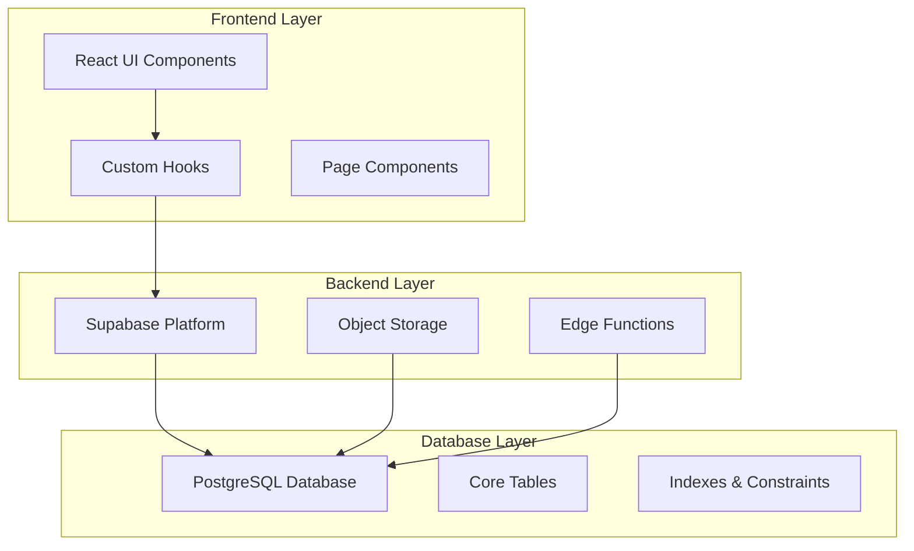
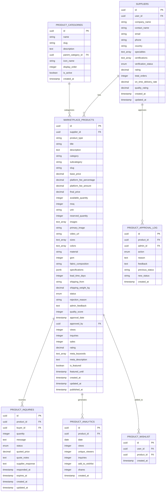
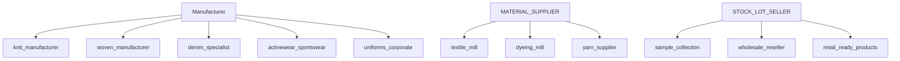
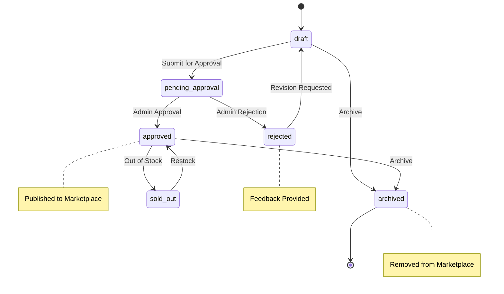
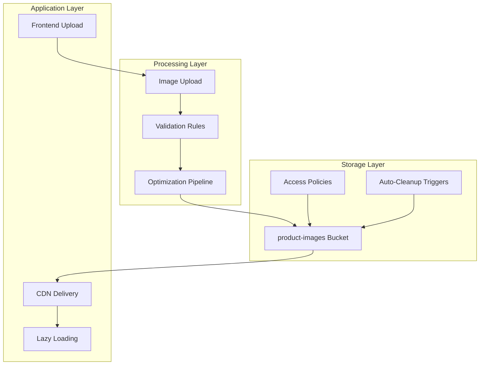
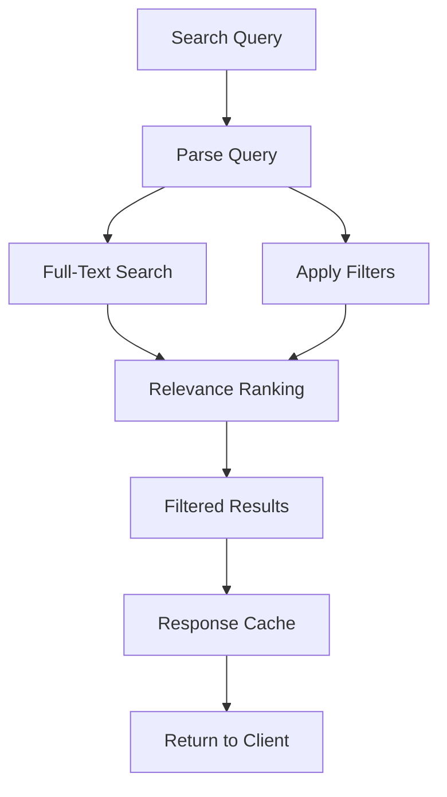
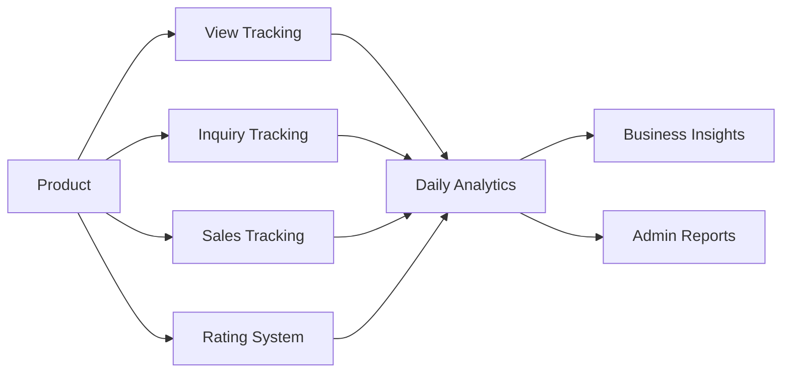
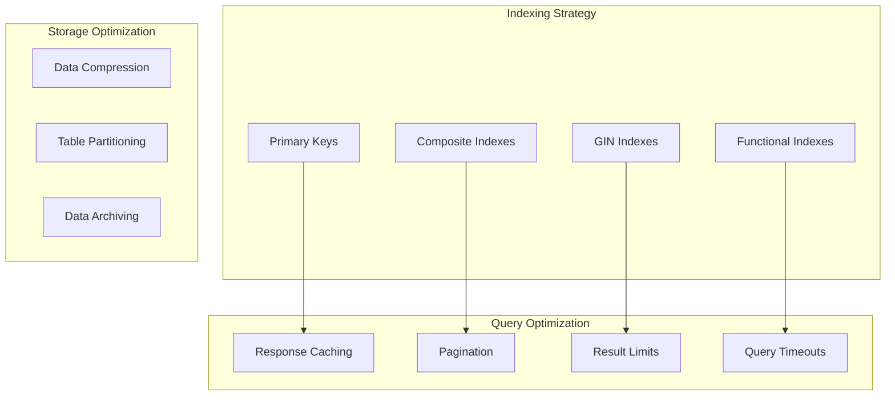
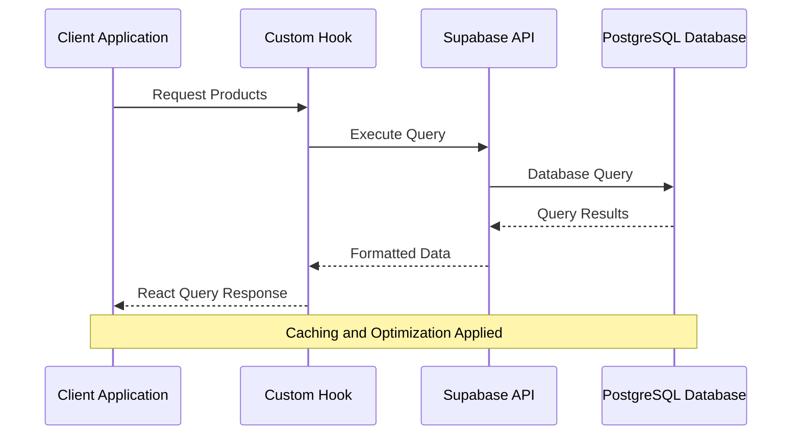

# Marketplace and Product Catalog Schema

<cite>
**Referenced Files in This Document**
- [marketplace.ts](file://src/types/marketplace.ts)
- [database.ts](file://src/types/database.ts)
- [20250122000000_create_marketplace_system.sql](file://supabase/migrations/20250122000000_create_marketplace_system.sql)
- [20250122010000_setup_product_images_storage.sql](file://supabase/migrations/20250122010000_setup_product_images_storage.sql)
- [useMarketplace.ts](file://src/hooks/useMarketplace.ts)
- [useProducts.ts](file://src/hooks/useProducts.ts)
- [Marketplace.tsx](file://src/pages/Marketplace.tsx)
- [ProductDetail.tsx](file://src/pages/ProductDetail.tsx)
- [imageOptimizer.ts](file://src/lib/imageOptimizer.ts)
- [mediaGallery.ts](file://src/lib/mediaGallery.ts)
- [ProductEngagementMetrics.tsx](file://src/components/admin/ProductEngagementMetrics.tsx)
</cite>

## Table of Contents
1. [Introduction](#introduction)
2. [System Architecture Overview](#system-architecture-overview)
3. [Core Entity Relationships](#core-entity-relationships)
4. [Product Data Model](#product-data-model)
5. [Supplier Management](#supplier-management)
6. [Product Lifecycle Workflow](#product-lifecycle-workflow)
7. [Image Storage and Media Management](#image-storage-and-media-management)
8. [Search and Filtering System](#search-and-filtering-system)
9. [Analytics and Engagement Tracking](#analytics-and-engagement-tracking)
10. [Performance Optimization Strategies](#performance-optimization-strategies)
11. [Data Access Patterns](#data-access-patterns)
12. [Constraints and Validation Rules](#constraints-and-validation-rules)
13. [Conclusion](#conclusion)

## Introduction

The LoopTrace™ Marketplace and Product Catalog system is a comprehensive B2B e-commerce platform designed for textile manufacturers, suppliers, and buyers. The system manages product listings, supplier relationships, inventory management, and marketplace operations with sophisticated data modeling and performance optimization.

This documentation covers the complete data schema, entity relationships, business workflows, and technical implementation details that power the marketplace ecosystem.

## System Architecture Overview

The marketplace system follows a modern cloud-native architecture built on Supabase, featuring:

**Diagram sources**
- [20250122000000_create_marketplace_system.sql](file://supabase/migrations/20250122000000_create_marketplace_system.sql#L1-L532)
- [useMarketplace.ts](file://src/hooks/useMarketplace.ts#L1-L528)

**Section sources**
- [20250122000000_create_marketplace_system.sql](file://supabase/migrations/20250122000000_create_marketplace_system.sql#L1-L532)
- [useMarketplace.ts](file://src/hooks/useMarketplace.ts#L1-L528)

## Core Entity Relationships

The marketplace system consists of several interconnected entities that define the product catalog ecosystem:

**Diagram sources**
- [20250122000000_create_marketplace_system.sql](file://supabase/migrations/20250122000000_create_marketplace_system.sql#L42-L241)
- [marketplace.ts](file://src/types/marketplace.ts#L42-L118)

**Section sources**
- [20250122000000_create_marketplace_system.sql](file://supabase/migrations/20250122000000_create_marketplace_system.sql#L42-L241)
- [marketplace.ts](file://src/types/marketplace.ts#L42-L118)

## Product Data Model

The `MARKETPLACE_PRODUCTS` table serves as the central entity for product information, containing comprehensive attributes for textile and apparel products:

### Core Product Attributes

| Field | Type | Description | Constraints |
|-------|------|-------------|-------------|
| `id` | UUID | Unique product identifier | Primary Key |
| `supplier_id` | UUID | Reference to supplier | Foreign Key, Not Null |
| `product_type` | TEXT | Product classification | Not Null |
| `title` | TEXT | Product display name | Not Null |
| `description` | TEXT | Detailed product description | Nullable |
| `category` | TEXT | Product category | Not Null |
| `subcategory` | TEXT | Specific product type | Nullable |

### Pricing and Inventory Management

| Field | Type | Description | Default |
|-------|------|-------------|---------|
| `base_price` | DECIMAL(10,2) | Supplier's selling price | Not Null |
| `platform_fee_percentage` | DECIMAL(5,2) | Platform commission rate | 10.00% |
| `platform_fee_amount` | DECIMAL(10,2) | Calculated platform fee | Generated |
| `final_price` | DECIMAL(10,2) | Total price including fees | Generated |
| `available_quantity` | INTEGER | Current stock level | 0 |
| `moq` | INTEGER | Minimum order quantity | 50 |
| `unit` | TEXT | Measurement unit | 'pieces' |
| `reserved_quantity` | INTEGER | Reserved for pending orders | 0 |

### Media and Specifications

| Field | Type | Description | Constraints |
|-------|------|-------------|-------------|
| `images` | TEXT[] | Array of image URLs | Default: '{}' |
| `primary_image` | TEXT | Main product image | Nullable |
| `video_url` | TEXT | Product demonstration video | Nullable |
| `sizes` | TEXT[] | Available size options | Default: '{}' |
| `colors` | TEXT[] | Available color options | Default: '{}' |
| `material` | TEXT | Fabric material composition | Nullable |
| `gsm` | INTEGER | Grams per square meter | Nullable |
| `fabric_composition` | TEXT | Material blend percentages | Nullable |
| `specifications` | JSONB | Flexible specification data | Default: '{}' |

### Logistics and Compliance

| Field | Type | Description | Default |
|-------|------|-------------|---------|
| `lead_time_days` | INTEGER | Production and shipping time | 0 |
| `shipping_from` | TEXT | Origin location | Nullable |
| `shipping_weight_kg` | DECIMAL(10,2) | Product weight for shipping | Nullable |

**Section sources**
- [20250122000000_create_marketplace_system.sql](file://supabase/migrations/20250122000000_create_marketplace_system.sql#L42-L118)
- [marketplace.ts](file://src/types/marketplace.ts#L42-L118)

## Supplier Management

The supplier system manages manufacturer relationships and product listing capabilities:

### Supplier Categories and Subcategories

The system supports multiple supplier types with specialized subcategories:

**Diagram sources**
- [20250122000000_create_marketplace_system.sql](file://supabase/migrations/20250122000000_create_marketplace_system.sql#L20-L36)
- [marketplace.ts](file://src/types/marketplace.ts#L8-L22)

### Supplier Performance Metrics

| Metric | Description | Calculation |
|--------|-------------|-------------|
| `approval_rating` | Percentage of approved products | (Approved / Submitted) × 100 |
| `total_products_listed` | Total products submitted | COUNT(products) |
| `active_products` | Currently approved products | COUNT(approved_products) |
| `product_listing_tier` | Premium status level | 'basic' \| 'premium' \| 'featured' |

**Section sources**
- [20250122000000_create_marketplace_system.sql](file://supabase/migrations/20250122000000_create_marketplace_system.sql#L10-L18)
- [marketplace.ts](file://src/types/marketplace.ts#L8-L22)

## Product Lifecycle Workflow

The product approval and publishing workflow ensures quality control and marketplace readiness:

**Diagram sources**
- [20250122000000_create_marketplace_system.sql](file://supabase/migrations/20250122000000_create_marketplace_system.sql#L89-L95)
- [marketplace.ts](file://src/types/marketplace.ts#L24-L30)

### Status Transitions and Validation

| From Status | To Status | Admin Action | Required Fields |
|-------------|-----------|--------------|-----------------|
| `draft` | `pending_approval` | Submit for Review | All mandatory fields validated |
| `pending_approval` | `approved` | Approve Product | None |
| `pending_approval` | `rejected` | Reject with Reason | Rejection reason required |
| `rejected` | `draft` | Revision Requested | None |

**Section sources**
- [20250122000000_create_marketplace_system.sql](file://supabase/migrations/20250122000000_create_marketplace_system.sql#L89-L95)
- [useMarketplace.ts](file://src/hooks/useMarketplace.ts#L345-L438)

## Image Storage and Media Management

The system implements a sophisticated image management architecture optimized for performance and scalability:

### Storage Architecture

**Diagram sources**
- [20250122010000_setup_product_images_storage.sql](file://supabase/migrations/20250122010000_setup_product_images_storage.sql#L12-L169)
- [imageOptimizer.ts](file://src/lib/imageOptimizer.ts#L1-L74)

### Image Requirements and Constraints

| Requirement | Value | Purpose |
|-------------|-------|---------|
| Max File Size | 5MB | Performance optimization |
| Allowed Formats | JPEG, PNG, WebP, GIF | Browser compatibility |
| Max Images Per Product | 10 | Organization and performance |
| Minimum Dimensions | 800×800px | Quality assurance |
| Recommended Ratio | 1:1 | Visual consistency |

### Storage Policies and Security

The system implements role-based access controls for image management:

| Role | Permissions | Scope |
|------|-------------|-------|
| Supplier | Upload, Update, Delete own images | Only for products they own |
| Admin | Full management rights | All products |
| Public | Read access | All approved products |

**Section sources**
- [20250122010000_setup_product_images_storage.sql](file://supabase/migrations/20250122010000_setup_product_images_storage.sql#L12-L169)
- [imageOptimizer.ts](file://src/lib/imageOptimizer.ts#L1-L74)

## Search and Filtering System

The marketplace implements a comprehensive search and filtering system optimized for performance:

### Search Implementation

**Diagram sources**
- [20250122000000_create_marketplace_system.sql](file://supabase/migrations/20250122000000_create_marketplace_system.sql#L420-L469)
- [useMarketplace.ts](file://src/hooks/useMarketplace.ts#L34-L110)

### Search Filters and Performance

| Filter Type | Implementation | Performance Impact |
|-------------|----------------|-------------------|
| Text Search | Full-text indexing | O(log n) |
| Category Filter | Indexed column | O(log n) |
| Price Range | Numeric comparison | O(log n) |
| Availability | Boolean flag | O(log n) |
| Featured | Boolean flag | O(log n) |

### Advanced Filtering Options

| Filter | Type | Example Values |
|--------|------|----------------|
| `minPrice` | Decimal | 10.50, 100.00 |
| `maxPrice` | Decimal | 1000.00, 5000.00 |
| `minMoq` | Integer | 50, 100 |
| `maxMoq` | Integer | 1000, 5000 |
| `inStock` | Boolean | true, false |
| `featured` | Boolean | true, false |
| `location` | String | Bangladesh, China |

**Section sources**
- [20250122000000_create_marketplace_system.sql](file://supabase/migrations/20250122000000_create_marketplace_system.sql#L420-L469)
- [useMarketplace.ts](file://src/hooks/useMarketplace.ts#L34-L110)

## Analytics and Engagement Tracking

The system provides comprehensive analytics for product performance and user engagement:

### Engagement Metrics

**Diagram sources**
- [20250122000000_create_marketplace_system.sql](file://supabase/migrations/20250122000000_create_marketplace_system.sql#L188-L205)
- [ProductEngagementMetrics.tsx](file://src/components/admin/ProductEngagementMetrics.tsx#L1-L118)

### Analytics Data Model

| Table | Purpose | Key Metrics |
|-------|---------|-------------|
| `product_analytics` | Daily engagement tracking | Views, unique viewers, inquiries |
| `product_inquiries` | Inquiry management | Quantity, status, response time |
| `product_approval_log` | Approval tracking | Timing, decisions, feedback |

### Performance Monitoring

| Metric | Purpose | Update Frequency |
|--------|---------|------------------|
| Page Views | Traffic analysis | Real-time |
| Unique Visitors | Audience measurement | Real-time |
| Inquiry Rate | Conversion tracking | Real-time |
| Approval Rate | Quality assessment | Daily |

**Section sources**
- [20250122000000_create_marketplace_system.sql](file://supabase/migrations/20250122000000_create_marketplace_system.sql#L188-L205)
- [ProductEngagementMetrics.tsx](file://src/components/admin/ProductEngagementMetrics.tsx#L1-L118)

## Performance Optimization Strategies

The marketplace implements multiple optimization strategies for efficient data access and processing:

### Database Optimization

**Diagram sources**
- [20250122000000_create_marketplace_system.sql](file://supabase/migrations/20250122000000_create_marketplace_system.sql#L120-L127)
- [useMarketplace.ts](file://src/hooks/useMarketplace.ts#L144-L149)

### Caching Strategy

| Cache Type | TTL | Scope | Purpose |
|------------|-----|-------|---------|
| Product Lists | 10 minutes | Public | Reduce database load |
| Product Details | 5 minutes | Authenticated | Improve UX |
| Categories | 30 minutes | Public | Static data |
| Analytics | 15 minutes | Admin | Real-time insights |

### Image Optimization

| Technique | Implementation | Benefit |
|-----------|----------------|---------|
| Lazy Loading | Intersection Observer | Faster initial load |
| Responsive Images | Srcset & Sizes | Optimal bandwidth |
| WebP Support | Feature detection | Reduced file size |
| CDN Delivery | Supabase Storage | Global performance |

**Section sources**
- [20250122000000_create_marketplace_system.sql](file://supabase/migrations/20250122000000_create_marketplace_system.sql#L120-L127)
- [useMarketplace.ts](file://src/hooks/useMarketplace.ts#L144-L149)
- [imageOptimizer.ts](file://src/lib/imageOptimizer.ts#L1-L74)

## Data Access Patterns

The marketplace implements efficient data access patterns optimized for different use cases:

### Query Patterns

**Diagram sources**
- [useMarketplace.ts](file://src/hooks/useMarketplace.ts#L34-L110)
- [useProducts.ts](file://src/hooks/useProducts.ts#L55-L131)

### Common Access Patterns

| Pattern | Use Case | Optimization |
|---------|----------|--------------|
| Product Listing | Marketplace browsing | Paginated, cached |
| Product Detail | Single product view | Optimized joins |
| Search Results | Filtered browsing | Full-text search |
| Supplier Products | Supplier dashboard | Authenticated queries |
| Admin Approval | Moderation | Role-based filtering |

### Error Handling and Resilience

| Scenario | Response Strategy | Recovery Method |
|----------|------------------|-----------------|
| Database Timeout | Return cached data | Retry with exponential backoff |
| Network Failure | Offline mode | Local storage fallback |
| Rate Limiting | Throttled requests | Queue management |
| Data Validation | Graceful degradation | Partial results |

**Section sources**
- [useMarketplace.ts](file://src/hooks/useMarketplace.ts#L34-L110)
- [useProducts.ts](file://src/hooks/useProducts.ts#L55-L131)

## Constraints and Validation Rules

The system enforces comprehensive data integrity through database constraints and application-level validation:

### Database Constraints

| Constraint Type | Purpose | Implementation |
|----------------|---------|----------------|
| Primary Keys | Uniqueness | UUID generation |
| Foreign Keys | Referential Integrity | Cascade deletion |
| Check Constraints | Data Validation | Price > 0, Quantity ≥ 0 |
| Unique Constraints | Business Rules | Slug uniqueness |

### Business Rules

| Rule | Validation | Error Handling |
|------|------------|----------------|
| Positive Pricing | `base_price > 0` | Price validation error |
| Non-negative Inventory | `available_quantity >= 0` | Inventory constraint |
| Image Requirements | Size, format, count limits | Upload validation |
| Category Existence | Reference validation | Category not found |

### Security Constraints

| Security Layer | Implementation | Purpose |
|----------------|----------------|---------|
| Row Level Security | Supabase RLS | Data isolation |
| Authentication | JWT tokens | User identity |
| Authorization | Role-based access | Permission checking |
| Input Sanitization | Parameter validation | SQL injection prevention |

**Section sources**
- [20250122000000_create_marketplace_system.sql](file://supabase/migrations/20250122000000_create_marketplace_system.sql#L115-L118)
- [20250122010000_setup_product_images_storage.sql](file://supabase/migrations/20250122010000_setup_product_images_storage.sql#L102-L122)

## Conclusion

The LoopTrace™ Marketplace and Product Catalog system represents a sophisticated B2B e-commerce platform with robust data modeling, comprehensive business workflows, and performance-optimized architecture. The system successfully balances functionality, scalability, and user experience through:

- **Comprehensive Entity Modeling**: Well-defined relationships between products, suppliers, categories, and media
- **Sophisticated Workflow Management**: Structured product approval and lifecycle management
- **Performance-Optimized Architecture**: Efficient indexing, caching, and query patterns
- **Security and Data Integrity**: Robust constraints and access control mechanisms
- **Scalable Media Management**: Optimized image storage and delivery systems

The modular design enables future enhancements while maintaining system stability and performance. The combination of Supabase's managed infrastructure with custom React components provides a solid foundation for marketplace operations and growth.