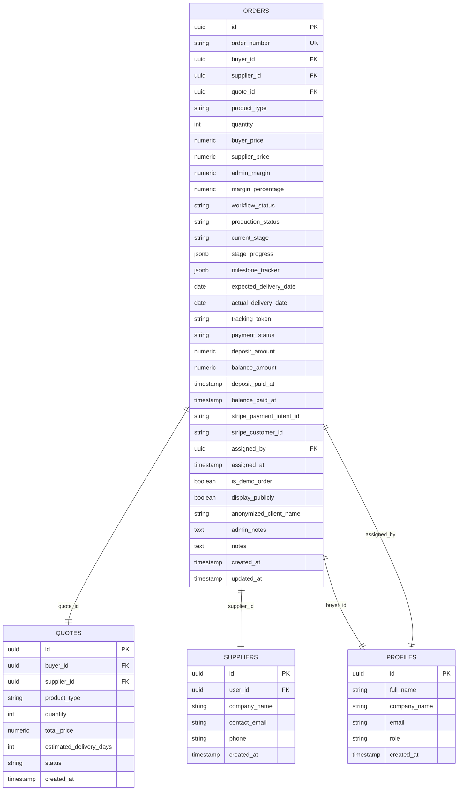
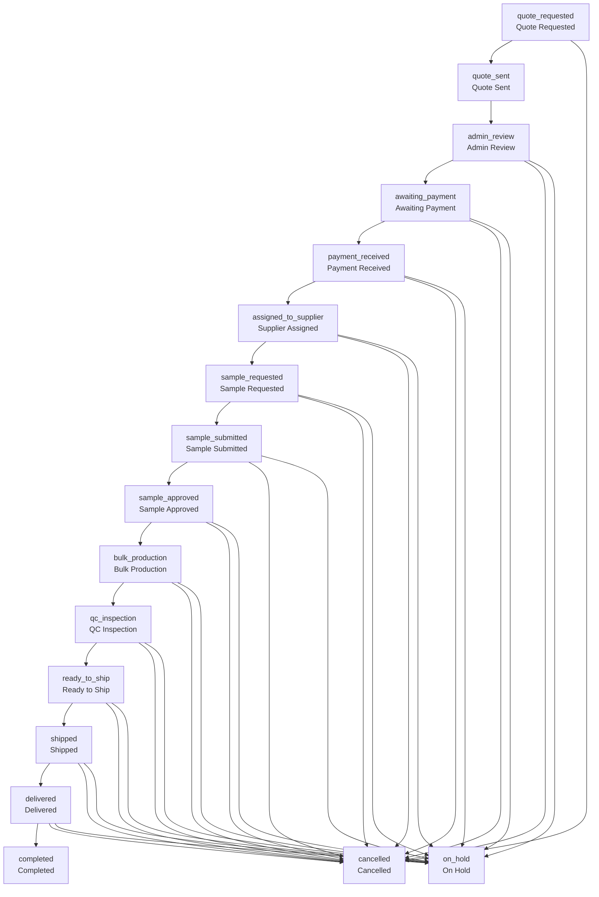
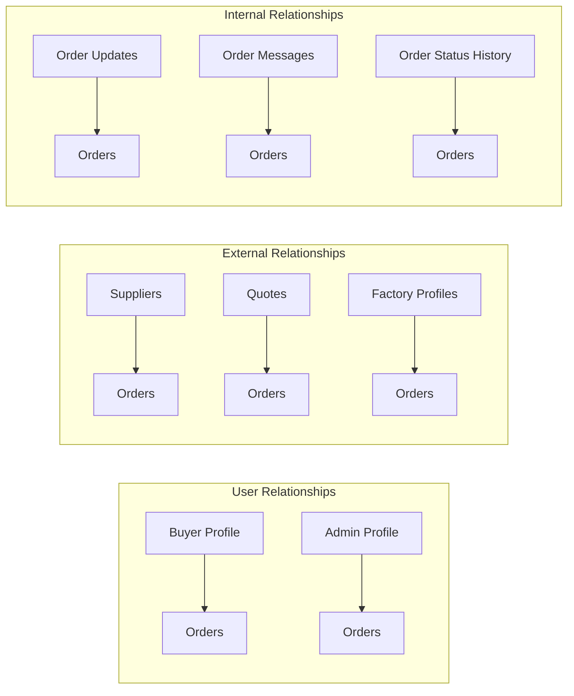
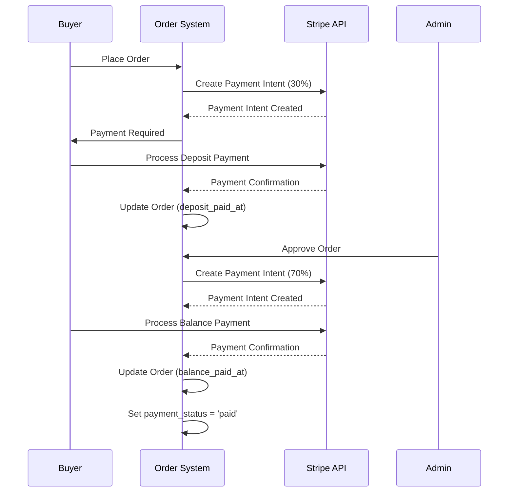
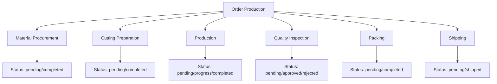
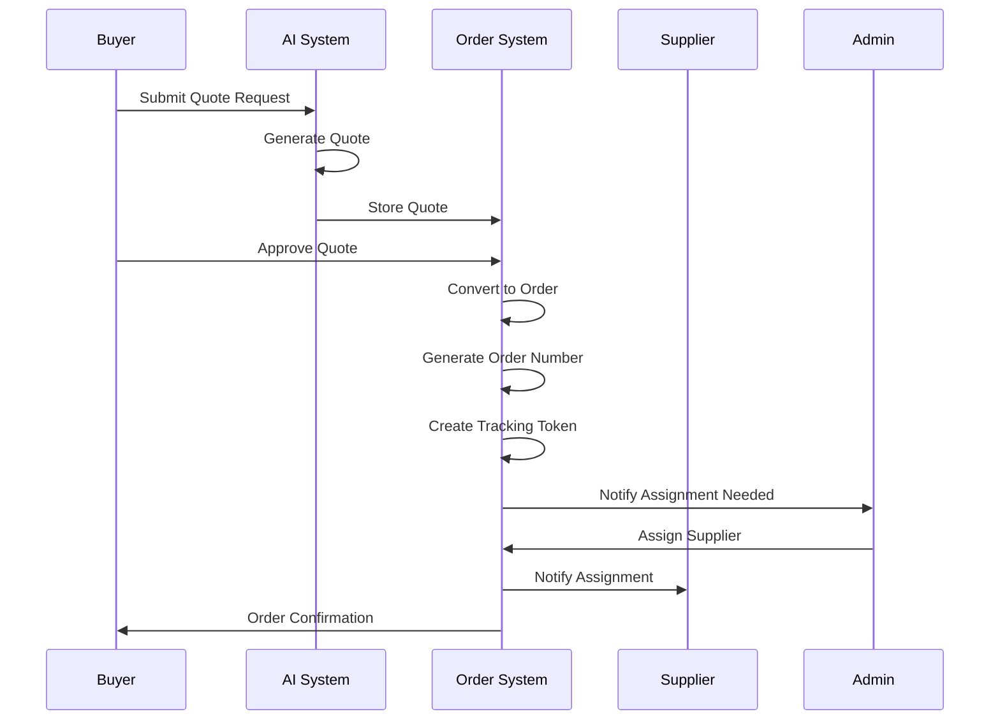

# Order Entity Model

<cite>
**Referenced Files in This Document**
- [src/types/database.ts](file://src/types/database.ts)
- [src/types/order.ts](file://src/types/order.ts)
- [src/integrations/supabase/types.ts](file://src/integrations/supabase/types.ts)
- [supabase/migrations/20251115150759_remix_migration_from_pg_dump.sql](file://supabase/migrations/20251115150759_remix_migration_from_pg_dump.sql)
- [supabase/migrations/20251120233928_2016afb8-d720-4858-9e12-7fb4ebbd5de0.sql](file://supabase/migrations/20251120233928_2016afb8-d720-4858-9e12-7fb4ebbd5de0.sql)
- [src/hooks/useOrderManagement.ts](file://src/hooks/useOrderManagement.ts)
- [src/hooks/useSupplierOrders.ts](file://src/hooks/useSupplierOrders.ts)
- [src/components/admin/OrderStatusBoard.tsx](file://src/components/admin/OrderStatusBoard.tsx)
- [src/components/OrderStatusTimeline.tsx](file://src/components/OrderStatusTimeline.tsx)
- [src/components/ProductionTimeline.tsx](file://src/components/ProductionTimeline.tsx)
- [supabase/functions/convert-quote-to-order/index.ts](file://supabase/functions/convert-quote-to-order/index.ts)
- [src/components/payment/PaymentForm.tsx](file://src/components/payment/PaymentForm.tsx)
- [src/pages/Orders.tsx](file://src/pages/Orders.tsx)
</cite>

## Table of Contents
1. [Introduction](#introduction)
2. [Order Entity Overview](#order-entity-overview)
3. [Core Fields and Data Types](#core-fields-and-data-types)
4. [Order Workflow Status Enum](#order-workflow-status-enum)
5. [Relationships and Foreign Keys](#relationships-and-foreign-keys)
6. [Payment Metadata](#payment-metadata)
7. [Production Tracking System](#production-tracking-system)
8. [Access Control and RLS Policies](#access-control-and-rls-policies)
9. [Order Creation and State Transitions](#order-creation-and-state-transitions)
10. [Typical Order Patterns](#typical-order-patterns)
11. [Integration Examples](#integration-examples)
12. [Troubleshooting Guide](#troubleshooting-guide)

## Introduction

The Order entity model represents the core business logic for managing manufacturing orders in the Sleek Apparels system. It encompasses the complete lifecycle from initial quote requests through production completion and delivery. The model supports complex workflows involving buyers, suppliers, and administrators while maintaining strict access controls and comprehensive tracking capabilities.

## Order Entity Overview

The Order entity serves as the central hub for all manufacturing activities, connecting quotes, users, suppliers, and production stages into a cohesive workflow system.



**Diagram sources**
- [src/types/database.ts](file://src/types/database.ts#L399-L420)
- [src/integrations/supabase/types.ts](file://src/integrations/supabase/types.ts#L1742-L1841)

**Section sources**
- [src/types/database.ts](file://src/types/database.ts#L399-L420)
- [src/integrations/supabase/types.ts](file://src/integrations/supabase/types.ts#L1742-L1841)

## Core Fields and Data Types

### Identification and Metadata Fields

| Field | Type | Constraints | Description |
|-------|------|-------------|-------------|
| `id` | UUID | Primary Key | Unique identifier for the order |
| `order_number` | String | Unique, Required | Human-readable order identifier (e.g., "ORD-12345678") |
| `created_at` | Timestamp | Auto-generated | Order creation timestamp |
| `updated_at` | Timestamp | Auto-updated | Last modification timestamp |
| `tracking_token` | String | Unique | Secure token for order tracking |

### Relationship Fields

| Field | Type | References | Description |
|-------|------|------------|-------------|
| `buyer_id` | UUID | Profiles | Reference to the purchasing user |
| `supplier_id` | UUID | Suppliers | Assigned manufacturing partner |
| `quote_id` | UUID | Quotes | Original quote that generated this order |
| `factory_id` | UUID | Profiles | Internal factory responsible for production |
| `assigned_by` | UUID | Profiles | Admin user who assigned the supplier |

### Product and Quantity Information

| Field | Type | Constraints | Description |
|-------|------|-------------|-------------|
| `product_type` | String | Required | Category of product (e.g., "casualwear", "activewear", "uniforms") |
| `quantity` | Integer | Required, > 0 | Number of units ordered |
| `target_date` | Date | Nullable | Desired completion date |

### Pricing and Margin Details

| Field | Type | Constraints | Description |
|-------|------|-------------|-------------|
| `buyer_price` | Numeric | Nullable | Selling price to customer |
| `supplier_price` | Numeric | Nullable | Cost to manufacturer |
| `admin_margin` | Numeric | Nullable | Profit margin for platform |
| `margin_percentage` | Numeric | Nullable | Percentage margin calculation |

**Section sources**
- [src/types/database.ts](file://src/types/database.ts#L399-L420)
- [supabase/migrations/20251115150759_remix_migration_from_pg_dump.sql](file://supabase/migrations/20251115150759_remix_migration_from_pg_dump.sql#L1288-L1313)

## Order Workflow Status Enum

The `order_workflow_status` enum defines the complete lifecycle progression of an order through various business states.



**Diagram sources**
- [src/components/OrderStatusTimeline.tsx](file://src/components/OrderStatusTimeline.tsx#L16-L30)
- [src/integrations/supabase/types.ts](file://src/integrations/supabase/types.ts#L4255-L4272)

### Status Descriptions

| Status | Business Meaning | Typical Actions | Transition Triggers |
|--------|------------------|-----------------|-------------------|
| `quote_requested` | Initial inquiry | Buyer submits requirements | New quote submission |
| `quote_sent` | Quote provided | Supplier receives quote | Quote approval and sending |
| `admin_review` | Administrative approval | Admin reviews quote details | Quote completion |
| `awaiting_payment` | Payment pending | Buyer prepares payment | Quote approval |
| `payment_received` | Payment confirmed | Order becomes active | Successful payment |
| `assigned_to_supplier` | Supplier selected | Manufacturer assigned | Admin supplier assignment |
| `sample_requested` | Sample preparation | Supplier creates prototype | Order enters production |
| `sample_submitted` | Sample provided | Buyer receives sample | Supplier completion |
| `sample_approved` | Sample approved | Bulk production begins | Buyer approval |
| `bulk_production` | Mass production | Manufacturing process | Sample approval |
| `qc_inspection` | Quality control | Inspection and testing | Production completion |
| `ready_to_ship` | Shipping prepared | Packaging and logistics | QC approval |
| `shipped` | In transit | Transportation initiated | Packing completion |
| `delivered` | Received | Buyer confirms receipt | Delivery completion |
| `completed` | Order finished | Final status reached | Delivery confirmation |
| `cancelled` | Terminated | Order terminated | Various cancellation reasons |
| `on_hold` | Paused | Process suspended | Administrative pause |

**Section sources**
- [src/components/OrderStatusTimeline.tsx](file://src/components/OrderStatusTimeline.tsx#L16-L30)
- [src/integrations/supabase/types.ts](file://src/integrations/supabase/types.ts#L4255-L4272)

## Relationships and Foreign Keys

### Primary Relationships



**Diagram sources**
- [supabase/migrations/20251115150759_remix_migration_from_pg_dump.sql](file://supabase/migrations/20251115150759_remix_migration_from_pg_dump.sql#L3264-L3292)

### Foreign Key Constraints

| Constraint | Source Table | Target Table | On Delete | Description |
|------------|--------------|--------------|-----------|-------------|
| `orders_buyer_id_fkey` | orders | profiles | Restrict | Buyer profile relationship |
| `orders_supplier_id_fkey` | orders | suppliers | Set Null | Supplier assignment |
| `orders_quote_id_fkey` | orders | quotes | Set Null | Quote origin |
| `orders_factory_id_fkey` | orders | profiles | Set Null | Internal factory |
| `orders_assigned_by_fkey` | orders | profiles | Restrict | Admin assignment |

### Related Entities

The Order entity connects to several supporting entities:

- **Order Updates**: Track production progress and milestones
- **Order Messages**: Communication between parties
- **Order Status History**: Audit trail of status changes
- **Supplier Orders**: Reverse relationship for supplier management
- **Invoices**: Financial tracking
- **Production Stages**: Detailed manufacturing steps

**Section sources**
- [supabase/migrations/20251115150759_remix_migration_from_pg_dump.sql](file://supabase/migrations/20251115150759_remix_migration_from_pg_dump.sql#L3264-L3292)

## Payment Metadata

The Order entity includes comprehensive payment tracking capabilities integrated with Stripe payment processing.

### Payment Fields

| Field | Type | Description | Usage |
|-------|------|-------------|-------|
| `payment_status` | String | Current payment state | "pending", "partial", "paid" |
| `deposit_amount` | Numeric | 30% initial payment | Calculated from buyer_price |
| `balance_amount` | Numeric | Remaining 70% payment | Calculated from buyer_price |
| `deposit_paid_at` | Timestamp | Deposit completion time | Payment confirmation |
| `balance_paid_at` | Timestamp | Final payment time | Full payment confirmation |
| `stripe_payment_intent_id` | String | Stripe payment reference | Payment processing |
| `stripe_customer_id` | String | Stripe customer reference | Recurring payments |

### Payment Flow Implementation



**Diagram sources**
- [src/components/payment/PaymentForm.tsx](file://src/components/payment/PaymentForm.tsx#L1-L49)
- [supabase/functions/create-payment-intent/index.ts](file://supabase/functions/create-payment-intent/index.ts#L144-L262)

**Section sources**
- [src/components/payment/PaymentForm.tsx](file://src/components/payment/PaymentForm.tsx#L1-L49)
- [supabase/functions/create-payment-intent/index.ts](file://supabase/functions/create-payment-intent/index.ts#L144-L262)

## Production Tracking System

### Stage Progress Tracking

The Order entity maintains detailed production progress through JSONB fields and enumerated stages.

#### Milestone Tracker Structure

```typescript
interface MilestoneTracker {
  production: { status: string; completion_date: string | null }
  packing_shipping: { status: string; completion_date: string | null }
  quality_inspection: { status: string; completion_date: string | null }
  cutting_preparation: { status: string; completion_date: string | null }
  material_procurement: { status: string; completion_date: string | null }
}
```

#### Stage Progress Monitoring

| Stage | Progress Range | Completion Criteria |
|-------|----------------|-------------------|
| Material Procurement | 0-100% | Materials received |
| Cutting Preparation | 0-100% | Patterns finalized |
| Production | 0-100% | Units manufactured |
| Quality Inspection | 0-100% | Pass/Fail criteria met |
| Packing | 0-100% | Packaging completed |
| Shipping | 0-100% | Shipment dispatched |

### Production Status Integration



**Diagram sources**
- [src/components/ProductionTimeline.tsx](file://src/components/ProductionTimeline.tsx#L39-L77)
- [src/components/admin/AdminStageMonitor.tsx](file://src/components/admin/AdminStageMonitor.tsx#L1-L38)

**Section sources**
- [src/components/ProductionTimeline.tsx](file://src/components/ProductionTimeline.tsx#L39-L77)
- [src/components/admin/AdminStageMonitor.tsx](file://src/components/admin/AdminStageMonitor.tsx#L1-L38)

## Access Control and RLS Policies

The Order entity implements comprehensive Row Level Security (RLS) policies to ensure proper access control based on user roles.

### Role-Based Access Matrix

| User Role | Read Access | Write Access | Special Permissions |
|-----------|-------------|--------------|-------------------|
| Buyer | Own orders | None | Track order progress |
| Supplier | Assigned orders | Update production | Submit production reports |
| Admin | All orders | Full management | Assign suppliers, approve orders |
| Factory | Assigned orders | Production updates | Internal manufacturing |

### RLS Policy Implementation

```sql
-- Buyer access: Can only see orders they placed
CREATE POLICY "Buyers can view their own orders"
ON orders FOR SELECT
USING (buyer_id = auth.uid());

-- Supplier access: Can see orders assigned to them
CREATE POLICY "Suppliers can view assigned orders"
ON orders FOR SELECT
USING (supplier_id IN (
  SELECT id FROM suppliers 
  WHERE user_id = auth.uid()
));

-- Admin access: Full visibility for administrative oversight
CREATE POLICY "Admins can manage all orders"
ON orders FOR ALL
USING (has_role(auth.uid(), 'admin'));
```

### Message and Communication Access

The system also implements RLS for order-related communications:

- **Order Messages**: Participants can view messages for their orders
- **Supplier Messages**: Supplier-specific message access
- **Status History**: Complete audit trail for authorized users

**Section sources**
- [supabase/migrations/20251115150759_remix_migration_from_pg_dump.sql](file://supabase/migrations/20251115150759_remix_migration_from_pg_dump.sql#L4608-L4639)

## Order Creation and State Transitions

### Quote-to-Order Conversion Process

The system supports seamless conversion from quotes to orders through automated workflows.



**Diagram sources**
- [supabase/functions/convert-quote-to-order/index.ts](file://supabase/functions/convert-quote-to-order/index.ts#L38-L222)

### Automated State Transitions

The system automatically handles state transitions based on business rules:

1. **Quote Approval**: Automatically advances to `admin_review`
2. **Payment Completion**: Advances to `payment_received`
3. **Supplier Assignment**: Advances to `assigned_to_supplier`
4. **Sample Approval**: Advances to `bulk_production`
5. **Production Completion**: Advances to `qc_inspection`
6. **Shipping**: Advances to `shipped`
7. **Delivery**: Advances to `delivered`

### Manual State Management

Administrators can manually control order progression:

```typescript
// Example: Update order status
const updateOrderStatus = async (orderId: string, newStatus: string) => {
  const { error } = await supabase
    .from('orders')
    .update({ workflow_status: newStatus })
    .eq('id', orderId);
};
```

**Section sources**
- [supabase/functions/convert-quote-to-order/index.ts](file://supabase/functions/convert-quote-to-order/index.ts#L38-L222)
- [src/hooks/useOrderManagement.ts](file://src/hooks/useOrderManagement.ts#L11-L44)

## Typical Order Patterns

### Standard Manufacturing Order

```mermaid
flowchart LR
A[Quote Request] --> B[Quote Sent]
B --> C[Admin Review]
C --> D[Payment Pending]
D --> E[Payment Received]
E --> F[Supplier Assignment]
F --> G[Sample Request]
G --> H[Sample Submission]
H --> I[Sample Approval]
I --> J[Bulk Production]
J --> K[Quality Control]
K --> L[Ready to Ship]
L --> M[Shipped]
M --> N[Delivered]
N --> O[Completed]
```



### Quick Response Order

For urgent requests, the system supports expedited workflows:

1. **Priority Quote Processing**: Faster quote generation
2. **Immediate Supplier Assignment**: Pre-approved suppliers
3. **Accelerated Production**: Priority manufacturing
4. **Express Shipping**: Expedited logistics

### Customization Order

For bespoke products:

1. **Design Phase**: Collaborative design process
2. **Prototype Development**: Iterative prototyping
3. **Approval Workflow**: Multiple review cycles
4. **Specialized Production**: Custom manufacturing processes

### Bulk Order Management

Large volume orders require specialized handling:

- **Milestone Planning**: Phased production scheduling
- **Resource Allocation**: Capacity management
- **Quality Assurance**: Enhanced inspection protocols
- **Logistics Coordination**: Bulk shipping arrangements

## Integration Examples

### Frontend Integration

```typescript
// Order listing with role-based filtering
const fetchOrders = async () => {
  const { data: { user } } = await supabase.auth.getUser();
  let query = supabase.from("orders").select("*");
  
  // Role-based filtering
  const { data: roleData } = await supabase
    .from("user_roles")
    .select("role")
    .eq("user_id", user.id);
  
  if (roleData) {
    if (["retailer", "wholesaler"].includes(roleData.role)) {
      query = query.eq("buyer_id", user.id);
    } else if (roleData.role === "factory") {
      query = query.eq("factory_id", user.id);
    }
  }
  
  const { data, error } = await query.order("created_at", { ascending: false });
};
```

### Backend Integration

```typescript
// Supplier order management
const useSupplierOrders = (supplierId: string) => {
  const fetchOrders = async () => {
    const { data, error } = await supabase
      .from('supplier_orders')
      .select(`
        *,
        supplier:suppliers(company_name),
        buyer_order:orders(
          order_number,
          buyer_id,
          buyer:profiles(full_name, company_name)
        )
      `)
      .eq('supplier_id', supplierId);
  };
};
```

### State Management Integration

```typescript
// Order status monitoring
const OrderStatusBoard = ({ orders }: { orders: Order[] }) => {
  const ordersByStatus = orders.reduce((acc, order) => {
    const status = order.workflow_status || 'quote_requested';
    if (!acc[status]) acc[status] = [];
    acc[status].push(order);
    return acc;
  }, {} as Record<string, Order[]>);
};
```

**Section sources**
- [src/pages/Orders.tsx](file://src/pages/Orders.tsx#L59-L88)
- [src/hooks/useSupplierOrders.ts](file://src/hooks/useSupplierOrders.ts#L10-L29)
- [src/components/admin/OrderStatusBoard.tsx](file://src/components/admin/OrderStatusBoard.tsx#L167-L175)

## Troubleshooting Guide

### Common Issues and Solutions

#### Order Creation Failures

**Problem**: Order creation fails with validation errors
**Solution**: 
- Verify required fields: `order_number`, `buyer_id`, `product_type`, `quantity`
- Check quantity constraints (must be > 0)
- Ensure unique `order_number` constraint is satisfied

#### Payment Processing Issues

**Problem**: Payment intents failing or timing out
**Solution**:
- Verify Stripe configuration and API keys
- Check payment amount calculations (30%/70% split)
- Ensure proper error handling for payment failures

#### Supplier Assignment Problems

**Problem**: Supplier assignment not working correctly
**Solution**:
- Verify supplier exists and is active
- Check user role permissions
- Ensure proper foreign key relationships

#### Access Control Issues

**Problem**: Users cannot see expected orders
**Solution**:
- Verify user role assignments
- Check RLS policy configurations
- Confirm authentication state

### Debugging Tools

#### Order State Validation

```typescript
// Validate order state consistency
const validateOrderState = (order: Order) => {
  const validations = [
    order.quantity > 0,
    order.buyer_price >= 0,
    order.workflow_status in VALID_STATUS_ENUM,
    // Additional business rule validations
  ];
  
  return validations.every(Boolean);
};
```

#### Production Progress Tracking

```typescript
// Monitor production stage progress
const monitorProductionProgress = (order: Order) => {
  const totalStages = Object.keys(order.stage_progress).length;
  const completedStages = Object.values(order.stage_progress)
    .filter(progress => progress === 100).length;
    
  return {
    completionRate: completedStages / totalStages,
    overdueStages: Object.entries(order.stage_progress)
      .filter(([_, progress]) => progress < 100)
  };
};
```

### Performance Optimization

#### Query Optimization

- Use appropriate indexes on frequently queried fields (`buyer_id`, `supplier_id`, `workflow_status`)
- Implement proper pagination for large order lists
- Cache frequently accessed order data

#### Real-time Updates

- Implement WebSocket connections for real-time order status updates
- Use Supabase realtime subscriptions for immediate notifications
- Optimize polling intervals for production updates

**Section sources**
- [src/hooks/useOrderManagement.ts](file://src/hooks/useOrderManagement.ts#L11-L44)
- [src/hooks/useSupplierOrders.ts](file://src/hooks/useSupplierOrders.ts#L10-L29)