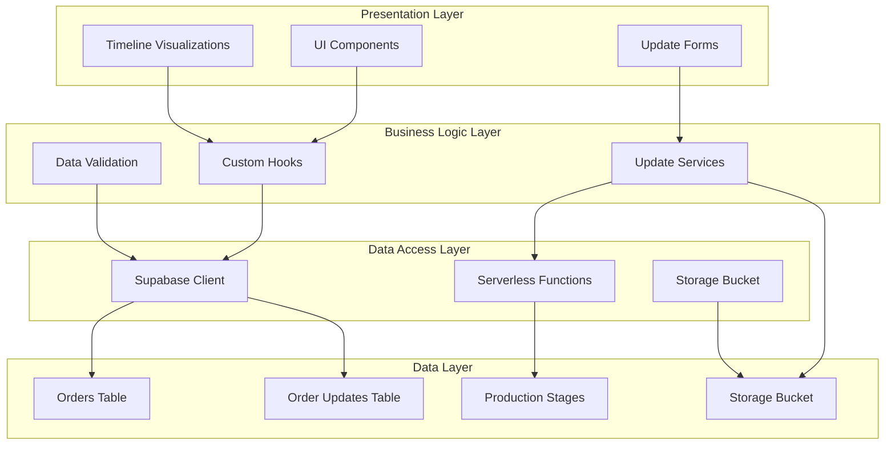
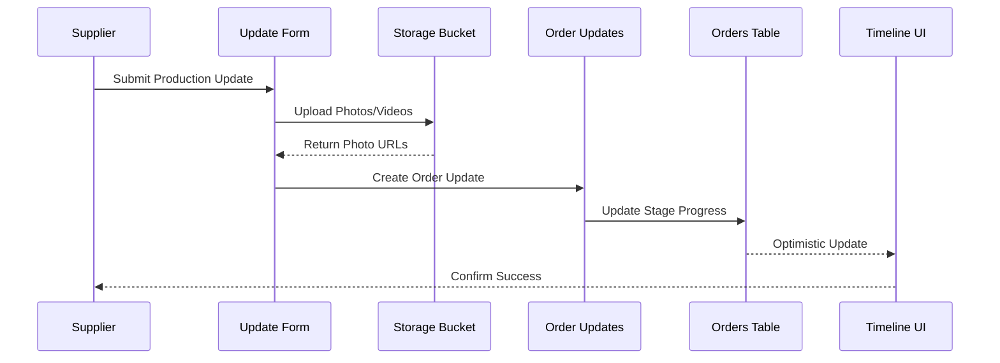
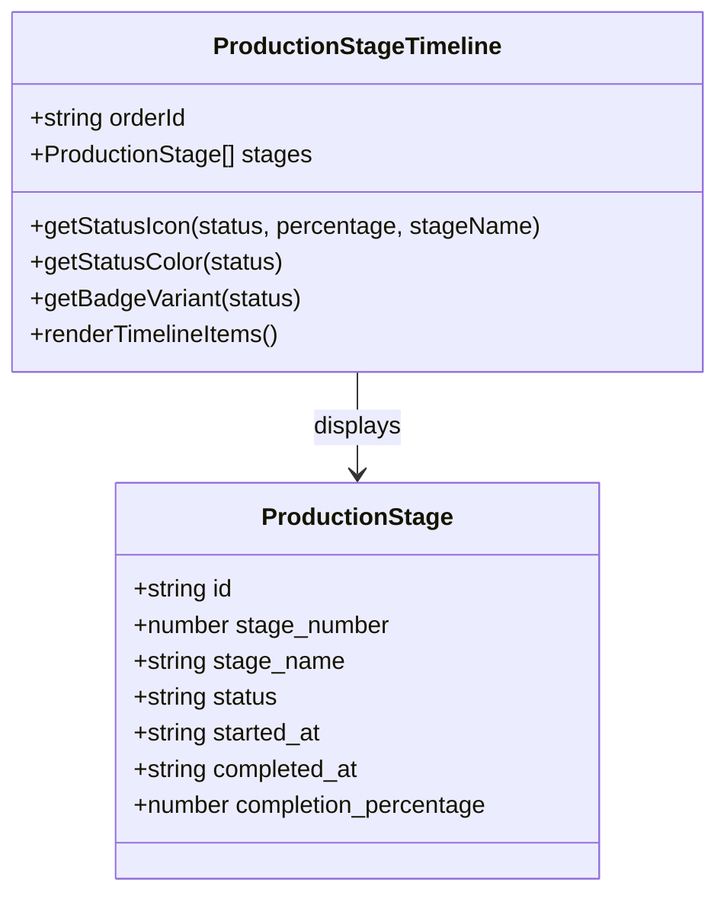
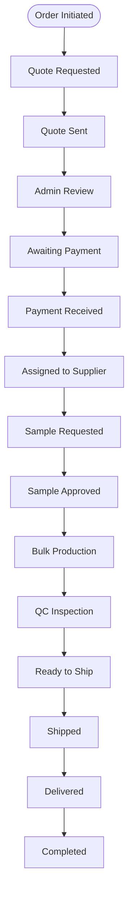
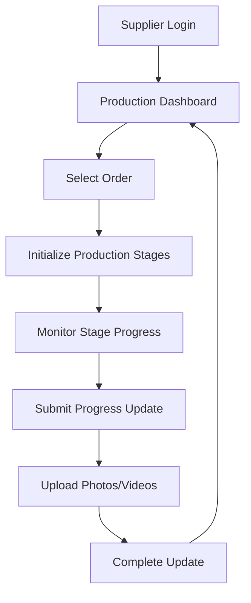
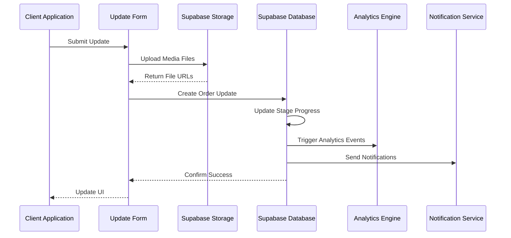

# Order Tracking Mechanism

<cite>
**Referenced Files in This Document**
- [types.ts](file://src/integrations/supabase/types.ts)
- [database.ts](file://src/types/database.ts)
- [TrackOrder.tsx](file://src/pages/TrackOrder.tsx)
- [ProductionUpdateForm.tsx](file://src/components/ProductionUpdateForm.tsx)
- [ProductionStageTimeline.tsx](file://src/components/production/ProductionStageTimeline.tsx)
- [ProductionAnalytics.tsx](file://src/components/production/ProductionAnalytics.tsx)
- [OrderStatusTimeline.tsx](file://src/components/OrderStatusTimeline.tsx)
- [LoopTraceTimeline.tsx](file://src/components/modern/LoopTraceTimeline.tsx)
- [useOptimisticUpdate.ts](file://src/hooks/useOptimisticUpdate.ts)
- [useOrders.ts](file://src/hooks/queries/useOrders.ts)
- [ProductionManagementPanel.tsx](file://src/components/supplier/ProductionManagementPanel.tsx)
- [ProductionStageManager.tsx](file://src/components/supplier/ProductionStageManager.tsx)
- [20251115150759_remix_migration_from_pg_dump.sql](file://supabase/migrations/20251115150759_remix_migration_from_pg_dump.sql)
- [20251121034427_39244037-33e1-4348-ad98-cd88176e844f.sql](file://supabase/migrations/20251121034427_39244037-33e1-4348-ad98-cd88176e844f.sql)
- [20251121004736_fddceea9-b0a0-472e-a19e-b918c065f4ec.sql](file://supabase/migrations/20251121004736_fddceea9-b0a0-472e-a19e-b918c065f4ec.sql)
- [20250122010000_setup_product_images_storage.sql](file://supabase/migrations/20250122010000_setup_product_images_storage.sql)
</cite>

## Table of Contents
1. [Introduction](#introduction)
2. [System Architecture](#system-architecture)
3. [Database Schema](#database-schema)
4. [Real-Time Production Tracking](#real-time-production-tracking)
5. [UI Components](#ui-components)
6. [Security Model](#security-model)
7. [Performance Considerations](#performance-considerations)
8. [Supplier Interface Workflows](#supplier-interface-workflows)
9. [Data Flow and Integration](#data-flow-and-integration)
10. [Troubleshooting Guide](#troubleshooting-guide)

## Introduction

The Order Tracking Mechanism in the sleekapp-v100 system provides comprehensive real-time production tracking capabilities for textile manufacturing orders. This system enables stakeholders to monitor production progress through detailed stage-by-stage tracking, visual timeline representations, and automated progress calculations. The mechanism supports multiple user roles including buyers, suppliers, and administrators, each with appropriate access levels and functionality.

The tracking system operates on a sophisticated foundation that captures production updates with timestamps, completion percentages, photographic evidence, and detailed progress metrics. It integrates seamlessly with the broader order management ecosystem while maintaining strict security controls and performance optimization strategies.

## System Architecture

The order tracking system follows a layered architecture that separates concerns between data persistence, business logic, and presentation layers:



**Diagram sources**
- [TrackOrder.tsx](file://src/pages/TrackOrder.tsx#L1-L50)
- [ProductionUpdateForm.tsx](file://src/components/ProductionUpdateForm.tsx#L1-L100)
- [useOptimisticUpdate.ts](file://src/hooks/useOptimisticUpdate.ts#L1-L50)

## Database Schema

The order tracking system relies on several interconnected database tables that capture different aspects of the production tracking lifecycle:

### Core Tables

| Table | Purpose | Key Fields |
|-------|---------|------------|
| `orders` | Central order information | `stage_progress` (JSON), `current_stage`, `id` |
| `order_updates` | Production stage updates | `order_id`, `stage`, `completion_percentage`, `photos`, `created_at` |
| `production_stages` | Detailed stage tracking | `stage_number`, `status`, `started_at`, `completed_at` |
| `order_status_history` | Status change audit | `order_id`, `old_status`, `new_status`, `changed_by` |

### Stage Progress JSON Field

The `stage_progress` field in the Orders entity maintains completion metrics for each production stage using a JSON structure:

```typescript
interface Order {
  id: string;
  current_stage: ProductionStage;
  stage_progress: Record<string, number>;
  // Example: { "knitting": 75, "cutting": 100, "sewing": 30 }
}
```

This structure enables efficient querying and updating of completion percentages across multiple production stages while maintaining data integrity.

**Section sources**
- [types.ts](file://src/integrations/supabase/types.ts#L1681-L1721)
- [database.ts](file://src/types/database.ts#L398-L438)

### Order Updates Table Structure

The `order_updates` table captures detailed production progress information:

| Column | Type | Description |
|--------|------|-------------|
| `id` | UUID | Primary key |
| `order_id` | UUID | Foreign key to orders |
| `stage` | Enum | Production stage identifier |
| `message` | Text | Update description |
| `completion_percentage` | Integer | Progress percentage (0-100) |
| `photos` | Text[] | Array of photo URLs |
| `created_by` | UUID | User who created update |
| `created_at` | Timestamp | Update timestamp |

**Section sources**
- [types.ts](file://src/integrations/supabase/types.ts#L1681-L1721)
- [20251115150759_remix_migration_from_pg_dump.sql](file://supabase/migrations/20251115150759_remix_migration_from_pg_dump.sql#L1254-L1265)

## Real-Time Production Tracking

### Update Recording Mechanism

The system implements a comprehensive update recording mechanism that captures production progress through multiple channels:



**Diagram sources**
- [ProductionUpdateForm.tsx](file://src/components/ProductionUpdateForm.tsx#L48-L105)
- [useOptimisticUpdate.ts](file://src/hooks/useOptimisticUpdate.ts#L26-L50)

### Completion Metrics Calculation

The system automatically calculates and maintains completion metrics through database triggers and application logic:

```typescript
// Automatic completion percentage tracking
const updateProductionStageStatus = (OLD, NEW) => {
  if (OLD.completion_percentage === 0 && NEW.completion_percentage > 0 && !NEW.started_at) {
    NEW.started_at = now();
    NEW.status = 'in_progress';
  }
  
  if (NEW.completion_percentage === 100 && !NEW.completed_at) {
    NEW.completed_at = now();
    NEW.status = 'completed';
  }
};
```

**Section sources**
- [20251115150759_remix_migration_from_pg_dump.sql](file://supabase/migrations/20251115150759_remix_migration_from_pg_dump.sql#L630-L652)

### Timestamp Management

Each production update includes comprehensive timestamp tracking:

- **Created At**: Automatic timestamp when update is submitted
- **Started At**: Automatically set when first progress is recorded
- **Completed At**: Automatically set when 100% completion is reached
- **Updated At**: Automatic timestamp for all modifications

## UI Components

### Timeline Visualization Components

The system provides multiple timeline visualization components tailored for different user perspectives:

#### Production Stage Timeline

The `ProductionStageTimeline` component offers a comprehensive view of production stages with progress indicators:



**Diagram sources**
- [ProductionStageTimeline.tsx](file://src/components/production/ProductionStageTimeline.tsx#L6-L20)

#### Order Status Timeline

The `OrderStatusTimeline` component tracks the complete order lifecycle through workflow stages:



**Diagram sources**
- [OrderStatusTimeline.tsx](file://src/components/OrderStatusTimeline.tsx#L15-L31)

#### LoopTrace Timeline

The modern `LoopTraceTimeline` component provides an animated timeline with expanded details:

```typescript
interface TimelineStage {
  id: string;
  name: string;
  status: 'completed' | 'in-progress' | 'pending';
  completedDate?: string;
  estimatedDate?: string;
  photos?: string[];
  notes?: string;
  delay?: { days: number; reason: string };
}
```

**Section sources**
- [ProductionStageTimeline.tsx](file://src/components/production/ProductionStageTimeline.tsx#L1-L183)
- [OrderStatusTimeline.tsx](file://src/components/OrderStatusTimeline.tsx#L1-L76)
- [LoopTraceTimeline.tsx](file://src/components/modern/LoopTraceTimeline.tsx#L19-L31)

### Update Submission Forms

The `ProductionUpdateForm` component enables suppliers to submit detailed production updates:

#### Form Features

- **Stage Selection**: Dropdown for production stage identification
- **Progress Slider**: Visual percentage completion input
- **Message Field**: Text description of progress
- **Media Upload**: Photo and video attachment support
- **Optimistic Updates**: Immediate UI feedback with rollback capability

**Section sources**
- [ProductionUpdateForm.tsx](file://src/components/ProductionUpdateForm.tsx#L1-L209)

## Security Model

### Role-Based Access Control

The system implements a comprehensive security model that restricts access based on user roles and order relationships:

#### Access Permissions Matrix

| Resource | Buyer | Supplier | Admin | Public |
|----------|-------|----------|-------|--------|
| Order Details | ✓ | ✓ | ✓ | ✓ (with token) |
| Production Updates | ✗ | ✓ | ✓ | ✗ |
| Stage Progress | ✓ | ✓ | ✓ | ✓ |
| Order Documents | ✓ | ✓ | ✓ | ✗ |
| Status History | ✓ | ✓ | ✓ | ✗ |

### Row-Level Security Policies

The system enforces strict row-level security through Supabase policies:

#### Order Access Control

```sql
-- Buyers can view their own orders
CREATE POLICY "Buyers can view their orders"
ON public.orders FOR SELECT
TO authenticated
USING (buyer_id = auth.uid());

-- Suppliers can view orders assigned to them
CREATE POLICY "Suppliers can view assigned orders"
ON public.orders FOR SELECT
TO authenticated
USING (factory_id = auth.uid());
```

#### Update Access Control

```sql
-- Suppliers can create updates for their orders
CREATE POLICY "Factory users can create updates"
ON public.order_updates FOR INSERT
TO authenticated
WITH CHECK (
  created_by = auth.uid() AND
  EXISTS (
    SELECT 1 FROM public.orders
    WHERE orders.id = order_updates.order_id
    AND orders.factory_id = auth.uid()
  )
);
```

**Section sources**
- [20251121034427_39244037-33e1-4348-ad98-cd88176e844f.sql](file://supabase/migrations/20251121034427_39244037-33e1-4348-ad98-cd88176e844f.sql#L78-L91)
- [20251115150759_remix_migration_from_pg_dump.sql](file://supabase/migrations/20251115150759_remix_migration_from_pg_dump.sql#L4136-L4141)

### Storage Security

File uploads utilize dedicated storage buckets with granular access controls:

#### Production Photos Storage

- **Bucket**: `production-photos`
- **Public**: No (private access)
- **Size Limit**: 5MB per file
- **Allowed Types**: Images and videos
- **Access Control**: Supplier-specific folders

**Section sources**
- [20251121004736_fddceea9-b0a0-472e-a19e-b918c065f4ec.sql](file://supabase/migrations/20251121004736_fddceea9-b0a0-472e-a19e-b918c065f4ec.sql#L1-L41)

## Performance Considerations

### Query Optimization Strategies

#### Indexing Strategy

The system employs strategic indexing to optimize query performance:

```sql
-- Primary indexes for order tracking
CREATE INDEX orders_buyer_id_idx ON public.orders (buyer_id);
CREATE INDEX order_updates_order_id_idx ON public.order_updates (order_id);
CREATE INDEX production_stages_order_id_idx ON public.production_stages (order_id);

-- Composite indexes for complex queries
CREATE INDEX orders_buyer_status_idx ON public.orders (buyer_id, workflow_status);
CREATE INDEX order_updates_stage_created_idx ON public.order_updates (stage, created_at);
```

#### Query Patterns

Common query patterns include:

1. **Order History Retrieval**: `SELECT * FROM order_updates WHERE order_id = ? ORDER BY created_at DESC`
2. **Stage Progress Queries**: `SELECT stage_progress FROM orders WHERE id = ?`
3. **Timeline Data**: `SELECT * FROM production_stages WHERE order_id = ? ORDER BY stage_number`

### Large Photo Attachment Handling

#### Storage Optimization

- **File Size Limits**: 5MB per file upload
- **Compression**: Automatic image compression for web delivery
- **CDN Integration**: Direct CDN access for static assets
- **Cleanup Policies**: Automatic cleanup of orphaned files

#### Memory Management

```typescript
// Efficient photo handling with memory management
const handleFileChange = (e: React.ChangeEvent<HTMLInputElement>) => {
  const files = Array.from(e.target.files || []);
  // Limit to 10 files per update
  if (files.length > 10) {
    toast.error('Maximum 10 files per update');
    return;
  }
  setPhotos(files);
};
```

**Section sources**
- [ProductionUpdateForm.tsx](file://src/components/ProductionUpdateForm.tsx#L38-L46)
- [20251121004736_fddceea9-b0a0-472e-a19e-b918c065f4ec.sql](file://supabase/migrations/20251121004736_fddceea9-b0a0-472e-a19e-b918c065f4ec.sql#L1-L41)

### Caching Strategies

#### Optimistic Updates

The system implements optimistic updates to improve perceived performance:

```typescript
// Optimistic update pattern
const useOptimisticUpdate = (initialState, updateFn) => {
  const [value, setValue] = useState(initialState);
  const [previousValue, setPreviousValue] = useState(initialState);
  
  const update = async (newValue) => {
    // Optimistically update UI
    setValue(newValue);
    
    try {
      await updateFn(newValue);
      // Success - UI remains updated
    } catch (error) {
      // Rollback on failure
      setValue(previousValue);
    }
  };
};
```

**Section sources**
- [useOptimisticUpdate.ts](file://src/hooks/useOptimisticUpdate.ts#L16-L50)

## Supplier Interface Workflows

### Production Management Panel

The `ProductionManagementPanel` provides suppliers with comprehensive production management capabilities:

#### Key Features

- **Stage Monitoring**: Real-time progress tracking for all production stages
- **Update Submission**: Form-based progress reporting with media attachments
- **Stage Initialization**: Automated setup of production stages for new orders
- **Progress Tracking**: Visual progress bars and completion indicators

#### Workflow Steps



**Diagram sources**
- [ProductionManagementPanel.tsx](file://src/components/supplier/ProductionManagementPanel.tsx#L38-L155)

### Supplier-Specific Components

#### Stage Progress Management

```typescript
interface ProductionStage {
  id: string;
  stage_name: string;
  stage_number: number;
  status: string;
  completion_percentage: number;
  started_at: string | null;
  completed_at: string | null;
  target_date: string | null;
  notes: string | null;
  photos: string[];
}
```

#### Update Submission Process

1. **Stage Selection**: Choose current production stage
2. **Progress Input**: Set completion percentage (0-100)
3. **Description**: Add textual progress description
4. **Media Upload**: Attach photos or videos (optional)
5. **Submission**: Submit update with optimistic UI feedback

**Section sources**
- [ProductionManagementPanel.tsx](file://src/components/supplier/ProductionManagementPanel.tsx#L1-L155)
- [ProductionStageManager.tsx](file://src/components/supplier/ProductionStageManager.tsx#L229-L250)

### Automated Stage Initialization

New supplier orders automatically receive production stage initialization through serverless functions:

```typescript
// Automatic stage initialization
const initializeProductionStages = async (supplierOrderId, productType) => {
  const { data, error } = await supabase.functions.invoke('initialize-production-stages', {
    body: { supplier_order_id: supplierOrderId, product_type: productType }
  });
  
  if (error) throw error;
  return data;
};
```

**Section sources**
- [ProductionManagementPanel.tsx](file://src/components/supplier/ProductionManagementPanel.tsx#L133-L146)

## Data Flow and Integration

### Update Processing Pipeline

The system processes production updates through a comprehensive pipeline that ensures data integrity and real-time synchronization:



**Diagram sources**
- [ProductionUpdateForm.tsx](file://src/components/ProductionUpdateForm.tsx#L48-L105)
- [useOptimisticUpdate.ts](file://src/hooks/useOptimisticUpdate.ts#L26-L50)

### Real-Time Data Synchronization

#### Optimistic Update Pattern

The system implements optimistic updates to provide immediate feedback:

```typescript
// Optimistic update implementation
const useOptimisticOrderUpdate = (orderId, initialOrder) => {
  const [order, setOrder] = useState(initialOrder);
  const [isUpdating, setIsUpdating] = useState(false);
  
  const updateOrder = async (updates) => {
    const previousOrder = { ...order };
    
    // Optimistic update
    setOrder({ ...order, ...updates });
    setIsUpdating(true);
    
    try {
      // Actual database update
      const { error } = await supabase
        .from('orders')
        .update(updates)
        .eq('id', orderId);
      
      if (error) throw error;
    } catch (error) {
      // Rollback on failure
      setOrder(previousOrder);
      setIsUpdating(false);
      throw error;
    }
  };
};
```

**Section sources**
- [useOptimisticUpdate.ts](file://src/hooks/useOptimisticUpdate.ts#L131-L144)
- [useOrders.ts](file://src/hooks/queries/useOrders.ts#L120-L151)

### Analytics and Reporting Integration

The tracking system integrates with analytics capabilities to provide insights:

#### Production Analytics

```typescript
// Production analytics calculation
const calculateOverallProgress = () => {
  const completedStages = stages.filter(s => s.status === 'completed').length;
  const inProgressStages = stages.filter(s => s.status === 'in_progress');
  
  let totalProgress = completedStages * 100;
  
  inProgressStages.forEach(stage => {
    totalProgress += (stage.completion_percentage || 0);
  });
  
  return Math.round(totalProgress / 8); // 8 total stages
};
```

**Section sources**
- [ProductionAnalytics.tsx](file://src/components/production/ProductionAnalytics.tsx#L31-L44)

## Troubleshooting Guide

### Common Issues and Solutions

#### Update Submission Failures

**Problem**: Production updates fail to submit
**Causes**:
- Network connectivity issues
- Storage bucket access restrictions
- Invalid file formats
- Exceeded file size limits

**Solutions**:
1. Verify network connectivity
2. Check file format compatibility (images and MP4 videos)
3. Ensure file size under 5MB limit
4. Verify user authentication status

#### Timeline Rendering Issues

**Problem**: Timeline components not displaying correctly
**Causes**:
- Missing production stage data
- Incorrect stage ordering
- Insufficient permissions

**Solutions**:
1. Verify production stages are initialized
2. Check stage numbering consistency
3. Confirm user role permissions

#### Performance Issues

**Problem**: Slow loading of tracking data
**Causes**:
- Large number of updates
- Unoptimized queries
- Network latency

**Solutions**:
1. Implement pagination for update history
2. Optimize database indexes
3. Use caching strategies for frequently accessed data

### Debug Information

#### Logging and Monitoring

The system provides comprehensive logging for troubleshooting:

```typescript
// Debug logging for update submission
const handleSubmit = async (e) => {
  console.log('Starting update submission...', { orderId, stage, completion });
  
  try {
    // Update submission logic
    console.log('Update submitted successfully');
  } catch (error) {
    console.error('Update submission failed:', error);
    throw error;
  }
};
```

**Section sources**
- [ProductionUpdateForm.tsx](file://src/components/ProductionUpdateForm.tsx#L48-L105)

### Error Recovery Procedures

#### Automatic Rollback

The system implements automatic rollback for failed operations:

1. **Optimistic Updates**: UI updates are reverted on database errors
2. **File Upload Failures**: Partial uploads are cleaned up automatically
3. **Validation Errors**: Form submissions are validated before database operations

#### Manual Recovery

For persistent issues, manual recovery procedures include:

1. **Data Validation**: Verify data integrity in database tables
2. **Permission Checks**: Review row-level security policies
3. **Storage Verification**: Confirm file accessibility in storage buckets