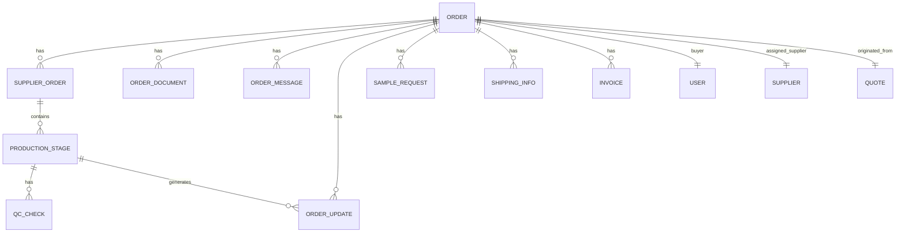
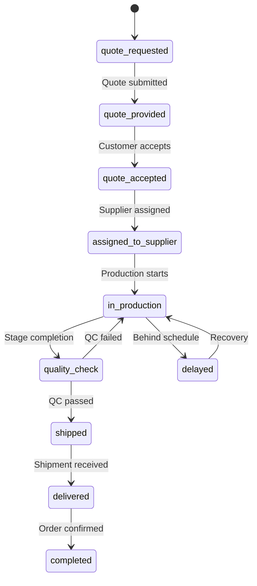
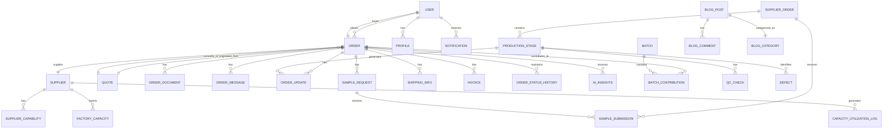

# Order and Production Tracking Schema

<cite>
**Referenced Files in This Document**   
- [database.ts](file://src/types/database.ts)
- [order.ts](file://src/types/order.ts)
- [ProductionStageTimeline.tsx](file://src/components/production/ProductionStageTimeline.tsx)
- [ProductionStageManager.tsx](file://src/components/supplier/ProductionStageManager.tsx)
- [production_stages.sql](file://supabase/migrations/20251116162906_3f25464d-5887-4c7d-8b37-5b07b75794a6.sql)
- [README.md](file://README.md)
- [ProductionTracking.tsx](file://src/pages/ProductionTracking.tsx)
</cite>

## Table of Contents
1. [Introduction](#introduction)
2. [Core Entity Relationships](#core-entity-relationships)
3. [Order Lifecycle Schema](#order-lifecycle-schema)
4. [Production Stages and Timeline](#production-stages-and-timeline)
5. [Field Definitions](#field-definitions)
6. [Foreign Key Relationships](#foreign-key-relationships)
7. [Data Integrity Constraints](#data-integrity-constraints)
8. [Schema Diagram](#schema-diagram)
9. [Data Access Patterns](#data-access-patterns)
10. [Performance Considerations](#performance-considerations)
11. [Retention Policies](#retention-policies)

## Introduction

The Order and Production Tracking System provides comprehensive visibility into the manufacturing lifecycle from order placement to final delivery. This documentation details the data model that supports real-time tracking of orders through an 8-stage production pipeline, with integrated quality checkpoints, supplier assignments, and timeline monitoring. The system enables buyers, suppliers, and administrators to monitor progress, identify potential delays, and ensure quality standards are maintained throughout the production process.

The schema is designed to support the LoopTrace™ technology platform, offering transparent and auditable tracking of garment manufacturing operations. It captures both high-level order status and granular production stage details, including estimated timelines, actual progress, quality inspection results, and photo documentation.

**Section sources**
- [README.md](file://README.md#L116-L134)

## Core Entity Relationships

The order and production tracking system is built around several core entities that represent the key components of the manufacturing process. These entities are interconnected through well-defined relationships that maintain data integrity and enable comprehensive tracking.

The primary entities include:
- **Order**: Represents a customer purchase with details about product type, quantity, pricing, and overall status
- **SupplierOrder**: Links the main order to a specific supplier responsible for production
- **ProductionStage**: Tracks progress through each of the 8 manufacturing stages
- **QualityCheck**: Documents quality inspection results at critical checkpoints
- **Supplier**: Contains information about manufacturing partners
- **User**: Represents system users (buyers, suppliers, administrators)

The relationship hierarchy flows from Order → SupplierOrder → ProductionStage, creating a clear chain of responsibility and progress tracking. Each order can have multiple quality checks, document uploads, and messaging interactions, all linked through foreign key relationships to maintain context.

**Section sources**
- [database.ts](file://src/types/database.ts#L400-L548)
- [order.ts](file://src/types/order.ts#L5-L47)

## Order Lifecycle Schema

The order lifecycle is managed through a comprehensive schema that tracks the complete journey from initial quote to final delivery. The Order entity serves as the central record, containing both business and production-related information.

Key aspects of the order lifecycle include:
- **Workflow Status**: Tracks progression through stages from quote_requested to completed
- **Production Status**: Monitors current manufacturing stage and overall progress
- **Financial Information**: Captures pricing details including buyer price, supplier cost, and margin
- **Timeline Management**: Records target dates, expected delivery, and actual delivery times
- **Assignment Tracking**: Documents when and by whom a supplier was assigned to the order

The schema supports both high-level status tracking and detailed production monitoring, allowing stakeholders to view either summary information or granular progress details as needed.

**Diagram sources**
- [database.ts](file://src/types/database.ts#L399-L548)
- [order.ts](file://src/types/order.ts#L5-L47)

**Section sources**
- [database.ts](file://src/types/database.ts#L399-L438)

## Production Stages and Timeline

The production process is divided into 8 distinct stages that represent the complete manufacturing pipeline for apparel products. Each stage is tracked individually, allowing for precise monitoring of progress and identification of bottlenecks.

The 8 production stages are:
1. **Yarn Received**: Raw materials have been received at the factory
2. **Knitting**: Fabric is being knitted according to specifications
3. **Linking**: Knit pieces are being linked together
4. **Washing & Finishing**: Garments undergo washing and finishing processes
5. **Final QC**: Comprehensive quality inspection is conducted
6. **Packing**: Approved garments are packed for shipment
7. **Ready to Ship**: Order is prepared and awaiting shipment
8. **Shipped**: Order has been dispatched to the destination

Each production stage record contains detailed information about progress, including completion percentage, start and completion timestamps, target dates, notes, and photo documentation. The system automatically updates stage status based on completion percentage (e.g., changing from pending to in_progress when progress exceeds 0%, and to completed when reaching 100%).

**Section sources**
- [ProductionStageTimeline.tsx](file://src/components/production/ProductionStageTimeline.tsx#L6-L15)
- [ProductionStageManager.tsx](file://src/components/supplier/ProductionStageManager.tsx#L23-L32)
- [README.md](file://README.md#L120-L133)

## Field Definitions

### Order Status Fields
- **status**: Current state of the order (pending, confirmed, in_production, completed, cancelled)
- **workflow_status**: Progress through the order lifecycle (quote_requested, quote_provided, quote_accepted, assigned_to_supplier, in_production, quality_check, shipped, delivered, completed)
- **production_status**: Overall production state (not_started, in_progress, delayed, completed)
- **current_stage**: The current production stage being worked on

### Timeline Fields
- **target_date**: Expected completion date for the order or specific stage
- **expected_delivery_date**: Anticipated delivery date to the customer
- **actual_delivery_date**: Date when the order was actually delivered
- **started_at**: Timestamp when production on a stage began
- **completed_at**: Timestamp when a stage was completed
- **completion_percentage**: Numeric value (0-100) representing progress through a stage

### Quality Checkpoint Fields
- **pass_fail**: Result of quality inspection (pass, fail, pending)
- **aql_level**: Acceptable Quality Level standard used for inspection
- **sample_size**: Number of items inspected
- **defects_found**: Count of defects identified during inspection
- **notes**: Detailed observations from the quality inspector
- **photos**: Array of URLs pointing to photo documentation

### Photo Documentation References
- **photos**: Array of strings containing URLs to uploaded images
- **file_url**: Reference to document or image storage
- **attachments**: Array of file URLs associated with messages or updates

**Section sources**
- [database.ts](file://src/types/database.ts#L19-L26)
- [order.ts](file://src/types/order.ts#L8-L23)
- [ProductionStageTimeline.tsx](file://src/components/production/ProductionStageTimeline.tsx#L10-L14)

## Foreign Key Relationships

The schema implements a robust system of foreign key relationships to maintain referential integrity and enable efficient data retrieval across related entities.

Key foreign key relationships include:
- **Order → User (buyer_id)**: Links each order to the customer who placed it
- **Order → Supplier (supplier_id)**: Associates the order with the manufacturing partner
- **Order → Quote (quote_id)**: Connects the order to its originating quote
- **SupplierOrder → Order (buyer_order_id)**: Creates the link between the main order and supplier-specific order
- **ProductionStage → SupplierOrder (supplier_order_id)**: Associates production stages with the specific supplier order
- **QC Check → Order (order_id)**: Links quality inspections to the relevant order
- **OrderDocument → Order (order_id)**: Associates uploaded documents with their parent order
- **OrderMessage → Order (order_id)**: Connects communication messages to the relevant order

These relationships enable the system to maintain context across the entire production lifecycle, ensuring that all activities are properly attributed and can be traced back to their source.

**Section sources**
- [database.ts](file://src/types/database.ts#L403-L405)
- [database.ts](file://src/types/database.ts#L538-L547)
- [database.ts](file://src/types/database.ts#L12-L26)

## Data Integrity Constraints

The system implements several constraints to ensure data integrity and enforce business rules throughout the production tracking process.

Key constraints include:
- **Stage Progression Logic**: Production stages must be completed in sequence, with validation preventing skipping of stages
- **Status Transitions**: Workflow status changes follow a predefined path, preventing invalid state transitions
- **Timestamp Validation**: System validates that started_at timestamps precede completed_at timestamps
- **Completion Percentage Bounds**: Progress values are constrained to the 0-100 range
- **Required Field Enforcement**: Critical fields like order_number, product_type, and quantity cannot be null
- **Unique Constraints**: Order numbers must be unique across the system

Additionally, the system includes automated business logic through database functions and triggers:
- **Auto-timestamping**: The update_production_stage_status function automatically sets started_at when progress moves from 0% to >0%, and sets completed_at when progress reaches 100%
- **Status Automation**: Stage status is automatically updated based on completion percentage (pending → in_progress → completed)
- **Access Control**: Row-level security policies restrict data access to authorized participants only

**Diagram sources**
- [production_stages.sql](file://supabase/migrations/20251116162906_3f25464d-5887-4c7d-8b37-5b07b75794a6.sql#L51-L73)
- [database.ts](file://src/types/database.ts#L8-L17)

**Section sources**
- [production_stages.sql](file://supabase/migrations/20251116162906_3f25464d-5887-4c7d-8b37-5b07b75794a6.sql#L51-L73)
- [database.ts](file://src/types/database.ts#L8-L17)

## Schema Diagram

The following entity relationship diagram illustrates the complete structure of the order and production tracking system, showing all key entities and their relationships.

**Diagram sources**
- [database.ts](file://src/types/database.ts#L33-L579)
- [production_stages.sql](file://supabase/migrations/20251116162906_3f25464d-5887-4c7d-8b37-5b07b75794a6.sql#L9-L15)

## Data Access Patterns

The system supports several key data access patterns optimized for real-time tracking and operational efficiency:

### Real-time Tracking
- **WebSocket Subscriptions**: The ProductionTracking page establishes real-time subscriptions to production stage changes, enabling instant updates without page refresh
- **Order Filtering**: Users can filter orders by status, search by order number, and sort by date for efficient navigation
- **Stage Progress Monitoring**: The ProductionStageTimeline component provides a visual representation of progress through all stages

### Batch Operations
- **Bulk Status Updates**: Administrative interfaces allow for batch updates to order statuses
- **Mass Document Uploads**: Suppliers can upload multiple photos and documents related to production stages
- **Template-based Stage Creation**: Default production stages are automatically created when a supplier is assigned to an order

### Reporting and Analytics
- **Aggregated Metrics**: The system calculates and displays key metrics such as total orders, in-progress count, completed count, and delayed orders
- **Historical Tracking**: OrderStatusHistory maintains a complete audit trail of all status changes
- **Performance Monitoring**: CapacityUtilizationLog and FactoryCapacity tables track supplier performance over time

**Section sources**
- [ProductionTracking.tsx](file://src/pages/ProductionTracking.tsx#L65-L90)
- [ProductionTracking.tsx](file://src/pages/ProductionTracking.tsx#L326-L380)

## Performance Considerations

The system has been optimized for efficient timeline queries and real-time tracking operations:

### Query Optimization
- **Indexed Fields**: Key fields used in filtering and sorting (order_number, status, created_at, supplier_id) are indexed for fast retrieval
- **Pre-joined Queries**: Frequently accessed related data (supplier name, production stages) is retrieved in single queries using table joins
- **Pagination**: Large result sets are paginated to maintain responsive performance

### Timeline Query Performance
- **Materialized Views**: Critical timeline data is pre-aggregated in materialized views for rapid access
- **Caching Strategy**: Frequently accessed order and production data is cached at multiple levels (browser, edge, database)
- **Incremental Updates**: The system uses real-time subscriptions to push only changed data rather than re-fetching entire datasets

### Scalability Features
- **Partitioned Tables**: Large tables like order_messages are partitioned by date range for improved query performance
- **Connection Pooling**: Database connection pooling ensures efficient resource utilization under load
- **Edge Caching**: Static assets and frequently accessed data are cached at the edge for low-latency access

**Section sources**
- [ProductionTracking.tsx](file://src/pages/ProductionTracking.tsx#L146-L153)
- [ProductionTracking.tsx](file://src/pages/ProductionTracking.tsx#L65-L90)

## Retention Policies

The system implements data retention policies to balance historical record-keeping with storage efficiency:

### Completed Orders
- **Permanent Retention**: Completed orders are retained indefinitely to maintain business records and enable historical analysis
- **Archival Process**: After 2 years, completed orders are moved to cold storage while maintaining full accessibility
- **Audit Trail Preservation**: All status changes, messages, and quality checks are preserved with completed orders

### Active Orders
- **Real-time Availability**: All active orders (in progress, delayed, etc.) are maintained in primary storage for immediate access
- **Automated Backups**: Daily backups ensure data protection for all active orders

### Temporary Data
- **Session Data**: User session information is retained for 30 days
- **OTP Records**: One-time password records are automatically purged 24 hours after creation
- **Temporary Uploads**: Unassociated file uploads are cleaned after 7 days

These retention policies ensure compliance with business requirements while optimizing system performance and storage costs.

**Section sources**
- [database.ts](file://src/types/database.ts#L436-L437)
- [README.md](file://README.md#L126-L133)