# Production Stages Schema

<cite>
**Referenced Files in This Document**   
- [production_stage_templates](file://supabase/migrations/20250123000000_relax_production_stages.sql)
- [order_updates](file://src/integrations/supabase/types.ts)
- [orders](file://src/integrations/supabase/types.ts)
- [initialize-production-stages](file://supabase/functions/initialize-production-stages/index.ts)
- [ProductionStageCard](file://src/components/production/ProductionStageCard.tsx)
- [ProductionStageTimeline](file://src/components/production/ProductionStageTimeline.tsx)
- [ProductionAnalytics](file://src/components/production/ProductionAnalytics.tsx)
- [ProductionUpdatesFeed](file://src/components/ProductionUpdatesFeed.tsx)
- [useOptimisticUpdate](file://src/hooks/useOptimisticUpdate.ts)
- [update_production_stage_status](file://supabase/migrations/20251116120215_71189c74-c2d3-4f3e-a1af-87d7e6b5f8fa.sql)
</cite>

## Table of Contents
1. [Introduction](#introduction)
2. [Production Stage Pipeline](#production-stage-pipeline)
3. [Production Stage Templates](#production-stage-templates)
4. [Stage Progression Logic](#stage-progression-logic)
5. [Order Updates and Tracking](#order-updates-and-tracking)
6. [Access Control and RLS Policies](#access-control-and-rls-policies)
7. [Error Handling and Validation](#error-handling-and-validation)
8. [User Interface Components](#user-interface-components)
9. [Conclusion](#conclusion)

## Introduction

The production stages schema is a core component of the apparel manufacturing system, designed to track and manage the complete lifecycle of an order through its 11-stage manufacturing pipeline. This documentation provides a comprehensive overview of the schema architecture, stage progression logic, access control mechanisms, and user interface components that enable transparent and efficient production tracking. The system is built on a flexible template-based approach that allows for standardized workflows while accommodating different product categories and manufacturing requirements.

## Production Stage Pipeline

The apparel manufacturing process follows an 11-stage pipeline that represents the complete journey from order confirmation to final shipment. Each stage has a defined purpose, estimated duration, and specific requirements for completion tracking.


**Diagram sources**
- [production_stage_templates](file://supabase/migrations/20250123000000_relax_production_stages.sql#L13-L24)

**Section sources**
- [production_stage_templates](file://supabase/migrations/20250123000000_relax_production_stages.sql#L13-L24)

### Stage Descriptions

1. **Order Confirmation**: Initial review and confirmation of order details, specifications, and requirements (2 days estimated)
2. **Fabric & Trim Sourcing**: Procurement of all necessary materials including fabrics, buttons, zippers, and other trims (10 days estimated)
3. **Pattern & Grading**: Creation of garment patterns and size grading for different sizes (5 days estimated)
4. **Cutting**: Precision cutting of fabric according to approved patterns (3 days estimated)
5. **Printing / Embroidery**: Application of prints, logos, or embroidery as specified in the order (5 days estimated)
6. **Sewing & Assembly**: Main production phase where garments are sewn and assembled (14 days estimated)
7. **Washing & Finishing**: Garment washing, ironing, steaming, and other finishing processes (3 days estimated)
8. **Quality Control (Internal)**: Factory's internal quality inspection to identify defects (2 days estimated)
9. **Final Inspection**: Comprehensive final quality check, potentially by third-party inspectors (2 days estimated)
10. **Packaging**: Folding, tagging, and packing garments according to specifications (2 days estimated)
11. **Logistics & Shipment**: Coordination of shipping and delivery to the destination (7 days estimated)

## Production Stage Templates

The production stage templates table defines the standard sequence of stages for different product categories. This template-based approach allows for consistent workflows while accommodating variations across different types of apparel manufacturing.

### Table Structure

The `production_stage_templates` table contains the following columns:

- **product_category**: The category of product this template applies to (e.g., "Apparel")
- **stage_name**: The name of the production stage
- **stage_number**: The sequential order of the stage (1-11)
- **estimated_days**: The expected duration in days for completing this stage
- **description**: A detailed description of what occurs during this stage
- **active**: Boolean flag indicating whether this template is currently active


**Diagram sources**
- [production_stage_templates](file://supabase/migrations/20250123000000_relax_production_stages.sql#L13-L24)

**Section sources**
- [production_stage_templates](file://supabase/migrations/20250123000000_relax_production_stages.sql#L13-L24)

### Template Initialization

The system uses a serverless function to initialize production stages based on templates when a new order is created:


**Diagram sources**
- [initialize-production-stages](file://supabase/functions/initialize-production-stages/index.ts#L43-L124)

**Section sources**
- [initialize-production-stages](file://supabase/functions/initialize-production-stages/index.ts#L43-L124)

## Stage Progression Logic

The system implements automated logic to track stage progression, update timestamps, and maintain data integrity throughout the production process.

### Automated Status Updates

A PostgreSQL trigger function automatically manages stage status and timestamps based on completion percentage:

```sql
CREATE FUNCTION public.update_production_stage_status()
RETURNS trigger
LANGUAGE plpgsql
SET search_path TO 'public'
AS $function$
BEGIN
  NEW.updated_at = now();
  
  -- Auto-set started_at when first update
  IF OLD.completion_percentage = 0 AND NEW.completion_percentage > 0 AND NEW.started_at IS NULL THEN
    NEW.started_at = now();
    NEW.status = 'in_progress';
  END IF;
  
  -- Auto-set completed_at when 100%
  IF NEW.completion_percentage = 100 AND NEW.completed_at IS NULL THEN
    NEW.completed_at = now();
    NEW.status = 'completed';
  END IF;
  
  RETURN NEW;
END;
$function$;
```

This trigger ensures that:
- When completion percentage changes from 0% to any positive value, `started_at` is set to the current timestamp and status changes to "in_progress"
- When completion percentage reaches 100%, `completed_at` is set to the current timestamp and status changes to "completed"
- The `updated_at` field is automatically updated on every change


**Diagram sources**
- [update_production_stage_status](file://supabase/migrations/20251116120215_71189c74-c2d3-4f3e-a1af-87d7e6b5f8fa.sql#L52-L74)

**Section sources**
- [update_production_stage_status](file://supabase/migrations/20251116120215_71189c74-c2d3-4f3e-a1af-87d7e6b5f8fa.sql#L52-L74)

### Stage Completion Tracking

Stage completion is tracked through the `order_updates` table, which records progress updates for each order:


**Diagram sources**
- [order_updates](file://src/integrations/supabase/types.ts#L1681-L1720)
- [orders](file://src/integrations/supabase/types.ts#L1722-L1872)

**Section sources**
- [order_updates](file://src/integrations/supabase/types.ts#L1681-L1720)
- [orders](file://src/integrations/supabase/types.ts#L1722-L1872)

## Order Updates and Tracking

The system provides comprehensive tracking of production progress through order updates, enabling real-time visibility for all stakeholders.

### Order Updates Structure

The `order_updates` table captures detailed information about each progress update:

- **id**: Unique identifier for the update
- **order_id**: Reference to the associated order
- **stage**: The production stage being updated
- **completion_percentage**: The completion percentage (0-100)
- **message**: Optional message describing the update
- **photos**: Array of URLs to photo evidence
- **created_at**: Timestamp of when the update was created
- **created_by**: User ID of the person who created the update

### Real-time Updates

The frontend components implement real-time updates using Supabase's real-time subscriptions:

```mermaid
sequenceDiagram
participant Client
participant Supabase
participant Database
Client->>Supabase : Subscribe to order_updates
Supabase->>Database : Listen for INSERT on order_updates
Database->>Supabase : Notify of new update
Supabase->>Client : Push update via WebSocket
Client->>Client : Update UI with new production status
Client->>Client : Show toast notification
```



**Section sources**
- [ProductionUpdatesFeed](file://src/components/ProductionUpdatesFeed.tsx#L50-L88)

## Access Control and RLS Policies

The system implements Row Level Security (RLS) policies to ensure appropriate access control for different user roles.

### RLS Policy Configuration

```sql
-- RLS Policies for Production Stage Templates
CREATE POLICY "Anyone can view active stage templates" ON public.production_stage_templates
  FOR SELECT USING (active = true);

CREATE POLICY "Admins can manage stage templates" ON public.production_stage_templates
  FOR ALL USING (public.has_role(auth.uid(), 'admin'::public.app_role));
```

These policies establish the following access rules:

- **Buyers**: Can view their order stages and progress updates
- **Suppliers**: Can view and update assigned orders and production stages
- **Admins**: Have full access to all production data and can manage stage templates


**Diagram sources**
- [production_stage_templates](file://supabase/migrations/20250123000000_relax_production_stages.sql#L202-L206)
- [orders](file://supabase/migrations/20251120233928_2016afb8-d720-4858-9e12-7fb4ebbd5de0.sql#L150-L164)

**Section sources**
- [production_stage_templates](file://supabase/migrations/20250123000000_relax_production_stages.sql#L202-L206)
- [orders](file://supabase/migrations/20251120233928_2016afb8-d720-4858-9e12-7fb4ebbd5de0.sql#L150-L164)

## Error Handling and Validation

The system implements comprehensive error handling to ensure data integrity and provide meaningful feedback to users.

### Validation Rules

- **Completion Percentage**: Must be between 0 and 100 (inclusive)
- **Stage Transitions**: Cannot skip stages; must progress sequentially
- **Timestamp Validation**: `started_at` cannot be after `completed_at`
- **Required Fields**: Stage name, order reference, and creator must be present

### Error Handling Workflow


The frontend implements optimistic updates with rollback capability:

```typescript
try {
  // Optimistically update UI
  setOrder({ ...order, ...updates });
  setIsUpdating(true);
  
  // Attempt database update
  const { error } = await supabase
    .from('production_stages')
    .update(updates)
    .eq('id', stageId);
  
  if (error) throw error;
  
  // Success: Keep optimistic update
  toast.success('Production stage updated successfully');
} catch (error: any) {
  // Failure: Rollback to previous state
  setOrder(previousOrder);
  toast.error('Failed to update stage. Changes reverted.');
} finally {
  setIsUpdating(false);
}
```

**Section sources**
- [useOptimisticUpdate](file://src/hooks/useOptimisticUpdate.ts#L90-L116)

## User Interface Components

The system provides several React components for visualizing and interacting with production stages.

### ProductionStageCard

The `ProductionStageCard` component displays detailed information about a single production stage, allowing suppliers to update progress, add notes, and upload photo evidence.

**Section sources**
- [ProductionStageCard](file://src/components/production/ProductionStageCard.tsx#L1-L412)

### ProductionStageTimeline

The `ProductionStageTimeline` component visualizes the entire production pipeline as a vertical timeline, showing the status of each stage with appropriate icons and progress indicators.


**Section sources**
- [ProductionStageTimeline](file://src/components/production/ProductionStageTimeline.tsx#L1-L183)

### ProductionAnalytics

The `ProductionAnalytics` component calculates and displays overall production progress, estimated completion dates, and potential delays.

**Section sources**
- [ProductionAnalytics](file://src/components/production/ProductionAnalytics.tsx#L1-L46)

## Conclusion

The production stages schema provides a comprehensive framework for tracking apparel manufacturing processes from order confirmation through to final shipment. By implementing a template-based approach, the system ensures consistency across orders while allowing for customization based on product category. The integration of automated status updates, real-time notifications, and role-based access control creates a transparent and efficient production tracking system that benefits all stakeholders. The combination of database-level triggers, frontend components, and serverless functions ensures data integrity and provides a seamless user experience for monitoring production progress.

The 11-stage pipeline—Order Confirmation, Fabric & Trim Sourcing, Pattern & Grading, Cutting, Printing / Embroidery, Sewing & Assembly, Washing & Finishing, Quality Control (Internal), Final Inspection, Packaging, and Logistics & Shipment—represents industry-standard manufacturing processes with realistic time estimates. This structured approach enables accurate production forecasting, proactive delay detection, and comprehensive quality control, ultimately delivering greater transparency and reliability in the apparel manufacturing process.