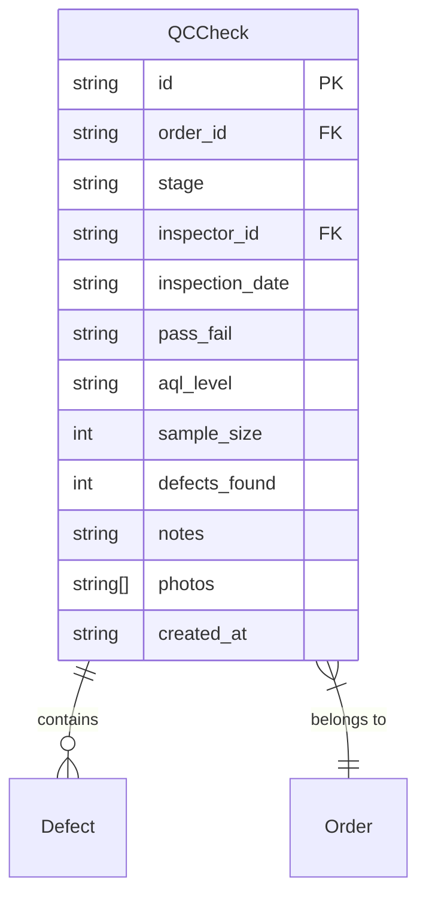
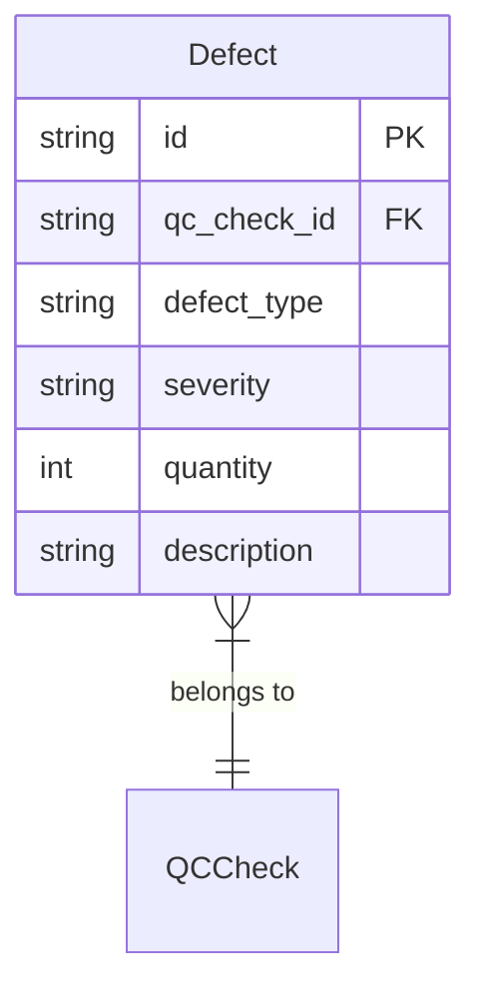
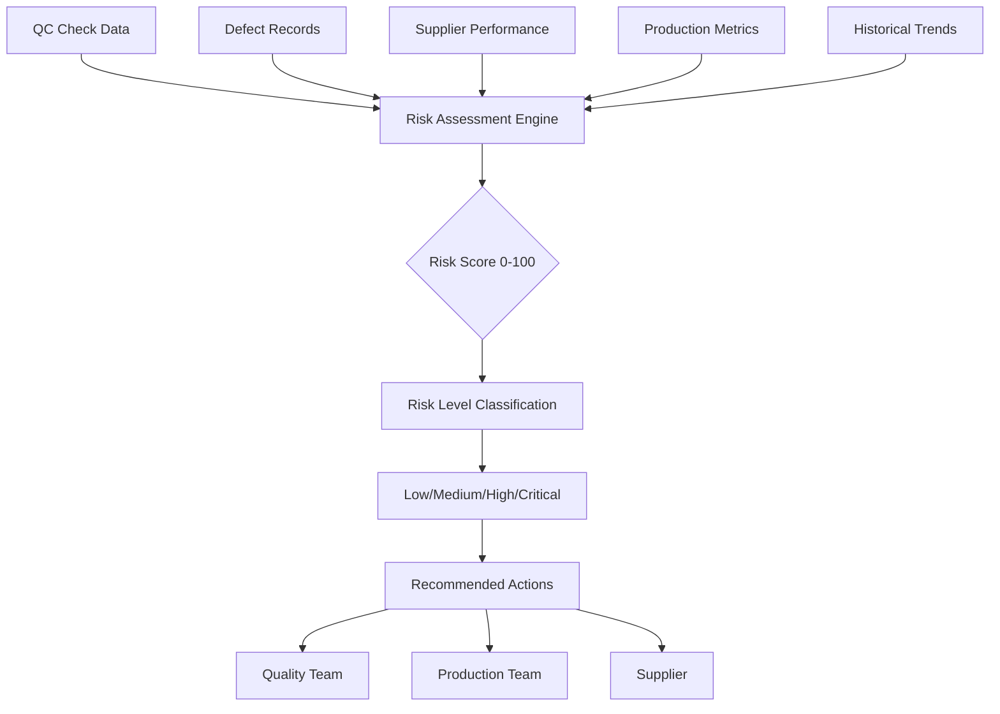

# Quality Control Schema

<cite>
**Referenced Files in This Document**   
- [QCCheckForm.tsx](file://src/components/QCCheckForm.tsx)
- [QCChecksList.tsx](file://src/components/QCChecksList.tsx)
- [QCInspectionForm.tsx](file://src/components/supplier/QCInspectionForm.tsx)
- [database.ts](file://src/types/database.ts)
- [ProductionTimeline.tsx](file://src/components/ProductionTimeline.tsx)
- [predict-quality-risks/index.ts](file://supabase/functions/predict-quality-risks/index.ts)
- [useQualityPrediction.ts](file://src/hooks/useQualityPrediction.ts)
- [QualityRiskAlert.tsx](file://src/components/production/QualityRiskAlert.tsx)
- [SupplierCoordinationPanel.tsx](file://src/components/production/SupplierCoordinationPanel.tsx)
- [remix_migration_from_pg_dump.sql](file://supabase/migrations/20251115150759_remix_migration_from_pg_dump.sql)
</cite>

## Table of Contents
1. [Introduction](#introduction)
2. [QCCheck Entity Structure](#qccheck-entity-structure)
3. [Defect Entity Model](#defect-entity-model)
4. [Production Stage Integration](#production-stage-integration)
5. [Data Validation and Business Logic](#data-validation-and-business-logic)
6. [Quality Risk Assessment System](#quality-risk-assessment-system)
7. [Access Control and RLS Policies](#access-control-and-rls-policies)
8. [QC Inspection Workflows](#qc-inspection-workflows)
9. [Supplier Coordination Integration](#supplier-coordination-integration)
10. [Conclusion](#conclusion)

## Introduction
The Quality Control (QC) data model is a comprehensive system designed to ensure product quality throughout the manufacturing process. This documentation details the schema, relationships, and business logic governing quality inspections, defect tracking, and risk assessment. The system supports stage-specific inspections with AQL standards, detailed defect documentation, and AI-powered risk prediction to maintain high-quality standards across production batches.

**Section sources**
- [QCCheckForm.tsx](file://src/components/QCCheckForm.tsx#L1-L257)
- [QCChecksList.tsx](file://src/components/QCChecksList.tsx#L1-L205)

## QCCheck Entity Structure
The QCCheck entity serves as the primary record for quality control inspections, capturing comprehensive data about each inspection event. Each QC check is associated with a specific production order and stage, with detailed metrics on inspection results.

Key attributes of the QCCheck entity include:
- **order_id**: Reference to the associated production order
- **stage**: Production stage at which inspection occurs (e.g., knitting, final_qc)
- **inspector_id**: ID of the user conducting the inspection
- **total_pieces_checked**: Total number of items inspected
- **passed_pieces**: Number of items passing quality standards
- **failed_pieces**: Number of items failing quality standards
- **pass_fail**: Overall result of the inspection (pass/fail)
- **aql_level**: Acceptable Quality Level standard applied (e.g., AQL 2.5)
- **sample_size**: Number of items sampled for inspection
- **defects_found**: Count of defects identified during inspection
- **notes**: Detailed observations and comments from the inspector
- **photos**: Array of image URLs documenting the inspection
- **inspection_date**: Timestamp of when the inspection was conducted

The entity supports photo documentation of quality issues and maintains a complete audit trail of all inspection activities. The system calculates pass rates automatically based on passed and total pieces checked, providing immediate feedback on quality performance.



**Diagram sources**
- [database.ts](file://src/types/database.ts#L470-L483)
- [QCCheckForm.tsx](file://src/components/QCCheckForm.tsx#L70-L77)

**Section sources**
- [database.ts](file://src/types/database.ts#L470-L483)
- [QCCheckForm.tsx](file://src/components/QCCheckForm.tsx#L36-L115)

## Defect Entity Model
The Defect entity captures specific quality issues identified during inspections, providing granular detail on the nature and severity of each defect. This entity enables detailed analysis of quality problems and supports root cause analysis.

Key attributes of the Defect entity include:
- **qc_check_id**: Reference to the parent QC check
- **defect_type**: Classification of the defect (e.g., Hole, Stain, Misalignment)
- **severity**: Severity level (minor, major, critical)
- **quantity**: Number of items affected by this specific defect
- **description**: Detailed description of the defect and its characteristics

The severity levels are defined as:
- **Minor**: Cosmetic issues that don't affect functionality
- **Major**: Functional issues that impact product performance
- **Critical**: Safety or regulatory issues that make the product unsellable

The system allows multiple defects to be recorded within a single QC check, enabling comprehensive documentation of all quality issues found during an inspection. Defect quantities are aggregated to calculate overall defect rates and quality metrics.



**Diagram sources**
- [QCCheckForm.tsx](file://src/components/QCCheckForm.tsx#L13-L18)
- [QCChecksList.tsx](file://src/components/QCChecksList.tsx#L70-L74)

**Section sources**
- [QCCheckForm.tsx](file://src/components/QCCheckForm.tsx#L13-L18)
- [QCChecksList.tsx](file://src/components/QCChecksList.tsx#L181-L205)

## Production Stage Integration
The quality control system is tightly integrated with the production workflow, with inspections occurring at specific stages of the manufacturing process. The system supports stage-specific inspections for key production phases including 'Quality Control (Internal)' and 'Final Inspection'.

Supported production stages include:
- **yarn_received**: Initial material inspection
- **knitting**: Knitting process quality check
- **linking**: Assembly and linking inspection
- **washing_finishing**: Post-processing quality assessment
- **final_qc**: Final quality control before packing
- **packing**: Packaging quality verification
- **ready_to_ship**: Pre-shipment final check

The system enforces stage-specific inspection protocols, with different AQL levels and sample sizes potentially applied at different stages. Final inspection typically employs stricter standards (e.g., AQL 2.5) compared to in-process checks. The integration ensures that quality checks are performed at appropriate points in the production timeline, preventing defective products from progressing to subsequent stages.

```mermaid
graph TD
A[Yarn Received] --> B[Knitting]
B --> C[Linking]
C --> D[Washing & Finishing]
D --> E[Final QC]
E --> F[Packing]
F --> G[Ready to Ship]
E --> H[Quality Control (Internal)]
E --> I[Final Inspection]
style E fill:#f9f,stroke:#333
style H fill:#ff9,stroke:#333
style I fill:#f99,stroke:#333
```

**Diagram sources**
- [ProductionTimeline.tsx](file://src/components/ProductionTimeline.tsx#L5-L31)
- [database.ts](file://src/types/database.ts#L19-L26)

**Section sources**
- [ProductionTimeline.tsx](file://src/components/ProductionTimeline.tsx#L5-L31)
- [QCCheckForm.tsx](file://src/components/QCCheckForm.tsx#L25-L33)

## Data Validation and Business Logic
The quality control system implements comprehensive data validation rules and business logic to ensure data integrity and enforce quality standards. These rules govern data entry, calculation of quality metrics, and enforcement of inspection protocols.

Key validation rules include:
- Required fields: stage, total_pieces_checked, passed_pieces, failed_pieces
- Numeric constraints: all piece counts must be non-negative integers
- Arithmetic validation: passed_pieces + failed_pieces must equal total_pieces_checked
- Date validation: inspection_date cannot be in the future
- Mandatory defect documentation for failed inspections

Business logic automatically calculates:
- Pass rate percentage based on passed and total pieces
- Defect density (defects per hundred pieces)
- Quality risk scores based on defect types and severity
- AQL compliance status based on sample size and defect counts

The system also validates that inspectors are authorized for the production facility and that QC checks follow the proper sequence in the production timeline.

**Section sources**
- [QCCheckForm.tsx](file://src/components/QCCheckForm.tsx#L153-L176)
- [QCChecksList.tsx](file://src/components/QCChecksList.tsx#L90-L93)

## Quality Risk Assessment System
The quality control system incorporates an advanced risk assessment engine that automatically evaluates quality risks based on inspection data, supplier performance, and production factors. This system leverages AI to predict potential quality issues and recommend preventive actions.

The risk assessment process:
1. Collects data from QC checks, defect records, and supplier performance metrics
2. Analyzes historical quality trends and defect patterns
3. Evaluates supplier quality ratings and on-time delivery performance
4. Assesses production complexity and material factors
5. Generates a risk score (0-100) and risk level classification

Risk levels are categorized as:
- **Low**: Minimal risk, standard monitoring sufficient
- **Medium**: Moderate risk, increased inspection frequency recommended
- **High**: Significant risk, enhanced QC protocols required
- **Critical**: Severe risk, production halt may be necessary

The system provides specific recommendations for mitigating identified risks, such as increasing sample sizes, adding inspection stages, or conducting root cause analysis.



**Diagram sources**
- [useQualityPrediction.ts](file://src/hooks/useQualityPrediction.ts#L5-L10)
- [predict-quality-risks/index.ts](file://supabase/functions/predict-quality-risks/index.ts#L83-L85)

**Section sources**
- [useQualityPrediction.ts](file://src/hooks/useQualityPrediction.ts#L1-L56)
- [QualityRiskAlert.tsx](file://src/components/production/QualityRiskAlert.tsx#L1-L113)

## Access Control and RLS Policies
The quality control system implements robust Row Level Security (RLS) policies to govern access to QC data, ensuring that users can only access information appropriate to their role and responsibilities.

Key RLS policies include:
- **Factories can view assigned orders**: Factory users can only access orders assigned to their facility
- **Factories can view their QC checks**: Factory users can view QC checks for orders at their facility
- **Factory users can create QC checks for their orders**: Factories can only create QC checks for their assigned orders
- **Factories can view defects for their QC checks**: Access to defect data is restricted to the inspecting facility

These policies ensure data confidentiality and prevent unauthorized access to quality information. The system also maintains an audit trail of all QC activities, with each check linked to the inspector's user ID and timestamped for accountability.

```sql
-- RLS policies for QC data access
CREATE POLICY "Factories can view their QC checks" ON public.qc_checks FOR SELECT 
USING ((EXISTS (SELECT 1 FROM public.orders WHERE ((orders.id = qc_checks.order_id) AND (orders.factory_id = auth.uid())))));

CREATE POLICY "Factory users can create QC checks for their orders" ON public.qc_checks FOR INSERT TO authenticated 
WITH CHECK (((inspector_id = auth.uid()) AND (EXISTS (SELECT 1 FROM public.orders WHERE ((orders.id = qc_checks.order_id) AND (orders.factory_id = auth.uid()))))));

CREATE POLICY "Factories can view defects for their QC checks" ON public.defects FOR SELECT 
USING ((EXISTS (SELECT 1 FROM public.qc_checks WHERE ((qc_checks.id = defects.qc_check_id) AND (qc_checks.inspector_id = auth.uid())))));
```

**Diagram sources**
- [remix_migration_from_pg_dump.sql](file://supabase/migrations/20251115150759_remix_migration_from_pg_dump.sql#L4111-L4132)

**Section sources**
- [remix_migration_from_pg_dump.sql](file://supabase/migrations/20251115150759_remix_migration_from_pg_dump.sql#L4111-L4132)

## QC Inspection Workflows
The quality control system supports standardized inspection workflows that guide users through the inspection process, ensuring consistency and completeness. These workflows are implemented through dedicated UI components that streamline data entry and documentation.

Typical QC inspection workflow:
1. Select production order and inspection stage
2. Enter inspection parameters (total pieces, AQL level, sample size)
3. Record pass/fail results for inspected items
4. Document any defects with type, severity, quantity, and description
5. Upload photographic evidence of quality issues
6. Add inspector notes and recommendations
7. Submit QC check for approval and record-keeping

The system validates all required information before submission and automatically calculates quality metrics. For failed inspections, the workflow prompts for root cause analysis and corrective action plans. The interface provides visual indicators of inspection status and quality trends over time.

**Section sources**
- [QCCheckForm.tsx](file://src/components/QCCheckForm.tsx#L35-L115)
- [QCInspectionForm.tsx](file://src/components/supplier/QCInspectionForm.tsx#L17-L84)

## Supplier Coordination Integration
The quality control system integrates with the supplier coordination panel, enabling seamless communication and collaboration between buyers, suppliers, and quality teams. This integration ensures that quality issues are promptly communicated and addressed.

Key integration features:
- Real-time visibility of QC results for suppliers
- Automated alerts for failed inspections or high-risk findings
- Direct messaging capabilities for quality issue resolution
- Shared documentation of corrective actions and improvements
- Historical quality performance tracking for supplier evaluation

The supplier coordination panel displays QC check results, defect analyses, and risk assessments, allowing suppliers to monitor their quality performance and address issues proactively. This transparency fosters accountability and continuous improvement in quality standards.

**Section sources**
- [SupplierCoordinationPanel.tsx](file://src/components/production/SupplierCoordinationPanel.tsx)
- [OrderDetails.tsx](file://src/pages/OrderDetails.tsx#L120-L130)

## Conclusion
The quality control data model provides a comprehensive framework for managing product quality throughout the manufacturing process. By integrating stage-specific inspections, detailed defect tracking, automated risk assessment, and robust access controls, the system ensures consistent quality standards and facilitates continuous improvement. The model supports both operational quality management and strategic quality planning, providing valuable insights for process optimization and supplier development.