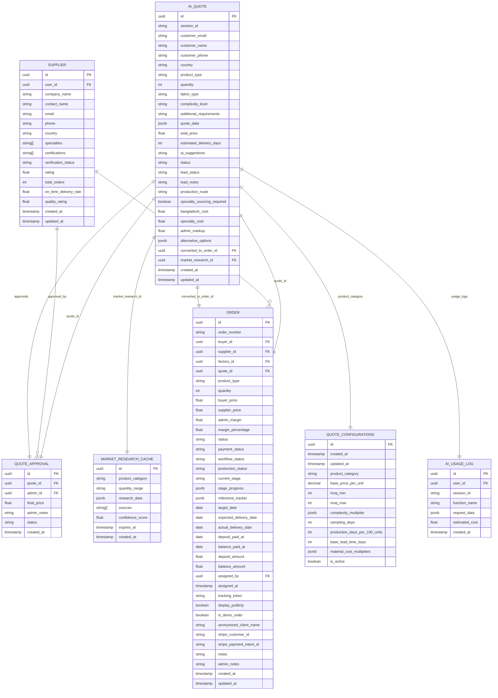

# Quote Management Schema

<cite>
**Referenced Files in This Document**
- [src/types/database.ts](file://src/types/database.ts)
- [src/lib/api/aiQuote.ts](file://src/lib/api/aiQuote.ts)
- [src/hooks/useQuotes.ts](file://src/hooks/useQuotes.ts)
- [supabase/functions/ai-quote-generator/index.ts](file://supabase/functions/ai-quote-generator/index.ts)
- [supabase/functions/ai-market-research/index.ts](file://supabase/functions/ai-market-research/index.ts)
- [supabase/functions/convert-quote-to-order/index.ts](file://supabase/functions/convert-quote-to-order/index.ts)
- [supabase/functions/ai-conversational-quote/index.ts](file://supabase/functions/ai-conversational-quote/index.ts)
- [supabase/migrations/20251115150759_remix_migration_from_pg_dump.sql](file://supabase/migrations/20251115150759_remix_migration_from_pg_dump.sql)
- [supabase/migrations/add_supplier_to_quotes.sql](file://supabase/migrations/add_supplier_to_quotes.sql)
- [supabase/migrations/20251124164837_4eda3cf0-ab6f-4305-a5fe-82a19c7948d3.sql](file://supabase/migrations/20251124164837_4eda3cf0-ab6f-4305-a5fe-82a19c7948d3.sql)
- [src/components/admin/QuoteApprovalPanel.tsx](file://src/components/admin/QuoteApprovalPanel.tsx)
- [src/components/admin/SmartSupplierAssignment.tsx](file://src/components/admin/SmartSupplierAssignment.tsx)
- [src/components/admin/SupplierMatchingSystem.tsx](file://src/components/admin/SupplierMatchingSystem.tsx)
- [src/components/quote/ConversationalQuoteBuilder.tsx](file://src/components/quote/ConversationalQuoteBuilder.tsx)
- [src/components/buyer/QuotesManagementSection.tsx](file://src/components/buyer/QuotesManagementSection.tsx)
- [src/pages/AdminLeads.tsx](file://src/pages/AdminLeads.tsx)
- [src/lib/bangladeshManufacturing.ts](file://src/lib/bangladeshManufacturing.ts)
</cite>

## Table of Contents
1. [Introduction](#introduction)
2. [Core Entity Relationships](#core-entity-relationships)
3. [AI Quote Generation System](#ai-quote-generation-system)
4. [Quote Lifecycle Management](#quote-lifecycle-management)
5. [Market Research Integration](#market-research-integration)
6. [Supplier Assignment System](#supplier-assignment-system)
7. [Data Validation and Constraints](#data-validation-and-constraints)
8. [Performance Considerations](#performance-considerations)
9. [Schema Diagram](#schema-diagram)
10. [Conclusion](#conclusion)

## Introduction

The Sleek Apparels AI-powered quote generation system is a sophisticated enterprise solution that transforms raw customer requirements into comprehensive manufacturing quotes. This system integrates artificial intelligence, market research, supplier matching, and automated workflows to deliver accurate pricing and delivery estimates within minutes.

The system operates on a multi-entity architecture where quotes serve as the central hub connecting buyers, suppliers, market research data, and final orders. Each component maintains strict data integrity while enabling real-time collaboration across global supply chain networks.

## Core Entity Relationships

### Primary Entities

The quote management system revolves around several key entities that maintain complex relationships:

```mermaid
erDiagram
AI_QUOTE {
uuid id PK
string session_id
string customer_email
string customer_name
string product_type
int quantity
float total_price
int estimated_delivery_days
jsonb quote_data
string status
string lead_status
uuid converted_to_order_id FK
timestamp created_at
timestamp updated_at
}
SUPPLIER {
uuid id PK
uuid user_id FK
string company_name
string contact_name
string email
string phone
string country
string[] specialties
string verification_status
float rating
int total_orders
float on_time_delivery_rate
float quality_rating
timestamp created_at
timestamp updated_at
}
ORDER {
uuid id PK
string order_number
uuid buyer_id FK
uuid supplier_id FK
uuid quote_id FK
string product_type
int quantity
float buyer_price
float supplier_price
float admin_margin
string status
string workflow_status
date target_date
date expected_delivery_date
date actual_delivery_date
boolean display_publicly
timestamp created_at
timestamp updated_at
}
MARKET_RESEARCH_CACHE {
uuid id PK
string product_category
string quantity_range
jsonb research_data
string[] sources
float confidence_score
timestamp expires_at
timestamp created_at
}
QUOTE_APPROVAL {
uuid id PK
uuid quote_id FK
uuid admin_id FK
float final_price
string admin_notes
string status
timestamp created_at
}
AI_USAGE_LOG {
uuid id PK
uuid user_id FK
string session_id
string function_name
jsonb request_data
float estimated_cost
timestamp created_at
}
AI_QUOTE --> ORDER : "converted_to_order_id"
AI_QUOTE --> MARKET_RESEARCH_CACHE : "market_research_id"
AI_QUOTE --> QUOTE_APPROVAL : "quote_approvals"
AI_QUOTE --> AI_USAGE_LOG : "usage_logs"
SUPPLIER --> ORDER : "supplier_id"
```

**Diagram sources**
- [src/types/database.ts](file://src/types/database.ts#L45-L72)
- [src/types/database.ts](file://src/types/database.ts#L520-L548)
- [src/types/database.ts](file://src/types/database.ts#L399-L438)
- [supabase/migrations/20251124164837_4eda3cf0-ab6f-4305-a5fe-82a19c7948d3.sql](file://supabase/migrations/20251124164837_4eda3cf0-ab6f-4305-a5fe-82a19c7948d3.sql#L1-L34)

### Foreign Key Constraints

The system enforces strict referential integrity through comprehensive foreign key constraints:

| Constraint | Source Table | Target Table | Column | Description |
|------------|--------------|--------------|--------|-------------|
| `ai_quotes_buyer_id_fkey` | ai_quotes | profiles | buyer_id | Links quotes to buyer profiles |
| `ai_quotes_converted_to_order_id_fkey` | ai_quotes | orders | converted_to_order_id | Tracks quote-to-order conversion |
| `market_research_cache_product_category_fkey` | market_research_cache | quote_configurations | product_category | Associates research with configurations |
| `quote_approvals_quote_id_fkey` | quote_approvals | ai_quotes | quote_id | Links approvals to quotes |
| `orders_supplier_id_fkey` | orders | suppliers | supplier_id | Connects orders to suppliers |
| `orders_quote_id_fkey` | orders | ai_quotes | quote_id | Links orders to original quotes |

**Section sources**
- [src/types/database.ts](file://src/types/database.ts#L45-L72)
- [src/types/database.ts](file://src/types/database.ts#L520-L548)
- [src/types/database.ts](file://src/types/database.ts#L399-L438)

## AI Quote Generation System

### Quote Configuration Schema

The system uses predefined configurations to ensure pricing consistency across similar product types:


**Diagram sources**
- [supabase/migrations/20251115150759_remix_migration_from_pg_dump.sql](file://supabase/migrations/20251115150759_remix_migration_from_pg_dump.sql#L1479-L1493)

### AI Quote Parameters

The AI quote generation system processes comprehensive input parameters to produce accurate estimates:

| Parameter | Type | Description | Validation Rules |
|-----------|------|-------------|------------------|
| `product_type` | string | Product category (t-shirts, hoodies, etc.) | Required, normalized to lowercase |
| `quantity` | integer | Order quantity | Min: 1, Max: 10,000,000 |
| `complexity_level` | enum | 'simple', 'medium', 'complex' | Optional, affects pricing multiplier |
| `fabric_type` | string | Material specification | Optional, influences cost calculations |
| `additional_requirements` | text | Custom specifications | Optional, parsed for customizations |
| `customer_email` | string | Contact email | Required, validated format |
| `target_date` | date | Desired delivery date | Optional, affects timeline calculations |

### Pricing Calculation Engine

The system employs sophisticated pricing algorithms that incorporate multiple factors:


**Diagram sources**
- [src/lib/bangladeshManufacturing.ts](file://src/lib/bangladeshManufacturing.ts#L133-L288)
- [supabase/functions/ai-quote-generator/index.ts](file://supabase/functions/ai-quote-generator/index.ts#L375-L408)

**Section sources**
- [src/lib/api/aiQuote.ts](file://src/lib/api/aiQuote.ts#L9-L26)
- [src/lib/bangladeshManufacturing.ts](file://src/lib/bangladeshManufacturing.ts#L133-L288)

## Quote Lifecycle Management

### Status Workflow

The quote lifecycle follows a structured workflow with multiple status transitions:


### Quote Approval Process

The approval system includes comprehensive validation and administrative controls:


**Diagram sources**
- [src/components/admin/QuoteApprovalPanel.tsx](file://src/components/admin/QuoteApprovalPanel.tsx#L62-L114)
- [supabase/functions/convert-quote-to-order/index.ts](file://supabase/functions/convert-quote-to-order/index.ts#L144-L150)

**Section sources**
- [src/components/admin/QuoteApprovalPanel.tsx](file://src/components/admin/QuoteApprovalPanel.tsx#L1-L298)
- [src/pages/AdminLeads.tsx](file://src/pages/AdminLeads.tsx#L24-L69)

## Market Research Integration

### Research Cache System

The market research system implements intelligent caching to optimize performance:


**Diagram sources**
- [supabase/migrations/20251124164837_4eda3cf0-ab6f-4305-a5fe-82a19c7948d3.sql](file://supabase/migrations/20251124164837_4eda3cf0-ab6f-4305-a5fe-82a19c7948d3.sql#L1-L34)

### Research Data Structure

Market research data includes comprehensive pricing benchmarks and supplier comparisons:

| Field | Type | Description | Example Values |
|-------|------|-------------|----------------|
| `average_unit_cost` | float | Industry average per unit | 8.50, 12.75, 15.20 |
| `material_cost_per_unit` | float | Raw material costs | 3.20, 4.80, 6.10 |
| `lead_time_days` | integer | Standard delivery timeline | 30, 45, 60 |
| `markup_percentage` | float | Typical profit margin | 20.0, 25.0, 30.0 |
| `comparable_products` | array | Competitor offerings | [{name: "Product A", price: 9.50}] |
| `confidence_score` | float | Data reliability (0-100) | 75.0, 82.5, 90.0 |

**Section sources**
- [supabase/functions/ai-market-research/index.ts](file://supabase/functions/ai-market-research/index.ts#L259-L334)
- [supabase/migrations/20251124164837_4eda3cf0-ab6f-4305-a5fe-82a19c7948d3.sql](file://supabase/migrations/20251124164837_4eda3cf0-ab6f-4305-a5fe-82a19c7948d3.sql#L1-L34)

## Supplier Assignment System

### Smart Matching Algorithm

The supplier assignment system uses sophisticated matching criteria to find optimal partners:


**Diagram sources**
- [src/components/admin/SupplierMatchingSystem.tsx](file://src/components/admin/SupplierMatchingSystem.tsx#L199-L242)
- [src/components/admin/SmartSupplierAssignment.tsx](file://src/components/admin/SmartSupplierAssignment.tsx#L1-L39)

### Supplier Evaluation Metrics

The system evaluates suppliers across multiple dimensions:

| Metric | Weight | Description | Scoring Range |
|--------|--------|-------------|---------------|
| Specialization Match | 40% | Product category alignment | 0-40 points |
| Capacity Availability | 25% | Current workload vs. capacity | 0-25 points |
| Supplier Rating | 20% | Historical performance score | 0-20 points |
| On-Time Delivery | 15% | Past delivery performance | 0-15 points |

**Section sources**
- [src/components/admin/SupplierMatchingSystem.tsx](file://src/components/admin/SupplierMatchingSystem.tsx#L199-L242)
- [src/components/admin/SmartSupplierAssignment.tsx](file://src/components/admin/SmartSupplierAssignment.tsx#L1-L39)

## Data Validation and Constraints

### Input Validation Rules

The system implements comprehensive validation at multiple levels:


### Data Integrity Constraints

| Constraint Type | Implementation | Purpose |
|----------------|----------------|---------|
| Email Validation | Regex pattern | Ensures valid email format |
| Quantity Limits | Check constraint | Prevents unrealistic quantities |
| Price Bounds | Numeric precision | Maintains pricing accuracy |
| Status Enum | Domain restriction | Enforces valid status values |
| Session Tracking | UUID uniqueness | Prevents duplicate requests |

**Section sources**
- [supabase/migrations/20251115150759_remix_migration_from_pg_dump.sql](file://supabase/migrations/20251115150759_remix_migration_from_pg_dump.sql#L1515-L1517)
- [src/lib/api/aiQuote.ts](file://src/lib/api/aiQuote.ts#L57-L146)

## Performance Considerations

### Query Optimization Strategies

The system employs several optimization techniques for efficient data retrieval:


### Performance Metrics

| Operation | Expected Latency | Optimization Technique |
|-----------|------------------|------------------------|
| Quote Generation | 30-60 seconds | Async processing, caching |
| Market Research | 5-10 seconds | 24-hour cache TTL |
| Supplier Matching | 2-5 seconds | Pre-computed scores |
| Quote Approval | 500ms | Optimized database queries |
| Order Conversion | 2-3 seconds | Transaction batching |

### Scalability Features

The system incorporates several scalability enhancements:

- **Asynchronous Processing**: AI quote generation runs asynchronously to prevent timeouts
- **Intelligent Caching**: Market research data cached for 24 hours reduces API calls
- **Database Indexing**: Strategic indexes on frequently queried columns
- **Connection Pooling**: Optimized database connections for concurrent users
- **Rate Limiting**: IP and email-based rate limiting prevents abuse

**Section sources**
- [src/lib/api/aiQuote.ts](file://src/lib/api/aiQuote.ts#L57-L146)
- [supabase/functions/ai-market-research/index.ts](file://supabase/functions/ai-market-research/index.ts#L273-L334)

## Schema Diagram

### Complete Entity Relationship Model



**Diagram sources**
- [src/types/database.ts](file://src/types/database.ts#L45-L72)
- [src/types/database.ts](file://src/types/database.ts#L399-L438)
- [src/types/database.ts](file://src/types/database.ts#L520-L548)
- [supabase/migrations/20251124164837_4eda3cf0-ab6f-4305-a5fe-82a19c7948d3.sql](file://supabase/migrations/20251124164837_4eda3cf0-ab6f-4305-a5fe-82a19c7948d3.sql#L1-L34)

## Conclusion

The AI-powered quote generation system represents a comprehensive solution for modern apparel manufacturing businesses. Through its sophisticated entity relationships, robust validation mechanisms, and intelligent automation features, it delivers exceptional value to both buyers and suppliers.

Key strengths of the system include:

- **Automated Accuracy**: AI-driven pricing ensures competitive, market-appropriate quotes
- **Supplier Optimization**: Intelligent matching connects buyers with ideal manufacturing partners
- **Workflow Efficiency**: Streamlined approval and conversion processes accelerate time-to-market
- **Data Integrity**: Comprehensive validation and constraint enforcement maintain system reliability
- **Performance Scaling**: Optimized queries and caching enable handling of high-volume operations

The system's modular architecture allows for future enhancements while maintaining backward compatibility and operational stability. Its integration of AI capabilities with traditional manufacturing expertise positions it as a leader in digital transformation for the apparel industry.