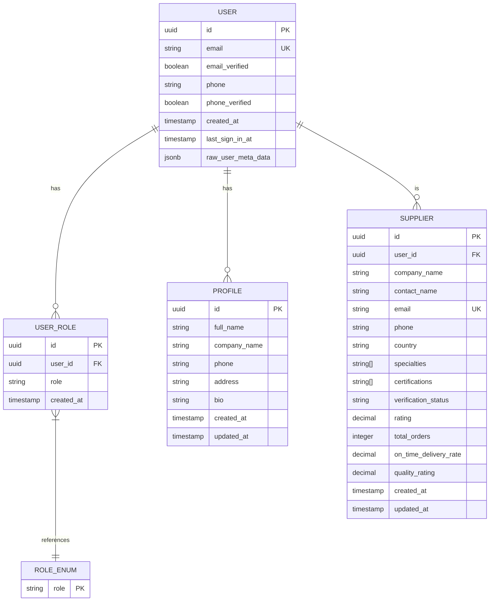
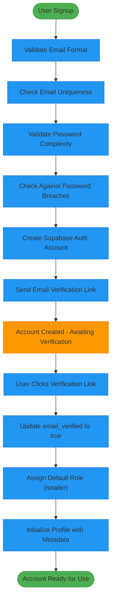
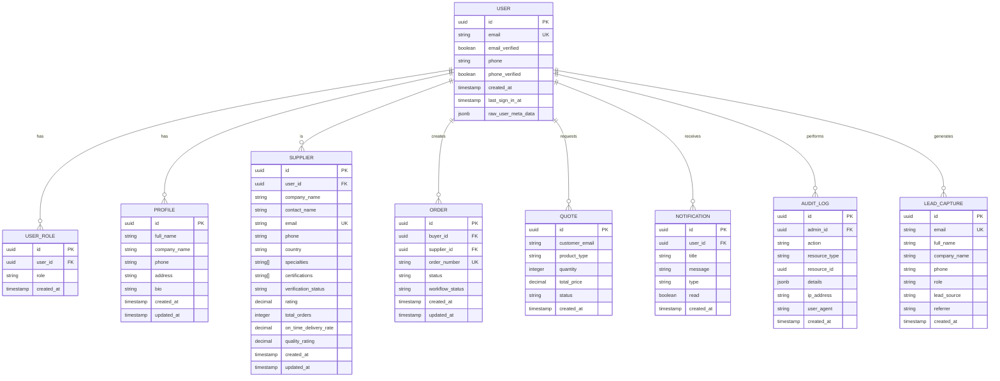

# User Management Schema

<cite>
**Referenced Files in This Document**   
- [database.ts](file://src/types/database.ts)
- [supabaseHelpers.ts](file://src/lib/supabaseHelpers.ts)
- [AuthContext.tsx](file://src/contexts/AuthContext.tsx)
- [Auth.tsx](file://src/pages/Auth.tsx)
- [UserProfile.tsx](file://src/pages/UserProfile.tsx)
- [20251115150759_remix_migration_from_pg_dump.sql](file://supabase/migrations/20251115150759_remix_migration_from_pg_dump.sql)
- [20250122000000_create_marketplace_system.sql](file://supabase/migrations/20250122000000_create_marketplace_system.sql)
- [types.ts](file://src/integrations/supabase/types.ts)
</cite>

## Table of Contents
1. [Introduction](#introduction)
2. [Core Entities](#core-entities)
3. [User Roles and Access Control](#user-roles-and-access-control)
4. [Profile Management](#profile-management)
5. [Authentication and Verification](#authentication-and-verification)
6. [Data Model Diagram](#data-model-diagram)
7. [Data Access Patterns](#data-access-patterns)
8. [Validation and Security](#validation-and-security)
9. [Integration with Other Systems](#integration-with-other-systems)
10. [Performance Considerations](#performance-considerations)

## Introduction

The User Management System is a comprehensive solution for managing user accounts, roles, profiles, and authentication metadata within the platform. This documentation provides a detailed overview of the data model, including entity relationships, field definitions, constraints, and access patterns. The system is built on Supabase with PostgreSQL as the underlying database, leveraging Row Level Security (RLS) for fine-grained access control.

The core entities include users, roles, profiles, and authentication metadata, with relationships to other business entities such as orders, quotes, and audit logs. The system supports three primary user types: buyers, suppliers, and administrators, each with distinct capabilities and access levels.

**Section sources**
- [database.ts](file://src/types/database.ts#L6-L30)
- [AuthContext.tsx](file://src/contexts/AuthContext.tsx#L5-L15)

## Core Entities

The user management system consists of several core entities that work together to provide a complete user management solution. The primary entities are:

- **User**: Represents a user account in the system, managed by Supabase Auth
- **Profile**: Contains user profile information such as name, company, and contact details
- **UserRole**: Associates users with specific roles in the system
- **Supplier**: Represents a production partner with verification status and capabilities

The User entity is managed by Supabase Auth and contains core authentication information including email, password, and verification status. The Profile entity extends the user information with additional details like full name, company name, and phone number. The UserRole entity implements role-based access control by associating users with specific roles.

The Supplier entity represents production partners in the system and includes information about their company, contact details, verification status, and performance metrics. Suppliers are linked to users through the user_id field, creating a one-to-one relationship between user accounts and supplier profiles.

**Section sources**
- [database.ts](file://src/types/database.ts#L459-L555)
- [types.ts](file://src/integrations/supabase/types.ts#L2358-L2400)
- [20251115150759_remix_migration_from_pg_dump.sql](file://supabase/migrations/20251115150759_remix_migration_from_pg_dump.sql#L1825-L1879)

## User Roles and Access Control

The system implements a role-based access control (RBAC) model with multiple user roles that determine permissions and capabilities within the platform. The available roles are defined in the AppRole enum and include:

- **admin**: Administrative users with full system access
- **buyer**: Purchasing users including retailers, wholesalers, educational institutions, corporations, and sports teams
- **supplier**: Production partners who fulfill orders
- **factory**: Manufacturing facilities that handle production

The user_roles table serves as a junction table between users and roles, allowing for flexible role assignment. Each record in this table contains a user_id (UUID) that references the auth.users table, a role field that specifies the user's role, and timestamps for record creation.

Role assignment is handled through the roleHelpers utility, which provides methods for checking user roles, assigning roles, and retrieving user roles. The hasRole method queries the user_roles table to determine if a user has a specific role, while the assignRole method inserts a new role assignment.

The system implements role-based routing through the AuthContext, which determines the user type (buyer, supplier, or admin) based on their role. This enables personalized user experiences and access control throughout the application.



**Diagram sources **
- [database.ts](file://src/types/database.ts#L550-L555)
- [types.ts](file://src/integrations/supabase/types.ts#L29-L40)
- [20251115150759_remix_migration_from_pg_dump.sql](file://supabase/migrations/20251115150759_remix_migration_from_pg_dump.sql#L31-L40)

**Section sources**
- [database.ts](file://src/types/database.ts#L550-L555)
- [supabaseHelpers.ts](file://src/lib/supabaseHelpers.ts#L228-L256)
- [AuthContext.tsx](file://src/contexts/AuthContext.tsx#L5-L15)

## Profile Management

The profile management system allows users to maintain their personal and professional information within the platform. The profiles table contains extended user information beyond the basic authentication data stored in Supabase Auth.

Key fields in the profile entity include:
- **id**: UUID primary key that references the auth.users.id
- **full_name**: User's full name for display purposes
- **company_name**: Name of the user's company or organization
- **phone**: Contact phone number
- **address**: Physical address for the user or company
- **bio**: Biographical information or company description
- **created_at** and **updated_at**: Timestamps for record management

The profile system is integrated with the authentication flow, where user metadata from the signup process is automatically populated into the profile. When a new user signs up, the handle_new_user trigger function creates a corresponding profile record with information from the signup metadata.

Profile updates are handled through the profileHelpers utility, which provides methods for retrieving and updating profile information. The update method performs a standard UPDATE operation on the profiles table with the provided fields.

Access to profile data is controlled by Row Level Security (RLS) policies that allow users to read and update their own profile information. Administrators have additional privileges to view all profiles for management purposes.

**Section sources**
- [database.ts](file://src/types/database.ts#L459-L468)
- [supabaseHelpers.ts](file://src/lib/supabaseHelpers.ts#L261-L279)
- [UserProfile.tsx](file://src/pages/UserProfile.tsx#L35-L42)

## Authentication and Verification

The authentication system is built on Supabase Auth with additional verification mechanisms to ensure account security and validity. The system supports multiple authentication methods including email/password and Google OAuth.

Key authentication fields include:
- **user_id**: Unique identifier for the user (UUID)
- **email**: User's email address with unique constraint
- **email_verified**: Boolean flag indicating email verification status
- **phone**: User's phone number
- **phone_verified**: Boolean flag indicating phone verification status
- **verification_status**: Enum field tracking account verification state

The system implements a multi-step verification process for supplier accounts. When a user signs up as a supplier, they must verify their email address through an OTP (One-Time Password) process. The email_verification_otps table stores verification codes with expiration times and usage status.

For password security, the system implements validation rules requiring:
- Minimum 8 characters
- At least one uppercase letter
- At least one lowercase letter
- At least one number

The password validation is implemented in the ChangePasswordDialog and SetPasswordPrompt components using Zod schema validation. Additionally, the system checks passwords against known breaches using a dedicated edge function.



**Diagram sources **
- [Auth.tsx](file://src/pages/Auth.tsx#L319-L327)
- [ChangePasswordDialog.tsx](file://src/components/ChangePasswordDialog.tsx#L19-L23)
- [SetPasswordPrompt.tsx](file://src/components/SetPasswordPrompt.tsx#L18-L22)
- [20251115150759_remix_migration_from_pg_dump.sql](file://supabase/migrations/20251115150759_remix_migration_from_pg_dump.sql#L27-L30)

**Section sources**
- [Auth.tsx](file://src/pages/Auth.tsx#L319-L327)
- [ChangePasswordDialog.tsx](file://src/components/ChangePasswordDialog.tsx#L19-L23)
- [SetPasswordPrompt.tsx](file://src/components/SetPasswordPrompt.tsx#L18-L22)

## Data Model Diagram

The following entity relationship diagram illustrates the complete user management data model, showing the relationships between users, roles, profiles, suppliers, and related entities.



**Diagram sources **
- [database.ts](file://src/types/database.ts)
- [types.ts](file://src/integrations/supabase/types.ts)
- [20251115150759_remix_migration_from_pg_dump.sql](file://supabase/migrations/20251115150759_remix_migration_from_pg_dump.sql)

## Data Access Patterns

The system implements several key data access patterns for efficient querying and retrieval of user-related data. These patterns are optimized for common use cases and leverage database indexing for performance.

### Role-Based Queries

Role-based queries are fundamental to the system's access control and user experience. The most common pattern is retrieving a user's role to determine their permissions and routing:

```typescript
// Example: Getting user role
const { data: roleData } = await supabase
  .from('user_roles')
  .select('role')
  .eq('user_id', userId)
  .single();
```

This query is optimized with an index on the user_id column in the user_roles table, ensuring fast lookups. The result is used to determine the user's type (buyer, supplier, or admin) and route them to the appropriate dashboard.

### Authentication Lookups

Authentication lookups are critical for login and session management. The system performs several types of authentication-related queries:

1. **User lookup by email**: Used during login to verify credentials
2. **Session validation**: Checking active sessions and user status
3. **Role verification**: Confirming user roles for protected operations

These queries are optimized through Supabase Auth's built-in indexing on the email field and the user_roles table's composite index on user_id and role.

### Profile Retrieval

Profile data is retrieved in several contexts:
- User dashboard initialization
- Order creation and management
- Communication between parties
- Public profile display

The profile retrieval pattern typically involves joining the user, profile, and role information:

```typescript
// Example: Getting user with profile and role
const { data } = await supabase
  .from('profiles')
  .select(`
    *,
    user_roles(role)
  `)
  .eq('id', userId)
  .single();
```

### Supplier Discovery

For marketplace functionality, the system supports supplier discovery queries that filter suppliers by:
- Verification status
- Specialties and certifications
- Performance ratings
- Location

These queries are optimized with indexes on key filtering fields and leverage the JSONB capabilities for complex filtering on specialties and certifications arrays.

**Section sources**
- [supabaseHelpers.ts](file://src/lib/supabaseHelpers.ts)
- [AuthContext.tsx](file://src/contexts/AuthContext.tsx#L47-L65)
- [UserProfile.tsx](file://src/pages/UserProfile.tsx#L44-L48)

## Validation and Security

The user management system implements comprehensive validation and security measures to protect user data and ensure system integrity.

### Data Validation Rules

The system enforces several validation rules at both the application and database levels:

**Email Validation:**
- Format validation using standard email regex patterns
- Unique constraint at the database level
- Domain validation to prevent disposable email addresses

**Password Complexity:**
- Minimum 8 characters
- At least one uppercase letter
- At least one lowercase letter
- At least one number
- Checked against known password breaches

**Profile Data Validation:**
- Phone number format validation
- Company name length constraints
- Address format validation

### Role-Based Access Control

The system implements strict role-based access control through:
- Row Level Security (RLS) policies in Supabase
- Role verification functions in PostgreSQL
- Client-side role checking in React components

RLS policies ensure that users can only access data they are authorized to see:
- Users can read and update their own profile
- Suppliers can only view their own orders and quotes
- Buyers can only view their own orders
- Administrators have elevated privileges for management tasks

### Security Monitoring

The system includes comprehensive security monitoring through:
- Audit logging of sensitive operations
- Rate limiting for authentication attempts
- Suspicious activity detection
- Regular security scans

The enhancedAuditLog system captures detailed information about security-relevant events, including IP addresses, user agents, and timestamps. This data is stored in the admin_audit_logs table and can be reviewed by administrators.

### Data Protection

User data is protected through:
- Encryption at rest and in transit
- Limited data exposure in API responses
- Regular security audits
- Compliance with data protection regulations

**Section sources**
- [ChangePasswordDialog.tsx](file://src/components/ChangePasswordDialog.tsx#L19-L23)
- [SetPasswordPrompt.tsx](file://src/components/SetPasswordPrompt.tsx#L18-L22)
- [enhancedAuditLog.ts](file://src/lib/enhancedAuditLog.ts)
- [20251115150759_remix_migration_from_pg_dump.sql](file://supabase/migrations/20251115150759_remix_migration_from_pg_dump.sql#L110-L129)

## Integration with Other Systems

The user management system integrates with several other components and systems within the platform:

### Order Management

Users are central to the order management system, with buyers creating orders and suppliers fulfilling them. The orders table references both buyer_id and supplier_id fields that link to user accounts. This enables:
- Order assignment to suppliers
- Communication between buyers and suppliers
- Performance tracking of suppliers
- Commission calculation based on user roles

### Quote System

The AI quote system integrates with user management by:
- Associating quotes with customer emails
- Tracking lead status by user
- Storing user preferences and history
- Personalizing quote recommendations based on user type

### Notification System

The notification system delivers alerts and updates to users based on their roles and activities:
- Buyers receive order status updates
- Suppliers receive new order notifications
- Administrators receive system alerts
- All users receive security notifications

### Analytics and Reporting

User data is integrated with analytics systems to provide:
- User engagement metrics
- Conversion tracking
- Funnel analysis
- Retention reporting

The lead capture system tracks user acquisition sources and behavior, enabling data-driven marketing decisions.

**Section sources**
- [database.ts](file://src/types/database.ts)
- [supabaseHelpers.ts](file://src/lib/supabaseHelpers.ts)
- [AuthContext.tsx](file://src/contexts/AuthContext.tsx)

## Performance Considerations

The user management system is designed with performance optimization in mind, addressing key areas such as authentication lookups, role checking, and data retrieval.

### Database Indexing

The system implements strategic indexing to optimize query performance:

**user_roles table:**
- Index on user_id for fast role lookups
- Composite index on user_id and role for unique constraints

**profiles table:**
- Primary key index on id
- Index on company_name for search operations

**suppliers table:**
- Index on verification_status for filtering
- Index on rating for sorting
- Index on specialties array for discovery

### Caching Strategies

The system employs several caching strategies to reduce database load:
- Client-side caching of user roles and profile data
- Browser storage of authentication tokens
- Memoization of frequently accessed user information

### Query Optimization

Key queries are optimized for performance:
- Role checking queries use single-row lookups
- Profile retrieval minimizes data transfer
- Batch operations for administrative functions

### Scalability Considerations

The system is designed to scale with increasing user numbers:
- Supabase Auth handles authentication at scale
- Database connection pooling
- Efficient indexing strategies
- Caching layers for frequently accessed data

The architecture supports horizontal scaling of the application layer while maintaining data consistency through the centralized Supabase backend.

**Section sources**
- [database.ts](file://src/types/database.ts)
- [supabaseHelpers.ts](file://src/lib/supabaseHelpers.ts)
- [20251115150759_remix_migration_from_pg_dump.sql](file://supabase/migrations/20251115150759_remix_migration_from_pg_dump.sql)