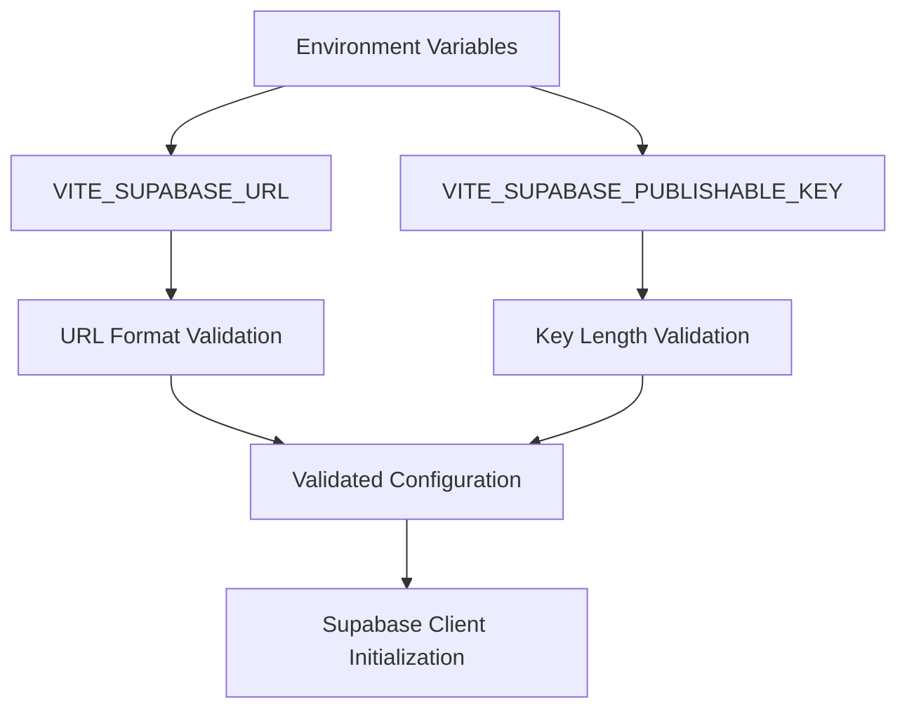
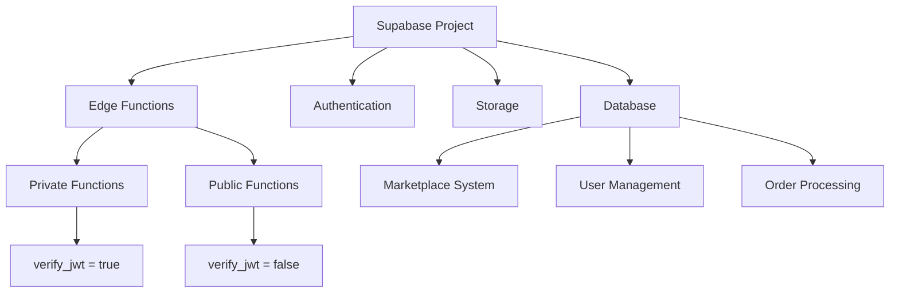
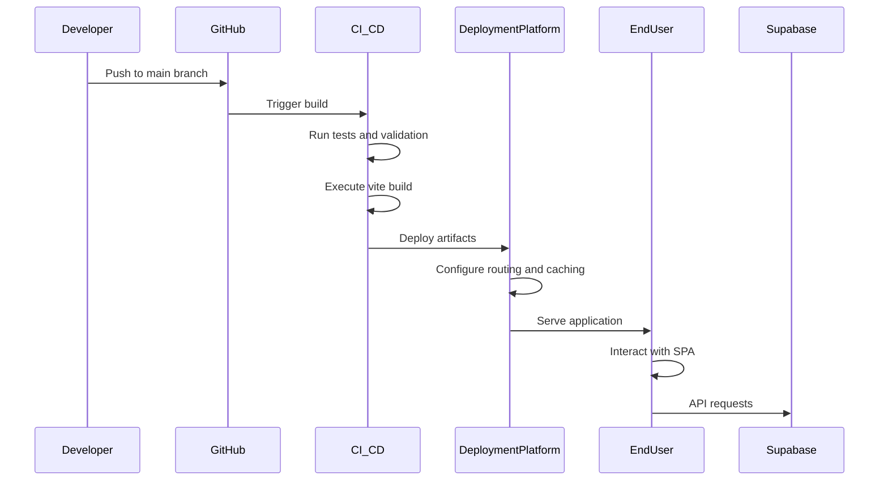
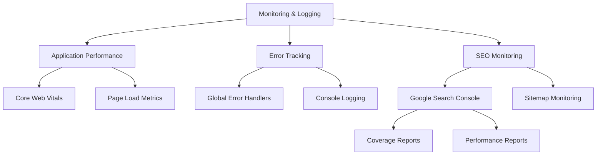

# Deployment & Operations

<cite>
**Referenced Files in This Document**   
- [vercel.json](file://vercel.json)
- [netlify.toml](file://netlify.toml)
- [firebase.json](file://firebase.json)
- [package.json](file://package.json)
- [src/lib/env-validator.ts](file://src/lib/env-validator.ts)
- [src/integrations/supabase/client.ts](file://src/integrations/supabase/client.ts)
- [supabase/config.toml](file://supabase/config.toml)
- [DEPLOYMENT_SUMMARY.md](file://DEPLOYMENT_SUMMARY.md)
- [GOOGLE_SEARCH_CONSOLE_SETUP.md](file://GOOGLE_SEARCH_CONSOLE_SETUP.md)
- [update-supabase-key.sh](file://update-supabase-key.sh)
</cite>

## Table of Contents
1. [Introduction](#introduction)
2. [Deployment Environments Overview](#deployment-environments-overview)
3. [Configuration Management](#configuration-management)
4. [Supabase Project Setup](#supabase-project-setup)
5. [Deployment Pipeline](#deployment-pipeline)
6. [Monitoring and Logging](#monitoring-and-logging)
7. [Backup and Recovery Strategies](#backup-and-recovery-strategies)
8. [Common Deployment Scenarios](#common-deployment-scenarios)
9. [Troubleshooting Guide](#troubleshooting-guide)
10. [Best Practices](#best-practices)

## Introduction

The sleekapp-v100 deployment and operations framework is designed to support a robust, scalable, and secure web application for the apparel manufacturing industry. This document provides comprehensive guidance on deploying and operating the application across multiple platforms including Vercel, Netlify, and Firebase, with Supabase serving as the primary backend service.

The application has been successfully deployed to production at https://sleekapparels.com with full operational status as of November 27, 2025. The deployment infrastructure leverages modern CI/CD practices with automated deployments from the main branch, ensuring rapid and reliable delivery of updates.

This documentation serves both beginners and experienced developers, providing conceptual overviews of the deployment architecture alongside detailed technical specifications for environment configuration, Supabase integration, and operational procedures. The system is built with React 18, TypeScript, Vite 6, and TailwindCSS, deployed on Lovable Cloud with Brotli compression for optimal performance.

**Section sources**
- [DEPLOYMENT_SUMMARY.md](file://DEPLOYMENT_SUMMARY.md#L1-L371)

## Deployment Environments Overview

The sleekapp-v100 application utilizes a multi-environment deployment strategy with distinct configurations for development, staging, and production environments. Each environment serves a specific purpose in the development workflow and is configured with appropriate security and performance settings.

The production environment is hosted on Lovable Cloud with auto-deployment enabled from the main branch, ensuring that all approved changes are automatically deployed. The domain sleekapparels.com is secured with HTTPS/HTTP2, achieving 99.9% uptime. This environment is optimized for performance with Brotli compression and serves approximately 600KB of compressed assets.

The development environment is configured for rapid iteration and debugging, with environment validation occurring only in production mode to avoid disrupting the development workflow. The build process transforms 1,114 modules with zero errors, producing a 3.5MB raw output that compresses to approximately 600KB.

All environments implement strict security headers including X-Frame-Options: DENY, X-Content-Type-Options: nosniff, and X-XSS-Protection: 1; mode=block to protect against common web vulnerabilities. The application uses a single-page application (SPA) routing model with rewrites configured to direct all requests to index.html, enabling clean URL routing.

**Section sources**
- [DEPLOYMENT_SUMMARY.md](file://DEPLOYMENT_SUMMARY.md#L1-L371)
- [vercel.json](file://vercel.json#L1-L6)
- [netlify.toml](file://netlify.toml#L1-L123)
- [firebase.json](file://firebase.json#L1-L44)

## Configuration Management

### Environment Variables

The application implements a robust environment variable management system centered around Vite's environment variable conventions. Critical configuration parameters are prefixed with VITE_ to ensure they are exposed to the client-side application.

The core environment variables include:
- **VITE_SUPABASE_URL**: The base URL for the Supabase project, pointing to https://eqpftggctumujhutomom.supabase.co
- **VITE_SUPABASE_PUBLISHABLE_KEY**: The publishable API key for Supabase authentication and database access

These variables are validated at application startup through the EnvironmentValidator class in src/lib/env-validator.ts, which performs comprehensive validation including checking for required variables, validating URL formats, and verifying Supabase key integrity.



**Diagram sources**
- [src/lib/env-validator.ts](file://src/lib/env-validator.ts#L6-L142)
- [src/integrations/supabase/client.ts](file://src/integrations/supabase/client.ts#L1-L20)

### Configuration Implementation

The environment validation system is implemented as a singleton class that ensures configuration is validated exactly once per application instance. In production mode, validation occurs automatically on import, failing fast if configuration is invalid. This prevents the application from running with misconfigured settings.

The update-supabase-key.sh script provides a convenient way to update the Supabase configuration by creating or updating the .env.local file with the specified ANON key. This script validates the key format (checking that it starts with "eyJ") and provides clear feedback on the update process.

For local development, developers can use the update-supabase-key.sh script to quickly configure their environment:
```bash
./update-supabase-key.sh YOUR_ANON_KEY_HERE
```

This creates a .env.local file with the appropriate Supabase URL and publishable key, enabling immediate connection to the Supabase backend.

**Section sources**
- [src/lib/env-validator.ts](file://src/lib/env-validator.ts#L6-L142)
- [update-supabase-key.sh](file://update-supabase-key.sh#L1-L54)
- [src/integrations/supabase/client.ts](file://src/integrations/supabase/client.ts#L1-L20)

## Supabase Project Setup

### Project Configuration

The Supabase project (ID: eqpftggctumujhutomom) is configured as the central backend service for sleekapp-v100, providing authentication, database, storage, and edge functions. The project configuration is managed in supabase/config.toml, which defines JWT verification settings for each edge function.

The configuration specifies which functions require JWT verification:
- **verify_jwt = true**: Functions requiring authentication (e.g., generate-invoice, admin-check, ai-design-generator)
- **verify_jwt = false**: Publicly accessible functions (e.g., send-resource-email, stripe-webhook, ai-conversational-quote)

This granular control allows the application to expose certain functionality to unauthenticated users while protecting sensitive operations.



**Diagram sources**
- [supabase/config.toml](file://supabase/config.toml#L1-L73)
- [supabase/migrations](file://supabase/migrations)

### Client Integration

The Supabase client is initialized in src/integrations/supabase/client.ts, which imports the validated environment configuration and creates a typed Supabase client. The client is configured with:
- localStorage for session persistence
- Automatic session refresh
- Persistent sessions across browser restarts

The integration uses the Database type from ./types to provide TypeScript type safety for database operations. This ensures that all database queries and mutations are type-checked at compile time, reducing runtime errors.

The client initialization process is tightly coupled with environment validation, ensuring that the application cannot start with invalid or missing Supabase configuration. This fail-fast approach prevents deployment issues caused by misconfigured environment variables.

**Section sources**
- [supabase/config.toml](file://supabase/config.toml#L1-L73)
- [src/integrations/supabase/client.ts](file://src/integrations/supabase/client.ts#L1-L20)

## Deployment Pipeline

### Build Process

The deployment pipeline begins with the build process defined in package.json, which uses Vite 7.1.9 as the build tool. The build script (vite build) transforms 1,114 modules in approximately 48 seconds, producing optimized assets for production deployment.

The build process includes:
- TypeScript compilation with type checking
- CSS optimization with TailwindCSS
- Asset compression with Brotli
- Code splitting for optimal loading performance
- Static asset optimization

The resulting build output is approximately 3.5MB raw, compressing to ~600KB, providing excellent performance characteristics for a rich web application.

### Platform-Specific Configuration

The application is configured for deployment on multiple platforms through platform-specific configuration files:

**Vercel Configuration (vercel.json):**
```json
{
  "rewrites": [
    { "source": "/(.*)", "destination": "/index.html" }
  ]
}
```
This configuration enables SPA routing by rewriting all requests to index.html, allowing client-side routing to function correctly.

**Netlify Configuration (netlify.toml):**
The Netlify configuration implements comprehensive caching strategies:
- Immutable caching (1 year) for static assets (JS, CSS, images, fonts, videos)
- No caching for HTML files to ensure fresh content
- Strict security headers including X-Frame-Options, X-Content-Type-Options, and X-XSS-Protection

**Firebase Configuration (firebase.json):**
The Firebase configuration specifies:
- Public directory as "dist" (build output)
- Rewrites for SPA routing
- Cache headers for static assets
- Firestore rules and indexes
- Storage rules



**Diagram sources**
- [package.json](file://package.json#L1-L115)
- [vercel.json](file://vercel.json#L1-L6)
- [netlify.toml](file://netlify.toml#L1-L123)
- [firebase.json](file://firebase.json#L1-L44)

**Section sources**
- [package.json](file://package.json#L1-L115)
- [vercel.json](file://vercel.json#L1-L6)
- [netlify.toml](file://netlify.toml#L1-L123)
- [firebase.json](file://firebase.json#L1-L44)

## Monitoring and Logging

### Application Monitoring

The application implements comprehensive monitoring through multiple mechanisms:

**Performance Monitoring:**
- Core Web Vitals tracking
- Page load performance measurement
- Resource loading optimization
- Route prefetching analytics

**Error Monitoring:**
In production mode, global error handlers capture unhandled exceptions and promise rejections:
```typescript
if (import.meta.env.PROD) {
  window.addEventListener('error', (event) => {
    console.error('Global error:', event.error);
  });
  
  window.addEventListener('unhandledrejection', (event) => {
    console.error('Unhandled promise rejection:', event.reason);
  });
}
```

This ensures that all runtime errors are logged to the console for monitoring and debugging purposes.

### Google Search Console Integration

The application is integrated with Google Search Console for SEO monitoring and indexing control. The GOOGLE_SEARCH_CONSOLE_SETUP.md document provides detailed instructions for:
- Property verification using HTML file upload or meta tag methods
- Sitemap submission (sitemap.xml)
- Manual indexing requests for high-value pages
- Monitoring indexing status and coverage reports

The setup process includes requesting indexing for key SEO pages such as /samples, /tech-pack-services, and /for-startups to accelerate their appearance in search results.



**Diagram sources**
- [src/main.tsx](file://src/main.tsx#L1-L39)
- [GOOGLE_SEARCH_CONSOLE_SETUP.md](file://GOOGLE_SEARCH_CONSOLE_SETUP.md#L1-L536)

**Section sources**
- [src/main.tsx](file://src/main.tsx#L1-L39)
- [GOOGLE_SEARCH_CONSOLE_SETUP.md](file://GOOGLE_SEARCH_CONSOLE_SETUP.md#L1-L536)

## Backup and Recovery Strategies

The backup and recovery strategy for sleekapp-v100 leverages the built-in capabilities of the Supabase platform combined with GitHub for source code versioning.

**Database Backups:**
Supabase automatically manages database backups with point-in-time recovery capabilities. The migration system in the supabase/migrations directory provides a version-controlled approach to database schema changes, allowing for reliable rollback if needed.

**Source Code Versioning:**
All application code is stored in GitHub with the main branch protected by CI/CD checks. This ensures that only tested and validated code can be deployed to production.

**Configuration Management:**
Environment-specific configurations are managed through:
- Version-controlled configuration files (vercel.json, netlify.toml, firebase.json)
- Environment variables for sensitive data
- The update-supabase-key.sh script for consistent local environment setup

**Disaster Recovery:**
The deployment architecture supports rapid recovery through:
- Automated deployments from the main branch
- Infrastructure-as-code configuration files
- Complete rebuild capability from source code and migrations

In the event of a deployment failure, the system can be restored by:
1. Rolling back to a previous commit in GitHub
2. Redeploying the previous version
3. Using Supabase point-in-time recovery if database rollback is needed

**Section sources**
- [supabase/migrations](file://supabase/migrations)
- [supabase/config.toml](file://supabase/config.toml#L1-L73)
- [update-supabase-key.sh](file://update-supabase-key.sh#L1-L54)

## Common Deployment Scenarios

### Deploying to Production

The production deployment process is fully automated:
1. Push changes to the main branch in GitHub
2. CI/CD pipeline triggers automatically
3. Build process executes (vite build)
4. Artifacts deployed to Lovable Cloud
5. Application available at https://sleekapparels.com

The deployment is verified through automated checks that confirm:
- HTTP 200 status for all pages
- Successful build with zero errors
- Valid SSL/HTTPS configuration
- Proper routing and asset loading

### Configuring Custom Domains

Custom domains are configured through the deployment platform (Lovable Cloud). The primary domain sleekapparels.com is already configured with SSL certificates managed automatically by the platform.

To add additional domains or subdomains:
1. Configure the domain DNS to point to the deployment platform
2. Add the domain in the platform's domain management interface
3. Wait for SSL certificate provisioning (typically 5-10 minutes)
4. Verify the domain is serving the application correctly

### Managing Environment Variables

Environment variables are managed differently across environments:

**Local Development:**
Use the update-supabase-key.sh script to configure Supabase credentials:
```bash
./update-supabase-key.sh YOUR_ANON_KEY_HERE
```

**Production:**
Environment variables are configured in the deployment platform's interface, ensuring they are securely stored and not exposed in version control.

**Best Practice:** Never commit environment variables to version control. Use .env.local for local development and platform-specific configuration for deployed environments.

**Section sources**
- [DEPLOYMENT_SUMMARY.md](file://DEPLOYMENT_SUMMARY.md#L1-L371)
- [update-supabase-key.sh](file://update-supabase-key.sh#L1-L54)

## Troubleshooting Guide

### Misconfigured Environment Variables

**Symptoms:**
- Application fails to start
- Console errors about missing environment variables
- Unable to connect to Supabase

**Resolution:**
1. Verify the required environment variables are set:
   - VITE_SUPABASE_URL
   - VITE_SUPABASE_PUBLISHABLE_KEY
2. Check that VITE_SUPABASE_URL is a valid URL
3. Verify the publishable key is correct and has sufficient permissions
4. Use the update-supabase-key.sh script to ensure proper configuration

### Deployment Timeouts

**Symptoms:**
- Build process times out
- Deployment fails with timeout errors
- Large asset bundles

**Resolution:**
1. Check build duration (should be ~48 seconds)
2. Verify network connectivity during deployment
3. Optimize asset sizes if necessary
4. Consider increasing timeout limits in the deployment platform

### Google Search Console Issues

**Verification Failed:**
- Ensure the HTML verification file is in the public directory
- Verify the exact filename matches Google's requirements
- Confirm the file is publicly accessible

**Sitemap Not Found:**
- Verify sitemap.xml exists in the public directory
- Check that the file is included in the build output
- Ensure the file is not blocked by robots.txt

**Indexing Request Failed:**
- Confirm the page is publicly accessible
- Check for noindex meta tags
- Verify the page returns HTTP 200 status
- Ensure robots.txt is not blocking the page

**Section sources**
- [src/lib/env-validator.ts](file://src/lib/env-validator.ts#L6-L142)
- [update-supabase-key.sh](file://update-supabase-key.sh#L1-L54)
- [GOOGLE_SEARCH_CONSOLE_SETUP.md](file://GOOGLE_SEARCH_CONSOLE_SETUP.md#L1-L536)

## Best Practices

1. **Environment Isolation:** Maintain separate configuration for development, staging, and production environments
2. **Secure Secrets:** Never commit sensitive environment variables to version control
3. **Automated Deployments:** Use CI/CD pipelines to ensure consistent and reliable deployments
4. **Monitoring:** Implement comprehensive monitoring and logging to detect issues early
5. **Backup Strategy:** Rely on platform-managed backups while maintaining version control for configuration
6. **Performance Optimization:** Leverage caching headers and asset optimization for optimal user experience
7. **Security Headers:** Implement strict security headers to protect against common web vulnerabilities
8. **Fail-Fast Validation:** Validate configuration at startup to prevent running with incorrect settings
9. **Documentation:** Maintain up-to-date documentation for deployment and operational procedures
10. **Regular Audits:** Periodically review deployment configurations and security settings