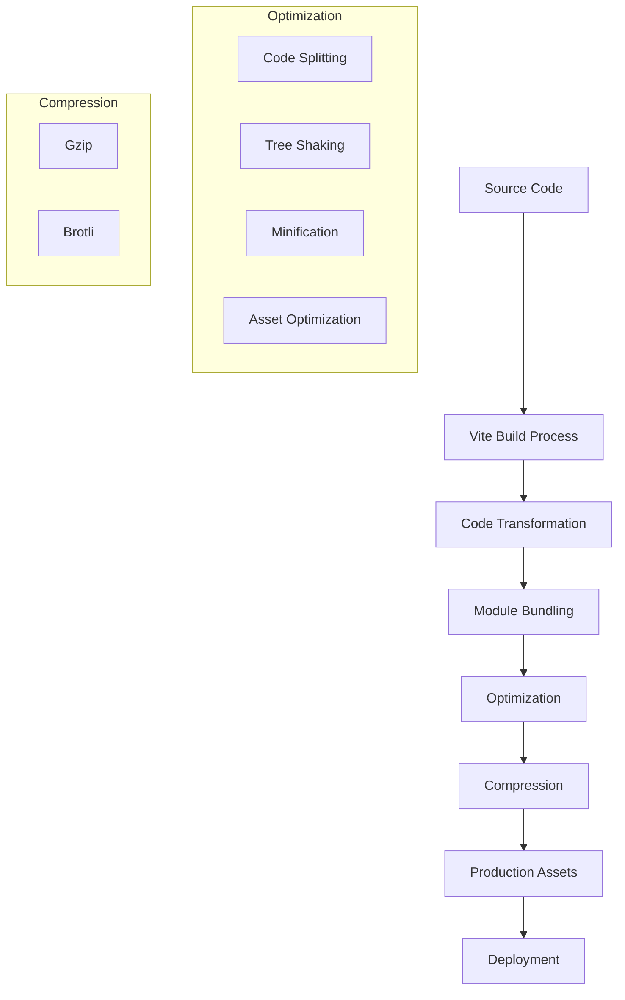
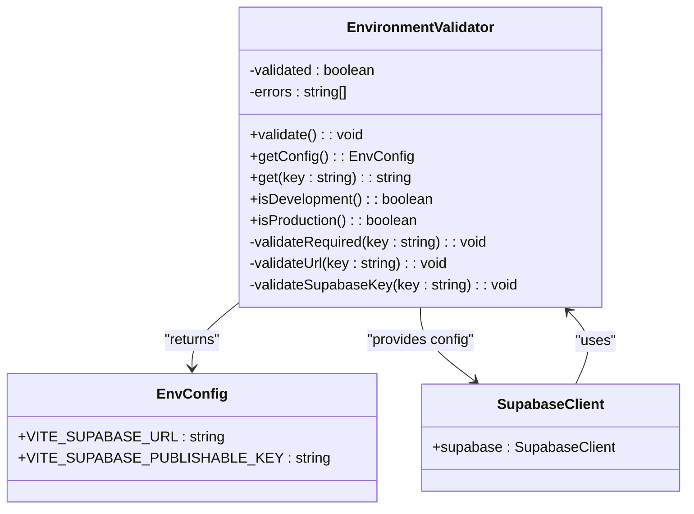
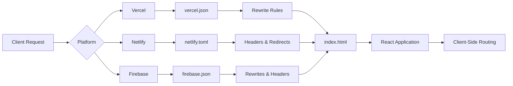

# CI/CD Pipeline Integration

<cite>
**Referenced Files in This Document**   
- [package.json](file://package.json)
- [vite.config.ts](file://vite.config.ts)
- [vercel.json](file://vercel.json)
- [netlify.toml](file://netlify.toml)
- [firebase.json](file://firebase.json)
- [src/lib/env-validator.ts](file://src/lib/env-validator.ts)
- [src/integrations/supabase/client.ts](file://src/integrations/supabase/client.ts)
- [scripts/compress-images.js](file://scripts/compress-images.js)
- [update-supabase-key.sh](file://update-supabase-key.sh)
- [DEPLOYMENT_SUMMARY.md](file://DEPLOYMENT_SUMMARY.md)
</cite>

## Table of Contents
1. [Introduction](#introduction)
2. [CI/CD Pipeline Overview](#cicd-pipeline-overview)
3. [Build Configuration and Optimization](#build-configuration-and-optimization)
4. [Environment Management and Security](#environment-management-and-security)
5. [Deployment Configuration](#deployment-configuration)
6. [Common Deployment Issues and Solutions](#common-deployment-issues-and-solutions)
7. [Best Practices for Multi-Environment Management](#best-practices-for-multi-environment-management)
8. [Conclusion](#conclusion)

## Introduction

The CI/CD pipeline for sleekapp-v100 is designed to enable seamless automated deployments through GitHub commits and pull requests, leveraging both Vercel and Netlify platforms. This documentation provides a comprehensive overview of the implementation details, including build configurations, environment management, and deployment strategies that ensure consistent and reliable application delivery across development, staging, and production environments. The pipeline incorporates Vite's build optimization features, secure environment variable handling, and platform-specific deployment configurations to deliver a robust continuous integration and deployment workflow.

**Section sources**
- [DEPLOYMENT_SUMMARY.md](file://DEPLOYMENT_SUMMARY.md#L1-L371)

## CI/CD Pipeline Overview

The CI/CD pipeline for sleekapp-v100 is triggered automatically through GitHub commits and pull requests, enabling continuous deployment to both Vercel and Netlify platforms. The pipeline architecture is designed to ensure rapid feedback, consistent builds, and reliable deployments across multiple environments. When developers push code changes to the repository, the CI/CD system automatically executes the build process, runs validation checks, and deploys the application to the appropriate environment based on the branch and pull request configuration.

The deployment workflow begins with code commits to the GitHub repository, which triggers the build process on both Vercel and Netlify. These platforms automatically detect the Vite-based React application and execute the build command specified in the package.json file. The build artifacts are then deployed to the respective hosting environments, with Vercel serving as the primary production platform and Netlify providing additional deployment capabilities and edge network benefits.

The pipeline supports multiple deployment environments including development, staging, and production, each with its own configuration and deployment rules. Pull requests automatically generate preview deployments, allowing team members to review changes before merging to the main branch. This approach ensures that all code changes are thoroughly tested in a production-like environment before being released to end users.

**Section sources**
- [package.json](file://package.json#L6-L11)
- [DEPLOYMENT_SUMMARY.md](file://DEPLOYMENT_SUMMARY.md#L1-L371)

## Build Configuration and Optimization

The build configuration for sleekapp-v100 is centered around Vite, a modern build tool that provides fast development server startup and optimized production builds. The vite.config.ts file contains comprehensive configuration options that enable various optimization techniques to improve application performance and reduce bundle size.

The build process is initiated through the "build" script in package.json, which executes "vite build" to generate production-ready assets. Additional build variants are available through "build:dev" which builds with development mode settings. The Vite configuration includes several optimization features:

- **Code splitting**: The build configuration implements manual chunking to separate critical dependencies into distinct bundles, improving initial load performance by allowing parallel loading of essential components.
- **Compression**: Both gzip and Brotli compression are enabled in production builds, significantly reducing asset sizes and improving load times.
- **CSS optimization**: Lightning CSS is used for faster CSS minification, and CSS code splitting is disabled to create a single CSS file for better caching.
- **Asset handling**: Small assets under 4KB are inlined to reduce HTTP requests, while larger assets are optimized and served with appropriate cache headers.

The build process also includes several performance-enhancing plugins:
- **vite-plugin-compression**: Automatically generates compressed versions of assets
- **rollup-plugin-visualizer**: Creates bundle analysis reports to identify optimization opportunities
- **vite-plugin-remove-console**: Removes console.log statements in production builds
- **vite-plugin-image-optimizer**: Optimizes images during the build process (currently disabled due to build issues)

**Diagram sources**
- [vite.config.ts](file://vite.config.ts#L1-L216)
- [package.json](file://package.json#L8-L9)

**Section sources**
- [vite.config.ts](file://vite.config.ts#L1-L216)
- [package.json](file://package.json#L8-L9)

## Environment Management and Security

The environment management system in sleekapp-v100 is designed to securely handle configuration variables across different deployment environments while maintaining consistency and preventing sensitive information exposure. The application uses Vite's environment variable system with a comprehensive validation mechanism to ensure proper configuration.

Environment variables are prefixed with "VITE_" to make them available in the client-side code, following Vite's convention. Key environment variables include:
- VITE_SUPABASE_URL: The Supabase backend URL
- VITE_SUPABASE_PUBLISHABLE_KEY: The Supabase publishable key for client authentication
- VITE_STRIPE_PUBLISHABLE_KEY: The Stripe publishable key for payment processing

The src/lib/env-validator.ts file implements a robust environment validation system that checks for the presence and validity of required environment variables at application startup. This class-based validator performs several checks:
- Ensures required variables are present and not empty
- Validates URL format for Supabase URL
- Performs basic validation of Supabase key format
- Provides a singleton interface for accessing validated environment configuration

The validation process is automatically executed in production mode, failing fast if any required variables are missing or invalid. This prevents the application from running with incorrect configuration that could lead to security vulnerabilities or functionality issues.

For local development, the update-supabase-key.sh script provides a convenient way to update the Supabase configuration. This bash script creates a .env.local file with the specified Supabase key, making it easy for developers to configure their local environment without manually editing configuration files.

The environment configuration is also integrated with the Supabase client initialization in src/integrations/supabase/client.ts, where the validated environment variables are used to create the Supabase client instance. This ensures that the application always uses properly configured and validated environment settings when connecting to the backend services.

**Diagram sources**
- [src/lib/env-validator.ts](file://src/lib/env-validator.ts#L1-L142)
- [src/integrations/supabase/client.ts](file://src/integrations/supabase/client.ts#L1-L20)

**Section sources**
- [src/lib/env-validator.ts](file://src/lib/env-validator.ts#L1-L142)
- [src/integrations/supabase/client.ts](file://src/integrations/supabase/client.ts#L1-L20)
- [update-supabase-key.sh](file://update-supabase-key.sh#L1-L54)

## Deployment Configuration

The deployment configuration for sleekapp-v100 is designed to support multiple platforms including Vercel, Netlify, and Firebase, each with its own configuration file that specifies deployment settings and routing rules. This multi-platform approach provides flexibility and redundancy in the deployment strategy.

The vercel.json file contains the Vercel-specific configuration, which includes rewrite rules to ensure proper routing for client-side navigation. The configuration redirects all requests to index.html, enabling clean URLs and proper handling of the React Router-based navigation system.

The netlify.toml file provides comprehensive configuration for Netlify deployments, including:
- Security headers to enhance application security
- Cache control headers for various asset types to optimize performance
- Redirect rules to handle client-side routing
- MIME type-specific caching strategies

Key security headers configured in netlify.toml include:
- X-Frame-Options: DENY (prevents clickjacking attacks)
- X-Content-Type-Options: nosniff (prevents MIME type sniffing)
- X-XSS-Protection: 1; mode=block (enables XSS protection)
- Referrer-Policy: strict-origin-when-cross-origin (controls referrer information)

The firebase.json file configures Firebase hosting with similar routing and caching rules. It specifies the dist directory as the public directory, sets up rewrites to handle client-side routing, and configures cache control headers for JavaScript and CSS assets to enable long-term caching with immutable assets.

All three deployment configurations implement similar routing strategies to support the React Router-based application, ensuring that deep links work correctly by serving the index.html file for all routes. This approach enables clean URLs and proper bookmarking of application states.

**Diagram sources**
- [vercel.json](file://vercel.json#L1-L6)
- [netlify.toml](file://netlify.toml#L1-L123)
- [firebase.json](file://firebase.json#L1-L44)

**Section sources**
- [vercel.json](file://vercel.json#L1-L6)
- [netlify.toml](file://netlify.toml#L1-L123)
- [firebase.json](file://firebase.json#L1-L44)

## Common Deployment Issues and Solutions

Despite the robust CI/CD pipeline, several common issues can occur during the build and deployment process. Understanding these issues and their solutions is critical for maintaining a smooth development workflow.

**Missing Dependencies**: One common issue is failed builds due to missing dependencies. This typically occurs when package.json and package-lock.json are out of sync, or when developers forget to commit new dependencies. The solution is to ensure that all dependencies are properly installed and committed to the repository. Running `npm install` before pushing changes can help prevent this issue.

**Timeout Errors During Asset Processing**: Long-running asset processing tasks, particularly image optimization, can cause timeout errors in CI/CD environments. The scripts/compress-images.js file implements WebP conversion for images, which can be resource-intensive. To mitigate this issue, consider optimizing the image compression script to process images in smaller batches or exclude certain directories from compression.

**Version Mismatches Between Local and Deployed Environments**: Differences between local development environments and CI/CD environments can lead to build failures or unexpected behavior. This often occurs when different Node.js versions are used. The solution is to standardize the Node.js version across all environments using a .nvmrc file or by specifying the engine requirements in package.json.

**Environment Variable Configuration Issues**: Incorrect or missing environment variables are a frequent cause of deployment failures. The env-validator.ts implementation helps catch these issues early, but developers should ensure that all required environment variables are properly configured in the CI/CD platform settings. For Vercel and Netlify, this means setting the environment variables in the project settings rather than relying on local .env files.

**Cache-Related Issues**: Stale cache in CI/CD environments can cause builds to fail or produce incorrect results. Both Vercel and Netlify provide cache management options that can be used to clear the build cache when necessary. Additionally, the build configuration should include cache-busting mechanisms such as unique build IDs to ensure that users receive the latest version of the application.

**Large Bundle Size Warnings**: The Vite configuration includes a chunkSizeWarningLimit of 500KB, which triggers warnings when bundles exceed this size. While not a build failure, this can impact application performance. Solutions include optimizing code splitting strategies, lazy-loading non-critical components, and auditing dependencies for unnecessary bloat.

**Section sources**
- [vite.config.ts](file://vite.config.ts#L87-L94)
- [scripts/compress-images.js](file://scripts/compress-images.js#L1-L76)
- [src/lib/env-validator.ts](file://src/lib/env-validator.ts#L1-L142)

## Best Practices for Multi-Environment Management

Effective management of multiple environments (development, staging, production) is crucial for maintaining deployment consistency and ensuring application reliability across platforms. The following best practices are recommended for sleekapp-v100:

**Environment-Specific Configuration**: Use environment variables to manage configuration differences between environments. The VITE_PUBLIC_SUPABASE_URL variable should point to different Supabase projects for development, staging, and production environments. This isolation prevents accidental data modification in production while allowing developers to work with realistic data in lower environments.

**Consistent Build Processes**: Ensure that the build process is identical across all environments by using the same build commands and configuration. The "vite build" command should be used consistently, with environment-specific variables injected at deployment time rather than hard-coded in the build configuration.

**Automated Testing in Staging**: Implement automated testing in the staging environment before promoting changes to production. This includes running unit tests, integration tests, and end-to-end tests to verify that the application functions correctly with the staging configuration.

**Feature Flags for Gradual Rollouts**: Use feature flags to gradually roll out new functionality to users. This allows for controlled testing of new features with a subset of users before making them available to everyone, reducing the risk of widespread issues.

**Monitoring and Logging**: Implement comprehensive monitoring and logging across all environments to quickly identify and resolve issues. The env-validator.ts implementation already includes error logging, but additional application-level monitoring should be considered.

**Regular Security Audits**: Conduct regular security audits of environment variables and deployment configurations to ensure that sensitive information is not exposed. The update-supabase-key.sh script should be used carefully, and Supabase keys should be rotated periodically.

**Documentation and Knowledge Sharing**: Maintain up-to-date documentation of the CI/CD pipeline and environment configurations. The DEPLOYMENT_SUMMARY.md file provides a good starting point, but additional details about environment-specific settings and deployment procedures should be documented.

**Section sources**
- [package.json](file://package.json#L8-L9)
- [vite.config.ts](file://vite.config.ts#L79-L85)
- [src/lib/env-validator.ts](file://src/lib/env-validator.ts#L1-L142)
- [DEPLOYMENT_SUMMARY.md](file://DEPLOYMENT_SUMMARY.md#L1-L371)

## Conclusion

The CI/CD pipeline integration for sleekapp-v100 provides a robust foundation for automated deployments through GitHub commits and pull requests using both Vercel and Netlify. The implementation leverages Vite's build optimization features, secure environment variable management, and platform-specific deployment configurations to ensure consistent and reliable application delivery.

Key strengths of the current implementation include comprehensive environment validation, optimized build processes, and multi-platform deployment support. The use of Vite for build optimization, combined with proper environment management through the env-validator.ts implementation, ensures that the application is both performant and secure.

To further enhance the CI/CD pipeline, consider implementing additional automated testing, improving image optimization workflows, and standardizing Node.js versions across environments. Regular monitoring of build performance and deployment success rates will help identify areas for improvement and ensure that the pipeline continues to meet the evolving needs of the application.

The documented best practices for multi-environment management provide a solid foundation for maintaining deployment consistency across platforms, enabling the team to deliver high-quality software reliably and efficiently.