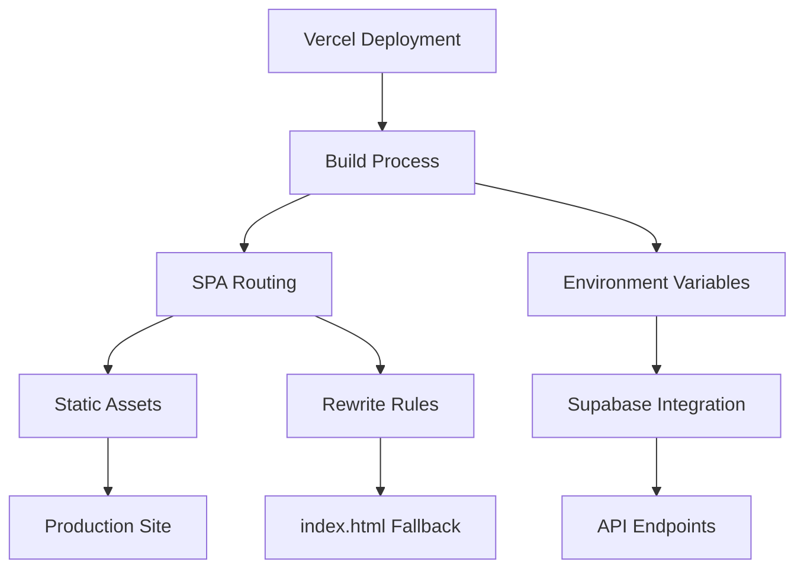
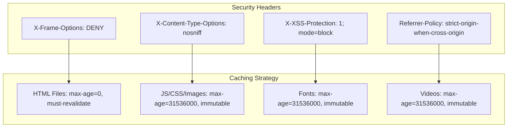
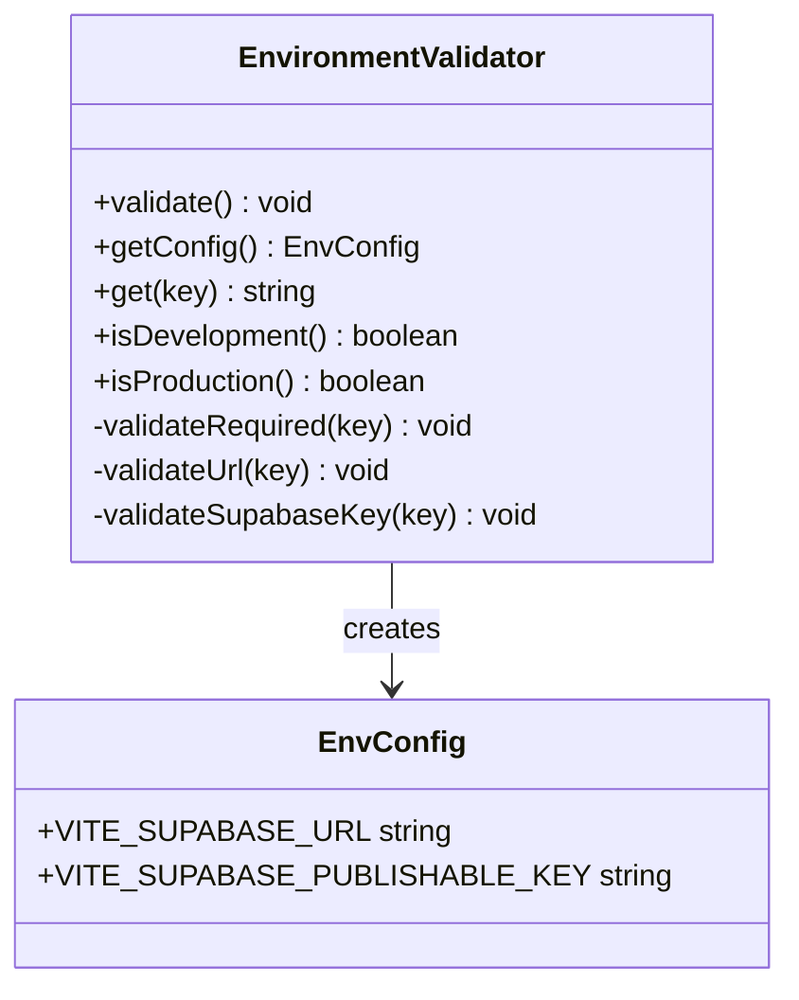
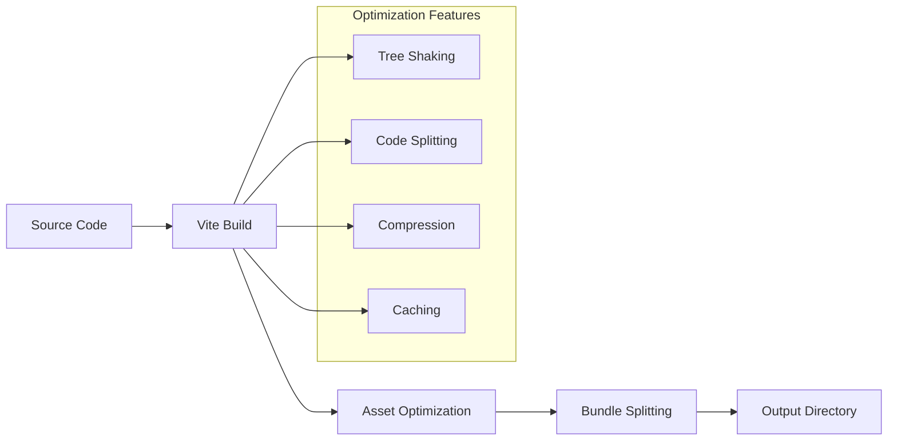
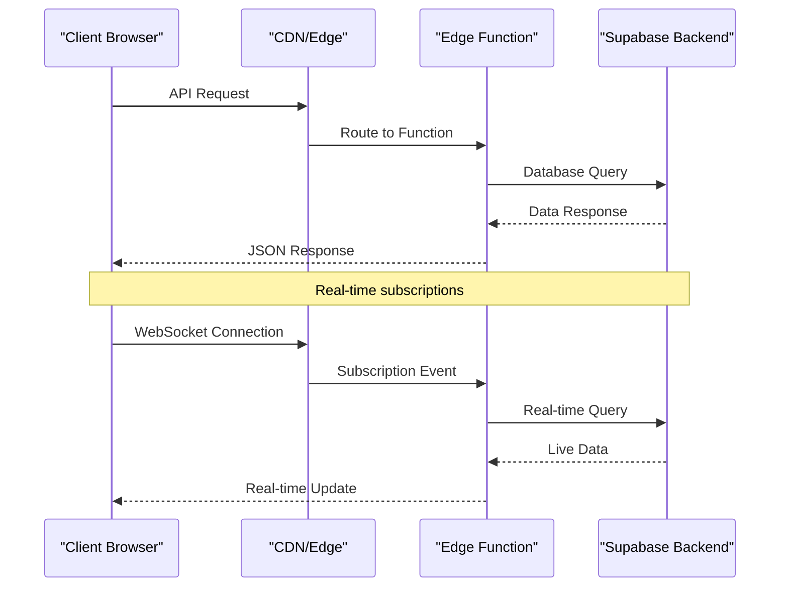
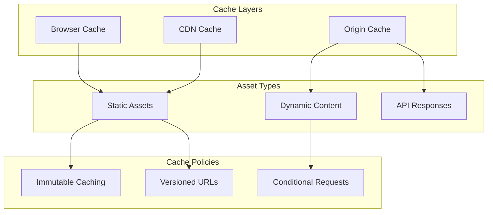

# Deployment Platforms Configuration

<cite>
**Referenced Files in This Document**
- [netlify.toml](file://netlify.toml)
- [vercel.json](file://vercel.json)
- [package.json](file://package.json)
- [vite.config.ts](file://vite.config.ts)
- [firebase.json](file://firebase.json)
- [README.md](file://README.md)
- [DEPLOYMENT_SUMMARY.md](file://DEPLOYMENT_SUMMARY.md)
- [src/lib/env-validator.ts](file://src/lib/env-validator.ts)
- [src/integrations/supabase/client.ts](file://src/integrations/supabase/client.ts)
- [update-supabase-key.sh](file://update-supabase-key.sh)
- [src/pages/Health.tsx](file://src/pages/Health.tsx)
</cite>

## Table of Contents
1. [Introduction](#introduction)
2. [Deployment Platform Overview](#deployment-platform-overview)
3. [Vercel Configuration](#vercel-configuration)
4. [Netlify Configuration](#netlify-configuration)
5. [Environment Variables Management](#environment-variables-management)
6. [Build Configuration](#build-configuration)
7. [Edge Functions Integration](#edge-functions-integration)
8. [Domain and Redirect Configuration](#domain-and-redirect-configuration)
9. [Common Deployment Issues](#common-deployment-issues)
10. [GitHub Integration](#github-integration)
11. [Performance Optimization](#performance-optimization)
12. [Troubleshooting Guide](#troubleshooting-guide)

## Introduction

The sleekapp-v100 application is a sophisticated React-based web application built with Vite, TypeScript, and modern deployment practices. This documentation provides comprehensive guidance for configuring and deploying the application across multiple platforms, with a focus on Vercel and Netlify as primary deployment targets. The application leverages Supabase for backend services and implements advanced caching strategies for optimal performance.

The deployment configuration emphasizes security, performance, and developer experience while maintaining flexibility for different hosting environments. The application's architecture supports both traditional SPA routing and server-side rendering capabilities through edge functions.

## Deployment Platform Overview

The sleekapp-v100 application supports deployment across multiple platforms, each offering unique advantages for different deployment scenarios:

### Platform Comparison

| Feature | Vercel | Netlify | Firebase Hosting |
|---------|--------|---------|------------------|
| **Primary Use Case** | Serverless-first, Edge Functions | Static-first, Functions | Firebase-native |
| **Build Tools** | Vercel CLI, Git Integration | Netlify CLI, Git Integration | Firebase CLI |
| **Edge Functions** | Native support | Netlify Functions | Deno-based Functions |
| **Custom Domains** | Automatic SSL | Automatic SSL | Automatic SSL |
| **Preview Deployments** | Pull Request previews | Branch previews | PR previews |
| **Performance** | Global CDN, Edge caching | Global CDN, Edge caching | Global CDN |
| **Cost Model** | Pay-as-you-go | Pay-as-you-go | Pay-as-you-go |

### Architecture Benefits

The application's deployment architecture provides several key advantages:

- **Progressive Enhancement**: Works with both static hosting and serverless functions
- **Security Headers**: Comprehensive security policies embedded in configuration
- **Performance Optimization**: Intelligent caching strategies for different asset types
- **Developer Experience**: Seamless integration with modern CI/CD workflows

## Vercel Configuration

Vercel serves as the primary deployment platform for sleekapp-v100, offering native support for modern web applications with edge function capabilities.

### Basic Configuration

The Vercel deployment configuration is minimal but powerful, focusing on SPA routing support:



**Diagram sources**
- [vercel.json](file://vercel.json#L1-L6)
- [vite.config.ts](file://vite.config.ts#L1-L50)

### Configuration Details

The Vercel configuration demonstrates a clean approach to SPA routing:

- **Rewrite Rules**: All routes are rewritten to serve `index.html` for client-side routing
- **Minimal Configuration**: The simple JSON structure reduces complexity while maintaining functionality
- **Edge Function Compatibility**: Supports integration with Supabase Edge Functions

**Section sources**
- [vercel.json](file://vercel.json#L1-L6)

### Vercel-Specific Features

Vercel provides several features that enhance the deployment experience:

1. **Automatic Preview Deployments**: Pull request branches receive automatic deployment previews
2. **Edge Network**: Global distribution of static assets and serverless functions
3. **Analytics Integration**: Built-in performance monitoring and deployment tracking
4. **Git Integration**: Seamless deployment triggers from GitHub repository changes

## Netlify Configuration

Netlify offers robust static site hosting with advanced features for modern web applications, particularly strong in security and performance optimization.

### Security Headers Configuration

Netlify's configuration implements comprehensive security policies through HTTP headers:



**Diagram sources**
- [netlify.toml](file://netlify.toml#L1-L123)

### Asset Optimization

The Netlify configuration implements sophisticated caching strategies:

| Asset Type | Cache Duration | Strategy |
|------------|---------------|----------|
| **HTML Files** | 0 seconds | Must-revalidate for dynamic content |
| **JavaScript/CSS** | 1 year | Immutable caching for performance |
| **Images (PNG/JPG)** | 1 year | Immutable with compression support |
| **WebP/AVIF** | 1 year | Modern format optimization |
| **Fonts** | 1 year | Immutable font caching |
| **Videos** | 1 year | Long-term video asset caching |

### Redirect Configuration

The redirect configuration ensures proper SPA routing:

- **Universal Rewrite**: All routes (`/*`) are rewritten to serve `index.html`
- **Status Code**: Returns 200 status for SPA routing compatibility
- **Fallback Behavior**: Ensures client-side routing works seamlessly

**Section sources**
- [netlify.toml](file://netlify.toml#L119-L123)

### Netlify-Specific Features

Netlify provides additional capabilities for enhanced deployment:

1. **Form Handling**: Built-in form processing without external services
2. **Identity Integration**: User authentication and session management
3. **Redirect Rules**: Flexible URL rewriting and redirection
4. **Build Hooks**: Integration with external build systems
5. **Analytics**: Performance monitoring and user behavior tracking

## Environment Variables Management

The application implements a robust environment variable management system that ensures secure configuration across different deployment platforms.

### Environment Variable Structure

The environment configuration follows a standardized pattern using Vite's naming convention:



**Diagram sources**
- [src/lib/env-validator.ts](file://src/lib/env-validator.ts#L6-L142)

### Supabase Integration

The environment validation system specifically validates Supabase configuration:

- **URL Validation**: Ensures proper Supabase endpoint format
- **Key Validation**: Verifies JWT-like key structure for publishable keys
- **Required Fields**: Validates presence of essential Supabase variables
- **Runtime Validation**: Automatically validates in production builds

### Environment Variable Injection

Both Vercel and Netlify support environment variable injection through their respective dashboards and configuration files:

#### Vercel Environment Variables
- **Build Variables**: Available during build process
- **Runtime Variables**: Available during application runtime
- **Preview Variables**: Specific to preview deployments
- **Production Variables**: Used in production environment

#### Netlify Environment Variables
- **Site Build Variables**: Configured in Netlify dashboard
- **Build Environment**: Available during build process
- **Runtime Environment**: Available during application execution

**Section sources**
- [src/lib/env-validator.ts](file://src/lib/env-validator.ts#L1-L142)
- [src/integrations/supabase/client.ts](file://src/integrations/supabase/client.ts#L1-L20)

### Secure Configuration Practices

The application implements several security best practices for environment management:

1. **Validation Layer**: Runtime validation prevents misconfigured deployments
2. **Type Safety**: TypeScript enforces correct variable types
3. **Default Values**: Safe fallback values prevent runtime errors
4. **Secret Management**: Environment variables handle sensitive configuration

## Build Configuration

The build system is configured through Vite to optimize for both development and production environments, with specific considerations for deployment platforms.

### Vite Configuration Architecture



**Diagram sources**
- [vite.config.ts](file://vite.config.ts#L1-L216)

### Build Scripts

The package.json defines several build-related scripts:

| Script | Purpose | Environment |
|--------|---------|-------------|
| `dev` | Development server | Development |
| `build` | Production build | Production |
| `build:dev` | Development build | Development |
| `lint` | Code linting | All environments |
| `preview` | Local preview | All environments |

### Asset Optimization

The build configuration implements advanced optimization strategies:

#### Chunk Splitting Strategy
- **Core React**: Separated into dedicated chunks for better caching
- **UI Components**: Grouped by frequency of use
- **Heavy Libraries**: Lazy-loaded for improved initial load times
- **Vendor Code**: Consolidated for efficient updates

#### Compression and Caching
- **Brotli Compression**: Enabled for optimal file sizes
- **Gzip Compression**: Additional compression layer
- **Immutable Caching**: Long-term caching for static assets
- **Cache-Busting**: Hash-based filenames for versioning

**Section sources**
- [package.json](file://package.json#L6-L11)
- [vite.config.ts](file://vite.config.ts#L86-L210)

### Deployment-Specific Optimizations

Different deployment platforms benefit from specific build optimizations:

#### Vercel Optimizations
- **Edge Function Integration**: Optimized for serverless deployment
- **Incremental Static Regeneration**: Support for dynamic content
- **Global Distribution**: Optimized for edge network deployment

#### Netlify Optimizations
- **Static Site Generation**: Maximum compatibility with static hosting
- **Build Plugins**: Integration with Netlify ecosystem
- **Performance Monitoring**: Built-in performance tracking

## Edge Functions Integration

The application integrates with Supabase Edge Functions for serverless backend capabilities, providing seamless deployment across different platforms.

### Edge Functions Architecture



**Diagram sources**
- [supabase/functions/health/index.ts](file://supabase/functions/health/index.ts#L1-L33)
- [supabase/functions/convert-quote-to-order/index.ts](file://supabase/functions/convert-quote-to-order/index.ts#L182-L222)

### Function Deployment Strategies

Edge functions can be deployed using multiple approaches:

#### Lovable Cloud Deployment
- **Native Integration**: Functions deploy automatically with application
- **Real-time Subscriptions**: Full Supabase realtime capabilities
- **Monitoring**: Built-in performance and error tracking

#### Manual Deployment
- **Supabase CLI**: Standalone function deployment
- **Custom Domains**: Integration with existing infrastructure
- **CI/CD Pipeline**: Automated deployment through build systems

### Function Configuration

Each edge function includes comprehensive error handling and CORS support:

- **CORS Headers**: Proper cross-origin resource sharing
- **Error Handling**: Graceful failure with meaningful messages
- **Logging**: Comprehensive logging for debugging
- **Rate Limiting**: Built-in protection against abuse

**Section sources**
- [supabase/functions/health/index.ts](file://supabase/functions/health/index.ts#L1-L33)

## Domain and Redirect Configuration

Both deployment platforms support sophisticated domain and redirect configurations for SEO optimization and user experience enhancement.

### Redirect Patterns

The application implements universal SPA routing through redirect configurations:

#### Vercel Redirects
```json
{
  "rewrites": [
    { "source": "/(.*)", "destination": "/index.html" }
  ]
}
```

#### Netlify Redirects
```toml
[[redirects]]
  from = "/*"
  to = "/index.html"
  status = 200
```

### Custom Domain Setup

Both platforms support custom domain configuration with automatic SSL:

#### Domain Configuration Steps
1. **DNS Configuration**: Point domain to platform's nameservers
2. **SSL Certificate**: Automatic certificate provisioning
3. **CNAME Records**: Platform-specific domain aliases
4. **Verification**: Domain ownership verification

#### HTTPS Enforcement
- **Automatic Redirection**: HTTP to HTTPS redirection
- **HSTS Headers**: Strict Transport Security implementation
- **Certificate Management**: Automatic renewal and monitoring

### SEO-Friendly Routing

The redirect configuration supports SEO best practices:

- **Clean URLs**: No hash-based routing
- **Server-Side Rendering**: Support for search engine crawling
- **Canonical URLs**: Proper canonical link implementation
- **Structured Data**: Integration with search engine markup

**Section sources**
- [vercel.json](file://vercel.json#L1-L6)
- [netlify.toml](file://netlify.toml#L119-L123)

## Common Deployment Issues

Understanding common deployment challenges helps ensure smooth deployment processes across different platforms.

### Build Failures

Common build issues and their solutions:

#### Memory Limitations
- **Symptom**: Build process crashes with memory errors
- **Solution**: Increase build memory allocation or optimize bundle size
- **Prevention**: Monitor bundle size and implement code splitting

#### Dependency Conflicts
- **Symptom**: Build errors related to package conflicts
- **Solution**: Use package-lock.json and clear node_modules
- **Prevention**: Regular dependency updates and testing

#### Environment Variable Issues
- **Symptom**: Runtime errors related to missing variables
- **Solution**: Validate environment variables before deployment
- **Prevention**: Implement environment validation in build process

### Deployment Timeouts

Platform-specific timeout considerations:

#### Vercel Timeouts
- **Build Timeout**: 15 minutes for standard projects
- **Function Timeout**: 10 seconds for edge functions
- **Deployment Timeout**: 30 minutes for large applications

#### Netlify Timeouts
- **Build Timeout**: 15 minutes for standard sites
- **Function Timeout**: 25 seconds for serverless functions
- **Deploy Timeout**: 30 minutes for deployment pipeline

### Cache Invalidation

Effective cache management strategies:

#### Static Asset Caching
- **Problem**: Users seeing outdated content
- **Solution**: Implement cache-busting strategies
- **Implementation**: Hash-based filenames and versioned assets

#### CDN Cache Issues
- **Problem**: Changes not reflecting immediately
- **Solution**: Purge CDN cache after deployment
- **Automation**: Include cache purge in deployment scripts

### Environment-Specific Issues

Platform-specific considerations:

#### Vercel-Specific
- **Edge Function Limits**: Understand function execution limits
- **Build Environment**: Differences between local and Vercel build
- **Preview Deployments**: Testing changes before production

#### Netlify-Specific
- **Function Regions**: Consider geographic distribution
- **Build Plugins**: Integration with Netlify plugin ecosystem
- **Form Handling**: Configuration for form submissions

**Section sources**
- [src/lib/env-validator.ts](file://src/lib/env-validator.ts#L46-L99)

## GitHub Integration

Seamless GitHub integration enables automated deployment workflows and continuous integration practices.

### Repository Setup

The GitHub repository configuration supports multiple deployment strategies:

#### Branch Management
- **Main Branch**: Production deployments
- **Develop Branch**: Staging deployments
- **Feature Branches**: Development and testing
- **Pull Requests**: Preview deployment creation

#### Webhook Configuration
- **Push Events**: Trigger deployments on code changes
- **Pull Request Events**: Create preview deployments
- **Release Events**: Automated production releases
- **Tag Events**: Version-based deployments

### Automated Workflows

GitHub Actions integration provides automated deployment capabilities:

#### Deployment Triggers
- **Code Push**: Automatic deployment on main branch updates
- **Pull Request**: Preview deployment creation
- **Manual Trigger**: Administrative deployment control
- **Scheduled**: Periodic maintenance and updates

#### Quality Gates
- **Build Verification**: Ensure successful builds before deployment
- **Test Execution**: Run automated tests before deployment
- **Security Scanning**: Vulnerability assessment
- **Performance Testing**: Load and performance validation

### Preview Deployments

Both platforms support preview deployment creation:

#### Vercel Preview Deployments
- **Pull Request Integration**: Automatic preview creation
- **Branch-Based Deployments**: Separate deployments for each branch
- **Review Apps**: Isolated environments for testing
- **Automated Cleanup**: Removal of obsolete previews

#### Netlify Preview Deployments
- **Branch Previews**: Separate sites for each branch
- **Pull Request Previews**: Preview sites for code review
- **Deployment URLs**: Unique URLs for each preview
- **Environment Isolation**: Separate environments for testing

**Section sources**
- [README.md](file://README.md#L316-L331)

## Performance Optimization

The deployment configuration includes comprehensive performance optimization strategies for optimal user experience.

### Caching Strategy

Multi-layered caching approach for different asset types:



**Diagram sources**
- [netlify.toml](file://netlify.toml#L15-L123)

### Asset Optimization

Advanced optimization techniques for different asset categories:

#### JavaScript Optimization
- **Code Splitting**: Dynamic imports for lazy loading
- **Tree Shaking**: Removal of unused code
- **Compression**: Brotli and Gzip compression
- **Minification**: ESBuild for fast compilation

#### CSS Optimization
- **Critical CSS**: Inline essential styles
- **CSS Extraction**: Separate stylesheet files
- **Optimization**: LightningCSS for fast processing
- **Preloading**: Critical resource preloading

#### Image Optimization
- **Format Selection**: WebP and AVIF support
- **Responsive Images**: Multiple density variants
- **Compression**: Intelligent compression algorithms
- **Lazy Loading**: Progressive image loading

### Performance Monitoring

Built-in performance monitoring capabilities:

#### Health Check Endpoints
The application includes health check functionality for monitoring:

- **Build ID Tracking**: Version identification for debugging
- **Timestamp Validation**: Current timestamp verification
- **Environment Detection**: Development vs production identification
- **Response Formatting**: JSON response format for automation

#### Performance Metrics
- **Build Times**: Compilation and bundling performance
- **Asset Sizes**: File size optimization tracking
- **Load Times**: Client-side performance measurement
- **Error Rates**: Deployment and runtime error tracking

**Section sources**
- [src/pages/Health.tsx](file://src/pages/Health.tsx#L1-L31)
- [vite.config.ts](file://vite.config.ts#L55-L85)

## Troubleshooting Guide

Comprehensive troubleshooting guidance for common deployment and configuration issues.

### Environment Variable Issues

#### Problem: Missing Supabase Configuration
**Symptoms**: Application fails to connect to backend services
**Diagnosis**: Check environment variable validation logs
**Solution**: 
1. Verify `.env.local` file exists
2. Ensure `VITE_SUPABASE_URL` and `VITE_SUPABASE_PUBLISHABLE_KEY` are set
3. Run environment validation script

#### Problem: Invalid Supabase URL
**Symptoms**: Network errors or connection timeouts
**Diagnosis**: URL format validation fails
**Solution**:
1. Verify Supabase project URL format
2. Ensure URL starts with `https://`
3. Check for typos in project identifier

### Build and Deployment Issues

#### Problem: Build Timeout
**Symptoms**: Deployment fails with timeout error
**Diagnosis**: Build process takes too long
**Solution**:
1. Optimize bundle size
2. Reduce dependency count
3. Implement code splitting
4. Check for infinite loops in build scripts

#### Problem: Asset Loading Failures
**Symptoms**: Missing images, fonts, or JavaScript files
**Diagnosis**: Incorrect asset paths or caching issues
**Solution**:
1. Verify asset paths in configuration
2. Clear browser and CDN caches
3. Check asset optimization settings
4. Validate file permissions

### Platform-Specific Issues

#### Vercel Deployment Problems
**Issue**: Edge functions not working
**Solution**: 
1. Verify function deployment status
2. Check function logs in Vercel dashboard
3. Validate function configuration
4. Ensure proper CORS headers

#### Netlify Build Problems
**Issue**: Redirects not working
**Solution**:
1. Verify `netlify.toml` syntax
2. Check for conflicting redirect rules
3. Validate SPA routing configuration
4. Test with Netlify CLI locally

### Performance Issues

#### Problem: Slow Page Loads
**Symptoms**: High page load times
**Diagnosis**: Performance profiling reveals bottlenecks
**Solution**:
1. Analyze bundle size and optimize
2. Implement lazy loading for heavy components
3. Enable compression and caching
4. Optimize asset delivery

#### Problem: Memory Issues
**Symptoms**: Application crashes or slow performance
**Diagnosis**: Memory usage analysis shows excessive consumption
**Solution**:
1. Implement code splitting
2. Optimize component lifecycle
3. Reduce memory leaks
4. Monitor memory usage in production

### Security and Compliance

#### Problem: Security Headers Not Applied
**Symptoms**: Security vulnerabilities detected
**Diagnosis**: Security scan identifies missing headers
**Solution**:
1. Verify security header configuration
2. Test with security scanning tools
3. Implement proper CSP policies
4. Configure HSTS headers

#### Problem: Mixed Content Warnings
**Symptoms**: Browser console shows mixed content warnings
**Diagnosis**: HTTP resources served on HTTPS site
**Solution**:
1. Ensure all resources use HTTPS
2. Update asset URLs in configuration
3. Configure CDN for HTTPS-only delivery
4. Test with mixed content checker

**Section sources**
- [src/lib/env-validator.ts](file://src/lib/env-validator.ts#L46-L99)
- [update-supabase-key.sh](file://update-supabase-key.sh#L1-L54)