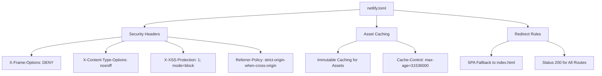
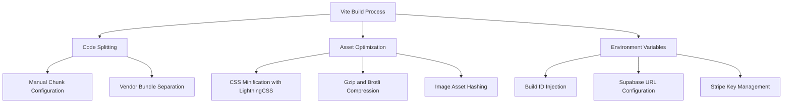
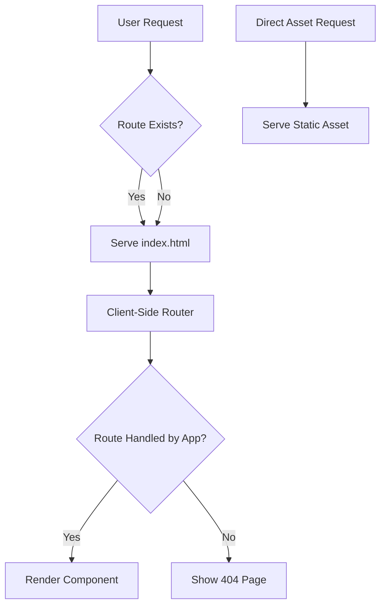
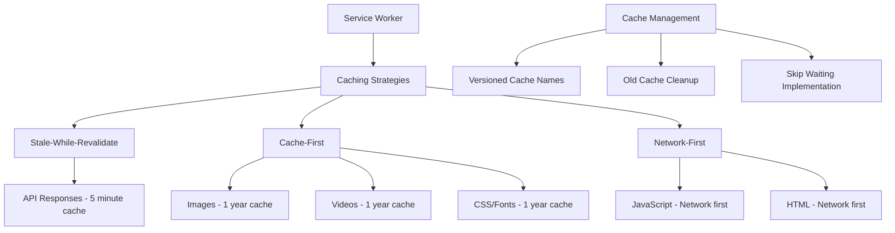
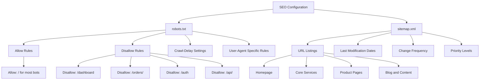
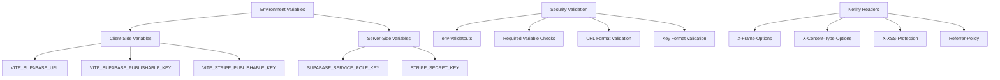
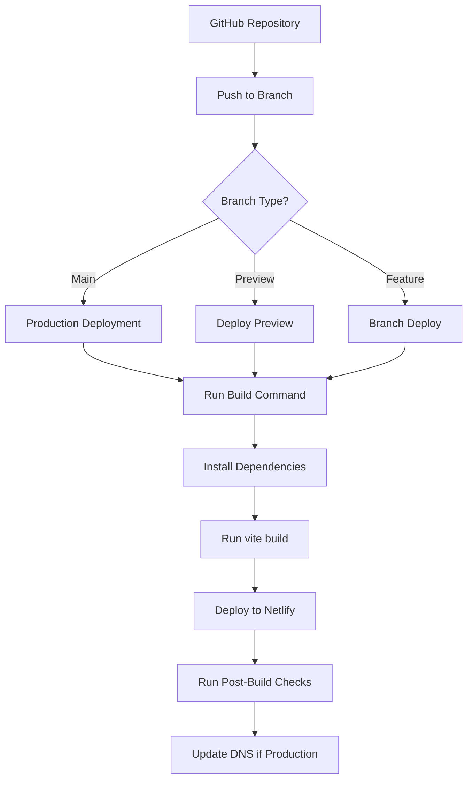

# Netlify Deployment Configuration

<cite>
**Referenced Files in This Document**   
- [netlify.toml](file://netlify.toml)
- [vite.config.ts](file://vite.config.ts)
- [package.json](file://package.json)
- [public/robots.txt](file://public/robots.txt)
- [public/sitemap.xml](file://public/sitemap.xml)
- [public/sw.js](file://public/sw.js)
- [src/lib/env-validator.ts](file://src/lib/env-validator.ts)
- [supabase/config.toml](file://supabase/config.toml)
</cite>

## Table of Contents
1. [Introduction](#introduction)
2. [Netlify Configuration with netlify.toml](#netlify-configuration-with-netlifytoml)
3. [Vite Build Process Integration](#vite-build-process-integration)
4. [Client-Side Routing and Redirects](#client-side-routing-and-redirects)
5. [Service Worker and Offline Support](#service-worker-and-offline-support)
6. [SEO Configuration with robots.txt and sitemap.xml](#seo-configuration-with-robotstxt-and-sitemapxml)
7. [Environment Variables and Security](#environment-variables-and-security)
8. [Common Deployment Issues](#common-deployment-issues)
9. [Continuous Deployment Setup](#continuous-deployment-setup)
10. [Netlify CLI for Local Debugging](#netlify-cli-for-local-debugging)

## Introduction
This document provides comprehensive guidance on configuring Netlify deployment for sleekapp-v100, a React-based web application built with Vite and deployed via Netlify. The configuration focuses on optimizing performance, ensuring proper routing, implementing SEO best practices, and maintaining security through appropriate headers and environment variable management. The deployment setup leverages Netlify's powerful features including serverless functions, asset optimization, and continuous deployment from GitHub.

**Section sources**
- [netlify.toml](file://netlify.toml#L1-L123)
- [README.md](file://README.md#L220-L238)

## Netlify Configuration with netlify.toml

The netlify.toml file serves as the central configuration for Netlify deployment, defining build settings, headers, redirects, and security policies. This configuration ensures optimal performance, security, and proper routing for the React application.



**Diagram sources**
- [netlify.toml](file://netlify.toml#L1-L123)

The configuration implements several key features:

### Security Headers
The deployment enforces strict security headers across all routes:
- X-Frame-Options: DENY prevents clickjacking attacks
- X-Content-Type-Options: nosniff prevents MIME type sniffing
- X-XSS-Protection: enables XSS filtering in browsers
- Referrer-Policy: controls referrer information leakage

### Asset Optimization and Caching
A comprehensive caching strategy is implemented through Cache-Control headers:
- Static assets (JS, CSS, images, fonts, videos) are cached for one year with immutable flag
- HTML files are not cached (max-age=0) to ensure users receive the latest version
- Specific file types are individually configured for optimal caching behavior

### Build Configuration
Although not explicitly defined in netlify.toml, the build process is configured through package.json scripts, with the standard build command being `vite build` which generates optimized production assets in the dist directory.

**Section sources**
- [netlify.toml](file://netlify.toml#L1-L123)
- [package.json](file://package.json#L6-L11)

## Vite Build Process Integration

The Vite build process is tightly integrated with Netlify's deployment pipeline, ensuring optimized assets and efficient builds. The configuration in vite.config.ts defines how the application is compiled and optimized for production.



**Diagram sources**
- [vite.config.ts](file://vite.config.ts#L1-L216)

Key aspects of the Vite integration include:

### Code Splitting and Chunking
The build configuration implements sophisticated code splitting:
- Core libraries (React, ReactDOM) are separated into dedicated chunks
- Routing functionality is isolated for efficient loading
- Heavy libraries (Framer Motion, Recharts) are lazy-loaded
- UI components are grouped by usage frequency and functionality
- Vendor dependencies are bundled separately for better caching

### Asset Optimization
Multiple optimization techniques are applied during the build:
- CSS is minified using LightningCSS for faster processing
- Both Gzip and Brotli compression are enabled for maximum size reduction
- Assets are renamed with content hashes to enable long-term caching
- Small assets (<4KB) are inlined to reduce HTTP requests
- CSS code splitting is disabled to create a single, cacheable CSS file

### Environment Variable Injection
Environment variables are securely injected during the build process:
- Supabase URL and publishable key are defined with defaults
- Stripe publishable key is optionally configured
- A unique build ID is generated for cache invalidation
- Variables are accessible via import.meta.env in the application code

**Section sources**
- [vite.config.ts](file://vite.config.ts#L1-L216)
- [package.json](file://package.json#L6-L11)

## Client-Side Routing and Redirects

The application implements client-side routing using React Router DOM, which requires specific Netlify configuration to handle deep links properly. The redirect rules in netlify.toml ensure that all routes are served through index.html, allowing the client-side router to handle navigation.



**Diagram sources**
- [netlify.toml](file://netlify.toml#L119-L123)
- [vite.config.ts](file://vite.config.ts#L11-L118)

The redirect configuration in netlify.toml contains a single rule that catches all routes:

```toml
[[redirects]]
  from = "/*"
  to = "/index.html"
  status = 200
```

This configuration uses a 200 status code (rather than 301 or 302) to avoid redirect loops and ensure that the client-side router can handle the route. The rule applies to all paths, including API endpoints and asset requests, but Netlify's priority system ensures that existing files (like images, CSS, and JS) are served directly while missing routes are handled by the SPA fallback.

**Section sources**
- [netlify.toml](file://netlify.toml#L119-L123)
- [vite.config.ts](file://vite.config.ts#L11-L118)
- [package.json](file://package.json#L79)

## Service Worker and Offline Support

The application includes a service worker (sw.js) that provides offline support and enhanced performance through strategic caching. This progressive web app (PWA) feature works in conjunction with Netlify's caching to create a robust offline experience.



**Diagram sources**
- [public/sw.js](file://public/sw.js#L1-L220)

The service worker implements multiple caching strategies based on content type:

### Cache Configuration
- **Static Assets**: Images, videos, CSS, and fonts are cached aggressively with a one-year expiration
- **API Calls**: Supabase and API requests use stale-while-revalidate with a 5-minute freshness threshold
- **JavaScript**: Network-first strategy to ensure users receive the latest code
- **HTML**: Network-first with fallback to cache for offline access

### Cache Management
The service worker uses versioned cache names to prevent conflicts during updates:
- CACHE_NAME: For static assets
- RUNTIME_CACHE: For HTML documents
- IMAGE_CACHE: For image files
- ASSET_CACHE: For CSS and font files
- API_CACHE: For API responses

During activation, the service worker cleans up old caches to prevent storage bloat and claims clients immediately to ensure the new version is used.

**Section sources**
- [public/sw.js](file://public/sw.js#L1-L220)
- [netlify.toml](file://netlify.toml#L14-L117)

## SEO Configuration with robots.txt and sitemap.xml

The deployment includes comprehensive SEO configuration through robots.txt and sitemap.xml files, which help search engines discover and index content while respecting privacy and access restrictions.



**Diagram sources**
- [public/robots.txt](file://public/robots.txt#L1-L57)
- [public/sitemap.xml](file://public/sitemap.xml#L1-L331)

### robots.txt Configuration
The robots.txt file implements a sophisticated access control strategy:
- General rules disallow access to sensitive areas (dashboard, orders, auth, API)
- Specific rules for major search engines (Googlebot, Bingbot, Baiduspider)
- Special rules for AI crawlers (GPTBot, Claude-Web) that allow access to AI snapshot pages
- Crawl-delay directives for non-Google search engines to manage server load

### sitemap.xml Structure
The sitemap.xml file provides a comprehensive map of the site's content:
- Includes high-priority pages like the homepage, services, and product categories
- Features SEO-optimized landing pages with priority 1.0
- Contains regularly updated content (blog, success stories) with weekly change frequency
- Lists AI snapshot pages to facilitate AI agent analysis of the site
- Includes location-specific pages (USA buyers, European brands) for targeted SEO

**Section sources**
- [public/robots.txt](file://public/robots.txt#L1-L57)
- [public/sitemap.xml](file://public/sitemap.xml#L1-L331)

## Environment Variables and Security

The deployment configuration emphasizes security through proper environment variable management and header policies. This ensures sensitive information is protected while maintaining application functionality.



**Diagram sources**
- [src/lib/env-validator.ts](file://src/lib/env-validator.ts#L1-L99)
- [netlify.toml](file://netlify.toml#L1-L8)
- [vite.config.ts](file://vite.config.ts#L79-L85)

### Environment Variable Management
The application uses Vite's environment variable system with the VITE_ prefix:
- VITE_SUPABASE_URL: Base URL for Supabase backend
- VITE_SUPABASE_PUBLISHABLE_KEY: Public API key for Supabase
- VITE_STRIPE_PUBLISHABLE_KEY: Public key for Stripe payments
- VITE_BUILD_ID: Unique identifier for cache invalidation

These variables are validated at runtime using the env-validator.ts module, which checks for existence, proper URL formatting, and reasonable key lengths to prevent configuration errors.

### Security Headers
Netlify automatically applies security headers defined in netlify.toml:
- X-Frame-Options prevents iframe embedding and clickjacking
- X-Content-Type-Options prevents MIME type sniffing attacks
- X-XSS-Protection enables browser XSS filters
- Referrer-Policy controls the amount of referrer information sent

**Section sources**
- [src/lib/env-validator.ts](file://src/lib/env-validator.ts#L1-L99)
- [netlify.toml](file://netlify.toml#L1-L8)
- [vite.config.ts](file://vite.config.ts#L79-L85)

## Common Deployment Issues

Several common issues can arise during Netlify deployment, particularly related to routing, environment variables, and caching. Understanding these issues and their solutions is critical for maintaining a stable deployment.

### Redirect Loops
Redirect loops typically occur when the redirect configuration conflicts with the application's routing:
- Ensure the redirect uses status 200, not 301 or 302
- Verify that the redirect pattern "/*" doesn't conflict with static asset serving
- Check that the Vite base configuration matches the deployment URL structure

### Missing Environment Variables in Preview Builds
Preview builds may fail due to missing environment variables:
- Configure environment variables in Netlify's UI for all deployment contexts (Production, Deploy previews, Branch deploys)
- Ensure VITE_ prefix is used for variables that need to be exposed to the client
- Set default values in vite.config.ts for non-sensitive variables
- Use the env-validator to provide clear error messages when variables are missing

### Cache Invalidation After Deployment
Despite proper caching configuration, users may see stale content after deployment:
- The VITE_BUILD_ID variable changes with each build, helping to invalidate HTML cache
- Assets are content-hash named, ensuring new versions bypass cache
- Service worker updates are handled through the skipWaiting mechanism
- Consider using Netlify's cache clearing API for critical updates

**Section sources**
- [netlify.toml](file://netlify.toml#L119-L123)
- [vite.config.ts](file://vite.config.ts#L84)
- [src/lib/env-validator.ts](file://src/lib/env-validator.ts#L29-L48)

## Continuous Deployment Setup

The application can be configured for continuous deployment from GitHub, enabling automated builds and deployments on every push to specific branches.



**Diagram sources**
- [netlify.toml](file://netlify.toml)
- [package.json](file://package.json#L6-L11)

To set up continuous deployment:
1. Connect the GitHub repository to Netlify
2. Configure the build settings:
   - Build command: `npm run build`
   - Publish directory: `dist`
   - Node.js version: Match development environment
3. Set up branch-specific deployments:
   - Main branch → Production
   - Preview branches → Deploy previews
   - Feature branches → Branch deploys
4. Configure environment variables for each context
5. Enable automatic deploys and set up deploy notifications

**Section sources**
- [netlify.toml](file://netlify.toml)
- [package.json](file://package.json#L6-L11)

## Netlify CLI for Local Debugging

The Netlify CLI provides tools for local debugging and testing of the deployment configuration before pushing changes to production.

The CLI allows developers to:
- Test redirect rules locally using `netlify dev`
- Validate headers configuration
- Simulate the production build environment
- Debug serverless functions
- Test form handling and other Netlify-specific features

Key commands include:
- `netlify build` - Run the build process locally
- `netlify dev` - Start a local development server with Netlify features
- `netlify status` - Check account and site information
- `netlify open` - Open the site dashboard in the browser

Using the CLI helps catch configuration issues early and ensures that the local development experience closely matches the production deployment.

**Section sources**
- [netlify.toml](file://netlify.toml)
- [vite.config.ts](file://vite.config.ts)
- [package.json](file://package.json)