# Vercel Deployment Configuration

<cite>
**Referenced Files in This Document**
- [vercel.json](file://vercel.json)
- [vite.config.ts](file://vite.config.ts)
- [package.json](file://package.json)
- [src/lib/env-validator.ts](file://src/lib/env-validator.ts)
- [src/integrations/supabase/client.ts](file://src/integrations/supabase/client.ts)
- [update-supabase-key.sh](file://update-supabase-key.sh)
- [supabase/functions/ai-quote-generator/index.ts](file://supabase/functions/ai-quote-generator/index.ts)
- [supabase/functions/submit-quote/index.ts](file://supabase/functions/submit-quote/index.ts)
- [supabase/functions/health/index.ts](file://supabase/functions/health/index.ts)
- [netlify.toml](file://netlify.toml)
- [public/sw.js](file://public/sw.js)
- [README.md](file://README.md)
- [DEPLOYMENT_SUMMARY.md](file://DEPLOYMENT_SUMMARY.md)
</cite>

## Table of Contents
1. [Introduction](#introduction)
2. [Vercel Configuration Overview](#vercel-configuration-overview)
3. [Edge Functions Setup](#edge-functions-setup)
4. [Build Configuration](#build-configuration)
5. [Environment Variables](#environment-variables)
6. [Rewrite Rules and Routing](#rewrite-rules-and-routing)
7. [Static Asset Optimization](#static-asset-optimization)
8. [Preview Deployments](#preview-deployments)
9. [Common Issues and Solutions](#common-issues-and-solutions)
10. [Deployment Workflow](#deployment-workflow)
11. [Debugging and Monitoring](#debugging-and-monitoring)

## Introduction

The sleekapp-v100 project utilizes Vercel for deployment, leveraging its edge functions, automatic preview deployments, and optimized static asset delivery. This comprehensive guide covers the Vercel configuration, edge function implementation, and deployment best practices for the React application built with Vite and Supabase integration.

Vercel's platform provides several advantages for this project:
- **Edge Functions**: Serverless functions for API routing and backend logic
- **Automatic Preview Deployments**: Pull request-based staging environments
- **Global CDN**: Fast content delivery worldwide
- **Zero-Config Builds**: Seamless integration with Vite and React
- **Custom Domains**: Flexible domain management

## Vercel Configuration Overview

The Vercel deployment configuration is defined in the `vercel.json` file, which serves as the central configuration hub for the deployment pipeline.

### Basic Configuration Structure

The current Vercel configuration is minimal but effective:

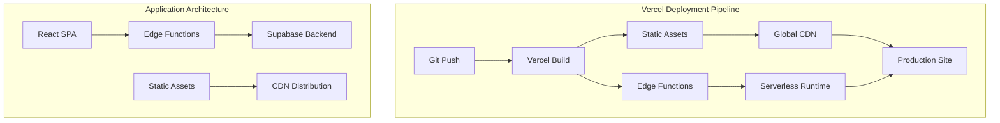

**Diagram sources**
- [vercel.json](file://vercel.json#L1-L6)
- [vite.config.ts](file://vite.config.ts#L1-L216)

**Section sources**
- [vercel.json](file://vercel.json#L1-L6)
- [vite.config.ts](file://vite.config.ts#L1-L216)

## Edge Functions Setup

The project leverages Supabase edge functions integrated with Vercel's serverless platform. These functions handle API routes, business logic, and backend operations.

### Edge Function Architecture

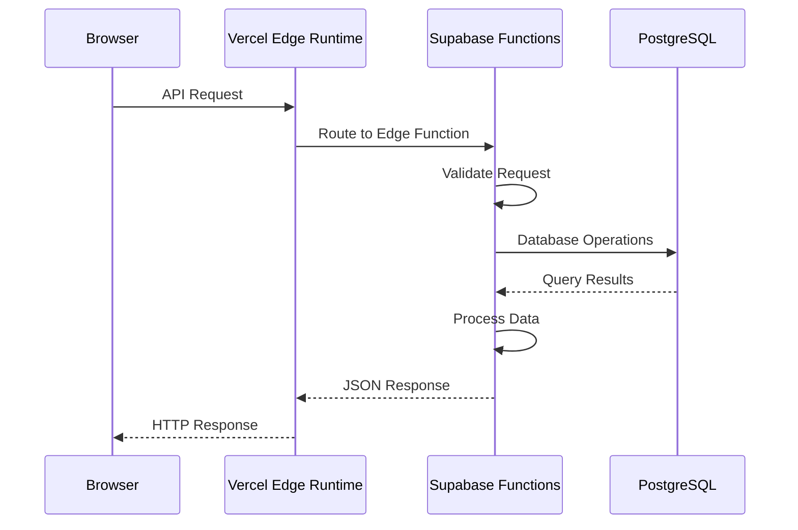

**Diagram sources**
- [supabase/functions/ai-quote-generator/index.ts](file://supabase/functions/ai-quote-generator/index.ts#L1-L753)
- [supabase/functions/submit-quote/index.ts](file://supabase/functions/submit-quote/index.ts#L1-L222)

### Available Edge Functions

The project includes numerous edge functions organized by functionality:

| Function Category | Functions | Purpose |
|------------------|-----------|---------|
| **AI Services** | `ai-quote-generator`, `ai-conversational-quote`, `ai-design-generator` | AI-powered quote generation and design assistance |
| **Business Logic** | `submit-quote`, `convert-quote-to-order`, `send-otp` | Quote processing and user authentication |
| **Data Management** | `generate-invoice`, `track-product-interaction`, `analytics-service` | Business intelligence and reporting |
| **Communication** | `email-service`, `send-resource-email`, `resend-webhook` | Email automation and webhook handling |
| **Automation** | `execute-automation-rules`, `batch-processor`, `bootstrap-admin` | System automation and maintenance |

### Edge Function Implementation Details

Each edge function follows a consistent pattern for security, validation, and error handling:

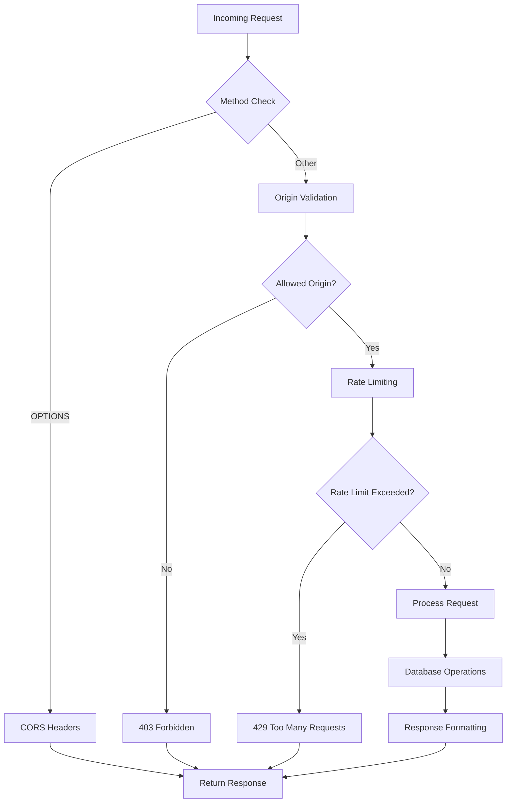

**Diagram sources**
- [supabase/functions/ai-quote-generator/index.ts](file://supabase/functions/ai-quote-generator/index.ts#L131-L202)
- [supabase/functions/submit-quote/index.ts](file://supabase/functions/submit-quote/index.ts#L44-L114)

**Section sources**
- [supabase/functions/ai-quote-generator/index.ts](file://supabase/functions/ai-quote-generator/index.ts#L1-L753)
- [supabase/functions/submit-quote/index.ts](file://supabase/functions/submit-quote/index.ts#L1-L222)

## Build Configuration

The Vite configuration drives the build process, optimizing the application for production deployment on Vercel.

### Build Optimization Strategy

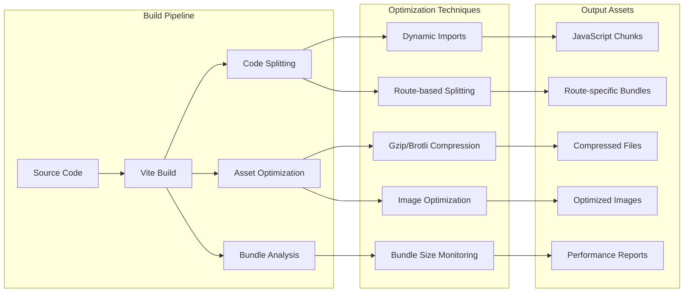

**Diagram sources**
- [vite.config.ts](file://vite.config.ts#L86-L210)

### Key Build Configurations

The Vite configuration implements several optimization strategies:

| Configuration | Purpose | Impact |
|--------------|---------|--------|
| **Code Splitting** | Reduces initial bundle size | Faster page loads |
| **Asset Optimization** | Minifies and compresses resources | Reduced bandwidth usage |
| **Tree Shaking** | Removes unused code | Smaller bundle sizes |
| **Caching Strategy** | Long-term caching for static assets | Improved repeat visits |

### Environment-Specific Builds

The build process adapts to different environments:

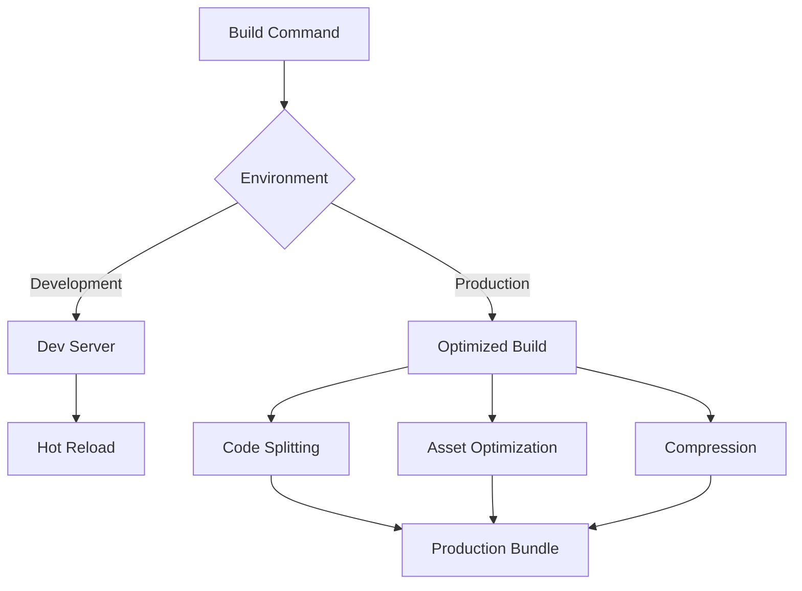

**Diagram sources**
- [vite.config.ts](file://vite.config.ts#L11-L216)

**Section sources**
- [vite.config.ts](file://vite.config.ts#L1-L216)
- [package.json](file://package.json#L1-L115)

## Environment Variables

Proper environment variable configuration is crucial for Supabase integration and application functionality.

### Supabase Configuration

The application requires specific environment variables for Supabase integration:

| Variable | Purpose | Example Value |
|----------|---------|---------------|
| `VITE_SUPABASE_URL` | Supabase project URL | `https://eqpftggctumujhutomom.supabase.co` |
| `VITE_SUPABASE_PUBLISHABLE_KEY` | Public API key | `eyJhbGciOiJIUzI1NiIsInR5cCI6IkpXVCJ9...` |
| `VITE_STRIPE_PUBLISHABLE_KEY` | Payment processing | `pk_test_...` |

### Environment Validation

The application includes comprehensive environment validation:

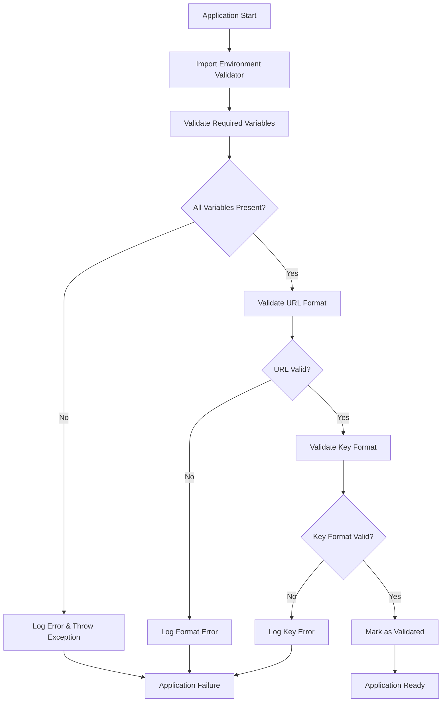

**Diagram sources**
- [src/lib/env-validator.ts](file://src/lib/env-validator.ts#L29-L48)

### Secure Environment Management

The project provides secure environment variable management:

**Section sources**
- [src/lib/env-validator.ts](file://src/lib/env-validator.ts#L1-L142)
- [src/integrations/supabase/client.ts](file://src/integrations/supabase/client.ts#L1-L20)
- [update-supabase-key.sh](file://update-supabase-key.sh#L1-L54)

## Rewrite Rules and Routing

Vercel's rewrite configuration enables seamless React Router integration while maintaining clean URLs.

### SPA Routing Configuration

The current rewrite configuration handles single-page application routing:

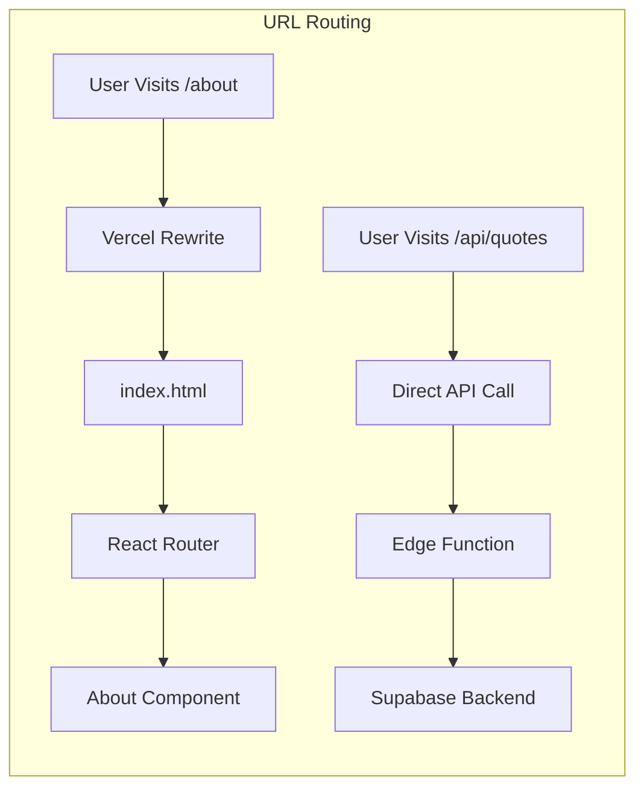

**Diagram sources**
- [vercel.json](file://vercel.json#L2-L4)

### Route Handling Strategy

The application employs a hybrid routing approach:

| Route Pattern | Handler | Purpose |
|--------------|---------|---------|
| `/api/*` | Edge Functions | Backend API endpoints |
| `/*` | SPA Router | Client-side routing |
| `/static/*` | Static Assets | Optimized resource delivery |

### API Route Implementation

Edge functions serve as the backend API layer:

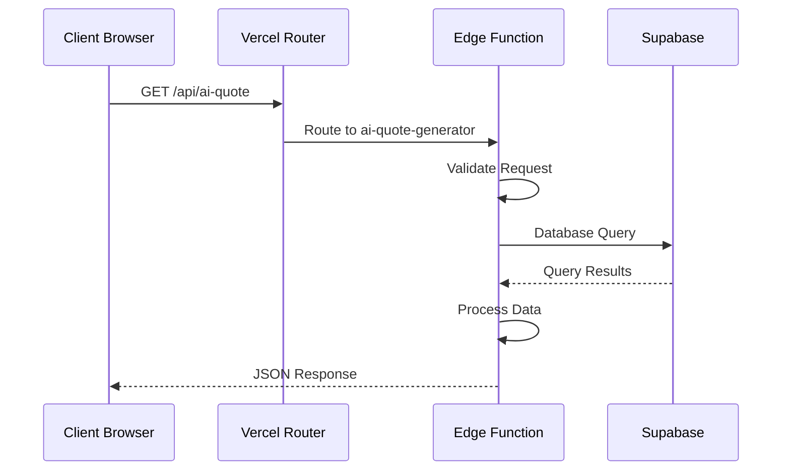

**Diagram sources**
- [supabase/functions/ai-quote-generator/index.ts](file://supabase/functions/ai-quote-generator/index.ts#L254-L257)

**Section sources**
- [vercel.json](file://vercel.json#L1-L6)
- [supabase/functions/ai-quote-generator/index.ts](file://supabase/functions/ai-quote-generator/index.ts#L254-L257)

## Static Asset Optimization

Vercel automatically optimizes static assets for performance and efficient delivery.

### Asset Optimization Strategy

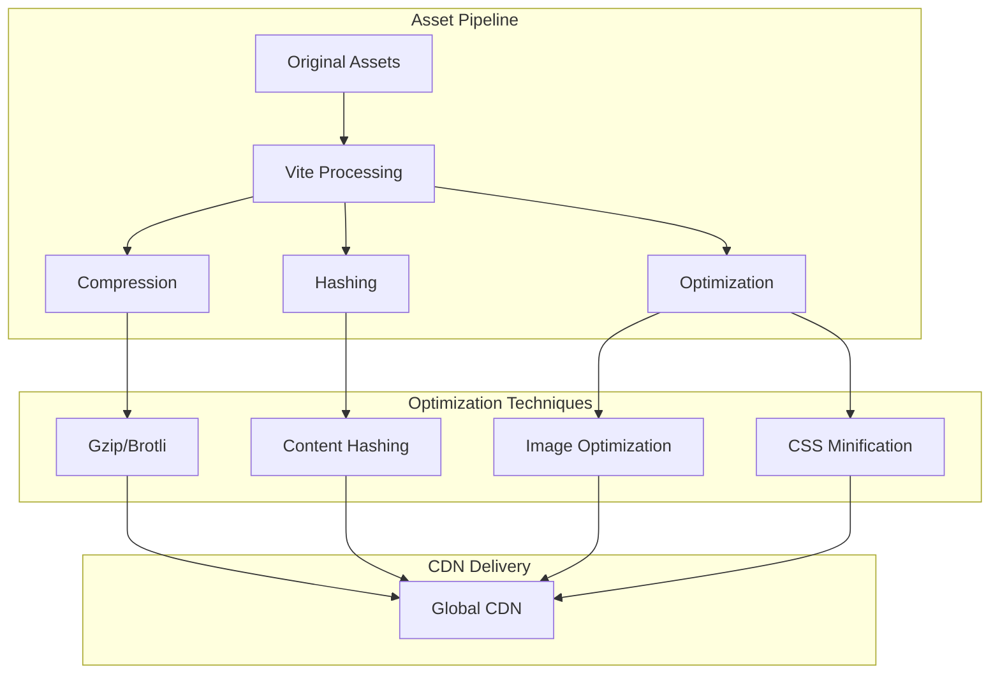

**Diagram sources**
- [vite.config.ts](file://vite.config.ts#L195-L207)

### Cache-Control Headers

The application implements sophisticated caching strategies:

| Asset Type | Cache Duration | Strategy |
|------------|---------------|----------|
| JavaScript | 1 year | Immutable caching |
| CSS | 1 year | Immutable caching |
| Images | 1 year | Immutable caching |
| Fonts | 1 year | Immutable caching |
| HTML | 0 seconds | Must-revalidate |

### Service Worker Integration

The project includes a service worker for advanced caching:

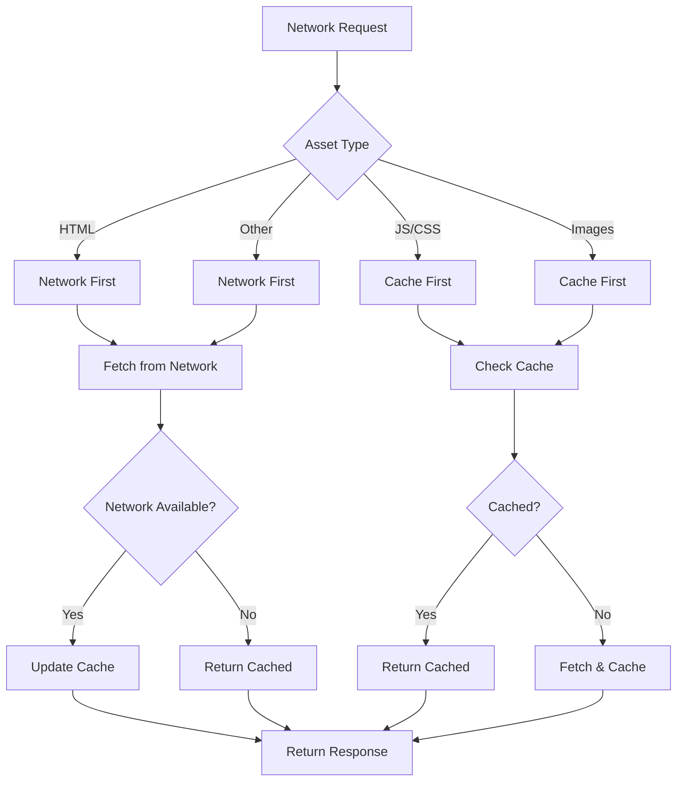

**Diagram sources**
- [public/sw.js](file://public/sw.js#L119-L219)

**Section sources**
- [vite.config.ts](file://vite.config.ts#L195-L207)
- [public/sw.js](file://public/sw.js#L119-L219)
- [netlify.toml](file://netlify.toml#L1-L122)

## Preview Deployments

Vercel's preview deployment system enables safe testing of pull requests before merging.

### Preview Deployment Workflow

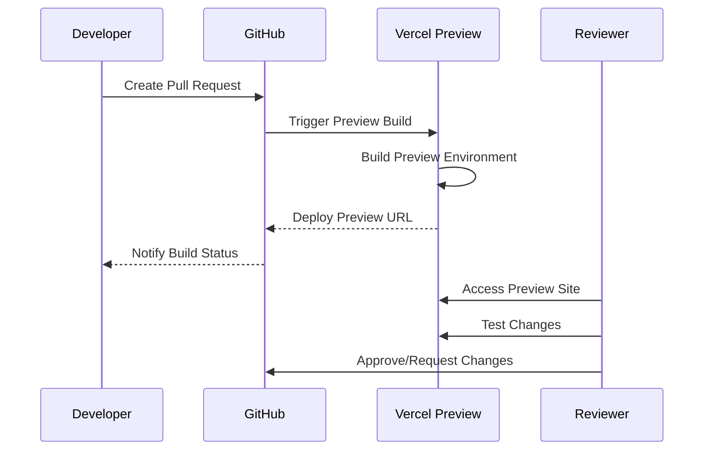

### Preview Environment Benefits

Preview deployments provide several advantages:

| Benefit | Description | Impact |
|---------|-------------|--------|
| **Isolation** | Separate environment per PR | Prevents breaking main branch |
| **Testing** | Full-stack testing capabilities | Ensures quality before merge |
| **Collaboration** | Shareable preview URLs | Facilitates team review |
| **Rollback** | Easy to discard changes | Reduces risk of bad merges |

### Configuration for Preview Deployments

The Vercel configuration supports preview deployments through:

- **Automatic Build Triggers**: Vercel monitors GitHub for new pull requests
- **Environment Isolation**: Each preview gets its own environment variables
- **Cleanup**: Automatic cleanup of preview environments after PR closure

**Section sources**
- [README.md](file://README.md#L228-L238)

## Common Issues and Solutions

Understanding common deployment issues helps prevent downtime and ensures smooth operations.

### Build Failures

Common build issues and solutions:

| Issue | Cause | Solution |
|-------|-------|---------|
| **Module Resolution** | Missing dependencies | Run `npm install` before build |
| **TypeScript Errors** | Type mismatches | Fix type errors in source code |
| **Asset Loading** | Incorrect asset paths | Verify asset import paths |
| **Environment Variables** | Missing variables | Set required environment variables |

### Runtime Errors

Edge function runtime issues:

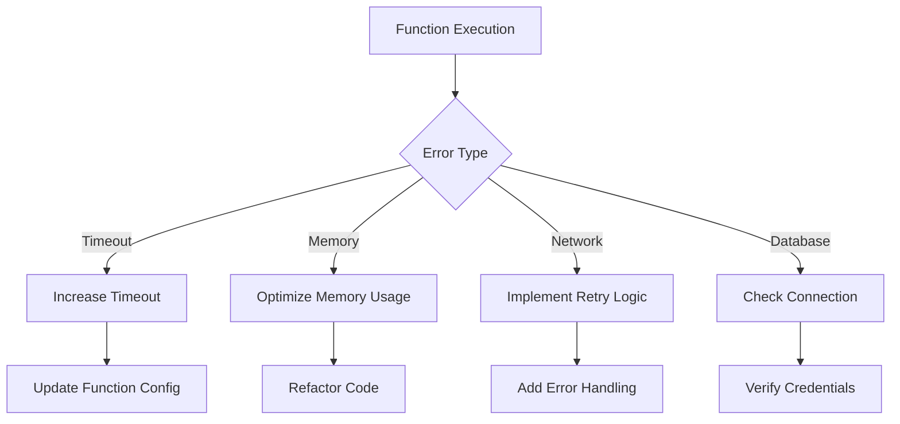

### Deployment Issues

Common deployment problems:

| Problem | Symptoms | Resolution |
|---------|----------|------------|
| **404 Errors** | Pages not found | Check rewrite rules |
| **CORS Issues** | API requests blocked | Configure allowed origins |
| **Environment Scoping** | Variables not available | Verify Vercel environment setup |
| **Cache Problems** | Stale content | Clear Vercel cache |

### Performance Issues

Optimization strategies for common performance problems:

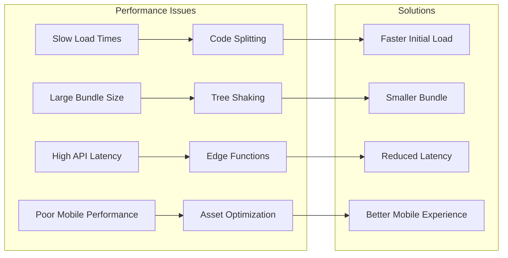

**Section sources**
- [src/lib/env-validator.ts](file://src/lib/env-validator.ts#L29-L48)
- [supabase/functions/ai-quote-generator/index.ts](file://supabase/functions/ai-quote-generator/index.ts#L228-L245)

## Deployment Workflow

The deployment process combines automated CI/CD with manual oversight for reliability.

### Automated Deployment Pipeline

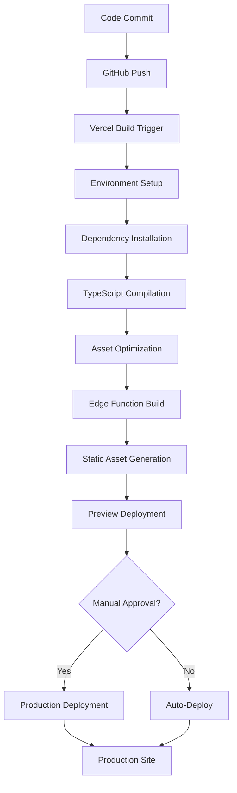

### Deployment Commands

Standard deployment commands for different scenarios:

| Scenario | Command | Purpose |
|----------|---------|---------|
| **Development** | `npm run dev` | Local development server |
| **Build** | `npm run build` | Production build |
| **Preview** | Automatic | Pull request previews |
| **Production** | Vercel auto-deploy | Main branch deployment |

### Environment Management

The project uses environment-specific configurations:

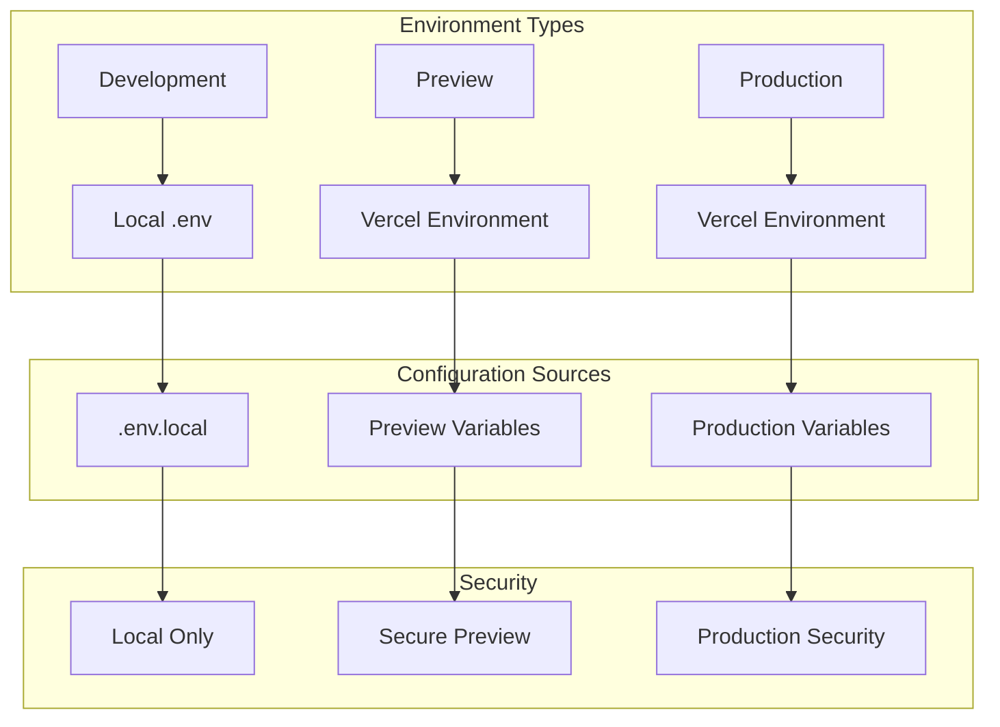

**Section sources**
- [README.md](file://README.md#L228-L238)
- [DEPLOYMENT_SUMMARY.md](file://DEPLOYMENT_SUMMARY.md#L1-L371)

## Debugging and Monitoring

Effective debugging and monitoring ensure reliable operation and quick issue resolution.

### Logging Strategy

Edge functions implement comprehensive logging:

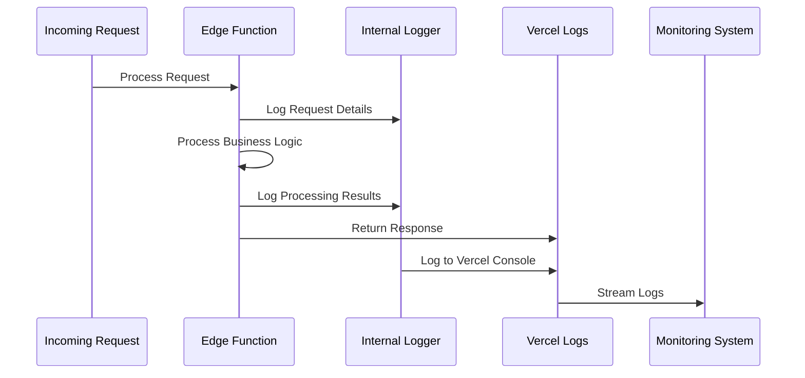

### Error Monitoring

The application implements structured error handling:

| Error Type | Logging Level | Recovery Strategy |
|------------|---------------|-------------------|
| **Validation Errors** | INFO | Return formatted error to client |
| **Database Errors** | ERROR | Log details, return generic error |
| **Rate Limiting** | WARN | Log attempt, return 429 |
| **Unexpected Errors** | ERROR | Log stack trace, return 500 |

### Performance Monitoring

Key performance metrics tracked:

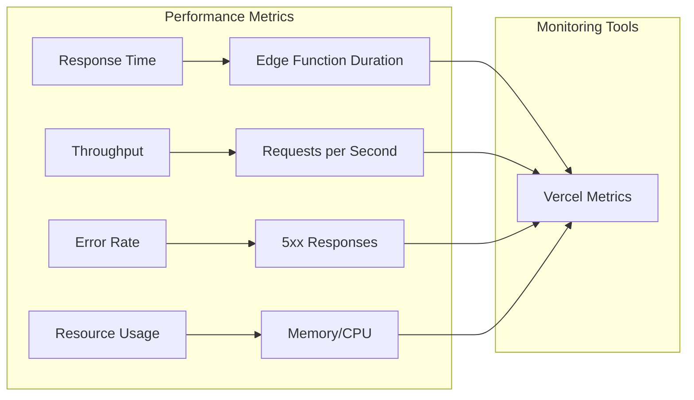

### Debugging Tools

Available debugging capabilities:

| Tool | Purpose | Access |
|------|---------|--------|
| **Vercel Logs** | Function execution logs | Vercel Dashboard |
| **Browser DevTools** | Client-side debugging | Browser Console |
| **Network Tab** | API request inspection | Browser Network |
| **Application Logs** | Custom application logging | Vercel Logs |

### Troubleshooting Checklist

Common troubleshooting steps:

1. **Check Vercel Dashboard**: Verify build status and function logs
2. **Review Environment Variables**: Ensure all required variables are set
3. **Test Edge Functions**: Use Vercel CLI to test functions locally
4. **Validate API Endpoints**: Test individual API routes
5. **Monitor Performance**: Check response times and error rates
6. **Review Cache Settings**: Verify asset caching behavior

**Section sources**
- [supabase/functions/health/index.ts](file://supabase/functions/health/index.ts#L1-L33)
- [DEPLOYMENT_SUMMARY.md](file://DEPLOYMENT_SUMMARY.md#L1-L371)

## Conclusion

The Vercel deployment configuration for sleekapp-v100 provides a robust foundation for scalable, performant web applications. The combination of edge functions, optimized builds, and comprehensive monitoring creates a reliable platform for production use.

Key success factors include:

- **Minimal Configuration**: Clean, maintainable Vercel configuration
- **Edge Function Integration**: Seamless backend API implementation
- **Performance Optimization**: Aggressive caching and asset optimization
- **Developer Experience**: Smooth preview deployments and debugging tools
- **Reliability**: Comprehensive error handling and monitoring

This configuration serves as a template for similar React applications requiring serverless backend capabilities and global performance optimization.