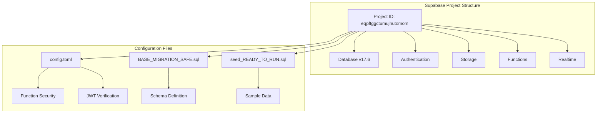
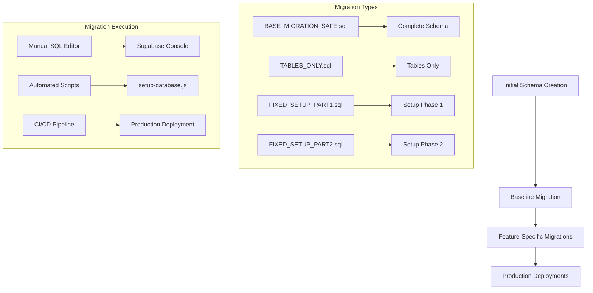
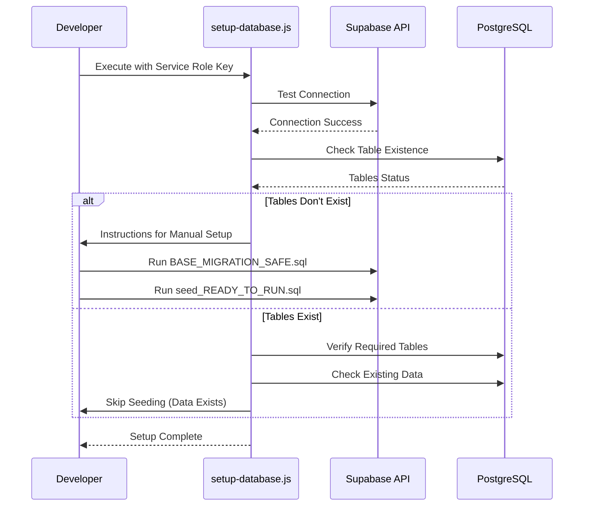
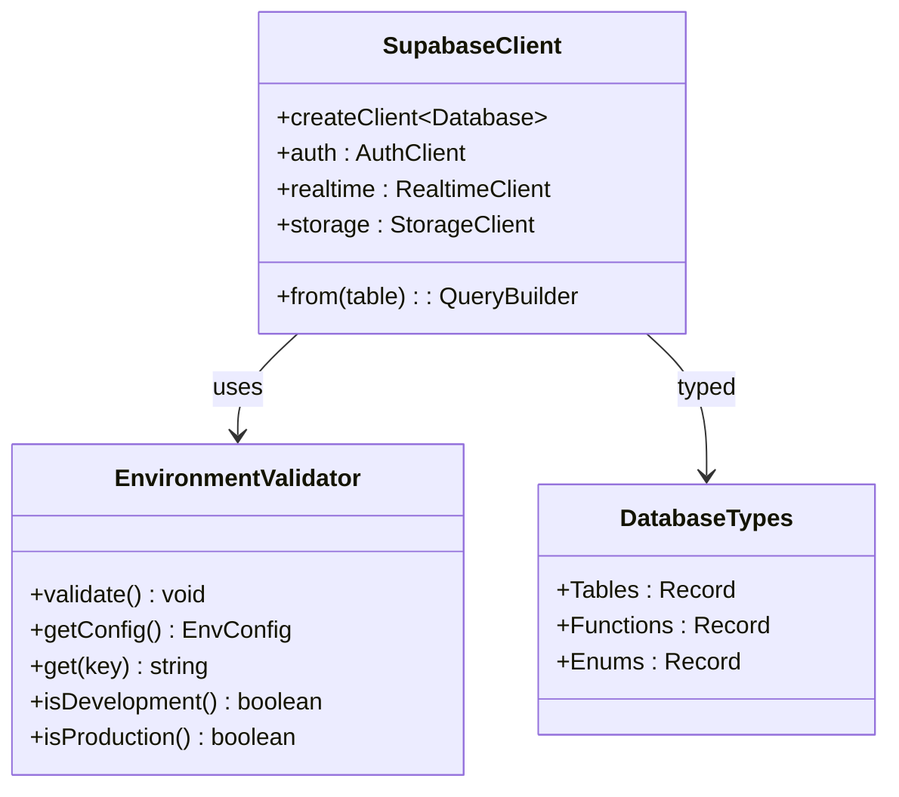
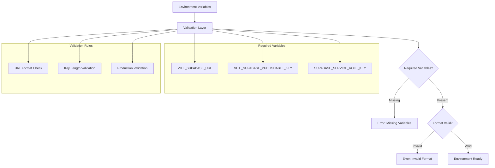

# Supabase Backend Deployment

<cite>
**Referenced Files in This Document**
- [supabase/config.toml](file://supabase/config.toml)
- [scripts/setup-database.js](file://scripts/setup-database.js)
- [src/integrations/supabase/client.ts](file://src/integrations/supabase/client.ts)
- [src/integrations/supabase/types.ts](file://src/integrations/supabase/types.ts)
- [src/lib/env-validator.ts](file://src/lib/env-validator.ts)
- [supabase/seed.sql](file://supabase/seed.sql)
- [supabase/seed_READY_TO_RUN.sql](file://supabase/seed_READY_TO_RUN.sql)
- [supabase/migrations/20250122000000_create_marketplace_system.sql](file://supabase/migrations/20250122000000_create_marketplace_system.sql)
- [supabase/BASE_MIGRATION_SAFE.sql](file://supabase/BASE_MIGRATION_SAFE.sql)
- [supabase/TABLES_ONLY.sql](file://supabase/TABLES_ONLY.sql)
- [supabase/FIXED_SETUP_PART1.sql](file://supabase/FIXED_SETUP_PART1.sql)
- [supabase/functions/bootstrap-admin/index.ts](file://supabase/functions/bootstrap-admin/index.ts)
- [update-supabase-key.sh](file://update-supabase-key.sh)
- [package.json](file://package.json)
</cite>

## Table of Contents
1. [Introduction](#introduction)
2. [Supabase Project Configuration](#supabase-project-configuration)
3. [Database Migration Management](#database-migration-management)
4. [Database Initialization Script](#database-initialization-script)
5. [Frontend Integration](#frontend-integration)
6. [Environment Configuration](#environment-configuration)
7. [Security and Authentication](#security-and-authentication)
8. [Common Issues and Solutions](#common-issues-and-solutions)
9. [Deployment Best Practices](#deployment-best-practices)
10. [Troubleshooting Guide](#troubleshooting-guide)

## Introduction

SleekApparels v100 utilizes Supabase as its primary backend infrastructure, providing a comprehensive solution for database management, authentication, real-time features, and serverless functions. This documentation covers the complete Supabase deployment process, from initial configuration to production deployment, including migration management, security considerations, and troubleshooting common issues.

The application implements a sophisticated B2B marketplace system with supplier management, product listings, order processing, and advanced AI-powered quote generation capabilities. Supabase serves as the backbone for all data persistence, user authentication, and real-time communication needs.

## Supabase Project Configuration

### Project Settings and Database Version

The Supabase project is configured with specific settings optimized for the SleekApparels marketplace ecosystem. The project uses PostgreSQL 17.6 as the underlying database engine, providing advanced features like JSONB support, full-text search, and sophisticated indexing capabilities.

**Diagram sources**
- [supabase/config.toml](file://supabase/config.toml#L1-L73)
- [supabase/BASE_MIGRATION_SAFE.sql](file://supabase/BASE_MIGRATION_SAFE.sql#L1-L200)

### Storage Policies and Access Control

The storage configuration implements granular access controls for different user roles within the marketplace ecosystem. The system supports:

- **Public storage** for marketplace product images and blog media
- **Private storage** for supplier documents and sensitive data
- **Role-based access** through Supabase Row Level Security (RLS)
- **Automatic cleanup** policies for temporary files

**Section sources**
- [supabase/config.toml](file://supabase/config.toml#L1-L73)
- [supabase/BASE_MIGRATION_SAFE.sql](file://supabase/BASE_MIGRATION_SAFE.sql#L1-L200)

## Database Migration Management

### Migration Workflow Architecture

The migration system follows a structured approach to ensure schema consistency across development, staging, and production environments. The migration files are organized chronologically with specific naming conventions to track changes systematically.

**Diagram sources**
- [supabase/BASE_MIGRATION_SAFE.sql](file://supabase/BASE_MIGRATION_SAFE.sql#L1-L200)
- [supabase/TABLES_ONLY.sql](file://supabase/TABLES_ONLY.sql#L1-L200)
- [supabase/FIXED_SETUP_PART1.sql](file://supabase/FIXED_SETUP_PART1.sql#L1-L200)

### Schema Consistency Management

The migration system implements several strategies to maintain schema consistency:

1. **Version-controlled migrations**: Each change is tracked with timestamps and logical names
2. **Incremental updates**: New features are added through separate migration files
3. **Rollback capabilities**: Previous states can be restored using migration history
4. **Environment synchronization**: Development and production schemas remain aligned

### Migration Conflict Resolution

When conflicts arise during migration execution, the system employs several resolution strategies:

- **Timestamp-based ordering**: Migrations execute in chronological order
- **Conditional statements**: `IF NOT EXISTS` clauses prevent duplicate object creation
- **Constraint validation**: Foreign key relationships are verified before deployment
- **Index management**: Composite indexes are created after table structures are established

**Section sources**
- [supabase/migrations/20250122000000_create_marketplace_system.sql](file://supabase/migrations/20250122000000_create_marketplace_system.sql#L1-L200)
- [supabase/BASE_MIGRATION_SAFE.sql](file://supabase/BASE_MIGRATION_SAFE.sql#L1-L200)

## Database Initialization Script

### Automated Setup Process

The `setup-database.js` script provides a comprehensive automated solution for database initialization, handling both schema creation and data seeding. The script implements a multi-stage approach to ensure reliable deployment across different environments.

**Diagram sources**
- [scripts/setup-database.js](file://scripts/setup-database.js#L1-L308)

### Service Role Key Authentication

The initialization script requires a Service Role Key for bypassing Row Level Security restrictions during the setup phase. This key provides administrative privileges necessary for:

- Creating database schemas and tables
- Executing DDL statements that modify structure
- Seeding initial data without authentication overhead
- Managing database permissions and constraints

### Data Seeding Strategies

The system supports multiple seeding approaches depending on the deployment stage:

1. **Minimal seeding**: Essential data for basic functionality
2. **Comprehensive seeding**: Full dataset with realistic test data
3. **Custom seeding**: Environment-specific data tailored to requirements

**Section sources**
- [scripts/setup-database.js](file://scripts/setup-database.js#L1-L308)
- [supabase/seed_READY_TO_RUN.sql](file://supabase/seed_READY_TO_RUN.sql#L1-L200)

## Frontend Integration

### Supabase Client Configuration

The frontend integration utilizes a centralized client configuration that handles authentication, real-time subscriptions, and API interactions seamlessly. The client is configured with environment-specific settings and implements robust error handling.

**Diagram sources**
- [src/integrations/supabase/client.ts](file://src/integrations/supabase/client.ts#L1-L20)
- [src/lib/env-validator.ts](file://src/lib/env-validator.ts#L1-L143)
- [src/integrations/supabase/types.ts](file://src/integrations/supabase/types.ts#L1-L800)

### Type Safety Implementation

The TypeScript integration provides comprehensive type safety across the entire application stack. The generated types ensure:

- **Compile-time validation** of database queries
- **IntelliSense support** for table relationships
- **Automatic type inference** for complex JSONB structures
- **Runtime type checking** for API responses

### Real-time Feature Integration

The frontend leverages Supabase's real-time capabilities for:

- **Live chat conversations** between buyers and suppliers
- **Order status updates** with instant notifications
- **Inventory level changes** reflected immediately
- **Marketplace activity feeds** showing real-time interactions

**Section sources**
- [src/integrations/supabase/client.ts](file://src/integrations/supabase/client.ts#L1-L20)
- [src/integrations/supabase/types.ts](file://src/integrations/supabase/types.ts#L1-L800)
- [src/lib/env-validator.ts](file://src/lib/env-validator.ts#L1-L143)

## Environment Configuration

### Environment Variable Management

The application implements a robust environment validation system that ensures proper configuration across all deployment environments. The validation system checks for required variables and performs format validation.

**Diagram sources**
- [src/lib/env-validator.ts](file://src/lib/env-validator.ts#L1-L143)

### Development vs Production Configuration

The system automatically adapts its behavior based on the environment:

- **Development mode**: Relaxed validation, automatic reloading, detailed logging
- **Production mode**: Strict validation, error reporting, performance optimization
- **Test mode**: Mocked services, isolated testing environment

### Secure Key Management

The deployment process includes secure key management practices:

- **Service Role Keys**: Used exclusively for database administration tasks
- **Publishable Keys**: Distributed to frontend applications for read/write operations
- **Secret Rotation**: Regular key rotation policies for enhanced security
- **Environment Isolation**: Separate keys for each deployment environment

**Section sources**
- [src/lib/env-validator.ts](file://src/lib/env-validator.ts#L1-L143)
- [update-supabase-key.sh](file://update-supabase-key.sh#L1-L54)

## Security and Authentication

### Function Security Configuration

The Supabase configuration implements granular security controls for serverless functions, ensuring that only authorized requests can access sensitive operations.

| Function | JWT Verification | Purpose |
|----------|------------------|---------|
| generate-invoice | ✅ Required | Invoice generation with authentication |
| ai-design-generator | ✅ Required | AI-powered design generation |
| admin-check | ✅ Required | Administrative function access |
| stripe-webhook | ❌ Disabled | Payment processing webhook |
| bootstrap-admin | ❌ Disabled | Initial admin setup |

### Role-Based Access Control

The system implements comprehensive RBAC through Supabase's Row Level Security:

- **Buyer roles**: Retailers, wholesalers, educational institutions, corporate buyers
- **Supplier roles**: Manufacturers, distributors, specialty suppliers
- **Administrative roles**: System administrators, content managers
- **Guest roles**: Anonymous visitors and temporary users

### Rate Limiting and Protection

Multiple layers of protection prevent abuse and ensure system stability:

- **IP-based rate limiting**: Prevents brute force attacks and spam
- **Session-based limits**: Protects against excessive API usage
- **Token validation**: Ensures only legitimate requests are processed
- **CORS protection**: Restricts cross-origin requests to trusted domains

**Section sources**
- [supabase/config.toml](file://supabase/config.toml#L1-L73)
- [supabase/functions/bootstrap-admin/index.ts](file://supabase/functions/bootstrap-admin/index.ts#L1-L178)

## Common Issues and Solutions

### Migration Conflicts

**Issue**: Migration execution fails due to conflicting schema changes
**Solution**: 
1. Review migration history for conflicts
2. Use `IF NOT EXISTS` clauses in migration scripts
3. Manually resolve conflicts in development environment
4. Create rollback migrations for safe recovery

### Seed Data Inconsistencies

**Issue**: Sample data doesn't match expected structure
**Solution**:
1. Verify user UUIDs in seed files match actual database records
2. Check for missing foreign key relationships
3. Ensure proper ordering of data insertion
4. Use the `seed_READY_TO_RUN.sql` file with updated UUIDs

### Connection Pool Limits

**Issue**: Database connections exceed maximum limit
**Solution**:
1. Monitor connection usage patterns
2. Implement connection pooling in application layer
3. Optimize query performance to reduce connection time
4. Increase pool size if necessary (within database limits)

### Authentication Failures

**Issue**: Users cannot authenticate or access protected resources
**Solution**:
1. Verify JWT token configuration
2. Check user role assignments
3. Validate authentication hooks
4. Review CORS settings for frontend applications

**Section sources**
- [scripts/setup-database.js](file://scripts/setup-database.js#L1-L308)
- [supabase/seed.sql](file://supabase/seed.sql#L1-L800)

## Deployment Best Practices

### Environment-Specific Configurations

Each deployment environment requires specific configuration adjustments:

- **Development**: Local database connection, debug logging, relaxed security
- **Staging**: Production-like configuration, feature flags enabled
- **Production**: Optimized settings, strict security, monitoring enabled

### CI/CD Integration

The deployment pipeline should include:

1. **Automated testing** of database migrations
2. **Schema validation** before deployment
3. **Backup creation** before major changes
4. **Rollback procedures** for failed deployments

### Monitoring and Maintenance

Regular maintenance tasks include:

- **Performance monitoring** of database queries
- **Log analysis** for error patterns
- **Security audits** of access patterns
- **Capacity planning** for growth projections

## Troubleshooting Guide

### Database Connection Issues

**Problem**: Application cannot connect to Supabase database
**Diagnostic Steps**:
1. Verify network connectivity to Supabase endpoint
2. Check service role key validity
3. Confirm database credentials
4. Review firewall and security group settings

### Migration Execution Failures

**Problem**: SQL migrations fail during deployment
**Resolution Process**:
1. Examine migration logs for specific errors
2. Test individual migration scripts manually
3. Verify database permissions and constraints
4. Check for conflicting concurrent migrations

### Performance Degradation

**Problem**: Slow query performance or timeouts
**Optimization Strategies**:
1. Analyze query execution plans
2. Add appropriate indexes for frequently queried columns
3. Review and optimize complex JOIN operations
4. Consider database scaling options

### Authentication Problems

**Problem**: Users unable to authenticate or access resources
**Investigation Checklist**:
1. Verify JWT token configuration
2. Check user account status and roles
3. Review authentication hooks and triggers
4. Confirm CORS and origin settings

**Section sources**
- [scripts/setup-database.js](file://scripts/setup-database.js#L1-L308)
- [src/lib/env-validator.ts](file://src/lib/env-validator.ts#L1-L143)