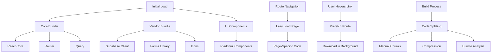

# Directory Structure Breakdown

<cite>
**Referenced Files in This Document**   
- [README.md](file://README.md)
- [package.json](file://package.json)
- [vite.config.ts](file://vite.config.ts)
- [App.tsx](file://src/App.tsx)
- [main.tsx](file://src/main.tsx)
- [lazyLoadRoutes.ts](file://src/lib/lazyLoadRoutes.ts)
- [routePrefetch.ts](file://src/lib/routePrefetch.ts)
- [client.ts](file://src/integrations/supabase/client.ts)
- [database.ts](file://src/types/database.ts)
- [index.ts](file://supabase/functions/ai-quote-generator/index.ts)
</cite>

## Table of Contents
1. [Top-Level Directory Organization](#top-level-directory-organization)
2. [Source Code Structure (src/)](#source-code-structure-src)
3. [Component Organization by Feature](#component-organization-by-feature)
4. [Separation of Concerns](#separation-of-concerns)
5. [Code Splitting and Lazy Loading Implementation](#code-splitting-and-lazy-loading-implementation)
6. [Backend Configuration (supabase/)](#backend-configuration-supabase)

## Top-Level Directory Organization

The project follows a well-structured directory organization that separates concerns between static assets, utility scripts, source code, and backend configuration. The top-level directories serve distinct purposes:

- **public/**: Contains static assets that are served directly to the client without processing. This includes essential files like `robots.txt` for search engine crawling, `sitemap.xml` for SEO, `sw.js` for service worker functionality, and various marketing documents like the company brochure. The `videos/` subdirectory contains video assets, while other files like `init-critical.js` suggest performance-critical JavaScript that loads early in the page lifecycle.

- **scripts/**: Houses utility scripts for development and deployment tasks. These include `compress-images.js` for optimizing image assets, `setup-database.js` for database initialization, and `update-image-refs.js` for maintaining image references across the application. These scripts support the development workflow and deployment process.

- **src/**: Contains all application source code, organized into a logical structure that separates components, business logic, utilities, and type definitions. This is the core of the application where all React components, hooks, pages, and business logic reside.

- **supabase/**: Contains backend configuration for the Supabase BaaS (Backend as a Service) platform. This includes database migrations in the `migrations/` directory that define the database schema evolution, and Edge Functions in the `functions/` directory that implement serverless backend logic for features like AI quote generation, blog assistance, and authentication checks.

**Section sources**
- [README.md](file://README.md#L1-L362)
- [package.json](file://package.json#L1-L115)

## Source Code Structure (src/)

The `src/` directory is meticulously organized to separate different types of code and facilitate maintainability. It contains several key subdirectories that follow established patterns for React applications:

- **components/**: Contains reusable UI components organized by feature area. Components are grouped into subdirectories like `admin/`, `buyer/`, `supplier/`, and `production/` based on their functional domain. This feature-based organization makes it easy to locate components related to specific user roles or business processes.

- **contexts/**: Contains React Context providers for global state management. The `AuthContext.tsx` manages authentication state across the application, while `WishlistContext.tsx` handles wishlist functionality. These contexts enable state sharing across component trees without prop drilling.

- **hooks/**: Contains custom React hooks that encapsulate reusable logic. This includes both general utility hooks like `useMobile.tsx` and domain-specific hooks like `useOrderManagement.ts` and `useSupplierOrders.ts`. The `queries/` subdirectory contains React Query hooks for data fetching, providing a standardized approach to API interactions.

- **integrations/supabase/**: Contains integration code for the Supabase backend, including the `client.ts` that configures the Supabase client with environment variables and type safety through the `types.ts` file.

- **lib/**: Contains utility libraries and shared functionality. This includes analytics tracking, API clients, performance optimization utilities, and general-purpose helpers. The organization into subdirectories like `analytics/` and clear file naming (e.g., `imageOptimizer.ts`, `performanceMonitor.ts`) makes it easy to locate specific utility functions.

- **pages/**: Contains route-level components that represent entire pages in the application. Pages are organized into subdirectories like `admin/`, `supplier/`, and `seo/` based on their purpose. The `__tests__/` subdirectory contains tests for page components, following a co-location pattern for test files.

- **types/**: Contains TypeScript type definitions that provide type safety across the application. The `database.ts` file exports interfaces that correspond to database tables, enabling type-safe database operations. Other type files like `marketplace.ts` and `order.ts` define domain-specific types.

**Section sources**
- [App.tsx](file://src/App.tsx#L1-L362)
- [main.tsx](file://src/main.tsx#L1-L39)
- [database.ts](file://src/types/database.ts#L1-L579)

## Component Organization by Feature

The component directory follows a feature-based organization pattern that groups components by their functional domain and user role. This approach enhances maintainability by colocating related components and making it easy to understand the scope of each feature area:

- **Role-specific components**: Components are organized into directories like `admin/`, `buyer/`, and `supplier/` that correspond to different user roles in the application. For example, `admin/AdminDashboard.tsx` and `supplier/SupplierProfile.tsx` contain functionality specific to those user types. This separation ensures that role-specific logic and UI are contained within dedicated directories.

- **Feature-based grouping**: Within the components directory, related functionality is grouped together. The `production/` directory contains components for the LoopTrace™ production tracking system, including `ProductionStageCard.tsx` and `ProductionAnalytics.tsx`. The `quote/` directory contains components for the AI quote generation system, such as `ConversationalQuoteBuilder.tsx` and `SmartRecommendations.tsx`.

- **Shared UI components**: The `ui/` directory contains low-level UI components based on the shadcn/ui library, including form elements, navigation components, and feedback components. These are atomic building blocks that can be composed into higher-level components.

- **Domain-specific components**: Components are also organized by business domain, such as `marketplace/` for marketplace functionality, `payment/` for payment processing, and `blog/` for content management. This domain-driven organization aligns the code structure with business capabilities.

This organization enables developers to quickly locate components related to specific features and understand the relationships between components within a feature domain.

**Section sources**
- [App.tsx](file://src/App.tsx#L1-L362)
- [README.md](file://README.md#L145-L175)

## Separation of Concerns

The application demonstrates a clear separation of concerns through its directory structure and code organization. Different types of functionality are isolated into appropriate directories, following established patterns for maintainable React applications:

- **UI Components**: Reside in the `components/` directory and are responsible for presentation and user interaction. These components are typically stateless or manage only UI state, delegating business logic to other layers.

- **Business Logic**: Encapsulated in custom hooks within the `hooks/` directory. Hooks like `useOrderManagement.ts` and `useSupplierOrders.ts` contain the logic for data fetching, mutation, and state management, making this logic reusable across components.

- **Utilities and Libraries**: Located in the `lib/` directory, these files contain pure functions and utilities that can be imported and used throughout the application. This includes analytics tracking, API clients, and general-purpose helpers.

- **Type Definitions**: Centralized in the `types/` directory, providing a single source of truth for TypeScript interfaces and types used across the application.

- **Routing and Navigation**: Handled through React Router configuration in `App.tsx`, with route-level components in the `pages/` directory. This separation ensures that routing concerns are distinct from component implementation.

- **State Management**: Implemented using React Context in the `contexts/` directory for global state, and React Query for server state management, providing a clear distinction between local UI state and application-wide state.

This separation of concerns enhances code maintainability, testability, and reusability by ensuring that each part of the application has a single responsibility.

**Section sources**
- [App.tsx](file://src/App.tsx#L1-L362)
- [main.tsx](file://src/main.tsx#L1-L39)
- [lazyLoadRoutes.ts](file://src/lib/lazyLoadRoutes.ts#L1-L43)

## Code Splitting and Lazy Loading Implementation

The application implements sophisticated code splitting and lazy loading strategies to optimize performance and reduce initial bundle size. This is achieved through several mechanisms:

- **Dynamic Imports**: Route-level components are lazily loaded using React's `lazy()` function, as seen in `App.tsx` where pages like `ProductCatalog` and `Blog` are imported dynamically. This ensures that code for a page is only loaded when that page is navigated to.

- **Vite Configuration**: The `vite.config.ts` file includes a detailed `manualChunks` configuration that strategically splits vendor dependencies into separate bundles. Critical libraries like React and React Router are separated from heavier libraries like Framer Motion and Recharts, allowing critical path resources to load first.

- **Route Prefetching**: The `routePrefetch.ts` utility implements intelligent prefetching of routes based on user behavior. It prefetches critical routes like `/services` and `/contact` after a short delay, and implements hover-based prefetching that anticipates navigation when users hover over links.

- **Component-Level Lazy Loading**: Individual components that are expensive to load, such as the Sonner toast component, are lazily loaded using dynamic imports to minimize the initial JavaScript payload.

- **Build Optimization**: The Vite configuration includes compression plugins for both gzip and brotli formats, and generates a bundle analysis report to monitor bundle sizes. The `cssCodeSplit: false` setting creates a single CSS file for better caching.

This comprehensive approach to code splitting ensures optimal loading performance by delivering only the necessary code for the current view while intelligently prefetching likely next destinations.

**Diagram sources **
- [vite.config.ts](file://vite.config.ts#L1-L216)
- [App.tsx](file://src/App.tsx#L1-L362)
- [routePrefetch.ts](file://src/lib/routePrefetch.ts#L1-L124)

**Section sources**
- [vite.config.ts](file://vite.config.ts#L1-L216)
- [App.tsx](file://src/App.tsx#L1-L362)
- [routePrefetch.ts](file://src/lib/routePrefetch.ts#L1-L124)

## Backend Configuration (supabase/)

The `supabase/` directory contains the backend configuration for the Supabase BaaS platform, which serves as the application's backend infrastructure. This directory is structured to separate database schema management from serverless function logic:

- **functions/**: Contains Edge Functions that implement serverless backend logic. Each function is organized in its own directory (e.g., `ai-quote-generator/`, `ai-blog-assistant/`) with an `index.ts` file that exports the function handler. These functions handle critical backend operations like AI-powered quote generation, blog content assistance, and security monitoring.

- **migrations/**: Contains SQL migration files that define the database schema evolution. The migrations are timestamped (e.g., `20250122000000_create_marketplace_system.sql`) to ensure they are applied in the correct order, building the database schema incrementally.

- **config.toml**: Contains configuration for the Supabase project, likely including settings for authentication, storage, and other Supabase services.

The backend functions are designed with security and scalability in mind, implementing features like rate limiting, input validation, and error handling. For example, the AI quote generator function includes comprehensive validation of input data, rate limiting based on user authentication status, and fallback mechanisms when AI services are unavailable.

This backend configuration enables the frontend application to leverage powerful serverless functionality without managing traditional server infrastructure, while maintaining a clear separation between frontend and backend concerns.

**Section sources**
- [index.ts](file://supabase/functions/ai-quote-generator/index.ts#L1-L800)
- [client.ts](file://src/integrations/supabase/client.ts#L1-L20)
- [README.md](file://README.md#L68-L75)