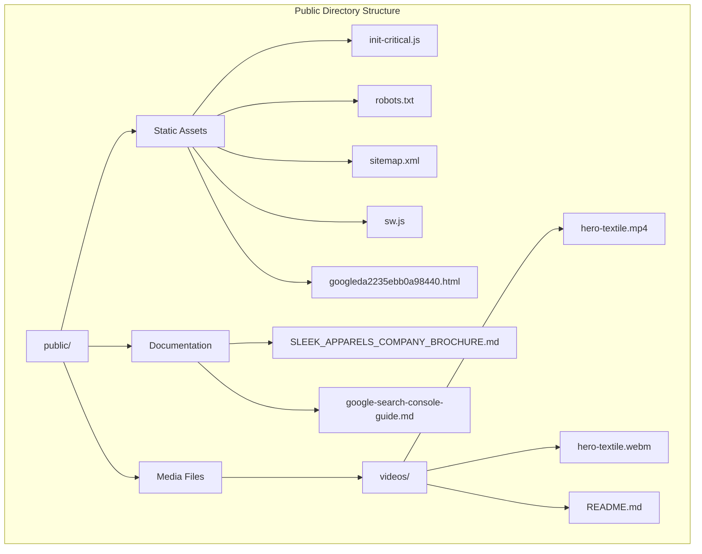

# Public Directory

<cite>
**Referenced Files in This Document**
- [init-critical.js](file://public/init-critical.js)
- [robots.txt](file://public/robots.txt)
- [sitemap.xml](file://public/sitemap.xml)
- [sw.js](file://public/sw.js)
- [googleda2235ebb0a98440.html](file://public/googleda2235ebb0a98440.html)
- [vite.config.ts](file://vite.config.ts)
- [README.md](file://README.md)
- [videos/README.md](file://public/videos/README.md)
- [google-search-console-guide.md](file://public/google-search-console-guide.md)
</cite>

## Table of Contents
1. [Introduction](#introduction)
2. [Directory Structure Overview](#directory-structure-overview)
3. [Key Static Assets](#key-static-assets)
4. [SEO and Search Engine Optimization](#seo-and-search-engine-optimization)
5. [Performance Optimization](#performance-optimization)
6. [Service Worker Implementation](#service-worker-implementation)
7. [Vite Build Process Integration](#vite-build-process-integration)
8. [Best Practices for Maintenance](#best-practices-for-maintenance)
9. [Caching Strategies](#caching-strategies)
10. [Troubleshooting Guide](#troubleshooting-guide)

## Introduction

The `public/` directory serves as the static asset host for the SleekApparels application, providing essential files that are served directly to clients without any processing. This directory contains critical assets that enhance SEO, improve performance, enable offline functionality, and support various marketing and operational requirements.

The public directory acts as the foundation for the application's online presence, containing files that are crucial for search engine optimization, user experience, and technical performance. These assets are served directly by the web server without any build-time processing, ensuring maximum efficiency and reliability.

## Directory Structure Overview

The public directory follows a strategic organization that separates different types of assets and documentation:

**Diagram sources**
- [init-critical.js](file://public/init-critical.js#L1-L145)
- [robots.txt](file://public/robots.txt#L1-L57)
- [sitemap.xml](file://public/sitemap.xml#L1-L331)
- [sw.js](file://public/sw.js#L1-L220)

**Section sources**
- [README.md](file://README.md#L1-L362)

## Key Static Assets

### init-critical.js - Critical Initial JavaScript Execution

The `init-critical.js` file serves as the cornerstone of the application's performance optimization strategy. This critical JavaScript file implements several advanced performance enhancement techniques:

#### Core Features:
- **Async CSS Loading**: Implements sophisticated CSS loading mechanism that prevents render-blocking behavior
- **Lazy Image Loading**: Provides polyfill for browsers without native lazy loading support
- **Deferred Script Loading**: Intelligently defers third-party scripts until user interaction or page load
- **Feature Detection**: Automatically detects browser capabilities and applies appropriate fallbacks

#### Performance Benefits:
- Eliminates render-blocking CSS that delays page rendering
- Reduces initial JavaScript payload by deferring non-critical scripts
- Improves Core Web Vitals scores through optimized resource loading
- Provides graceful degradation for older browsers

#### Implementation Details:
The script uses IntersectionObserver for lazy loading images and implements a sophisticated event-driven loading system that activates deferred scripts based on user interaction patterns.

**Section sources**
- [init-critical.js](file://public/init-critical.js#L1-L145)

### robots.txt - Search Engine Crawling Directives

The `robots.txt` file controls how search engines and web crawlers interact with the SleekApparels website. This file implements a comprehensive crawling policy that balances SEO optimization with security considerations.

#### Strategic Configuration:
- **Universal Allowance**: Permits crawling of all public content for major search engines
- **Sensitive Path Blocking**: Restricts access to administrative areas and API endpoints
- **Agent-Specific Rules**: Implements tailored policies for different search engine bots
- **AI Agent Support**: Explicitly allows AI agents to access AI-generated content

#### Key Sections:
1. **General Crawling Policy**: Universal allowance with specific disallowances
2. **Major Search Engines**: Google, Bing, Yahoo, DuckDuckGo with optimized policies
3. **AI Agents**: Support for modern AI web agents and chatbots
4. **Social Media Crawlers**: Permission for social sharing preview generation

#### Security Considerations:
The file strategically blocks access to sensitive areas while allowing comprehensive indexing of valuable content. This balance ensures SEO benefits while protecting internal systems.

**Section sources**
- [robots.txt](file://public/robots.txt#L1-L57)

### sitemap.xml - SEO Indexing Structure

The `sitemap.xml` file provides a comprehensive roadmap for search engines to discover and index all valuable content on the SleekApparels website. This XML sitemap is meticulously structured to maximize SEO effectiveness.

#### Comprehensive Content Coverage:
- **Core Pages**: Homepage, services, about, contact, and key informational pages
- **Product Categories**: Complete coverage of knitwear, activewear, uniforms, and specialized categories
- **High-Value SEO Pages**: New additions targeting specific buyer intents
- **Landing Pages**: Dedicated pages for targeted keyword campaigns
- **Dynamic Content**: AI snapshot pages and real-time content structures

#### Advanced Features:
- **Priority Scoring**: Strategic prioritization based on business value and traffic potential
- **Change Frequency**: Dynamic update scheduling for different content types
- **Mobile Optimization**: Responsive design considerations in sitemap structure
- **International SEO**: Support for global market targeting

#### Technical Implementation:
The sitemap follows XML sitemap protocol standards and includes metadata that helps search engines understand content relationships and update frequencies.

**Section sources**
- [sitemap.xml](file://public/sitemap.xml#L1-L331)

### sw.js - Service Worker for Offline Functionality

The service worker (`sw.js`) provides comprehensive offline functionality and performance optimization through sophisticated caching strategies and resource management.

#### Multi-Level Caching Architecture:
- **Static Assets Cache**: Long-term caching for immutable resources (1 year)
- **Runtime Cache**: Short-term caching for dynamic content (1 day)
- **Image Cache**: Optimized caching for multimedia content (1 year)
- **API Cache**: Intelligent caching for API responses (5 minutes)
- **Asset Cache**: Specialized caching for CSS and fonts

#### Advanced Caching Strategies:
- **Stale-While-Revalidate**: Balances performance with freshness
- **Cache-First with Fallback**: Ensures availability even during network issues
- **Network-Fallback**: Graceful degradation when network is unavailable
- **Automatic Cache Cleanup**: Removes outdated cache entries during activation

#### Performance Optimizations:
- **Resource Type Specific**: Different strategies for different content types
- **Bandwidth Optimization**: Intelligent compression and delivery
- **Storage Efficiency**: Balanced cache sizes for optimal performance
- **Update Management**: Seamless service worker updates

**Section sources**
- [sw.js](file://public/sw.js#L1-L220)

### googleda2235ebb0a98440.html - Google Search Console Verification

This HTML file serves as the official Google Search Console verification file, enabling website ownership verification and access to Google's SEO tools and analytics.

#### Verification Purpose:
- **Ownership Validation**: Confirms website ownership for Google Search Console access
- **SEO Tools Access**: Enables use of Google's comprehensive SEO analysis tools
- **Performance Monitoring**: Provides access to Core Web Vitals and performance metrics
- **Indexing Control**: Allows manual indexing requests and coverage monitoring

#### Integration Benefits:
- **Search Console Access**: Full access to Google's SEO monitoring tools
- **Performance Insights**: Detailed performance analysis and optimization suggestions
- **Security Features**: Malware scanning and security issue detection
- **Analytics Integration**: Seamless integration with Google Analytics and other tools

**Section sources**
- [googleda2235ebb0a98440.html](file://public/googleda2235ebb0a98440.html#L1-L1)

## SEO and Search Engine Optimization

The public directory plays a crucial role in the overall SEO strategy of the SleekApparels application through several key assets:

### Search Engine Discovery
- **Robots.txt**: Controls crawler access and prevents indexing of sensitive areas
- **Sitemap.xml**: Provides comprehensive content discovery for search engines
- **Google Verification**: Enables Google Search Console integration and monitoring

### Content Accessibility
- **Structured Data**: Supports rich snippets and enhanced search results
- **Canonical Tags**: Prevents duplicate content issues across the site
- **Mobile Optimization**: Ensures mobile-friendly search ranking factors

### Performance Impact
- **Fast Loading**: Critical JavaScript optimization improves Core Web Vitals
- **Caching Strategy**: Service worker reduces load times and improves user experience
- **Resource Optimization**: Efficient asset delivery enhances search ranking factors

## Performance Optimization

The public directory implements multiple performance optimization strategies:

### Critical Rendering Path
- **Async CSS Loading**: Prevents render-blocking CSS that delays page appearance
- **Lazy Loading**: Images and content load only when needed
- **Deferred Scripts**: Non-critical JavaScript executes after page load

### Caching Strategies
- **Long-term Asset Caching**: Static resources cached for extended periods
- **Intelligent API Caching**: API responses cached with appropriate expiration
- **Service Worker Caching**: Comprehensive offline and performance optimization

### Resource Management
- **Bandwidth Optimization**: Efficient compression and delivery strategies
- **Storage Efficiency**: Balanced cache sizes for optimal performance
- **Update Mechanisms**: Seamless updates without disrupting user experience

## Service Worker Implementation

The service worker provides comprehensive offline functionality and performance optimization:

### Offline Capabilities
- **Progressive Enhancement**: Core functionality available offline
- **Background Sync**: Deferred actions when connectivity is restored
- **Cache Management**: Intelligent cache updates and cleanup

### Performance Benefits
- **Reduced Latency**: Cached resources load instantly
- **Bandwidth Savings**: Reduced data usage through efficient caching
- **Reliability**: Consistent performance regardless of network conditions

### Update Management
- **Seamless Updates**: Background service worker updates
- **Cache Versioning**: Automatic cache invalidation and cleanup
- **Graceful Degradation**: Fallback mechanisms when service workers fail

## Vite Build Process Integration

The Vite build process handles public directory assets through a sophisticated pipeline:

### Asset Processing
- **Direct Copying**: Static assets copied without modification
- **Hash Generation**: Unique hashes for cache busting
- **Compression**: Automatic compression for optimal delivery

### Optimization Pipeline
- **CSS Transformation**: Render-blocking CSS replaced with preload + async loading
- **JavaScript Optimization**: Critical scripts extracted and optimized
- **Asset Bundling**: Efficient bundling and delivery strategies

### Development vs Production
- **Development Mode**: Direct asset serving for rapid iteration
- **Production Mode**: Optimized assets with compression and caching
- **Environment Variables**: Dynamic configuration based on deployment context

**Section sources**
- [vite.config.ts](file://vite.config.ts#L1-L216)

## Best Practices for Maintenance

### Regular Updates
- **Sitemap Maintenance**: Regular updates to reflect new content and changes
- **Robots.txt Review**: Periodic review of crawling policies
- **Performance Monitoring**: Continuous monitoring of asset delivery performance

### Content Management
- **Asset Organization**: Maintain clear structure for easy management
- **Version Control**: Track changes to critical assets
- **Backup Strategy**: Regular backups of important static assets

### Security Considerations
- **Access Control**: Secure sensitive files and prevent unauthorized access
- **Content Validation**: Verify asset integrity and security
- **Monitoring**: Regular security scans and vulnerability assessments

### Performance Monitoring
- **Asset Delivery**: Monitor CDN performance and delivery times
- **Cache Performance**: Track cache hit rates and effectiveness
- **User Experience**: Monitor Core Web Vitals and user satisfaction metrics

## Caching Strategies

The public directory implements sophisticated caching strategies across multiple layers:

### Browser Caching
- **Static Assets**: Long-term caching for JavaScript, CSS, and images
- **Dynamic Content**: Short-term caching for frequently changing content
- **API Responses**: Intelligent caching with appropriate expiration

### Service Worker Caching
- **Multi-Level Strategy**: Different cache strategies for different content types
- **Automatic Updates**: Seamless service worker updates
- **Cache Management**: Intelligent cache cleanup and maintenance

### CDN Integration
- **Global Distribution**: Fast delivery worldwide
- **Edge Caching**: Reduced latency through edge locations
- **Compression**: Automatic compression for optimal delivery

## Troubleshooting Guide

### Common Issues and Solutions

#### Service Worker Problems
- **Cache Invalidation**: Clear browser cache and reload application
- **Update Failures**: Check service worker registration and update mechanisms
- **Offline Functionality**: Verify cache configuration and network connectivity

#### SEO and Crawling Issues
- **Indexing Problems**: Verify robots.txt configuration and sitemap accessibility
- **Crawl Errors**: Check for broken links and server response codes
- **Performance Issues**: Monitor Core Web Vitals and optimize asset delivery

#### Asset Delivery Problems
- **Missing Assets**: Verify file paths and deployment configuration
- **Performance Issues**: Check compression settings and CDN configuration
- **Browser Compatibility**: Test across different browsers and devices

### Monitoring and Diagnostics
- **Performance Metrics**: Monitor load times and user experience metrics
- **Error Tracking**: Implement comprehensive error tracking and reporting
- **User Feedback**: Collect and analyze user feedback for continuous improvement

### Maintenance Procedures
- **Regular Audits**: Conduct periodic audits of all public assets
- **Performance Reviews**: Regular performance reviews and optimization
- **Security Assessments**: Periodic security assessments and vulnerability scanning

**Section sources**
- [google-search-console-guide.md](file://public/google-search-console-guide.md#L1-L118)