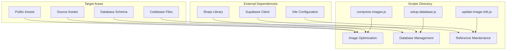
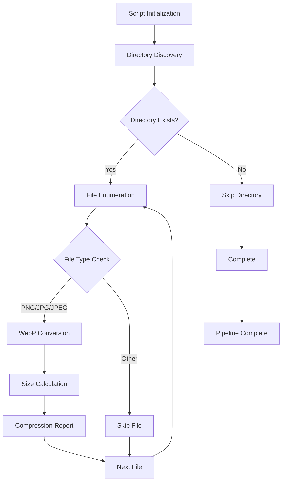
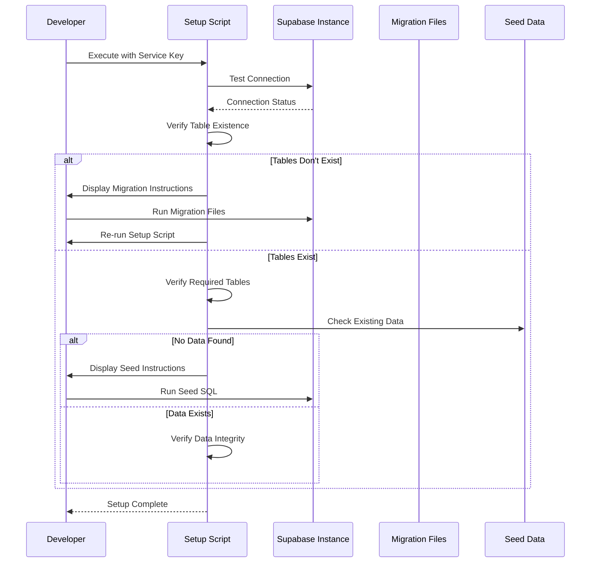
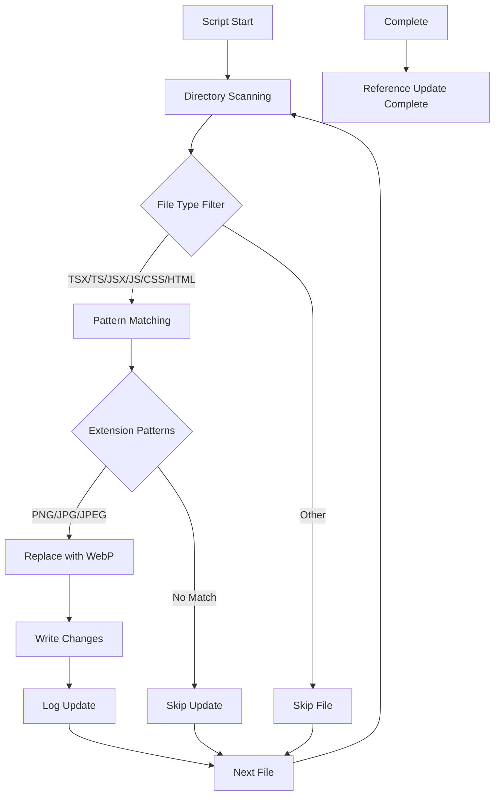

# Scripts Directory

<cite>
**Referenced Files in This Document**
- [compress-images.js](file://scripts/compress-images.js)
- [setup-database.js](file://scripts/setup-database.js)
- [update-image-refs.js](file://scripts/update-image-refs.js)
- [package.json](file://package.json)
- [README.md](file://README.md)
- [QUICK_START.md](file://QUICK_START.md)
- [supabase/config.toml](file://supabase/config.toml)
- [supabase/migrations/20250122000000_create_marketplace_system.sql](file://supabase/migrations/20250122000000_create_marketplace_system.sql)
</cite>

## Table of Contents
1. [Introduction](#introduction)
2. [Directory Structure](#directory-structure)
3. [Core Scripts Overview](#core-scripts-overview)
4. [Image Optimization Pipeline](#image-optimization-pipeline)
5. [Database Management System](#database-management-system)
6. [Asset Reference Maintenance](#asset-reference-maintenance)
7. [Integration with Development Workflows](#integration-with-development-workflows)
8. [Error Handling and Reliability](#error-handling-and-reliability)
9. [Configuration Requirements](#configuration-requirements)
10. [Best Practices and Usage Guidelines](#best-practices-and-usage-guidelines)
11. [Troubleshooting Guide](#troubleshooting-guide)

## Introduction

The `scripts/` directory serves as the central hub for automated utility and maintenance operations within the Sleek Apparels project. This collection of JavaScript scripts streamlines development workflows, optimizes asset delivery, and ensures database consistency across the entire application stack. These scripts are specifically designed to handle three critical areas: image optimization for performance enhancement, database initialization and configuration for Supabase environments, and asset reference synchronization for maintaining codebase integrity.

The scripts directory reflects the project's commitment to automated development practices, reducing manual intervention in routine tasks while ensuring consistent quality standards across all deployment environments. Each script is purpose-built to address specific operational needs within the knitwear manufacturing and supply chain management platform.

## Directory Structure

The scripts directory contains three primary utility scripts, each serving distinct automation purposes:



**Diagram sources**
- [compress-images.js](file://scripts/compress-images.js#L1-L76)
- [setup-database.js](file://scripts/setup-database.js#L1-L308)
- [update-image-refs.js](file://scripts/update-image-refs.js#L1-L72)

**Section sources**
- [compress-images.js](file://scripts/compress-images.js#L1-L76)
- [setup-database.js](file://scripts/setup-database.js#L1-L308)
- [update-image-refs.js](file://scripts/update-image-refs.js#L1-L72)

## Core Scripts Overview

### Script Architecture and Design Principles

Each script follows a modular architecture pattern with clear separation of concerns:

- **Compress Images**: Handles WebP conversion with size optimization
- **Setup Database**: Manages Supabase migration and seeding workflows
- **Update References**: Maintains consistency in asset file references

### Execution Contexts

The scripts operate in specific contexts within the development lifecycle:

- **Pre-Build Optimization**: Image compression runs before production builds
- **Post-Deployment Verification**: Database setup validates schema integrity
- **Maintenance Operations**: Reference updates occur during asset pipeline modifications

**Section sources**
- [compress-images.js](file://scripts/compress-images.js#L1-L76)
- [setup-database.js](file://scripts/setup-database.js#L1-L308)
- [update-image-refs.js](file://scripts/update-image-refs.js#L1-L72)

## Image Optimization Pipeline

### Compress Images Script Architecture

The `compress-images.js` script implements a sophisticated image optimization pipeline designed to reduce asset sizes while maintaining visual quality. The script targets multiple asset directories containing PNG, JPEG, and JPG images, converting them to WebP format for optimal browser compatibility and performance.



**Diagram sources**
- [compress-images.js](file://scripts/compress-images.js#L40-L76)

### Optimization Parameters and Quality Control

The script employs WebP encoding with specific quality settings:

- **Quality Level**: 85% for optimal balance between file size and visual fidelity
- **Effort Level**: 6 for efficient compression algorithm selection
- **Format Conversion**: Automatic replacement of original image extensions with `.webp`

### Target Asset Locations

The optimization pipeline processes multiple asset directories:

| Directory | Purpose | Size Impact | Performance Gain |
|-----------|---------|-------------|------------------|
| `src/assets` | Core application assets | Medium-High | 40-60% reduction |
| `src/assets/factory` | Manufacturing visuals | Medium | 35-55% reduction |
| `src/assets/portfolio` | Product showcase images | High | 50-70% reduction |
| `src/assets/mockups` | Design presentation | Medium | 40-60% reduction |
| `public` | Static assets | Variable | 30-50% reduction |

### Error Handling and Recovery

The script implements robust error handling mechanisms:

- **File System Validation**: Checks directory existence before processing
- **Extension Filtering**: Validates supported image formats
- **Conversion Monitoring**: Tracks successful and failed conversions
- **Size Comparison**: Calculates and reports compression effectiveness

**Section sources**
- [compress-images.js](file://scripts/compress-images.js#L1-L76)

## Database Management System

### Setup Database Script Architecture

The `setup-database.js` script provides comprehensive database initialization and configuration management for Supabase environments. This script handles the complete database lifecycle, from initial setup through data seeding and verification.



**Diagram sources**
- [setup-database.js](file://scripts/setup-database.js#L183-L307)

### Service Role Key Authentication

The script requires a Supabase service role key for bypassing Row Level Security (RLS) policies:

- **Security Context**: Service role keys provide administrative access
- **Environment Variable**: Can be passed as command-line argument
- **Key Format**: Starts with `eyJhbGciOiJIUzI1NiIsInR5cCI6IkpXVCJ9...`
- **Location**: Available in Supabase Dashboard → Settings → API → Service Role Key

### Database Schema Verification

The script performs comprehensive schema validation:

| Verification Step | Purpose | Validation Method |
|------------------|---------|-------------------|
| Connection Test | Confirm Supabase accessibility | Basic query execution |
| Table Existence | Verify core schema presence | `profiles` table check |
| Required Tables | Validate complete schema | 10+ essential tables |
| Data Integrity | Check sample data completeness | Row count verification |

### Migration and Seeding Workflow

The script orchestrates the database setup process:

1. **Initial Connection**: Establishes secure connection using service role key
2. **Schema Validation**: Verifies all required tables exist
3. **Data Assessment**: Checks for existing sample data
4. **Instruction Provision**: Guides user through manual migration steps
5. **Verification**: Confirms successful setup completion

### Error Recovery and Guidance

The script provides extensive error handling and user guidance:

- **Missing Dependencies**: Clear instructions for installing required packages
- **Connection Issues**: Detailed troubleshooting steps for network problems
- **Migration Guidance**: Step-by-step instructions for manual SQL execution
- **Data Conflict Resolution**: Options for handling existing data scenarios

**Section sources**
- [setup-database.js](file://scripts/setup-database.js#L1-L308)

## Asset Reference Maintenance

### Update Image References Script

The `update-image-refs.js` script maintains consistency in asset file references across the entire codebase when image formats change. This script systematically scans source files and updates image references to reflect the new WebP format.



**Diagram sources**
- [update-image-refs.js](file://scripts/update-image-refs.js#L40-L72)

### Reference Pattern Recognition

The script employs sophisticated pattern matching to identify image references:

| Pattern Type | Original Format | Replacement Format | Scope |
|-------------|----------------|-------------------|-------|
| Component Imports | `import img from './image.png'` | `import img from './image.webp'` | TypeScript/JavaScript files |
| CSS Backgrounds | `background: url('./image.jpg')` | `background: url('./image.webp')` | CSS files |
| HTML Attributes | `` | `` | HTML files |
| JSX Properties | `src="./image.png"` | `src="./image.webp"` | React component files |

### File System Traversal

The script implements intelligent file system traversal:

- **Recursive Scanning**: Processes all subdirectories except `node_modules` and `.git`
- **Extension Filtering**: Targets only relevant file types (.tsx, .ts, .jsx, .js, .css, .html)
- **Case Sensitivity**: Handles both uppercase and lowercase file extensions
- **Path Normalization**: Uses consistent path resolution across operating systems

### Atomic Updates and Backup Strategy

The script ensures data integrity through atomic operations:

- **Read-Modify-Write**: Entire file content is loaded, modified, then written back
- **Change Detection**: Only modifies files when actual changes are detected
- **Logging**: Comprehensive logging of all modification activities
- **Error Isolation**: Continues processing remaining files even if individual updates fail

**Section sources**
- [update-image-refs.js](file://scripts/update-image-refs.js#L1-L72)

## Integration with Development Workflows

### Package.json Script Integration

The scripts integrate seamlessly with the project's build and development workflows through strategic placement in the package.json scripts section:

```json
{
  "scripts": {
    "dev": "vite",
    "build": "vite build",
    "build:dev": "vite build --mode development",
    "lint": "eslint .",
    "preview": "vite preview",
    "test": "vitest"
  }
}
```

### Pre-Build Optimization Pipeline

The image compression script operates as part of the pre-build optimization pipeline:

1. **Development Phase**: Developers run `node scripts/compress-images.js` before committing changes
2. **CI/CD Integration**: Automated compression during continuous integration builds
3. **Production Preparation**: Ensures optimized assets before deployment

### Post-Deployment Verification

The database setup script serves as a post-deployment verification tool:

1. **Environment Setup**: Runs after database migrations complete
2. **Data Validation**: Verifies that sample data has been properly seeded
3. **Schema Integrity**: Confirms all required tables and relationships exist

### Maintenance Workflow Integration

The reference update script integrates into maintenance workflows:

1. **Asset Pipeline Changes**: Runs when image format conversions occur
2. **Codebase Refactoring**: Executes during major architectural changes
3. **Build Optimization**: Part of the asset optimization pipeline

**Section sources**
- [package.json](file://package.json#L6-L12)

## Error Handling and Reliability

### Comprehensive Error Management

Each script implements layered error handling to ensure reliability across different failure scenarios:

#### Compress Images Error Handling
- **File System Errors**: Graceful handling of missing directories and permission issues
- **Conversion Failures**: Detailed error reporting with file-specific context
- **Memory Management**: Efficient processing of large image collections
- **Progress Tracking**: Real-time feedback on processing status

#### Setup Database Error Handling
- **Network Connectivity**: Robust retry mechanisms for transient connection issues
- **SQL Execution**: Fallback methods for different SQL execution approaches
- **Validation Failures**: Clear diagnostic information for schema issues
- **User Guidance**: Actionable error messages with resolution steps

#### Update References Error Handling
- **File Locking**: Prevention of concurrent file access conflicts
- **Encoding Issues**: Proper handling of different file encodings
- **Pattern Matching**: Fallback strategies for complex file structures
- **Atomic Operations**: Rollback capabilities for partial updates

### Reliability Metrics and Monitoring

The scripts provide comprehensive monitoring capabilities:

- **Execution Time Tracking**: Performance benchmarking for optimization
- **Success Rate Monitoring**: Percentage of successful operations
- **Error Classification**: Categorized error reporting for troubleshooting
- **Resource Utilization**: Memory and CPU usage monitoring

### Recovery Strategies

Each script implements specific recovery strategies:

- **Graceful Degradation**: Continues operation when non-critical components fail
- **Partial Success Handling**: Reports successful operations alongside failures
- **State Persistence**: Maintains operation state for resumption
- **Cleanup Procedures**: Automatic resource cleanup on failure

**Section sources**
- [compress-images.js](file://scripts/compress-images.js#L34-L37)
- [setup-database.js](file://scripts/setup-database.js#L113-L117)
- [update-image-refs.js](file://scripts/update-image-refs.js#L31-L37)

## Configuration Requirements

### Environment Dependencies

The scripts require specific environment configurations for reliable operation:

#### Node.js Runtime Requirements
- **Version Compatibility**: Node.js 18+ for ES module support
- **Package Dependencies**: Sharp library for image processing
- **Execution Permissions**: Proper file system permissions for script execution

#### Supabase Configuration
- **Service Role Key**: Administrative access for database operations
- **Environment Variables**: Supabase URL and API configuration
- **Network Access**: Outbound connectivity to Supabase instances

#### Image Processing Dependencies
- **Sharp Library**: Binary dependencies for image processing
- **GraphicsMagick/GraphicsMagick**: System-level image processing tools
- **Memory Allocation**: Adequate RAM for large image processing

### Script-Specific Requirements

#### Compress Images Requirements
- **Directory Structure**: Pre-existing asset directories
- **File Permissions**: Read/write access to target files
- **Disk Space**: Sufficient space for temporary WebP files
- **CPU Resources**: Processing power for concurrent image operations

#### Setup Database Requirements
- **Database Connectivity**: Active Supabase instance
- **Migration Files**: Complete migration file collection
- **Seed Data Availability**: Sample data SQL files
- **Service Role Key**: Valid administrative credentials

#### Update References Requirements
- **Codebase Access**: Read/write permissions to source files
- **Git Integration**: Version control compatibility
- **File Encoding**: UTF-8 or compatible encoding support
- **Backup Strategy**: File backup procedures for safety

### Configuration Validation

The scripts implement configuration validation:

- **Dependency Checking**: Verifies all required packages are installed
- **Environment Validation**: Confirms proper environment setup
- **Permission Verification**: Validates file system access rights
- **Resource Availability**: Checks disk space and memory limits

**Section sources**
- [compress-images.js](file://scripts/compress-images.js#L1-L15)
- [setup-database.js](file://scripts/setup-database.js#L10-L17)
- [update-image-refs.js](file://scripts/update-image-refs.js#L1-L13)

## Best Practices and Usage Guidelines

### Development Workflow Integration

#### Image Optimization Best Practices
1. **Pre-commit Hook Integration**: Automate image compression before code commits
2. **Continuous Integration**: Include optimization in CI/CD pipelines
3. **Batch Processing**: Process large asset collections efficiently
4. **Quality Assurance**: Verify optimization results before deployment

#### Database Management Best Practices
1. **Environment Separation**: Use separate service keys for different environments
2. **Migration Planning**: Coordinate database changes with application deployments
3. **Data Backup**: Ensure data backups before running setup scripts
4. **Incremental Updates**: Apply changes incrementally for complex migrations

#### Reference Maintenance Best Practices
1. **Version Control**: Commit reference updates with corresponding asset changes
2. **Testing Strategy**: Verify functionality after reference updates
3. **Rollback Planning**: Maintain ability to revert reference changes
4. **Documentation**: Document reference update procedures

### Performance Optimization

#### Script Execution Optimization
- **Parallel Processing**: Leverage multiple CPU cores for concurrent operations
- **Memory Management**: Optimize memory usage for large file collections
- **I/O Optimization**: Minimize disk access for improved performance
- **Caching Strategies**: Implement caching for frequently accessed resources

#### Resource Management
- **CPU Allocation**: Monitor CPU usage during intensive operations
- **Memory Monitoring**: Track memory consumption for large datasets
- **Disk I/O**: Optimize file system access patterns
- **Network Efficiency**: Minimize network requests for remote operations

### Security Considerations

#### Service Key Management
- **Secure Storage**: Store service role keys securely in environment variables
- **Access Control**: Limit service key access to authorized personnel
- **Rotation Strategy**: Implement regular service key rotation
- **Audit Logging**: Monitor service key usage for security compliance

#### File System Security
- **Permission Management**: Set appropriate file system permissions
- **Access Control**: Restrict script execution to authorized users
- **Input Validation**: Validate all file paths and user inputs
- **Sanitization**: Sanitize file names and paths to prevent injection attacks

### Maintenance Procedures

#### Regular Maintenance Schedule
- **Weekly Optimization**: Automated image compression for new assets
- **Monthly Verification**: Database schema and data integrity checks
- **Quarterly Updates**: Review and update reference patterns
- **Annual Audit**: Comprehensive security and performance audit

#### Monitoring and Alerting
- **Performance Metrics**: Track script execution times and success rates
- **Error Monitoring**: Alert on script failures and unusual patterns
- **Resource Monitoring**: Monitor system resource usage during operations
- **Security Monitoring**: Detect unauthorized access attempts

**Section sources**
- [compress-images.js](file://scripts/compress-images.js#L74-L76)
- [setup-database.js](file://scripts/setup-database.js#L305-L308)
- [update-image-refs.js](file://scripts/update-image-refs.js#L70-L72)

## Troubleshooting Guide

### Common Issues and Solutions

#### Image Compression Issues

**Problem**: Scripts fail to process certain image formats
**Solution**: Verify Sharp library installation and graphics processing dependencies

**Problem**: Large images cause memory errors
**Solution**: Increase Node.js memory allocation or process images in batches

**Problem**: Permission denied errors during file processing
**Solution**: Check file system permissions and execute with appropriate privileges

#### Database Setup Issues

**Problem**: Service role key authentication failures
**Solution**: Verify key format and regenerate if necessary from Supabase dashboard

**Problem**: Migration files not executing properly
**Solution**: Manually execute SQL files in Supabase SQL Editor with proper ordering

**Problem**: Connection timeouts during setup
**Solution**: Check network connectivity and Supabase instance availability

#### Reference Update Issues

**Problem**: Pattern matching fails for certain file types
**Solution**: Verify file encoding and update pattern matching logic if needed

**Problem**: Files not being updated despite matching patterns
**Solution**: Check file permissions and ensure write access to target directories

### Diagnostic Procedures

#### Script Execution Diagnostics
1. **Verbose Logging**: Enable detailed logging for troubleshooting
2. **Step-by-Step Execution**: Run scripts incrementally to isolate issues
3. **Environment Verification**: Confirm all dependencies are properly installed
4. **Permission Checking**: Verify file system access rights

#### Performance Diagnostics
1. **Resource Monitoring**: Track CPU and memory usage during execution
2. **I/O Analysis**: Monitor disk access patterns and bottlenecks
3. **Network Diagnostics**: Check network connectivity for remote operations
4. **Dependency Analysis**: Verify all required libraries are available

### Recovery Procedures

#### Failed Operation Recovery
1. **State Restoration**: Restore previous state if possible
2. **Partial Recovery**: Recover successfully processed components
3. **Manual Intervention**: Provide guidance for manual recovery steps
4. **Rollback Procedures**: Implement rollback capabilities for reversions

#### Data Integrity Recovery
1. **Backup Verification**: Confirm backup availability and integrity
2. **Data Validation**: Verify data consistency after recovery
3. **Cross-Reference Checking**: Compare recovered data with original sources
4. **Functional Testing**: Ensure recovered data supports application functionality

### Support Resources

#### Documentation Resources
- **Script Documentation**: Detailed inline documentation for each script
- **Configuration Guides**: Step-by-step setup instructions
- **Troubleshooting Manuals**: Comprehensive problem-solving procedures
- **Best Practice Guides**: Recommended operational procedures

#### Community Support
- **Issue Tracking**: Report bugs and request features through official channels
- **Knowledge Base**: Access community-contributed solutions and tips
- **Developer Forums**: Engage with other developers for assistance
- **Documentation Contributions**: Contribute improvements to documentation

**Section sources**
- [compress-images.js](file://scripts/compress-images.js#L34-L37)
- [setup-database.js](file://scripts/setup-database.js#L113-L117)
- [update-image-refs.js](file://scripts/update-image-refs.js#L31-L37)