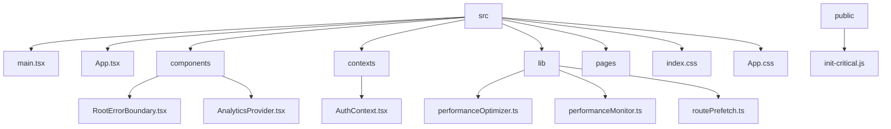
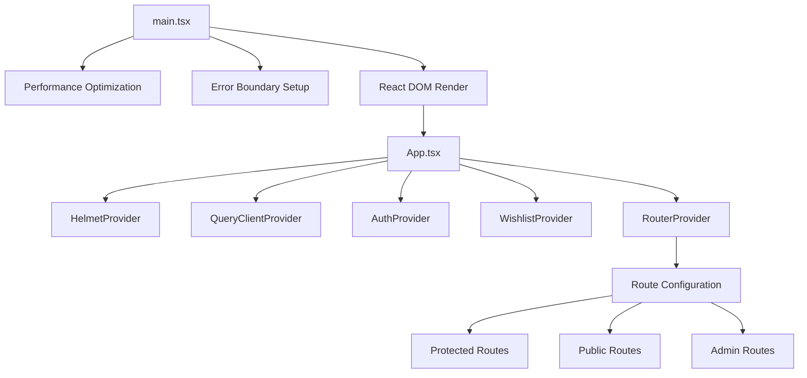
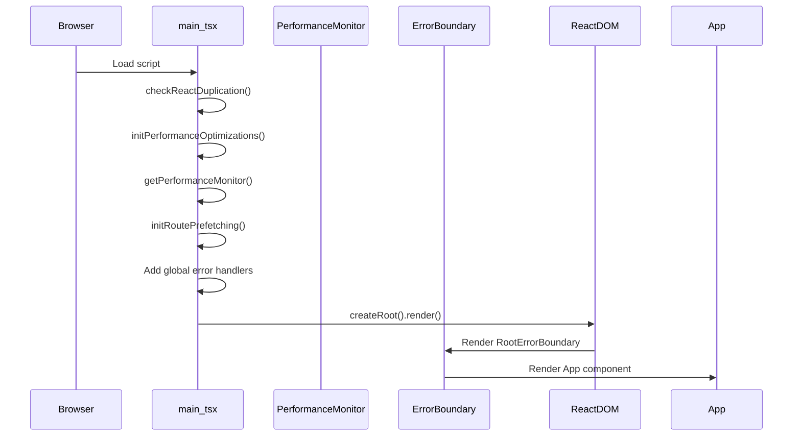
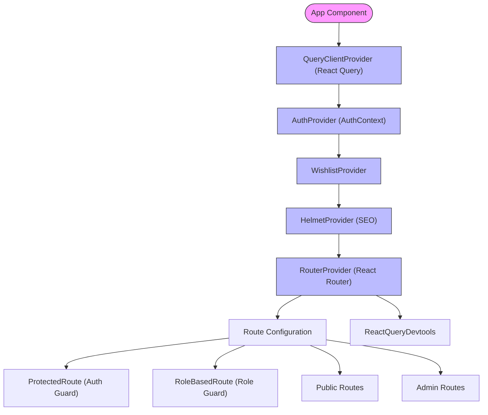
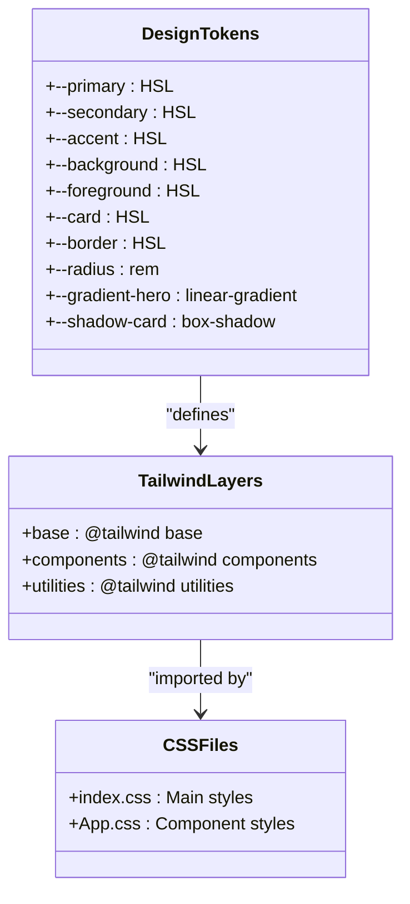
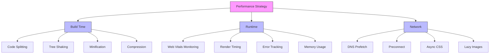

# Application Entry Points and Bootstrapping

<cite>
**Referenced Files in This Document**   
- [main.tsx](file://src/main.tsx)
- [App.tsx](file://src/App.tsx)
- [index.css](file://src/index.css)
- [App.css](file://src/App.css)
- [RootErrorBoundary.tsx](file://src/components/RootErrorBoundary.tsx)
- [AnalyticsProvider.tsx](file://src/components/AnalyticsProvider.tsx)
- [AuthContext.tsx](file://src/contexts/AuthContext.tsx)
- [init-critical.js](file://public/init-critical.js)
- [vite.config.ts](file://vite.config.ts)
- [performanceOptimizer.ts](file://src/lib/performanceOptimizer.ts)
- [performanceMonitor.ts](file://src/lib/performanceMonitor.ts)
- [routePrefetch.ts](file://src/lib/routePrefetch.ts)
- [reactDuplicationCheck.ts](file://src/lib/reactDuplicationCheck.ts)
</cite>

## Table of Contents
1. [Introduction](#introduction)
2. [Project Structure](#project-structure)
3. [Core Components](#core-components)
4. [Architecture Overview](#architecture-overview)
5. [Detailed Component Analysis](#detailed-component-analysis)
6. [Dependency Analysis](#dependency-analysis)
7. [Performance Considerations](#performance-considerations)
8. [Troubleshooting Guide](#troubleshooting-guide)
9. [Conclusion](#conclusion)

## Introduction
This document provides a comprehensive analysis of the application entry points and bootstrapping process for the SleekApparels web application. The focus is on the initialization sequence, component hierarchy, and performance optimization strategies implemented through the main entry files `main.tsx` and `App.tsx`. The application follows modern React patterns with strict type safety, code splitting, and performance monitoring.

The bootstrapping process begins with `main.tsx` which serves as the true entry point, responsible for initializing performance monitoring, setting up error boundaries, and mounting the React application to the DOM. The `App.tsx` file acts as the root component that orchestrates routing, authentication context, and global providers. Together, these files establish the foundation for a scalable, performant, and maintainable React application with server-side rendering compatibility.

## Project Structure
The application follows a feature-based organization with clear separation of concerns. The entry point files are located in the `src` directory alongside other core components. The structure emphasizes maintainability and scalability through logical grouping of related functionality.



**Diagram sources**
- [main.tsx](file://src/main.tsx)
- [App.tsx](file://src/App.tsx)
- [RootErrorBoundary.tsx](file://src/components/RootErrorBoundary.tsx)
- [AnalyticsProvider.tsx](file://src/components/AnalyticsProvider.tsx)
- [AuthContext.tsx](file://src/contexts/AuthContext.tsx)

**Section sources**
- [main.tsx](file://src/main.tsx)
- [App.tsx](file://src/App.tsx)
- [index.css](file://src/index.css)
- [App.css](file://src/App.css)

## Core Components
The core components of the application entry points include the `main.tsx` bootstrap file, the `App.tsx` root component, and supporting utilities for error handling, analytics, and authentication. These components work together to initialize the application, set up global state management, and provide a consistent user experience across different routes and authentication states.

The `RootErrorBoundary` component provides comprehensive error handling at the application level, while the `AnalyticsProvider` manages third-party tracking scripts with performance optimization. The `AuthContext` establishes user authentication state that flows through the entire application. These components are essential for creating a robust foundation that can handle errors gracefully, track user behavior, and maintain secure authentication sessions.

**Section sources**
- [main.tsx](file://src/main.tsx#L1-L39)
- [App.tsx](file://src/App.tsx#L1-L362)
- [RootErrorBoundary.tsx](file://src/components/RootErrorBoundary.tsx#L1-L115)
- [AnalyticsProvider.tsx](file://src/components/AnalyticsProvider.tsx#L1-L256)
- [AuthContext.tsx](file://src/contexts/AuthContext.tsx#L1-L166)

## Architecture Overview
The application architecture follows a layered approach with clear separation between initialization logic, global providers, routing, and page components. The entry point `main.tsx` handles the initial setup before rendering the `App` component, which then manages the application shell and routing context.



**Diagram sources**
- [main.tsx](file://src/main.tsx#L1-L39)
- [App.tsx](file://src/App.tsx#L1-L362)

## Detailed Component Analysis

### Main Entry Point Analysis
The `main.tsx` file serves as the application's entry point, responsible for initializing critical systems before rendering the React application. It imports essential utilities for performance optimization and error handling, ensuring the application starts in the best possible state.



**Diagram sources**
- [main.tsx](file://src/main.tsx#L1-L39)
- [performanceOptimizer.ts](file://src/lib/performanceOptimizer.ts#L56-L75)
- [performanceMonitor.ts](file://src/lib/performanceMonitor.ts#L169-L174)
- [routePrefetch.ts](file://src/lib/routePrefetch.ts#L57-L66)
- [RootErrorBoundary.tsx](file://src/components/RootErrorBoundary.tsx#L15-L114)

**Section sources**
- [main.tsx](file://src/main.tsx#L1-L39)
- [reactDuplicationCheck.ts](file://src/lib/reactDuplicationCheck.ts#L1-L31)
- [performanceOptimizer.ts](file://src/lib/performanceOptimizer.ts#L56-L75)
- [performanceMonitor.ts](file://src/lib/performanceMonitor.ts#L169-L174)
- [routePrefetch.ts](file://src/lib/routePrefetch.ts#L57-L66)

### Root Component Analysis
The `App.tsx` file serves as the root component that orchestrates the application's structure, routing, and global providers. It wraps the entire application with essential context providers and sets up the routing configuration that determines how users navigate through the application.



**Diagram sources**
- [App.tsx](file://src/App.tsx#L1-L362)
- [AuthContext.tsx](file://src/contexts/AuthContext.tsx#L40-L166)
- [AnalyticsProvider.tsx](file://src/components/AnalyticsProvider.tsx#L16-L256)

**Section sources**
- [App.tsx](file://src/App.tsx#L1-L362)
- [AuthContext.tsx](file://src/contexts/AuthContext.tsx#L1-L166)
- [AnalyticsProvider.tsx](file://src/components/AnalyticsProvider.tsx#L1-L256)

### Styling and CSS Architecture
The application implements a comprehensive styling architecture using Tailwind CSS with custom design tokens defined in CSS variables. The styling system supports both light and dark modes with a warm, sustainable color palette that aligns with the brand identity.



**Diagram sources**
- [index.css](file://src/index.css#L1-L193)
- [App.css](file://src/App.css#L1-L43)

**Section sources**
- [index.css](file://src/index.css#L1-L193)
- [App.css](file://src/App.css#L1-L43)

### Performance Optimization Analysis
The application implements multiple layers of performance optimization to ensure fast loading times and smooth user interactions. These optimizations include code splitting, route prefetching, and intelligent loading of third-party scripts.

```mermaid
flowchart LR
A[Performance Optimization] --> B[Code Splitting]
A --> C[Route Prefetching]
A --> D[Lazy Loading]
A --> E[Resource Hints]
A --> F[Bundle Optimization]
B --> B1[lazy() imports]
B --> B2[vite.config.ts manualChunks]
C --> C1[Critical routes: 2s delay]
C --> C2[Secondary routes: 5s delay]
C --> C3[Hover prefetch: 200ms]
D --> D1[Sonner lazy loading]
D --> D2[Secondary pages lazy loading]
E --> E1[dns-prefetch]
E --> E2[preconnect]
F --> F1[Rollup manualChunks]
F --> F2[Compression: gzip & brotli]
```

**Diagram sources**
- [vite.config.ts](file://vite.config.ts#L103-L187)
- [routePrefetch.ts](file://src/lib/routePrefetch.ts#L12-L23)
- [App.tsx](file://src/App.tsx#L18-L117)
- [performanceOptimizer.ts](file://src/lib/performanceOptimizer.ts#L24-L53)

**Section sources**
- [vite.config.ts](file://vite.config.ts#L1-L216)
- [routePrefetch.ts](file://src/lib/routePrefetch.ts#L1-L124)
- [performanceOptimizer.ts](file://src/lib/performanceOptimizer.ts#L1-L85)

## Dependency Analysis
The application entry points have a well-defined dependency graph that ensures proper initialization order and separation of concerns. The dependencies are structured to minimize bundle size and optimize loading performance.

```mermaid
graph TD
A[main.tsx] --> B[react-dom/client]
A --> C[App.tsx]
A --> D[index.css]
A --> E[reactDuplicationCheck]
A --> F[RootErrorBoundary]
A --> G[performanceOptimizer]
A --> H[performanceMonitor]
A --> I[routePrefetch]
C --> J[@tanstack/react-query]
C --> K[react-router-dom]
C --> L[react-helmet-async]
C --> M[AnalyticsProvider]
C --> N[AuthContext]
C --> O[WishlistContext]
C --> P[ProtectedRoute]
C --> Q[RoleBasedRoute]
style A fill:#ff9999
style C fill:#99ff99
style B fill:#9999ff
style D fill:#9999ff
style E fill:#9999ff
style F fill:#9999ff
style G fill:#9999ff
style H fill:#9999ff
style I fill:#9999ff
style J fill:#9999ff
style K fill:#9999ff
style L fill:#9999ff
style M fill:#9999ff
style N fill:#9999ff
style O fill:#9999ff
style P fill:#9999ff
style Q fill:#9999ff
```

**Diagram sources**
- [main.tsx](file://src/main.tsx#L1-L39)
- [App.tsx](file://src/App.tsx#L1-L362)
- [package.json](file://package.json#L15-L90)

**Section sources**
- [main.tsx](file://src/main.tsx#L1-L39)
- [App.tsx](file://src/App.tsx#L1-L362)
- [package.json](file://package.json#L1-L115)

## Performance Considerations
The application implements a comprehensive performance strategy that addresses both initial loading performance and runtime performance. The approach combines build-time optimizations with runtime monitoring and user experience enhancements.

The build configuration in `vite.config.ts` implements code splitting with manual chunking to ensure critical resources load first while non-essential functionality is deferred. The application uses lazy loading for most page components, with only critical pages like the home page and contact page loaded immediately. This strategy significantly reduces the initial bundle size and improves time to interactive.

Runtime performance is monitored through the `performanceMonitor.ts` utility which tracks Web Vitals metrics including Largest Contentful Paint (LCP), First Input Delay (FID), and Cumulative Layout Shift (CLS). These metrics are reported to analytics in production and logged in development to help identify performance issues early.

Network performance is optimized through resource hints like DNS prefetch and preconnect to critical external domains. The `init-critical.js` script in the public directory implements async CSS loading and lazy image loading polyfills for browsers that don't support native lazy loading.



**Diagram sources**
- [vite.config.ts](file://vite.config.ts#L55-L64)
- [performanceMonitor.ts](file://src/lib/performanceMonitor.ts#L1-L195)
- [init-critical.js](file://public/init-critical.js#L1-L145)
- [performanceOptimizer.ts](file://src/lib/performanceOptimizer.ts#L24-L53)

## Troubleshooting Guide
When troubleshooting issues with the application entry points, several key areas should be examined. The `RootErrorBoundary` component provides a user-friendly interface for handling runtime errors, but developers should also be aware of common initialization issues.

For performance issues, check the browser's developer tools to verify that code splitting is working correctly and that lazy-loaded chunks are being loaded only when needed. The `vite.config.ts` file contains the manual chunk configuration that determines how the application is split into bundles.

If authentication state is not persisting correctly, verify that the `AuthProvider` is properly initialized and that the Supabase client is correctly configured. The `AuthContext` relies on Supabase for authentication state management, so any issues with the Supabase connection will affect the entire application.

For styling issues, ensure that the `index.css` file is being processed correctly by Tailwind CSS. The design tokens defined in CSS variables should be available throughout the application, and any customizations to the Tailwind theme should be reflected in the generated CSS.

**Section sources**
- [RootErrorBoundary.tsx](file://src/components/RootErrorBoundary.tsx#L1-L115)
- [AuthContext.tsx](file://src/contexts/AuthContext.tsx#L1-L166)
- [index.css](file://src/index.css#L1-L193)
- [vite.config.ts](file://vite.config.ts#L1-L216)

## Conclusion
The application entry points `main.tsx` and `App.tsx` provide a robust foundation for the SleekApparels web application. The initialization process is carefully orchestrated to ensure optimal performance, reliable error handling, and proper setup of global state management.

The architecture demonstrates best practices in modern React development, including proper separation of concerns, effective code splitting, and comprehensive performance monitoring. The use of context providers for authentication and analytics ensures that these services are available throughout the application without prop drilling.

The styling system built on Tailwind CSS with custom design tokens provides a consistent and maintainable approach to UI design, while the performance optimizations ensure a fast and responsive user experience. The combination of build-time and runtime optimizations demonstrates a holistic approach to performance that addresses both initial loading and ongoing application responsiveness.

Overall, the entry point configuration establishes a solid foundation that supports the application's scalability, maintainability, and performance goals.