# Admin Components

<cite>
**Referenced Files in This Document**   
- [AdminStageMonitor.tsx](file://src/components/admin/AdminStageMonitor.tsx)
- [SecurityMonitoringDashboard.tsx](file://src/components/admin/SecurityMonitoringDashboard.tsx)
- [DashboardAnalytics.tsx](file://src/components/admin/DashboardAnalytics.tsx)
- [FinancialChartsEnhanced.tsx](file://src/components/admin/FinancialChartsEnhanced.tsx)
- [CreateSupplierOrderDialog.tsx](file://src/components/admin/CreateSupplierOrderDialog.tsx)
- [SupplierAssignmentDialog.tsx](file://src/components/admin/SupplierAssignmentDialog.tsx)
- [AIQuoteDashboard.tsx](file://src/components/admin/AIQuoteDashboard.tsx)
- [SmartSupplierAssignment.tsx](file://src/components/admin/SmartSupplierAssignment.tsx)
- [SupplierVerificationCard.tsx](file://src/components/admin/SupplierVerificationCard.tsx)
- [enhancedAuditLog.ts](file://src/lib/enhancedAuditLog.ts)
- [execute-automation-rules/index.ts](file://supabase/functions/execute-automation-rules/index.ts)
- [admin-check/index.ts](file://supabase/functions/admin-check/index.ts)
- [useAdminAuth.ts](file://src/hooks/useAdminAuth.ts)
- [OrderStatusBoard.tsx](file://src/components/admin/OrderStatusBoard.tsx)
- [PaymentManagement.tsx](file://src/components/admin/PaymentManagement.tsx)
- [RateLimitMonitoringDashboard.tsx](file://src/components/admin/RateLimitMonitoringDashboard.tsx)
</cite>

## Table of Contents
1. [Introduction](#introduction)
2. [Core Monitoring Components](#core-monitoring-components)
3. [Data Visualization and Analytics](#data-visualization-and-analytics)
4. [Form-Based Components](#form-based-components)
5. [AI-Powered Tools](#ai-powered-tools)
6. [Security and Access Control](#security-and-access-control)
7. [Audit Logging](#audit-logging)
8. [Integration with Supabase Edge Functions](#integration-with-supabase-edge-functions)
9. [Extending Components for Custom Workflows](#extending-components-for-custom-workflows)
10. [Conclusion](#conclusion)

## Introduction
The admin components directory contains a comprehensive suite of UI components designed exclusively for the administrative dashboard of the application. These components provide administrators with powerful tools for monitoring production, analyzing performance, managing suppliers, and overseeing system integrity. The components leverage React Query for live data fetching, integrate with Supabase Edge Functions for backend operations, and implement role-based access control to ensure security. This documentation provides a detailed analysis of each component, its functionality, and how it integrates with the broader system architecture.

## Core Monitoring Components

The admin dashboard includes several key monitoring components that provide real-time oversight of production and system operations.

### AdminStageMonitor
The AdminStageMonitor component provides real-time oversight of production stages, displaying critical information about each stage's progress, status, and timeline. It visualizes production data with progress bars, status indicators, and completion percentages. The component shows detailed information including target dates, actual start and completion dates, duration calculations, and production photos that can be viewed in full size. Status is indicated through color-coded icons (green for completed, yellow for in-progress, and gray for not started), making it easy to quickly assess the overall production pipeline status.

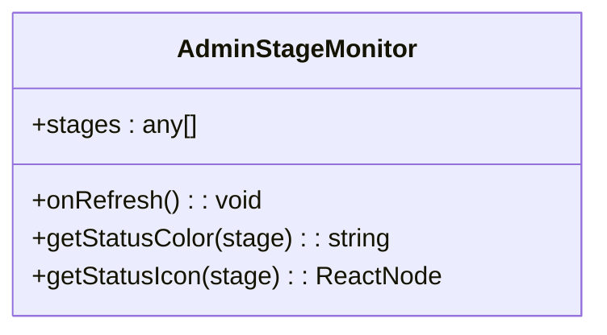

**Diagram sources**
- [AdminStageMonitor.tsx](file://src/components/admin/AdminStageMonitor.tsx#L7-L127)

**Section sources**
- [AdminStageMonitor.tsx](file://src/components/admin/AdminStageMonitor.tsx#L1-L127)

### SecurityMonitoringDashboard
The SecurityMonitoringDashboard component provides comprehensive security monitoring with real-time alerts and AI cost tracking. It displays critical security metrics including critical events, high-priority alerts, daily AI costs, and total security events. The dashboard features real-time subscription to security events through Supabase's real-time capabilities, automatically updating when new security events are inserted into the database. High-severity events trigger toast notifications to alert administrators immediately. The component also tracks AI API costs by function and model, providing visibility into usage patterns and potential cost optimization opportunities.

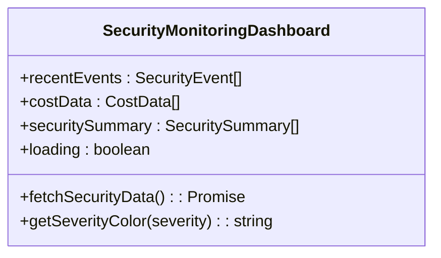

**Diagram sources**
- [SecurityMonitoringDashboard.tsx](file://src/components/admin/SecurityMonitoringDashboard.tsx#L7-L313)

**Section sources**
- [SecurityMonitoringDashboard.tsx](file://src/components/admin/SecurityMonitoringDashboard.tsx#L1-L313)

### OrderStatusBoard
The OrderStatusBoard component provides a Kanban-style view of orders across different workflow stages. It organizes orders into columns based on their current status (quote requested, quote sent, approved, assigned, in production, quality check, completed, shipped), allowing administrators to visualize the entire order pipeline. Each order card displays key information including order number, product type, quantity, price, and due date. The board supports searching and filtering, making it easy to locate specific orders. This visual representation helps identify bottlenecks in the production process and ensures timely follow-up on pending orders.

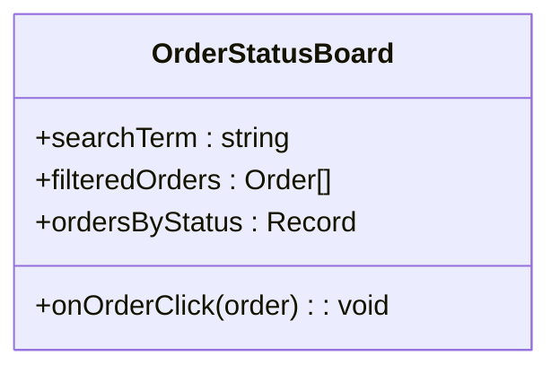

**Diagram sources**
- [OrderStatusBoard.tsx](file://src/components/admin/OrderStatusBoard.tsx#L10-L222)

**Section sources**
- [OrderStatusBoard.tsx](file://src/components/admin/OrderStatusBoard.tsx#L1-L222)

### RateLimitMonitoringDashboard
The RateLimitMonitoringDashboard component monitors API rate limits across various endpoints to prevent abuse and ensure system stability. It tracks usage patterns for OTP requests, conversations, wishlist operations, and AI quote generation. The dashboard displays metrics including total requests, unique identifiers, maximum requests per identifier, and average requests per identifier. It identifies high-usage identifiers that are approaching rate limits and displays alerts when potential abuse patterns are detected. This proactive monitoring helps maintain system performance and security by identifying and addressing potential denial-of-service attacks or abusive usage patterns.

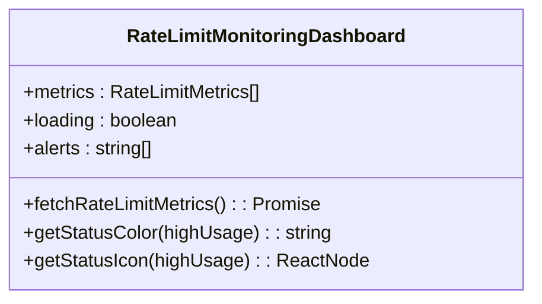

**Diagram sources**
- [RateLimitMonitoringDashboard.tsx](file://src/components/admin/RateLimitMonitoringDashboard.tsx#L9-L204)

**Section sources**
- [RateLimitMonitoringDashboard.tsx](file://src/components/admin/RateLimitMonitoringDashboard.tsx#L1-L204)

## Data Visualization and Analytics

The admin dashboard includes sophisticated data visualization components that provide insights into business performance and operational metrics.

### DashboardAnalytics
The DashboardAnalytics component serves as the central hub for business intelligence, providing comprehensive insights into key performance metrics. It uses React Query to fetch and cache analytics data, ensuring up-to-date information with efficient data fetching. The component features a time range selector (today, week, month, quarter, year, all) that allows administrators to analyze trends over different periods. Key metrics include total quotes, conversion rate, total revenue, and average response time. The analytics are presented through multiple tabs including overview, conversion funnel, performance metrics, and leaderboard, providing different perspectives on business performance.

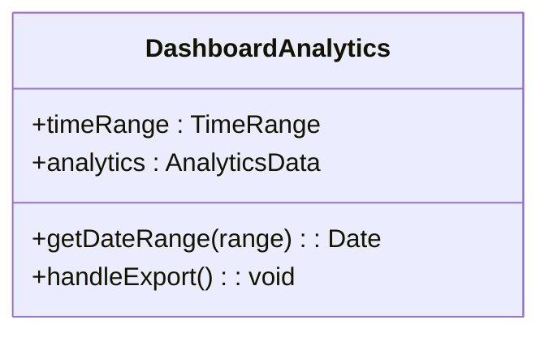

**Diagram sources**
- [DashboardAnalytics.tsx](file://src/components/admin/DashboardAnalytics.tsx#L37-L784)

**Section sources**
- [DashboardAnalytics.tsx](file://src/components/admin/DashboardAnalytics.tsx#L1-L784)

### FinancialChartsEnhanced
The FinancialChartsEnhanced component provides advanced financial data visualization using Recharts. It displays three key financial metrics: monthly earnings trend through a line chart, payment status distribution through a pie chart, and orders completed per month through a bar chart. The component uses responsive containers to ensure charts are properly displayed on different screen sizes. It leverages CSS variables for consistent theming with the application's design system. The charts provide visual insights into revenue patterns, payment processing efficiency, and production capacity utilization.

```mermaid
classDiagram
class FinancialChartsEnhanced {
+monthlyData : Array<{month : string, earnings : number, orders : number}>
+paymentStatus : Array<{name : string, value : number}>
}
```

**Diagram sources**
- [FinancialChartsEnhanced.tsx](file://src/components/admin/FinancialChartsEnhanced.tsx#L4-L89)

**Section sources**
- [FinancialChartsEnhanced.tsx](file://src/components/admin/FinancialChartsEnhanced.tsx#L1-L89)

### PaymentManagement
The PaymentManagement component provides a comprehensive view of all invoices and payment statuses. It displays key financial metrics including total revenue, collected amounts, and pending payments through summary cards. The component includes a searchable table of all invoices with filtering by status (pending, paid, overdue). Each invoice entry shows the invoice number, associated order, payment type, amount, status with appropriate icons, and due date. This component helps administrators track payment collection, identify overdue invoices, and manage the financial aspects of the business efficiently.

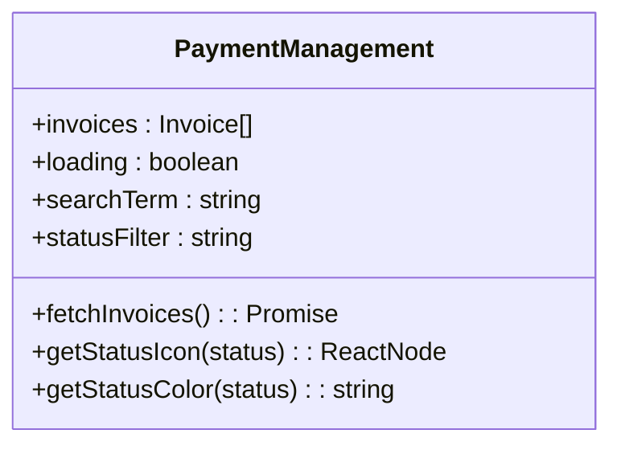

**Diagram sources**
- [PaymentManagement.tsx](file://src/components/admin/PaymentManagement.tsx#L26-L232)

**Section sources**
- [PaymentManagement.tsx](file://src/components/admin/PaymentManagement.tsx#L1-L232)

## Form-Based Components

The admin dashboard includes several form-based components that facilitate data entry and management operations.

### CreateSupplierOrderDialog
The CreateSupplierOrderDialog component enables administrators to create supplier orders with associated production stages. It provides a multi-step form interface that captures essential order information including supplier selection, product type, quantity, pricing, and special instructions. A key feature is the ability to define multiple production stages with names, descriptions, and target dates, which are automatically created when the order is submitted. The form includes validation and uses Supabase to insert the order into the database and create corresponding production stages. The component supports prefilled data, allowing it to be initialized with information from other parts of the system.

```mermaid
classDiagram
class CreateSupplierOrderDialog {
+open : boolean
+onOpenChange(open) : void
+onSuccess() : void
+prefilledData : {buyerEmail? : string, buyerName? : string, productType? : string, quantity? : number}
+suppliers : any[]
+stages : {name : string, description : string, target_date : string}[]
+formData : {supplier_id : string, order_number : string, product_type : string, quantity : string, buyer_price : string, supplier_price : string, target_date : string, special_instructions : string}
+fetchSuppliers() : Promise<void>
+handleSubmit(e) : Promise<void>
}
```

**Diagram sources**
- [CreateSupplierOrderDialog.tsx](file://src/components/admin/CreateSupplierOrderDialog.tsx#L12-L203)

**Section sources**
- [CreateSupplierOrderDialog.tsx](file://src/components/admin/CreateSupplierOrderDialog.tsx#L1-L203)

### SupplierAssignmentDialog
The SupplierAssignmentDialog component facilitates the assignment of suppliers to orders. It provides a searchable list of verified suppliers sorted by performance score, allowing administrators to make informed decisions. The interface includes supplier cards that display key information including company name, location, performance score, MOQ, and lead time. When a supplier is selected, the administrator can set the supplier price and add special instructions. The component calculates and displays the estimated margin based on the buyer price and supplier price. This ensures transparency in pricing decisions and helps maintain healthy profit margins.

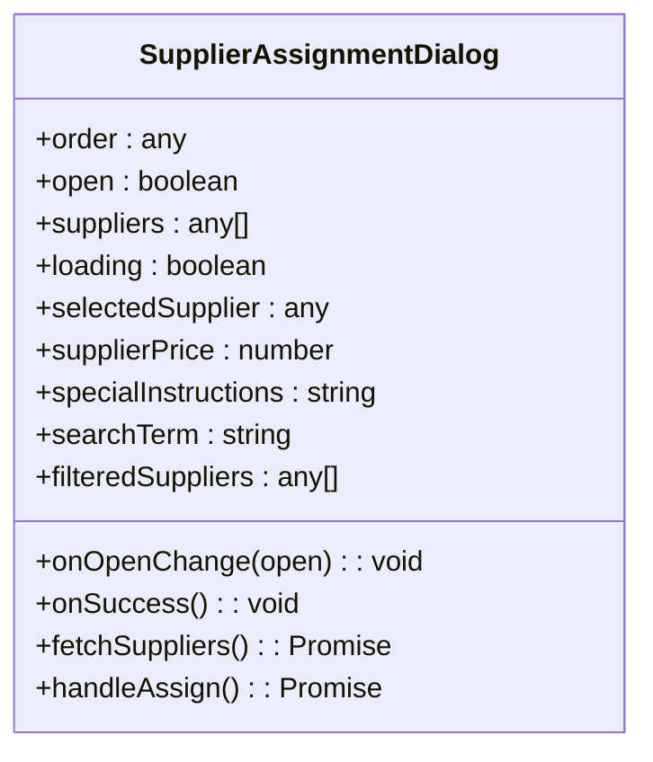

**Diagram sources**
- [SupplierAssignmentDialog.tsx](file://src/components/admin/SupplierAssignmentDialog.tsx#L19-L238)

**Section sources**
- [SupplierAssignmentDialog.tsx](file://src/components/admin/SupplierAssignmentDialog.tsx#L1-L238)

## AI-Powered Tools

The admin dashboard incorporates several AI-powered tools that leverage predictive analytics to enhance decision-making and operational efficiency.

### AIQuoteDashboard
The AIQuoteDashboard component provides a centralized interface for managing AI-generated quotes from buyers. It displays a comprehensive table of quotes with key information including buyer details, product type, quantity, target price, AI-suggested price, status, and creation date. The dashboard includes filtering capabilities by status (pending, interested, assigned, declined) and search functionality by buyer name, email, or product type. Each quote entry includes quick action buttons to view details, mark as interested, decline, or assign to a supplier. The component uses React Query for data fetching and mutation, ensuring that status updates are reflected immediately in the UI.

```mermaid
classDiagram
class AIQuoteDashboard {
+searchQuery : string
+statusFilter : string
+selectedQuote : AIQuote | null
+quotes : AIQuote[]
+isLoading : boolean
+stats : {total : number, pending : number, interested : number, assigned : number, declined : number}
+updateStatusMutation : Mutation
+filteredQuotes : AIQuote[]
+getStatusBadge(status) : ReactNode
}
```

**Diagram sources**
- [AIQuoteDashboard.tsx](file://src/components/admin/AIQuoteDashboard.tsx#L44-L410)

**Section sources**
- [AIQuoteDashboard.tsx](file://src/components/admin/AIQuoteDashboard.tsx#L1-L410)

### SmartSupplierAssignment
The SmartSupplierAssignment component leverages AI to recommend the most suitable suppliers for specific orders. It uses a confidence-based ranking system to present suppliers in order of suitability, with explanations for each recommendation. The component displays key supplier metrics including monthly capacity, performance score, and lead time days. Each recommendation includes a confidence badge (high, medium, low) and a percentage match score. The AI reasoning is displayed to provide transparency into the recommendation process, helping administrators understand why a particular supplier was recommended. This tool significantly reduces the time required to find appropriate suppliers while improving the quality of matches.

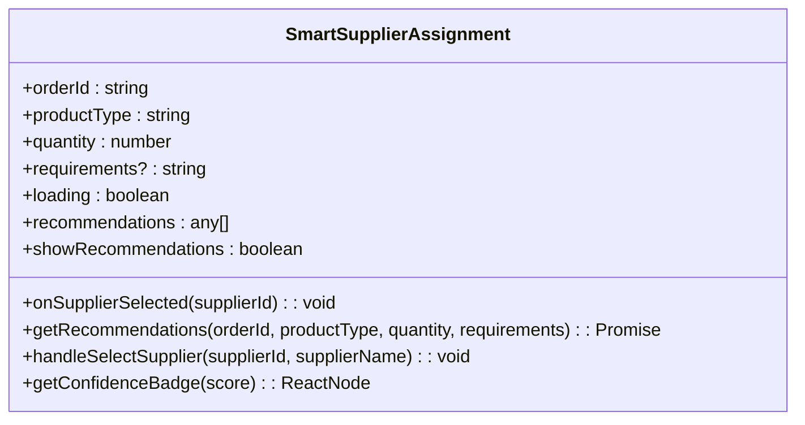

**Diagram sources**
- [SmartSupplierAssignment.tsx](file://src/components/admin/SmartSupplierAssignment.tsx#L9-L127)

**Section sources**
- [SmartSupplierAssignment.tsx](file://src/components/admin/SmartSupplierAssignment.tsx#L1-L127)

## Security and Access Control

The admin components implement robust security measures and access control patterns to protect sensitive operations and data.

### Role-Based Access Control
The system implements a comprehensive role-based access control (RBAC) system that ensures only authorized users can access admin functionality. The useAdminAuth hook checks the user's admin status by invoking the admin-check Edge Function, which verifies the user's role in the database. This server-side validation prevents clients from bypassing access controls. The admin-check function queries the user_roles table to confirm if the user has the 'admin' role, providing a secure authentication mechanism that cannot be circumvented by client-side manipulation.

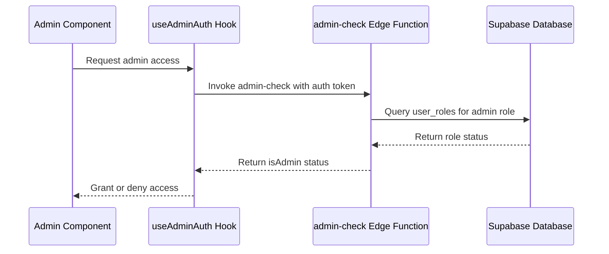

**Diagram sources**
- [useAdminAuth.ts](file://src/hooks/useAdminAuth.ts#L1-L47)
- [admin-check/index.ts](file://supabase/functions/admin-check/index.ts#L1-L74)

**Section sources**
- [useAdminAuth.ts](file://src/hooks/useAdminAuth.ts#L1-L47)
- [admin-check/index.ts](file://supabase/functions/admin-check/index.ts#L1-L74)

### SupplierVerificationCard
The SupplierVerificationCard component implements a secure workflow for verifying supplier applications. It displays supplier information including company name, contact person, factory location, workforce size, MOQ, lead time, and specializations. The component shows the current verification status with appropriate color coding (green for verified, yellow for pending, red for rejected). For pending applications, it provides approve and reject buttons with appropriate confirmation dialogs. The reject flow includes a mandatory reason field, ensuring that all rejection decisions are properly documented. This component ensures that only verified suppliers can participate in the marketplace, maintaining quality standards and trust.

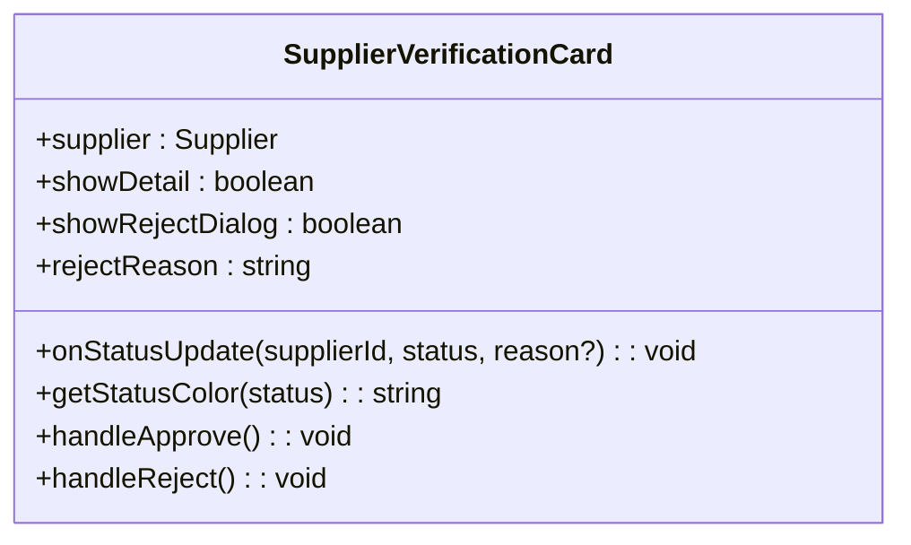

**Diagram sources**
- [SupplierVerificationCard.tsx](file://src/components/admin/SupplierVerificationCard.tsx#L32-L212)

**Section sources**
- [SupplierVerificationCard.tsx](file://src/components/admin/SupplierVerificationCard.tsx#L1-L212)

## Audit Logging

The system implements comprehensive audit logging to track all sensitive operations and ensure accountability.

### EnhancedAuditLog
The enhancedAuditLog module provides a robust audit logging system that captures detailed information about administrative actions. It defines a comprehensive set of audit action types covering blog operations, user management, order processing, payments, quotes, supplier operations, product management, production stages, security events, data access, and system operations. The logging system captures the action type, resource type, resource ID, detailed metadata, and severity level. It uses the log-audit-action Edge Function to record logs with IP address capture, ensuring that all audit records include the originating IP for security investigations. The system also provides functions to retrieve audit logs with various filtering options, enabling administrators to investigate specific events or patterns.

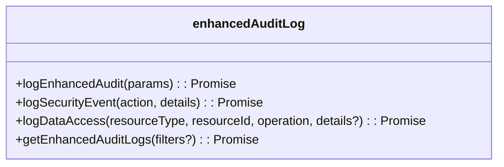

**Diagram sources**
- [enhancedAuditLog.ts](file://src/lib/enhancedAuditLog.ts#L8-L229)

**Section sources**
- [enhancedAuditLog.ts](file://src/lib/enhancedAuditLog.ts#L1-L229)

## Integration with Supabase Edge Functions

The admin components integrate extensively with Supabase Edge Functions to perform backend operations securely and efficiently.

### execute-automation-rules
The execute-automation-rules Edge Function enables automated workflows based on predefined conditions and actions. It verifies that the requesting user has admin privileges before executing any rules, ensuring that only authorized users can trigger automation. The function retrieves all active automation rules from the database, evaluates their conditions, and executes the corresponding actions when conditions are met. Supported actions include sending emails, updating status, and assigning suppliers. Each rule execution is logged in the admin_actions table for audit purposes. This system enables administrators to create complex workflows that automate routine tasks, improving operational efficiency and consistency.

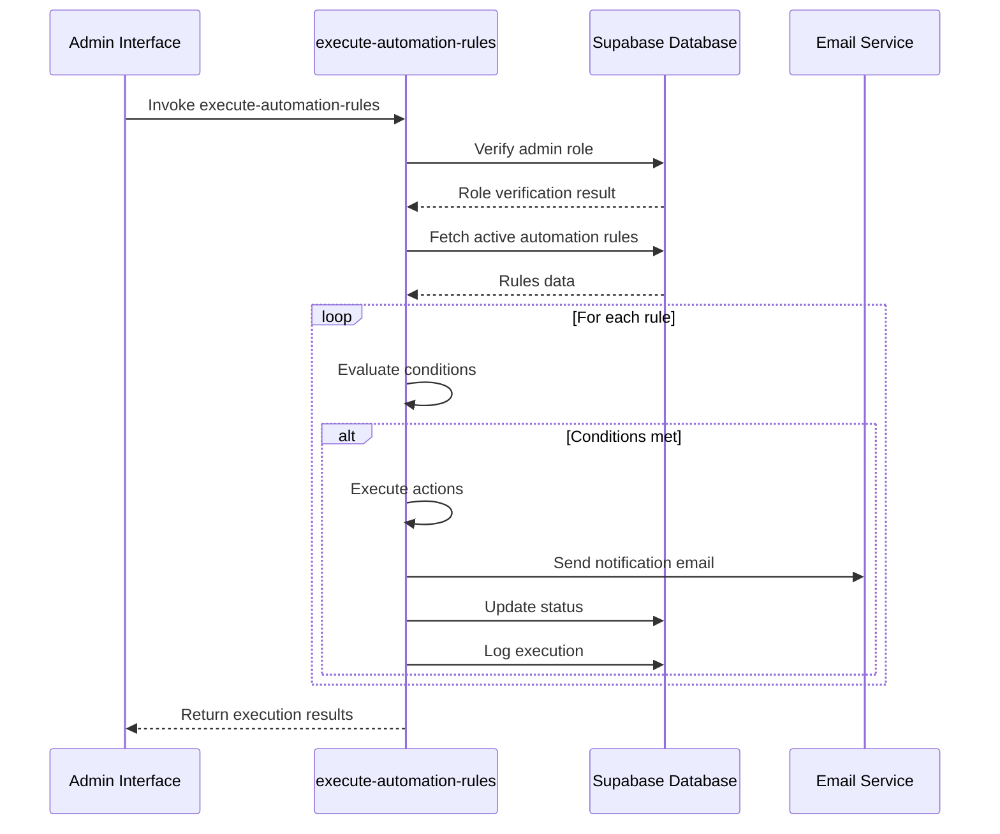

**Diagram sources**
- [execute-automation-rules/index.ts](file://supabase/functions/execute-automation-rules/index.ts#L1-L193)

**Section sources**
- [execute-automation-rules/index.ts](file://supabase/functions/execute-automation-rules/index.ts#L1-L193)

### Backend Integration Pattern
The admin components follow a consistent pattern for integrating with Supabase Edge Functions. They use the supabase.functions.invoke method to call Edge Functions, passing any required parameters in the request body. Authentication is handled automatically through the Supabase client, which includes the user's JWT token in the request headers. This pattern ensures that all backend operations are performed securely with proper authentication and authorization. The Edge Functions act as a secure gateway between the frontend and the database, enforcing business logic and access controls on the server side.

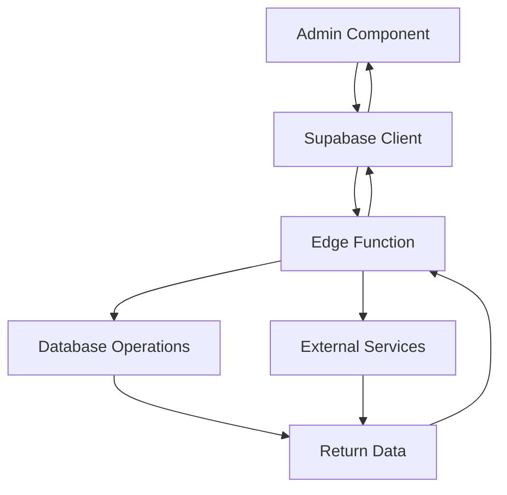

**Diagram sources**
- [useAdminAuth.ts](file://src/hooks/useAdminAuth.ts#L1-L47)
- [enhancedAuditLog.ts](file://src/lib/enhancedAuditLog.ts#L1-L229)
- [execute-automation-rules/index.ts](file://supabase/functions/execute-automation-rules/index.ts#L1-L193)

**Section sources**
- [useAdminAuth.ts](file://src/hooks/useAdminAuth.ts#L1-L47)
- [enhancedAuditLog.ts](file://src/lib/enhancedAuditLog.ts#L1-L229)
- [execute-automation-rules/index.ts](file://supabase/functions/execute-automation-rules/index.ts#L1-L193)

## Extending Components for Custom Workflows

The admin components are designed to be extensible, allowing for the creation of custom workflows tailored to specific business needs.

### Component Extension Patterns
The components follow several design patterns that facilitate extension and customization:
1. **Prop-based configuration**: Components accept props that allow customization of behavior and appearance
2. **Callback functions**: Components provide callback props (onSuccess, onStatusUpdate) that enable integration with parent components
3. **Modular design**: Components are designed as independent units that can be composed together
4. **Type-safe interfaces**: TypeScript interfaces define clear contracts for component usage

To extend components for custom workflows, developers can:
1. Wrap existing components with additional functionality
2. Create new components that follow the same patterns
3. Extend component props to support additional features
4. Integrate with additional Edge Functions for specialized backend operations

### Example: Custom Supplier Verification Workflow
A custom supplier verification workflow could be implemented by extending the SupplierVerificationCard component:

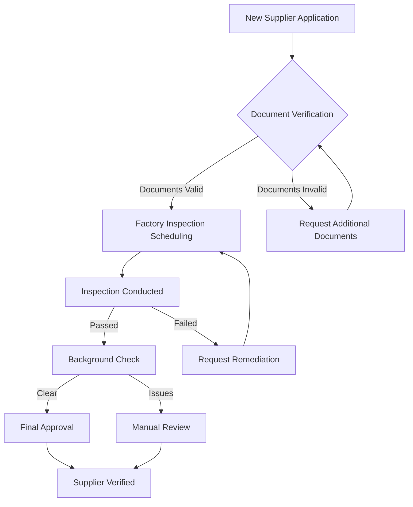

This workflow could be implemented by creating a new component that orchestrates the verification process, using the existing SupplierVerificationCard as a base and adding additional steps for document verification, factory inspection, and background checks.

## Conclusion
The admin components directory contains a comprehensive suite of UI components that provide administrators with powerful tools for managing the platform. These components are well-structured, follow consistent design patterns, and integrate seamlessly with Supabase Edge Functions for secure backend operations. The use of React Query for data fetching, proper error handling, and accessibility considerations demonstrate a high level of implementation quality. The components are designed with extensibility in mind, allowing for the creation of custom workflows to meet evolving business needs. By leveraging these components, administrators can effectively oversee production, manage suppliers, analyze performance, and ensure system security, ultimately driving the success of the platform.