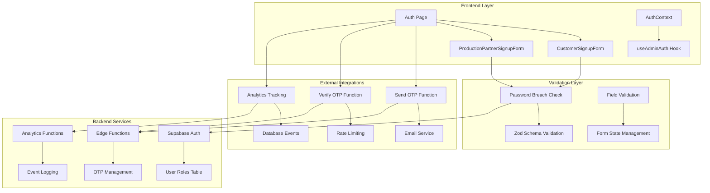
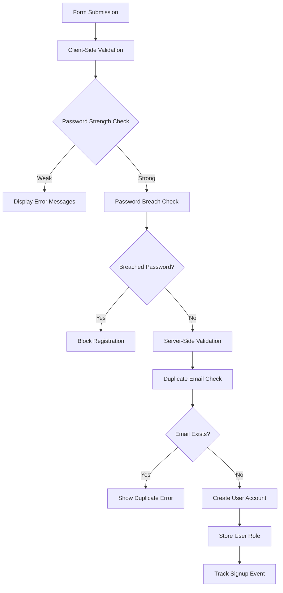
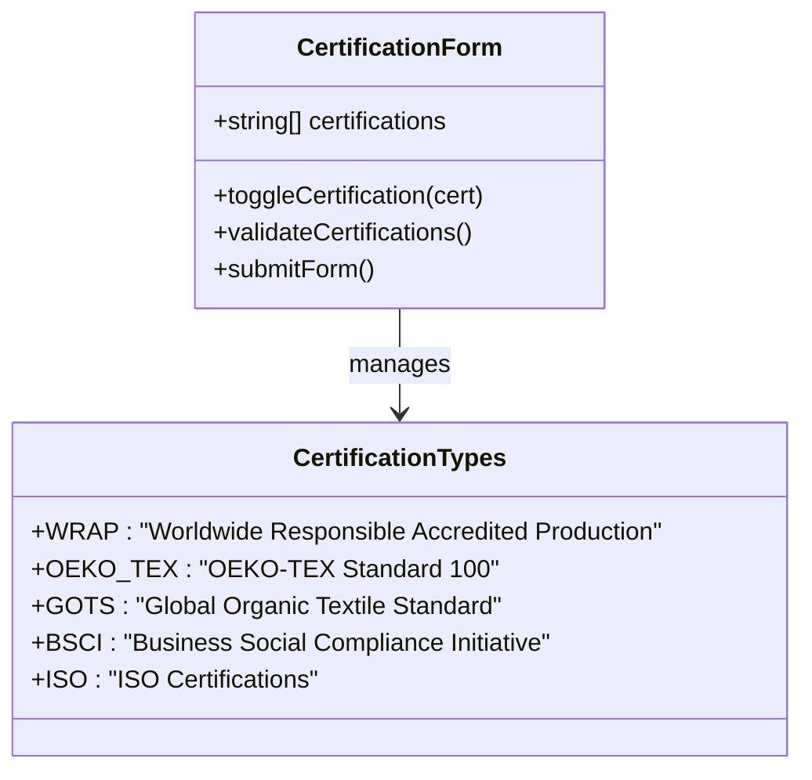
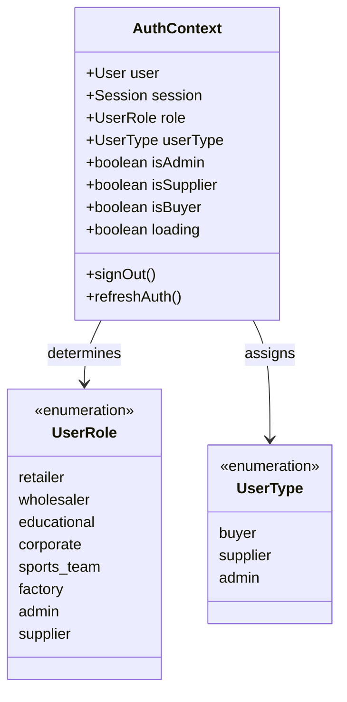
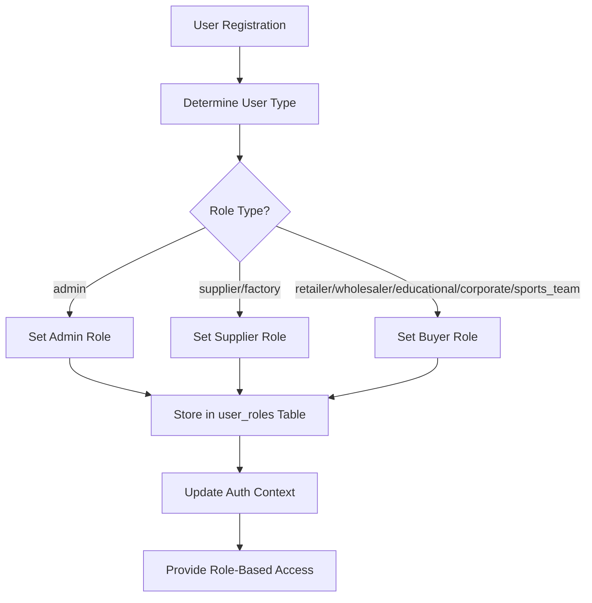
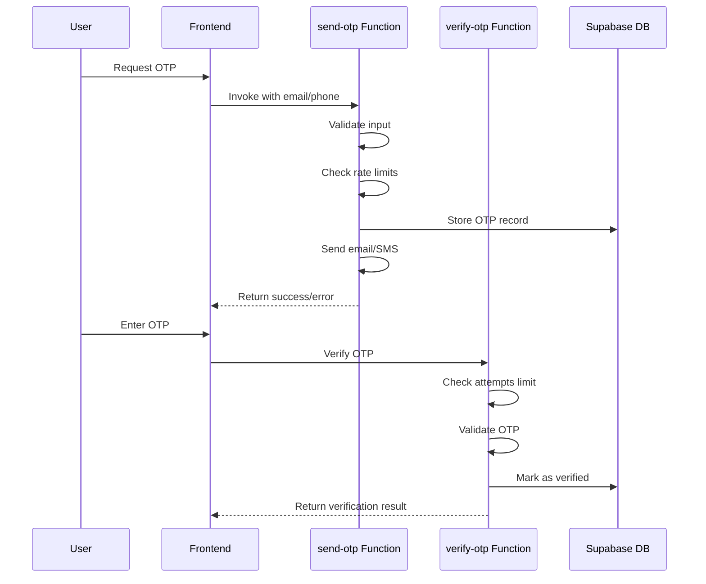
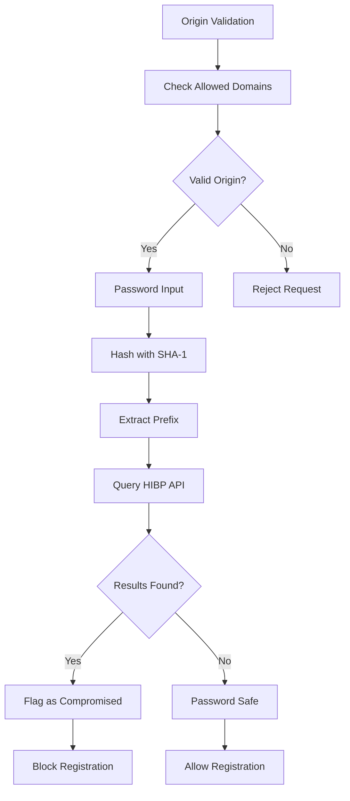
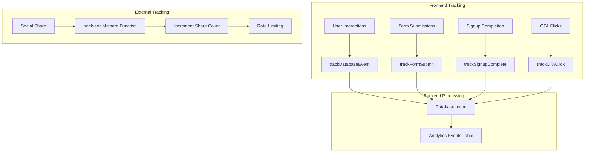
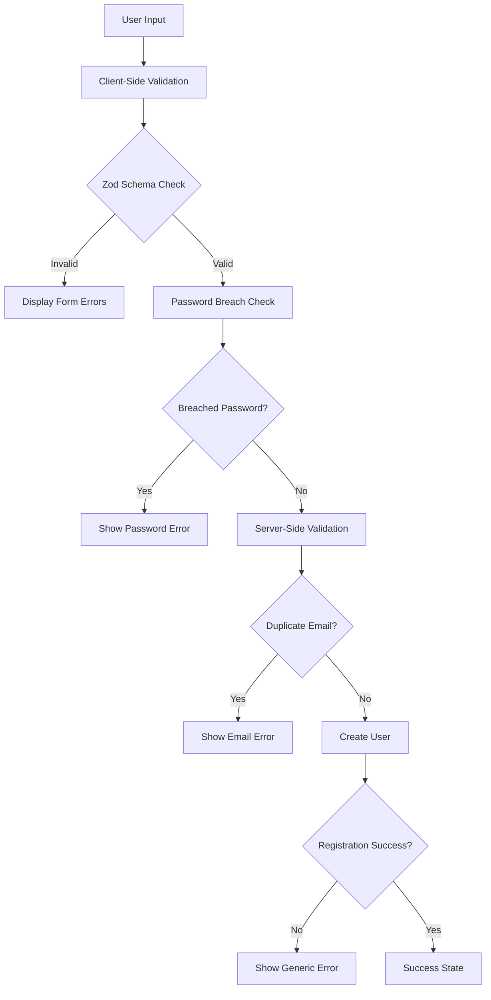

# Authentication Components

<cite>
**Referenced Files in This Document**
- [CustomerSignupForm.tsx](file://src/components/auth/CustomerSignupForm.tsx)
- [ProductionPartnerSignupForm.tsx](file://src/components/auth/ProductionPartnerSignupForm.tsx)
- [AuthContext.tsx](file://src/contexts/AuthContext.tsx)
- [useAdminAuth.ts](file://src/hooks/useAdminAuth.ts)
- [Auth.tsx](file://src/pages/Auth.tsx)
- [send-otp/index.ts](file://supabase/functions/send-otp/index.ts)
- [verify-otp/index.ts](file://supabase/functions/verify-otp/index.ts)
- [password-breach-check/index.ts](file://supabase/functions/password-breach-check/index.ts)
- [track-social-share/index.ts](file://supabase/functions/track-social-share/index.ts)
- [analyticsTracking.ts](file://src/lib/analyticsTracking.ts)
- [LeadCaptureForm.tsx](file://src/components/LeadCaptureForm.tsx)
- [database.ts](file://src/types/database.ts)
</cite>

## Table of Contents
1. [Introduction](#introduction)
2. [Authentication Architecture Overview](#authentication-architecture-overview)
3. [Customer Signup Form](#customer-signup-form)
4. [Production Partner Signup Form](#production-partner-signup-form)
5. [Shared Authentication Logic](#shared-authentication-logic)
6. [OTP Verification System](#otp-verification-system)
7. [Password Security](#password-security)
8. [Analytics and Lead Capture](#analytics-and-lead-capture)
9. [Error Handling and Validation](#error-handling-and-validation)
10. [Regional Compliance and Accessibility](#regional-compliance-and-accessibility)
11. [Implementation Guidelines](#implementation-guidelines)
12. [Troubleshooting Guide](#troubleshooting-guide)

## Introduction

The authentication system in Sleek Apparels provides a comprehensive framework for user registration across multiple user types, including clothing brands, startups, manufacturers, and fabric suppliers. The system implements robust security measures, OTP verification, password breach checking, and analytics tracking while maintaining accessibility standards and regional compliance requirements.

The authentication components are built around a modular architecture that separates concerns between form presentation, business logic, and external integrations. This design enables easy customization for different market segments while maintaining consistent security standards.

## Authentication Architecture Overview

The authentication system follows a layered architecture with clear separation of responsibilities:



**Diagram sources**
- [Auth.tsx](file://src/pages/Auth.tsx#L1-L688)
- [CustomerSignupForm.tsx](file://src/components/auth/CustomerSignupForm.tsx#L1-L203)
- [ProductionPartnerSignupForm.tsx](file://src/components/auth/ProductionPartnerSignupForm.tsx#L1-L288)

**Section sources**
- [Auth.tsx](file://src/pages/Auth.tsx#L1-L688)
- [AuthContext.tsx](file://src/contexts/AuthContext.tsx#L1-L166)

## Customer Signup Form

The CustomerSignupForm is specifically designed for clothing brands, schools, corporates, and teams requiring custom apparel solutions. It captures essential business information while maintaining a streamlined user experience.

### Form Structure and Fields

The form collects comprehensive data about potential customers, organized into logical sections:

| Field Category | Fields | Purpose | Validation Rules |
|----------------|--------|---------|------------------|
| **Personal Information** | Full Name, Email, Password | User identification and authentication | Required, email format, password strength |
| **Business Details** | Company Name, Phone Number | Business identification | Optional business phone number |
| **Customer Type** | Selection from predefined categories | User segmentation | Required selection |
| **Business Volume** | Expected monthly order range | Capacity planning | Required selection |
| **Product Interest** | Primary product categories | Product focus | Required selection |

### Field Validation Implementation

The form implements comprehensive validation through multiple layers:



**Diagram sources**
- [CustomerSignupForm.tsx](file://src/components/auth/CustomerSignupForm.tsx#L30-L203)
- [Auth.tsx](file://src/pages/Auth.tsx#L155-L230)

### Customer Type Options

The form presents carefully curated options for different business types:

- **Fashion Brand / Clothing Line**: For established fashion companies and emerging designers
- **Retail Business / E-commerce**: For online retailers and brick-and-mortar stores
- **School / Educational Institution**: For educational facilities and student organizations
- **Corporate / Business (Uniforms)**: For corporate uniform and branded merchandise needs
- **Sports Team / Club**: For athletic teams and sports organizations
- **Other**: For specialized or niche business types

### Business Volume Estimation

The expected monthly volume field helps suppliers understand order scales:

- **50-500 pieces**: Small businesses and startups
- **500-2,000 pieces**: Medium-sized enterprises
- **2,000-5,000 pieces**: Established brands and distributors
- **5,000+ pieces**: Large corporations and bulk buyers
- **Not sure yet**: For exploratory inquiries

**Section sources**
- [CustomerSignupForm.tsx](file://src/components/auth/CustomerSignupForm.tsx#L1-L203)
- [Auth.tsx](file://src/pages/Auth.tsx#L155-L230)

## Production Partner Signup Form

The ProductionPartnerSignupForm targets manufacturers, fabric suppliers, and trim providers, requiring detailed information about production capabilities and certifications.

### Advanced Field Collection

The form captures comprehensive manufacturing and supply chain information:

| Field Category | Fields | Purpose | Data Type |
|----------------|--------|---------|-----------|
| **Contact Information** | Full Name, Business Email, Phone | Primary contact details | Text/Email/Phone |
| **Business Details** | Factory/Company Name, Location | Business identification | Text |
| **Production Capacity** | Monthly production range | Capacity assessment | Selection |
| **Certifications** | Multiple certification checkboxes | Quality assurance | Multi-select |
| **Specialization** | Product specialization | Business focus | Selection |

### Factory Capacity and Production Details

The form includes sophisticated fields for manufacturing capabilities:

- **Monthly Production Capacity**: Ranges from 500-5,000 pieces to 50,000+ pieces per month
- **Certification Tracking**: Supports major industry standards including WRAP, OEKO-TEX, GOTS, BSCI, and ISO
- **Specialization Areas**: Covers casualwear, activewear, uniforms, and specialty products

### Certification Management

The form implements a sophisticated certification tracking system:



**Diagram sources**
- [ProductionPartnerSignupForm.tsx](file://src/components/auth/ProductionPartnerSignupForm.tsx#L52-L288)

### Partner Type Classification

The form categorizes different types of manufacturing partners:

- **Garment Manufacturing**: Finished product manufacturers
- **Fabric Supply**: Textile and fabric suppliers
- **Trims & Accessories**: Buttons, labels, and accessory providers
- **Raw Materials**: Yarn, thread, and basic material suppliers
- **Other Services**: Specialized manufacturing services

**Section sources**
- [ProductionPartnerSignupForm.tsx](file://src/components/auth/ProductionPartnerSignupForm.tsx#L1-L288)
- [database.ts](file://src/types/database.ts#L550-L555)

## Shared Authentication Logic

The authentication system implements shared logic through centralized hooks and contexts, ensuring consistent behavior across different user types.

### AuthContext Implementation

The AuthContext provides comprehensive authentication state management:



**Diagram sources**
- [AuthContext.tsx](file://src/contexts/AuthContext.tsx#L17-L166)

### Role Assignment Logic

The system implements intelligent role assignment based on user attributes:



**Diagram sources**
- [AuthContext.tsx](file://src/contexts/AuthContext.tsx#L67-L74)
- [Auth.tsx](file://src/pages/Auth.tsx#L198-L209)

### useAdminAuth Hook

The useAdminAuth hook provides specialized administrative authentication checks:

- **Server-side Validation**: Uses Edge Functions for secure admin verification
- **Session Management**: Maintains authentication state across page reloads
- **Permission Checking**: Validates admin privileges with rate limiting

**Section sources**
- [AuthContext.tsx](file://src/contexts/AuthContext.tsx#L1-L166)
- [useAdminAuth.ts](file://src/hooks/useAdminAuth.ts#L1-L47)

## OTP Verification System

The OTP (One-Time Password) verification system provides secure user authentication through email and phone verification channels.

### OTP Function Architecture

The OTP system consists of two primary Edge Functions:



**Diagram sources**
- [send-otp/index.ts](file://supabase/functions/send-otp/index.ts#L131-L489)
- [verify-otp/index.ts](file://supabase/functions/verify-otp/index.ts#L21-L356)

### Email OTP Features

The email OTP system includes comprehensive security and usability features:

- **Rate Limiting**: Prevents abuse with 5-minute cooldown and hourly attempt limits
- **Disposable Email Protection**: Blocks temporary email domains
- **Retry Logic**: Implements exponential backoff for failed deliveries
- **Delivery Tracking**: Monitors email delivery status and logs failures
- **Daily Quote Limits**: Restricts quote requests to 3 per day for email-quote type

### Phone OTP Implementation

The phone OTP system handles international phone numbers with:

- **Format Validation**: Ensures proper phone number formatting
- **Country Code Support**: Handles international dialing prefixes
- **SMS Integration**: Connects with SMS providers for message delivery
- **Verification Tracking**: Logs successful and failed verification attempts

### Security Measures

The OTP system implements multiple security layers:

- **Time-based Expiration**: OTPs expire after 10 minutes
- **Attempt Limiting**: Maximum 5 attempts per OTP code
- **Rate Limiting**: Prevents brute force attacks
- **IP Tracking**: Monitors suspicious activity patterns
- **Encryption**: Secure storage of OTP codes and associated data

**Section sources**
- [send-otp/index.ts](file://supabase/functions/send-otp/index.ts#L1-L489)
- [verify-otp/index.ts](file://supabase/functions/verify-otp/index.ts#L1-L356)

## Password Security

The password security system implements multiple layers of protection to ensure strong authentication credentials.

### Password Breach Detection

The password-breach-check Edge Function provides real-time password security validation:



**Diagram sources**
- [password-breach-check/index.ts](file://supabase/functions/password-breach-check/index.ts#L1-L142)

### Password Strength Requirements

The system enforces comprehensive password policies:

- **Minimum Length**: 8 characters
- **Complexity Requirements**: Must contain uppercase, lowercase, and numeric characters
- **Length Limits**: Maximum 128 characters
- **Breached Password Check**: Real-time validation against known compromised passwords

### Security Validation Features

The password security system includes:

- **Have I Been Pwned Integration**: Uses k-anonymity API for secure breach detection
- **Origin Validation**: Restricts API access to approved domains
- **Fail-Safe Operation**: Continues operation even if breach service is unavailable
- **Rate Limiting**: Prevents abuse of the breach checking service

### Zod Schema Validation

The frontend implements comprehensive validation using Zod schemas:

```typescript
const signupSchema = z.object({
  email: z.string().email({ message: "Invalid email address" }).max(255),
  password: z.string()
    .min(8, { message: "Password must be at least 8 characters" })
    .max(128, { message: "Password too long" })
    .regex(/[A-Z]/, { message: "Password must contain at least one uppercase letter" })
    .regex(/[a-z]/, { message: "Password must contain at least one lowercase letter" })
    .regex(/[0-9]/, { message: "Password must contain at least one number" }),
  fullName: z.string().trim().min(1, { message: "Name is required" }).max(100),
});
```

**Section sources**
- [password-breach-check/index.ts](file://supabase/functions/password-breach-check/index.ts#L1-L142)
- [Auth.tsx](file://src/pages/Auth.tsx#L17-L28)

## Analytics and Lead Capture

The analytics and lead capture system provides comprehensive tracking and conversion optimization capabilities.

### Analytics Tracking Architecture

The analytics system implements a dual-layer tracking approach:



**Diagram sources**
- [analyticsTracking.ts](file://src/lib/analyticsTracking.ts#L1-L149)
- [track-social-share/index.ts](file://supabase/functions/track-social-share/index.ts#L1-L129)

### Lead Capture Integration

The LeadCaptureForm provides comprehensive lead generation capabilities:

- **Multi-Channel Tracking**: Captures UTM parameters for marketing attribution
- **Browser Intelligence**: Records user agent, language, and screen resolution
- **Duplicate Prevention**: Prevents duplicate entries with email validation
- **Success Tracking**: Provides immediate feedback and success state management

### Social Media Sharing Analytics

The social share tracking system monitors content engagement:

- **Platform Tracking**: Supports LinkedIn, Facebook, Twitter, and WhatsApp
- **Rate Limiting**: Prevents spam with hourly sharing limits
- **Post Verification**: Ensures shared posts exist in the database
- **Share Count Updates**: Automatically increments share counts

### Conversion Tracking

The system tracks key conversion events:

- **Signup Completion**: Tracks successful registrations by method and user type
- **Form Submissions**: Monitors form success rates and error patterns
- **CTA Engagement**: Tracks call-to-action clicks and locations
- **User Journey**: Maps user progression through the signup funnel

**Section sources**
- [analyticsTracking.ts](file://src/lib/analyticsTracking.ts#L1-L149)
- [LeadCaptureForm.tsx](file://src/components/LeadCaptureForm.tsx#L1-L115)
- [track-social-share/index.ts](file://supabase/functions/track-social-share/index.ts#L1-L129)

## Error Handling and Validation

The authentication system implements comprehensive error handling and validation across multiple layers.

### Validation Pipeline

The validation system operates through a multi-stage pipeline:



**Diagram sources**
- [Auth.tsx](file://src/pages/Auth.tsx#L155-L230)

### Error Message Management

The system provides contextual error messages for different scenarios:

- **Password Validation**: Specific feedback for strength requirements
- **Email Conflicts**: Clear messaging for duplicate accounts
- **Network Errors**: User-friendly network connectivity warnings
- **OTP Failures**: Detailed feedback for verification attempts
- **Rate Limiting**: Informative messages for throttled requests

### Network Error Handling

The system gracefully handles network-related issues:

- **CORS Configuration**: Proper cross-origin request handling
- **Service Unavailability**: Fallback mechanisms for external services
- **Timeout Management**: Graceful handling of slow responses
- **Retry Logic**: Automatic retry for transient failures

### Form State Management

The form state management ensures consistent user experience:

- **Loading States**: Clear indication during processing
- **Success Feedback**: Immediate confirmation of successful actions
- **Error Persistence**: Maintains error states until resolved
- **Form Reset**: Clean state management after successful submissions

**Section sources**
- [Auth.tsx](file://src/pages/Auth.tsx#L155-L230)
- [CustomerSignupForm.tsx](file://src/components/auth/CustomerSignupForm.tsx#L75-L96)
- [ProductionPartnerSignupForm.tsx](file://src/components/auth/ProductionPartnerSignupForm.tsx#L89-L110)

## Regional Compliance and Accessibility

The authentication system incorporates regional compliance requirements and accessibility standards.

### Regional Compliance Features

The system addresses various regional regulatory requirements:

- **GDPR Compliance**: Data protection and privacy controls
- **Data Retention**: Configurable retention policies for different regions
- **Consent Management**: Explicit consent tracking for data processing
- **Cross-Border Support**: International phone number validation

### Accessibility Implementation

The forms implement comprehensive accessibility features:

- **ARIA Labels**: Complete screen reader support
- **Keyboard Navigation**: Full keyboard accessibility
- **Focus Management**: Logical focus flow through form elements
- **High Contrast Support**: Visual accessibility for users with visual impairments
- **Responsive Design**: Mobile-friendly form layouts

### Localization Support

The system supports internationalization:

- **Multi-language Forms**: Translatable form labels and instructions
- **Regional Formats**: Phone number and date format localization
- **Currency Support**: International currency representation
- **Time Zone Handling**: UTC-based timestamp management

### Security Compliance

The system meets industry security standards:

- **HTTPS Enforcement**: Mandatory encrypted connections
- **CSRF Protection**: Cross-site request forgery prevention
- **XSS Prevention**: Input sanitization and output encoding
- **Security Headers**: Comprehensive HTTP security headers

**Section sources**
- [send-otp/index.ts](file://supabase/functions/send-otp/index.ts#L1-L489)
- [verify-otp/index.ts](file://supabase/functions/verify-otp/index.ts#L1-L356)

## Implementation Guidelines

### Customizing Forms for Different Markets

When adapting the authentication forms for different markets:

1. **Localization**: Translate form labels and error messages
2. **Regulatory Compliance**: Adapt to local data protection laws
3. **Cultural Sensitivity**: Adjust form field requirements appropriately
4. **Technical Requirements**: Support local phone number formats

### Adding New User Types

To introduce new user types:

1. **Extend UserRole Enum**: Add new roles to the database schema
2. **Update Form Components**: Create specialized forms as needed
3. **Modify Role Assignment Logic**: Update the AuthContext role determination
4. **Add Validation Rules**: Implement appropriate validation for new types

### Security Hardening

For enhanced security:

1. **Two-Factor Authentication**: Implement optional 2FA for sensitive accounts
2. **IP Geolocation**: Block suspicious geographic locations
3. **Behavioral Analytics**: Monitor for unusual authentication patterns
4. **Regular Security Audits**: Conduct periodic security assessments

### Performance Optimization

To optimize performance:

1. **Form Validation Debouncing**: Implement input debouncing for real-time validation
2. **Lazy Loading**: Load form components only when needed
3. **Caching Strategies**: Cache frequently accessed validation rules
4. **CDN Integration**: Serve static assets from content delivery networks

## Troubleshooting Guide

### Common Issues and Solutions

**OTP Delivery Failures**
- Verify email service configuration
- Check rate limiting thresholds
- Validate recipient email addresses
- Review spam filters for verification emails

**Password Breach Detection Issues**
- Ensure internet connectivity for HIBP API
- Check origin validation settings
- Verify API key permissions
- Review rate limiting configurations

**Form Validation Errors**
- Validate client-side schema consistency
- Check server-side validation alignment
- Verify error message translations
- Test with various input combinations

**Authentication Context Issues**
- Verify Supabase configuration
- Check session persistence
- Validate role assignment logic
- Review permission scopes

### Debugging Tools

The system provides several debugging capabilities:

- **Console Logging**: Development environment logging
- **Error Boundaries**: Graceful error handling
- **Analytics Tracking**: Event monitoring and debugging
- **Network Inspection**: API request/response debugging

### Monitoring and Maintenance

Regular maintenance tasks include:

- **Log Review**: Monitor authentication logs for anomalies
- **Performance Metrics**: Track form load times and success rates
- **Security Audits**: Regular security assessments
- **Feature Testing**: Validate new functionality

**Section sources**
- [Auth.tsx](file://src/pages/Auth.tsx#L1-L688)
- [analyticsTracking.ts](file://src/lib/analyticsTracking.ts#L1-L149)