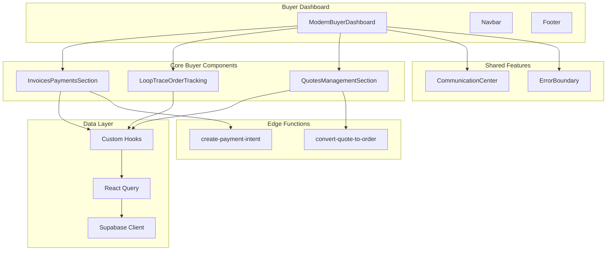
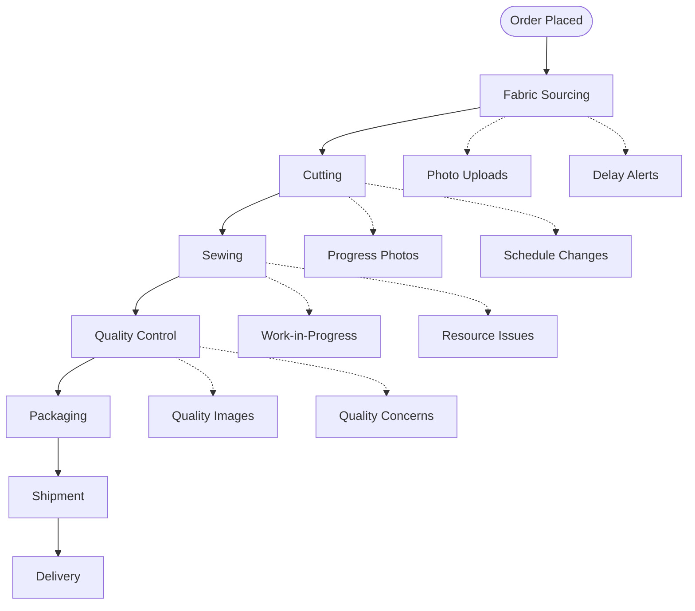
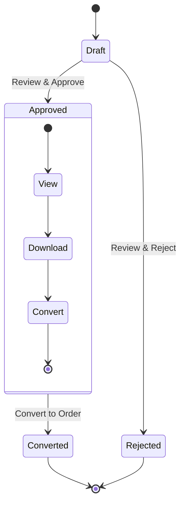

# Buyer Components

<cite>
**Referenced Files in This Document**
- [InvoicesPaymentsSection.tsx](file://src/components/buyer/InvoicesPaymentsSection.tsx)
- [LoopTraceOrderTracking.tsx](file://src/components/buyer/LoopTraceOrderTracking.tsx)
- [QuotesManagementSection.tsx](file://src/components/buyer/QuotesManagementSection.tsx)
- [useQuotes.ts](file://src/hooks/useQuotes.ts)
- [useOrders.ts](file://src/hooks/queries/useOrders.ts)
- [usePayment.ts](file://src/hooks/usePayment.ts)
- [convert-quote-to-order/index.ts](file://supabase/functions/convert-quote-to-order/index.ts)
- [CommunicationCenter.tsx](file://src/components/shared/CommunicationCenter.tsx)
- [ErrorBoundary.tsx](file://src/components/ErrorBoundary.tsx)
- [ModernBuyerDashboard.tsx](file://src/pages/ModernBuyerDashboard.tsx)
</cite>

## Table of Contents
1. [Introduction](#introduction)
2. [Component Architecture Overview](#component-architecture-overview)
3. [InvoicesPaymentsSection](#invoicespaymentssection)
4. [LoopTraceOrderTracking](#looptraceordertacking)
5. [QuotesManagementSection](#quotesmanagementsection)
6. [Data Hooks and State Management](#data-hooks-and-state-management)
7. [Edge Functions Integration](#edge-functions-integration)
8. [Error Handling and Resilience](#error-handling-and-resilience)
9. [Responsive Design Considerations](#responsive-design-considerations)
10. [Integration with Communication Features](#integration-with-communication-features)
11. [Best Practices for Customization](#best-practices-for-customization)
12. [Performance Optimization](#performance-optimization)

## Introduction

The buyer components directory encapsulates the user interface elements specifically designed for clothing buyers within the Sleek Apparels platform. These components provide comprehensive functionality for managing financial transactions, tracking production stages, and organizing AI-generated quotes. Built with React Query for state management and Supabase for backend integration, they deliver a seamless buyer experience with real-time updates and robust error handling.

The three core components—InvoicesPaymentsSection, LoopTraceOrderTracking, and QuotesManagementSection—work together to create a unified dashboard experience that empowers buyers to efficiently manage their production orders from quote generation through final delivery.

## Component Architecture Overview

The buyer components follow a modular architecture pattern with clear separation of concerns:

**Diagram sources**
- [ModernBuyerDashboard.tsx](file://src/pages/ModernBuyerDashboard.tsx#L1-L578)
- [InvoicesPaymentsSection.tsx](file://src/components/buyer/InvoicesPaymentsSection.tsx#L1-L280)
- [LoopTraceOrderTracking.tsx](file://src/components/buyer/LoopTraceOrderTracking.tsx#L1-L365)
- [QuotesManagementSection.tsx](file://src/components/buyer/QuotesManagementSection.tsx#L1-L195)

## InvoicesPaymentsSection

The InvoicesPaymentsSection component serves as the central hub for all financial transactions and payment management. It provides buyers with comprehensive visibility into their billing status, payment history, and invoice management capabilities.

### Core Functionality

The component manages two primary data sets:
- **Invoice Management**: Displays all generated invoices with status tracking, payment deadlines, and PDF download capabilities
- **Payment History**: Maintains a chronological record of all payment transactions with status indicators

### Key Features

#### Multi-Tab Interface
The component implements a sophisticated tabbed interface allowing users to seamlessly switch between invoice management and payment history views. The active tab state is managed locally with smooth transitions between views.

#### Real-Time Payment Processing
Integration with Stripe via Supabase Edge Functions enables secure payment processing with immediate feedback and transaction confirmation.

#### Status Badge System
A comprehensive status badge system provides visual indicators for:
- Paid invoices (green checkmark)
- Pending payments (clock icon)
- Overdue payments (red X)
- Payment completion status

### Implementation Details

The component utilizes the `usePayment` hook for payment processing and implements sophisticated error handling with toast notifications for user feedback. The invoice data structure includes comprehensive order information with embedded product details.

**Section sources**
- [InvoicesPaymentsSection.tsx](file://src/components/buyer/InvoicesPaymentsSection.tsx#L1-L280)
- [usePayment.ts](file://src/hooks/usePayment.ts)

## LoopTraceOrderTracking

LoopTraceOrderTracking provides real-time visibility into production stages with predictive delay alerts and photo updates. This component transforms traditional order tracking into an interactive production monitoring experience.

### Production Stage Monitoring

The component tracks multiple production stages with granular progress indicators:

**Diagram sources**
- [LoopTraceOrderTracking.tsx](file://src/components/buyer/LoopTraceOrderTracking.tsx#L11-L23)

### Real-Time Updates

The component implements WebSocket-like real-time updates through Supabase realtime subscriptions:

#### Production Stage Subscriptions
- Monitors specific supplier orders for status changes
- Provides immediate notifications for stage completions
- Updates progress bars in real-time
- Handles concurrent updates gracefully

#### Photo and Document Integration
- Supports multiple photo uploads per production stage
- Thumbnail preview with lightbox functionality
- Document attachment support for quality reports and certificates

### Predictive Delay Alerts

Advanced AI-powered delay detection provides proactive notifications:
- Historical pattern analysis
- Current stage performance metrics
- Predictive timeline adjustments
- Escalation triggers for significant delays

**Section sources**
- [LoopTraceOrderTracking.tsx](file://src/components/buyer/LoopTraceOrderTracking.tsx#L1-L365)

## QuotesManagementSection

QuotesManagementSection organizes, compares, and converts AI-generated quotes into actionable orders. It serves as the bridge between initial inquiry and production commitment.

### Quote Lifecycle Management

The component manages quotes through distinct lifecycle stages:

**Diagram sources**
- [QuotesManagementSection.tsx](file://src/components/buyer/QuotesManagementSection.tsx#L10-L20)

### Quote Comparison Features

#### Price Analysis
- Total price breakdown with per-unit calculations
- Quantity-based pricing comparisons
- Estimated delivery timeline visualization
- Cost-effectiveness metrics

#### Feature Comparison
- Product type specifications
- Material quality indicators
- Production capability assessments
- Supplier reputation scores

### Conversion Workflow

The component integrates with the `convert-quote-to-order` Edge Function to streamline the transition from quote approval to production order creation:

#### Automated Order Creation
- Secure user identification and account creation
- Order number generation with tracking tokens
- Expected delivery date calculation
- Email notification automation

#### Idempotency Handling
- Prevents duplicate order creation
- Maintains data integrity across conversions
- Provides clear error messaging for conflicts

**Section sources**
- [QuotesManagementSection.tsx](file://src/components/buyer/QuotesManagementSection.tsx#L1-L195)
- [convert-quote-to-order/index.ts](file://supabase/functions/convert-quote-to-order/index.ts)

## Data Hooks and State Management

The buyer components leverage React Query for sophisticated state management with automatic caching, background updates, and optimistic UI patterns.

### useQuotes Hook

The `useQuotes` hook provides centralized quote data management:

#### Query Configuration
- Automatic user authentication handling
- Session-based anonymous quote retrieval
- Real-time subscription support
- Error boundary integration

#### Data Transformation
- Quote status normalization
- User metadata enrichment
- Calculated field generation
- Filterable result sets

### useOrders Hook Integration

Multiple order-related hooks provide comprehensive order management:

#### useOrdersByBuyer
- Personalized order filtering
- Status-based categorization
- Timeline-based sorting
- Real-time updates

#### useAllOrders
- Administrative order overview
- Cross-buyer order management
- Bulk operation support

### React Query Patterns

The components implement several advanced React Query patterns:

#### Optimistic Updates
- Immediate UI feedback for quote conversions
- Rollback mechanisms for failed operations
- Conflict resolution strategies

#### Background Refetching
- Automatic stale data detection
- Intelligent cache invalidation
- Network state awareness

**Section sources**
- [useQuotes.ts](file://src/hooks/useQuotes.ts)
- [useOrders.ts](file://src/hooks/queries/useOrders.ts)

## Edge Functions Integration

The buyer components integrate with Supabase Edge Functions for server-side processing of complex business logic.

### convert-quote-to-order Function

This Edge Function handles the critical quote-to-order conversion process:

#### Security and Validation
- Quote status verification
- Duplicate prevention mechanisms
- User authentication checks
- Data integrity validation

#### Order Creation Process
- Automated order number generation
- Tracking token creation
- Expected delivery date calculation
- Supplier assignment logic

#### Notification System
- Email confirmation delivery
- Recipient notification systems
- Order status updates
- Delivery timeline communications

### create-payment-intent Function

Handles Stripe payment integration:

#### Payment Intent Creation
- Order-specific payment amounts
- Payment type determination (deposit/balance/full)
- Stripe API integration
- Client secret generation

#### Error Handling
- Comprehensive error logging
- User-friendly error messages
- Retry mechanisms
- Fallback payment options

**Section sources**
- [convert-quote-to-order/index.ts](file://supabase/functions/convert-quote-to-order/index.ts#L1-L223)

## Error Handling and Resilience

The buyer components implement comprehensive error handling strategies to ensure reliable operation under various failure conditions.

### ErrorBoundary Implementation

The global error boundary provides graceful degradation:

#### Error Classification
- Component-level errors (RouteErrorBoundary)
- Application-wide errors (RootErrorBoundary)
- Network connectivity issues
- Authentication failures

#### Recovery Mechanisms
- Automatic cache clearing
- Service worker cleanup
- Full application reload
- User-guided recovery options

### Toast Notification System

Centralized error messaging through the toast system:

#### Error Categories
- Payment processing errors
- Data fetching failures
- Network connectivity issues
- Authentication timeouts

#### User Experience Enhancement
- Context-aware error messages
- Actionable recovery suggestions
- Progress indication during retries
- Success confirmation notifications

### Fallback Strategies

#### Graceful Degradation
- Static content fallbacks
- Reduced functionality modes
- Offline data caching
- Progressive enhancement

#### Data Integrity
- Transaction rollback capabilities
- Consistency validation
- Conflict resolution
- Audit trail maintenance

**Section sources**
- [ErrorBoundary.tsx](file://src/components/ErrorBoundary.tsx)
- [RootErrorBoundary.tsx](file://src/components/RootErrorBoundary.tsx)

## Responsive Design Considerations

The buyer components implement mobile-first responsive design principles with adaptive layouts and touch-friendly interactions.

### Breakpoint Strategy

#### Mobile Optimization
- Touch-friendly button sizing (minimum 44px)
- Simplified navigation patterns
- Collapsible panels for information density
- Vertical layout prioritization

#### Tablet Adaptations
- Dual-column layouts for data comparison
- Enhanced filtering capabilities
- Improved form factor handling
- Gesture support integration

#### Desktop Enhancements
- Multi-panel dashboards
- Advanced filtering systems
- Keyboard navigation support
- Accessibility compliance

### Performance Optimization

#### Bundle Splitting
- Dynamic imports for heavy components
- Lazy loading strategies
- Code splitting by feature
- Tree shaking optimization

#### Rendering Efficiency
- Virtual scrolling for large lists
- Memoization strategies
- Debounced input handling
- Efficient re-rendering patterns

### Accessibility Features

#### Semantic HTML
- Proper heading hierarchies
- Logical tab order
- Screen reader compatibility
- ARIA labeling

#### Keyboard Navigation
- Full keyboard accessibility
- Focus management
- Escape key handling
- Shortcut key support

## Integration with Communication Features

The buyer components seamlessly integrate with the CommunicationCenter for comprehensive order management and support.

### Communication Center Integration

#### Order-Specific Messaging
- Direct order thread access
- Supplier communication channels
- File attachment support
- Real-time message synchronization

#### Context-Aware Features
- Order status-based message filtering
- Automated response templates
- Escalation routing
- Priority message handling

### Real-Time Collaboration

#### Live Updates
- Production stage notifications
- Payment confirmation alerts
- Quote approval notifications
- Delivery status updates

#### Collaborative Workflows
- Multi-user order viewing
- Shared comment threads
- Approval workflow coordination
- Team communication channels

**Section sources**
- [CommunicationCenter.tsx](file://src/components/shared/CommunicationCenter.tsx#L1-L451)

## Best Practices for Customization

### Theme Customization

#### Design Token Integration
- CSS custom property usage
- Dark mode support
- Brand color customization
- Typography scaling

#### Component Styling
- Tailwind CSS class composition
- Utility-first design patterns
- Responsive breakpoint management
- Animation timing controls

### Functional Extensions

#### Additional Filters
- Custom quote filters
- Advanced order search
- Status-based grouping
- Date range selections

#### Enhanced Analytics
- Custom metric tracking
- User behavior analysis
- Performance monitoring
- A/B testing integration

### Internationalization

#### Multi-Language Support
- Dynamic locale switching
- Date/time formatting
- Currency localization
- Cultural adaptation

#### Regional Compliance
- Local payment methods
- Regulatory requirements
- Tax calculation
- Documentation localization

### Performance Monitoring

#### Analytics Integration
- Custom event tracking
- User journey mapping
- Conversion rate optimization
- A/B testing frameworks

#### Monitoring Tools
- Performance metric collection
- Error tracking integration
- User session analysis
- Feature usage analytics

## Performance Optimization

### Data Fetching Strategies

#### Query Optimization
- Selective field retrieval
- Pagination implementation
- Caching strategies
- Background refetching

#### Network Efficiency
- Request batching
- Compression utilization
- CDN integration
- Edge caching

### Client-Side Optimization

#### Bundle Management
- Code splitting strategies
- Dynamic imports
- Tree shaking implementation
- Asset optimization

#### Runtime Performance
- Memory leak prevention
- Event listener cleanup
- DOM manipulation optimization
- Animation performance

### Scalability Considerations

#### Horizontal Scaling
- Stateless component design
- Serverless function utilization
- Database connection pooling
- Load balancing strategies

#### Vertical Scaling
- Resource allocation optimization
- Memory usage monitoring
- CPU utilization tracking
- Storage optimization