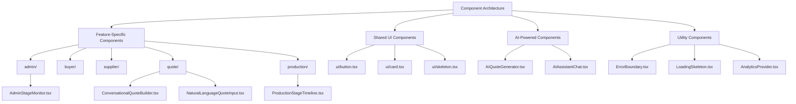
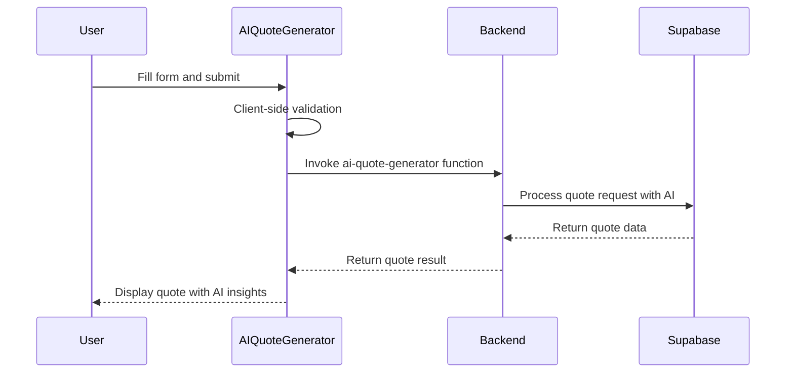
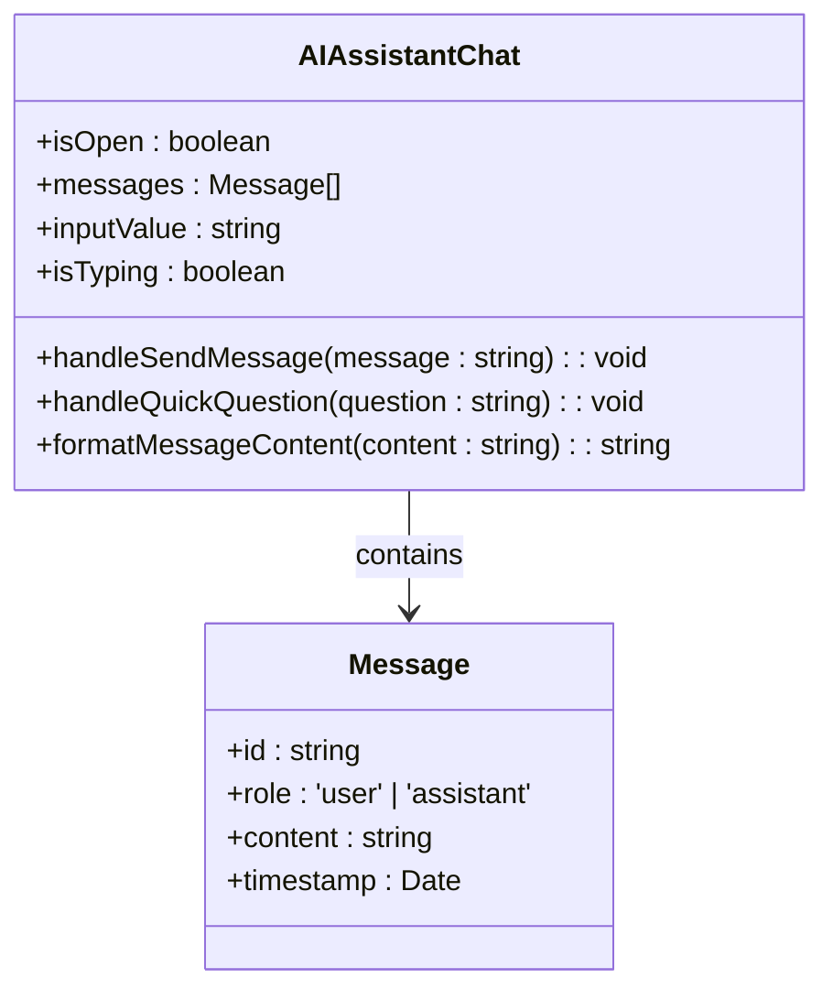
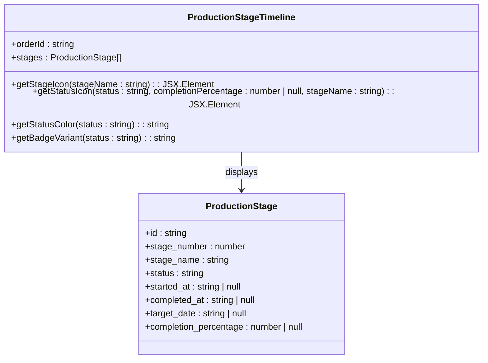
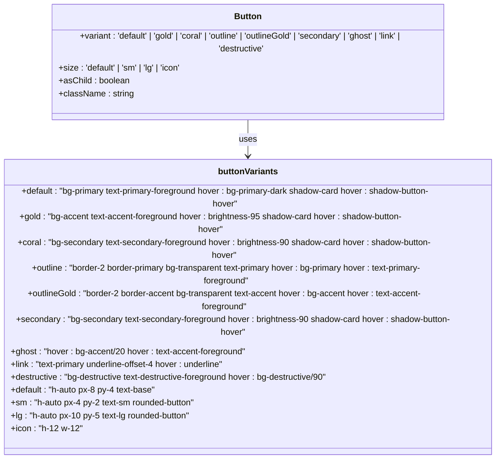
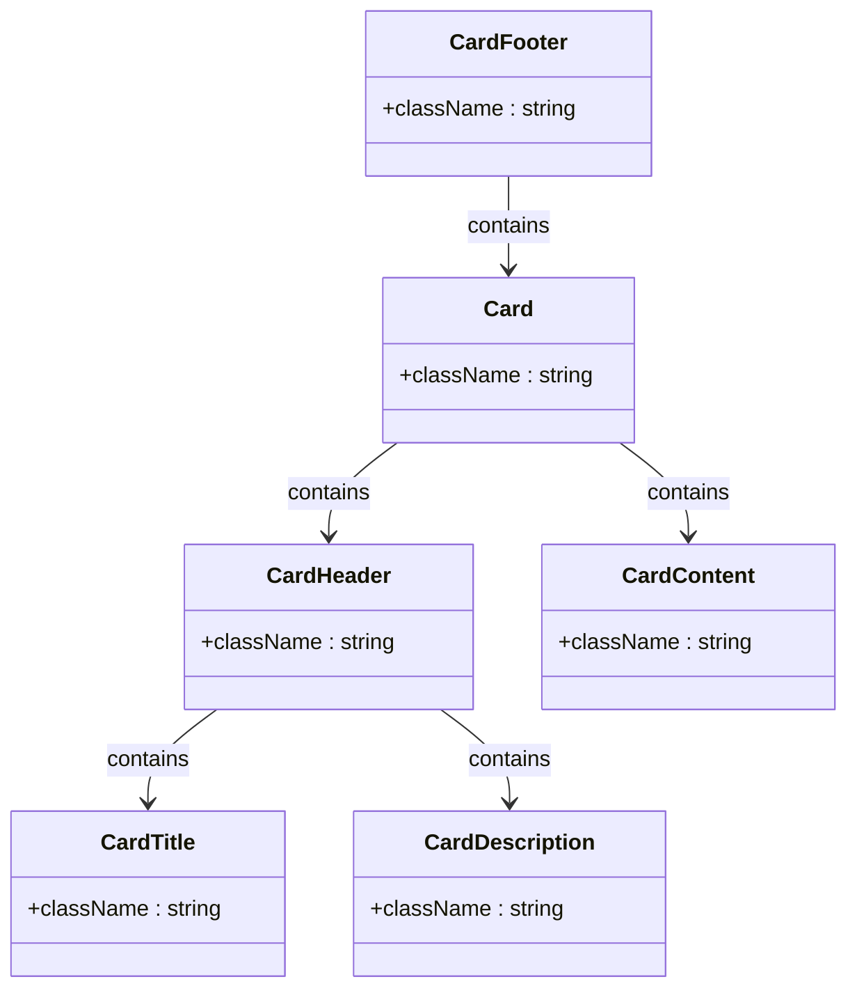
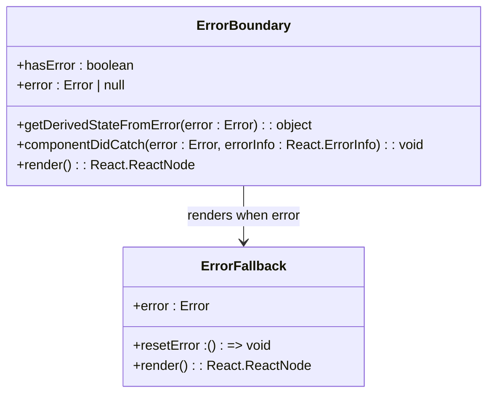
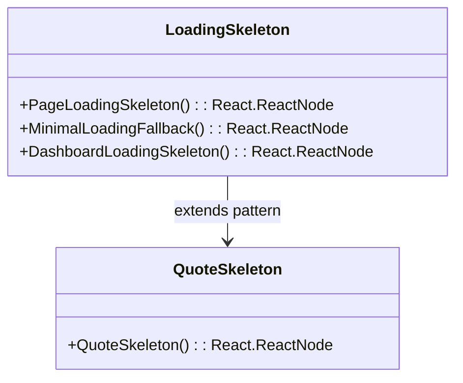
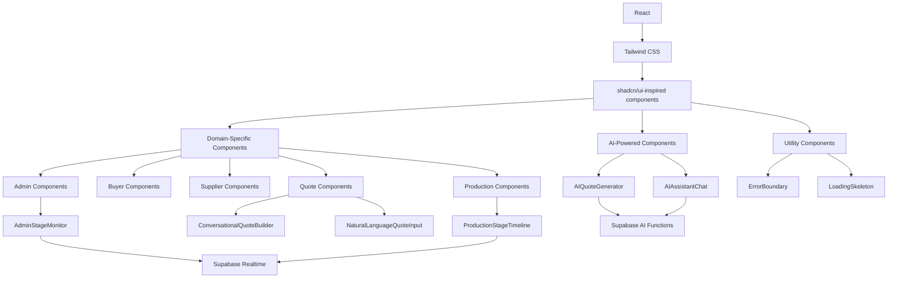

# Components Directory

<cite>
**Referenced Files in This Document**   
- [AIAssistantChat.tsx](file://src/components/AIAssistantChat.tsx)
- [AIQuoteGenerator.tsx](file://src/components/AIQuoteGenerator.tsx)
- [AdminStageMonitor.tsx](file://src/components/admin/AdminStageMonitor.tsx)
- [CommunicationCenter.tsx](file://src/components/shared/CommunicationCenter.tsx)
- [ErrorBoundary.tsx](file://src/components/ErrorBoundary.tsx)
- [LoadingSkeleton.tsx](file://src/components/LoadingSkeleton.tsx)
- [ProductionStageTimeline.tsx](file://src/components/production/ProductionStageTimeline.tsx)
- [QuoteSkeleton.tsx](file://src/components/quote/QuoteSkeleton.tsx)
- [AnalyticsProvider.tsx](file://src/components/AnalyticsProvider.tsx)
- [ConversationalQuoteBuilder.tsx](file://src/components/quote/ConversationalQuoteBuilder.tsx)
- [NaturalLanguageQuoteInput.tsx](file://src/components/quote/NaturalLanguageQuoteInput.tsx)
- [button.tsx](file://src/components/ui/button.tsx)
- [card.tsx](file://src/components/ui/card.tsx)
- [skeleton.tsx](file://src/components/ui/skeleton.tsx)
</cite>

## Table of Contents
1. [Introduction](#introduction)
2. [Project Structure](#project-structure)
3. [Core Components](#core-components)
4. [Architecture Overview](#architecture-overview)
5. [Detailed Component Analysis](#detailed-component-analysis)
6. [Dependency Analysis](#dependency-analysis)
7. [Performance Considerations](#performance-considerations)
8. [Troubleshooting Guide](#troubleshooting-guide)
9. [Conclusion](#conclusion)

## Introduction
This document provides comprehensive documentation for the components directory in the Sleek Apparels application. The components directory contains all reusable UI elements organized by feature domain and responsibility. The architecture follows a clear organization pattern with feature-specific folders for domain logic and shared/ui folders for reusable primitives. This documentation will explain the component organization, presentational and container component separation, usage of shadcn/ui-inspired UI components, key AI-powered components, and integration patterns with React Query and context providers.

## Project Structure
The components directory is organized in a feature-based structure with clear separation of concerns. The architecture follows a domain-driven design pattern where components are grouped by their functional domain, making it easier to locate and maintain related functionality.

```mermaid
graph TD
A[components/] --> B[admin/]
A --> C[aggregation/]
A --> D[auth/]
A --> E[buyer/]
A --> F[design-studio/]
A --> G[home/]
A --> H[infographics/]
A --> I[marketplace/]
A --> J[modern/]
A --> K[payment/]
A --> L[production/]
A --> M[products/]
A --> N[quote/]
A --> O[routes/]
A --> P[shared/]
A --> Q[supplier/]
A --> R[ui/]
A --> S[AIAssistantChat.tsx]
A --> T[AIQuoteGenerator.tsx]
A --> U[AdminSidebar.tsx]
A --> V[ErrorBoundary.tsx]
A --> W[LoadingSkeleton.tsx]
B --> B1[AdminStageMonitor.tsx]
L --> L1[ProductionStageTimeline.tsx]
N --> N1[ConversationalQuoteBuilder.tsx]
N --> N2[NaturalLanguageQuoteInput.tsx]
R --> R1[button.tsx]
R --> R2[card.tsx]
R --> R3[skeleton.tsx]
```



**Diagram sources**
- [src/components/admin/AdminStageMonitor.tsx](file://src/components/admin/AdminStageMonitor.tsx)
- [src/components/production/ProductionStageTimeline.tsx](file://src/components/production/ProductionStageTimeline.tsx)
- [src/components/quote/ConversationalQuoteBuilder.tsx](file://src/components/quote/ConversationalQuoteBuilder.tsx)
- [src/components/quote/NaturalLanguageQuoteInput.tsx](file://src/components/quote/NaturalLanguageQuoteInput.tsx)
- [src/components/ui/button.tsx](file://src/components/ui/button.tsx)
- [src/components/ui/card.tsx](file://src/components/ui/card.tsx)
- [src/components/ui/skeleton.tsx](file://src/components/ui/skeleton.tsx)

**Section sources**
- [src/components/admin/AdminStageMonitor.tsx](file://src/components/admin/AdminStageMonitor.tsx)
- [src/components/production/ProductionStageTimeline.tsx](file://src/components/production/ProductionStageTimeline.tsx)
- [src/components/quote/ConversationalQuoteBuilder.tsx](file://src/components/quote/ConversationalQuoteBuilder.tsx)
- [src/components/quote/NaturalLanguageQuoteInput.tsx](file://src/components/quote/NaturalLanguageQuoteInput.tsx)
- [src/components/ui/button.tsx](file://src/components/ui/button.tsx)
- [src/components/ui/card.tsx](file://src/components/ui/card.tsx)
- [src/components/ui/skeleton.tsx](file://src/components/ui/skeleton.tsx)

## Core Components
The components directory contains a comprehensive collection of reusable UI elements organized by feature domain and responsibility. The architecture follows a clear pattern of separating domain-specific components from shared UI primitives. Key components include AI-powered features like AIQuoteGenerator and AIAssistantChat, domain-specific components like AdminStageMonitor for admin dashboards and ProductionStageTimeline for real-time tracking, and shared UI components based on the shadcn/ui design system.

The component organization follows a feature-based structure where components are grouped by their functional domain (admin, buyer, supplier, quote, production, etc.) with additional folders for shared and UI-specific components. This organization makes it easy to locate related functionality and maintain separation of concerns.

**Section sources**
- [src/components/AIQuoteGenerator.tsx](file://src/components/AIQuoteGenerator.tsx)
- [src/components/AIAssistantChat.tsx](file://src/components/AIAssistantChat.tsx)
- [src/components/admin/AdminStageMonitor.tsx](file://src/components/admin/AdminStageMonitor.tsx)
- [src/components/production/ProductionStageTimeline.tsx](file://src/components/production/ProductionStageTimeline.tsx)
- [src/components/quote/ConversationalQuoteBuilder.tsx](file://src/components/quote/ConversationalQuoteBuilder.tsx)
- [src/components/quote/NaturalLanguageQuoteInput.tsx](file://src/components/quote/NaturalLanguageQuoteInput.tsx)

## Architecture Overview
The components directory architecture is designed around the principles of reusability, maintainability, and scalability. Components are organized into feature-specific folders based on their domain responsibility, with shared UI components centralized in the ui/ folder. This structure enables consistent design patterns across the application while allowing domain-specific customization when needed.

The architecture implements a clear separation between presentational components (which handle UI rendering) and container components (which manage state and business logic). This separation follows the container/presentational pattern, making components more reusable and easier to test. The ui/ folder contains shadcn/ui-inspired components that provide a consistent design system across the application, leveraging Tailwind CSS for styling.



**Diagram sources**
- [src/components/AIQuoteGenerator.tsx](file://src/components/AIQuoteGenerator.tsx)
- [src/components/AIAssistantChat.tsx](file://src/components/AIAssistantChat.tsx)
- [src/components/admin/AdminStageMonitor.tsx](file://src/components/admin/AdminStageMonitor.tsx)
- [src/components/production/ProductionStageTimeline.tsx](file://src/components/production/ProductionStageTimeline.tsx)
- [src/components/quote/ConversationalQuoteBuilder.tsx](file://src/components/quote/ConversationalQuoteBuilder.tsx)
- [src/components/quote/NaturalLanguageQuoteInput.tsx](file://src/components/quote/NaturalLanguageQuoteInput.tsx)
- [src/components/ui/button.tsx](file://src/components/ui/button.tsx)
- [src/components/ui/card.tsx](file://src/components/ui/card.tsx)
- [src/components/ui/skeleton.tsx](file://src/components/ui/skeleton.tsx)
- [src/components/ErrorBoundary.tsx](file://src/components/ErrorBoundary.tsx)
- [src/components/LoadingSkeleton.tsx](file://src/components/LoadingSkeleton.tsx)
- [src/components/AnalyticsProvider.tsx](file://src/components/AnalyticsProvider.tsx)

## Detailed Component Analysis

### AI-Powered Components
The application features several AI-powered components that enhance user experience and streamline business processes. These components leverage AI to provide intelligent features like quote generation, conversational interfaces, and natural language processing.

#### AIQuoteGenerator Component
The AIQuoteGenerator component provides an intelligent interface for generating instant quotes based on user requirements. It implements client-side validation using Zod schema and integrates with backend AI functions to generate pricing and timeline estimates.



**Diagram sources**
- [src/components/AIQuoteGenerator.tsx](file://src/components/AIQuoteGenerator.tsx)
- [src/lib/api/aiQuote.ts](file://src/lib/api/aiQuote.ts)

#### AIAssistantChat Component
The AIAssistantChat component provides a conversational interface for users to get instant answers to common questions about the business. It features a floating chat button that expands into a full chat interface, with quick questions for common topics.



**Diagram sources**
- [src/components/AIAssistantChat.tsx](file://src/components/AIAssistantChat.tsx)

### Domain-Specific Components
The application includes several domain-specific components tailored to particular business functions and user roles.

#### AdminStageMonitor Component
The AdminStageMonitor component provides administrators with a comprehensive view of production stages, including progress tracking, status indicators, and production photos. It displays stage information with completion percentages, target dates, and update notes.

```mermaid
flowchart TD
A[AdminStageMonitor] --> B{Has stages?}
B --> |No| C[Display "No stages" message]
B --> |Yes| D[Render stages list]
D --> E[For each stage]
E --> F[Display status icon]
F --> G[Show progress bar]
G --> H[Display notes if available]
H --> I[Show photos if available]
I --> J[Display timeline info]
```

**Diagram sources**
- [src/components/admin/AdminStageMonitor.tsx](file://src/components/admin/AdminStageMonitor.tsx)

#### ProductionStageTimeline Component
The ProductionStageTimeline component visualizes the production process as a vertical timeline, showing each stage's status, progress, and dates. It uses different icons and colors to indicate the status of each production stage.



**Diagram sources**
- [src/components/production/ProductionStageTimeline.tsx](file://src/components/production/ProductionStageTimeline.tsx)

### Shared UI Components
The ui/ folder contains shadcn/ui-inspired components that provide a consistent design system across the application. These components are built with Tailwind CSS and follow accessibility best practices.

#### UI Button Component
The button component is a versatile UI element with multiple variants and sizes, designed to provide a consistent look and feel across the application.



**Diagram sources**
- [src/components/ui/button.tsx](file://src/components/ui/button.tsx)

#### UI Card Component
The card component provides a container for grouping related content with a consistent visual style, including header, title, description, content, and footer sections.



**Diagram sources**
- [src/components/ui/card.tsx](file://src/components/ui/card.tsx)

### Utility Components
The application includes several utility components that enhance user experience and provide essential functionality.

#### ErrorBoundary Component
The ErrorBoundary component provides a safety net for UI errors, displaying a user-friendly error message and recovery option when component errors occur.



**Diagram sources**
- [src/components/ErrorBoundary.tsx](file://src/components/ErrorBoundary.tsx)

#### Skeleton Components
The application includes several skeleton components for providing loading states with branded animations, including PageLoadingSkeleton, MinimalLoadingFallback, and DashboardLoadingSkeleton.



**Diagram sources**
- [src/components/LoadingSkeleton.tsx](file://src/components/LoadingSkeleton.tsx)
- [src/components/quote/QuoteSkeleton.tsx](file://src/components/quote/QuoteSkeleton.tsx)

**Section sources**
- [src/components/AIQuoteGenerator.tsx](file://src/components/AIQuoteGenerator.tsx)
- [src/components/AIAssistantChat.tsx](file://src/components/AIAssistantChat.tsx)
- [src/components/admin/AdminStageMonitor.tsx](file://src/components/admin/AdminStageMonitor.tsx)
- [src/components/production/ProductionStageTimeline.tsx](file://src/components/production/ProductionStageTimeline.tsx)
- [src/components/quote/ConversationalQuoteBuilder.tsx](file://src/components/quote/ConversationalQuoteBuilder.tsx)
- [src/components/quote/NaturalLanguageQuoteInput.tsx](file://src/components/quote/NaturalLanguageQuoteInput.tsx)
- [src/components/ui/button.tsx](file://src/components/ui/button.tsx)
- [src/components/ui/card.tsx](file://src/components/ui/card.tsx)
- [src/components/ui/skeleton.tsx](file://src/components/ui/skeleton.tsx)
- [src/components/ErrorBoundary.tsx](file://src/components/ErrorBoundary.tsx)
- [src/components/LoadingSkeleton.tsx](file://src/components/LoadingSkeleton.tsx)
- [src/components/quote/QuoteSkeleton.tsx](file://src/components/quote/QuoteSkeleton.tsx)

## Dependency Analysis
The components in the directory have well-defined dependencies that follow the principle of separation of concerns. The dependency graph shows a clear hierarchy with shared UI components at the base, domain-specific components building upon them, and AI-powered components integrating with both.



**Diagram sources**
- [package.json](file://package.json)
- [tailwind.config.ts](file://tailwind.config.ts)
- [src/components/ui/button.tsx](file://src/components/ui/button.tsx)
- [src/components/ui/card.tsx](file://src/components/ui/card.tsx)
- [src/components/ui/skeleton.tsx](file://src/components/ui/skeleton.tsx)
- [src/integrations/supabase/client.ts](file://src/integrations/supabase/client.ts)

**Section sources**
- [package.json](file://package.json)
- [tailwind.config.ts](file://tailwind.config.ts)
- [src/components/ui/button.tsx](file://src/components/ui/button.tsx)
- [src/components/ui/card.tsx](file://src/components/ui/card.tsx)
- [src/components/ui/skeleton.tsx](file://src/components/ui/skeleton.tsx)
- [src/integrations/supabase/client.ts](file://src/integrations/supabase/client.ts)

## Performance Considerations
The components are designed with performance in mind, implementing several optimization strategies:

1. **Code Splitting**: Components are organized in a way that enables code splitting by feature domain, reducing initial bundle size.
2. **Lazy Loading**: Large components like AI-powered features can be lazy-loaded to improve initial page load performance.
3. **Memoization**: Components use React.memo and useMemo to prevent unnecessary re-renders.
4. **Efficient State Management**: Components minimize state updates and use optimized state management patterns.
5. **Image Optimization**: Components like ProductionStageTimeline implement lazy loading for production photos to reduce initial load time.
6. **Progressive Enhancement**: Features like the AIAssistantChat use progressive enhancement, with the chat interface loading only when needed.

The skeleton components provide immediate visual feedback during loading states, improving perceived performance. The ErrorBoundary component ensures that UI errors don't crash the entire application, maintaining usability even when individual components fail.

## Troubleshooting Guide
When working with components in this directory, consider the following troubleshooting tips:

1. **Component Not Rendering**: Check if required props are being passed correctly and if there are any console errors.
2. **UI Styling Issues**: Verify that Tailwind CSS classes are correctly applied and that there are no conflicting styles.
3. **AI Component Failures**: Check network connectivity and ensure that Supabase functions are properly configured and accessible.
4. **Real-time Updates Not Working**: Verify that Supabase realtime subscriptions are properly set up and that the user has appropriate permissions.
5. **Form Validation Errors**: Ensure that Zod schemas are correctly defined and that error messages are properly displayed to users.
6. **Performance Issues**: Use React DevTools to identify unnecessary re-renders and optimize component memoization.

For AI-powered components, monitor the response times from Supabase functions and implement appropriate loading states and error handling. For components with real-time data, ensure that subscription cleanup is properly implemented to prevent memory leaks.

**Section sources**
- [src/components/AIQuoteGenerator.tsx](file://src/components/AIQuoteGenerator.tsx)
- [src/components/AIAssistantChat.tsx](file://src/components/AIAssistantChat.tsx)
- [src/components/ErrorBoundary.tsx](file://src/components/ErrorBoundary.tsx)
- [src/components/LoadingSkeleton.tsx](file://src/components/LoadingSkeleton.tsx)

## Conclusion
The components directory in the Sleek Apparels application demonstrates a well-organized, scalable architecture that follows modern React best practices. The feature-based organization makes it easy to locate and maintain components, while the separation of shared UI components ensures design consistency across the application.

Key strengths of the architecture include:
- Clear separation between domain-specific and shared components
- Implementation of AI-powered features that enhance user experience
- Consistent use of shadcn/ui-inspired components with Tailwind CSS
- Robust error handling with the ErrorBoundary component
- Effective loading states with skeleton components
- Good performance characteristics through optimization techniques

The components are well-designed for reusability, maintainability, and scalability, providing a solid foundation for the application's user interface. By following the patterns established in this directory, developers can create new features that integrate seamlessly with the existing codebase.