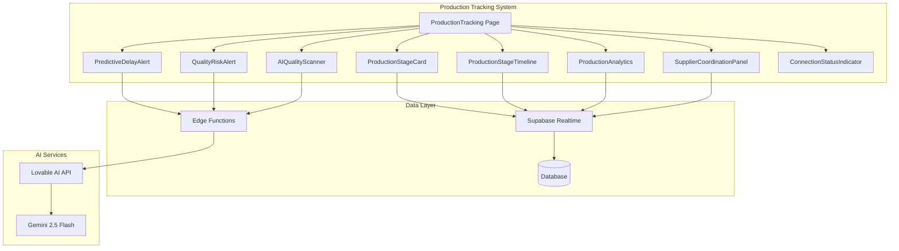
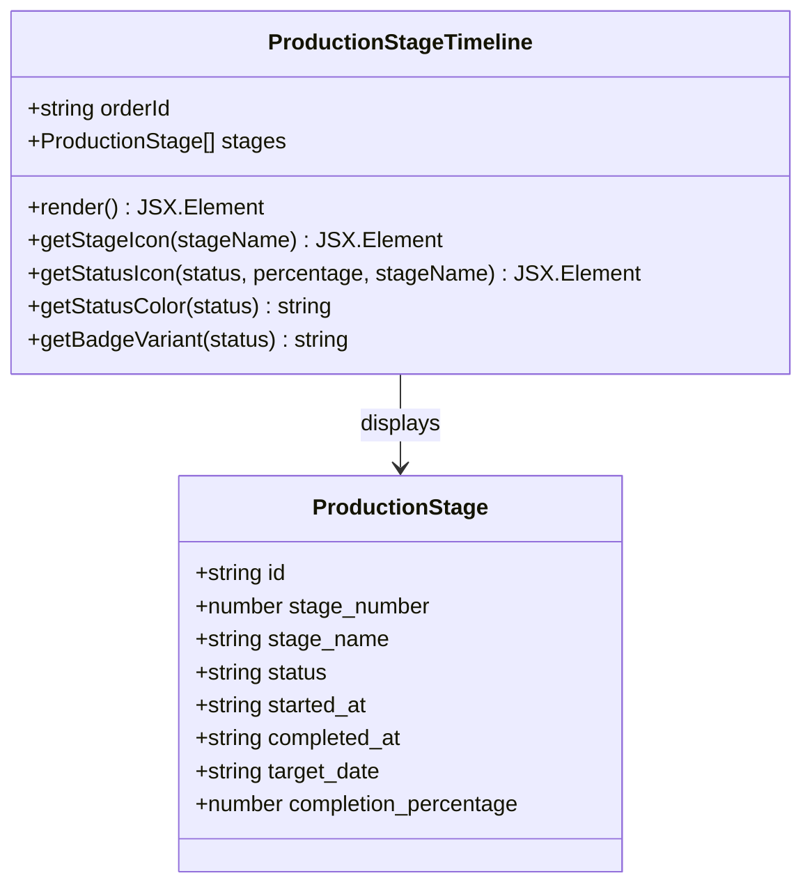
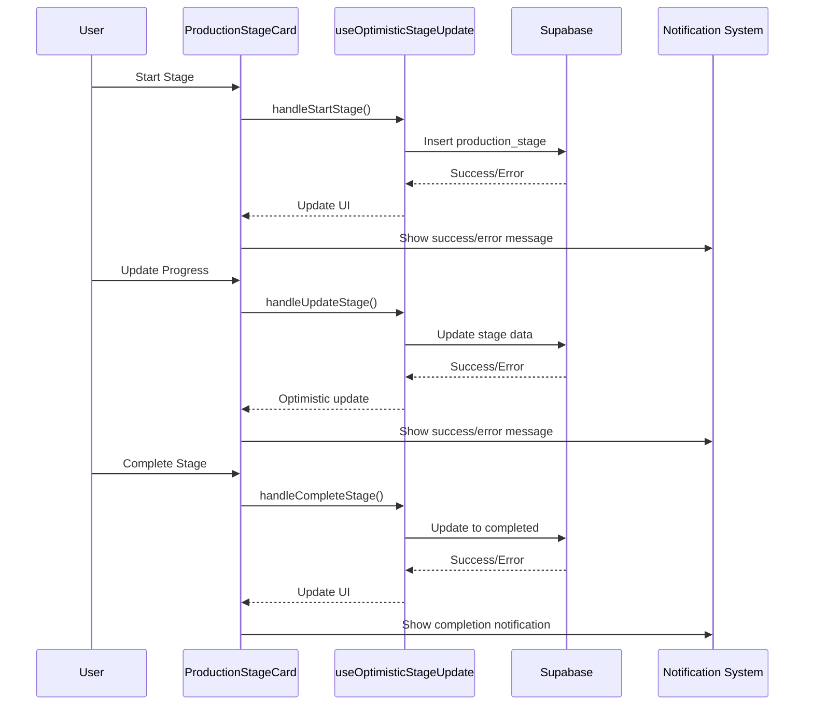
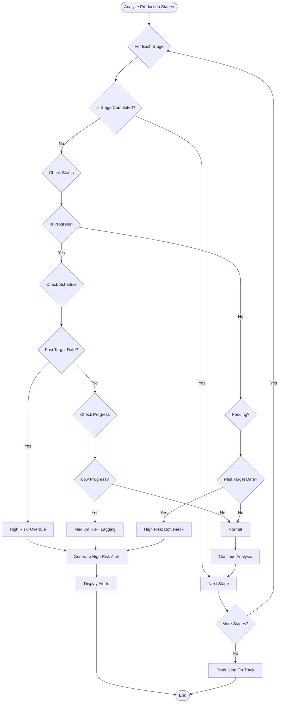
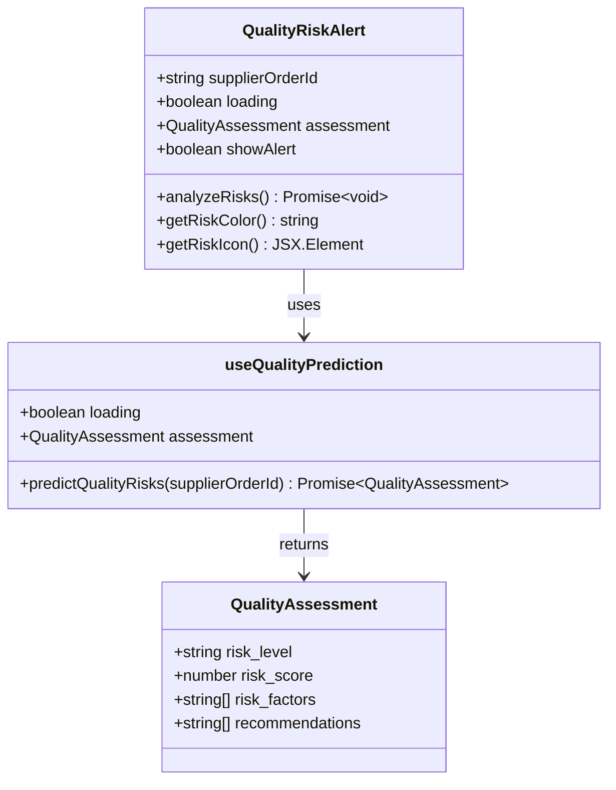
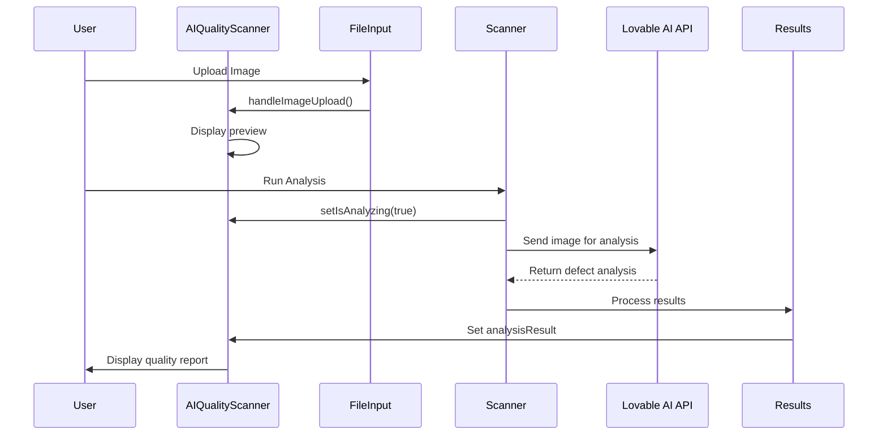
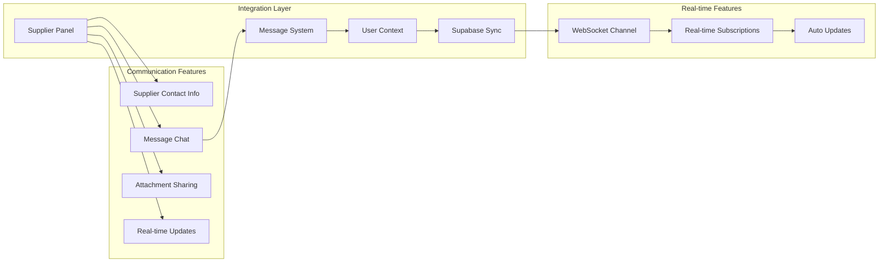
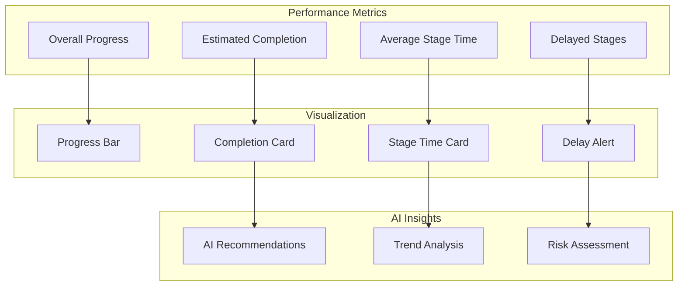
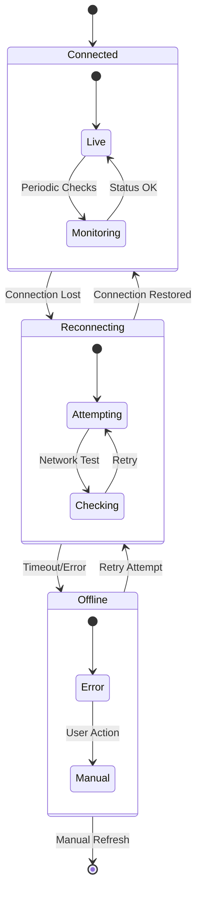
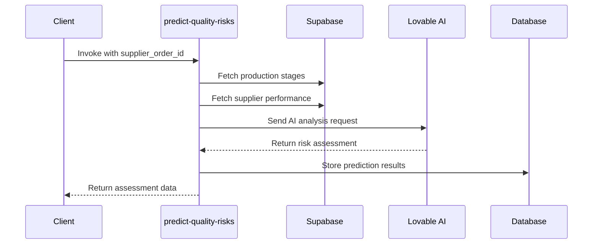

# Production Components

<cite>
**Referenced Files in This Document**
- [ProductionTracking.tsx](file://src/pages/ProductionTracking.tsx)
- [ProductionStageTimeline.tsx](file://src/components/production/ProductionStageTimeline.tsx)
- [ProductionStageCard.tsx](file://src/components/production/ProductionStageCard.tsx)
- [PredictiveDelayAlert.tsx](file://src/components/production/PredictiveDelayAlert.tsx)
- [QualityRiskAlert.tsx](file://src/components/production/QualityRiskAlert.tsx)
- [AIQualityScanner.tsx](file://src/components/production/AIQualityScanner.tsx)
- [SupplierCoordinationPanel.tsx](file://src/components/production/SupplierCoordinationPanel.tsx)
- [ProductionAnalytics.tsx](file://src/components/production/ProductionAnalytics.tsx)
- [ConnectionStatusIndicator.tsx](file://src/components/production/ConnectionStatusIndicator.tsx)
- [useQualityPrediction.ts](file://src/hooks/useQualityPrediction.ts)
- [useRealtimeMessages.ts](file://src/hooks/useRealtimeMessages.ts)
- [predict-quality-risks/index.ts](file://supabase/functions/predict-quality-risks/index.ts)
- [track-product-interaction/index.ts](file://supabase/functions/track-product-interaction/index.ts)
- [chart.tsx](file://src/components/ui/chart.tsx)
</cite>

## Table of Contents
1. [Introduction](#introduction)
2. [Core Production Components](#core-production-components)
3. [Visual Timeline Components](#visual-timeline-components)
4. [AI-Powered Risk Detection](#ai-powered-risk-detection)
5. [Quality Management Systems](#quality-management-systems)
6. [Supplier Coordination](#supplier-coordination)
7. [Analytics and Monitoring](#analytics-and-monitoring)
8. [Real-time Communication](#real-time-communication)
9. [Edge Functions Integration](#edge-functions-integration)
10. [Performance Optimization](#performance-optimization)
11. [Offline-First Design](#offline-first-design)
12. [Conclusion](#conclusion)

## Introduction

The production components in SleekApparels represent a sophisticated manufacturing monitoring system built around LoopTrace™ Technology. This comprehensive solution provides real-time visibility into garment manufacturing processes through eight distinct production stages, AI-powered risk detection, and seamless supplier coordination. The system combines cutting-edge AI capabilities with robust real-time communication to deliver an enterprise-grade production tracking platform.

The architecture emphasizes offline-first design principles, connection resilience, and performance optimization for frequent updates. Built on Supabase's real-time capabilities and Edge Functions, the system delivers reliable production monitoring even in challenging network conditions.

## Core Production Components

### Production Tracking Architecture

The production system is centered around the [`ProductionTracking`](file://src/pages/ProductionTracking.tsx) page, which serves as the main orchestrator for all production monitoring activities. This component manages user authentication, order retrieval, and coordinate the display of various production monitoring components.

**Diagram sources**
- [ProductionTracking.tsx](file://src/pages/ProductionTracking.tsx#L1-L540)
- [ProductionStageCard.tsx](file://src/components/production/ProductionStageCard.tsx#L1-L412)
- [ProductionStageTimeline.tsx](file://src/components/production/ProductionStageTimeline.tsx#L1-L183)

### Production Stages Configuration

The system defines eight standardized production stages for RMG (Ready-Made Garment) manufacturing:

| Stage Number | Stage Name | Icon | Color | Description |
|--------------|------------|------|-------|-------------|
| 1 | Order Confirmation | CheckCircle2 | Blue-500 | Initial order acceptance and preparation |
| 2 | Fabric Sourcing | Package | Purple-500 | Procurement and material acquisition |
| 3 | Accessories Procurement | Package | Pink-500 | Accessory and trim sourcing |
| 4 | Cutting & Pattern Making | Activity | Orange-500 | Pattern development and cutting preparation |
| 5 | Sewing & Assembly | Activity | Green-500 | Garment construction and assembly |
| 6 | Quality Control | CheckCircle2 | Teal-500 | Inspection and quality verification |
| 7 | Finishing & Packaging | Package | Indigo-500 | Final touches and packaging preparation |
| 8 | Shipment & Delivery | Truck | Red-500 | Logistics and customer delivery |

**Section sources**
- [ProductionTracking.tsx](file://src/pages/ProductionTracking.tsx#L39-L49)

## Visual Timeline Components

### ProductionStageTimeline

The [`ProductionStageTimeline`](file://src/components/production/ProductionStageTimeline.tsx) component provides a comprehensive visual representation of production progress across all eight stages. It displays timeline information with interactive elements and status indicators.

**Diagram sources**
- [ProductionStageTimeline.tsx](file://src/components/production/ProductionStageTimeline.tsx#L6-L15)

#### Key Features:
- **Visual Timeline**: Vertical timeline with stage icons and progress indicators
- **Status Visualization**: Color-coded status indicators (green for completed, blue for in-progress, red for delayed)
- **Timestamp Tracking**: Shows start dates, completion dates, and target deadlines
- **Progress Bars**: Visual progress indication with percentage completion
- **Interactive Design**: Hover effects and responsive layout for different screen sizes

#### Status Management:
The component handles four primary status states:
- **Completed**: Green checkmark with completion timestamp
- **In Progress**: Blue pulsing icon with progress bar
- **Delayed**: Red triangle warning with overdue indicators
- **Pending**: Gray outline with planned status

**Section sources**
- [ProductionStageTimeline.tsx](file://src/components/production/ProductionStageTimeline.tsx#L1-L183)

### ProductionStageCard

The [`ProductionStageCard`](file://src/components/production/ProductionStageCard.tsx) component provides detailed stage-specific monitoring with LoopTrace™ photo documentation capabilities.

**Diagram sources**
- [ProductionStageCard.tsx](file://src/components/production/ProductionStageCard.tsx#L107-L210)

#### Advanced Features:
- **Optimistic Updates**: Immediate UI feedback with rollback capability
- **Photo Documentation**: LoopTrace™ evidence capture with timestamped photos
- **Progress Tracking**: Real-time completion percentage updates
- **Notes System**: Collaborative stage notes and comments
- **Print Reports**: Stage-specific report generation
- **Role-Based Access**: Different permissions for buyers, suppliers, and admins

**Section sources**
- [ProductionStageCard.tsx](file://src/components/production/ProductionStageCard.tsx#L1-L412)

## AI-Powered Risk Detection

### PredictiveDelayAlert

The [`PredictiveDelayAlert`](file://src/components/production/PredictiveDelayAlert.tsx) component uses sophisticated algorithms to predict potential production delays before they occur.

**Diagram sources**
- [PredictiveDelayAlert.tsx](file://src/components/production/PredictiveDelayAlert.tsx#L43-L118)

#### Risk Assessment Logic:
The component evaluates three key factors for each production stage:

1. **Schedule Adherence**: Compares current progress against target timeline
2. **Velocity Analysis**: Measures production rate against expected benchmarks
3. **Bottleneck Detection**: Identifies stages that haven't started when they should

#### Risk Levels:
- **High Risk**: Critical delays with immediate impact on delivery
- **Medium Risk**: Potential delays requiring close monitoring
- **Low Risk**: Minor deviations that may not affect timeline

**Section sources**
- [PredictiveDelayAlert.tsx](file://src/components/production/PredictiveDelayAlert.tsx#L1-L247)

### QualityRiskAlert

The [`QualityRiskAlert`](file://src/components/production/QualityRiskAlert.tsx) component provides AI-powered quality risk assessment using historical data and supplier performance metrics.

**Diagram sources**
- [QualityRiskAlert.tsx](file://src/components/production/QualityRiskAlert.tsx#L1-L113)
- [useQualityPrediction.ts](file://src/hooks/useQualityPrediction.ts#L11-L55)

#### AI Analysis Capabilities:
- **Historical Pattern Recognition**: Analyzes past production data for quality trends
- **Supplier Performance Metrics**: Evaluates supplier reliability and quality history
- **Real-time Risk Scoring**: Provides dynamic risk assessments during production
- **Actionable Recommendations**: Generates specific mitigation strategies

**Section sources**
- [QualityRiskAlert.tsx](file://src/components/production/QualityRiskAlert.tsx#L1-L113)

## Quality Management Systems

### AIQualityScanner

The [`AIQualityScanner`](file://src/components/production/AIQualityScanner.tsx) component provides instant defect detection using computer vision technology.

**Diagram sources**
- [AIQualityScanner.tsx](file://src/components/production/AIQualityScanner.tsx#L18-L70)

#### Computer Vision Features:
- **Defect Detection**: Identifies stitching irregularities, fabric issues, and quality problems
- **Confidence Scoring**: Provides probability scores for detected defects
- **Spatial Localization**: Marks defect locations on the original image
- **Quality Scoring**: Generates overall quality scores from 0-100
- **Real-time Feedback**: Instant analysis with scanning animation effects

#### Quality Assessment Categories:
- **Pass**: No significant defects detected (score ≥ 90)
- **Warning**: Minor issues requiring attention (80 ≤ score < 90)
- **Fail**: Major defects requiring immediate action (score < 80)

**Section sources**
- [AIQualityScanner.tsx](file://src/components/production/AIQualityScanner.tsx#L1-L224)

## Supplier Coordination

### SupplierCoordinationPanel

The [`SupplierCoordinationPanel`](file://src/components/production/SupplierCoordinationPanel.tsx) facilitates seamless communication between buyers and suppliers throughout the production process.

**Diagram sources**
- [SupplierCoordinationPanel.tsx](file://src/components/production/SupplierCoordinationPanel.tsx#L1-L256)

#### Key Communication Features:
- **Real-time Messaging**: Live chat with instant notifications
- **Supplier Profile**: Complete supplier contact and location information
- **Message History**: Comprehensive conversation logs with timestamps
- **Attachment Support**: File sharing for technical drawings and documents
- **Role-Based Permissions**: Different access levels for buyers and suppliers

#### Real-time Capabilities:
The panel subscribes to real-time message updates using Supabase's PostgreSQL change data capture, ensuring immediate notification of new messages regardless of user interface state.

**Section sources**
- [SupplierCoordinationPanel.tsx](file://src/components/production/SupplierCoordinationPanel.tsx#L1-L256)

## Analytics and Monitoring

### ProductionAnalytics

The [`ProductionAnalytics`](file://src/components/production/ProductionAnalytics.tsx) component provides comprehensive production performance insights and trend analysis.

**Diagram sources**
- [ProductionAnalytics.tsx](file://src/components/production/ProductionAnalytics.tsx#L1-L249)

#### Analytics Features:
- **Overall Progress Tracking**: Eight-stage completion percentage with visual indicators
- **Estimated Completion Dates**: Dynamic timeline predictions based on current velocity
- **Performance Benchmarks**: Average stage duration comparisons
- **Delay Detection**: Automatic identification of overdue production stages
- **AI-Powered Insights**: Contextual recommendations for production optimization

#### Key Metrics Displayed:
- **Stage Distribution**: Breakdown of completed, in-progress, and pending stages
- **Completion Rates**: Historical performance trends and current velocity
- **Delivery Projections**: Estimated completion dates with confidence intervals
- **Quality Indicators**: On-time performance percentages and risk assessments

**Section sources**
- [ProductionAnalytics.tsx](file://src/components/production/ProductionAnalytics.tsx#L1-L249)

## Real-time Communication

### ConnectionStatusIndicator

The [`ConnectionStatusIndicator`](file://src/components/production/ConnectionStatusIndicator.tsx) provides continuous monitoring of network connectivity and real-time service availability.

**Diagram sources**
- [ConnectionStatusIndicator.tsx](file://src/components/production/ConnectionStatusIndicator.tsx#L1-L76)

#### Connectivity Features:
- **Real-time Monitoring**: Continuous connection status checks
- **Automatic Reconnection**: Intelligent retry mechanisms with exponential backoff
- **Visual Indicators**: Clear status badges with appropriate colors
- **Error Handling**: Graceful degradation when connections fail
- **Periodic Validation**: Regular health checks every 30 seconds

#### Status States:
- **Live**: Active real-time connection with green indicator
- **Reconnecting**: Attempting to restore connection with yellow pulsing indicator
- **Offline**: No connection available with red destructive indicator

**Section sources**
- [ConnectionStatusIndicator.tsx](file://src/components/production/ConnectionStatusIndicator.tsx#L1-L76)

### useRealtimeMessages Hook

The [`useRealtimeMessages`](file://src/hooks/useRealtimeMessages.ts) hook provides universal real-time messaging capabilities across the application.

#### Real-time Event Handling:
- **INSERT Events**: New message notifications with automatic UI updates
- **UPDATE Events**: Message status changes and read receipts
- **Filtering**: Targeted subscriptions based on user roles and permissions
- **Error Handling**: Robust error management with fallback mechanisms

**Section sources**
- [useRealtimeMessages.ts](file://src/hooks/useRealtimeMessages.ts#L16-L60)

## Edge Functions Integration

### predict-quality-risks Function

The [`predict-quality-risks`](file://supabase/functions/predict-quality-risks/index.ts) Edge Function provides AI-powered quality risk assessment using external AI services.

**Diagram sources**
- [predict-quality-risks/index.ts](file://supabase/functions/predict-quality-risks/index.ts#L1-L131)

#### AI Analysis Pipeline:
1. **Data Collection**: Gathers production stage data and supplier performance metrics
2. **Prompt Engineering**: Constructs comprehensive analysis prompts for AI evaluation
3. **AI Processing**: Sends analysis request to Gemini 2.5 Flash via Lovable AI
4. **Result Processing**: Extracts structured risk assessment from AI response
5. **Data Storage**: Persists predictions for future reference and trend analysis

#### Risk Assessment Criteria:
- **Risk Score**: Numerical assessment from 0-100 indicating overall quality risk
- **Risk Level**: Categorical classification (low, medium, high, critical)
- **Risk Factors**: Specific issues identified during analysis
- **Recommendations**: Actionable mitigation strategies

**Section sources**
- [predict-quality-risks/index.ts](file://supabase/functions/predict-quality-risks/index.ts#L1-L131)

### track-product-interaction Function

The [`track-product-interaction`](file://supabase/functions/track-product-interaction/index.ts) Edge Function provides comprehensive product interaction tracking for analytics and personalization.

#### Interaction Tracking Features:
- **Event Logging**: Records user interactions with product listings
- **Session Management**: Tracks interactions within user sessions
- **Geolocation**: Captures IP addresses for geographic analysis
- **User Agent Analysis**: Identifies device types and browser information
- **Fire-and-Forget**: Asynchronous processing for optimal performance

#### Supported Interaction Types:
- **Hover Events**: Mouse hover interactions on product cards
- **Quick View**: Product preview clicks
- **Wishlist Actions**: Add/remove from wishlists
- **Color Swatches**: Fabric/color selection interactions
- **Quote Requests**: Request for pricing inquiries
- **Cart Additions**: E-commerce conversion tracking
- **View Details**: Full product page visits

**Section sources**
- [track-product-interaction/index.ts](file://supabase/functions/track-product-interaction/index.ts#L1-L136)

## Performance Optimization

### Optimistic Updates

The system employs optimistic updates for improved user experience during production stage modifications. The [`useOptimisticStageUpdate`](file://src/hooks/useOptimisticUpdate.ts) hook provides immediate UI feedback with automatic rollback capabilities.

#### Optimistic Update Benefits:
- **Immediate Feedback**: UI updates instantly without waiting for server response
- **Seamless Experience**: Eliminates perceived latency during stage updates
- **Automatic Rollback**: Reverts changes if server operations fail
- **Conflict Resolution**: Handles concurrent updates gracefully

### Real-time Subscriptions

Supabase's real-time capabilities enable efficient data synchronization across multiple clients:

#### Subscription Features:
- **Automatic Updates**: Real-time data refresh without manual polling
- **Selective Filtering**: Targeted subscriptions based on order IDs and user roles
- **Efficient Bandwidth**: Delta updates minimize network traffic
- **Connection Resilience**: Automatic reconnection on network interruptions

### Data Visualization Optimization

The [`chart.tsx`](file://src/components/ui/chart.tsx) component provides optimized data visualization with performance enhancements:

#### Visualization Optimizations:
- **Responsive Design**: Adaptive layouts for different screen sizes
- **Theme Support**: Dark/light mode compatibility with CSS custom properties
- **Memory Efficiency**: Minimal DOM manipulation for smooth rendering
- **Accessibility**: Screen reader support and keyboard navigation

**Section sources**
- [chart.tsx](file://src/components/ui/chart.tsx#L1-L304)

## Offline-First Design

### Connection Resilience

The production system implements comprehensive offline-first principles to ensure uninterrupted operation during network disruptions.

#### Offline Capabilities:
- **Local State Management**: Maintains production data locally when disconnected
- **Queued Operations**: Stores updates locally until connection restored
- **Graceful Degradation**: Continues functioning with cached data
- **Automatic Recovery**: Resumes real-time sync when network becomes available

#### Resilience Features:
- **Intelligent Retry**: Exponential backoff for failed operations
- **Data Integrity**: Ensures consistency across offline/online transitions
- **User Feedback**: Clear indication of connection status and operation state
- **Background Sync**: Processes queued updates when connection restored

### Progressive Enhancement

The system progressively enhances functionality based on available resources:

#### Enhancement Layers:
1. **Core Functionality**: Basic production tracking without real-time features
2. **Enhanced Experience**: Real-time updates and collaborative features
3. **Premium Features**: AI analysis and advanced analytics
4. **Full Capability**: Complete system with all features enabled

## Conclusion

The production components in SleekApparels represent a comprehensive manufacturing monitoring solution that combines real-time visibility, AI-powered intelligence, and seamless collaboration. Through the integration of LoopTrace™ Technology, Edge Functions, and Supabase's real-time capabilities, the system delivers enterprise-grade production tracking with exceptional reliability and performance.

Key strengths of the system include:

- **Real-time Monitoring**: Instant visibility into production progress across eight critical stages
- **AI-Driven Insights**: Predictive analytics for delays and quality risks
- **Collaborative Features**: Seamless communication between buyers and suppliers
- **Performance Optimization**: Optimistic updates and efficient real-time synchronization
- **Offline Resilience**: Reliable operation during network disruptions
- **Scalable Architecture**: Edge Functions and cloud-native design for enterprise deployment

The modular architecture ensures maintainability and extensibility while the offline-first design guarantees operational continuity. Together, these components create a robust foundation for modern garment manufacturing operations, enabling data-driven decision-making and operational excellence.