# Quote Components

<cite>
**Referenced Files in This Document**
- [ConversationalQuoteBuilder.tsx](file://src/components/quote/ConversationalQuoteBuilder.tsx)
- [NaturalLanguageQuoteInput.tsx](file://src/components/quote/NaturalLanguageQuoteInput.tsx)
- [SmartFactoryMatcher.tsx](file://src/components/quote/SmartFactoryMatcher.tsx)
- [SmartRecommendations.tsx](file://src/components/quote/SmartRecommendations.tsx)
- [InteractiveQuoteDisplay.tsx](file://src/components/quote/InteractiveQuoteDisplay.tsx)
- [EmailQuoteModal.tsx](file://src/components/quote/EmailQuoteModal.tsx)
- [QuoteHistoryCard.tsx](file://src/components/quote/QuoteHistoryCard.tsx)
- [PriceComparison.tsx](file://src/components/quote/PriceComparison.tsx)
- [useConversation.ts](file://src/hooks/useConversation.ts)
- [useQuotes.ts](file://src/hooks/useQuotes.ts)
- [AIQuoteGeneratorWithOTP.tsx](file://src/components/AIQuoteGeneratorWithOTP.tsx)
- [QuoteSkeleton.tsx](file://src/components/quote/QuoteSkeleton.tsx)
- [MarketResearchInsights.tsx](file://src/components/quote/MarketResearchInsights.tsx)
- [QuoteLoadingStages.tsx](file://src/components/quote/QuoteLoadingStages.tsx)
- [ai-conversational-quote/index.ts](file://supabase/functions/ai-conversational-quote/index.ts)
- [ai-market-research/index.ts](file://supabase/functions/ai-market-research/index.ts)
</cite>

## Table of Contents
1. [Introduction](#introduction)
2. [Core Components Architecture](#core-components-architecture)
3. [Conversational AI Components](#conversational-ai-components)
4. [Smart Matching and Recommendations](#smart-matching-and-recommendations)
5. [Quote Display and Management](#quote-display-and-management)
6. [Integration with Edge Functions](#integration-with-edge-functions)
7. [State Management](#state-management)
8. [Accessibility and Loading States](#accessibility-and-loading-states)
9. [Extending the Quoting Engine](#extending-the-quoting-engine)
10. [Security and Verification](#security-and-verification)
11. [Conclusion](#conclusion)

## Introduction

The quote components system powers Sleek Apparels' AI-driven quoting platform, providing an intuitive, conversational interface for generating instant garment manufacturing quotes. Built on a modern React architecture with Supabase backend integration, the system combines natural language processing, machine learning, and real-time market research to deliver accurate, competitive pricing for apparel manufacturing.

The system consists of several interconnected components that work together to create a seamless user experience: from initial product specification capture through natural language input to final quote presentation with detailed breakdowns and market comparisons. Each component is designed with accessibility, performance, and extensibility in mind.

## Core Components Architecture

The quote system follows a modular architecture with clear separation of concerns:

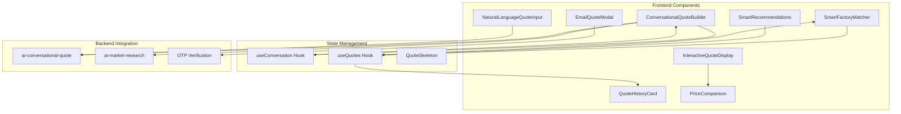

**Diagram sources**
- [ConversationalQuoteBuilder.tsx](file://src/components/quote/ConversationalQuoteBuilder.tsx#L43-L363)
- [NaturalLanguageQuoteInput.tsx](file://src/components/quote/NaturalLanguageQuoteInput.tsx#L22-L131)
- [useConversation.ts](file://src/hooks/useConversation.ts)
- [useQuotes.ts](file://src/hooks/useQuotes.ts)

**Section sources**
- [ConversationalQuoteBuilder.tsx](file://src/components/quote/ConversationalQuoteBuilder.tsx#L1-L363)
- [NaturalLanguageQuoteInput.tsx](file://src/components/quote/NaturalLanguageQuoteInput.tsx#L1-L131)

## Conversational AI Components

### ConversationalQuoteBuilder

The ConversationalQuoteBuilder serves as the primary interface for capturing garment specifications through an interactive, step-by-step process. It combines traditional form inputs with AI-powered market research to provide context-aware quote generation.

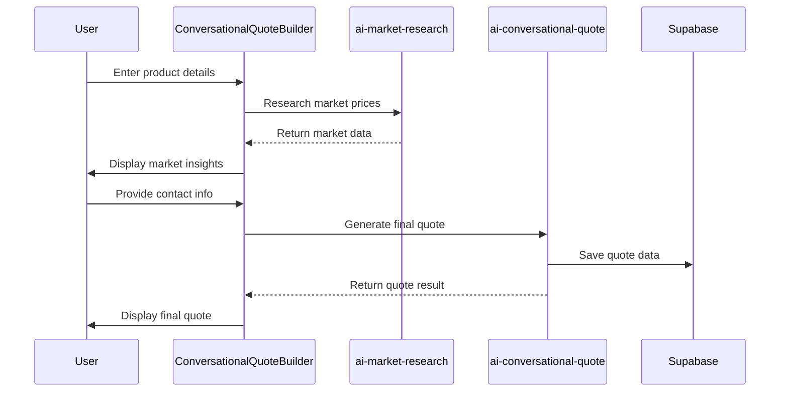

**Diagram sources**
- [ConversationalQuoteBuilder.tsx](file://src/components/quote/ConversationalQuoteBuilder.tsx#L65-L162)
- [ai-market-research/index.ts](file://supabase/functions/ai-market-research/index.ts#L145-L335)
- [ai-conversational-quote/index.ts](file://supabase/functions/ai-conversational-quote/index.ts#L196-L385)

The component manages a multi-step workflow with intelligent state transitions:

- **Step 1**: Product specification collection with validation
- **Step 2**: Market research display with contact information
- **Step 3**: Final quote presentation with actionable options

Key features include:
- Real-time form validation with user-friendly error messaging
- Intelligent market research caching for improved performance
- Seamless integration with external AI services
- Responsive design with mobile-first principles

**Section sources**
- [ConversationalQuoteBuilder.tsx](file://src/components/quote/ConversationalQuoteBuilder.tsx#L43-L363)

### NaturalLanguageQuoteInput

The NaturalLanguageQuoteInput component enables users to describe their requirements in plain English, automatically parsing the input to populate the quote form with structured data.

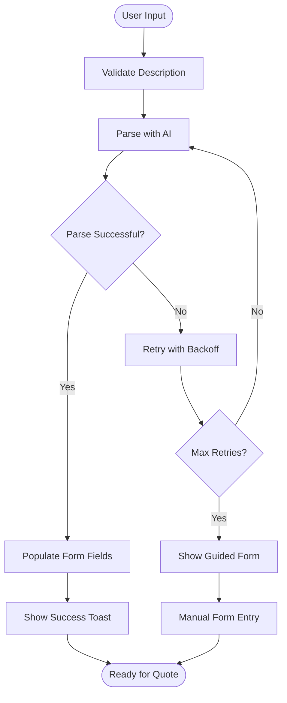

**Diagram sources**
- [NaturalLanguageQuoteInput.tsx](file://src/components/quote/NaturalLanguageQuoteInput.tsx#L27-L74)

The parsing mechanism includes robust error handling with exponential backoff retry logic, ensuring reliable conversion of natural language descriptions into structured quote parameters.

**Section sources**
- [NaturalLanguageQuoteInput.tsx](file://src/components/quote/NaturalLanguageQuoteInput.tsx#L22-L131)

## Smart Matching and Recommendations

### SmartFactoryMatcher

The SmartFactoryMatcher component intelligently matches available factories based on capacity, location, and production capabilities, providing optimized supplier recommendations.

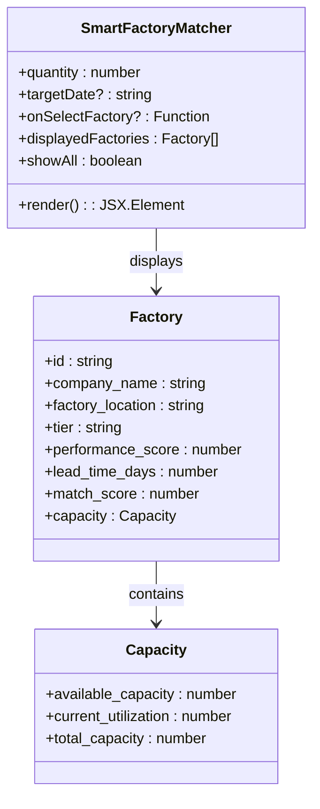

**Diagram sources**
- [SmartFactoryMatcher.tsx](file://src/components/quote/SmartFactoryMatcher.tsx#L9-L179)

The matching algorithm considers multiple factors:
- **Capacity Availability**: Real-time factory capacity tracking
- **Location Optimization**: Geographic proximity calculations
- **Performance Metrics**: Historical quality and reliability scores
- **Lead Time Prediction**: Production scheduling intelligence

**Section sources**
- [SmartFactoryMatcher.tsx](file://src/components/quote/SmartFactoryMatcher.tsx#L15-L179)

### SmartRecommendations

The SmartRecommendations component provides data-driven suggestions to optimize quote parameters for better pricing and delivery outcomes.

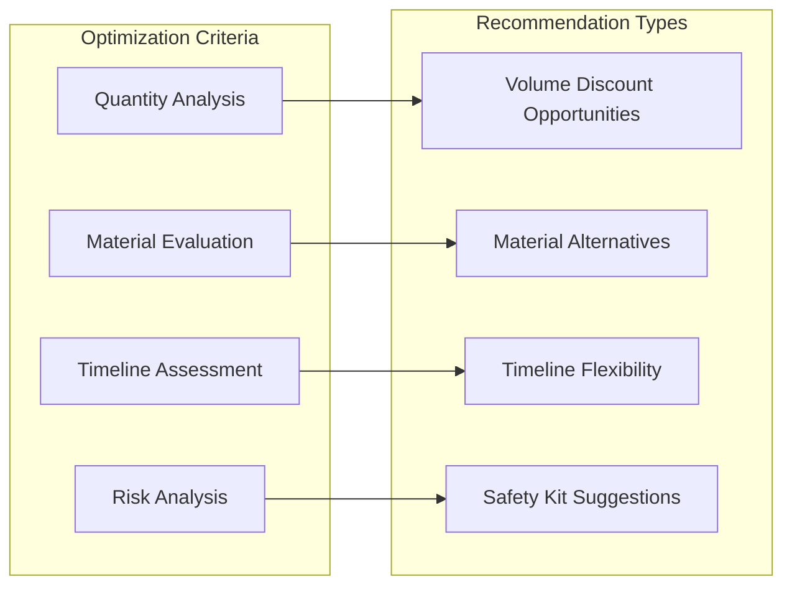

**Diagram sources**
- [SmartRecommendations.tsx](file://src/components/quote/SmartRecommendations.tsx#L27-L137)

Each recommendation type includes:
- **Volume Discounts**: Calculated based on standard MOQ thresholds
- **Material Alternatives**: Premium material substitution suggestions
- **Timeline Optimization**: Delivery schedule flexibility recommendations
- **Risk Mitigation**: Sample kit inclusion for new customers

**Section sources**
- [SmartRecommendations.tsx](file://src/components/quote/SmartRecommendations.tsx#L19-L137)

## Quote Display and Management

### InteractiveQuoteDisplay

The InteractiveQuoteDisplay component presents comprehensive quote information with interactive elements for user engagement and action-taking.

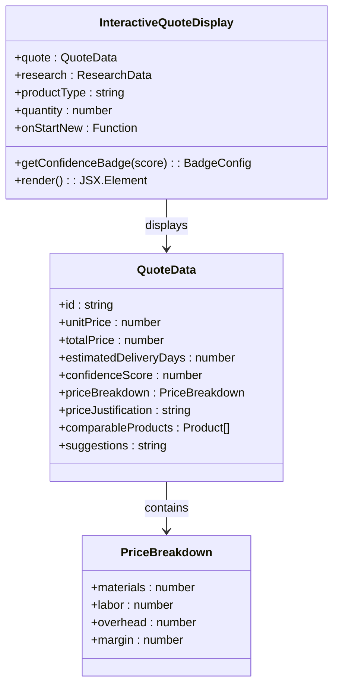

**Diagram sources**
- [InteractiveQuoteDisplay.tsx](file://src/components/quote/InteractiveQuoteDisplay.tsx#L16-L230)

The display includes:
- **Price Summary Cards**: Visual representation of unit and total pricing
- **Detailed Breakdown**: Itemized cost analysis with transparency
- **Market Comparison**: Competitive pricing benchmarking
- **AI Justifications**: Explanatory reasoning for pricing decisions
- **Action Buttons**: Multiple pathways for next steps

**Section sources**
- [InteractiveQuoteDisplay.tsx](file://src/components/quote/InteractiveQuoteDisplay.tsx#L45-L230)

### EmailQuoteModal

The EmailQuoteModal provides a streamlined interface for sharing quotes via email with additional opt-in features for customer engagement.

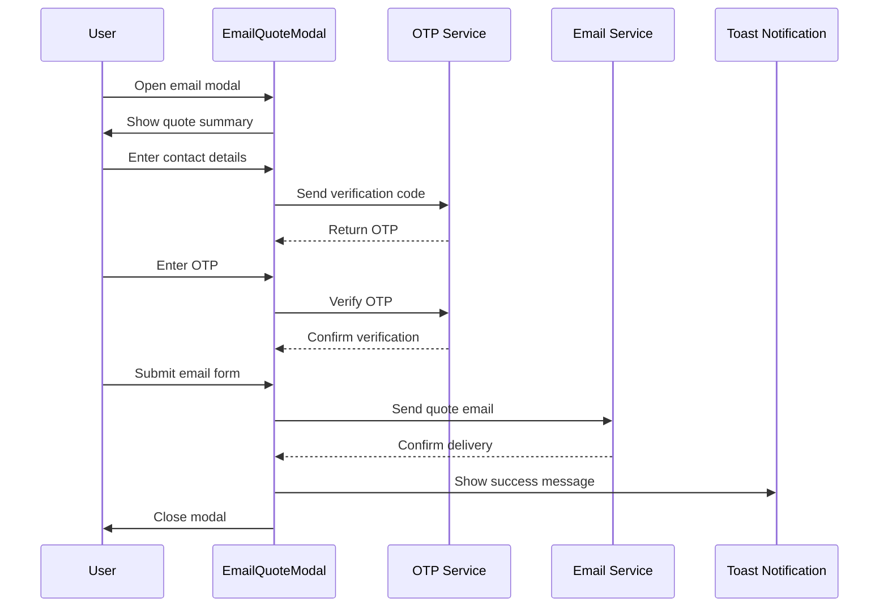

**Diagram sources**
- [EmailQuoteModal.tsx](file://src/components/quote/EmailQuoteModal.tsx#L30-L260)

**Section sources**
- [EmailQuoteModal.tsx](file://src/components/quote/EmailQuoteModal.tsx#L30-L260)

### QuoteHistoryCard

The QuoteHistoryCard component enables users to browse and manage their historical quote requests with filtering and comparison capabilities.

**Section sources**
- [QuoteHistoryCard.tsx](file://src/components/quote/QuoteHistoryCard.tsx#L29-L130)

## Integration with Edge Functions

### AI Conversational Quote Function

The ai-conversational-quote Edge Function orchestrates the complete quote generation pipeline, integrating market research, AI analysis, and quote calculation.

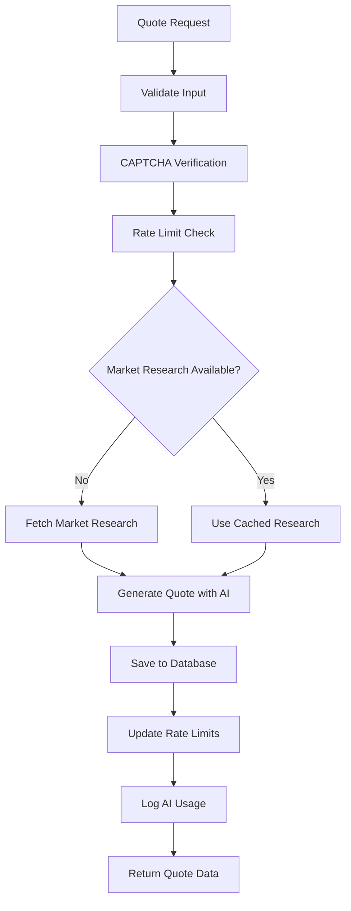

**Diagram sources**
- [ai-conversational-quote/index.ts](file://supabase/functions/ai-conversational-quote/index.ts#L196-L385)

The function implements comprehensive security measures:
- **CAPTCHA Protection**: Google reCAPTCHA v3 integration
- **Rate Limiting**: IP and email-based throttling
- **Security Logging**: Comprehensive audit trail
- **Error Handling**: Graceful degradation and retry logic

**Section sources**
- [ai-conversational-quote/index.ts](file://supabase/functions/ai-conversational-quote/index.ts#L1-L385)

### AI Market Research Function

The ai-market-research Edge Function performs real-time market analysis using multiple data sources and AI processing.

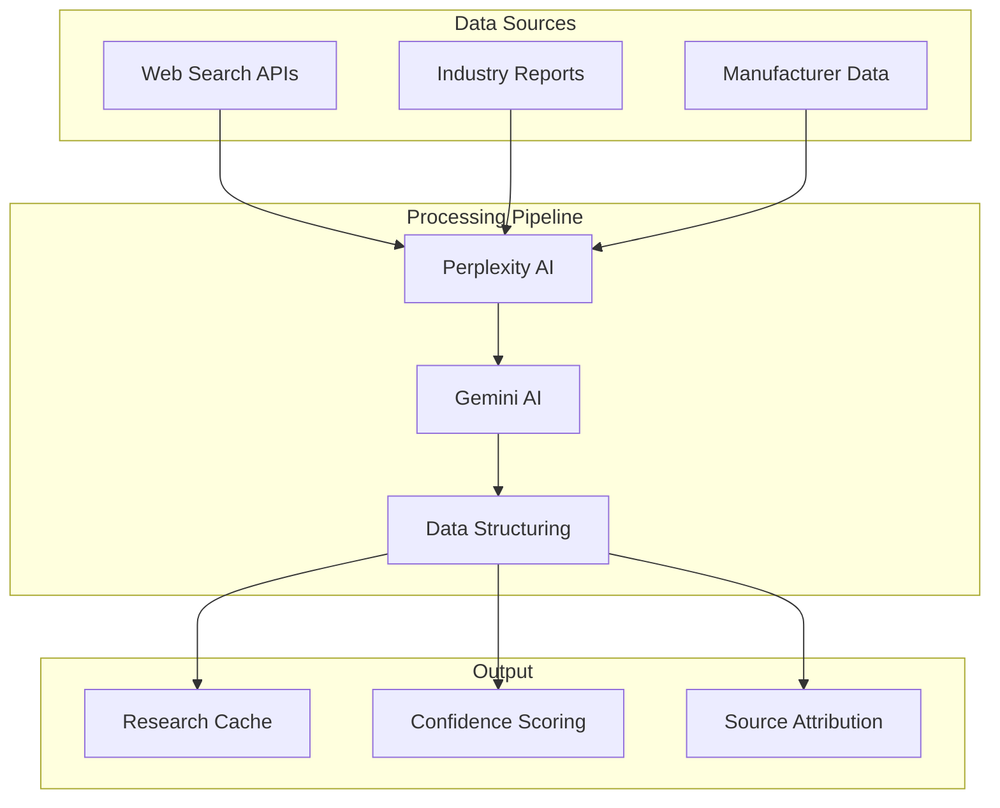

**Diagram sources**
- [ai-market-research/index.ts](file://supabase/functions/ai-market-research/index.ts#L145-L335)

**Section sources**
- [ai-market-research/index.ts](file://supabase/functions/ai-market-research/index.ts#L1-L335)

## State Management

### useConversation Hook

The useConversation hook manages conversational AI interactions with persistent state storage and real-time communication capabilities.

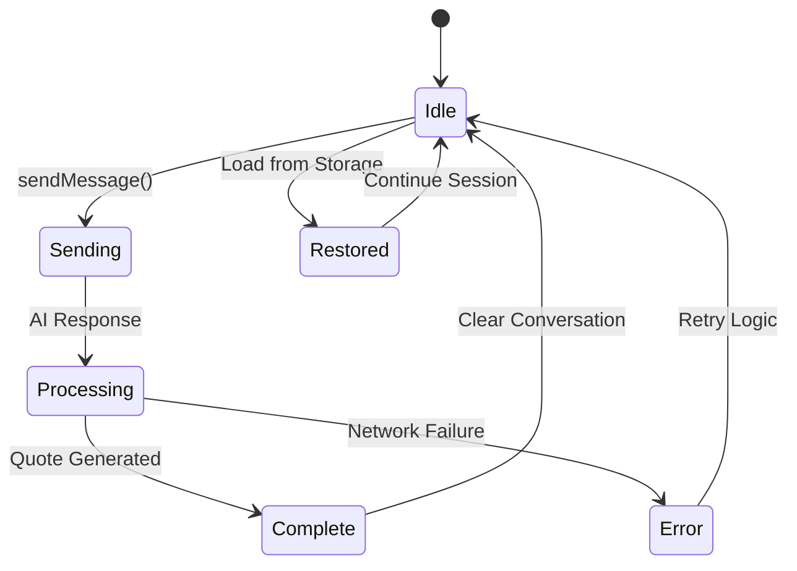

**Diagram sources**
- [useConversation.ts](file://src/hooks/useConversation.ts#L32-L177)

**Section sources**
- [useConversation.ts](file://src/hooks/useConversation.ts#L32-L177)

### useQuotes Hook

The useQuotes hook provides comprehensive quote management with real-time synchronization and optimistic updates.

**Section sources**
- [useQuotes.ts](file://src/hooks/useQuotes.ts#L55-L261)

## Accessibility and Loading States

### QuoteSkeleton

The QuoteSkeleton component provides accessible loading states with semantic markup and screen reader support.

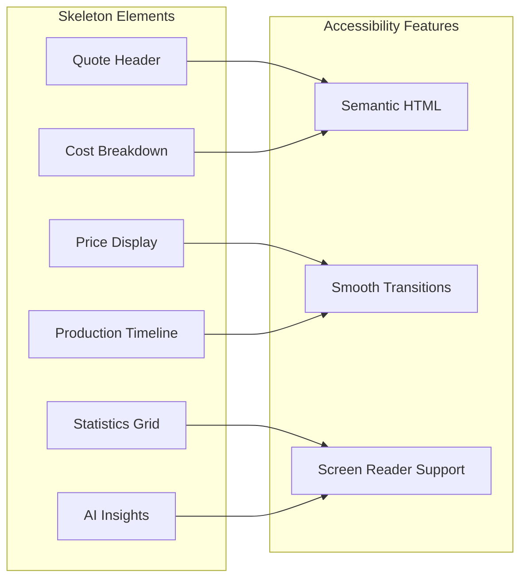

**Diagram sources**
- [QuoteSkeleton.tsx](file://src/components/quote/QuoteSkeleton.tsx#L4-L90)

**Section sources**
- [QuoteSkeleton.tsx](file://src/components/quote/QuoteSkeleton.tsx#L4-L90)

### QuoteLoadingStages

The QuoteLoadingStages component provides engaging progress feedback during quote generation with motivational tips and visual indicators.

**Section sources**
- [QuoteLoadingStages.tsx](file://src/components/quote/QuoteLoadingStages.tsx#L50-L139)

## Extending the Quoting Engine

### Custom Pricing Rules

The system supports extension through custom pricing rule engines that can be integrated into the quote generation pipeline:

```typescript
// Example custom pricing rule implementation
interface PricingRule {
  name: string;
  condition: (quoteData: QuoteData) => boolean;
  apply: (quoteData: QuoteData) => QuoteData;
}

const customRules: PricingRule[] = [
  {
    name: "Bulk Discount Rule",
    condition: (quote) => quote.quantity >= 1000,
    apply: (quote) => ({
      ...quote,
      unitPrice: quote.unitPrice * 0.95, // 5% discount
    }),
  },
  {
    name: "Material Surcharge Rule",
    condition: (quote) => quote.fabricType?.toLowerCase().includes("premium"),
    apply: (quote) => ({
      ...quote,
      unitPrice: quote.unitPrice * 1.15, // 15% surcharge
    }),
  },
];
```

### Integration Patterns

The quote system follows established integration patterns for extensibility:

- **Plugin Architecture**: Modular component design allows easy addition of new features
- **Hook-Based Logic**: Reusable state management through custom hooks
- **Edge Function Integration**: Scalable backend processing with serverless architecture
- **Event-Driven Updates**: Real-time synchronization through Supabase realtime

## Security and Verification

### OTP Verification

The AIQuoteGeneratorWithOTP component implements comprehensive security measures including email verification and rate limiting.

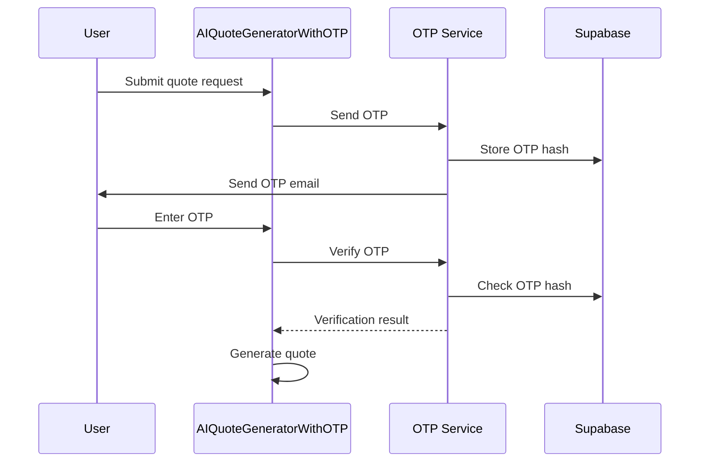

**Diagram sources**
- [AIQuoteGeneratorWithOTP.tsx](file://src/components/AIQuoteGeneratorWithOTP.tsx#L175-L345)

**Section sources**
- [AIQuoteGeneratorWithOTP.tsx](file://src/components/AIQuoteGeneratorWithOTP.tsx#L175-L345)

### Security Measures

The system implements multiple layers of security:

- **CAPTCHA Protection**: Google reCAPTCHA v3 for bot prevention
- **Rate Limiting**: IP and email-based throttling mechanisms
- **Input Validation**: Comprehensive form validation with Zod schemas
- **Secure Storage**: Encrypted OTP storage and transmission
- **Audit Logging**: Complete security event tracking

## Conclusion

The quote components system represents a sophisticated, AI-powered solution for apparel manufacturing quote generation. Through its modular architecture, comprehensive state management, and robust security measures, it provides an exceptional user experience while maintaining scalability and extensibility.

Key strengths of the system include:

- **Intuitive User Experience**: Conversational interfaces reduce friction in quote generation
- **AI-Driven Intelligence**: Machine learning enhances accuracy and competitiveness
- **Real-Time Processing**: Immediate feedback improves user satisfaction
- **Comprehensive Security**: Multi-layered protection ensures system integrity
- **Extensible Architecture**: Plugin-based design supports future enhancements

The system successfully bridges the gap between complex manufacturing requirements and user-friendly interfaces, delivering accurate, competitive quotes in a fraction of traditional quote generation time. Its integration with Edge Functions and modern React patterns positions it as a scalable foundation for future innovations in AI-driven manufacturing platforms.