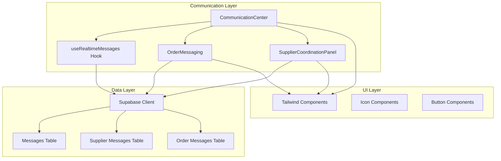
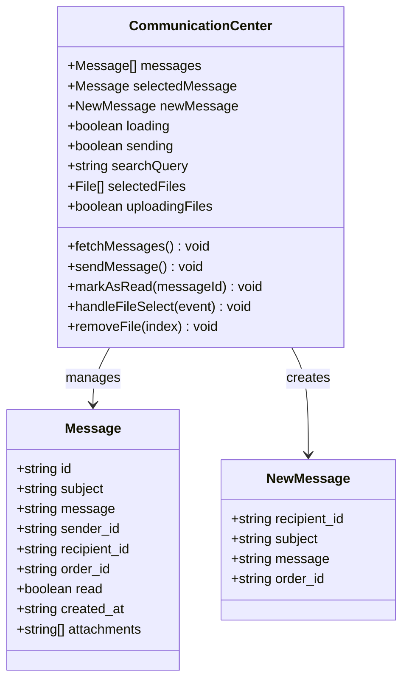
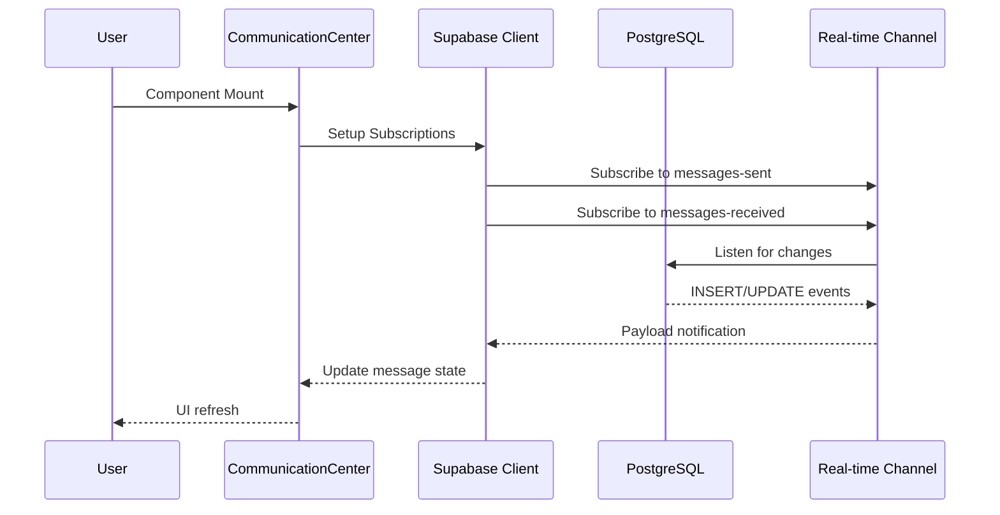
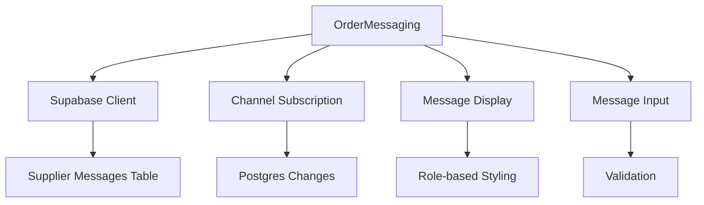
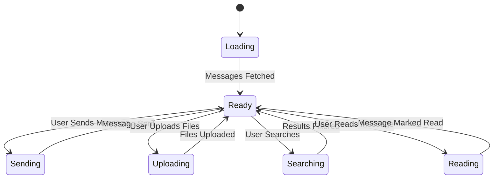
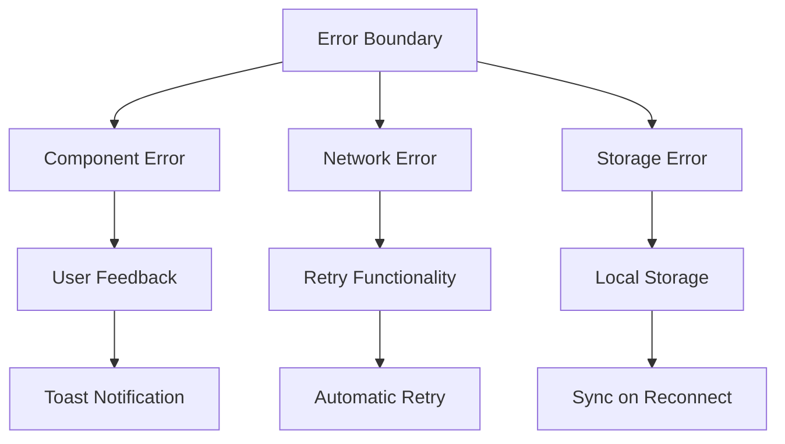
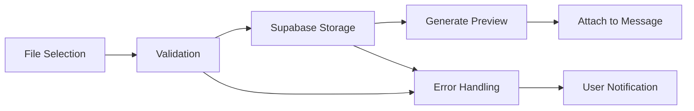

# Shared Components

<cite>
**Referenced Files in This Document**
- [CommunicationCenter.tsx](file://src/components/shared/CommunicationCenter.tsx)
- [useRealtimeMessages.ts](file://src/hooks/useRealtimeMessages.ts)
- [OrderMessaging.tsx](file://src/components/supplier/OrderMessaging.tsx)
- [SupplierCoordinationPanel.tsx](file://src/components/production/SupplierCoordinationPanel.tsx)
- [OrderMessaging.tsx](file://src/components\OrderMessaging.tsx)
- [client.ts](file://src/integrations/supabase/client.ts)
- [database.ts](file://src/types/database.ts)
- [index.css](file://src/index.css)
- [tailwind.config.ts](file://tailwind.config.ts)
</cite>

## Table of Contents
1. [Introduction](#introduction)
2. [Architecture Overview](#architecture-overview)
3. [CommunicationCenter Component](#communicationcenter-component)
4. [Real-time Messaging System](#real-time-messaging-system)
5. [Integration with Other Components](#integration-with-other-components)
6. [State Management and Hooks](#state-management-and-hooks)
7. [Security and Error Handling](#security-and-error-handling)
8. [Performance Optimization](#performance-optimization)
9. [Customization and Theming](#customization-and-theming)
10. [Best Practices](#best-practices)

## Introduction

The `shared/` component directory houses the `CommunicationCenter.tsx` component, which serves as a unified interface for all user communications across roles in the Sleek Apparels platform. This component provides a comprehensive messaging solution that integrates seamlessly with Supabase's real-time capabilities, enabling instant messaging between buyers, suppliers, and administrators.

The CommunicationCenter acts as a central hub for order-related communications, supporting message threading, read receipts, file attachments, and sophisticated search functionality. It demonstrates advanced React patterns including real-time subscriptions, state management, and responsive design with Tailwind CSS.

## Architecture Overview

The communication system follows a modular architecture with clear separation of concerns:



**Diagram sources**
- [CommunicationCenter.tsx](file://src/components/shared/CommunicationCenter.tsx#L1-L451)
- [useRealtimeMessages.ts](file://src/hooks/useRealtimeMessages.ts#L1-L61)
- [client.ts](file://src/integrations/supabase/client.ts#L1-L20)

**Section sources**
- [CommunicationCenter.tsx](file://src/components/shared/CommunicationCenter.tsx#L1-L50)
- [useRealtimeMessages.ts](file://src/hooks/useRealtimeMessages.ts#L1-L20)

## CommunicationCenter Component

### Core Features

The CommunicationCenter provides a comprehensive messaging interface with the following key features:

#### Message Management
- **Threaded Conversations**: Supports ordered message history with chronological sorting
- **Read Receipts**: Automatic marking of messages as read upon viewing
- **Search Functionality**: Real-time search across message subjects and content
- **Attachment Support**: File upload with drag-and-drop interface (PDF, DOC, images up to 5 files)

#### User Interface Design
- **Responsive Layout**: Grid-based design adapting to different screen sizes
- **Visual Feedback**: Clear indicators for unread messages and loading states
- **Accessibility**: Proper ARIA labels and keyboard navigation support

### Component Structure



**Diagram sources**
- [CommunicationCenter.tsx](file://src/components/shared/CommunicationCenter.tsx#L12-L22)
- [CommunicationCenter.tsx](file://src/components/shared/CommunicationCenter.tsx#L25-L36)

### Real-time Subscriptions

The component establishes dual real-time subscriptions for comprehensive message coverage:



**Diagram sources**
- [CommunicationCenter.tsx](file://src/components/shared/CommunicationCenter.tsx#L47-L80)

**Section sources**
- [CommunicationCenter.tsx](file://src/components/shared/CommunicationCenter.tsx#L28-L88)

## Real-time Messaging System

### useRealtimeMessages Hook

The `useRealtimeMessages` hook provides a reusable real-time messaging capability:

#### Implementation Details
- **Dual Subscription Pattern**: Monitors both sent and received messages
- **Payload Processing**: Handles INSERT and UPDATE events with type-safe interfaces
- **Cleanup Management**: Proper subscription cleanup on component unmount
- **Error Handling**: Console logging for development debugging

#### Message Schema
The hook operates on a standardized message interface that ensures type safety across the application:

| Field | Type | Description |
|-------|------|-------------|
| id | string | Unique message identifier |
| subject | string | Message subject line |
| message | string | Main message content |
| sender_id | string | Sender user identifier |
| recipient_id | string | Recipient user identifier |
| order_id | string \| null | Associated order reference |
| read | boolean | Read status indicator |
| created_at | string | Timestamp of creation |
| attachments | string[] | Array of file URLs |

**Section sources**
- [useRealtimeMessages.ts](file://src/hooks/useRealtimeMessages.ts#L5-L16)
- [useRealtimeMessages.ts](file://src/hooks/useRealtimeMessages.ts#L17-L61)

### Supabase Integration

The system leverages Supabase's real-time capabilities through PostgreSQL's logical replication:

#### Channel Configuration
- **messages-sent**: Tracks messages where user is the sender
- **messages-received**: Tracks messages where user is the recipient
- **Order-specific channels**: Dynamic channels for individual orders

#### Event Handling
- **INSERT Events**: New message creation triggers UI updates
- **UPDATE Events**: Message status changes (read/unread)
- **Filtering**: User-specific filtering prevents unauthorized access

**Section sources**
- [CommunicationCenter.tsx](file://src/components/shared/CommunicationCenter.tsx#L47-L80)
- [useRealtimeMessages.ts](file://src/hooks/useRealtimeMessages.ts#L23-L57)

## Integration with Other Components

### OrderMessaging Component

The OrderMessaging component demonstrates focused messaging for specific orders:

#### Key Features
- **Order-specific Filtering**: Messages filtered by order_id
- **Role-based Display**: Different styling for different user roles
- **Smooth Scrolling**: Automatic scrolling to latest messages
- **Multi-user Support**: Handles messages from multiple participants

#### Architecture Pattern


**Diagram sources**
- [OrderMessaging.tsx](file://src/components/supplier/OrderMessaging.tsx#L16-L35)

### SupplierCoordinationPanel

The SupplierCoordinationPanel provides specialized messaging for supplier coordination:

#### Advanced Features
- **Multi-role Support**: Distinguishes between buyer and supplier messages
- **Supplier Information**: Embedded supplier contact details
- **Message History**: Comprehensive conversation thread
- **Attachment Support**: File sharing capabilities

#### State Management
The component maintains separate state for messages, supplier information, and user context:

| State | Purpose | Type |
|-------|---------|------|
| messages | Conversation history | Message[] |
| supplier | Supplier contact info | Supplier \| null |
| newMessage | Current draft message | string |
| sending | Sending state indicator | boolean |
| user | Current user context | any |

**Section sources**
- [OrderMessaging.tsx](file://src/components/supplier/OrderMessaging.tsx#L1-L136)
- [SupplierCoordinationPanel.tsx](file://src/components/production/SupplierCoordinationPanel.tsx#L1-L256)

## State Management and Hooks

### useRealtimeMessages Hook

The hook encapsulates real-time messaging logic with proper lifecycle management:

#### Hook Signature
```typescript
export const useRealtimeMessages = (
  userId: string | undefined, 
  onNewMessage?: (message: Message) => void
) => {
  // Implementation details
}
```

#### Lifecycle Management
- **Mount**: Establishes real-time subscriptions
- **Unmount**: Cleans up subscriptions to prevent memory leaks
- **Dependency Tracking**: Reacts to userId changes

### CommunicationCenter State Flow



**Diagram sources**
- [CommunicationCenter.tsx](file://src/components/shared/CommunicationCenter.tsx#L29-L451)

**Section sources**
- [useRealtimeMessages.ts](file://src/hooks/useRealtimeMessages.ts#L17-L61)
- [CommunicationCenter.tsx](file://src/components/shared/CommunicationCenter.tsx#L29-L451)

## Security and Error Handling

### Message Encryption and Content Moderation

While the current implementation focuses on secure transmission, several security measures are in place:

#### Access Control
- **User Authentication**: Supabase auth integration ensures only authenticated users can access messages
- **Row-level Security**: PostgreSQL policies restrict message access to authorized users
- **File Storage Security**: Supabase storage policies limit file access to authorized users

#### Content Validation
- **Input Sanitization**: Message content length limits prevent abuse
- **File Type Restrictions**: Whitelist of allowed file extensions (.pdf, .doc, .jpg, etc.)
- **Size Limits**: Maximum file count (5 files) and size restrictions

### Error Handling Strategies

#### Network Error Recovery
- **Graceful Degradation**: Components continue functioning during network issues
- **Retry Mechanisms**: Automatic retry for transient failures
- **User Feedback**: Toast notifications for error states

#### Offline Scenario Support
- **Local State Persistence**: Messages remain available when offline
- **Queue Management**: Failed sends are queued for later retry
- **Sync Indicators**: Visual feedback for offline/online status

### Error Boundaries

The application implements comprehensive error boundaries:



**Diagram sources**
- [BlogErrorBoundary.tsx](file://src/components/blog/BlogErrorBoundary.tsx#L1-L154)

**Section sources**
- [CommunicationCenter.tsx](file://src/components/shared/CommunicationCenter.tsx#L111-L119)
- [OrderMessaging.tsx](file://src/components/supplier/OrderMessaging.tsx#L72-L78)

## Performance Optimization

### Large Message History Management

For applications with extensive message histories, several optimization strategies are employed:

#### Pagination Strategy
- **Virtual Scrolling**: Only renders visible messages to reduce DOM overhead
- **Lazy Loading**: Loads older messages on demand
- **Memory Management**: Unloads old messages from memory when out of viewport

#### Search Optimization
- **Debounced Search**: Prevents excessive API calls during typing
- **Index Utilization**: Leverages database indexes for fast search performance
- **Client-side Filtering**: Reduces server load by filtering locally

### File Upload Optimization

#### Upload Pipeline


**Diagram sources**
- [CommunicationCenter.tsx](file://src/components/shared/CommunicationCenter.tsx#L122-L170)

#### Performance Metrics
- **Upload Progress**: Real-time progress indication
- **Concurrent Uploads**: Limit to 5 simultaneous uploads
- **Error Recovery**: Automatic retry for failed uploads

### Memory Management

#### Component Cleanup
- **Subscription Cleanup**: Proper removal of event listeners
- **Timer Cleanup**: Disposal of scheduled tasks
- **Reference Cleanup**: Nullification of large object references

**Section sources**
- [CommunicationCenter.tsx](file://src/components/shared/CommunicationCenter.tsx#L122-L170)
- [OrderMessaging.tsx](file://src/components/supplier/OrderMessaging.tsx#L24-L35)

## Customization and Theming

### Tailwind CSS Integration

The CommunicationCenter leverages a comprehensive Tailwind configuration for consistent theming:

#### Color System
The application uses a warm sustainable color scheme with deep forest green as the primary color:

| Color Variable | HSL Value | Usage |
|----------------|-----------|-------|
| --primary | 158 35% 27% | Main brand color |
| --primary-light | 158 35% 37% | Light variants |
| --secondary | 18 47% 60% | Accent color |
| --background | 30 25% 96% | Background surface |
| --muted | 30 15% 92% | Subtle backgrounds |

#### Responsive Design
- **Mobile-first Approach**: Base styles optimized for mobile devices
- **Breakpoint System**: Tailwind's responsive breakpoints
- **Flexible Layouts**: CSS Grid and Flexbox for adaptive designs

### Component Customization

#### Embedding Patterns
The CommunicationCenter can be embedded in various contexts:

```typescript
// Order-specific messaging
<CommunicationCenter orderFilter={orderId} />

// General messaging
<CommunicationCenter />
```

#### Styling Customization
Components can be customized using Tailwind's utility classes:

```typescript
// Custom container sizing
<div className="max-w-4xl mx-auto">

// Custom spacing
<Card className="mb-6">

// Custom typography
<h2 className="text-xl font-semibold">
```

### Accessibility Features

#### Keyboard Navigation
- **Focus Management**: Proper focus handling for modal interactions
- **Keyboard Shortcuts**: Enter key for message submission
- **Screen Reader Support**: ARIA labels and roles

#### Visual Accessibility
- **High Contrast**: Sufficient contrast ratios for text and backgrounds
- **Focus Indicators**: Clear visual focus indicators
- **Responsive Typography**: Scalable text for different screen sizes

**Section sources**
- [index.css](file://src/index.css#L1-L53)
- [tailwind.config.ts](file://tailwind.config.ts#L34-L74)

## Best Practices

### Development Guidelines

#### Code Organization
- **Separation of Concerns**: Clear distinction between UI, state, and business logic
- **Reusable Hooks**: Extracted real-time logic into composable hooks
- **Type Safety**: Comprehensive TypeScript interfaces

#### Testing Strategies
- **Unit Testing**: Individual component functionality testing
- **Integration Testing**: Real-time subscription testing
- **End-to-end Testing**: Complete user workflow validation

### Deployment Considerations

#### Environment Configuration
- **Supabase Integration**: Proper environment variable management
- **Storage Policies**: Secure file upload and retrieval
- **Rate Limiting**: Protection against abuse

#### Monitoring and Analytics
- **Performance Monitoring**: Track message delivery times
- **Error Tracking**: Monitor and alert on failures
- **Usage Analytics**: Understand user engagement patterns

### Maintenance Recommendations

#### Regular Updates
- **Dependency Updates**: Keep Supabase client and React dependencies current
- **Security Patches**: Apply security updates promptly
- **Performance Monitoring**: Regular performance audits

#### Scalability Planning
- **Database Optimization**: Index optimization for message queries
- **Storage Management**: Regular cleanup of unused files
- **Real-time Scaling**: Monitor subscription counts and optimize

**Section sources**
- [CommunicationCenter.tsx](file://src/components/shared/CommunicationCenter.tsx#L1-L451)
- [useRealtimeMessages.ts](file://src/hooks/useRealtimeMessages.ts#L1-L61)