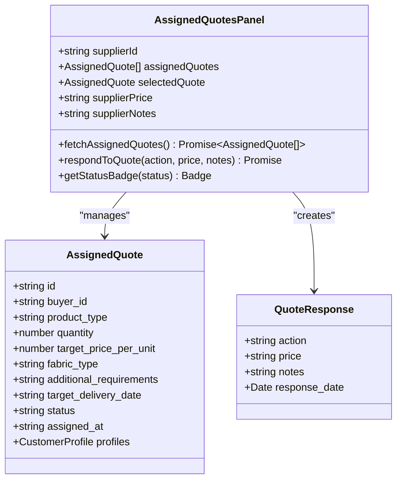
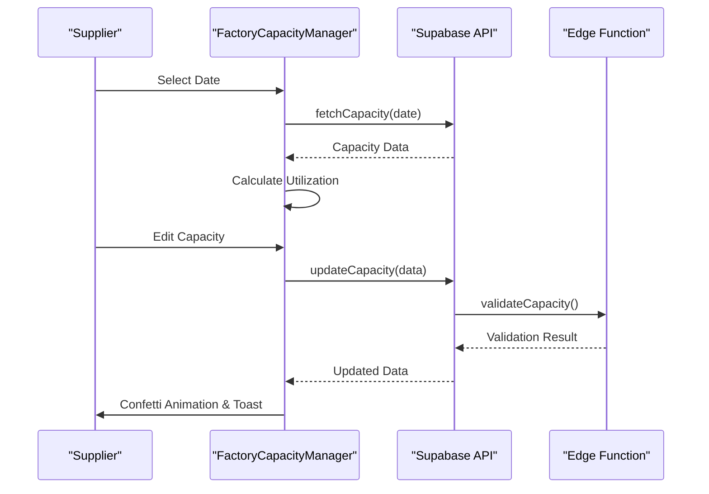
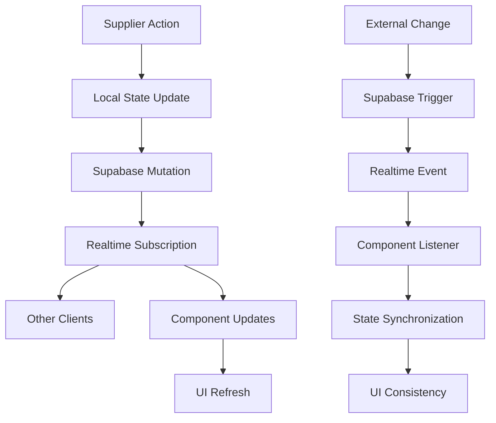
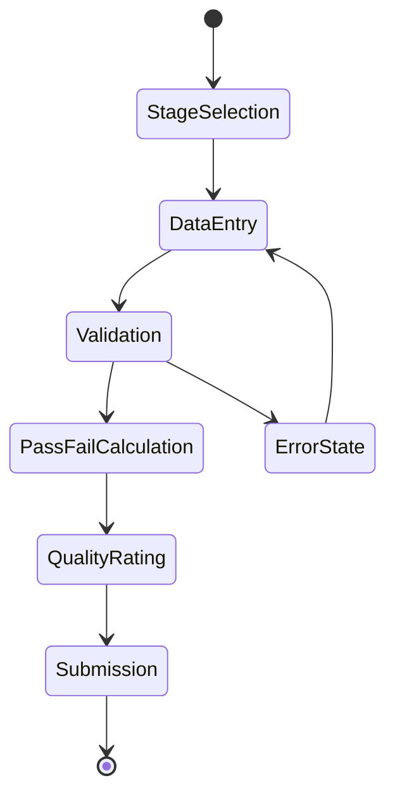
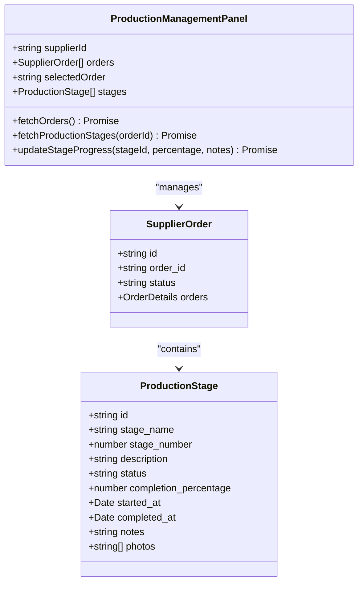
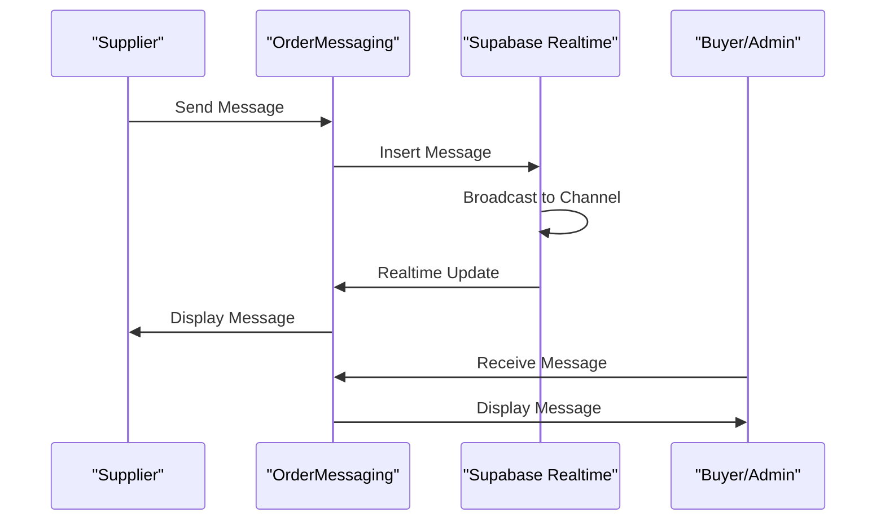
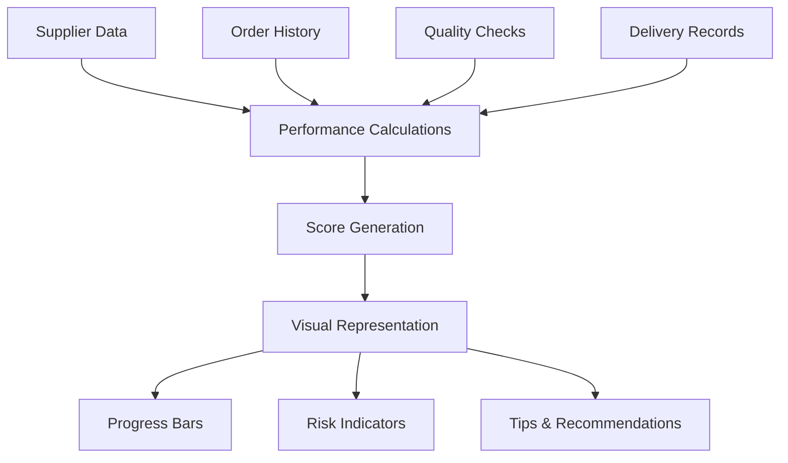
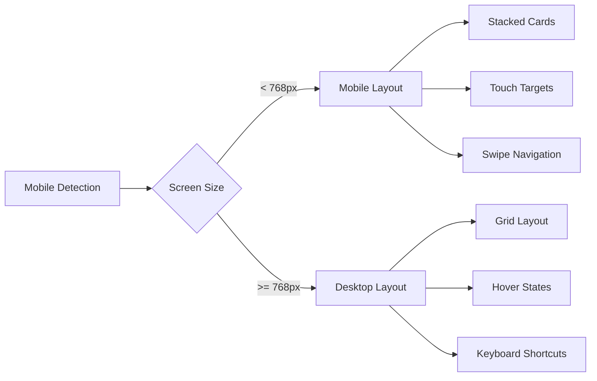
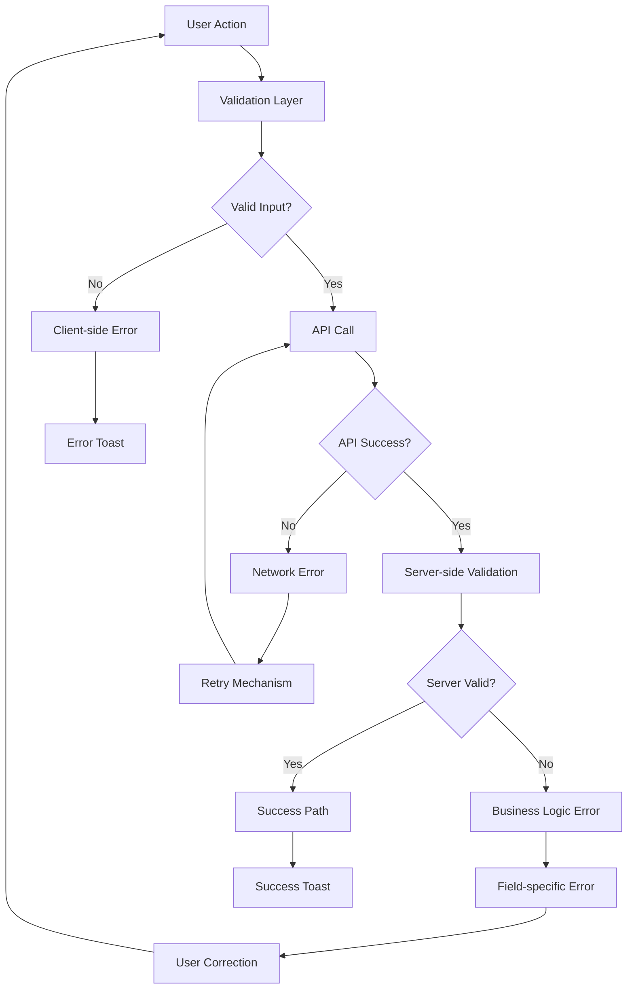

# Supplier Components

<cite>
**Referenced Files in This Document**
- [AssignedQuotesPanel.tsx](file://src/components/supplier/AssignedQuotesPanel.tsx)
- [FactoryCapacityManager.tsx](file://src/components/supplier/FactoryCapacityManager.tsx)
- [ProductionManagementPanel.tsx](file://src/components/supplier/ProductionManagementPanel.tsx)
- [ProductionStageManager.tsx](file://src/components/supplier/ProductionStageManager.tsx)
- [QCInspectionForm.tsx](file://src/components/supplier/QCInspectionForm.tsx)
- [SupplierPerformanceMetrics.tsx](file://src/components/supplier/SupplierPerformanceMetrics.tsx)
- [OrderMessaging.tsx](file://src/components/supplier/OrderMessaging.tsx)
- [useSupplierOrders.ts](file://src/hooks/useSupplierOrders.ts)
- [useFactoryCapacity.ts](file://src/hooks/useFactoryCapacity.ts)
- [useOptimisticUpdate.ts](file://src/hooks/useOptimisticUpdate.ts)
- [initialize-production-stages/index.ts](file://supabase/functions/initialize-production-stages/index.ts)
- [predict-quality-risks/index.ts](file://supabase/functions/predict-quality-risks/index.ts)
- [use-mobile.tsx](file://src/hooks/use-mobile.tsx)
- [CommunicationCenter.tsx](file://src/components/shared/CommunicationCenter.tsx)
</cite>

## Table of Contents
1. [Introduction](#introduction)
2. [Core Supplier Components](#core-supplier-components)
3. [Real-time Data Management](#real-time-data-management)
4. [Quality Control Systems](#quality-control-systems)
5. [Production Workflow Management](#production-workflow-management)
6. [Communication Infrastructure](#communication-infrastructure)
7. [Performance Analytics](#performance-analytics)
8. [Integration Patterns](#integration-patterns)
9. [Mobile Responsiveness](#mobile-responsiveness)
10. [Error Handling and Recovery](#error-handling-and-recovery)
11. [Best Practices](#best-practices)

## Introduction

The supplier components system provides a comprehensive interface for manufacturing partners within the Sleek Apparels ecosystem. This system enables suppliers to manage their production workflow, track capacity utilization, handle quality control, and maintain real-time communication with buyers and administrators. Built on React with Supabase for real-time data synchronization, the system emphasizes mobile responsiveness and offline capability considerations while maintaining robust error handling and optimistic updates.

## Core Supplier Components

### AssignedQuotesPanel

The AssignedQuotesPanel serves as the primary interface for suppliers to view and respond to incoming quote requests from Sleek Apparels administrators. This component manages the entire quote lifecycle, from assignment notification to acceptance or rejection.

**Diagram sources**
- [AssignedQuotesPanel.tsx](file://src/components/supplier/AssignedQuotesPanel.tsx#L40-L59)
- [AssignedQuotesPanel.tsx](file://src/components/supplier/AssignedQuotesPanel.tsx#L107-L156)

The component implements sophisticated state management with optimistic updates for quote responses. It features real-time quote status tracking, comprehensive quote details display, and seamless integration with the Supabase realtime subscription system for immediate updates when administrators modify quote assignments.

**Section sources**
- [AssignedQuotesPanel.tsx](file://src/components/supplier/AssignedQuotesPanel.tsx#L1-L441)

### FactoryCapacityManager

The FactoryCapacityManager provides suppliers with comprehensive capacity planning and utilization tracking capabilities. This component enables manufacturers to input daily capacity data, monitor utilization trends, and optimize production scheduling.

**Diagram sources**
- [FactoryCapacityManager.tsx](file://src/components/supplier/FactoryCapacityManager.tsx#L38-L122)
- [useFactoryCapacity.ts](file://src/hooks/useFactoryCapacity.ts#L57-L89)

The manager implements dynamic capacity calculation with real-time utilization percentages, automated availability calculations, and intelligent capacity suggestion algorithms. It integrates with Edge Functions for advanced capacity forecasting and supplier performance analytics.

**Section sources**
- [FactoryCapacityManager.tsx](file://src/components/supplier/FactoryCapacityManager.tsx#L1-L326)
- [useFactoryCapacity.ts](file://src/hooks/useFactoryCapacity.ts#L1-L161)

## Real-time Data Management

### Supabase Integration

The supplier components leverage Supabase's realtime capabilities for seamless data synchronization across all components. The integration provides automatic reactivity to external changes, ensuring that supplier dashboards remain synchronized with administrative actions and production updates.

**Diagram sources**
- [OrderMessaging.tsx](file://src/components/supplier/OrderMessaging.tsx#L23-L35)
- [ProductionManagementPanel.tsx](file://src/components/supplier/ProductionManagementPanel.tsx#L49-L53)

### Optimistic Updates Pattern

The system implements sophisticated optimistic update patterns to enhance user experience during data modifications. This approach immediately reflects user actions in the UI while maintaining data integrity through rollback mechanisms.

**Section sources**
- [useOptimisticUpdate.ts](file://src/hooks/useOptimisticUpdate.ts#L1-L176)

## Quality Control Systems

### QCInspectionForm

The QCInspectionForm provides comprehensive quality control logging capabilities across eight distinct manufacturing stages. This component ensures systematic quality tracking with automated pass/fail calculations and trend analysis.

**Diagram sources**
- [QCInspectionForm.tsx](file://src/components/supplier/QCInspectionForm.tsx#L37-L84)

The form implements intelligent quality scoring with automated pass rate calculations, visual quality indicators, and integrated risk assessment through Edge Function predictions.

**Section sources**
- [QCInspectionForm.tsx](file://src/components/supplier/QCInspectionForm.tsx#L1-L219)

### Quality Risk Prediction

Through the predict-quality-risks Edge Function, the system provides predictive quality assessments based on current production stages, supplier performance metrics, and historical data patterns.

**Section sources**
- [predict-quality-risks/index.ts](file://supabase/functions/predict-quality-risks/index.ts#L1-L131)

## Production Workflow Management

### ProductionManagementPanel

The ProductionManagementPanel orchestrates the complete production workflow, managing supplier orders through eight distinct manufacturing stages with real-time progress tracking and automated stage initialization.

**Diagram sources**
- [ProductionManagementPanel.tsx](file://src/components/supplier/ProductionManagementPanel.tsx#L13-L36)
- [ProductionManagementPanel.tsx](file://src/components/supplier/ProductionManagementPanel.tsx#L38-L42)

The panel implements automated stage creation through Edge Functions, real-time progress synchronization, and comprehensive order management with status tracking and deadline monitoring.

**Section sources**
- [ProductionManagementPanel.tsx](file://src/components/supplier/ProductionManagementPanel.tsx#L1-L325)

### ProductionStageManager

The ProductionStageManager provides granular control over individual production stages, enabling detailed progress tracking and milestone management.

**Section sources**
- [ProductionStageManager.tsx](file://src/components/supplier/ProductionStageManager.tsx#L1-L251)

### Edge Function Integration

The initialize-production-stages Edge Function automatically creates production stage templates based on product categories, ensuring standardized manufacturing processes across different garment types.

**Section sources**
- [initialize-production-stages/index.ts](file://supabase/functions/initialize-production-stages/index.ts#L1-L133)

## Communication Infrastructure

### OrderMessaging

The OrderMessaging component provides real-time bidirectional communication between suppliers and buyers/administrators, featuring instant messaging with file attachments and conversation threading.

**Diagram sources**
- [OrderMessaging.tsx](file://src/components/supplier/OrderMessaging.tsx#L23-L35)

The messaging system supports rich media attachments, message threading, read receipts, and real-time notifications with comprehensive error handling and retry mechanisms.

**Section sources**
- [OrderMessaging.tsx](file://src/components/supplier/OrderMessaging.tsx#L1-L136)

### CommunicationCenter

The CommunicationCenter provides a centralized messaging hub for all supplier communications, supporting multiple channels and advanced filtering capabilities.

**Section sources**
- [CommunicationCenter.tsx](file://src/components/shared/CommunicationCenter.tsx#L1-L451)

## Performance Analytics

### SupplierPerformanceMetrics

The SupplierPerformanceMetrics component delivers comprehensive analytics on supplier performance, including delivery timeliness, acceptance rates, and overall quality scores.

**Diagram sources**
- [SupplierPerformanceMetrics.tsx](file://src/components/supplier/SupplierPerformanceMetrics.tsx#L29-L72)

The analytics system provides real-time performance tracking with automated score calculations, trend analysis, and actionable improvement recommendations.

**Section sources**
- [SupplierPerformanceMetrics.tsx](file://src/components/supplier/SupplierPerformanceMetrics.tsx#L1-L221)

## Integration Patterns

### Data Fetching Hooks

The system employs specialized hooks for efficient data management:

| Hook | Purpose | Features |
|------|---------|----------|
| `useSupplierOrders` | Manage supplier order lifecycle | Accept/reject, counter offers, status updates |
| `useFactoryCapacity` | Handle capacity planning | Real-time updates, utilization tracking, availability calculations |
| `useOptimisticUpdate` | Enable optimistic UI updates | Automatic rollback, error handling, success feedback |

**Section sources**
- [useSupplierOrders.ts](file://src/hooks/useSupplierOrders.ts#L1-L208)
- [useFactoryCapacity.ts](file://src/hooks/useFactoryCapacity.ts#L1-L161)

### Form Validation Patterns

The components implement comprehensive form validation with real-time feedback, including:

- **Quote Responses**: Price validation, note length limits
- **Capacity Updates**: Numeric input sanitization, capacity constraints  
- **QC Inspections**: Piece count validation, pass/fail calculations
- **Order Messages**: Character limits, attachment restrictions

## Mobile Responsiveness

### Responsive Design Implementation

The supplier components implement mobile-first responsive design principles with adaptive layouts and touch-optimized interactions.

**Diagram sources**
- [use-mobile.tsx](file://src/hooks/use-mobile.tsx#L1-L32)

The mobile optimization includes:
- Adaptive grid systems for different screen sizes
- Touch-friendly button sizing and spacing
- Collapsible panels for information density
- Optimized navigation patterns for mobile workflows

**Section sources**
- [use-mobile.tsx](file://src/hooks/use-mobile.tsx#L1-L32)

### Offline Capability Considerations

While the system primarily operates online, it implements several offline resilience patterns:

- **Optimistic Updates**: Immediate UI feedback with automatic rollback
- **Local State Management**: Persistent state during temporary connectivity issues
- **Error Boundaries**: Graceful degradation with meaningful error messages
- **Retry Mechanisms**: Automatic retry with exponential backoff for failed operations

## Error Handling and Recovery

### Comprehensive Error Management

The supplier components implement multi-layered error handling strategies:

### Recovery Patterns

The system implements several recovery patterns:

1. **Automatic Rollback**: Optimistic updates revert on failure
2. **State Reset**: Failed operations restore previous state
3. **Graceful Degradation**: Core functionality remains available during partial failures
4. **User Guidance**: Clear error messages with suggested actions

## Best Practices

### Development Guidelines

1. **State Management**: Use React Query for server state and local state for UI state
2. **Real-time Updates**: Leverage Supabase realtime subscriptions for immediate UI updates
3. **Performance Optimization**: Implement lazy loading and memoization for large datasets
4. **Accessibility**: Ensure keyboard navigation and screen reader compatibility
5. **Testing**: Comprehensive unit testing with mocked Supabase interactions

### Security Considerations

- **Input Sanitization**: Validate all user inputs at both client and server levels
- **Authentication**: Require user authentication for all supplier operations
- **Authorization**: Implement role-based access controls for sensitive operations
- **Data Validation**: Validate data integrity before persistence

### Performance Optimization

- **Query Optimization**: Use selective field queries and appropriate indexing
- **Caching Strategies**: Implement intelligent caching with automatic invalidation
- **Batch Operations**: Group related updates to minimize API calls
- **Lazy Loading**: Load components and data on-demand to reduce initial bundle size

The supplier components system represents a comprehensive solution for manufacturing partner management, combining real-time data synchronization, intuitive user interfaces, and robust error handling to create a seamless operational experience for suppliers within the Sleek Apparels ecosystem.