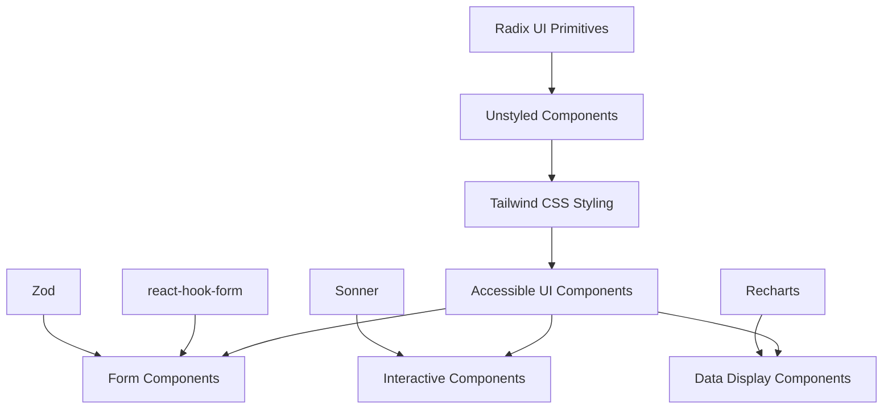
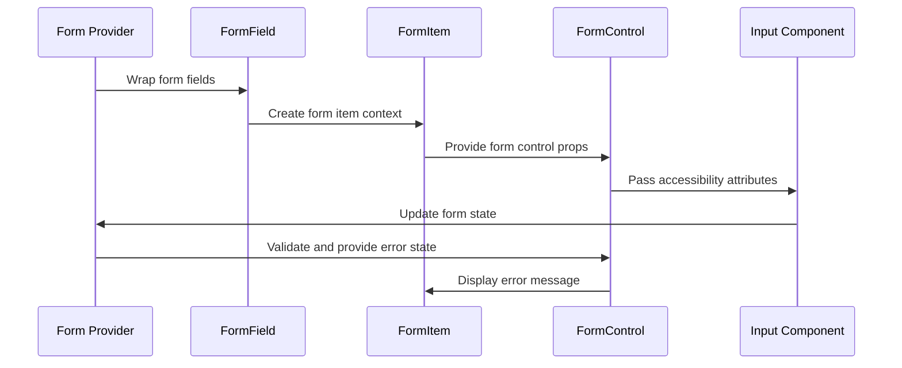
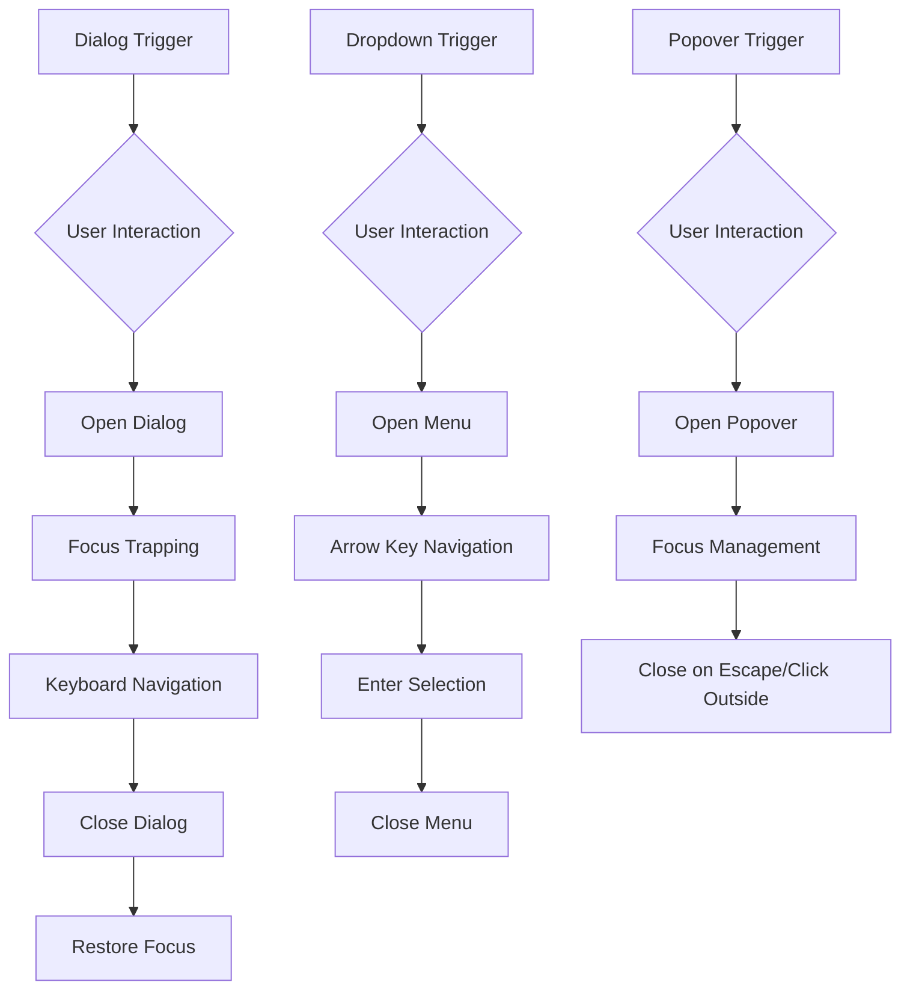
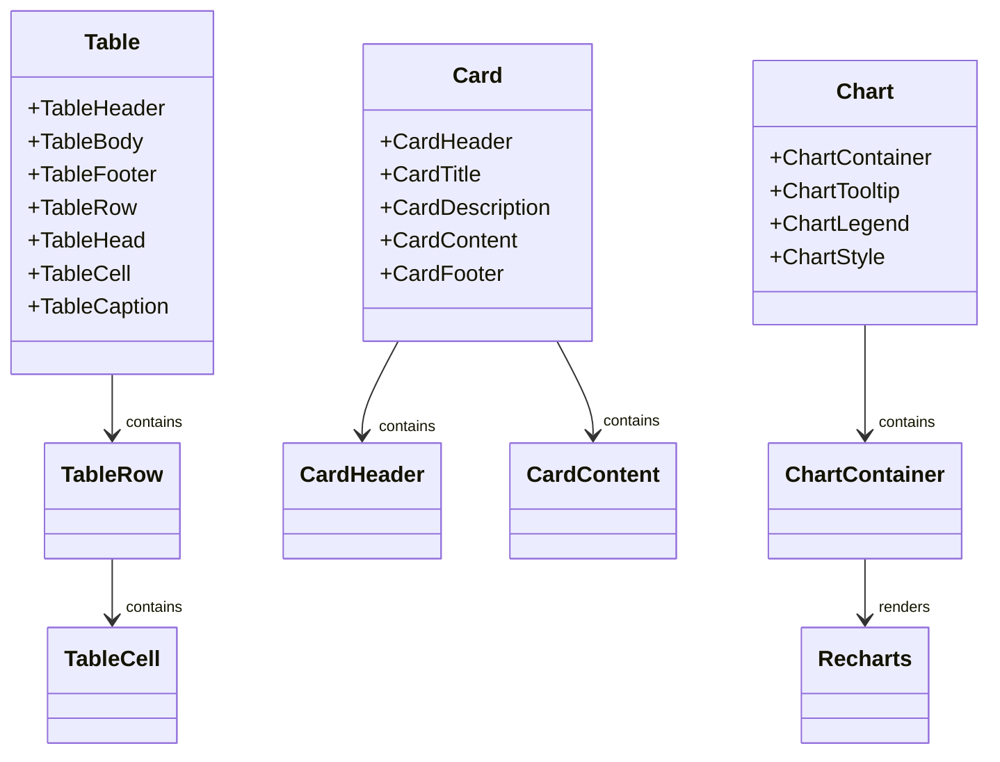
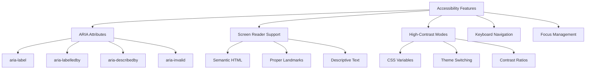
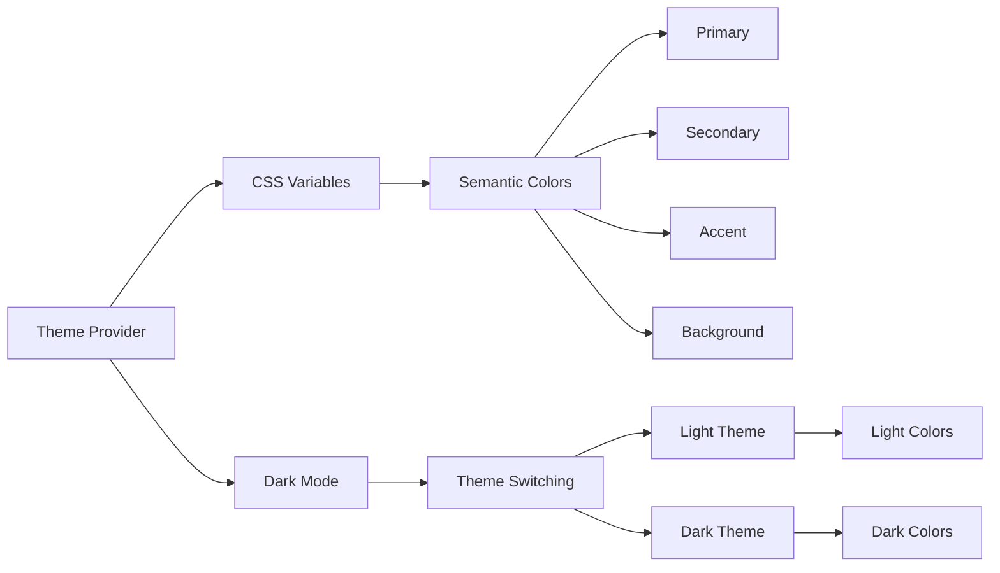

# UI Components Library

<cite>
**Referenced Files in This Document**   
- [form.tsx](file://src/components/ui/form.tsx)
- [input.tsx](file://src/components/ui/input.tsx)
- [checkbox.tsx](file://src/components/ui/checkbox.tsx)
- [dialog.tsx](file://src/components/ui/dialog.tsx)
- [dropdown-menu.tsx](file://src/components/ui/dropdown-menu.tsx)
- [popover.tsx](file://src/components/ui/popover.tsx)
- [table.tsx](file://src/components/ui/table.tsx)
- [card.tsx](file://src/components/ui/card.tsx)
- [chart.tsx](file://src/components/ui/chart.tsx)
- [button.tsx](file://src/components/ui/button.tsx)
- [toast.tsx](file://src/components/ui/toast.tsx)
- [sonner.tsx](file://src/components/ui/sonner.tsx)
- [use-toast.ts](file://src/components/ui/use-toast.ts)
- [label.tsx](file://src/components/ui/label.tsx)
- [textarea.tsx](file://src/components/ui/textarea.tsx)
</cite>

## Table of Contents
1. [Introduction](#introduction)
2. [Architecture Overview](#architecture-overview)
3. [Form Components](#form-components)
4. [Interactive Components](#interactive-components)
5. [Data Display Components](#data-display-components)
6. [Accessibility Features](#accessibility-features)
7. [Theming and Dark Mode](#theming-and-dark-mode)
8. [Component Extension Guidelines](#component-extension-guidelines)

## Introduction
The UI Components Library is a collection of reusable, accessible, and styled primitives based on shadcn/ui patterns. This library provides a comprehensive set of components that leverage Tailwind CSS for styling via className composition, ensuring consistent design across the application. The components are designed to be unstyled at their core, allowing for flexible customization while maintaining accessibility standards and responsive behavior.

## Architecture Overview
The UI component library follows a modular architecture built on Radix UI primitives, providing accessible, unstyled base components that are enhanced with Tailwind CSS classes for visual styling. Each component is designed to be composable and extensible, following the shadcn/ui pattern of separating structure from presentation.

**Diagram sources**
- [form.tsx](file://src/components/ui/form.tsx)
- [button.tsx](file://src/components/ui/button.tsx)
- [chart.tsx](file://src/components/ui/chart.tsx)
- [sonner.tsx](file://src/components/ui/sonner.tsx)

**Section sources**
- [form.tsx](file://src/components/ui/form.tsx)
- [button.tsx](file://src/components/ui/button.tsx)

## Form Components
The form components provide a robust system for building accessible forms with react-hook-form integration and Zod validation support. The library includes form.tsx, input.tsx, and checkbox.tsx components that work together to create a seamless form experience.

The Form component serves as a provider for form state, while FormField, FormItem, FormLabel, FormControl, FormDescription, and FormMessage create a structured form layout with proper labeling and error handling. The Input and Checkbox components are designed to work seamlessly with react-hook-form's Controller component.

**Diagram sources**
- [form.tsx](file://src/components/ui/form.tsx)
- [input.tsx](file://src/components/ui/input.tsx)
- [checkbox.tsx](file://src/components/ui/checkbox.tsx)

**Section sources**
- [form.tsx](file://src/components/ui/form.tsx)
- [input.tsx](file://src/components/ui/input.tsx)
- [checkbox.tsx](file://src/components/ui/checkbox.tsx)

## Interactive Components
Interactive components such as dialog.tsx, dropdown-menu.tsx, and popover.tsx provide enhanced user experiences with proper focus management and keyboard navigation. These components are built on Radix UI primitives to ensure accessibility compliance.

The Dialog component creates modal dialogs with proper focus trapping and ARIA attributes. The DropdownMenu provides a context menu with keyboard navigation support, while the Popover offers a non-modal floating element that can be positioned relative to its trigger.

**Diagram sources**
- [dialog.tsx](file://src/components/ui/dialog.tsx)
- [dropdown-menu.tsx](file://src/components/ui/dropdown-menu.tsx)
- [popover.tsx](file://src/components/ui/popover.tsx)

**Section sources**
- [dialog.tsx](file://src/components/ui/dialog.tsx)
- [dropdown-menu.tsx](file://src/components/ui/dropdown-menu.tsx)
- [popover.tsx](file://src/components/ui/popover.tsx)

## Data Display Components
Data display components like table.tsx, card.tsx, and chart.tsx provide responsive layouts for presenting information. These components are designed to adapt to different screen sizes while maintaining readability and visual hierarchy.

The Table component provides a structured way to display tabular data with sorting and pagination capabilities. The Card component offers a container for related information with header, content, and footer sections. The Chart component integrates with Recharts to create responsive data visualizations with theming support.

**Diagram sources**
- [table.tsx](file://src/components/ui/table.tsx)
- [card.tsx](file://src/components/ui/card.tsx)
- [chart.tsx](file://src/components/ui/chart.tsx)

**Section sources**
- [table.tsx](file://src/components/ui/table.tsx)
- [card.tsx](file://src/components/ui/card.tsx)
- [chart.tsx](file://src/components/ui/chart.tsx)

## Accessibility Features
The component library prioritizes accessibility with comprehensive ARIA attributes, screen reader support, and high-contrast modes. Each component is designed to meet WCAG 2.1 standards, ensuring an inclusive user experience.

Key accessibility features include proper labeling with aria-labelledby and aria-describedby attributes, keyboard navigation support, focus management, and semantic HTML structure. The components also support screen readers through appropriate ARIA roles and states, and provide high-contrast modes for users with visual impairments.

**Diagram sources**
- [button.tsx](file://src/components/ui/button.tsx)
- [label.tsx](file://src/components/ui/label.tsx)
- [form.tsx](file://src/components/ui/form.tsx)

**Section sources**
- [label.tsx](file://src/components/ui/label.tsx)
- [form.tsx](file://src/components/ui/form.tsx)
- [button.tsx](file://src/components/ui/button.tsx)

## Theming and Dark Mode
The library supports theming via CSS variables and dark mode through the Next Themes integration. Components use semantic CSS variables that can be customized to match brand guidelines, while the dark mode support provides a seamless transition between light and dark color schemes.

The Chart component demonstrates advanced theming capabilities with support for both color and theme configurations. The Toast and Sonner components integrate with the theme context to automatically adapt their appearance based on the current theme setting.

**Diagram sources**
- [sonner.tsx](file://src/components/ui/sonner.tsx)
- [chart.tsx](file://src/components/ui/chart.tsx)
- [button.tsx](file://src/components/ui/button.tsx)

**Section sources**
- [sonner.tsx](file://src/components/ui/sonner.tsx)
- [chart.tsx](file://src/components/ui/chart.tsx)
- [button.tsx](file://src/components/ui/button.tsx)

## Component Extension Guidelines
To maintain design consistency when extending components, follow these guidelines:

1. Use the existing className composition pattern to add custom styles
2. Leverage the component's variant and size props when available
3. Maintain accessibility features when creating new variants
4. Use semantic CSS variables for colors and spacing
5. Ensure responsive behavior across all screen sizes
6. Preserve keyboard navigation and focus management
7. Test with screen readers and accessibility tools

When creating new components, consider composing existing components rather than creating entirely new ones. This promotes consistency and reduces code duplication. For form-related components, ensure compatibility with react-hook-form and Zod validation.

**Section sources**
- [button.tsx](file://src/components/ui/button.tsx)
- [form.tsx](file://src/components/ui/form.tsx)
- [input.tsx](file://src/components/ui/input.tsx)