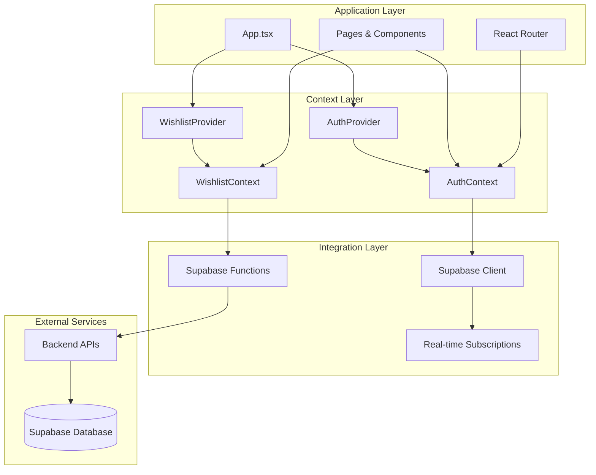
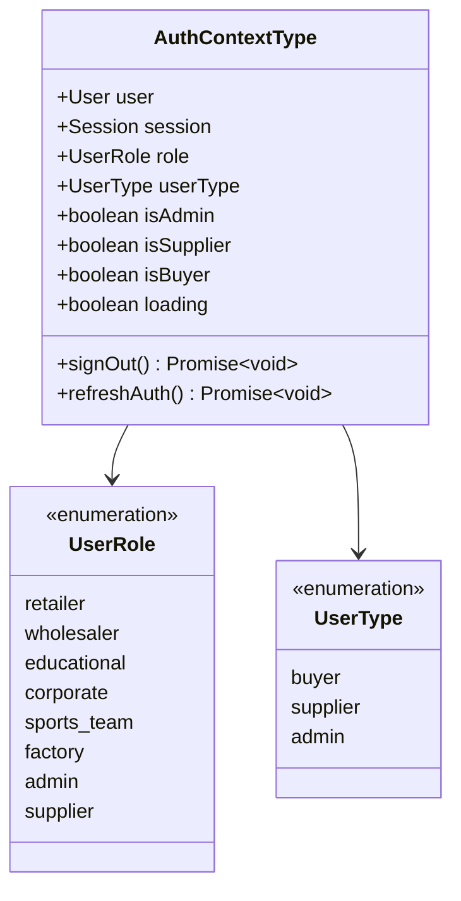
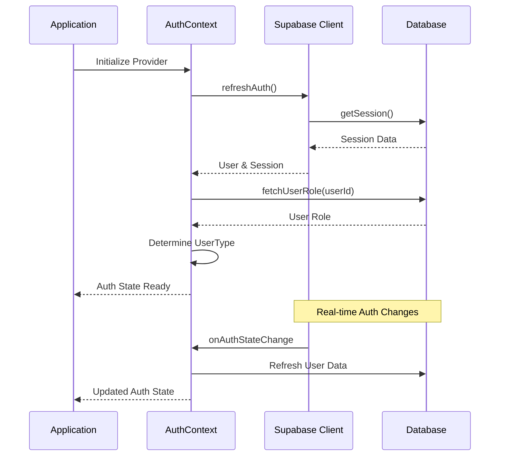
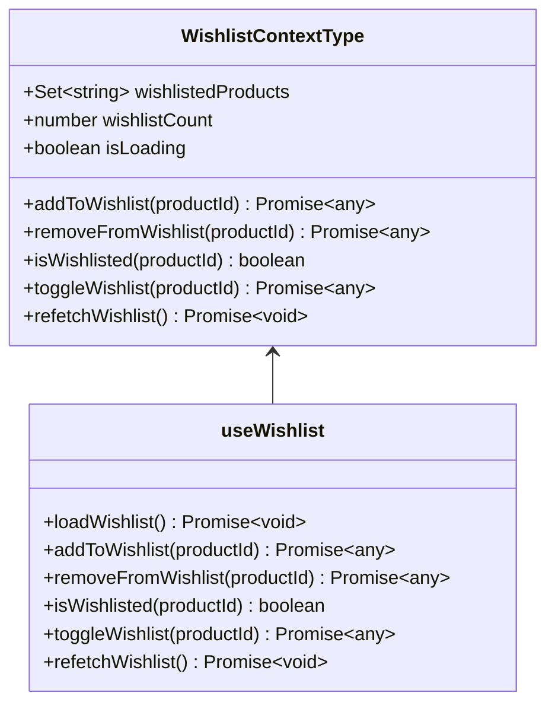
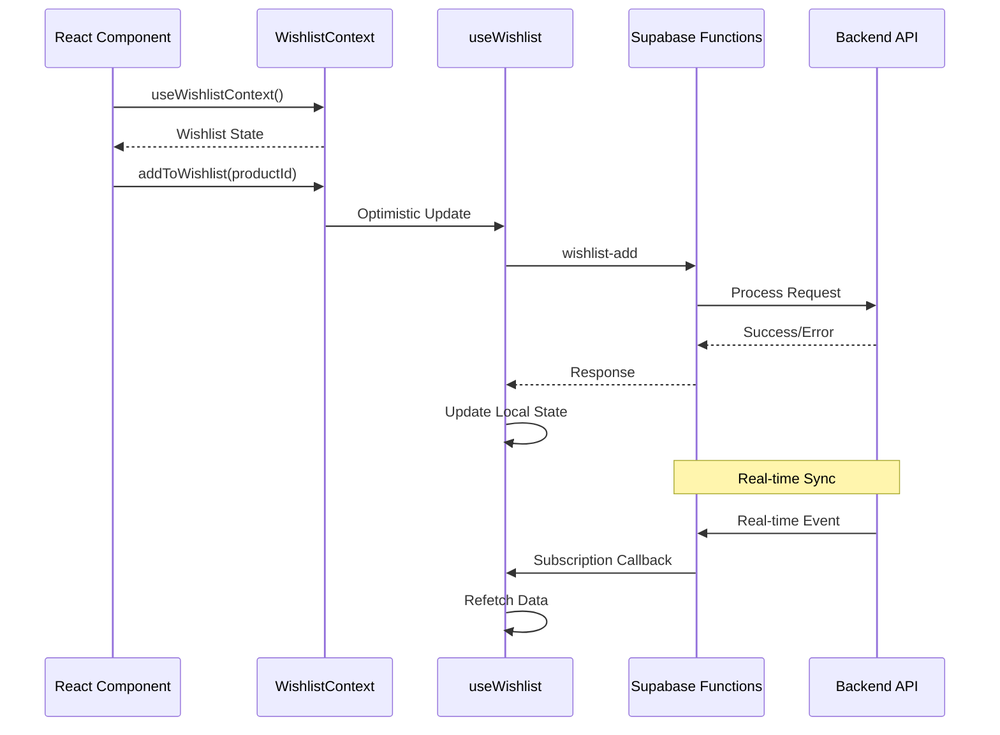
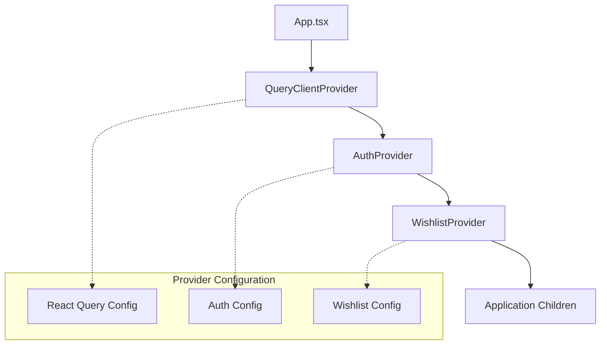
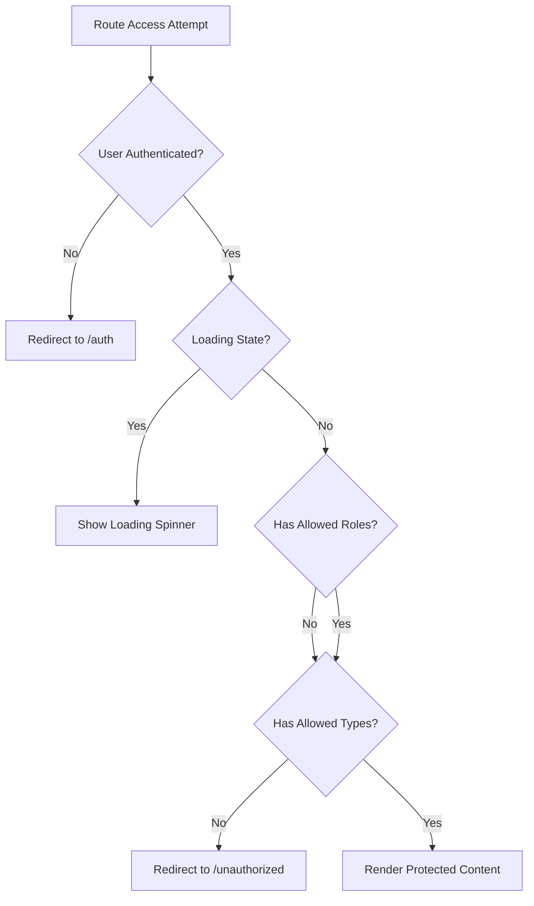
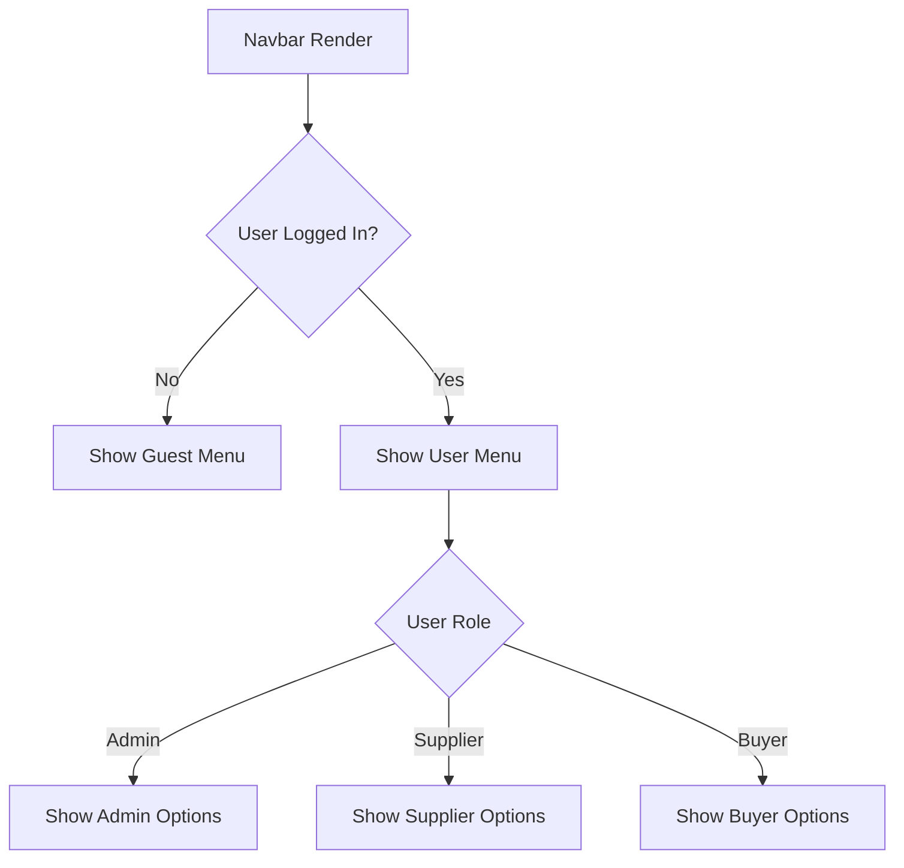
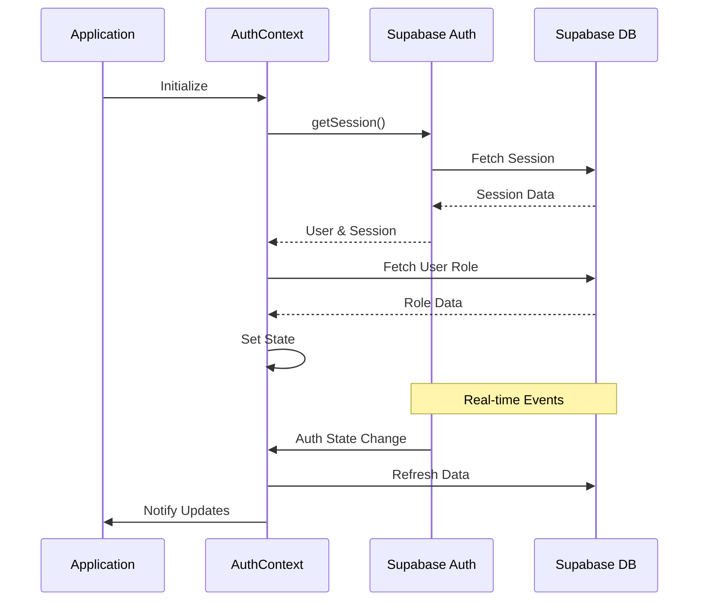

# Contexts and Global State Management

<cite>
**Referenced Files in This Document**
- [AuthContext.tsx](file://src/contexts/AuthContext.tsx)
- [WishlistContext.tsx](file://src/contexts/WishlistContext.tsx)
- [App.tsx](file://src/App.tsx)
- [RoleBasedRoute.tsx](file://src/components/routes/RoleBasedRoute.tsx)
- [Navbar.tsx](file://src/components/Navbar.tsx)
- [ProtectedRoute.tsx](file://src/components/routes/ProtectedRoute.tsx)
- [useWishlist.ts](file://src/hooks/useWishlist.ts)
- [client.ts](file://src/integrations/supabase/client.ts)
- [supabaseHelpers.ts](file://src/lib/supabaseHelpers.ts)
- [database.ts](file://src/types/database.ts)
</cite>

## Table of Contents
1. [Introduction](#introduction)
2. [Architecture Overview](#architecture-overview)
3. [AuthContext Implementation](#authcontext-implementation)
4. [WishlistContext Implementation](#wishlistcontext-implementation)
5. [Provider Setup and Integration](#provider-setup-and-integration)
6. [Consumer Patterns and Usage](#consumer-patterns-and-usage)
7. [React Query Integration](#react-query-integration)
8. [Performance Considerations](#performance-considerations)
9. [Common Pitfalls and Solutions](#common-pitfalls-and-solutions)
10. [Debugging Strategies](#debugging-strategies)
11. [Supabase Integration](#supabase-integration)
12. [Best Practices](#best-practices)

## Introduction

The Sleek Apparels application employs a sophisticated global state management system built around React Context API, combined with Supabase authentication and real-time capabilities. This system manages authentication state, user roles, session persistence, and product wishlist functionality across the entire application.

The context architecture provides type-safe, scalable state management with automatic synchronization between client-side state and Supabase backend services. It integrates seamlessly with React Router for protected routing and with React Query for data consistency and caching.

## Architecture Overview

The global state management system consists of two primary contexts that work together to provide comprehensive state management:



**Diagram sources**
- [App.tsx](file://src/App.tsx#L315-L355)
- [AuthContext.tsx](file://src/contexts/AuthContext.tsx#L40-L165)
- [WishlistContext.tsx](file://src/contexts/WishlistContext.tsx#L17-L24)

## AuthContext Implementation

The AuthContext provides comprehensive authentication state management with role-based access control and session persistence.

### Context Structure and Types

The AuthContext defines a comprehensive interface for authentication state:



**Diagram sources**
- [AuthContext.tsx](file://src/contexts/AuthContext.tsx#L17-L28)
- [AuthContext.tsx](file://src/contexts/AuthContext.tsx#L5-L13)

### Authentication State Management

The AuthContext implements sophisticated state management with automatic session handling:



**Diagram sources**
- [AuthContext.tsx](file://src/contexts/AuthContext.tsx#L121-L144)
- [client.ts](file://src/integrations/supabase/client.ts#L14-L20)

### Role-Based Access Control

The AuthContext implements intelligent role-based access control with automatic type deduction:

| Role | UserType | Description |
|------|----------|-------------|
| admin | admin | Full administrative privileges |
| supplier | supplier | Manufacturing and supply chain access |
| factory | supplier | Factory-specific manufacturing access |
| retailer | buyer | Retail purchasing capabilities |
| wholesaler | buyer | Wholesale purchasing capabilities |
| educational | buyer | Educational institution access |
| corporate | buyer | Corporate purchasing access |
| sports_team | buyer | Sports team purchasing access |

**Section sources**
- [AuthContext.tsx](file://src/contexts/AuthContext.tsx#L47-L66)
- [AuthContext.tsx](file://src/contexts/AuthContext.tsx#L67-L74)

## WishlistContext Implementation

The WishlistContext manages user product preferences with seamless Supabase synchronization.

### Context Interface and Functionality



**Diagram sources**
- [WishlistContext.tsx](file://src/contexts/WishlistContext.tsx#L4-L12)
- [useWishlist.ts](file://src/hooks/useWishlist.ts#L4-L131)

### Supabase Integration and Real-time Sync

The WishlistContext integrates with Supabase functions for persistent storage and real-time synchronization:



**Diagram sources**
- [useWishlist.ts](file://src/hooks/useWishlist.ts#L53-L78)
- [useWishlist.ts](file://src/hooks/useWishlist.ts#L81-L106)

**Section sources**
- [WishlistContext.tsx](file://src/contexts/WishlistContext.tsx#L1-L34)
- [useWishlist.ts](file://src/hooks/useWishlist.ts#L1-L132)

## Provider Setup and Integration

The App.tsx file demonstrates the comprehensive provider setup that establishes the global state foundation.

### Provider Hierarchy and Configuration



**Diagram sources**
- [App.tsx](file://src/App.tsx#L315-L355)

### React Query Integration

The application uses React Query for data consistency and caching with optimized configuration:

| Configuration | Value | Purpose |
|---------------|-------|---------|
| staleTime | 5 minutes | Data freshness threshold |
| gcTime | 10 minutes | Cache garbage collection time |
| refetchOnWindowFocus | false | Disable automatic refetch on focus |
| refetchOnReconnect | 'always' | Automatic refetch on network reconnect |
| structuralSharing | true | Enable memory optimization |

**Section sources**
- [App.tsx](file://src/App.tsx#L131-L148)

## Consumer Patterns and Usage

### Role-Based Route Protection

The RoleBasedRoute component demonstrates advanced context consumption for route protection:



**Diagram sources**
- [RoleBasedRoute.tsx](file://src/components/routes/RoleBasedRoute.tsx#L24-L58)

### Navbar Authentication State

The Navbar component showcases context usage for dynamic UI rendering:



**Diagram sources**
- [Navbar.tsx](file://src/components/Navbar.tsx#L129-L170)

**Section sources**
- [RoleBasedRoute.tsx](file://src/components/routes/RoleBasedRoute.tsx#L1-L60)
- [Navbar.tsx](file://src/components/Navbar.tsx#L129-L170)

## React Query Integration

The application leverages React Query for consistent data management alongside context state.

### Query Client Configuration

The React Query client is configured with performance optimizations:

```typescript
// Optimized React Query configuration
const queryClient = new QueryClient({
  defaultOptions: {
    queries: {
      retry: 1,
      staleTime: 5 * 60 * 1000, // 5 minutes
      gcTime: 10 * 60 * 1000, // 10 minutes
      refetchOnWindowFocus: false,
      refetchOnReconnect: 'always',
      refetchOnMount: true,
      structuralSharing: true,
    },
    mutations: {
      retry: 1,
      gcTime: 5 * 60 * 1000, // 5 minutes
    },
  },
});
```

### Data Consistency Patterns

The combination of React Query and Context ensures data consistency:

1. **Optimistic Updates**: Context state updates immediately
2. **Server Synchronization**: React Query handles server communication
3. **Conflict Resolution**: Automatic conflict resolution through query invalidation
4. **Offline Support**: Graceful degradation with cached data

**Section sources**
- [App.tsx](file://src/App.tsx#L131-L148)

## Performance Considerations

### Memoization Strategies

The context implementation incorporates several performance optimization techniques:

#### Context Value Memoization
```typescript
// AuthContext optimization
const value: AuthContextType = useMemo(() => ({
  user,
  session,
  role,
  userType,
  isAdmin,
  isSupplier,
  isBuyer,
  loading,
  signOut,
  refreshAuth,
}), [
  user, session, role, userType, 
  isAdmin, isSupplier, isBuyer, 
  loading, signOut, refreshAuth
]);
```

#### Hook Memoization
```typescript
// Wishlist hook optimization
const memoizedValue = useMemo(() => ({
  wishlistedProducts,
  wishlistCount,
  isLoading,
  addToWishlist,
  removeFromWishlist,
  isWishlisted,
  toggleWishlist,
  refetchWishlist,
}), [wishlistedProducts, wishlistCount, isLoading]);
```

### Memory Management

| Technique | Implementation | Benefit |
|-----------|----------------|---------|
| useCallback | Memoize callback functions | Prevent unnecessary re-renders |
| useMemo | Memoize derived values | Reduce computation overhead |
| useRef | Store mutable references | Avoid unnecessary state updates |
| Context Separation | Separate concerns | Minimize re-renders |

### Bundle Size Optimization

The context system contributes to efficient bundle sizes through:

1. **Tree Shaking**: Unused context consumers are eliminated
2. **Lazy Loading**: Context providers are loaded efficiently
3. **Minimal Dependencies**: Context consumers have minimal dependencies

## Common Pitfalls and Solutions

### Unnecessary Re-renders

**Problem**: Components re-rendering unnecessarily due to context changes.

**Solution**: Use appropriate memoization and selective context consumption:

```typescript
// Problematic - causes unnecessary re-renders
const { user, role } = useAuth();

// Solution - selective consumption
const { isAdmin } = useAuth(); // Only consume what's needed
```

### Context Provider Nesting Issues

**Problem**: Incorrect provider nesting causing context loss.

**Solution**: Ensure proper provider hierarchy in App.tsx:

```typescript
// Correct nesting order
<QueryClientProvider>
  <AuthProvider>
    <WishlistProvider>
      <RouterProvider />
    </WishlistProvider>
  </AuthProvider>
</QueryClientProvider>
```

### Race Conditions

**Problem**: Asynchronous operations causing inconsistent state.

**Solution**: Implement proper loading states and optimistic updates:

```typescript
// Safe asynchronous operation
const [isLoading, setIsLoading] = useState(false);
const [error, setError] = useState(null);

const handleAction = async () => {
  setIsLoading(true);
  setError(null);
  
  try {
    await performAsyncOperation();
  } catch (error) {
    setError(error);
    // Handle error appropriately
  } finally {
    setIsLoading(false);
  }
};
```

### Memory Leaks

**Problem**: Event listeners not being cleaned up.

**Solution**: Proper cleanup in useEffect hooks:

```typescript
useEffect(() => {
  const { data: { subscription } } = supabase.auth.onAuthStateChange(
    (event, session) => {
      // Handle auth state change
    }
  );
  
  return () => {
    subscription.unsubscribe();
  };
}, []);
```

## Debugging Strategies

### Context State Inspection

#### Development Tools Integration
```typescript
// Add to development builds only
if (process.env.NODE_ENV === 'development') {
  console.log('Auth Context State:', {
    user: auth.user,
    role: auth.role,
    userType: auth.userType,
    loading: auth.loading,
    isAdmin: auth.isAdmin,
    isSupplier: auth.isSupplier,
    isBuyer: auth.isBuyer,
  });
}
```

#### React DevTools Integration
```typescript
// Enable React DevTools profiling
const AuthProvider = React.memo(({ children }) => {
  // Provider implementation
});
```

### Error Tracking and Monitoring

#### Context Error Boundaries
```typescript
class ContextErrorBoundary extends React.Component {
  constructor(props) {
    super(props);
    this.state = { hasError: false };
  }

  static getDerivedStateFromError(error) {
    return { hasError: true };
  }

  componentDidCatch(error, errorInfo) {
    // Log error to monitoring service
    console.error('Context Error:', error, errorInfo);
  }

  render() {
    if (this.state.hasError) {
      return <div>Something went wrong with context.</div>;
    }
    return this.props.children;
  }
}
```

### Performance Monitoring

#### Context Update Tracking
```typescript
// Track context updates for performance analysis
const useDebugContext = (contextName, contextValue) => {
  const previousValue = useRef(contextValue);
  
  useEffect(() => {
    if (JSON.stringify(previousValue.current) !== JSON.stringify(contextValue)) {
      console.log(`${contextName} updated:`, contextValue);
      previousValue.current = contextValue;
    }
  }, [contextValue, contextName]);
};
```

## Supabase Integration

### Authentication Synchronization

The AuthContext maintains seamless synchronization with Supabase authentication:



**Diagram sources**
- [AuthContext.tsx](file://src/contexts/AuthContext.tsx#L121-L144)
- [client.ts](file://src/integrations/supabase/client.ts#L14-L20)

### Real-time Subscriptions

The context system leverages Supabase real-time capabilities:

#### Auth State Subscriptions
```typescript
// Automatic auth state synchronization
const { data: { subscription } } = supabase.auth.onAuthStateChange(
  async (event, session) => {
    // Update context state automatically
    setUser(session?.user || null);
    setSession(session);
    
    if (session?.user) {
      const userRole = await fetchUserRole(session.user.id);
      setRole(userRole);
      setUserType(determineUserType(userRole));
    } else {
      setRole(null);
      setUserType(null);
    }
    
    setLoading(false);
  }
);
```

#### Wishlist Real-time Sync
```typescript
// Wishlist synchronization with Supabase functions
const loadWishlist = async () => {
  try {
    const { data, error } = await supabase.functions.invoke('wishlist-get');
    if (data?.items) {
      const productIds = new Set(data.items.map(item => item.product_id));
      setWishlistedProducts(productIds);
      setWishlistCount(productIds.size);
    }
  } catch (error) {
    console.error('Error loading wishlist:', error);
  }
};
```

### Database Schema Integration

The context system aligns with the Supabase database schema:

| Table | Context Integration | Purpose |
|-------|-------------------|---------|
| user_roles | AuthContext | Role-based access control |
| profiles | AuthContext | User profile data |
| ai_quotes | Various | Quote management |
| orders | Various | Order processing |
| notifications | Various | User notifications |

**Section sources**
- [AuthContext.tsx](file://src/contexts/AuthContext.tsx#L121-L144)
- [useWishlist.ts](file://src/hooks/useWishlist.ts#L11-L35)
- [supabaseHelpers.ts](file://src/lib/supabaseHelpers.ts#L228-L255)

## Best Practices

### Context Design Principles

#### Single Responsibility
Each context should have a single, well-defined responsibility:

- **AuthContext**: Authentication and authorization state
- **WishlistContext**: Product wishlist management
- **Other Contexts**: Specific domain concerns

#### Immutable State Updates
Always treat context state as immutable:

```typescript
// Good - creating new objects
setUser(newUser);
setWishlistedProducts(prev => new Set([...prev, productId]));

// Bad - mutating existing objects
user.name = newName; // Don't do this
wishlistedProducts.add(productId); // Don't do this
```

#### Type Safety
Maintain strict type safety throughout the context system:

```typescript
// Strongly typed context interface
interface AuthContextType {
  user: User | null;
  session: Session | null;
  role: UserRole | null;
  userType: UserType | null;
  isAdmin: boolean;
  isSupplier: boolean;
  isBuyer: boolean;
  loading: boolean;
  signOut: () => Promise<void>;
  refreshAuth: () => Promise<void>;
}

// Usage with proper typing
const { user, role, isAdmin } = useAuth();
```

### Performance Guidelines

#### Selective Context Consumption
Only consume the specific context values your component needs:

```typescript
// Efficient - consuming only necessary values
const { user, loading } = useAuth();

// Less efficient - consuming entire context
const auth = useAuth();
```

#### Memoization Implementation
Use appropriate memoization techniques:

```typescript
// For complex derived values
const memoizedValue = useMemo(() => {
  return expensiveCalculation(authState);
}, [authState]);

// For callback functions
const handleLogout = useCallback(() => {
  signOut();
}, [signOut]);
```

### Error Handling Patterns

#### Graceful Degradation
Implement graceful error handling:

```typescript
// Safe error handling in context consumers
const { user, role, loading, error } = useAuth();

if (loading) {
  return <LoadingSpinner />;
}

if (error) {
  return <ErrorMessage error={error} />;
}

if (!user) {
  return <SignInPrompt />;
}
```

#### Retry Mechanisms
Implement retry logic for transient failures:

```typescript
const retryOperation = async (operation, maxRetries = 3) => {
  for (let i = 0; i < maxRetries; i++) {
    try {
      return await operation();
    } catch (error) {
      if (i === maxRetries - 1) throw error;
      await new Promise(resolve => setTimeout(resolve, 1000 * Math.pow(2, i)));
    }
  }
};
```

### Testing Strategies

#### Context Unit Testing
Test context providers and consumers independently:

```typescript
// Test AuthContext provider
describe('AuthContext', () => {
  it('provides authentication state', () => {
    const wrapper = ({ children }) => (
      <QueryClientProvider client={queryClient}>
        <AuthProvider>{children}</AuthProvider>
      </QueryClientProvider>
    );
    
    const { result } = renderHook(() => useAuth(), { wrapper });
    
    expect(result.current.loading).toBe(true);
    // Additional assertions...
  });
});
```

#### Integration Testing
Test context integration with components:

```typescript
// Test context with actual components
test('Navbar renders correctly based on auth state', async () => {
  const { findByText, queryByText } = render(
    <QueryClientProvider client={queryClient}>
      <AuthProvider>
        <WishlistProvider>
          <MemoryRouter>
            <Navbar />
          </MemoryRouter>
        </WishlistProvider>
      </AuthProvider>
    </QueryClientProvider>
  );
  
  // Wait for auth state to load
  await waitFor(() => expect(screen.getByTestId('navbar')).toBeInTheDocument());
  
  // Test with authenticated user
  // Test with unauthenticated user
  // Test with different roles
});
```

### Security Considerations

#### Privilege Escalation Prevention
Implement proper role-based access controls:

```typescript
// Role verification in components
const { isAdmin, isSupplier, isBuyer } = useAuth();

// Prevent unauthorized access
if (!isAdmin) {
  return <Navigate to="/unauthorized" />;
}

// Conditional rendering based on roles
const renderRoleSpecificContent = () => {
  if (isAdmin) return <AdminPanel />;
  if (isSupplier) return <SupplierDashboard />;
  if (isBuyer) return <BuyerDashboard />;
};
```

#### Secure State Management
Ensure sensitive data is handled securely:

```typescript
// Protect sensitive context values
const secureContextValue = useMemo(() => ({
  user: user ? { ...user, email: user.email } : null,
  role,
  userType,
  isAdmin,
  isSupplier,
  isBuyer,
  loading,
  signOut,
  refreshAuth,
}), [user, role, userType, isAdmin, isSupplier, isBuyer, loading, signOut, refreshAuth]);
```

This comprehensive context system provides a robust foundation for global state management in the Sleek Apparels application, combining React Context API with Supabase authentication and real-time capabilities for a seamless user experience.