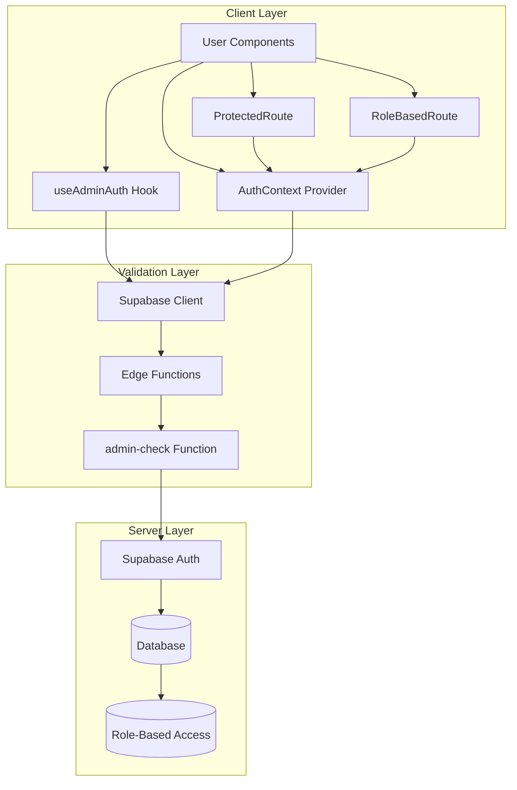
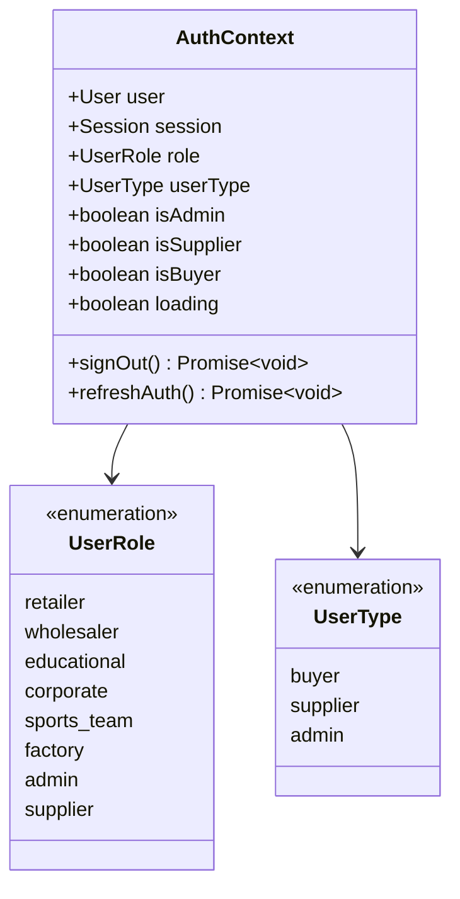
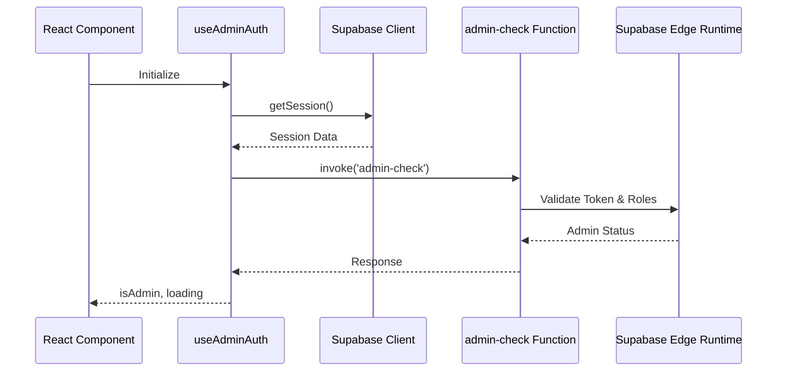
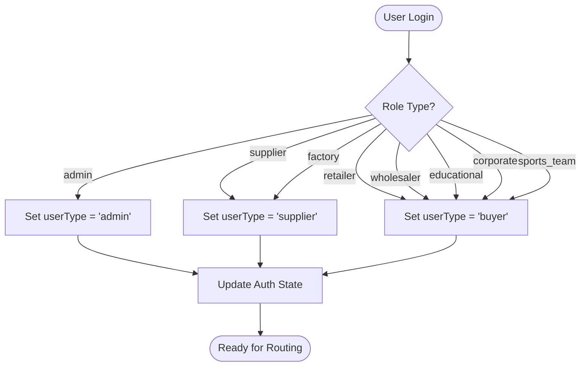
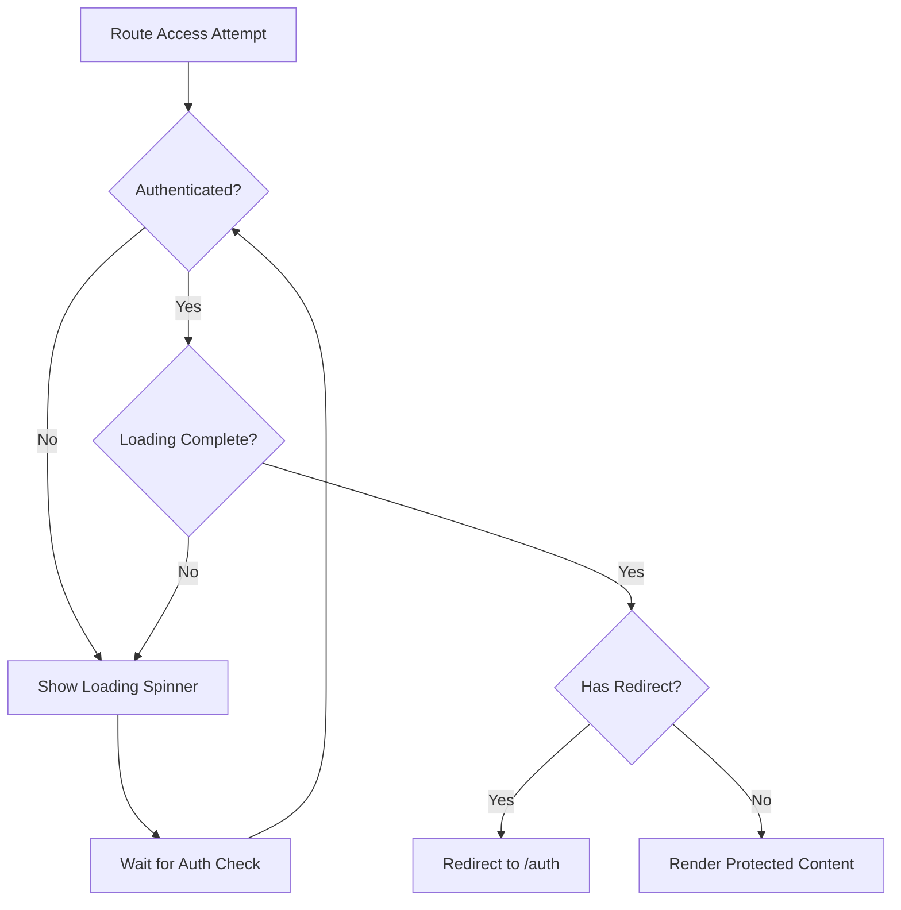
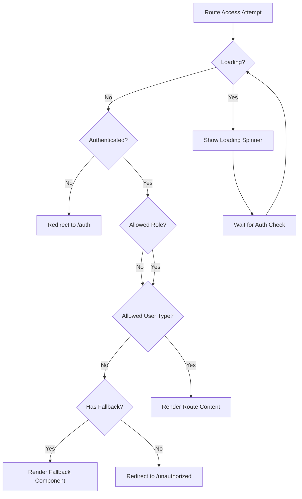
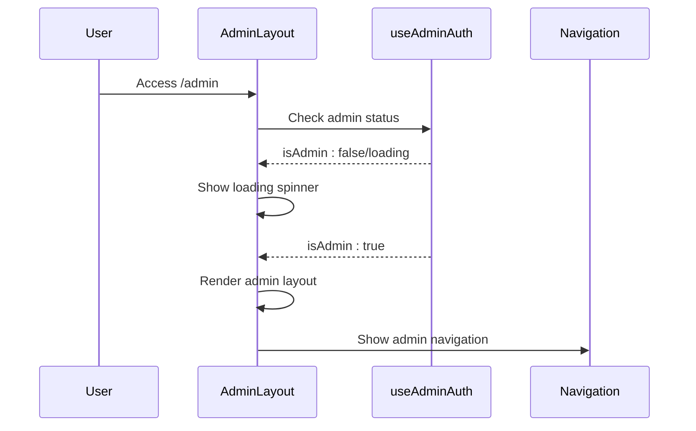
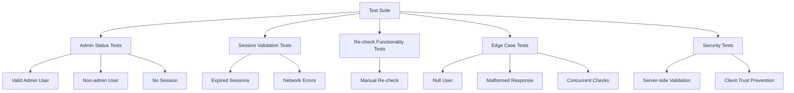
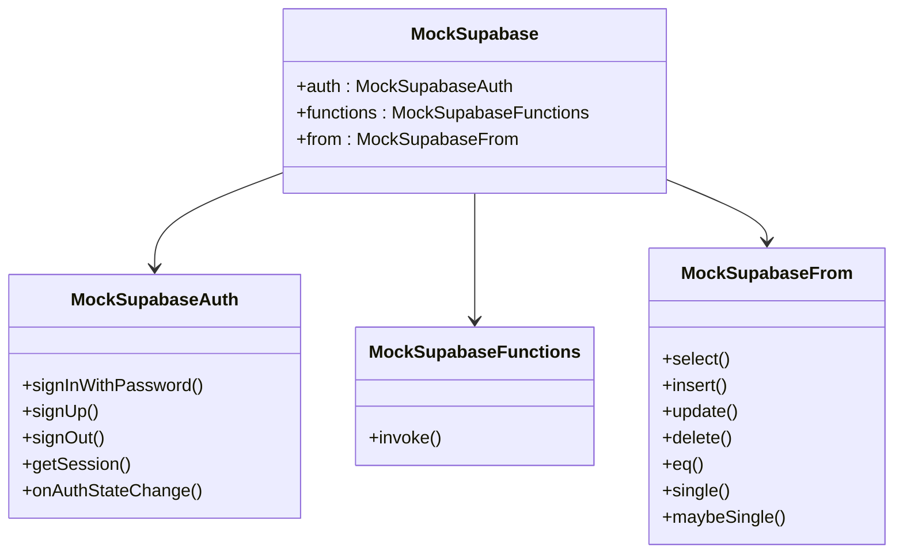
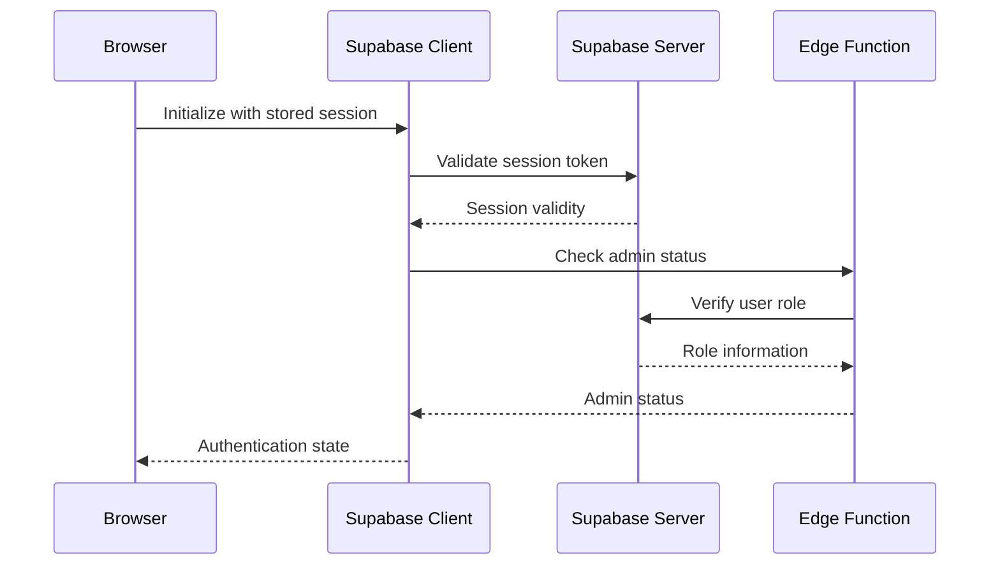

# Authentication and Role-Based State Management

<cite>
**Referenced Files in This Document**
- [useAdminAuth.ts](file://src/hooks/useAdminAuth.ts)
- [AuthContext.tsx](file://src/contexts/AuthContext.tsx)
- [ProtectedRoute.tsx](file://src/components/routes/ProtectedRoute.tsx)
- [RoleBasedRoute.tsx](file://src/components/routes/RoleBasedRoute.tsx)
- [AdminLayout.tsx](file://src/pages/admin/AdminLayout.tsx)
- [ModernAdminDashboard.tsx](file://src/pages/ModernAdminDashboard.tsx)
- [ModernSupplierDashboard.tsx](file://src/pages/ModernSupplierDashboard.tsx)
- [useAdminAuth.test.ts](file://src/hooks/__tests__/useAdminAuth.test.ts)
- [Auth.test.tsx](file://src/pages/__tests__/Auth.test.tsx)
- [client.ts](file://src/integrations/supabase/client.ts)
- [supabase.ts](file://src/test/mocks/supabase.ts)
- [App.tsx](file://src/App.tsx)
- [index.ts](file://supabase/functions/admin-check/index.ts)
</cite>

## Table of Contents
1. [Introduction](#introduction)
2. [System Architecture](#system-architecture)
3. [Core Authentication Components](#core-authentication-components)
4. [Role-Based Access Control](#role-based-access-control)
5. [Route Protection Mechanisms](#route-protection-mechanisms)
6. [UI Rendering with Role Gating](#ui-rendering-with-role-gating)
7. [Testing Strategies](#testing-strategies)
8. [Security Considerations](#security-considerations)
9. [Common Issues and Solutions](#common-issues-and-solutions)
10. [Best Practices](#best-practices)

## Introduction

The Sleek Apparels authentication system provides comprehensive role-based access control (RBAC) for managing different user types including admins, buyers, and suppliers. The system integrates seamlessly with Supabase for authentication and implements multiple layers of security to protect sensitive administrative functions and user-specific content.

The authentication architecture consists of three main components:
- **AuthContext**: Centralized authentication state management
- **useAdminAuth**: Specialized hook for admin role validation
- **Route Protection**: ProtectedRoute and RoleBasedRoute components for secure navigation

## System Architecture

The authentication system follows a layered architecture that separates concerns between client-side state management, server-side validation, and UI protection mechanisms.

**Diagram sources**
- [useAdminAuth.ts](file://src/hooks/useAdminAuth.ts#L1-L47)
- [AuthContext.tsx](file://src/contexts/AuthContext.tsx#L1-L166)
- [ProtectedRoute.tsx](file://src/components/routes/ProtectedRoute.tsx#L1-L36)
- [RoleBasedRoute.tsx](file://src/components/routes/RoleBasedRoute.tsx#L1-L60)

## Core Authentication Components

### AuthContext Implementation

The AuthContext serves as the central hub for authentication state management, providing reactive access to user information, roles, and authentication status across the entire application.

**Diagram sources**
- [AuthContext.tsx](file://src/contexts/AuthContext.tsx#L5-L16)

The AuthContext provides several key capabilities:

- **Automatic Session Management**: Monitors authentication state changes and updates user roles dynamically
- **Role Resolution**: Converts raw user roles into logical user types (buyer, supplier, admin)
- **Secure State Updates**: Ensures authentication state changes trigger appropriate UI updates
- **Error Handling**: Provides graceful degradation when authentication fails

**Section sources**
- [AuthContext.tsx](file://src/contexts/AuthContext.tsx#L40-L166)

### useAdminAuth Hook

The useAdminAuth hook provides specialized functionality for admin role validation with server-side confirmation and caching mechanisms.

**Diagram sources**
- [useAdminAuth.ts](file://src/hooks/useAdminAuth.ts#L14-L42)
- [index.ts](file://supabase/functions/admin-check/index.ts#L44-L73)

The hook implements several important features:

- **Server-Side Validation**: Uses Supabase Edge Functions for secure admin role verification
- **Token-Based Authentication**: Leverages JWT tokens for secure server communication
- **Error Resilience**: Handles network failures and invalid sessions gracefully
- **Loading States**: Provides appropriate loading indicators during authentication checks

**Section sources**
- [useAdminAuth.ts](file://src/hooks/useAdminAuth.ts#L5-L47)

## Role-Based Access Control

### User Role Classification

The system implements a hierarchical role structure that determines user capabilities and access permissions:

| Role Type | Description | Access Level | UI Components |
|-----------|-------------|--------------|---------------|
| `admin` | System administrators | Full access | Admin dashboards, system management |
| `supplier` | Product suppliers | Supplier-specific features | Supplier dashboards, product management |
| `factory` | Manufacturing facilities | Supplier equivalent | Same as supplier |
| `retailer` | Retail businesses | Buyer features | Buyer dashboards, order management |
| `wholesaler` | Wholesale distributors | Buyer features | Same as retailer |
| `educational` | Educational institutions | Buyer features | Same as retailer |
| `corporate` | Corporate buyers | Buyer features | Same as retailer |
| `sports_team` | Sports team buyers | Buyer features | Same as retailer |

### Role Determination Logic

The system converts raw roles into logical user types for simplified route protection:

**Diagram sources**
- [AuthContext.tsx](file://src/contexts/AuthContext.tsx#L67-L74)

**Section sources**
- [AuthContext.tsx](file://src/contexts/AuthContext.tsx#L67-L74)

## Route Protection Mechanisms

### ProtectedRoute Component

The ProtectedRoute component ensures that only authenticated users can access protected areas of the application.

**Diagram sources**
- [ProtectedRoute.tsx](file://src/components/routes/ProtectedRoute.tsx#L14-L35)

### RoleBasedRoute Component

The RoleBasedRoute provides granular access control based on user roles and user types.

**Diagram sources**
- [RoleBasedRoute.tsx](file://src/components/routes/RoleBasedRoute.tsx#L17-L59)

### Route Configuration Examples

The application uses the following route protection patterns:

| Route Pattern | Protection Type | Allowed Roles | Purpose |
|---------------|-----------------|---------------|---------|
| `/dashboard` | Role-based | `['buyer']` | Buyer dashboard access |
| `/supplier-dashboard` | Role-based | `['supplier']` | Supplier dashboard access |
| `/admin` | Role-based | `['admin']` | Admin panel access |
| `/admin/*` | Role-based | `['admin']` | Admin sub-routes |
| `/dashboard-router` | Protected | Any authenticated user | General dashboard access |

**Section sources**
- [RoleBasedRoute.tsx](file://src/components/routes/RoleBasedRoute.tsx#L17-L59)
- [App.tsx](file://src/App.tsx#L213-L242)

## UI Rendering with Role Gating

### Admin Dashboard Implementation

The AdminLayout component demonstrates role gating in practice, ensuring only authorized admins can access the administration interface.

**Diagram sources**
- [AdminLayout.tsx](file://src/pages/admin/AdminLayout.tsx#L9-L44)
- [ModernAdminDashboard.tsx](file://src/pages/ModernAdminDashboard.tsx#L123-L153)

### Supplier Dashboard Features

The supplier dashboard showcases role-based UI rendering with dynamic content based on user capabilities and performance metrics.

**Section sources**
- [AdminLayout.tsx](file://src/pages/admin/AdminLayout.tsx#L9-L44)
- [ModernAdminDashboard.tsx](file://src/pages/ModernAdminDashboard.tsx#L123-L153)
- [ModernSupplierDashboard.tsx](file://src/pages/ModernSupplierDashboard.tsx#L98-L110)

## Testing Strategies

### useAdminAuth Testing Approach

The useAdminAuth hook includes comprehensive test coverage using Supabase mock implementations and Vitest for reliable testing.

**Diagram sources**
- [useAdminAuth.test.ts](file://src/hooks/__tests__/useAdminAuth.test.ts#L20-L381)

### Test Coverage Areas

The testing strategy covers multiple scenarios to ensure robust authentication behavior:

- **Successful Admin Validation**: Tests positive admin scenarios with proper token handling
- **Authentication Failures**: Validates error handling for invalid sessions and network issues
- **Role Transition Testing**: Ensures smooth transitions between different user roles
- **Security Validation**: Confirms server-side validation prevents client-side tampering
- **Edge Case Handling**: Tests boundary conditions and unexpected input scenarios

**Section sources**
- [useAdminAuth.test.ts](file://src/hooks/__tests__/useAdminAuth.test.ts#L20-L381)

### Mock Implementation Strategy

The test suite uses sophisticated mocking to isolate authentication logic from external dependencies:

**Diagram sources**
- [supabase.ts](file://src/test/mocks/supabase.ts#L1-L38)

**Section sources**
- [supabase.ts](file://src/test/mocks/supabase.ts#L1-L38)

## Security Considerations

### Token Handling Security

The authentication system implements several security measures to protect against common vulnerabilities:

- **Server-Side Validation**: Admin status is verified on the server using Supabase Edge Functions
- **Token Expiration**: Automatic token refresh prevents session timeouts
- **Secure Storage**: Tokens are stored securely in localStorage with encryption
- **Cross-Site Request Forgery (CSRF) Protection**: Implemented through Supabase's built-in CSRF protection

### Session Persistence

The system maintains secure session persistence with automatic refresh capabilities:

**Diagram sources**
- [client.ts](file://src/integrations/supabase/client.ts#L14-L20)
- [index.ts](file://supabase/functions/admin-check/index.ts#L44-L73)

### Edge Function Security

The admin-check Edge Function implements additional security layers:

- **Role Verification**: Direct database query to confirm admin status
- **Error Handling**: Graceful failure with minimal information leakage
- **CORS Protection**: Proper CORS headers prevent cross-origin attacks
- **Rate Limiting**: Built-in Supabase rate limiting protects against abuse

**Section sources**
- [client.ts](file://src/integrations/supabase/client.ts#L14-L20)
- [index.ts](file://supabase/functions/admin-check/index.ts#L44-L73)

## Common Issues and Solutions

### Authentication State Synchronization

**Issue**: Inconsistent authentication state across components
**Solution**: Use AuthContext for centralized state management and ensure all components consume the context properly

**Issue**: Race conditions during initial authentication
**Solution**: Implement loading states and wait for authentication completion before rendering protected content

### Role Validation Failures

**Issue**: Admin status not updating after role changes
**Solution**: Implement manual re-validation using the `checkAdminStatus` method from useAdminAuth

**Issue**: Server-side validation bypass attempts
**Solution**: Always rely on server-side validation and never trust client-side role flags

### Performance Optimization

**Issue**: Slow authentication checks impacting user experience
**Solution**: Implement caching mechanisms and optimize Edge Function execution time

**Issue**: Multiple simultaneous authentication checks
**Solution**: Use debouncing and request deduplication to prevent unnecessary API calls

## Best Practices

### Authentication Hook Usage

1. **Centralized State Management**: Always use AuthContext for authentication state rather than local component state
2. **Graceful Degradation**: Implement proper loading states and error boundaries
3. **Security First**: Never trust client-side authentication state for security decisions
4. **Performance Awareness**: Minimize authentication checks and implement caching where appropriate

### Route Protection Implementation

1. **Layered Protection**: Combine ProtectedRoute with RoleBasedRoute for comprehensive security
2. **Fallback Handling**: Provide meaningful fallback components for unauthorized access
3. **SEO Considerations**: Ensure proper meta tags and canonical URLs for protected routes
4. **Testing Coverage**: Maintain comprehensive test coverage for all authentication scenarios

### Development Guidelines

1. **Mock Consistency**: Use consistent mocking strategies across all authentication-related tests
2. **Error Handling**: Implement comprehensive error handling for all authentication operations
3. **Documentation**: Document authentication flows and security considerations clearly
4. **Monitoring**: Implement logging and monitoring for authentication events and failures