# Conversation and Real-Time Communication

<cite>
**Referenced Files in This Document**
- [useConversation.ts](file://src/hooks/useConversation.ts)
- [useRealtimeMessages.ts](file://src/hooks/useRealtimeMessages.ts)
- [AIAssistantChat.tsx](file://src/components/AIAssistantChat.tsx)
- [OrderMessaging.tsx](file://src/components/supplier/OrderMessaging.tsx)
- [AIQuoteGenerator.tsx](file://src/components/AIQuoteGenerator.tsx)
- [conversational-assistant/index.ts](file://supabase/functions/conversational-assistant/index.ts)
- [submit-quote/index.ts](file://supabase/functions/submit-quote/index.ts)
- [client.ts](file://src/integrations/supabase/client.ts)
- [aiQuote.ts](file://src/lib/api/aiQuote.ts)
- [CommunicationCenter.tsx](file://src/components/shared/CommunicationCenter.tsx)
</cite>

## Table of Contents
1. [Introduction](#introduction)
2. [System Architecture](#system-architecture)
3. [Core Components](#core-components)
4. [WebSocket Integration with Supabase Realtime](#websocket-integration-with-supabase-realtime)
5. [Message State Management](#message-state-management)
6. [AI Conversation System](#ai-conversation-system)
7. [Real-Time Messaging](#real-time-messaging)
8. [Conversational Quote Building](#conversational-quote-building)
9. [Error Recovery and Offline Handling](#error-recovery-and-offline-handling)
10. [Security Considerations](#security-considerations)
11. [Integration Patterns](#integration-patterns)
12. [Performance Optimization](#performance-optimization)
13. [Troubleshooting Guide](#troubleshooting-guide)

## Introduction

The Sleek Apparels conversation and real-time communication system forms the backbone of buyer-supplier interactions, enabling seamless AI-powered quote generation, instant messaging, and collaborative order management. Built on Supabase's Realtime capabilities and enhanced with custom Edge Functions, this system provides instant message delivery, persistent conversation history, and sophisticated AI-driven assistance.

The system encompasses multiple communication channels:
- **AI Assistant Chat**: Intelligent conversational interface for quote building
- **Order Messaging**: Direct supplier-buyer communication during production
- **Real-Time Notifications**: Instant updates across the platform
- **Quote Generation**: AI-powered pricing with historical context

## System Architecture

The conversation system follows a layered architecture that separates concerns between frontend state management, backend processing, and real-time communication:

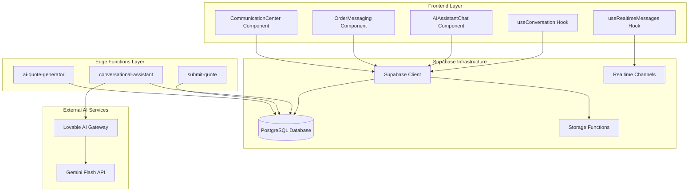

**Diagram sources**
- [useConversation.ts](file://src/hooks/useConversation.ts#L32-L177)
- [useRealtimeMessages.ts](file://src/hooks/useRealtimeMessages.ts#L17-L61)
- [conversational-assistant/index.ts](file://supabase/functions/conversational-assistant/index.ts#L22-L388)

## Core Components

### Message Data Structures

The system defines several key message interfaces that ensure type safety and consistent data handling:

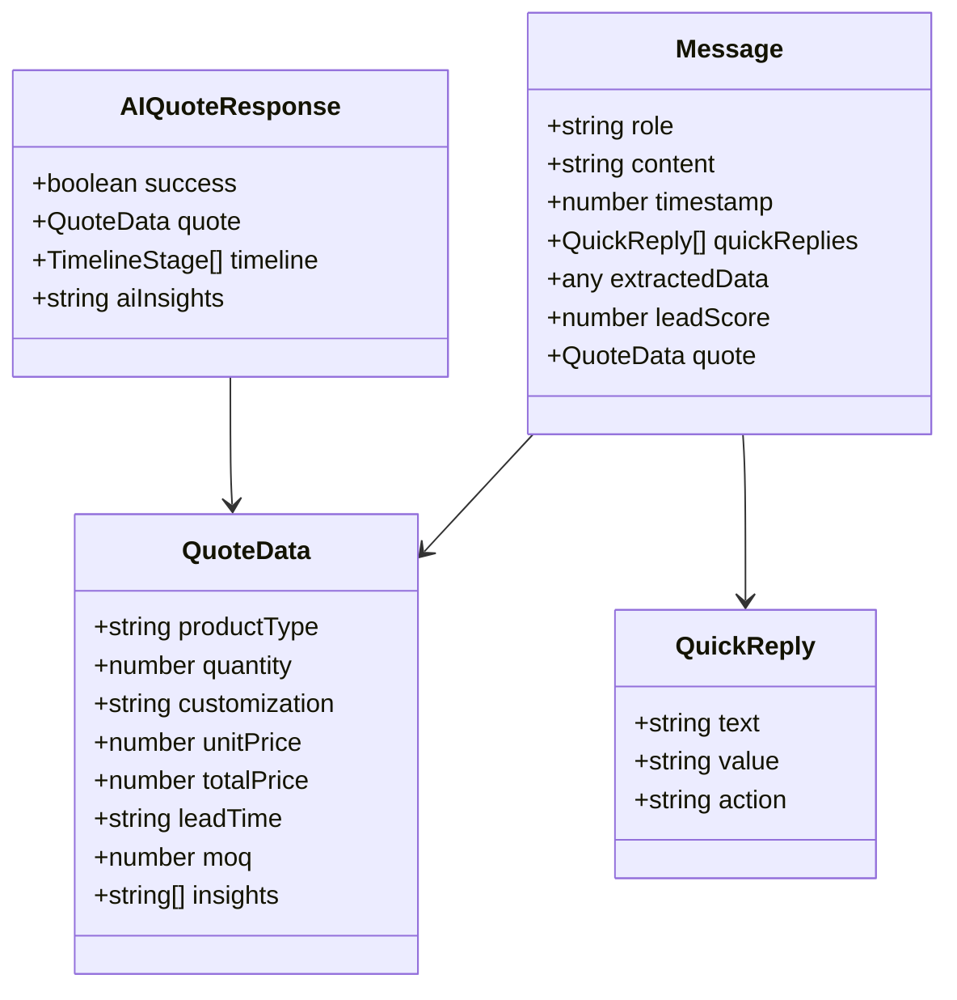

**Diagram sources**
- [useConversation.ts](file://src/hooks/useConversation.ts#L5-L30)
- [AIQuoteGenerator.tsx](file://src/components/AIQuoteGenerator.tsx#L29-L64)

**Section sources**
- [useConversation.ts](file://src/hooks/useConversation.ts#L5-L30)
- [AIQuoteGenerator.tsx](file://src/components/AIQuoteGenerator.tsx#L29-L64)

### Hook-Based State Management

The system employs custom React hooks for centralized state management and side effects:

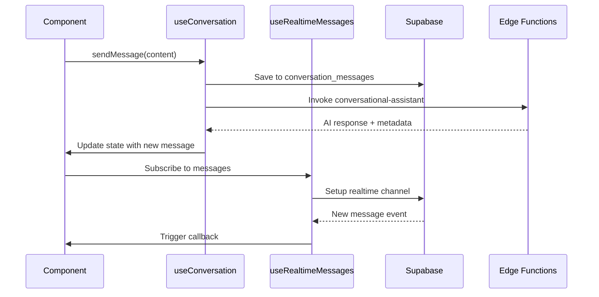

**Diagram sources**
- [useConversation.ts](file://src/hooks/useConversation.ts#L64-L150)
- [useRealtimeMessages.ts](file://src/hooks/useRealtimeMessages.ts#L17-L61)

**Section sources**
- [useConversation.ts](file://src/hooks/useConversation.ts#L32-L177)
- [useRealtimeMessages.ts](file://src/hooks/useRealtimeMessages.ts#L17-L61)

## WebSocket Integration with Supabase Realtime

### Realtime Channel Management

Supabase's Realtime functionality enables instant message delivery through WebSocket connections. The system creates dedicated channels for different communication scenarios:

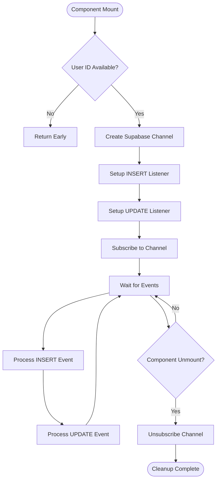

**Diagram sources**
- [useRealtimeMessages.ts](file://src/hooks/useRealtimeMessages.ts#L20-L58)

### Channel Configuration Patterns

The system implements different channel configurations based on the communication context:

| Channel Type | Purpose | Filter Criteria | Event Types |
|--------------|---------|-----------------|-------------|
| `realtime-messages` | General messaging | `recipient_id=eq.{userId}` | INSERT, UPDATE |
| `messages-sent` | Outgoing messages | `sender_id=eq.{userId}` | ALL |
| `messages-received` | Incoming messages | `recipient_id=eq.{userId}` | ALL |
| `order_messages_{orderId}` | Order-specific chat | `order_id=eq.{orderId}` | INSERT |
| `order_messages:{orderId}` | Order message updates | `order_id=eq.{orderId}` | INSERT |

**Section sources**
- [useRealtimeMessages.ts](file://src/hooks/useRealtimeMessages.ts#L23-L58)
- [CommunicationCenter.tsx](file://src/components/shared/CommunicationCenter.tsx#L51-L75)

## Message State Management

### Conversation Persistence

The system maintains conversation state across browser sessions using localStorage with automatic synchronization:

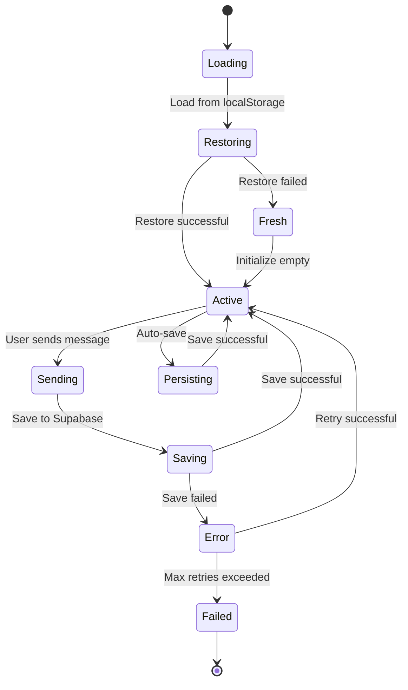

**Diagram sources**
- [useConversation.ts](file://src/hooks/useConversation.ts#L40-L62)

### Message Lifecycle Management

Each message follows a comprehensive lifecycle that ensures reliability and consistency:

```mermaid
flowchart LR
UserInput[User Input] --> Validate[Validate Message]
Validate --> LocalSave[Local State Update]
LocalSave --> DBSave[Database Persistence]
DBSave --> AIService[AI Service Call]
AIService --> Response[AI Response]
Response --> StateUpdate[State Update]
StateUpdate --> RealtimeNotify[Realtime Notification]
RealtimeNotify --> Complete[Complete]
```

**Diagram sources**
- [useConversation.ts](file://src/hooks/useConversation.ts#L64-L150)

**Section sources**
- [useConversation.ts](file://src/hooks/useConversation.ts#L40-L62)
- [useConversation.ts](file://src/hooks/useConversation.ts#L64-L150)

## AI Conversation System

### Conversational Assistant Architecture

The AI conversation system implements a sophisticated state machine that guides users through the quote generation process:

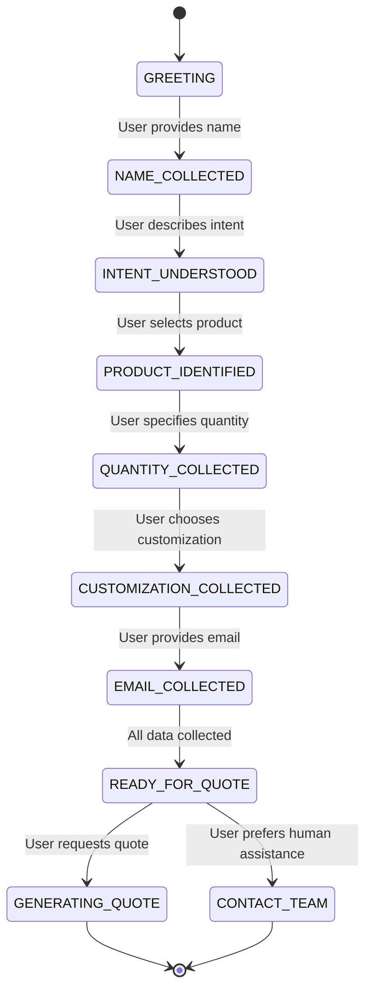

**Diagram sources**
- [conversational-assistant/index.ts](file://supabase/functions/conversational-assistant/index.ts#L168-L176)

### AI Response Generation

The conversational assistant leverages Lovable AI with Gemini Flash to provide context-aware responses:

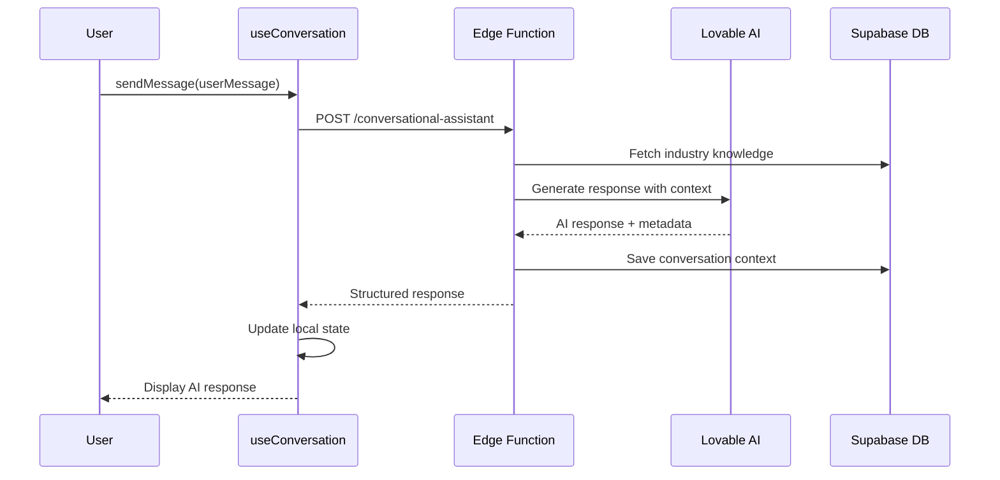

**Diagram sources**
- [conversational-assistant/index.ts](file://supabase/functions/conversational-assistant/index.ts#L254-L278)
- [useConversation.ts](file://src/hooks/useConversation.ts#L64-L150)

### Quick Reply Generation

The system automatically generates contextual quick replies based on the current conversation state:

| State | Quick Replies | Purpose |
|-------|---------------|---------|
| GREETING | User's name | Collect identity |
| NAME_COLLECTED | Product categories | Guide product selection |
| PRODUCT_IDENTIFIED | Quantity ranges | Specify order size |
| QUANTITY_COLLECTED | Customization options | Define design requirements |
| CUSTOMIZATION_COLLECTED | Email collection | Contact information |
| EMAIL_COLLECTED | Final actions | Next steps |

**Section sources**
- [conversational-assistant/index.ts](file://supabase/functions/conversational-assistant/index.ts#L407-L481)
- [useConversation.ts](file://src/hooks/useConversation.ts#L102-L107)

## Real-Time Messaging

### Order-Specific Communication

The Order Messaging component enables direct communication between buyers and suppliers during production:

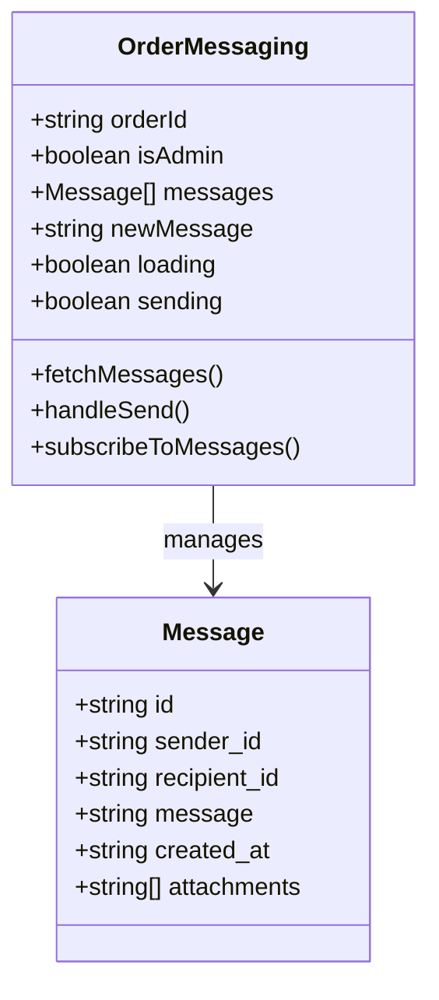

**Diagram sources**
- [OrderMessaging.tsx](file://src/components/supplier/OrderMessaging.tsx#L11-L16)

### Realtime Subscription Management

The system implements robust subscription management with automatic cleanup:

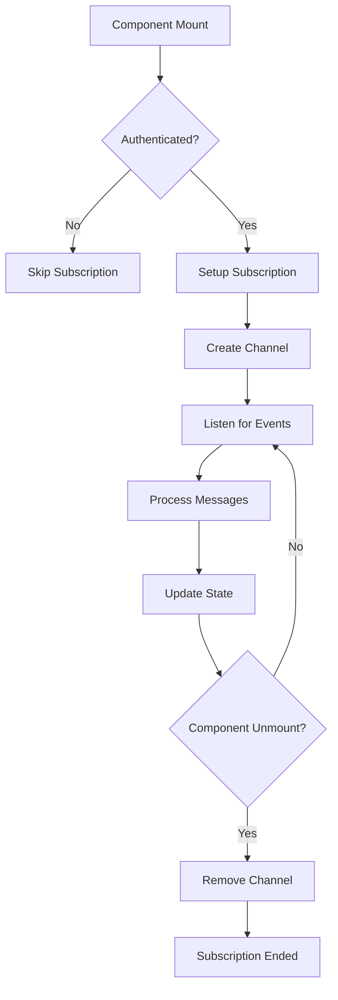

**Diagram sources**
- [OrderMessaging.tsx](file://src/components/supplier/OrderMessaging.tsx#L22-L35)

**Section sources**
- [OrderMessaging.tsx](file://src/components/supplier/OrderMessaging.tsx#L16-L136)
- [useRealtimeMessages.ts](file://src/hooks/useRealtimeMessages.ts#L17-L61)

## Conversational Quote Building

### AI Quote Generation Pipeline

The AI Quote Generator combines user input with historical data and market intelligence to produce instant pricing:

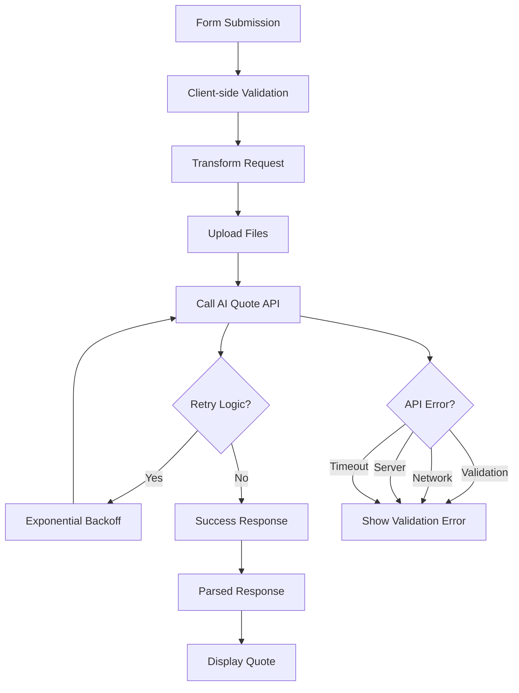

**Diagram sources**
- [AIQuoteGenerator.tsx](file://src/components/AIQuoteGenerator.tsx#L123-L234)
- [aiQuote.ts](file://src/lib/api/aiQuote.ts#L49-L146)

### Quote Data Structure

The system maintains comprehensive quote data with detailed breakdowns:

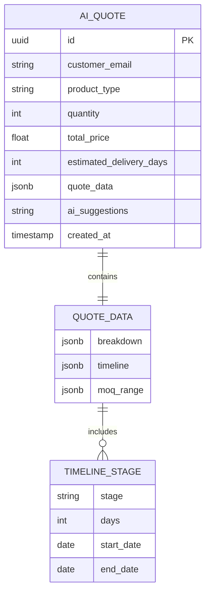

**Diagram sources**
- [AIQuoteGenerator.tsx](file://src/components/AIQuoteGenerator.tsx#L29-L64)

**Section sources**
- [AIQuoteGenerator.tsx](file://src/components/AIQuoteGenerator.tsx#L66-L575)
- [aiQuote.ts](file://src/lib/api/aiQuote.ts#L49-L274)

## Error Recovery and Offline Handling

### Comprehensive Error Handling

The system implements multiple layers of error handling and recovery mechanisms:

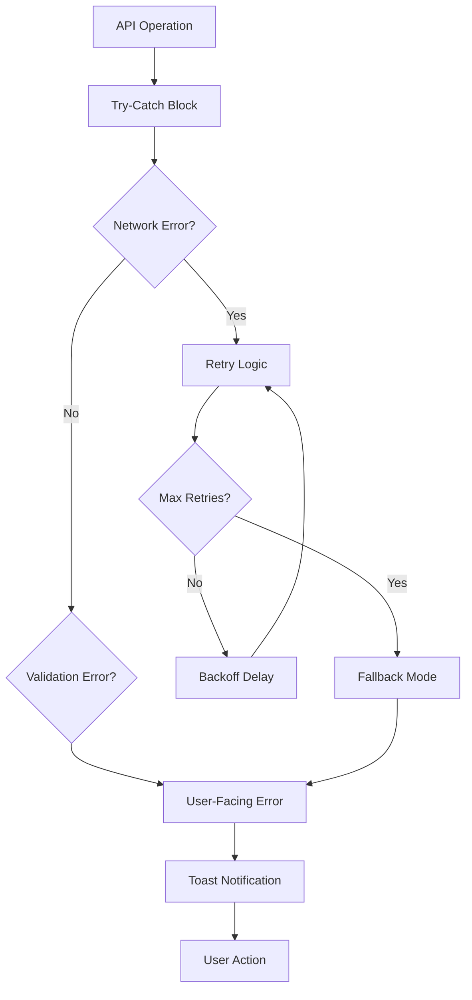

**Diagram sources**
- [useConversation.ts](file://src/hooks/useConversation.ts#L121-L147)
- [aiQuote.ts](file://src/lib/api/aiQuote.ts#L117-L146)

### Offline Message Queuing

The system maintains message queues for offline scenarios:

| Queue Type | Purpose | Persistence | Retry Strategy |
|------------|---------|-------------|----------------|
| Local Storage | Conversation history | Browser storage | Session-based |
| Supabase Queue | Database sync | Server-side | Automatic retry |
| Realtime Buffer | Live updates | Memory | Connection-based |
| File Upload Queue | Attachments | Memory | Manual retry |

**Section sources**
- [useConversation.ts](file://src/hooks/useConversation.ts#L121-L147)
- [aiQuote.ts](file://src/lib/api/aiQuote.ts#L62-L146)

## Security Considerations

### Message Content Security

The system implements multiple security measures to protect sensitive communication:

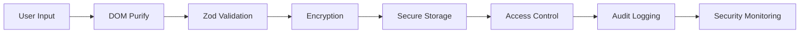

**Diagram sources**
- [AIAssistantChat.tsx](file://src/components/AIAssistantChat.tsx#L158-L185)

### Authentication and Authorization

The system enforces strict access controls across different communication channels:

| Component | Authentication | Authorization | Access Level |
|-----------|----------------|---------------|--------------|
| AI Assistant | Optional | Public | Read/Write |
| Order Messaging | Required | Role-based | Buyer/Supplier/Admin |
| Quote Requests | Optional | Session-based | Read/Write |
| Admin Communication | Required | Admin-only | Full Access |

### Data Protection Measures

The system implements comprehensive data protection:

- **Content Sanitization**: Prevents XSS attacks in message display
- **Input Validation**: Zod-based schema validation for all inputs
- **Rate Limiting**: Prevents abuse across all endpoints
- **CORS Protection**: Secure cross-origin requests
- **Attachment Security**: Encrypted file storage and access control

**Section sources**
- [AIAssistantChat.tsx](file://src/components/AIAssistantChat.tsx#L158-L185)
- [conversational-assistant/index.ts](file://supabase/functions/conversational-assistant/index.ts#L44-L114)
- [submit-quote/index.ts](file://supabase/functions/submit-quote/index.ts#L44-L114)

## Integration Patterns

### Edge Function Integration

The system integrates seamlessly with Supabase Edge Functions for AI processing:

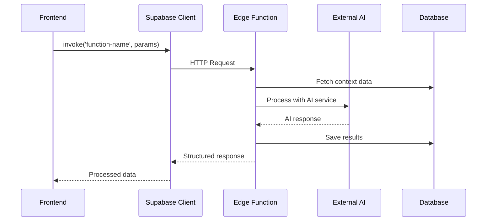

**Diagram sources**
- [useConversation.ts](file://src/hooks/useConversation.ts#L86-L96)
- [aiQuote.ts](file://src/lib/api/aiQuote.ts#L72-L83)

### Supabase Client Configuration

The Supabase client is configured for optimal performance and security:

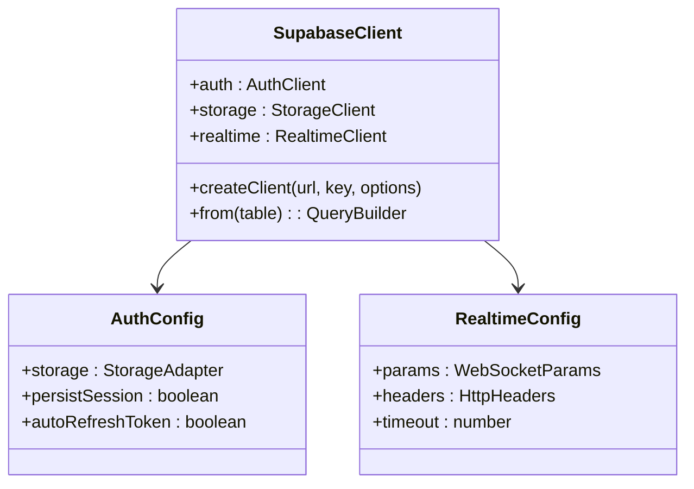

**Diagram sources**
- [client.ts](file://src/integrations/supabase/client.ts#L14-L20)

**Section sources**
- [useConversation.ts](file://src/hooks/useConversation.ts#L86-L96)
- [aiQuote.ts](file://src/lib/api/aiQuote.ts#L72-L83)
- [client.ts](file://src/integrations/supabase/client.ts#L14-L20)

## Performance Optimization

### Caching Strategies

The system implements intelligent caching to minimize API calls and improve responsiveness:

| Cache Type | Scope | TTL | Invalidation |
|------------|-------|-----|--------------|
| Conversation History | Session | Browser session | Manual clear |
| AI Responses | User session | 5 minutes | Message change |
| Industry Knowledge | Global | 1 hour | Database update |
| User Preferences | Profile | Permanent | User action |

### Realtime Performance

Realtime subscriptions are optimized for minimal bandwidth and latency:

- **Selective Listening**: Only listen for relevant events
- **Debounced Updates**: Prevent excessive state updates
- **Connection Pooling**: Reuse WebSocket connections
- **Graceful Degradation**: Fallback to polling when needed

### Memory Management

The system implements careful memory management for long-running conversations:

- **Message Trimming**: Limit conversation history length
- **Garbage Collection**: Clean up unused subscriptions
- **State Normalization**: Efficient state structure
- **Lazy Loading**: Load messages on demand

## Troubleshooting Guide

### Common Issues and Solutions

| Issue | Symptoms | Solution | Prevention |
|-------|----------|----------|------------|
| Connection Lost | Messages not updating | Check network, refresh page | Implement reconnection logic |
| Slow Response | Delayed AI replies | Verify Edge Function status | Monitor function performance |
| Authentication Failure | Cannot send messages | Check user session | Implement session validation |
| Rate Limiting | API errors | Wait for cooldown period | Implement client-side limits |

### Debugging Tools

The system provides comprehensive debugging capabilities:

- **Console Logging**: Detailed operation logs
- **Network Monitoring**: API call tracking
- **State Inspection**: Real-time state visualization
- **Error Boundaries**: Graceful error handling

### Performance Monitoring

Key performance metrics to monitor:

- **API Response Times**: Edge Function execution time
- **Realtime Latency**: WebSocket message delivery time
- **Memory Usage**: Component memory consumption
- **Error Rates**: System failure frequency

**Section sources**
- [useConversation.ts](file://src/hooks/useConversation.ts#L121-L147)
- [aiQuote.ts](file://src/lib/api/aiQuote.ts#L117-L146)