# Custom Hooks and Reusable Logic

<cite>
**Referenced Files in This Document**   
- [useQuotes.ts](file://src/hooks/useQuotes.ts)
- [useSuppliers.ts](file://src/hooks/useSuppliers.ts)
- [useOrders.ts](file://src/hooks/queries/useOrders.ts)
- [useAdminAuth.ts](file://src/hooks/useAdminAuth.ts)
- [useConversation.ts](file://src/hooks/useConversation.ts)
- [usePerformance.ts](file://src/hooks/usePerformance.ts)
- [useOptimisticUpdate.ts](file://src/hooks/useOptimisticUpdate.ts)
- [useNotifications.ts](file://src/hooks/queries/useNotifications.ts)
- [useAdminAuth.test.ts](file://src/hooks/__tests__/useAdminAuth.test.ts)
- [QuoteGenerator.tsx](file://src/pages/QuoteGenerator.tsx)
- [ProductionTracking.tsx](file://src/pages/ProductionTracking.tsx)
- [supabaseHelpers.ts](file://src/lib/supabaseHelpers.ts)
- [client.ts](file://src/integrations/supabase/client.ts)
</cite>

## Table of Contents
1. [Introduction](#introduction)
2. [Data Fetching Hooks](#data-fetching-hooks)
3. [State Management Hooks](#state-management-hooks)
4. [Authentication and Authorization](#authentication-and-authorization)
5. [Hook Composition Examples](#hook-composition-examples)
6. [Error Handling and Loading States](#error-handling-and-loading-states)
7. [Optimistic Updates](#optimistic-updates)
8. [Testing Strategies](#testing-strategies)
9. [Conclusion](#conclusion)

## Introduction

The hooks directory in this application contains a comprehensive collection of custom React hooks that encapsulate reusable logic and data-fetching patterns. These hooks leverage React Query for efficient data synchronization with Supabase, providing a robust foundation for the application's state management and data operations. The architecture follows a modular approach with specialized hooks for different domains including quotes, orders, suppliers, authentication, and performance monitoring.

The hooks are organized into several categories:
- Data fetching hooks in the `queries/` subdirectory that handle CRUD operations with Supabase
- State management hooks for specific application features like AI conversations and performance monitoring
- Utility hooks for common patterns like optimistic updates
- Authentication hooks for role-based access control

This documentation provides a comprehensive overview of these hooks, their implementation details, and how they work together to create a seamless user experience.

## Data Fetching Hooks

The data fetching hooks in this application are built on top of React Query and provide a consistent interface for interacting with Supabase. These hooks handle data retrieval, caching, pagination, and background updates, abstracting away the complexity of direct database operations.

### useQuotes Hook

The `useQuotes` hook manages all operations related to quote requests in the application. It provides several functions for different use cases:

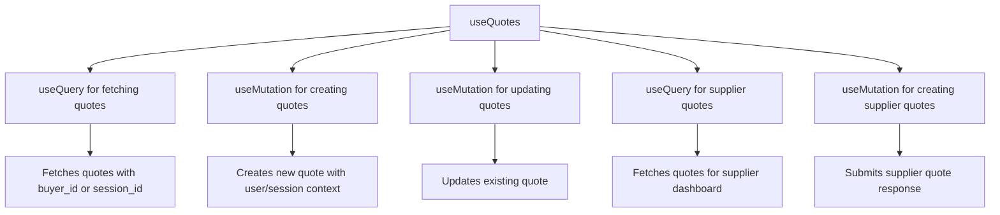

**Diagram sources**
- [useQuotes.ts](file://src/hooks/useQuotes.ts#L55-L261)

**Section sources**
- [useQuotes.ts](file://src/hooks/useQuotes.ts#L55-L261)

### useOrders Hook

The `useOrders` hook in the queries directory provides comprehensive functionality for order management with proper query key organization and caching strategies:

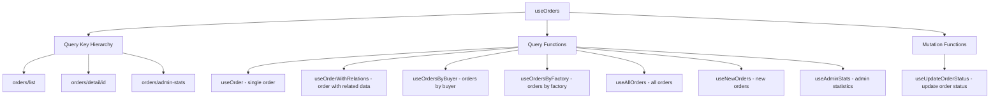

**Diagram sources**
- [useOrders.ts](file://src/hooks/queries/useOrders.ts#L6-L152)

**Section sources**
- [useOrders.ts](file://src/hooks/queries/useOrders.ts#L6-L152)

### useSuppliers Hook

The `useSuppliers` hook provides functionality for supplier management with client-side filtering and memoization for performance optimization:

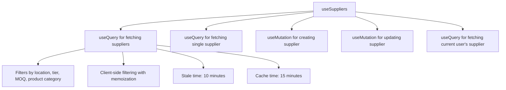

**Diagram sources**
- [useSuppliers.ts](file://src/hooks/useSuppliers.ts#L48-L215)
- [useSuppliers.ts](file://src/hooks/queries/useSuppliers.ts#L15-L49)

**Section sources**
- [useSuppliers.ts](file://src/hooks/useSuppliers.ts#L48-L215)
- [useSuppliers.ts](file://src/hooks/queries/useSuppliers.ts#L15-L49)

### Query Keys and Caching Strategy

The application implements a comprehensive query key strategy using the Query Key Factory pattern to ensure type safety and consistency:

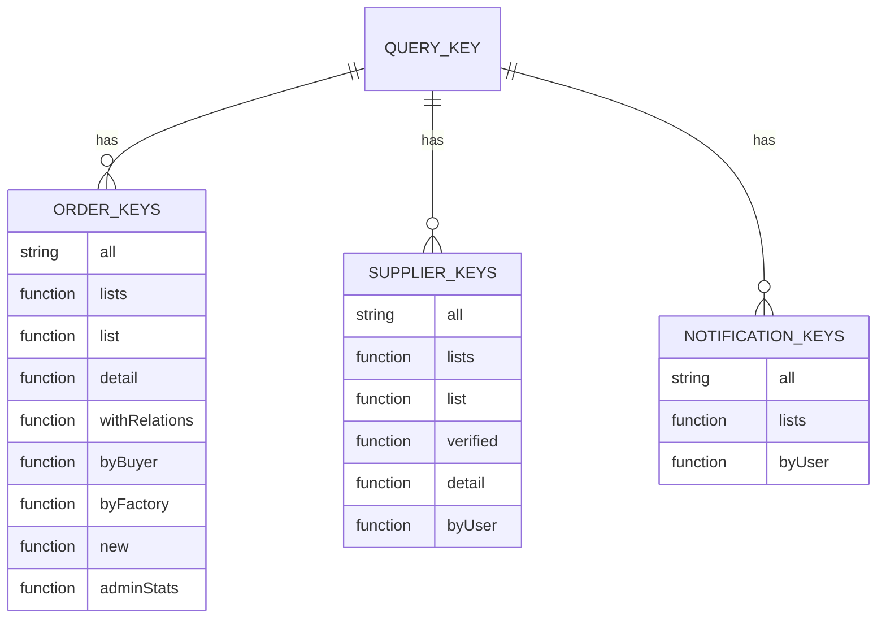

**Diagram sources**
- [useOrders.ts](file://src/hooks/queries/useOrders.ts#L6-L17)
- [useSuppliers.ts](file://src/hooks/queries/useSuppliers.ts#L5-L13)
- [useNotifications.ts](file://src/hooks/queries/useNotifications.ts#L6-L10)

**Section sources**
- [useOrders.ts](file://src/hooks/queries/useOrders.ts#L6-L17)
- [useSuppliers.ts](file://src/hooks/queries/useSuppliers.ts#L5-L13)
- [useNotifications.ts](file://src/hooks/queries/useNotifications.ts#L6-L10)

## State Management Hooks

The application includes several specialized hooks for managing complex state in specific features, particularly around AI interactions and performance monitoring.

### useConversation Hook

The `useConversation` hook manages the state for AI-powered conversational interfaces, handling message history, session persistence, and integration with serverless functions:

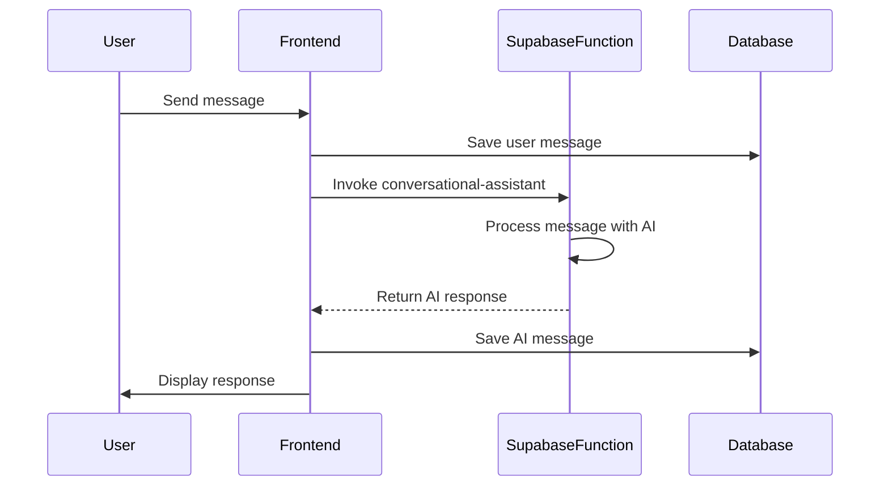

The hook implements several key features:
- Session persistence using localStorage
- Error handling with retry logic (up to 3 attempts)
- Toast notifications for connection issues
- Conversation state management with timestamps
- Integration with Supabase Edge Functions for AI processing

**Diagram sources**
- [useConversation.ts](file://src/hooks/useConversation.ts#L32-L177)

**Section sources**
- [useConversation.ts](file://src/hooks/useConversation.ts#L32-L177)

### usePerformance Hook

The `usePerformance` hook monitors Core Web Vitals and implements resource preloading strategies to enhance user experience:

```mermaid
flowchart TD
A[usePerformanceMonitoring] --> B[PerformanceObserver]
B --> C[First Contentful Paint]
B --> D[Largest Contentful Paint]
B --> E[Time to Interactive]
F[useResourcePreloading] --> G[requestIdleCallback]
G --> H[Prefetch likely next pages]
H --> I[/services]
H --> J[/contact]
```

Key features include:
- Measurement of Core Web Vitals (FCP, LCP, TTI)
- Performance rating based on Google's thresholds
- Development-time logging for debugging
- Idle-time resource prefetching for improved navigation
- Graceful degradation when Performance API is not supported

**Diagram sources**
- [usePerformance.ts](file://src/hooks/usePerformance.ts#L11-L107)

**Section sources**
- [usePerformance.ts](file://src/hooks/usePerformance.ts#L11-L107)

## Authentication and Authorization

The application implements a robust authentication and authorization system with server-side validation to prevent client-side tampering.

### useAdminAuth Hook

The `useAdminAuth` hook provides role-based access control with server-side validation:

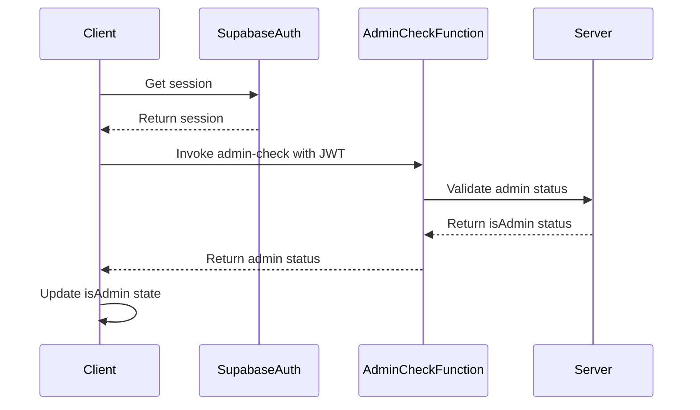

The hook implements several security features:
- Server-side admin validation using Supabase Edge Functions
- JWT token verification in the Authorization header
- Protection against client-side role manipulation
- Manual re-check capability for dynamic role changes
- Comprehensive error handling for network and authentication issues

**Diagram sources**
- [useAdminAuth.ts](file://src/hooks/useAdminAuth.ts#L5-L47)

**Section sources**
- [useAdminAuth.ts](file://src/hooks/useAdminAuth.ts#L5-L47)

## Hook Composition Examples

The application demonstrates effective hook composition in several key pages, combining multiple hooks to create complex functionality.

### QuoteGenerator Page

The QuoteGenerator page combines several hooks to create an AI-powered quote generation experience:

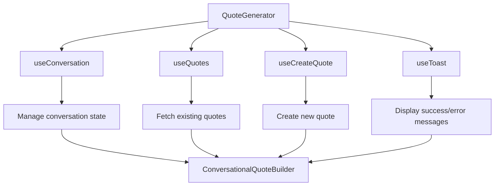

**Diagram sources**
- [QuoteGenerator.tsx](file://src/pages/QuoteGenerator.tsx#L1-L42)
- [useConversation.ts](file://src/hooks/useConversation.ts#L32-L177)
- [useQuotes.ts](file://src/hooks/useQuotes.ts#L55-L261)

**Section sources**
- [QuoteGenerator.tsx](file://src/pages/QuoteGenerator.tsx#L1-L42)

### ProductionTracking Page

The ProductionTracking page combines real-time data fetching with state management hooks:

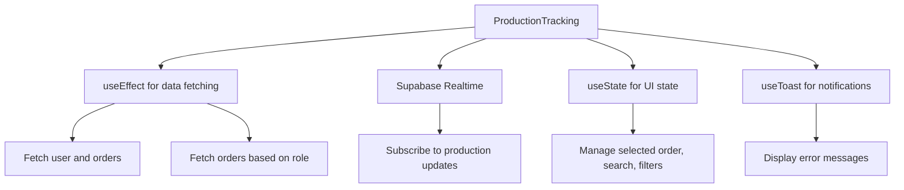

The page implements role-based data access:
- Admins see all orders
- Suppliers see their assigned orders
- Buyers see their own orders
- Real-time updates via Supabase subscriptions

**Diagram sources**
- [ProductionTracking.tsx](file://src/pages/ProductionTracking.tsx#L1-L200)

**Section sources**
- [ProductionTracking.tsx](file://src/pages/ProductionTracking.tsx#L1-L200)

## Error Handling and Loading States

The application implements comprehensive error handling and loading state management across all hooks.

### Global Error Handling Pattern

All data fetching hooks follow a consistent error handling pattern:

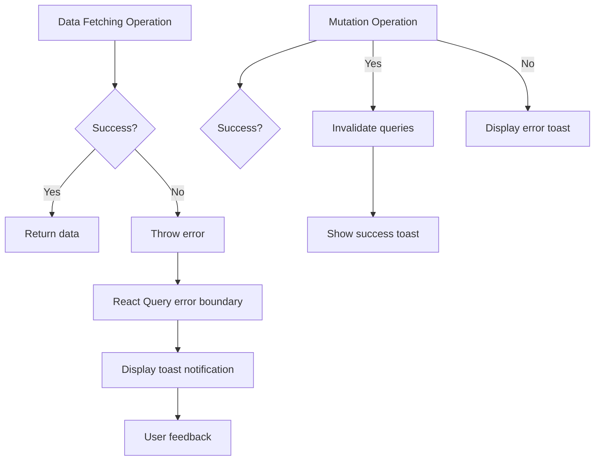

Key aspects include:
- Centralized toast notifications using Sonner
- Query invalidation on successful mutations
- Detailed error messages for user feedback
- Console logging for debugging in development

**Section sources**
- [useQuotes.ts](file://src/hooks/useQuotes.ts#L157-L159)
- [useOrders.ts](file://src/hooks/queries/useOrders.ts#L142-L143)
- [useSuppliers.ts](file://src/hooks/useSuppliers.ts#L161-L163)

### Loading State Management

The hooks manage loading states to provide feedback during asynchronous operations:

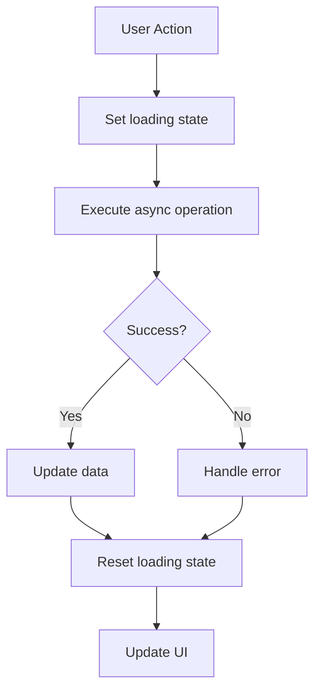

Loading states are exposed through hook return values:
- `isLoading` flag for data fetching hooks
- `isUpdating` flag for mutation hooks
- Skeleton components during initial loading
- Optimistic updates for immediate feedback

## Optimistic Updates

The application implements optimistic updates to enhance user experience by providing immediate feedback before server confirmation.

### useOptimisticUpdate Hook

The `useOptimisticUpdate` hook provides a generic solution for optimistic updates with automatic rollback:

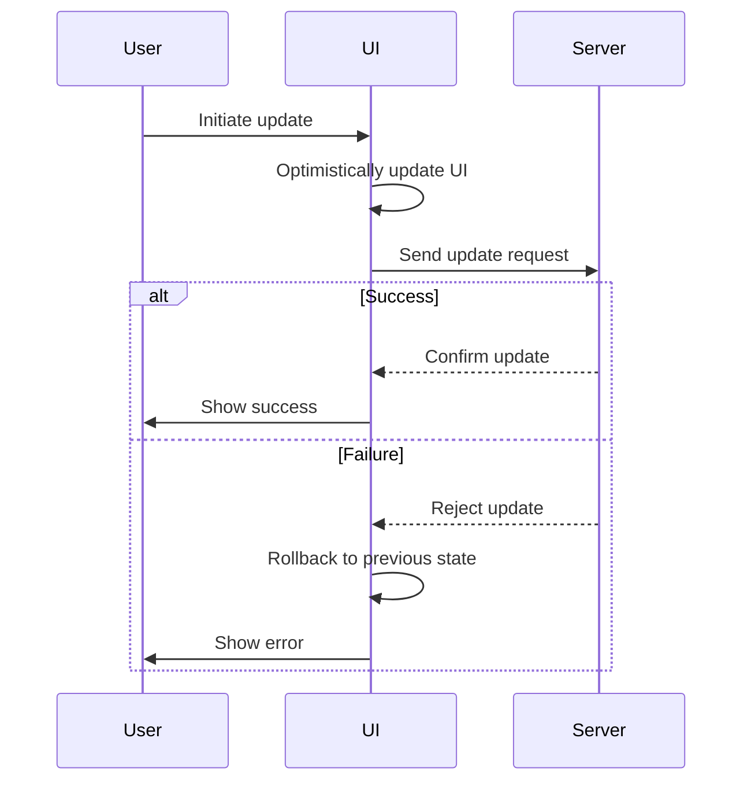

The hook implements the following pattern:
1. Store the current value as the rollback point
2. Optimistically update the UI with the new value
3. Attempt the server update
4. On success: keep the optimistic update
5. On failure: revert to the previous value and show an error

**Section sources**
- [useOptimisticUpdate.ts](file://src/hooks/useOptimisticUpdate.ts#L16-L74)

### Specialized Optimistic Update Hooks

The application includes specialized hooks for specific use cases:

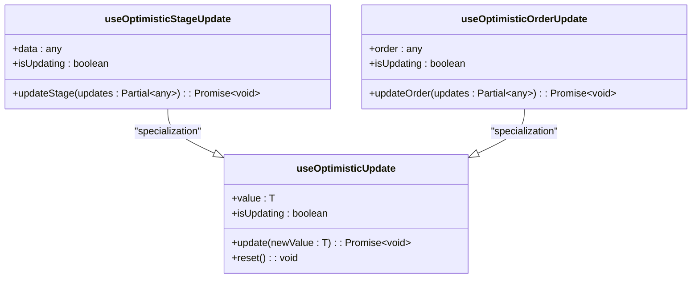

These specialized hooks provide domain-specific functionality while maintaining the core optimistic update pattern.

**Diagram sources**
- [useOptimisticUpdate.ts](file://src/hooks/useOptimisticUpdate.ts#L79-L176)

**Section sources**
- [useOptimisticUpdate.ts](file://src/hooks/useOptimisticUpdate.ts#L79-L176)

## Testing Strategies

The application implements comprehensive testing for its hooks, ensuring reliability and maintainability.

### useAdminAuth Test Suite

The `useAdminAuth.test.ts` file demonstrates a comprehensive testing strategy for authentication hooks:

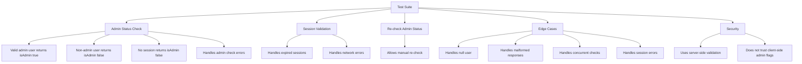

The test suite includes:
- Happy path testing for valid scenarios
- Error handling for various failure modes
- Edge case testing for unusual conditions
- Security testing to prevent client-side manipulation
- Mocking of Supabase client and functions
- Use of Vitest and React Testing Library

**Section sources**
- [useAdminAuth.test.ts](file://src/hooks/__tests__/useAdminAuth.test.ts#L20-L381)

### Testing Best Practices

The application follows several testing best practices:

1. **Comprehensive Coverage**: Tests cover all major functionality and edge cases
2. **Mocking**: External dependencies are properly mocked
3. **Isolation**: Tests are isolated and don't depend on external state
4. **Realistic Scenarios**: Tests simulate real user interactions
5. **Error Handling**: Tests verify proper error handling and recovery
6. **Security**: Tests verify security constraints are enforced

## Conclusion

The hooks system in this application provides a robust foundation for reusable logic and data management. By leveraging React Query for data fetching, implementing proper error handling and loading states, and following best practices for state management, the hooks enable a consistent and reliable user experience across the application.

Key strengths of the implementation include:
- Modular organization with clear separation of concerns
- Comprehensive type safety with TypeScript
- Efficient data caching and synchronization
- Robust error handling and user feedback
- Optimistic updates for improved UX
- Comprehensive testing strategy
- Security-focused authentication with server-side validation

The hooks are designed to be composable, allowing developers to combine them in various ways to create complex functionality while maintaining code readability and maintainability. This approach enables rapid development of new features while ensuring consistency and reliability across the application.